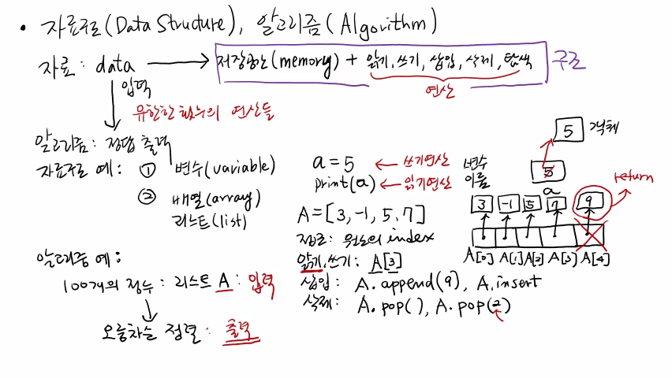
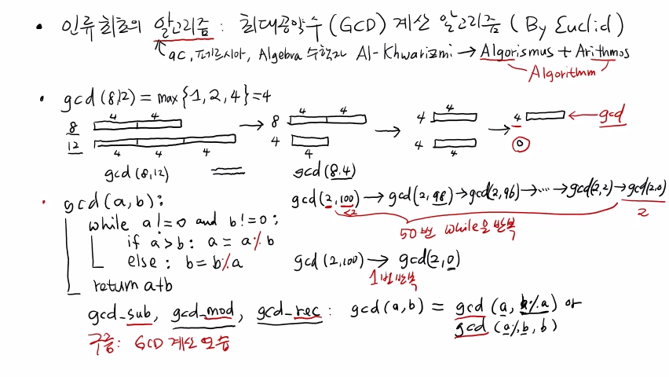

>
해당 포스트는 아래 수업들의 내용을 바탕으로 작성되었습니다.  
> - <a href='https://www.youtube.com/playlist?list=PLsMufJgu5933ZkBCHS7bQTx0bncjwi4PK' target='-blank'>'자료구조 - Data Structures with Python'</a>
> - <a href='https://www.youtube.com/playlist?list=PLsMufJgu5932XYejsOwcUDJ2F75f56nrl' target='-blank'>'알고리즘 - Algorithm with Python'</a>
>
\- Youtube :
<a href='https://www.youtube.com/channel/UCJ4SXKMLQucqaxt4A6PonwQ' target='-blank'>'Chan-Su Shin'</a>  
\- Professor : 신찬수 교수 (한국 외국어 대학교 컴퓨터 공학부)


# 1. 자료 구조와 알고리즘의 개념

자료 구조와 알고리즘의 개념에 대해 간략하게 설명한다.

## 1-1. 자료 구조(Data Structure)

말 그대로 '자료(data)' 를 담는 '구조(structure)' 다.

- 정보는 컴퓨터의 '기억 장치(memory)' 에 실제로 저장된다.
- 단순히 정보를 저장하는 것뿐만 아니라 아래의 작업들도 수행할 수 있어야 한다.

  ```
  - 읽기 : 저장된 정보를 읽어올 수 있어야 한다.
  - 쓰기 : 새로운 정보를 써넣을 수 있어야 한다.
  - 삽입 : 필요에 따라서는 새로운 정보를 삽입할 수 있어야 한다. (정보가 여러 개 있는 경우 등)
  - 삭제 : 기존에 불필요한 정보가 있다면 삭제할 수 있어야 한다.
  - 탐색 : 원하는 정보를 탐색할 수 있어야 한다.
  ```

- 자료 구조에서 지원되는 위와 같은 연산들을 통해 저장된 정보들을 효과적으로 처리할 수 있다.
- 따라서, '기억 장치' 와 '연산' 으로 구성된 형태를 '자료 구조' 라고 할 수 있다.

<br>

> 또, 지원되는 연산에 따라서 다양한 종류의 자료 구조가 존재한다.

## 1-2. 알고리즘(Algorithm)

'알고리즘' 은 자료 구조에 저장된 정보를 입력받아 문제를 해결하는 논리적인 절차다.

- 입력을 가지고 유한한 횟수의 연산들을 반복해서 어떠한 정답을 출력하는 것이다.
- 자료 구조에 담긴 정보를 가공한 후에, 다양한 연산들을 통해 원하는 정답을 출력하는 것이다.
- 때문에, 알고리즘과 자료 구조는 바늘과 실처럼 서로 뗄 수 없는 존재라고 할 수 있다.

# 2. 자료 구조의 예시

가장 간단한 자료 구조의 예시는 다음과 같다.

## 2-1. 변수(variable)

가장 간단한 예로는 변수(variable) 가 있다.

> 변수에 값을 저장하기도 하고, 읽기와 쓰기가 가능하기 때문이다.

```python
a = 5    # <- 변수 a 라는 저장 공간에 값 5를 저장하는 문장 (쓰기 연산)
print(a) # <- 변수 a 의 값을 읽어와서 화면에 출력하는 문장 (읽기 연산)
```

- 이 때, 변수명인 'a' 를 통해 정보에 접근한다.
- 변수명만 알면 값을 쓸 수 있고, 변수명을 호출해 읽을 수도 있다.
- 하지만, 이 경우에는 값이 하나밖에 저장되지 않기 때문에,  
  새로운 값을 삽입, 삭제, 탐색하는 것에는 의미가 없다.

> #### 파이썬에서는
a 라는 변수가 있으면, 5라는 값이 실제로 저장되는 것이 아니라,  
5가 저장되어 있는 기억 장치의 실제 주소가 저장된다.
>
이는 C 언어의 포인터 변수와 유사한데,  
5가 들어있는 객체의 주소가 a 에 담기는 것이다.

## 2-2. 배열(array)

다음 예시로는 배열(array) 이 있다.

- 파이썬에서는 실제로 'array' 가 있긴 하지만, 리스트가 배열의 역할을 하기도 한다.

```python
A = [3, -1, 5, 7]
A[0] # => 3
A[1] # => -1
A[2] # => 5
A[3] # => 7
```

- 위와 같이, 인덱스(index) 는 0에서 부터 시작한다.
- 각 원소의 인덱스로 접근하므로, `배열 이름[인덱스]` 를 활용하여 읽기와 쓰기가 가능하다.
- 하나의 값만 있는 것이 아니라 여러 개의 값이 담겨있기 때문에, 새로운 값을 리스트에 삽입할 수 있다.
   - 파이썬에서는 `append` 라는 연산을 사용한다.
```python
A.append(9)
print(A)    # => [3, -1, 5, 7, 9]
A[4]        # => 9
```
   - append 연산은 맨 뒤에 하나 더 원소를 마련해서, 그 원소가 9를 나타내는 주소 값을 가리키도록 한다.
   - 이외에도, `insert` 라는 함수도 제공한다. (이는 다음에 살펴볼 것이다.)
- 배열의 원소를 삭제하는 `pop` 이라는 연산도 제공한다.
   - 이 때, 아무런 인자가 주어지지 않으면, 가장 뒤에 있는 값을 반환하고, 삭제한다.
   - 이외에도, 인자로 값이 주어지면, 해당 인덱스의 값이 반환되면서, 삭제된다.
```python
A.pop()  # => 9
print(A) # => [3, -1, 5, 7]
A.pop(2) # => 5
print(A) # => [3, -1, 7]
```

파이썬에선 이렇게 읽기, 쓰기, 삽입, 삭제와 같은 연산들을 리스트 자체에서 지원한다.

<br>

<details><summary>참고 : 실제 교수님 강의 화면 필기 내용</summary>



</details>

# 3. 알고리즘에 대한 자세한 설명

더 자세하게 설명하기에 앞서, 알고리즘이라는 말의 기원부터 알아보자.

## 3-1. 알고리즘의 기원

- 9세기 정도의 페르시아에는 대수학(Algebra) 에 재능이 있는 수학자가 있었다.
- 이름이 'Al-Khwarizmi' 였던 그는 대수와 0에 관한 책을 작성했다.
- 이 책이 라틴어로 번역되어 유럽으로 넘어가게 되었다.
   - 그의 이름은 'Algorismus' 으로 번역되었다.
   - 그 책의 제목에는 수를 나타내는 라틴어 단어 'Arithmos' 가 적혀있었다.
- 이 때, '**Algor**ismus' 와 'Ar**ithm**os' 이 합쳐져, **'Algorithm'** 이 되었다는 썰이 있다. (?)

<br>

> 이 내용은 믿거나 말거나한 썰이지만, 현재는 정설로 받아들여지고 있다.

## 3-2. 인류 최초의 알고리즘

- 인류 최초의 알고리즘은 최대공약수(GCD) 계산 알고리즘이다. (By. Euclid)
- 최대공약수는 두 수가 공통으로 나눠떨어지는 약수(공약수) 의 최대 값을 구하면 된다.
- 이후 내용에선, 8과 12의 최대공약수를 구하는 과정을 예시로 살펴볼 것이다.
```
gcd(8, 12) = max{1, 2, 4} = 4
```

- 유클리드는 '어떤 식으로 두 수의 최대공약수를 구할 수 있을까?' 생각을 해봤다.

<br>

<details><summary>유클리드의 생각을 간단한 그림과 함께 살펴보자.</summary>

- 8이라는 값을 막대기의 길이로 표현한다.
```
8 = (ㅁㅁㅁㅁㅁㅁㅁㅁ)
```

- 이 때, 길이가 4인 막대기 2개로 표현할 수 있다.
```
8 = (ㅁㅁㅁㅁ|ㅁㅁㅁㅁ)
```

- 12는 길이가 4인 막대기를 3개 붙이면 완성된다.
```
12 = (ㅁㅁㅁㅁ|ㅁㅁㅁㅁ|ㅁㅁㅁㅁ)
```

</details>

<br>

- 현재는 8과 12의 최대공약수를 모르는 상황이다.
- 하지만, 최대공약수가 존재한다면, 두 숫자 모두 그 최대공약수의 몇 배로 표현할 수 있다.

<br>

<details><summary>그래서, 유클리드는 '큰 수에서 작은 수를 빼주자.' 라고 생각했다.</summary>

- 8은 작은 수이므로 막대기의 길이가 변하지 않는다.
```
8 = (ㅁㅁㅁㅁ|ㅁㅁㅁㅁ)
```
- '12 - 8 = 4' 이므로, 막대기의 길이는 4가 된다.
```
12 - 8 = (ㅁㅁㅁㅁ|ㅁㅁㅁㅁ|ㅁㅁㅁㅁ) - (ㅁㅁㅁㅁ|ㅁㅁㅁㅁ) => (ㅁㅁㅁㅁ) = 4
```

</details>

<details><summary>이 때, gcd(8, 12) 와 gcd(8, 4) 를 비교해도 결과는 변하지 않기 때문에, 이 과정을 반복한다.</summary>

- 작은 수인 4는 그대로이고, '8 - 4 = 4' 가 된다.
```
4 = (ㅁㅁㅁㅁ)
8 - 4 = (ㅁㅁㅁㅁ|ㅁㅁㅁㅁ) - (ㅁㅁㅁㅁ) => (ㅁㅁㅁㅁ) = 4
```
- 다시 반복하면, 한 쪽의 4는 그대로이고, '4 - 4 = 0' 이 된다.
```
4 = (ㅁㅁㅁㅁ)
4 - 4 = (ㅁㅁㅁㅁ) - (ㅁㅁㅁㅁ) => () = 0
```

</details>

<details><summary>이렇게, 한 쪽의 수가 0이 될 때까지 큰 수에서 작은 수를 빼면 최대공약수를 구할 수 있다.</summary>

- 둘 중 하나가 0이 될 때까지 큰 수에서 작은 수를 빼는 것을 반복한다.
   - 이 때, 두 수의 크기를 비교하기 위해, 조건문을 사용한다.

```python
def gcd(a, b):
    while a != 0 and b != 0:
        if a > b: a = a - b
        else : b = b - a
```

- 둘 중에 하나를 반환할 수도 있지만, 둘 중 하나는 무조건 0이 되므로, 두 수를 더한 값을 반환한다.

```python
def gcd(a, b):
    while a != 0 and b != 0:
        if a > b: a = a - b
        else : b = b - a
    return a + b
```

</details>

<details><summary>이 때, gcd(2, 100) 을 구한다고 가정해보자.</summary>

```
gcd(2, 100) => gcd(2, 98) => gcd(2, 96) => ... => gcd(2, 2) => gcd(2, 0) = 2
```
- a의 값은 작고 b의 값은 훨씬 크기때문에, 100이 2보다 작아질 때까지 계속 반복된다.
   - 위의 경우, while 문 내부의 코드가 50번 수행된다.
- 이것은 '큰 수가 작은 수보다 작아질 때까지 빼는 것' 과 같다.
- 또, 이것은 '100을 2로 나눈 나머지' 가 나올 때까지 빼기를 반복하는 것과 같다.

</details>

<details><summary>결과적으로, 큰 수를 작은 수로 나눈 나머지를 구하는 것과 같다.</summary>

```python
def gcd(a, b):
    while a != 0 and b != 0:
        if a > b: a = a % b
        else: b = b % a
    return a + b
```

</details>

<details><summary>이 때, 단 한 번의 계산으로 gcd(2, 100) 을 구할 수 있게 된다.</summary>

- 100을 2로 나눈 나머지는 0이기 때문이다.
```
gcd(2, 100) => gcd(2, 0)
```
- 결국, 최대공약수는 반복적으로 빼던, 나머지를 구하던 같은 결과가 나온다.
- 하지만, 나머지를 구하는 방법이, 단순히 빼는 방법보다 일반적으로 더 빠르다.
- 따라서, 나머지를 구해서 최대 공약수를 구하는 알고리즘(방법) 이 훨씬 더 효율적이다.

</details>

<details><summary>위에서 살펴본 2가지 방법을 정리해보자.</summary>

- 이렇게 살펴본 2가지 방법을 정리하면 아래와 같다.
   - gcd_sub : 빼기(subtract) 를 활용한 방법
   - gcd_mod : 나머지(modulo) 를 활용한 방법

</details>

<details><summary>또, while 문을 이용하는 대신, 자기 자신(함수) 을 재귀적(reculsive) 으로 호출하는 방법도 있다.</summary>

- 위 방법들과 구분짓기 위해 gcd_rec 라고 부를 것이다.

```python
gcd(a, b) = gcd(a, b % a) or gcd(a % b, b)
```

</details>

<br>

이렇게, 빼기를 이용한 방법, 나머지를 이용하는 방법, 재귀적인 방법으로 총 3개의 방법이 있다.

<br>

<details><summary>참고 : 실제 교수님 강의 화면 필기 내용</summary>



</details>

<br>

- 20210418 - 맞춤법 수정(한번의 -> 한 번의)
