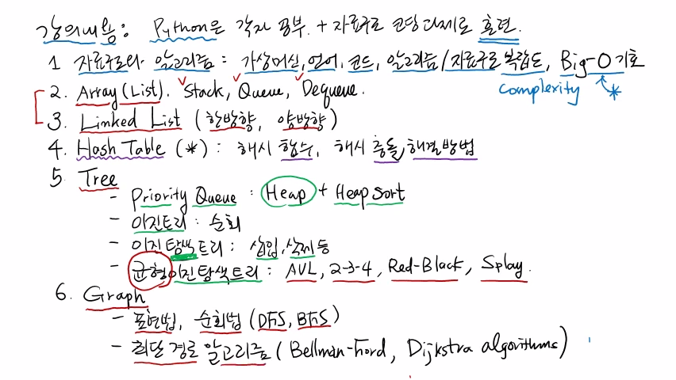

>
해당 포스트는 아래 수업들의 내용을 바탕으로 작성되었습니다.  
> - <a href='https://www.youtube.com/playlist?list=PLsMufJgu5933ZkBCHS7bQTx0bncjwi4PK' target='-blank'>'자료구조 - Data Structures with Python'</a>
> - <a href='https://www.youtube.com/playlist?list=PLsMufJgu5932XYejsOwcUDJ2F75f56nrl' target='-blank'>'알고리즘 - Algorithm with Python'</a>
>
\- Youtube :
<a href='https://www.youtube.com/channel/UCJ4SXKMLQucqaxt4A6PonwQ' target='-blank'>'Chan-Su Shin'</a>  
\- Professor : 신찬수 교수 (한국 외국어 대학교 컴퓨터 공학부)

# 0. 강의 내용

**<실제 수강생을 대상으로 한 내용은 생략>**

- 파이썬, 구름 에듀 사용법에 대해 간략한 설명
- 프로그래밍 언어 관련 내용은 생활 코딩 참고 권유

# 1. 자료 구조와 알고리즘

> 가상 머신, 언어, 코드, 알고리즘 / 자료 구조, Big-O 기호

- 다음 강의에서 진행할 내용은 자료 구조와 알고리즘의 관계에 대해서 설명할 것이다.
- 자료 구조와 알고리즘의 정의, '효율성' 의 의미에 대해서 다룬다.
- 이를 위해 가상 머신과 프로그래밍 언어, 코드와 같은 개념을 설명할 것이다.
- 효율성을 따지기 위해, **'복잡도(Complexity)'** 의 개념을 다룬다.
- 복잡도라는 개념을 수치로 표현하기 위해 **'Big-O 표기법(Big-O notation)'** 을 다룬다.
   - 점근 표기법(Asymptotic notation), 란다우 표기법(Landau notation) 이라고 부르기도 한다.

# 2. 배열을 활용한 자료 구조들

> Array(List), Stack, Queue, Deque

- 가장 중요한 자료 구조 중 하나인 **'배열(Array)'** 을 다룬다.
   - 파이썬에서는 **'리스트(List)'** 라고 한다.
- 배열을 활용한 대표적인 자료 구조들을 다뤄볼 것이다.
   - **'스택(Stack)'**, **'큐(Queue)'**, **'덱(Deque)'**

# 3. 연결 리스트(Linked List)

- 연결 리스트와 배열은 서로 상반된 특성을 갖고 있다.
   - 때문에, 서로 다른 장/단점을 갖고 있다.
- 연결 리스트의 종류에는 한방향과 양방향이 있다.

# 4. 가장 많이 사용되는 해시 테이블(Hash Table)

- 가장 많이 사용되며, 굉장히 강력한 자료 구조이다.
- 관련된 개념에서 가장 중요한 내용은 크게 2가지가 있다.
   - **'해시 함수(Hash Function)'**
   - 해시값 혹은 해시 함수가 충돌했을때의 해결 방법

# 5. 좀 더 복잡한 자료 구조인 트리(Tree)

- 배열과 연결 리스트보다 조금 더 복잡한 형태이고 굉장히 중요하다.
- 맨 처음에는 **'우선순위 큐(Priority Queue)'** 라는 트리를 다룬다.
   - **'힙(Heap)'** 은 우선순위 큐와 같다. (힙은 '힙 트리'라고 부르기도 한다.)
   - 힙을 이용하면 **'힙 정렬(Heap Sort)'** 를 할 수 있다.
- 다음으로는 **'이진 트리(Binary Tree)'** 를 다룬다.
   - 트리 중에서도 가장 많이 사용되는 트리 형태이다.
   - 이진 트리를 방문하는 방법을 다룬다.
      - 이를 '순회' 라고 한다.
- 이진 트리 중에서도 주로 사용되는 **'이진 탐색 트리(Binary Search Tree)'** 를 다룬다.
   - 이진 탐색 트리에 새로운 값을 넣거나, 기존에 있던 값을 지우는 연산을 어떻게 하는지를 다룬다.
      - 이를 '삽입', '삭제' 라고 한다.
- 이진 탐색 트리 중에서도 **'균형 이진 탐색 트리(Balanced Binary Search Tree)'** 를 다룬다.
   - 실제 어플리케이션에서 대부분 사용한다.
   - 총 4가지 종류를 배운다 : AVL, 2-3-4, Red-Black, Splay  
     `(어느 대학의 자료 구조 과목에서도 위의 4가지를 모두 다루지는 않을 것이라고 한다..)`

# 6. 가장 일반적인 자료 구조인 그래프(Graph)

- 기본적인 표현법과 각 노드를 돌아보는 순회법(DFS, BFS) 에 대해 다룬다.
- 그래프를 사용하는 대표적인 알고리즘인 최단 경로 알고리즘을 살펴볼 것이다.
   - Bellman-Ford, Dijkstra Algorithm 등이 있다.

 

참고 : 실제 교수님 강의 화면 필기 내용

 

- 20210430 - 오타 수정(dequeue -> deque)
- 20210516 - 포스팅 제목 변경(0. 강의 소개 -> 1. 자료 구조 - 강의 소개)
