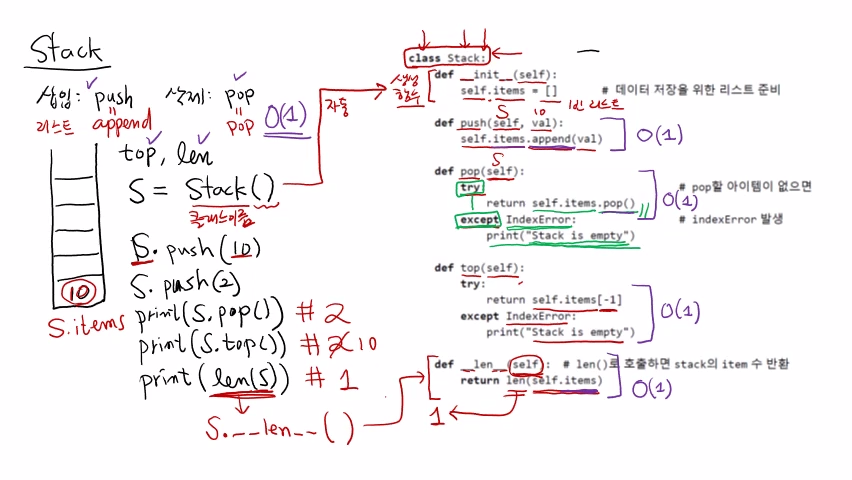
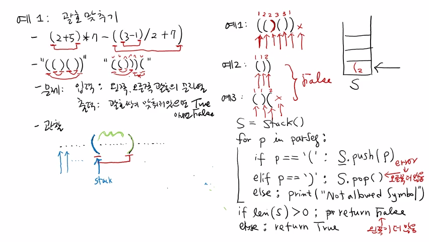

>
해당 포스트는 아래 수업들의 내용을 바탕으로 작성되었습니다.
> - ['자료구조 - Data Structures with Python'](https://www.youtube.com/playlist?list=PLsMufJgu5933ZkBCHS7bQTx0bncjwi4PK)
> - ['알고리즘 - Algorithm with Python'](https://www.youtube.com/playlist?list=PLsMufJgu5932XYejsOwcUDJ2F75f56nrl)
>
\- Youtube :
['Chan-Su Shin'](https://www.youtube.com/channel/UCJ4SXKMLQucqaxt4A6PonwQ)  
\- Professor : 신찬수 교수 (한국 외국어 대학교 컴퓨터 공학부)


# 1. 스택(Stack)

배열과 리스트에 이어서, 순차적 자료 구조의 하나인 스택(stack) 에 대해 살펴보자.

## 1-1. 스택의 특징

스택은 최소한 2가지 함수 혹은 연산을 제공한다.

> 모든 자료 구조는 삽입, 삭제 연산을 기본으로 제공한다. (+ 경우에 따라 탐색까지)

- 이 때, 스택의 삽입 연산은 push(), 삭제 연산은 pop() 이라고 한다.

<br>

스택은 리스트를 수직으로 세워놓은 듯한 형태로 표현할 수 있다.

```
      push(5) push(-1) push(3)  pop()   pop()
[ ]     [ ]     [ ]      [ ]     [ ]     [ ]
[ ]     [ ]     [ ]      [ ]     [ ]     [ ]
[ ]     [ ]     [ ]      [ ]     [ ]     [ ]
[ ]     [ ]     [ ]      [3]     [ ]     [ ]
[ ]     [ ]     [-1]     [-1]    [-1]    [ ]
[ ]     [5]     [5]      [5]     [5]     [5]
```

- push(5) 를 하면 5, push(-1) 을 하면 그 위에 -1, push(3) 을 하면 그 위에 3이 삽입된다.
- 밑에서부터 차례대로 탑을 쌓듯이 삽입되며, 중간에 값을 끼워 넣는 식으로 삽입할 수 없다.
- pop() 을 하면 마지막에 들어온 값이 반환되며, 다시 pop() 을 하면 그다음 값이 반환된다.
- 스택은 이런 식으로 밑에서부터 저장되고 마지막에 들어온 값부터 제거되는 자료 구조다.

## 1-2. 리스트와의 비교

물론, 스택을 리스트와 비슷한 자료 구조라고 생각할 수도 있다.

- 리스트에서는 가장 오른쪽에 있는 빈칸에 값을 삽입하는 append() 함수를 사용한다.
- 리스트를 세우면 스택으로 볼 수 있으므로, push() 와 append() 를 같다고 볼 수 있다.
- 또한, 스택의 pop() 은 마지막 위치의 값이 제거되고 반환되는 리스트의 pop() 과 같다.
   - 단, 리스트의 pop() 이 인자 없이 호출되는 경우에만 해당한다.

<br>

틀린 말은 아니지만, 그럼에도 리스트를 스택으로 사용하지 않는 이유가 있다.

- 스택과 비교했을 때, 리스트는 훨씬 더 다양하고 강력한 연산들을 많이 제공한다.
- 그러나, 스택은 push() 와 pop() 을 통해서만 스택에 있는 값들을 변경할 수 있다.
- 이 때, 리스트를 사용하다가 실수로 다른 함수를 이용하는 상황이 발생할 수 있다.
- 따라서, 제공되는 연산을 미리 지정해둠으로써 이러한 실수를 줄일 필요가 있다.

<br>

따라서, 강의 화면에 있는 것과 같이, 별도의 클래스를 만들어 사용할 것이다.

> 클래스 내부에서는 값을 저장하기 위해 간접적으로 리스트를 사용할 것이다.

## 1-3. 구현에 앞서,

클래스 관련 내용을 모두 다룰 수는 없으므로, 직접 공부하기를 권장한다.

- 대신, 자료 구조마다 클래스를 선언하니, 수업 내용을 참고하길 바란다.

클래스와 관련하여 꼭 알아야 할 내용을 정리하면 아래와 같다.

- 클래스 선언 방법, 메소드 기능/정의하는 방법, 매직 메소드(special method) 종류

<br>

스택이 push() 와 pop() 외에 다른 연산들을 제공한다면 사용하기 더 편리해질 것이다.

- 그중에서 대표적인 것은 top() 이며, 스택의 마지막에 있는 값을 반환하는 함수다.
   - 이는 pop() 과 비슷한데, 값을 지우지 않고 반환하기만 한다.
- 다음으로 유용한 함수는 len() 이며, 스택의 길이(length) 를 반환하는 함수다.
   - 리스트와 마찬가지로 내부에 저장된 값의 개수를 반환한다.
- top() 과 len() 는 있을 수도 있고 없을 수도 있지만, 제공해서 나쁠 것은 전혀 없다.

## 1-4. 클래스 구현

우선, 클래스라는 키워드와 'Stack' 이라는 이름을 작성하여 선언을 시작한다.

- 이 때, 클래스의 이름은 강제되진 않지만, 관례상 대문자로 시작한다.

```python
class Stack:
    def __init__(self):
        self.items = []             # 데이터 저장을 위한 리스트 준비

    def push(self, val):
        self.items.append(val)

    def pop(self):
        try:                        # pop할 아이템이 없으면
            return self.items.pop()
        except IndexError:          # indexError 발생
            print('Stack is empty')

    def top(self):
        try:
            return self.items[-1]
        except IndexError:
            print('Stack is empty')

    def __len__(self):              # len() 로 호출하면 stack의 item 수 반환
        return len(self.items)
```

### 1-4-1. 생성 함수

처음으로 등장하는 '\__init\__' 이라는 이름의 메소드(함수) 는 일종의 생성 함수다.

- 'Stack' 이라는 클래스에 대한 객체를 생성할 때, 이 함수가 호출된다.
- 생성 함수의 이름은 '\__init\__' 으로 정해져 있으므로, 바꿀 수 없다.
- 매개 변수는 self 이며, 생성 함수에 의해 생성된 객체 자체를 나타낸다.
   - 다른 함수에서도 객체를 가리키는 self 라는 매개 변수를 찾아볼 수 있다.
- 클래스 내부에 있는 메소드의 매개 변수는 객체를 가리키는 self 로 시작해야 한다.
- 그 이외의 매개 변수들은 메소드에 맞게, 원하는 대로 얼마든지 추가할 수 있다.

<br>

이 때, 클래스 이름을 함수처럼 호출하면, 자동으로 생성 함수가 호출된다.

```python
def __init__(self):
    self.items = []

S = Stack()
```

```
[ ]
[ ]  <- S.items
[ ]
```

- 위의 경우, Stack 이라는 함수의 생성 함수가 호출되어 객체가 생성된다.
   - 이 때, 객체에 들어갈 여러 가지 멤버 변수들이 필요하다.
- 값이 저장될 장소는 self 라는 객체의 items 라는 멤버 변수(= []) 다.
   - 이 때, self 뒤에 있는 '.' 은 멤버를 나타내는 연산자다.
- 처음에는 아무것도 들어있지 않아서, 초기값은 비어있는 리스트가 된다.
   - push() 되면 새로운 값이 들어오고, pop() 되면 마지막 값이 나올 것이다.
   - 즉, items 라는 리스트가 실제로는 스택의 역할을 하는 것이다.

### 1-4-2. 삽입 함수

이 때, 값을 삽입하려면, S 객체의 push() 메소드를 호출해야 한다.

```python
def push(self, val):
    self.items.append(val)

S.push(10)
S.push(2)
```

```
 ⤹ 10, 2
[ ]
[2]
[10]
```

- S.push(10) 에서, self 는 객체 S, 두 번째 인자 val 은 10이다.
- 즉, Stack 클래스의 객체인 S에 10이라는 값을 push() 하라는 뜻이다.
- 실제로는 self.items 라는 리스트에 append() 되어 값이 삽입된다.
- 여기서 다시 S.push(2) 를 하면, 2라는 값이 스택에 삽입된다.

### 1-4-3. 삭제 함수

여기서 S.pop() 의 결과를 출력해보면, 가장 위에 저장된 값인 2가 지워지며 반환된다.

```python
def pop(self):
    try:
        return self.items.pop()
    except IndexError:
        print('Stack is empty')

print(S.pop()) # 2
```

```
[ ]
[2]  -> [ ]
[10]
```

- 이 때, 지워야 할 값이 이미 정해져 있으므로, 별도의 매개 변수는 필요 없다.
- 따라서, pop() 함수의 매개 변수도 Stack 의 객체를 가리키는 self 로만 구성된다.
- try except 구문은 예외(exception) 또는 에러 처리(error handling) 를 담당한다.
   - try 블록의 코드를 시도(try) 하다가 에러가 발생하면, except 블록의 문장을 수행한다.
   - except 키워드 뒤에 명시된 에러가 발생한 경우에만 except 블록의 명령들이 수행된다.
   - IndexError 는 참조/삽입/삭제 과정에서 유효한 인덱스를 명시하지 않은 경우에 발생한다.
- 여기서 try 하는 문장은 self 내부의 items 에 대해 pop() 연산을 수행하는 명령이다.
   - items 가 비어있다면, 없는 인덱스의 값을 삭제해야 하므로, 에러를 일으킨다.
   - 반대의 경우에는, 에러 없이 정상적으로 수행되며, except 블록의 코드는 무시된다.
   - 스택이 비어있을 때 에러가 발생하므로, 'Stack is empty' 라는 에러 메시지를 출력한다.
   - 이러한 try except 구문을 사용하면, 굉장히 우아하게 에러를 처리할 수 있다.
- 위의 상황에서 pop() 하면, 가장 마지막 값인 2가 지워지면서 반환된다.

### 1-4-4. 원소 확인

여기서 마지막 원소를 반환하는 S.top() 의 결과를 출력한다고 가정해보자.

```python
def top(self):
    try:
        return self.items[-1]
    except IndexError:
        print('Stack is empty')

print(S.top()) # 10
```

```
[ ]
[ ]
[10] -> print()
```

- top() 은 값을 지우지 않고, 인덱스를 이용해 마지막 값을 반환한다.
- self.items 의 가장 마지막 인덱스(-1) 에 해당하는 값을 확인한다.
   - 이렇게, 파이썬은 C 언어와 다르게 음수 인덱스(-1) 를 사용할 수 있다.
- pop() 과 마찬가지로 try except 구문을 사용한다.
   - 스택이 비어있을 때 IndexError 가 발생하며, 에러 메시지를 출력한다.

### 1-4-5. 길이 확인

다음으로, 스택의 길이를 반환하는 len(S) 의 결과를 출력한다고 가정해보자.

```python
def __len__(self):
    return len(self.items)

print(len(S)) # 1
```

```
[ ]
[ ]
[10] <-
```

- 이 때, len(S) 의 결과로 S에 저장된 원소의 개수인 1이 반환된다.
   - 이렇게, len() 를 사용할 수 있게 하는 매직 메소드가 있다.
- self.items 에 있는 원소의 개수(크기) 를 '\__len\__' 메소드가 반환한다.

> #### 정리하자면,
len(S) 를 호출하면, 파이썬은 자동으로 S의 매직 메소드인 '\__len\__' 를 호출한다.

## 1-5. 매직 메소드 정리

이렇게 구현한 Stack 클래스를 통해, 2개의 매직 메소드에 대해 살펴봤다.

> 생성 함수인 '\__init\__' 과 크기(length) 를 반환하는 '\__len\__' 에 대해 알아봤다.

- 이 때, length 가 필요한 경우가 아니라면, 메소드를 포함하지 않아도 된다.
- 생성 함수가 없는 경우, 아무런 attribute(멤버 변수) 도 갖지 않는 기본 생성 함수가 호출된다.

## 1-6. 수행 시간 파악

> 각각의 연산에 대한 수행 시간은 의외로 쉽게 파악할 수 있다.

- push() 는 맨 뒤에 값을 추가하는 append() 를 수행하므로, 상수 시간(O(1)) 이 필요하다.
- pop() 은 맨 뒤의 값을 삭제하는 리스트의 함수를 그대로 사용하므로, 상수 시간이 필요하다.
   - append(), pop() 은 내부의 다른 값들에 영향을 주지 않기 때문이다.
- top() 도 마찬가지로, 맨 뒤의 값을 확인만 하므로 상수 시간이 필요하다.
- '\__len\__' 혹은 len() 함수도 상수 시간이 필요하다.
   - 왜냐하면, 파이썬의 리스트는 자신의 길이를 항상 관리하고 있기 때문이다.
   - 내부에 있는 값의 개수를 항상 유지하고 있으므로, 그 값만 반환하면 된다.

<br>

결론적으로, 스택은 모든 연산이 상수 시간에 수행되는 자료 구조라고 할 수 있다.

<br>

<details><summary>참고 : 실제 교수님 강의 화면 필기 내용</summary>



</details>

# 2. 예시와 함께 살펴보기

이번에는 스택을 이용해서 할 수 있는 일들을 살펴볼 것이다.

> 참고 : 영상에서는 2가지 예시를 살펴본다고 했지만, 실제로는 1개의 예시를 살펴본다.

## 2-1. 괄호 맞추기

이러한 수식이 주어졌을 때, 사람은 어떤 괄호가 쌍을 이루는지 쉽게 알 수 있다.

```
(2 + 5) * 7 - ((3 - 1) / 2 + 7)
┬     ┬       ┬┬     ┬        ┬
└─────┘       │└─────┘        │
              └───────────────┘
```

<br>

아래와 같은 왼쪽 괄호/오른쪽 괄호에 대한 문자열이 주어졌다고 가정해보자.

```
( (  ) (  ) )
┬ ┬  ┬ ┬  ┬ ┬
│ └──┘ └──┘ │
└───────────┘
```

- 이것이 올바른 쌍으로 짝지어져 있는지 알아야 하는 경우가 있을 수도 있다.
- 이 때, 항상 왼쪽 괄호가 먼저 나타나고, 그다음에 오른쪽 괄호가 나타난다.

<br>

이번에는 아래와 같은 문자열이 주어졌다고 가정해보자.

```
( (  ) ) ) (
┬ ┬  ┬ ┬ ┬ ┬
│ └──┘ │ ↓ ↓
└──────┘ x x
```

- 이 문자열은 왼쪽 괄호 3개와 오른쪽 괄호 3개로 구성되어 있다.
- 왼쪽 괄호와 오른쪽 괄호의 수가 같으므로, 3개의 쌍을 지을 수 있다.
- 하지만, 마지막에 오른쪽 괄호가 먼저 등장해서, 짝이 맞지 않는다.

### 2-1-1. 문제 파악

```
입력 : 왼쪽, 오른쪽 괄호의 문자열
출력 : 괄호 쌍이 맞춰져 있으면 True, 아니면 False
```

문제를 해결할 방법을 찾기 위해, 우선 관찰해야 한다.

```
...(...)...
```

- 입력의 특정 위치에서 왼쪽 괄호와 오른쪽 괄호가 나타나, 쌍을 이룰 수 있다.
   - 이 때, 가장 첫 번째 괄호부터 오른쪽으로 가면서 괄호를 하나씩 맞춰나갈 것이다. 
- 왼쪽 괄호와 쌍을 이루는 오른쪽 괄호는 무조건 왼쪽 괄호보다 나중에 등장해야 한다.
   - 따라서, 왼쪽 괄호는 자신의 쌍인 오른쪽 괄호가 나타날 때까지 대기해야 한다.
   - 왜냐하면, 오른쪽으로 이동하다 보면, 언젠가 해당 괄호의 쌍이 나올 것이기 때문이다.
- 당장은 결정할 수 없으므로, 왼쪽 괄호는 스택에 push() 된 채로 대기하도록 한다.
- 쌍을 이루는 괄호 사이에도 여러 개의 괄호가 있을 수 있으며, 이들도 서로 쌍이 맞아야 한다.
   - 왜냐하면, 그렇게 되어야 다른 괄호들의 쌍이 서로 맞게 되기 때문이다.

### 2-1-2. 예시1

아래의 예시는 괄호의 쌍이 서로 맞으므로, True 가 반환되어야 한다.

> 괄호를 구분하기 위해서 괄호의 쌍에 번호를 붙일 것이다.

```
( (  ) (  ) )
1 2  2 3  3 1
```

가장 왼쪽에서부터 차례대로 이동하는 과정을 살펴보자.

```
  (       (       )       (       )       )
[   ]   [   ]   [   ]   [   ]   [   ]   [   ]
[   ]   [( 2]   [   ]   [( 3]   [   ]   [   ]
[( 1]   [( 1]   [( 1]   [( 1]   [( 1]   [   ]
```

- 왼쪽 괄호 1과 2가 삽입된 후에, 오른쪽 괄호 2에서 pop() 이 수행된다.
   - 완성된 괄호의 쌍은 스택에 저장될 필요가 없으므로 삭제되기 때문이다.
- 왼쪽 괄호 3가 삽입된 후에 오른쪽 괄호 3에서 pop() 이 수행된다.
- 마지막으로, 오른쪽 괄호 1에서 pop() 이 수행되면서 스택은 텅 비게 된다.
- 마지막에 이렇게 스택이 비어있다는 것은 모든 괄호의 짝이 맞는다는 것을 의미한다.

### 2-1-3. 예시2

이번에는 왼쪽 괄호보다 오른쪽 괄호가 더 많을 때의 예시를 살펴보자.

```
( ) )
1 1 2
```

```
  (       )       )
[   ]   [   ]   [   ]
[   ]   [   ]   [   ]
[( 1]   [   ]   [) 2]
```

- 왼쪽 괄호 1이 삽입되고 오른쪽 괄호 1에서 pop() 이 수행된다.
- 오른쪽 괄호 2에서는 pop() 을 수행해야 하지만, 스택은 비어있다.
- 결과적으로 에러가 발생하게 되고, 이는 왼쪽 괄호가 부족하다는 것을 의미한다.

### 2-1-4. 예시3

이번에는 반대로 왼쪽 괄호가 더 많을 때의 예시를 살펴보자.

```
( ) )
1 1 2
```

```
  (       )       (
[   ]   [   ]   [   ]
[   ]   [   ]   [   ]
[( 1]   [   ]   [( 2]
```

- 왼쪽 괄호 1이 삽입되고 오른쪽 괄호 1에서 pop() 이 수행된다.
- 왼쪽 괄호 2가 삽입되면서 스택에 값이 남은 채로 마무리된다.
   - 이 때, 스택에 남아있을 수 있는 것은 왼쪽 괄호뿐이다.
- 스택에 값이 남아있다는 것은 왼쪽 괄호가 더 많이 주어졌음을 의미한다.

### 2-1-5. 예시 정리

이렇게 살펴본 예시 2와 3의 결과는 모두 False 가 된다.

- pop() 의 수행 중에 에러가 발생한다면, 왼쪽 괄호가 부족한 것이다.
- 마지막까지 스택에 값이 남아있다면, 오른쪽 괄호가 부족한 것이다.

<br>

위의 두 가지 상황이 아니라면, 양쪽 괄호의 짝이 모두 맞는 것이다.

> 이러한 경우에만 True 가 반환되는 것이다.

### 2-1-6. 코드 작성

```python
S = Stack()                           <- 1

for p in parseq:                      <- 2
    if p == '(': S.push(p)            <- 3
    elif p == ')': S.pop()            <- 4
    else: print("Not Allowed Symbol") <- 5
if len(S) > 0: return False           <- 6
else: return True                     <- 7
```

1. 앞에서 살펴봤던 것과 같이, Stack 클래스의 객체를 생성해준다.
2. 입력으로 주어진 괄호 문자열 내부의 모든 괄호에 대해 반복한다.
   - 변수 p는 괄호(parenthesis), parseq는 괄호 문자열을 의미한다.
3. 각각에 대해서 현재 확인하고 있는 괄호(p) 가 왼쪽 괄호인지를 확인한다.
   - 만약 왼쪽 괄호라면, 해당 괄호 문자를 스택에 push() 한다.
4. p가 오른쪽 괄호라면, 자신의 짝인 왼쪽 괄호를 스택에서 삭제한다.
   - 스택의 마지막 왼쪽 괄호를 삭제하기 위해 pop() 을 수행한다.
   - 에러가 발생하지 않았다면, 해당 괄호는 짝을 완성한 것이 된다.
   - 에러가 발생했다는 것은 오른쪽 괄호가 더 많다는 것을 의미한다.
      - 따라서, False 를 반환하면 된다.
5. 왼쪽 괄호, 오른쪽 괄호가 아니라면 에러 메시지를 출력한다.
   - 허용된 값이 아니므로 'Not Allowed Symbol' 이라고 출력한다.
6. 이렇게 for 문을 수행한 뒤에 스택에 값이 남아있다면, False 를 반환한다.
   - 이는 왼쪽 괄호가 더 많다는 것을 의미한다.
7. 그렇지 않으면, 스택이 비어있다는 뜻이므로, True 를 반환한다.

<br>

> - 완성된 의사 코드(Pseudocode) 는 강의 노트를 참고하기 바란다.
> - 이러한 유형의 알고리즘에서 스택을 굉장히 영리하게 사용할 수 있다.

<br>

<details><summary>참고 : 실제 교수님 강의 화면 필기 내용</summary>



</details>

<br>

- 20210516 - 포스팅 제목 변경(9. 자료 구조 - 스택(stack) -> 10. 자료 구조 - 스택(Stack))
- 20210516 - 이미지 경로 변경(9. -> 10.)
