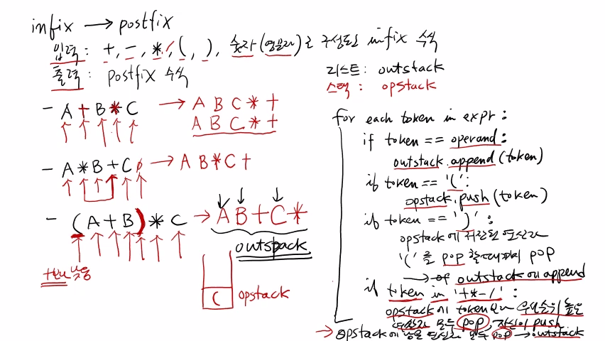

>
해당 포스트는 아래 수업들의 내용을 바탕으로 작성되었습니다.
> - ['자료구조 - Data Structures with Python'](https://www.youtube.com/playlist?list=PLsMufJgu5933ZkBCHS7bQTx0bncjwi4PK)
> - ['알고리즘 - Algorithm with Python'](https://www.youtube.com/playlist?list=PLsMufJgu5932XYejsOwcUDJ2F75f56nrl)
>
\- Youtube :
['Chan-Su Shin'](https://www.youtube.com/channel/UCJ4SXKMLQucqaxt4A6PonwQ)  
\- Professor : 신찬수 교수 (한국 외국어 대학교 컴퓨터 공학부)


# 1. 계산기 코드

이번에는 스택을 이용해서 할 수 있는 일의 두 번째 예제로 계산기 코드를 살펴보자.

## 1-1. 문제 파악

계산기 코드를 예시와 함께 설명하자면 아래와 같이 정리된다.

- '2 + 3 * 5' 와 같은 형태의 문자열을 입력으로 받는다.
- 이와 같은 수식을 연산자 우선순위에 따라 실제로 계산한다.
- 결과로, 17이라는 값을 출력으로 내보내면 된다.

<br>

이러한 출력을 내보내기 위해서 맨 처음에는, 입력으로 주어진 문자열을 쪼개야 한다.

```
'2 + 3 * 5' -> '2', '+', '3', '*', '5' 
```

- 이 때, '2' 와 같은 숫자들은 피연산자(operand) 라고 부른다.
- '+' 나 '\*' 와 같은 기호들은 연산자(operator) 라고 부른다.

<br>

이러한 피연산자와 연산자들이 주어지면, 연산자 우선순위에 따라 실제로 계산해야 한다.

```
2 + 3 * 5 -> (2 + (3 * 5)) => 17
                   ─────
              2   +  15
              ─────────
                 17
```

- 왜냐하면, 곱셈이 덧셈보다 우선순위가 더 높아서 먼저 계산되어야 하기 때문이다.
- 이렇게, 연산자 별로 우선순위가 다르므로, 3과 5의 곱셈을 먼저 수행해야 한다.
- 이 때, 연산자의 우선순위에 따라 계산의 순서를 나타내기 위해 괄호를 칠 수 있다.
   - 연산자 우선순위를 임시로 표시하는 것일 뿐, 실제로 괄호를 치지는 않는다.
- 이렇게, (3 * 5) 를 먼저 계산한 후에, 거기에 2를 더한 결과인 17을 출력하면 된다.


<br>

> #### 정리하자면,
계산기 문제는 입력으로 받은 수식의 피연산자와 연산자를 쪼갠 다음에,  
연산자 우선순위에 따라 차례대로 계산하여 최종 결과값을 출력하는 문제다.

## 1-2. 토큰과 연산자의 종류

이렇게 수식을 쪼개서 얻은 피연산자와 연산자를 '토큰(token)' 이라 부른다.

- 토큰은 '의미가 있는 단위' 이며, 수식에서는 연산자나 피연산자가 이에 해당한다.
- 따라서, 이러한 연산자와 피연산자를 각각 구분하는 작업을 가장 먼저 해야 한다.

<br>

연산자에는 '이항 연산자(binary operator)' 와 '단항 연산자(unary operator)' 가 있다.

- 이항 연산자는 2 + 3 의 '+' 처럼, 피연산자 2개를 요구하는 연산자다.
   - 3 * 5 의 경우, 두 개의 숫자를 곱하는 것이므로, 두 개의 항이 필요하다.
- '+3 - 6' 에서의 '+' 는 피연산자 1개(3) 를 필요로 하는 단항 연산자다.
   - 이 때, 뒤에 위치하는 '-' 는 +3과 6을 피연산자로 하는 이항 연산자다.

<br>

예시에서는 이항 연산자에 대해서만 계산한다고 가정한다.

> 물론, 단항 연산자가 섞여 있어도 크게 다를 것은 없지만, 단순성을 위해서다.

## 1-3. 수식 표기법

'2 + 3 * 5' 와 같은 수식을 '중위 표기(infix)' 수식이라고 한다.

- 3과 5를 곱하는 상황에서 3과 5의 가운데(in) 에 연산자가 위치한다.
- 2와 다른 수를 더하는 상황에서도 2와 다른 수의 가운데에 위치한다.
- 이렇게, 연산자가 피연산자 사이에 있는 형식의 수식을 중위 표기 수식이라고 한다.

<br>

이러한 중위 표기 수식을 '후위 표기(postfix)' 수식으로 변경할 것이다.

- 왜냐하면, 후위 표기 방식을 이용하면 훨씬 더 쉽게 계산할 수 있기 때문이다.
- 예를 들어, '2 + 3 * 5' 를 후위 표기 수식으로 바꾸면, '2 3 5 * +' 가 된다.
- 이 때, '\*' 와 '+' 와 같은 연산자가 피연산자 다음(오른쪽) 에 나타나게 된다.

<br>

아래의 3가지 규칙을 따르면 중위 표기를 후위 표기로 바꿀 수 있다.

1. 연산자의 우선순위에 따라서 수식에 괄호를 친다.
```
2 + 3 * 5 -> (2 + (3 * 5))
```
2. 감싸고 있는 괄호의 뒤로 연산자를 이동한다.
   - '\*' 를 감싸는 괄호의 바로 다음(오른쪽) 으로 '\*' 를 이동한다.
```
(2 + (3 * 5)) -> (2 + (3 5) * )
```
   - '+' 를 감싸는 괄호의 바로 다음(오른쪽) 으로 '+' 를 이동한다.
```
(2 + (3 5) * ) -> (2 (3 5) * ) +
```
3. 1단계에서 쳤던 괄호를 모두 지운다.
```
(2 (3 5) * ) + -> 2 3 5 * +
```

<br>

마찬가지로, 후위 표기에 완전히 대칭되는 '전위 표기(prefix)' 수식도 있다.

> 전위 표기 수식은 말그대로, 연산자가 피연산자들의 앞(왼쪽) 에 위치한다.

## 1-4. 수식 표기법 변경하기

3 * (2 + 5) * 4 처럼 수식 자체에 괄호가 포함될 수도 있다.

- 이는 괄호 안에 있는 부분을 먼저 계산해야 한다는 것을 의미한다.
- 이렇게, 기본 연산자(+, -, \*, / 등) 와 괄호가 섞인 문자열의 수식을 계산해야 한다.

<br>

위에서 살펴본 3가지 단계를 진행하면, 3 * (2 + 5) * 4 를 후위 표기로 바꿀 수 있다.

```
3 * (2 + 5) * 4 -> (3 * (2 + 5)) * 4 -> ((3 * (2 + 5)) * 4)

((3 * (2 + 5)) * 4) -> ((3 * (2 5) + ) * 4) -> ((3 (2 5) + ) * * 4) -> ((3 (2 5) + ) * 4) *

((3 (2 5) + ) * 4) * -> 3 2 5 + * 4 *
```

- 우선순위가 같은 연산자가 2번 등장하면('\*'), 결합 법칙에 의해 왼쪽부터 계산한다.
   - 따라서, 처음으로 '\*' 가 등장하는 부분부터 괄호로 감싸면 된다.
- 이 때, '+' 는 수식 자체에 괄호가 있으므로, 괄호 다음(오른쪽) 으로 바로 옮기면 된다.
   - '3 \*' 의 '\*' 도 괄호의 오른쪽으로, '\* 4' 도 마찬가지로 옮기면 된다.
- 마지막으로, 원래 있었던 괄호, 임의로 추가한 괄호에 상관없이 모두 없애면 된다.
   - 괄호는 상징적인 요소이며, 후위 표기에는 피연산자와 연산자만 포함된다.

<br>

다음 수업에서는 스택을 이용해 중위 표기를 후위 표기로 바꾸는 방법에 대해 살펴보자.

<br>

<details><summary>참고 : 실제 교수님 강의 화면 필기 내용</summary>



</details>

<br>

- 20210516 - 포스팅 제목 변경(10. 자료 구조 - 스택 활용 | 계산기(1/2) -> 11. 자료 구조 - 스택 활용 | 계산기(1/2))
- 20210516 - 이미지 경로 변경(10. -> 11.)
