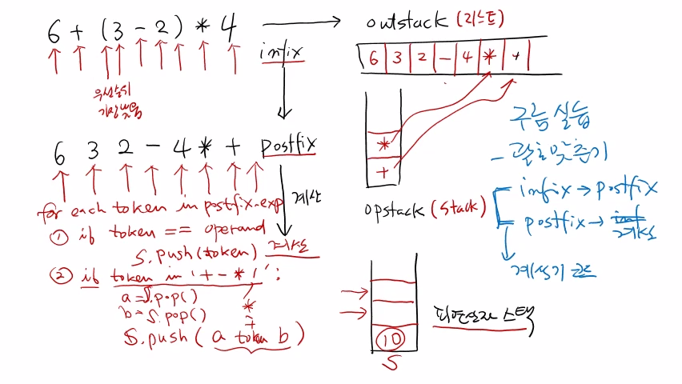

>
해당 포스트는 아래 수업들의 내용을 바탕으로 작성되었습니다.
> - ['자료구조 - Data Structures with Python'](https://www.youtube.com/playlist?list=PLsMufJgu5933ZkBCHS7bQTx0bncjwi4PK)
> - ['알고리즘 - Algorithm with Python'](https://www.youtube.com/playlist?list=PLsMufJgu5932XYejsOwcUDJ2F75f56nrl)
>
\- Youtube :
['Chan-Su Shin'](https://www.youtube.com/channel/UCJ4SXKMLQucqaxt4A6PonwQ)  
\- Professor : 신찬수 교수 (한국 외국어 대학교 컴퓨터 공학부)


# 1. 수식 표기법 변경 코드 작성하기

## 1-1. 입력과 출력 정의

```
infix -> postfix

입력 : +, -, *, /, (, ), 숫자(영문자) 로 구성된 infix 수식
출력 : postfix 수식
```

- 입력은 아래와 같은 요소로 구성된 중위 표기 수식이다.
   - 4개의 연산자(+, -, \*, /), 괄호((,)), 숫자 또는 영문자
- 입력으로 들어온 중위 표기 수식을 후위 표기로 바꿔서 출력한다.
- 이 때, 연산자에 해당하는 +, -, \*, / 는 모두 이항 연산자다.

### 1-1-1. 예시

```
'A + B * C' -> 'A', '+', 'B', '*', 'C'

A + B * C -> A B C * +
```

> 이 때, A, B, C는 문자로 표기되어 있지만, 실제로는 숫자다.

- 문자열로 주어진 수식의 항목들을 모두 토큰으로 쪼갠다고 가정한다.
- 이러한 토큰들을 왼쪽부터 오른쪽으로 순서대로 하나씩 확인할 것이다.
- 주어진 수식을 후위 표기로 바꾸면 A B C * + 와 같은 형태가 된다.

### 1-1-2. 정리

- 피연산자의 순서는 바뀌지 않으며, 특정 연산자의 위치는 다른 연산자에 의해 결정된다.
   - A 뒤에 있는 + 의 경우, 자신보다 뒤에 있는 * 에 의해 위치가 결정된다.
   - 이 때, * 보다 + 의 우선순위가 낮으므로, * 는 + 보다 앞에 위치한다.
- 연산자는 이렇게 자신보다 우선순위가 높은 연산자의 위치가 정해지기 전까지 기다려야 한다.
   - 위의 경우, \* 의 위치가 정해지기 전까지 + 는 임의의 위치에서 기다려야 한다.
- 우선순위가 더 낮은 연산자가 확인되면, 해당 연산자의 위치가 정해져서 결과에 표기된다.
- 이렇게 표기법이 변경되는 과정 중에, 연산자가 기다릴 수 있는 임의의 위치가 필요하다.
   - 이 때, 가장 나중에 들어온 연산자부터 우선순위를 비교해야 하므로, 스택이 사용된다.

## 1-2. 예시1

토큰은 순서대로 확인해야 하며, 연산자는 우선순위에 따라 위치가 정해진다.

```
'A * B + C' -> 'A', '*', 'B', '+', 'C'
```

- \* 다음으로 등장하는 연산자는 + 이므로, + 와 * 가 서로 경쟁하게 된다.
- 그리고, 스택에 먼저 들어간 * 는 자신이 위치가 정해지기를 기다리고 있다.
- 이 때, + 의 우선순위가 더 낮으므로, * 가 + 보다 먼저 스택에서 나가야 한다.
- 따라서, 우선순위가 더 높은 연산자가 스택에서 먼저 pop() 된다고 할 수 있다.

<br>

```
A * B + C -> A B * C +

 A     *     B     +     C

[ ]   [ ]   [ ]   [ ]   [ ]
[ ]   [ ]   [ ]   [ ]   [ ]
[ ]   [*]   [*]   [+]   [+]
```

- 피연산자 A는 그대로 쓰고, 연산자인 * 는 스택에 push() 한다.
- B는 피연산자이므로 그대로 쓰고, 연산자인 + 는 스택에 push() 한다.
   - 현재, + 보다 먼저 등장한 연산자들이 스택에 저장되어 있다.
   - 따라서, 스택에서 우선순위가 더 높은 연산자들을 모두 pop() 해야 한다.
      - 위의 경우, * 를 스택에서 pop() 한 후, + 를 스택에 push() 하게 된다.
- 마지막으로 등장하는 토큰인 C는 피연산자이므로 그대로 쓴다.
- 모든 항목을 확인했으므로, 스택에 남아있는 것들을 모두 pop() 한다.
- 이러한 과정을 거쳐, A B * C + 라는 후위 표기 수식을 완성할 수 있다.

## 1-3. 예시2

```
A + B * C -> A B C * +

 A     +     B     *     C

[ ]   [ ]   [ ]   [ ]   [ ]
[ ]   [ ]   [ ]   [*]   [*]
[ ]   [+]   [+]   [+]   [+]
```

- A는 피연산자이므로 그대로 쓰고, + 는 스택에 push() 한다.  
  `(현재, 스택에 어떤 연산자도 들어있지 않기 때문이다.)`
- B는 피연산자이므로 그대로 쓰고, * 는 스택에 push() 한다.  
  `(스택에 자신보다 우선순위가 높은 연산자가 없기 때문이다.)`
- 마지막으로 등장하는 토큰인 C도 피연산자이므로 그대로 쓴다.
- 이제, 스택에 남아있는 연산자들을 차례대로 pop() 한다.
- 결과적으로, 이렇게 나열된 문자열은 후위 표기 수식이 된다.

## 1-4. 예시3

이번 수식에는 괄호까지 포함되어 있다.

```
'(A + B) * C' -> '(', 'A', '+', 'B', ')', '*', 'C'
```

- 괄호도 하나의 토큰이며, ( 와 ) 를 따로 취급해야 한다.
- 위와 같이, 총 7개의 토큰으로 쪼개진다고 가정한다.

<br>

```
(A + B) * C -> A B + C *

 (     A     +     B     )     *     C

[ ]   [ ]   [ ]   [ ]   [ ]   [ ]   [ ]
[ ]   [ ]   [ ]   [ ]   [ ]   [ ]   [ ]
[ ]   [ ]   [ ]   [ ]   [ ]   [ ]   [ ]
[ ]   [ ]   [+]   [+]   [ ]   [ ]   [ ]
[(]   [(]   [(]   [(]   [ ]   [*]   [*]
```

- 괄호도 일종의 연산자이므로, ( 는 스택에 push() 해야 한다.
   - 이 때, ( 는 우선순위가 가장 낮고, ) 는 우선순위가 가장 높다.
   - 또, ( 는 ) 를 만나기 전까지 무조건 스택 내부에서 기다려야 한다.
- A는 피연산자이므로 그대로 쓰고, + 는 스택에 push() 한다.
   - 이 때, 자신보다 우선순위가 높은 연산자를 모두 pop() 해야 한다.
   - 하지만, 괄호는 자신의 안에 있는 연산자보다 우선순위가 낮다.  
     `(괄호 안에 있는 연산자를 더 먼저 계산해야 하기 때문이다.)`
   - 따라서, ( 는 안에 있는 + 보다 우선순위가 낮다고 할 수 있다.  
   - 우선순위가 더 높은 연산자가 없으므로, 스택에 바로 push() 하면 된다.
- B는 피연산자이므로 그대로 쓰고, ) 는 스택의 연산자들을 pop() 한다.
   - ) 가 확인되었다는 것은 자신의 짝인 ( 가 스택 안에 있다는 것을 의미한다.
   - 또, 연산자 + 는 괄호 안에 있으므로, 현재 상황에서는 우선순위가 가장 높다.
   - 따라서, 괄호 안의 연산자가 먼저 계산되도록, ( 가 나올 때까지 pop() 해야 한다.
   - 이렇게, ( 는 무조건 스택에 push() 되고, ) 는 ( 가 나올 때까지 계속 pop() 한다.
- 스택이 비어있으므로 \* 는 스택에 바로 push() 하고, 피연산자인 C는 그대로 쓴다.
- 모든 항목을 확인했으므로, 스택에 남아있는 것들을 모두 pop() 하면 된다.

## 1-4. 의사 코드 작성하기

```
outstack : list                             <- 1
opstack  : stack                            <- 2

for each token in expression:               <- 3
    if token == operand:                    <- 4
        outstack.append(token)

    if token == '(':                        <- 5
        opstack.push(token)

    if token == ')':                        <- 6
        opstack 에 저장된 연산자
        '(' 를 pop 할 때까지 pop
        -> outstack 에 append()

    if token in '+-*/':                     <- 7
        opstack 에 token 보다 우선순위 높은
        연산자 모두 pop, 자신이 push

opstack 에 남은 연산자 모두 pop -> outstack     <- 8
```

1. 출력 내용이 담길 리스트(outstack) 를 하나 준비한다.
   - 이것을 출력(혹은 반환) 하면 그것이 후위 표기 수식이 된다.
2. 연산자들을 push(), pop() 할 수 있는 스택(opstack) 도 필요하다.
   - 이 때, outstack 은 굳이 스택이 아니어도 된다.
   - 피연산자/연산자를 차례대로 append() 하면 되기 때문이다.
3. 수식(expression) 에 있는 각 토큰(token) 을 차례대로 확인해야 한다.
4. 만약, 토큰이 피연산자(operand) 면, outstack 에 그대로 append() 한다.
   - 숫자 혹은 A, B, C와 같은 문자가 이에 해당한다.
5. 만약, 토큰이 ( 면, 조건과 상관없이 opstack 에 push() 하도록 한다.
6. 만약, 토큰이 ) 면, opstack 에서 ( 가 pop() 될 때까지 계속 pop() 한다.
   - 왜냐하면, ) 의 짝이 되는 ( 가 스택 내부의 어딘가에 있을 것이기 때문이다.
   - 즉, ( 보다 위에 있는 연산자들을 모두 pop() 해서, outstack 에 push() 한다.
   - ( 가 나타날 때까지 계속 pop() 을 해야 하므로, while 루프를 사용하는 것이 좋다.
7. 만약, 토큰이 연산자면, opstack 에서 우선순위가 더 높은 연산자를 모두 pop() 한다.
   - 이 때, in 연산자는 '+-\*/' 문자열에 토큰이 '포함되는지' 를 의미한다.  
     `(이는 '토큰이 사칙연산자 중 하나라면' 이라고 표현할 수도 있다.)`
   - pop() 한 연산자보다 우선순위가 더 높아졌을 때, opstack 에 push() 한다.
8. opstack 에 있는 모든 연산자를 pop() 해서 outstack 에 append() 한다.
   - 이렇게 for 루프를 모두 끝낸 후에도 스택에 원소가 남아있을 수 있기 때문이다.

<br>

> 정확한 의사 코드(Pseudocode) 는 강의 노트에 있으니 참고하기 바란다.

## 1-5. 정리

- 수식을 구성하는 토큰을 순서대로 하나씩 확인해야 한다.
- 토큰이 피연산자라면 outstack 에 바로 append(), ( 면 opstack 에 바로 push() 한다.
- 토큰이 ) 면, ( 가 나올 때까지 pop() 하고, pop() 한 연산자들을 outstack 에 append() 한다.
- 토큰이 사칙연산자 중 하나면, 우선순위가 더 높은 연산자들을 pop() 한 뒤에, push() 한다.
- 모든 토큰을 확인한 후, opstack 에서 연산자를 모두 pop() 하여, outstack 에 append() 한다.
- 마지막으로, outstack 의 내용을 출력하면, 그것이 후위 표기 수식이 된다.

<br>

<details><summary>참고 : 실제 교수님 강의 화면 필기 내용</summary>


</details>

# 2. 계산기 코드 완성하기

## 2-1. 수식 표기법 변경

앞에서 설명한 알고리즘 혹은 의사 코드를 이용해서 중위 표기 수식을 바꿔보자.

- 리스트(outstack) 와 스택(opstack), 두 개의 자료 구조를 이용한다.
- outstack 에는 토큰들이 차례대로 저장되며, 이는 후위 표기 수식이 된다.
- opstack(operator stack) 에는 연산자를 push() 하거나 pop() 할 수 있다.

```
opstack(stack)

 6     +     (     3     -     2     )     *     4

[ ]   [ ]   [ ]   [ ]   [ ]   [ ]   [ ]   [ ]   [ ]
[ ]   [ ]   [ ]   [ ]   [ ]   [ ]   [ ]   [ ]   [ ]
[ ]   [ ]   [ ]   [ ]   [-]   [-]   [ ]   [ ]   [ ]
[ ]   [ ]   [(]   [(]   [(]   [(]   [ ]   [*]   [*]
[ ]   [+]   [+]   [+]   [+]   [+]   [+]   [+]   [+]
```

```
outstack(list)

6               -> 6
6 +             -> 6
6 + (           -> 6
6 + (3          -> 6 3
6 + (3 -        -> 6 3
6 + (3 - 2      -> 6 3 2
6 + (3 - 2)     -> 6 3 2 -
6 + (3 - 2) *   -> 6 3 2 -
6 + (3 - 2) * 4 -> 6 3 2 - 4 * +
```

- 6은 피연산자이므로, outstack 에 바로 append() 된다.
- 현재, 스택이 비어있으므로, 연산자인 + 는 opstack 에 push() 된다.
- ( 는 우선순위가 가장 낮다고 가정하지만, 무조건 opstack 에 push() 된다.
- 3은 피연산자이므로, outstack 에 바로 append() 된다.
- 연산자인 - 는 ( 보다 우선순위가 높으므로, opstack 에 push() 된다.
- 2는 피연산자이므로, outstack 에 바로 append() 된다.
- ) 는 ( 가 나올 때까지 opstack 의 연산자를 모두 pop() 한다.
   - 이 때, pop() 한 연산자들을 outstack 에 바로 append() 한다.  
     `(후위 표기에서는 괄호가 모두 사라지므로, 괄호는 제외한다.)`
- 연산자인 * 는 + 보다 우선순위가 높으므로, opstack 에 push() 된다.
- 4는 피연산자이므로, outstack 에 바로 append() 된다.
- 더이상 확인할 토큰이 없지만, opstack 에는 아직 연산자가 남아있다.
   - 따라서, 모두 pop() 하여, outstack 에 append() 하면 된다.
- 결과적으로, 6 3 2 - 4 * + 라는 후위 표기 수식이 완성된다.

<br>

> 이렇게 outstack 과 opstack 을 이용해, 중위 표기를 후위 표기로 바꿨다.
> - 이제, 후위 표기 수식을 계산할 것이며, 이렇게 2단계로 나눠서 진행하게 된다.
> - 물론, 중위 표기 수식으로도 계산할 수는 있지만, 이 방법이 더 쉽고 직관적이다.

## 2-2. 후위 표기 수식 계산

### 2-2-1. 의사 코드 작성하기

```
후위 표기 수식 : 6 3 2 - 4 * +
피연산자 스택  : s

for each token in postfix_expression: <- 1

    if token == operand:              <- 2
        s.push(token)

    if token in '+-*/':               <- 3
        a = s.pop()
        b = s.pop()
        s.push(a token b)
```

0. 후위 표기 수식을 계산할 때는, 피연산자만을 위한 스택이 필요하다.
1. 이전과 마찬가지로, 후위 표기 수식의 토큰을 순서대로 확인해야 한다.
2. 만약, 토큰이 피연산자라면, 무조건 피연산자 스택에 push() 한다.
3. 만약, 토큰이 +, -, \*, / 에 속하는 연산자면, 실제로 계산을 해야 한다.
   - 연산자들은 모두 이항 연산자이므로, 계산의 대상으로 피연산자가 2개 필요하다.
      - 이 때, 피연산자 스택의 가장 위에 있는 2개의 피연산자가 계산의 대상이 된다.  
   - 따라서, 피연산자 스택에서 pop() 을 2번 수행하여 2개의 피연산자를 꺼내오면 된다.
   - 이후, 2개의 피연산자에 대해 연산자 토큰에 해당하는 연산을 수행하면 된다.
   - 그리고, 연산의 결과를 다시 피연산자 스택에 push() 하면 된다.

### 2-2-2. 전체 계산 과정

```
6 3 2 - 4 * + -> 10

 6     3     2     -     4     *     +

[ ]   [ ]   [ ]   [ ]   [ ]   [ ]   [  ]
[ ]   [ ]   [ ]   [ ]   [ ]   [ ]   [  ]
[ ]   [ ]   [2]   [ ]   [4]   [ ]   [  ] <- 피연산자 스택(s)
[ ]   [3]   [3]   [1]   [1]   [4]   [  ]
[6]   [6]   [6]   [6]   [6]   [6]   [10]
```

- 6, 3, 2는 피연산자이므로 피연산자 스택에 push() 된다.
- 연산자 - 는 피연산자 스택에서 2번 pop() 하여 계산한 다음, 그 결과를 다시 push() 한다.
- 4는 피연산자이므로 피연산자 스택에 push() 된다.
- 연산자 * 는 피연산자 스택에서 2번 pop() 하여 계산한 다음, 그 결과를 다시 push() 한다.
- 연산자 + 는 피연산자 스택에서 2번 pop() 하여 계산한 다음, 그 결과를 다시 push() 한다.
- 이렇게 모든 계산을 마치면, 피연산자 스택에는 우리가 원하는 계산 결과가 남아있게 된다.

### 2-3. 정리

- 후위 표기 수식에 있는 토큰을 왼쪽부터 차례대로 확인해야 한다.
- 토큰이 피연산자면, 피연산자 스택에 해당 토큰을 push() 한다.
- 토큰이 연산자면, 피연산자를 2개 pop() 하여 계산하고, 결과를 다시 push() 한다.
   - 왜냐하면, 그 값이 다음 계산에서 사용될 것이기 때문이다.
- 모든 토큰을 확인한 후에, 피연산자 스택에 남아있는 것이 계산 결과가 된다.

<br>

> 이렇게 중위 표기를 후위 표기로 바꿔 계산하는 계산기 코드를 만들 수 있다.

<br>

<details><summary>참고 : 실제 교수님 강의 화면 필기 내용</summary>



</details>

<br>

- 20210516 - 포스팅 제목 변경(11. 자료 구조 - 스택 활용 | 계산기(2/2) -> 12. 자료 구조 - 스택 활용 | 계산기(2/2))
- 20210516 - 이미지 경로 변경(11. -> 12.)
