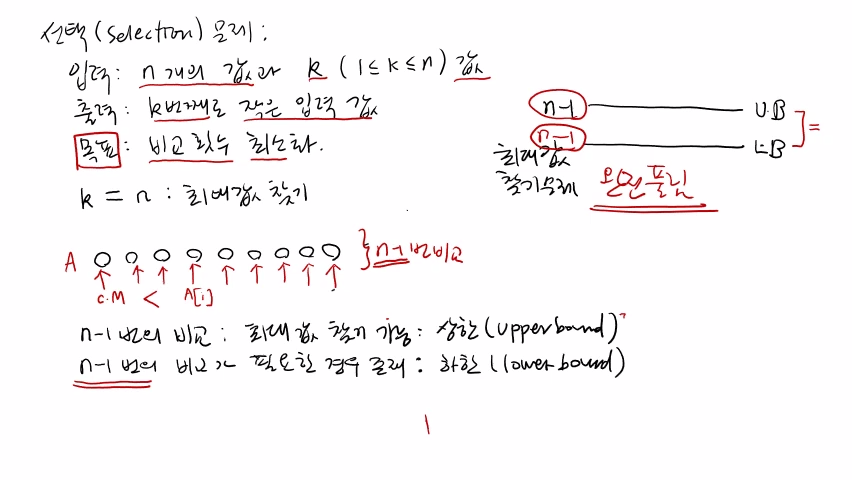
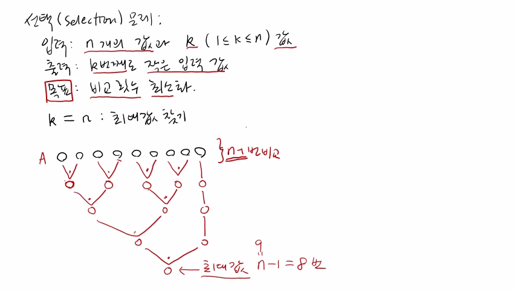
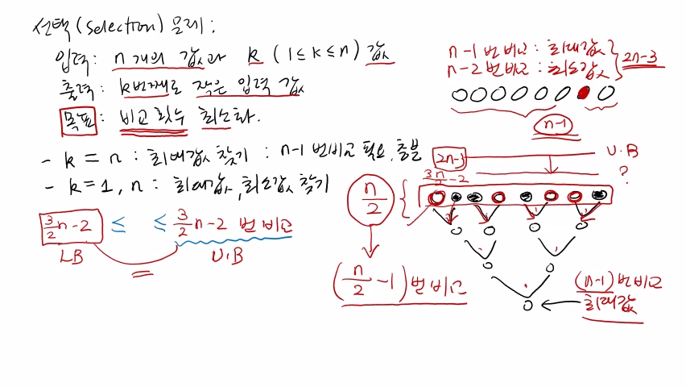
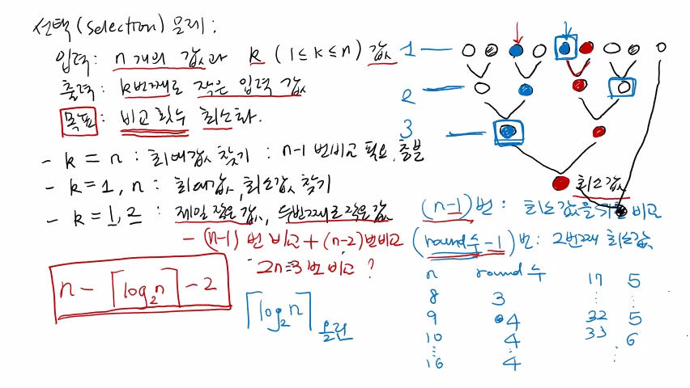

>
해당 포스트는 아래 수업들의 내용을 바탕으로 작성되었습니다.  
> - <a href='https://www.youtube.com/playlist?list=PLsMufJgu5933ZkBCHS7bQTx0bncjwi4PK' target='-blank'>'자료구조 - Data Structures with Python'</a>
> - <a href='https://www.youtube.com/playlist?list=PLsMufJgu5932XYejsOwcUDJ2F75f56nrl' target='-blank'>'알고리즘 - Algorithm with Python'</a>
>
\- Youtube :
<a href='https://www.youtube.com/channel/UCJ4SXKMLQucqaxt4A6PonwQ' target='-blank'>'Chan-Su Shin'</a>  
\- Professor : 신찬수 교수 (한국 외국어 대학교 컴퓨터 공학부)


# 1. 선택 문제

이번에는 선택(selection) 문제라고 하는 몇 가지 새로운 문제를 살펴볼 것이다.

## 1-1. 입력과 출력 (+ 목표)

```
입력 : n개의 값과 k(1 <= k <= n) 값
출력 : k번째로 작은 입력 값
목표 : 비교 횟수 최소화
```

- 입력의 크기 n에 대해, 'n개의 값' 과 '1과 n 사이에 있는 k라는 값' 이 입력으로 주어진다.
- 이러한 입력에 대해, n개의 값 중에서 k번째로 작은 입력 값을 찾아서 출력해야 한다.
   - 예를 들어 k가 3이라면, n개의 값 중에서 3번째로 작은 값을 찾아야 한다.  
     `(마찬가지로, k가 10이면, 10번째로 작은 값을 찾으면 된다.)`
- k번째로 작은 값을 구하기 위해서는, 서로 다른 두 개의 수를 계속 비교해야 한다.
   - 이 때, 최대한 적은 비교 횟수를 이용해 문제를 해결하는 것이 중요하다.
   - 따라서, 이렇게 비교 횟수를 되도록 작게 하는 것이 선택 문제의 목표라고 할 수 있다.

## 1-2. 최대값 찾기 문제

k = n 이라는 것은, n개의 숫자 중에서 n번째로 작은 숫자를 구해야 한다는 것을 의미한다.

> 이는 최대값이므로, 결국, 이것은 최대값을 찾는 문제와 똑같다고 할 수 있다.

<br>

최대값을 찾는 문제는 이전 강의에서 'arrayMax' 라는 알고리즘과 함께 살펴봤다.

```
A = [o, o, o, o, o, o, o, o, o]
     ↑  ^  ^  ^  ^  ^  ^  ^  ^  <- (n - 1) 번 비교
    c.M
```

- n개의 숫자가 담긴 A라는 리스트가 입력으로 주어진다고 가정한다.
- 맨 처음에는 A[0] 를 currentMax 로 선택하고, 값을 하나씩 확인하면서 비교해나간다.
- 현재 보고 있는 A[i] 의 값이 currentMax 보다 크면, currentMax 는 A[i] 가 된다.
- 이 때, 처음에 currentMax 로 지정되는 A[0] 을 제외한 (n - 1) 개를 비교하게 된다.
- 즉, '어떤 경우라도 총 (n - 1) 번의 비교를 하면 최대값을 찾을 수 있다' 라고 할 수 있다.
- 또한, (n - 1) 보다 더 적은 횟수의 비교를 통해 최대값을 찾는 방법은 없다.  
  `(이는 최소한 (n - 1) 번의 비교를 수행해야 함을 의미한다.)`

## 1-3. 상한과 하한

```
n - 1 번의 비교 : 최대값 찾기 가능 -> 상한(upper bound)
n - 1 번의 비교가 필요한 경우 존재 -> 하한(lower bound)

상한 = n - 1 = 하한 <- 완전히 풀림
```

위에서 살펴봤듯, (n - 1) 번의 비교를 수행하면, 어떤 경우에 대해서도 최대값을 찾을 수 있다.

- 이는, (n - 1) 번 비교하는 알고리즘은 최대값을 무조건 찾을 수 있다는 것을 의미한다.
- 이렇게, 어떤 경우라도 문제 해결이 가능한 연산 횟수를 '상한(upper bound)' 이라고 한다.

<br>

최대값을 찾기 위해, 반드시 (n - 1) 번의 비교를 수행해야 하는 경우가 있다고 가정해보자.

- 이는, 어떤 좋은 알고리즘을 사용하더라도, 최소한 (n - 1) 번 비교해야 함을 의미한다.
- 이런 상황에서, 문제 해결에 필요한 최소한의 연산 횟수를 '하한(lower bound)' 이라고 한다.

<br>

최대값 찾기 문제에서 상한은 '항상 최대값을 찾을 수 있는 비교 횟수' 인 (n - 1) 이다.

- 이 때, 최대값을 찾기 위해 상한 횟수인 (n - 1) 보다 많이 비교할 필요는 없다.
- 상한 이하의 비교만으로도 항상 최대값을 찾는 arrayMax 알고리즘이 있기 때문이다.
- 따라서, '어떤 문제를 풀기 위해서 상한 이상의 연산을 수행할 필요는 없다' 고 할 수 있다.

<br>

최대값 찾기 문제에서 하한은 '최대값을 찾기 위한 최소한의 비교 횟수' 인 (n - 1) 이다.

- 어떤 알고리즘에 대해서도, 하한 횟수 이상의 연산을 수행해야 하는 경우가 존재한다.
- 따로 증명하지는 않았지만, (n - 1) 번 이상의 비교가 필요한 경우는 이미 증명되어 있다.

## 1-4. 최대값 찾기 문제 정리

결국, 최대값 찾기 문제의 상한과 하한은 같다고 할 수 있다.

- 상한은 해당 횟수가 어떤 문제에서도 충분하다는 것을 의미한다.
- 하한은 해당 횟수가 어떤 경우에는 필요하다는 것을 의미한다.

<br>

따라서, 상한과 하한이 일치한다는 것의 의미는 아래와 같이 정리된다.

- 필요한 만큼의 비교 횟수만으로 항상 원하는 값을 찾을 수 있다.
- 따라서, 최대값을 찾으려면 반드시 (n - 1) 의 비교가 필요하다.
- 같은 이유로, (n - 1) 번의 비교는 항상 최대값을 찾기에 충분하다.

<br>

상한과 하한이 일치하기 때문에, 이 문제는 완전히 풀린 것이라고 할 수 있다.

- 왜냐하면, (n - 1) 번의 비교가 필요한 경우가 반드시 있고,  
  (n - 1) 번의 비교로 항상 최대값을 찾을 수 있기 때문이다.
- 이는 풀리지 않은 문제가 없다는 것을 의미하므로, 완전하게 풀린 것이라고 할 수 있다.

<br>

<details><summary>참고 : 실제 교수님 강의 화면 필기 내용</summary>



</details>

<br>

**<작성 중인 글입니다.>**

**<아래 내용은 정리 중입니다.>**

# 2.

이렇게 왼쪽에 있는 값부터 하나씩, (n - 1) 번 비교해서 최대값을 찾을 수 있다.

> 하지만, 반드시 이 방법을 사용해야 하는 것은 아니며, 다른 방법도 있다.

<br>

예를 들어, 토너먼트식으로 진행하는 것이다.

```
A = [○, ○, ○, ○, ○, ○, ○, ○, ○]
      \/    \/    \/    \/   |     (\/ * 4) => 4             = 1
       ○    ○      ○    ○    ○
        \__/        \__/     |     (\/ * 2) => 4 + 2         = 6
          ○          ○       ○
           \________/        |     (\/ * 1) => 4 + 2 + 1     = 7
                ○            ○
                 \__________/      (\/ * 1) => 4 + 2 + 1 + 1 = 8
                      ○
```

- A[0] 와 A[1] 을 먼저 비교하는 것이다.
   - 이 때, 그 중에서도 큰 값이 있다.
- 다음으로, 그 다음의 2개를 짝지어 둘 중에 더 큰 값을 찾는다.
   - 이것을 끝까지 반복한다.
- 마지막에 하나가 남아있다면, 부전승으로 올라간다.
- 이렇게 선택된 값들은 그 전 회차에서 더 큰 값들이며, 이들을 또 2개씩 묶어서 다음 회차를 진행하는 것이다.
- 여기서도 마찬가지로, 두 수 중에 더 큰 값이 그 다음 회차에 진출하는 것이다.
- 다시, 다음 회차의 값들도 그 다음 회차로 진출한다.
- 마지막의 두 값이 최종적으로 만나서, 둘 중에 더 큰 값이 우승하게 된다.
- 여기서 우승한 값이 최대값이 되는 것이다.

<br>

위의 예시에서는 총 9개의 숫자가 주어졌는데, 이 때의 비교 횟수를 확인해보자.

- 1회차에서는 (비교 4번 + 부전승) 으로, 총 4번의 비교가 수행되었다.
- 2회차에서는 (비교 2번 + 부전승) 으로, 총 2번의 비교가 수행되었다.
- 3회차에서는 (비교 2번 + 부전승) 으로, 총 1번의 비교가 수행되었다.
- 마지막 회차에 수행된 비교 1회까지 총 8번의 비교가 수행되었다.
- 즉, 이 때 n = 9 였으므로, 최대값을 찾기 위해서 (n - 1) 번인 8번을 비교한 것이다.
- 이 경우에도 마찬가지로, (n - 1) 번의 비교로, 토너먼트 방식으로 최대값을 찾을 수 있다.
- 그냥 왼쪽부터 차례대로 찾아도 (n - 1) 번, 토너먼트 방식으로 비교해서 찾아도 (n - 1) 번이 필요하다.
- 즉, 최대값은 항상 (n - 1) 번에 찾을 수 있는 방법이 존재한다.

<br>

<details><summary>참고 : 실제 교수님 강의 화면 필기 내용</summary>



</details>

# 3.

정리하자면, k가 n일 때, 즉, 최대값을 찾기 위해서는, (n - 1) 번의 비교가 필요한 경우가 있고,  
항상 (n - 1) 번의 비교로 충분히 찾을 수 있다. 라고 결론을 내릴 수 있다.

만약, 다음 문제인 k = 1 인, 1번째로 작은 값인 최소값을 찾는 경우도  
최대값과 마찬가지로, (n - 1) 번의 비교로 항상 찾을 수 있다.

최대값을 찾는 방법을 반대로 하면 되기 때문이다.

<br>

k = 1, n 인 경우는, 최대값과 최소값을 동시에 찾고 싶은 것이다.

만약, 최소값과 최대값을 동시에 찾고싶으면 아래와 같이 하면 된다.

예를 들어, 8개의 숫자가 주어졌다고 가정해보자.

```
A = [○, ○, ○, ○, ○, ○, ○, ○] -> (n - 1) 번 비교 : 최대값

A = [○, ○, ○, ○, ○, ○, ○]    -> (n - 2) 번 비교 : 최소값

최대값, 최소값을 구하기 위해 필요한 비교 횟수 : (n - 1) + (n - 2) = 2n - 3
```

- (n - 1) 번의 비교로 최대값을 찾는다.
- 최대값이 결정되었다면, 그 값을 빼고 나머지 (n - 1) 개 중에서 최소값을 찾으면 된다.
- 이 때, (n - 1) 개 중에서 최소값을 찾기 위해서는 (n - 1) - 1 = (n - 2) 번의 비교가 필요하다.
- 총 (2n - 3) 번의 비교를 통해 최대값과 최소값을 찾을 수 있다.

<br>

그런데, (2n - 3) 번 보다 좀 더 비교를 덜 하고 찾을 수 있을까?

- 우리는 왜냐하면 하여튼, 비교를 최대한 적게 하고 찾는 것이 목표이기 때문에
- (2n - 3) 번의 비교로 값을 찾을 수 있다는 것은 (2n - 3) 이 상한이라는 것이다.
- 왜냐하면, 항상 이러한 방법으로 찾을 수 있기 때문이다.
- 그렇지만, '이보다 더 적은 횟수로 찾을 수 있을까?' 가 궁금한 것이다.
- 상한을 좀 더 낮출 수 있을까?

<br>

어떻게 하면 되냐면, 일단 다시 8개의 숫자가 있다고 가정해보자.

```
1회차 비교에서 둘 중에 더 큰 값은 ●, 작은 값은 ◎ 다.

[◎, ●, ●, ◎, ●, ◎, ◎, ●]
  \/    \/    \/    \/    (\/ * 4) => 4         = 4
   ○    ○      ○    ○
    \__/        \__/      (\/ * 2) => 4 + 2     = 6
      ○          ○
       \________/         (\/ * 1) => 4 + 2 + 1 = 7 = n - 1 (n = 8)
           ○ <- 최대값
```

- 토너먼트 방식으로 최대값을 찾는 것이다. 그래도 (n - 1) 번의 비교가 필요하다.
- 예를 들어, 2개를 비교하면, 항상 둘 중 하나가 더 크고, 비교를 반복하여 마지막에 남은 값이 최대값이다.
- 이 때, 8개의 항목에 대한 (n - 1), 총 7번의 비교가 수행되었다.
- 첫 번째 회차에서 둘씩 짝을 지어서 비교를 했는데, 그 중에 더 큰 값은 다음 회차로 진출했다.
- 이 때, 2회차에 진출하지 못한 4개의 값들(◎) 중에서 반드시 최소값이 존재한다.
- 왜냐하면, 가장 큰 값이 우승하는 토너먼트의 1회차에서 탈락했다는 것은  
  그들 중 가장 작은 값이 있다는 것을 뜻하기 때문이다.
- 1회차에서 탈락한 값들은 총 4개, 즉 (n / 2) 개다.
- n 이 짝수라면 딱 나누어 떨어질 것이고, 홀수라면 하나가 남을 것이다.
- 이렇게 (n / 2) 개 중에 최소값이 있는 것이다.
- 즉, 탈락한 값들 중에 최소값이 있는 것이다.
- 우리는 앞에서 했던 것처럼, 최대값을 뺀 나머지 (n - 1) 개에서 최소값을 찾지 않아도 된다.
- 대신, (n / 2) 개에서 최소값을 찾으면 된다.
- 이 때, (n / 2) 개에서 최소값은 (n / 2) - 1 번의 비교를 통해 찾아낼 수 있다.
- 그러면, 최대값을 찾기 위해서 (n - 1) 번, 최소값은 (n / 2) - 1 번의 비교를 통해 찾을 수 있다.
   - 1회차에서 탈락한 (n / 2) 개의 숫자 중에서 최소값이 있기 때문이다.
- 여기서, 두 비교 횟수를 합치면, ((3 / 2) * n) - 2 가 된다.
- 따라서, ((3 / 2) * n) - 2 번의 비교를 통해 최대값과 최소값을 찾을 수 있다.
- 앞에서 살펴본 방법은 (2n - 3) 번의 비교가 필요했지만, ((3 / 2) * n) - 2 번으로 상한이 내려왔다.
- 이렇게, 더 적은 비교만으로도 최대값과 최소값을 찾을 수 있다는 것을 보였다.
- ((3 / 2) * n) - 2 번의 비교를 통해서는 항상 최대값과 최소값을 찾을 수 있다.
- 하한은 반드시 필요한 비교 횟수이다.
- ((3 / 2) * n) - 2 번의 비교가 반드시 필요한 경우가 있다.
- 따라서, 하한도 증명이 되었다.
- 결국, 상한과 하한이 같다.
- ((3 / 2) * n) - 2 번의 비교가 반드시 필요하고, ((3 / 2) * n) - 2 번의 비교로 충분하다.
- 이것도 증명되어 있다. 하한 증명은 여기서 하지 않을 것이다.

<br>

<details><summary>참고 : 실제 교수님 강의 화면 필기 내용</summary>



</details>

# 4.

이번에는 3번째 문제를 살펴보자.

이번에는 k = 1, 2이 주어진 것이다.

> 이는 제일 작은 값과 두 번째로 작은 값을 찾아야함을 의미한다.

```
k = 1, 2
```

- 가장 쉽게 할 수 있는 방법은 우선 (n - 1) 번 비교해서 최소값을 찾는 것이다.
- 그리고, 제일 작은 최소값을 제외한 나머지 (n - 1) 개의 값 중에서 또 최소값을 찾으면,  
  그것은 전체 중에서 두 번째로 작은 값이 되며, 필요한 비교 횟수는 (n - 2) 번이다.
- 총 (2n - 3) 번의 비교를 통해 제일 작은 값과 두 번째로 작은 값을 찾을 수 있다.

<br>

그러면 이것보다 더 적은 비교 횟수가 가능하냐는 것이 문제이며, 가능하다.

- 앞에서 살펴본 최대값과 최소값을 동시에 찾는 방법처럼, 토너먼트 방식을 이용하는 것이다.
- 앞에서는 최대값을 찾기 위해서 (n - 1) 번을 비교했는데,  
  그 때에 최대값을 찾기 위한 비교를 하면서 그 비교 결과의 정보를 최소값을 찾는데 이용한 것이다.
- 1회차에서 탈락한 값들 중에 최소값이 있다는 것이다.
- 따라서, 앞에서 최대값을 찾기 위해 수행된 비교를 통해 더 유용한 정보를 얻어서 최소값을 찾는 데 이용한 것이다.
- 여기서도 마찬가지로, 최소값을 찾기 위해서 (n - 1) 번은 반드시 비교해야 한다.
- 이러한 비교 과정에서 얻은 정보를 이용해서 두 번째로 작은 값을 찾아, 전체 비교 횟수를 줄이려 하는 것이다.

<br>

이번에도 마찬가지로, 8개가 있다고 치자.

```
둘 중에 더 큰 값은 ●, 작은 값은 ◎ 다.

[●, ◎, ◎, ●, ●, ◎, ●, ◎]
  \/    \/    \/    \/
   ○    ○      ○    ○
    \__/        \__/
      ○          ○
       \________/
           ○ <- 최소값
```

- 최소값을 찾기 위해서, 여기서도 똑같이 둘씩 비교하는 것이다.
- 이 경우에는 더 작은 값이 다음 회차에 진출하게 된다.
- 이러한 비교를 반복하여, 우승한 값이 최소값이다.

<br>

이 때, 6번째 위치의 값이 최소값이라고 가정해보자.

```
[○, ○, ○, ○, ○, ●, ○, ○]
  \/    \/    \/    \/
   ○    ○      ●    ○
    \__/        \__/
      ○          ●
       \________/
           ● <- 최소값
```

- 1회차에서 이겨서 2회차에 진출했을 것이다.
- 2회차에서도 이겨서 3회차에 진출했을 것이다.
- 결승인 3회차에서도 이겨서 우승했을 것이다.

여기서, 두 번째로 작은 값은 어디 있을까? 어딘가에 있을 것이다.

<br>

◎ 가 두 번째로 작은 값이라고 가정해보자.

```
[○, ○, ◎, ○, ○, ●, ○, ○]
  \/    \/    \/    \/
   ○    ◎      ●    ○
    \__/        \__/
      ◎          ●
       \________/
           ● <- 최소값
```

- 두 번째로 작은 값이기 때문에, 1회차는 무조건 통과한다.
- 2회차도 통과한 뒤에, 결승전에서 가장 작은 값을 만난다.
- 두 번째로 작은 값은 No.2 다.
- 가만히 생각해보면, 토너먼트를 계속 치르는데, 가장 작은 값인 No.1 을 만나기 전까지는 무조건 이긴다.
- 그래서, No.1 을 언젠가는 만날 것이다.

<br>

재수가 좋으면 결승전에서 만날 것이지만, 재수가 없는 경우도 있다.

```
[○, ○, ○, ○, ◎, ●, ○, ○]
  \/    \/    \/    \/
   ○    ○      ●    ○
    \__/        \__/
      ○          ●
       \________/
           ● <- 최소값
```

- 하필이면 첫 번째 회차에서 최소값 ● 과 두 번째로 작은 값 ◎ 이 만나는 것이다.
- 이런 경우에 두 번째로 작은 값은 탈락하게 된다.
- 가장 작은 값을 만나기 전까지는 무조건 이기다가, 언젠가(결승전, 혹은 그 전에)는 가장 작은 값과 만난다.

<br>

최소값이랑 만나면 지기 때문에, 결국, 두 번째로 작은 값은 토너먼트 우승자와 만나서 진 값들 중에 있다.

```
[○, ○, ○, ○, ◎, ●, ○, ○]
  \/    \/    \/    \/    <- 1회차
   ○    ○      ●    ◎
    \__/        \__/      <- 2회차
      ◎          ●
       \________/         <- 3회차
           ● <- 최소값

(n - 1) 번 : 최소값을 위한 비교 횟수
(회차 수 - 1) 번 : 두 번째 최소값을 위한 비교 횟수
```

- 현재 최소값은 ● 이기 때문에, 이 최소값과 겨뤄서 진 값들(◎) 중에서 두 번째로 작은 값이 있는 것이다.
- 그들 중 어떤 값이 가장 작은 값인지를 비교해보면 된다.
- 이러한 ◎ 들 중에서 가장 작은 값이, 전체적으로는 두 번째로 작은 값이 된다.
- 이 때, 최소값을 고르는 첫 번째 토너먼트에 필요한 비교 횟수는 (n - 1) 번이다.
- 최소값과 싸워서 진 값의 개수는 회차의 수 3이 된다.
- 3회차는 결승전이며, 결승전을 하면 최소값이 나온다.
- 따라서, (회차 수 - 1) 번을 비교하면, 두 번째로 작은 값을 찾을 수 있다.

<br>

이 회차 수는 n이 8일 때, 3이 된다.

```
[○, ○, ○, ○, ○, ○, ○, ○, ○]
  \/    \/    \/    \/   |
   ○    ○      ○    ○    ○
    \__/        \__/     |
      ○          ○       ○
       \________/        |
           ○             ○
            \___________/
                  ○ <- 최소값

(n - 1) + ((log2(n) 의 올림값) - 1) = n - (log2(n) 의 올림값) - 2
```

- 9개가 있으면 부전승을 하는 항목이 생기면서, 마지막에 1번의 회차가 추가된다.
- 즉, 9개가 있을 때 필요한 회차의 수는 4다.
- 10개가 있어도 여전히 필요한 회차의 수는 4다.
- 이는 16개의 숫자가 되기 전까지는 4회차로 충분하다.
- 그리고, 17개의 숫자가 존재하면, 32개의 숫자가 되기 전까지는 5번째 회차까지 필요하다.
- 33개의 숫자가 있으면 6개의 회차가 필요하다.
- 이렇게 n개의 숫자가 있으면, log2(n) 를 취해야 한다. 
- n = 8 이면 log2(8) 은 3이며, n = 9 면 log2(9) 는 4여야 하므로, log2(n) 에 올림을 하면 된다.
- n = 8 이면 log2(8) 을 올림해도 정확히 3이 되고, n = 9 면 3.xx 인 log2(9) 는 올림하여 4가 된다.
- 따라서, 최소값을 위한 비교 횟수와 두 번째 최소값을 위한 비교 횟수를 합해야 한다.
- 총 (n - 1) + ((log2(n) 의 올림값) - 1) = n - (log2(n) 의 올림값) - 2 의 비교 횟수가 필요하다.
- 즉, 가장 작은 값과 두 번째로 작은 값을 찾기 위해서는 n - (log2(n) 의 올림값) - 2 번의 비교가 필요하다.
- 즉, 가장 작은 값과 두 번째로 작은 값은 n - (log2(n) 의 올림값) - 2 번의 비교를 통해 항상 찾을 수 있다.
- 그리고, n - (log2(n) 의 올림값) - 2 번의 비교 횟수는 반드시 필요하다는 것도 증명되었다.
- 상한과 하한이 일치하므로, 더 이상 잘할 수 없다.
- 마찬가지로, 가장 큰 값과 두 번째로 큰 값을 찾는 것도 같은 방식으로 거꾸로 하면 되므로  
  같은 비교 횟수로 찾을 수 있으며, 필요하다.

<br>

결국, k = 1 일 때, k = n 일 때, k = 1, n 일 때, k = 1, 2 일 때, 이런 식으로 특별한 k의 값에 대해서 선택 문제를 살펴봤다.

다음에는 일반적인 k에 대해서, k가 1인지 2인지 모르는 입력으로 주어지는 값일 때, k번째로 작은 값을 어떻게 찾는 지에 대해 살펴볼 것이다.

<br>

<details><summary>참고 : 실제 교수님 강의 화면 필기 내용</summary>



</details>
