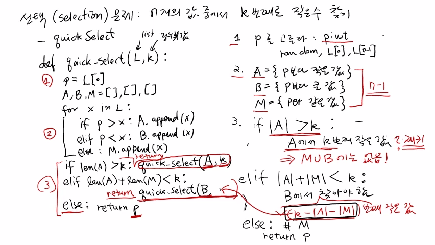
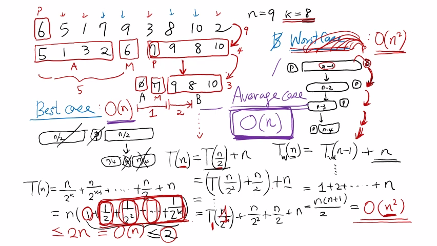

>
해당 포스트는 아래 수업들의 내용을 바탕으로 작성되었습니다.
> - ['자료구조 - Data Structures with Python'](https://www.youtube.com/playlist?list=PLsMufJgu5933ZkBCHS7bQTx0bncjwi4PK)
> - ['알고리즘 - Algorithm with Python'](https://www.youtube.com/playlist?list=PLsMufJgu5932XYejsOwcUDJ2F75f56nrl)
>
\- Youtube :
['Chan-Su Shin'](https://www.youtube.com/channel/UCJ4SXKMLQucqaxt4A6PonwQ)  
\- Professor : 신찬수 교수 (한국 외국어 대학교 컴퓨터 공학부)


# 0. 선택 문제

이전 수업에서는 특별한 k에 대한 선택 문제 알고리즘을 살펴봤다.

> 최소한의 비교로 최소값(k = 1), 최대값(k = n), 최대값과 최소값, 가장 작거나 큰 두 수 찾기

이번 수업에서는 일반적인 k에 대한 선택 문제에 대해서 살펴볼 것이다.

> n개의 값과 k(1 <= k <= n) 라는 특별한 값이 입력으로 주어졌을 때, k번째로 작은 수 찾기

<br>

선택 문제에서 k = n / 2 이면, (n / 2) 번째로 작은 수를 찾아야 한다.

- 이는 오름차순 또는 내림차순으로 나열된 n개의 값의 중간에 있는 값이다.
   - 이러한 값을 '중앙값(Median)' 이라고 한다.
- 이렇게, 임의로 주어지는 k에 대해, k번째로 작은 수를 찾아야 하는 문제다.
   - 그리고, 비교 횟수를 최대한 적게 만들어야 한다.

<br>

선택 문제에는 두 가지 중요한 알고리즘 'Quick Select' 와 'Median of Medians(MoM)' 가 있다.

- 이번 수업에서는 그중에 하나인 'Quick Select' 라는 알고리즘에 대해 살펴볼 것이다.
- 다음 수업에서는 조금 더 복잡한 'Median of Medians' 알고리즘을 살펴볼 것이다.

# 1. Quick Select

우선, n개의 숫자가 들어있는 L이라는 리스트가 있다고 가정해보자.

```
L = [                         ]
```

## 1-1. 피벗 선택

리스트 L에 있는 n개의 숫자 중, 기준이 될 숫자(p) 를 선택한다.

```
L = [         p               ]
```

- 이 때, p는 'pivot' 이라고 부르며, 어떤 방법으로 선택해도 상관없다.
- 첫 번째 값(L[0]), 마지막 값(L[n - 1]), 또는 임의로(random) 선택한다.

## 1-2. 크기 분류

p와 다른 값을 비교하여, p보다 작은 값들과 큰 값들로 나눈다.

```
A = { p보다 작은 값 }
B = { p보다 큰 값 }
M = { p와 같은 값 }

L = [         p               ]

    [     ] [ p       ] [     ]
    └─ A ─┘ └─── M ───┘ └─ B ─┘
```

- p보다 작은 값들을 모아서 A, 큰 값들을 모아서 B, 같은 값들은 M에 집어넣는다.
- p와 다른 (n - 1) 개의 값들을 비교하기 때문에, 총 (n - 1) 번의 비교가 필요하다.
- 이 때, A, B, M 에 각각 몇 개의 값이 포함될 것인지는 알 수 없다.
   - 어떤 집합에는 값이 하나도 없을 수도 있고, 한 곳에 다 모여있을 수도 있다.
   - 값의 크기대로 나열하면 A, M, B 이며, 이 때, M에는 무조건 pivot 이 들어있다.
- 중요한 것은, A 또는 B에 있는 값들 사이의 대소 관계에 대해서는 모른다는 것이다.
   - A에 있는 값들은 pivot 보다 작고, B에 있는 값들은 크다는 것만 알 수 있다.
   - 순서대로 나열된 집합 중, k번째로 작은 값이 어디에 있는지를 알아내야 한다.

## 1-3. |A| > k 의 경우

```
[     ] [ p       ] [     ]
└─ A ─┘ └─── M ───┘ └─ B ─┘
─-> k

if |A| > k:
    A에서 k번째 작은 값 ? 재귀
    => M ∪ B 에는 없음!
```

만약 A에 포함된 값의 개수가 k보다 크다면, k는 A에 포함된다.

- A에 들어있는 값들은 pivot 보다 작은 값들이며, 최소값과 두 번째로 작은 값도 포함된다.
- A에 들어있는 값의 개수가 k보다 크다면, k번째로 작은 값은 당연히 A에 들어있을 것이다.
- 이 때, 'A에서 k번째로 작은 값' 은 우리가 찾고 있는 '전체에서 k번째로 작은 수' 와 같다.
   - 또한, 이는 전체에서 k번째로 작은 값이 M과 B(M ∪ B) 에는 없다는 것을 의미한다.
- 따라서, M과 B에 있는 값들을 확인할 필요 없이, A에서 k번째로 작은 값만 찾으면 된다.

<br>

이 때, A에서 k번째로 작은 수는 재귀적으로 찾을 수 있다.

- L이라는 리스트에서 k번째로 작은 값을 찾기 위해서 Quick Select 를 적용했다.
- 다시 한 번, Quick Select 를 적용하여, A에서 k번째로 작은 숫자를 찾으면 된다.
- n개의 값이 들어있는 L이 아닌, 그보다 작은 A에 대해 같은 일을 반복하는 것이다.

<br>

> 이렇게, L에서 k번째로 작은 수를 찾는 문제가 A에서 k번째로 작은 수를 찾는 문제로 바뀌었다.

## 1-4. |A| + |M| < k 의 경우

```
[     ] [ p       ] [     ]
└─ A ─┘ └─── M ───┘ └─ B ─┘
   └────┬────┘
   (|A| + |M|) < k
|─────────────────|─-> k
                    ↑
             (k - |A| - |M|)

elif |A| + |M| < k:
    B에서 찾아야 함
         ↖ (k - |A| - |M|) 번째 작은 값
```

A와 M에 들어있는 값의 개수를 다 합쳐도, k보다 작은 경우도 있다.

- 이 때, k번째로 작은 값은 A와 M이 아닌, B에 있는 값 중 하나가 될 것이다.
- k번째로 작은 값은 A와 M에 해당하는 범위를 지나치게 되기 때문이다.
- 따라서, 전체에서 k번째로 작은 수는 A와 M이 아닌, B에서 찾아야 한다.

<br>

여기서 중요한 점은, 'B에서 k번째로 작은 값' 을 찾아서는 안 된다는 것이다.

- 왜냐하면, B가 아닌 '전체에서 k번째로 작은 수' 를 찾아야 하기 때문이다.
- 이를 위해, 우선, k에서 'A와 M에 들어있는 값의 개수' 를 뺀 값을 구해야 한다.
- 따라서, 이 경우에는 'B에서 (k - |A| - |M|) 번째로 작은 값' 를 찾아야 한다.

## 1-5. 그 이외의 경우

```
else: # M
    return p
```

- k번째로 작은 수가 A에도 없고, B에도 없다는 것은, M에 있다는 것을 의미한다.
- M에 있는 값들은 모두 pivot 과 같으므로, k번째로 작은 값은 pivot 이 된다.

<br>

> 따라서, pivot 의 값을 그대로 반환하면 된다.

<br>

<details><summary>참고 : 실제 교수님 강의 화면 필기 내용</summary>



</details>

# 2. 의사 코드 작성하기

```
def quick_select(L, k):                             <- 1
    p = L[0]                                        <- 2
    A, B, M = [], [], []                            <- 3

    for x in L:                                     <- 4
        if p > x: A.append(x)                       <- 5
        elif p < x: B.append(x)                     <- 5
        else: M.append(x)                           <- 5

    if len(A) > k: return quick_select(A, k)        <- 6
    elif len(A) + len(M) < k:                       <- 7
        return quick_select(B, k - len(A) - len(M)) <- 7
    else: return p                                  <- 8
```

1. 우선, 리스트 L과 정수(자연수) 값인 k를 인자로 받는 함수를 정의한다.
2. L에 있는 값 중에 가장 처음에 있는 값 L[0] 을 p(pivot) 으로 선택한다.
3. p보다 작은 값, 큰 값, 같은 값을 모아서 저장할 자료 구조를 선언한다.
   - 이렇게, 값들을 모아둘 집합들을 모두 빈 리스트로 초기화한다.
4. L에 있는 각각의 원소(값) 을 하나씩 비교하기 위해 반복문을 수행한다.
5. 만약 p와 비교했을 때, x가 작으면 A에, 크면 B에, 같으면 M에 집어넣는다.
6. 만약 A에 들어있는 값의 개수가 k보다 크면, quick_select() 를 다시 호출한다.
   - 이 때, L이 아닌 A에서 k번째로 작은 수를 구하도록 인자를 입력한다.
7. 만약 A와 M에 들어있는 값의 개수가 k보다 작아도, quick_select() 를 호출한다.
   - 이 때, B에서 (k - |A| - |M|) 번째로 작은 수를 구하도록 인자를 입력한다.
8. 만약 앞에 있는 두 가지 조건을 만족하지 않으면, 바로 p를 반환하면 된다.
   - 왜냐하면, M에 들어있는 값들은 모두 p와 같기 때문이다.

<br>

여기서 주의할 점은 재귀적으로 호출된 후에, p가 반환된다는 것이다.

- 따라서, 재귀적으로 호출한 부분의 결과도 모두 반환해야 한다.
- 왜냐하면, 재귀적으로 반환된 결과를 다시 반환해야 하기 때문이다.
- 이렇게, 재귀 호출을 수행한 대기 함수로 결과값을 넘겨줘야 한다.

<br>

작성한 의사 코드의 quick_select() 함수는 실제 파이썬 코드이기 때문에 정상적으로 동작한다.

> 물론, 이것은 가장 좋은 코드가 아니지만, 가장 간단하게 작성할 수 있는 코드 중 하나다.

<br>

<details><summary>참고 : 실제 교수님 강의 화면 필기 내용</summary>


</details>

# 3. 수행 시간 파악하기

## 3-1. 예시

### 3-1-1. 알고리즘 수행

총 9개의 숫자가 있으며(n = 9), 찾고자 하는 숫자는 8번째로 작은 숫자(k = 8) 다.

```
n = 9, k = 8

6 5 1 7 9 3 8 10 2
p

5 1 3 2 6 7 9 8 10
└─ A ─┘ M └─ B ─┘
└───┬───┘
 (4 + 1)
|───────|──-> k
          ↑
       (8 - 5) = 3
```

1. 우선, 맨 앞에 있는 원소인 6을 pivot(p) 으로 선택한다.
2. pivot(6) 보다 작은 값은 A, 큰 값은 B라 하고, A, M, B 순서로 나열한다.
   - pivot 보다 작은 숫자는 5, 1, 3, 2이고, 큰 숫자는 7, 9, 8, 10이다.
   - A와 B의 원소 개수는 각각 전체 9개(pivot 제외) 의 절반이 된다.
   - 이렇게 비교할 숫자가 A에 4개, B에 4개로 깔끔하게 나누어져 있다.
3. 이 때, 우리가 찾아야 하는 것은 '8번째로 작은 숫자' 다.
   - 이 때, A와 M에 들어있는 원소 개수의 합은 4 + 1 로, 총 5개다.
   - k = 8 이므로, A와 M에는 8번째로 작은 수가 포함되어 있지 않다.
      - 따라서, '전체에서 8번째로 작은 수' 는 B에서 찾아야 한다.
   - 결국, B에서 8 - 5 = 3 번째로 작은 값을 찾아, 문제를 해결할 수 있다.

### 3-1-2. 재귀적 호출

B에서 3번째로 작은 수를 찾기 위해, Quick Select 알고리즘을 재귀적으로 호출한다.

```
quick_select(B, 3)

7 9 8 10
p

Ø 7 9 8 10
A M └ B ┘
└┬┘
 1
|─| -> k
    ↑
 (3 - 1) = 2
```

1. 이번에도 맨 앞에 있는 원소인 7을 pivot(p) 으로 선택한다.
2. pivot 보다 작은 값이 없어서, A에는 아무 값도 들어있지 않게 된다.
   - 나머지 숫자가 모두 pivot 보다 커서, 9, 8, 10이 전부 B에 들어간다.
   - 이렇게 비교할 값이 한쪽으로 모이는 것은 그렇게 좋은 상황이 아니다.
3. 이번에 우리가 찾아야 하는 것은 ‘3번째로 작은 숫자’ 다.
   - 현재 A는 비어있으며, M에 들어있는 원소 개수는 총 1개다.
   - 따라서, 다시 B에서 3 - 1 = 2 번째로 작은 값을 찾아야 한다.

### 3-1-3. 정리

처음에 알고리즘을 수행했을 땐, 문제의 크기가 절반으로 줄었었다.

- 9개 중에서 값을 찾는 문제가 4개 중에서 값을 찾는 문제로 바뀌었다.
- A와 M에는 찾는 값이 없으니, 후보에서 제외할 수 있었기 때문이다.
- 따라서, B에 있는 4개의 값에 대해서만 알고리즘을 수행하게 되었다.

<br>

다음에 재귀적으로 수행했을 땐, 문제의 크기가 거의 줄지 않았다.

- 4개 중에서 값을 찾는 문제가 3개 중에서 값을 찾는 문제로 바뀌었다.
- 후보에서 pivot 하나만 제외하는, 좀 더 좋지 않은 상황이 된 것이다.
   - 이전 단계와 비교했을 때, 비교 횟수가 크게 줄지 않았다.

<br>

이렇게, 선택된 pivot 에 따라, 이후에 비교해야 할 값의 범위가 달라진다.

> 정확히 반으로 나뉘거나, 한쪽에 몰리는 상황이 번갈아가면서 나타나게 된다.

## 3-2. 최악의 경우(Worst Case)

최악의 경우는 'p를 기준으로 나눴을 때, 모든 값이 한쪽으로 몰리는 상황' 이다.

### 3-2-1. 예시

```
Ø p [              ]    <- 1
    [          ] p Ø    <- 2
    [      ]  p Ø       <- 3
    Ø p [  ]            <- 4
```

1. 알고리즘을 호출했을 때, n개 중 (n - 1) 개의 원소가 전부 B에 포함된다.
2. 이것을 재귀적으로 호출했을 때, (n - 2) 개의 원소가 전부 A에 포함된다.
3. 다시 재귀적으로 호출했을 때, (n - 3) 개의 원소가 전부 A에 포함된다.
4. 다시 재귀적으로 호출했을 때, (n - 4) 개의 원소가 전부 B에 포함된다.

<br>

위처럼 극단적으로 불균형하게 나누어지는 상황이 최악의 경우다.

- 반복할 때마다, 비교 후보에서는 pivot 하나만 제외된다.
- n -> (n - 1) -> (n - 2) -> ... 이 계속해서 반복되는 것이다.

### 3-2-1. 점화식 풀이

n개의 숫자에서 k번째로 작은 수를 찾을 때, 필요한 비교 횟수를 T(n) 이라고 가정한다.

```
T(n) = w                    <- 1
     = ? + n                <- 2
     = T(n - 1) + n         <- 3
     = 1 + 2 + ... + n      <- 4
     = (n * (n + 1)) / 2    <- 5
```

1. 최악의 경우(w) 에는 pivot 과 나머지 (n - 1) 개의 원소를 비교한다.
2. 따라서, 필요한 비교 횟수는 (n - 1), 이를 단순히 n이라고 표현한다.
   - 이렇게 비교를 통해, 전체에서 하나의 숫자를 비교 대상에서 제외했다.
3. 이제, (n - 1) 개의 숫자에 대해, 다시 똑같은 알고리즘을 수행해야 한다.
   - 이 때, 알고리즘을 수행하는 데 필요한 비교 횟수는 T(n - 1) 이 된다.
4. 예를 들어, T(1) = 1 이라고 하면, T(n) 은 1부터 n까지 더하는 식으로 전개된다.
5. 1 + 2 + ... + n = (n * (n + 1)) / 2 이므로, 결국, 수행 시간은 O(n^2) 이 된다.

<br>

따라서, 최악의 경우에 필요한 비교 횟수는 n^2 번이라고 할 수 있다.

> pivot 의 선택이 잘못되어, 불균등하게 나뉘는 것이 계속해서 반복된다.

- 하지만, 실제로 이런 상황이 발생할 확률은 극히 낮아서, 심각하게 고민할 필요는 없다.
- 그래도, 이론상 최악의 경우에는 O(n^2) 의 수행 시간이 필요하다는 것을 이해해야 한다.

## 3-3. 최선의 경우(Best Case)

### 3-3-1. 예시

최선의 경우는 ‘p를 기준으로 모든 값이 균등하게 나누어지는 상황’ 이다.

```
[                   ] p [                   ]    <- 1
                        [       ] p [       ]    <- 2
                        [ ] p [ ]                <- 3
```

1. 알고리즘을 호출했을 때, pivot 보다 작은 값과 큰 값이 반으로 나뉜다.
   - 이 때, A와 B에는 각각, 약 (n / 2) 개의 원소가 포함된다.
   - 찾는 값을 포함하지 않는 부분은 비교 대상에서 제외된다.
2. 이것을 재귀적으로 호출했을 때, 다시 작은 값과 큰 값이 반으로 나뉜다.
   - 이 때, A와 B에는 각각, 약 (n / 4) 개의 원소가 포함된다.
3. 다시 재귀적으로 호출했을 때, 작은 값과 큰 값이 또 반으로 나뉜다.
   - 이 때, A와 B에는 각각, 약 (n / 8) 개의 원소가 포함된다.

<br>

위처럼 큰 값과 작은 값이 균등하게 나누어지는 상황이 최선의 경우다.

- 반복할 때마다, 비교해야 할 대상이 절반으로 줄어들게 된다.
- n -> (n / 2) -> (n - 4) ... 이 계속해서 반복되는 것이다.

### 3-3-2. 점화식 풀이

우선, n = 2^k 이라고 가정하고, T(n) 에 대한 점화식을 풀어보자.

```
T(n) = ? + n                                                  <- 1
     = T(n / 2) + n                                           <- 2
     = (T(n / 2^2) + (n / 2)) + n                             <- 3
       ...
     = T(n / 2^k) + ... + (n / 2^2) + (n / 2) + n             <- 4
     = (n / 2^k) + (n / (2^(k - 1))) + ...  + (n / 2) + n     <- 5
     = n * (1 + (1 / 2) + (1 / 2^2) + ... + (1 / 2^k))        <- 6
```

1. 최악의 경우에서와 마찬가지로, 기본적으로 필요한 비교 횟수는 n이다.
2. 이제, (n / 2) 개의 숫자에 대해, 재귀적으로 알고리즘을 수행해야 한다.
3. T(n / 2) = T(n / 2^2) + (n / 2) 이므로, 점화식을 차례대로 풀 수 있다.
4. 반복하면, T(n) = T(n / 2^k) + ... + (n / 2^2) + (n / 2) + n 이 된다.
5. n = 2^k 이므로, (n / 2^k) = 1 이고, T(1) = 1 이라고 할 수 있다.
   - 결국, T(n) = (n / 2^k) + (n / 2^(k - 1)) + ...  + (n / 2) + n 이 된다.
6. 이 때, 모든 항에 공통으로 있는 n을 꺼내고, 거꾸로 나열할 수 있다.
   - 그러면, T(n) = n * (1 + (1 / 2) + (1 / 2^2) + ... + (1 / 2^k)) 이 된다.

<br>

이 때, (1 + (1 / 2) + (1 / 2^2) + ... + (1 / 2^k)) 는 절대 2를 넘지 못한다.

```
T(n) = n * (1 + (1 / 2) + (1 / 2^2) + ... + (1 / 2^k)) <= 2n
```

- 왜냐하면, 이전에 더한 값의 반을 계속 더해도, 2가 되지 않기 때문이다.
<details><summary>1m 떨어진 벽에 다가가기 위해, 남은 거리의 절반씩을 계속 이동한다고 가정해보자.</summary>

  ```
  ○----------------|
  --------○--------|
  ------------○----|
  --------------○--|
  ---------------○-|
  ...
  ```

  - (1/ 2)m, 남은 (1/ 2)m 의 반, 남은 (1/ 4)m 의 반, ... 을 이동하게 될 것이다.
  - 이 때, 이동할 때마다 항상 이전에 이동한 거리의 절반만큼의 거리가 남게 된다.
  - 따라서, ((1 / 2) + (1 / 2^2) + ... + (1 / 2^k)) 은 절대로 1이 될 수 없다.
  - 그러므로, (1 + (1 / 2) + (1 / 2^2) + ... + (1 / 2^k))도 2가 될 수 없다.

</details>

- 이렇게 T(n) 은 2n을 넘을 수 없으므로, 결국, 수행 시간은 O(n) 이 된다.

## 3-4. 평균의 경우(Average Case)

이렇게 최선의 경우에는 O(n) 이고, 최악의 경우에는 O(n^2) 이다.

- 해당 상황이 최악인지 최선인지에 따라 발생하는 수행 시간의 차이가 엄청나게 크다.
- 계산을 통해, 최선과 최악의 중간인 평균의 경우가 O(n) 이라는 것을 증명할 수 있다.
   - 이러한 평균의 경우에 대한 증명은 구름과 강의 노트에서 확인할 수 있다.  
     `(하지만, 이는 강의의 범위를 벗어나기 때문에, 수업에서 증명하지는 않는다.)`
- 이렇게, 일반적인 상황에서의 수행 시간(O(n)) 이 최선의 경우의 수행 시간과 같다.
   - 따라서, Quick Select 알고리즘은 굉장히 빠른 알고리즘이라 할 수 있다.

<br>

Quick Select 는 최악의 경우 O(n^2), 최선과 평균의 경우 O(n) 으로 상당히 빠르다.

> 실제로 구현하여 실행해봐도 다른 선택 알고리즘보다 빠른, 실전에 강한 알고리즘이다.

<br>

<details><summary>참고 : 실제 교수님 강의 화면 필기 내용</summary>



</details>

<br>

- 20210602 - 강의 화면 사진 추가, 제목 번호 수정
