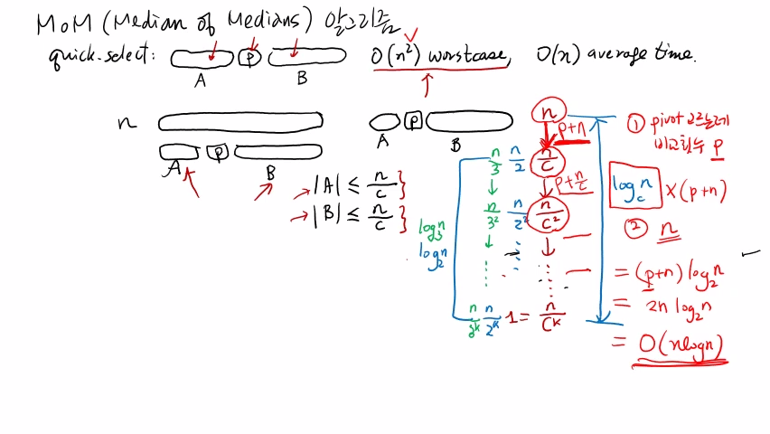
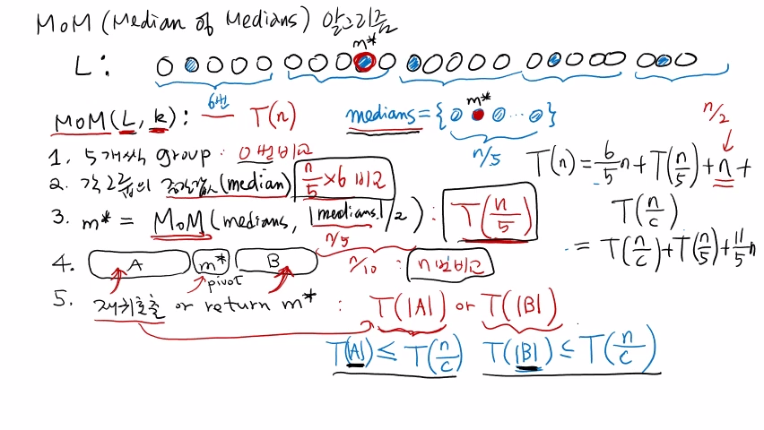
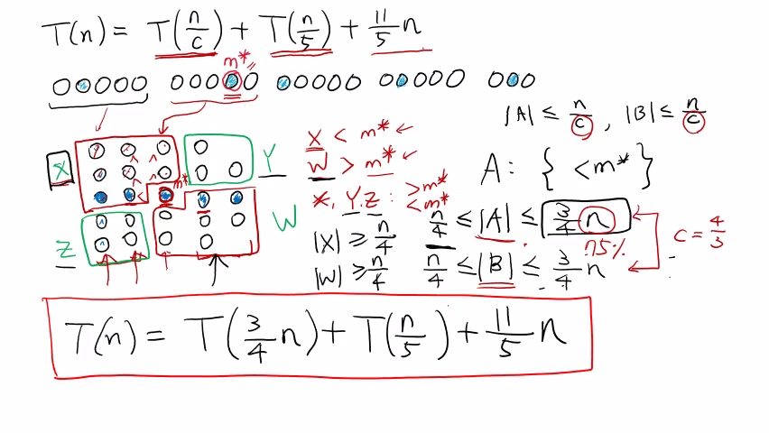

>
해당 포스트는 아래 수업들의 내용을 바탕으로 작성되었습니다.  
> - <a href='https://www.youtube.com/playlist?list=PLsMufJgu5933ZkBCHS7bQTx0bncjwi4PK' target='-blank'>'자료구조 - Data Structures with Python'</a>
> - <a href='https://www.youtube.com/playlist?list=PLsMufJgu5932XYejsOwcUDJ2F75f56nrl' target='-blank'>'알고리즘 - Algorithm with Python'</a>
>
\- Youtube :
<a href='https://www.youtube.com/channel/UCJ4SXKMLQucqaxt4A6PonwQ' target='-blank'>'Chan-Su Shin'</a>  
\- Professor : 신찬수 교수 (한국 외국어 대학교 컴퓨터 공학부)


# 1. Quick Select 와 pivot

## 1-1. Quick Select (복습)

이전 수업에서 살펴봤던 Quick Select 알고리즘을 간단하게 훑어보자.

```
[       ] p [       ]
└── A ──┘   └── B ──┘
```

- 기준으로 사용할 pivot 을 맨 앞에 있는 값이나 임의로 선택한다.
- 하나씩 비교해서 pivot 보다 작은 값, 큰 값을 각각 A, B 에 모은다.
- k번째로 작은 수가 A, B에 있는지, pivot 과 같은지를 결정한다.
- A, B에 있다면, 같은 알고리즘을 A나 B에 대해 재귀적으로 호출한다.
- A(B) 에 대해 호출하면, B(A) 에 있는 값들은 확인할 필요가 없다.
- 즉, 하나는 비교 대상에서 제외하고, 다른 한쪽에서 값을 찾게 된다.

<br>

Quick Select 알고리즘의 효율은 A와 B의 원소 개수에 따라서 분명하게 나뉜다.

```
worst case = O(n^2), average case = O(n)
```

- A와 B가 균등하게 반씩 나뉘면, 적어도 절반의 비교 대상을 제외할 수 있어서 효율적이다.
- A, B 중에 한쪽으로 값이 몰리면, 비교 대상이 거의 줄어들지 않아서, 굉장히 비효율적이다.
- 이렇게, 최악의 경우(worst case) 에는 O(n^2) 정도의 비교 횟수(수행 시간) 가 필요하다.
- 하지만, 최악의 경우는 극히 드물며, 평균적(average case) 으로는 O(n) 정도면 충분하다.
- 일반적인 상황의 기대값(평균의 경우) 이 O(n) 이므로, 굉장히 좋은 알고리즘이라 할 수 있다.

## 1-2. 최악의 경우와 피벗

최악의 경우가 O(n^2) 인 이유는 pivot 을 기준으로 값이 극단적으로 나뉘기 때문이다.

```
[   ] p [           ]
└ A ┘   └──── B ────┘
```

- 한쪽에는 값이 거의 들어있지 않고, 다른 한쪽에 값이 모두 속한다고 가정해보자.
- 이 때, 값이 몰린 쪽에서 재귀적으로 찾아야 하거나, 비슷한 상황이 반복될 수 있다.

<br>

이러한 최악의 경우를 피하기 위해서는 pivot 을 잘 선택하는 것이 중요하다.

> 수행 시간을 좀 더 투자해서, pivot 을 더 신중하게 선택하는 것이다.

```
n = [                   ]
    [       ] p [       ]
    └── A ──┘   └── B ──┘

|A| <= n / c, |B| <= n / c

n -> (n / c) -> (n / c^2) -> ... -> (n / c^k) = 1

c = 2, n -> (n / 2) -> (n / 2^2) -> ... -> (n / 2^k) => log2(n)
c = 3, n -> (n / 3) -> (n / 3^2) -> ... -> (n / 3^k) => log3(n)

n -> (n / c) -> (n / c^2) -> ... -> (n / c^k)
└─────────────────────┬─────────────────────┘
                   logc(n)
```

- 잘 선택된 pivot 은 A와 B가 전체 n에 대해 (n / c) 개 이하의 원소를 갖도록 하는 값이다.
- 왜냐하면, 재귀적으로 호출할 때마다 비교 대상의 범위가 계속해서 줄어들 것이기 때문이다.
   - 비교해야 할 대상이 n개에서 (n / c) 개로, (n / c) 개에서 다시 (n / c^2) 개로, ...
- 결국, 이 과정이 n -> (n / c) -> (n / c^2) -> ... -> (n / c^k) = 1 까지 반복될 것이다.
- 이와 같은 과정을 진행하기 위해서는, 총 logc(n) 번의 재귀적인 호출이 수행되어야 한다.
   - c = 2 일 때, n -> (n / 2) -> (n / 2^2) -> ... -> (n / 2^k) 이므로, log2(n) 번이다.
   - c = 3 일 때, n -> (n / 3) -> (n / 3^2) -> ... -> (n / 3^k) 이므로, log3(n) 번이다.

## 1-3. 피벗 선택과 비교 횟수

여기서 중요한 것은 재귀적으로 호출할 때마다 필요한 비교 횟수다.

```
1. pivot 을 고르는 데 필요한 비교 횟수 p
2. pivot 과 나머지 값을 비교하는 데 필요한 비교 횟수 n
```

- Quick Select 에서는 pivot 을 선택할 때, 비교를 수행하지 않았다.
- 왜냐하면, 맨 앞에 있는 값을 그대로 pivot 으로 선택했기 때문이다.
- pivot 이 매번 바뀌었기 때문에, 전체 숫자를 균등하게 나눌 수 없었다.
- 따라서, pivot 을 제대로 선택하기 위해, 임의의 횟수(p) 만큼 비교해야 한다.
- 또, pivot 과 나머지 값을 전부 비교해야 하므로, n번의 비교가 필요하다.

<br>

이렇게 알고리즘이 수행될 때마다, pivot 을 고르고(p), 다른 수와 비교(n) 해야 한다.

> 또, 원하는 값을 찾기 위해서는, 이러한 과정을 logc(n) 번 반복해야 한다.

```
p + n   p + (n / c)      ...
  ↓          ↓           ...
n -> (n / c) -> (n / c^2) -> ... -> (n / c^k)
└─────────────────────┬─────────────────────┘
                   logc(n)
```

- (n / c) -> (n / c^2) 에서도 pivot 을 고르는 데 필요한 비교 횟수는 p다.
- 하지만, pivot 과 다른 수들을 비교하는 데 필요한 비교 횟수는 (n / c) 이다.
- 이렇게, 재귀적으로 호출되었을 때 필요한 비교 횟수는 항상 (p + n) 보다 작다.
- 왜냐하면, 재귀적인 호출이 반복될 때마다, 비교 대상이 줄어들기 때문이다.

## 1-4. 피벗 선택의 중요성

따라서, 전체적인 수행 과정에서는 (p + n) 번의 비교가 logc(n) 번 반복된다.

```
(p + n) * logc(n) = (p + n) * log2(n)
                  = 2n * log2(n)
                  = O(n * log2(n)) => O(n log n)
```

- 이 때, (p + n) * logc(n) 을 (p + n) * log2(n) 으로 표현할 수 있다.
- 여기서 p가 n보다 작다고 가정하면, (p + n) 은 2n이라고 할 수 있다.
- 결국, 2n * log2(n) 을 빅오 표기법으로 표기하면 O(n log n) 이 된다.

<br>

이렇게, pivot 을 잘 선택한 경우의 비교 횟수 O(n log n) 이 O(n^2) 보다 좋다.

- 즉, A와 B의 원소 개수를 계속 (n / c) 보다 작게 만들면, 무조건 O(n log n) 을 보장하게 된다.
- 따라서, 알고리즘을 더 효율적으로 수행하기 위해서라도, pivot 을 잘 선택하는 것이 중요하다.

<br>

<details><summary>참고 : 실제 교수님 강의 화면 필기 내용</summary>



</details>

# 2. MoM(Median of Medians)

앞에서 설명한 방법을 그대로 사용한 것이 'Median of Medians(MoM)' 알고리즘이다.

> Quick Select 알고리즘과는 'A와 B를 균등하게 나누는 pivot 을 선택한다' 는 점에서 차이가 있다.

- pivot 은 위에서 살펴봤듯, A와 B의 원소 개수가 각각 임의의 수 이상이 되도록 하는 값이다.
- 살짝 복잡해질 수 있지만, 정확히 절반이 아니더라도, 비교적 균등하게 나누기만 하면 된다.

## 2-1. 그룹별로 중앙값 구하기

n개의 숫자가 들어있는 리스트 L 에서 k번째로 작은 숫자를 찾아야 한다.

```
MoM(L, k)

L = ○ ○ ○ ○ ○ ○ ○ ○ ○ ○ ○ ○ ○ ○ ○ ○ ○ ○ ○ ○ ○ ○ ○
    └───┬───┘ └───┬───┘ └───┬───┘ └───┬───┘ └───┬───┘
```

- 우선, 첫 번째로 할 일은 5개씩 모아서 그룹을 만드는 것이다.
- 두 번째로 할 일은 각 그룹의 중앙값(Median) 을 구하는 것이다.
- 5개씩 묶어 값을 비교한 후, 그룹의 중앙값을 결정하는 것이다.

<br>

이 때, 첫 번째 그룹의 중앙값(●) 이 정해졌다고 가정해보자.

```
L = ○ ● ○ ○ ○ ○ ○ ○ ● ○ ● ○ ○ ○ ○ ○ ● ○ ○ ○ ○ ● ○
    └───┬───┘ └───┬───┘ └───┬───┘ └───┬───┘ └───┬───┘
       6번
```

- 값이 5개밖에 없어서, 상수 횟수만큼의 비교를 통해 중앙값을 찾을 수 있다.
- 보통, 6번 정도 비교하면, 5개의 숫자 중에서 중앙값을 항상 찾을 수 있다.
- 같은 방법을 이용해, 나머지 그룹에서도 5개씩 비교하여 중앙값을 찾는다.
   - 위와 마찬가지로 마지막 그룹은 5개를 만족하지 않을 수 있다.
   - 위처럼 3개가 남아있다면, 그 3개 중에서 중앙값을 찾으면 된다.

<br>

이러한 과정을 진행하는 데에 필요한 비교 횟수를 파악해보자.

```
전체 리스트에서 만들어지는 그룹의 수 : n / 5
중앙값을 찾는 데 필요한 비교 횟수   : 6
```

- 그룹의 수는 딱 나누어떨어지지는 않지만, (n / 5) 개 정도 된다.
- (n / 5) 개의 그룹마다 중간값을 찾기 위해 6번씩 비교하게 된다.
- 따라서, 필요한 비교 횟수는 총 (n / 5) * 6 번이라고 할 수 있다.

## 2-2. 중앙값들의 중앙값 구하기

각 그룹에 있는 (n / 5) 개의 중앙값을 모아 'medians' 라고 한다.

```
L = ○ ● ○ ○ ○ ○ ○ ○ ◎ ○ ● ○ ○ ○ ○ ○ ● ○ ○ ○ ○ ● ○
    └───┬───┘ └───┬───┘ └───┬───┘ └───┬───┘ └───┬───┘

medians = {●, ◎, ●, ..., ●}
           └──────┬──────┘
               (n / 5)
```

- 세 번째로 할 일은 medians 에 있는 (n / 5) 개 중에서 다시 중앙값을 구하는 것이다.
- 이 때, 중앙값(●) 들의 중앙값(◎) 은 전체의 2번째 그룹에 있는 중앙값이라고 가정한다.
- 알고리즘 이름이 MoM 으로 정해진 이유는 이렇게 중앙값들의 중앙값을 구하기 때문이다.

<br>

중앙값들의 중앙값을 m\* 라 하고, m\* 를 구하는 방법에 대해 살펴보자.

```
m* = MoM(medians, |medians| / 2)
                      ↓       │
                   (n / 5)    │
                      └───┬───┘
                       (n / 10)
```

- 이 때, m\* 를 구하기 위해서는 MoM 알고리즘을 다시 호출해야 한다.
- 대신에, 이번에는 medians 에 대해서, 중앙값을 구하도록 해야 한다.
- 따라서, k는 medians 의 원소 개수의 절반(|medians| / 2) 이 된다.
- 현재 medians 의 원소 개수는 (n / 5) 이므로, k는 (n / 10) 이 된다.

<br>

> 이렇게, 자기 자신을 재귀적으로 호출함으로써, 중앙값들의 중앙값을 구할 수 있다.

## 2-3. 비교 횟수 정리

n개의 숫자 중에서 k번째로 작은 숫자를 구하는 데 필요한 비교 횟수를 T(n) 이라고 가정한다.

```
1. 5개씩 group                = 0번 비교
2. 각 그룹의 중간값 (median)     = (n / 5) * 6 번 비교
3. m* = MoM(medians, n / 10) = T(n / 5)
4. [   A   ] m* [   B   ]    = n번 비교
5. 재귀 호출 or return m*
```

1. 처음에 5개씩 모아서 그룹을 만들 때는 비교를 수행할 필요가 없다.
2. 다음으로, 각 그룹의 중간값을 찾는 데 필요한 비교 횟수는 (n / 5) * 6 다.
3. 중앙값들의 중앙값을 구하는 재귀적인 호출의 비교 횟수는 T(n / 5) 이다.
   - 정확히는 알 수 없지만, medians 의 원소 개수는 (n / 5) 이기 때문이다.
4. m\* 를 pivot 으로 선택해, m\* 보다 작은 값들(A) 과 큰 값들(B) 을 분류한다.
   - 필요한 비교 횟수는 Quick Select 와 마찬가지로 n이다. (정확히는 (n - 1))
5. k번째로 작은 값의 위치에 따라서, 재귀적으로 호출하거나 바로 반환한다. 
   - A 또는 B이면 재귀적으로 호출하고, 아니면 m\* 를 반환한다. (강의 노트 참조)

<br>

5번 과정에서 MoM 알고리즘을 재귀적으로 호출할 때의 비교 횟수는 아래와 같다.

```
5. 재귀 호출 or return m*
      │
      └─────-> T(|A|) or T(|B|) (|A| <= (n / c), |B| <= (n / c))
               T(|A|) <= T(n / c), T(|B|) <= T(n / c)
```

- 이 때, A 또는 B의 원소 개수에 대해 MoM 알고리즘을 재귀적으로 호출하게 된다.
- 따라서, 재귀적인 호출에 필요한 비교 횟수를 T(|A|) 또는 T(|B|) 로 표현할 수 있다.
- 앞에서 가정했던 데로, A와 B의 원소 개수는 전체 n에 대해 (n / c) 을 넘지 않는다.
- 따라서, 재귀적으로 호출할 때의 비교 횟수는 T(n / c) 의 비교 횟수를 넘지 않는다.

<br>

MoM 알고리즘의 수행 시간 T(n) 은 이러한 비교 횟수를 모두 합쳐서 정리할 수 있다.

```
T(n) = 0 + ((n / 5) * 6) + T(n / 5) + n + T(n / c)
     = (6n / 5) + T(n / 5) + n + T(n / c)
     = T(n / c) + T(n / 5) + (11n / 5)
```

<br>

<details><summary>참고 : 실제 교수님 강의 화면 필기 내용</summary>



</details>

# 3. 점화식 파악하기

이렇게 MoM 알고리즘의 수행 시간을 점화식 T(n) 으로 표시하는 방법에 대해 살펴봤다.

```
T(n) = T(n / c) + T(n / 5) + (11n / 5)
```

- 5개씩 모아 그룹을 만들고, 비교를 통해 그룹마다 중앙값을 고른다. `= (6n / 5)`
- MoM 알고리즘을 재귀적으로 호출해 중앙값들의 중앙값을 구한다. `= T(n / 5)`
- 중앙값들의 중앙값을 pivot 으로 선택하여, 다른 값들을 분류한다. `= n`
- 찾는 값이 들어있는 집합에 대해 재귀적으로 알고리즘을 호출한다. `= T(n / c)`

<br>

여기서 중요하게 생각하고, 증명해야 할 것은 'A와 B의 원소 개수가 (n / c) 이하라는 것' 이다.

```
|A| <= n / c, |B| <= n / c
```

- 그러기 위해선, m\* 를 pivot 으로 선택했을 때, c의 값이 얼마인지 알아내야 한다.
- 다시 말하자면, 'm\* 를 구했을 때, 항상 보장되는 A와 B의 원소 개수의 최대값' 이다.

## 3-1. 그룹 나열하기

위의 내용을 쉽게 증명할 수 있도록 그룹의 나열 방식을 바꿔보자.

```
○ ● ○ ○ ○ ○ ○ ○ ◎ ○ ● ○ ○ ○ ○ ○ ● ○ ○ ○ ○ ● ○
└───┬───┘ └───┬───┘
    ◐    ◐    ◐    ◐
    ◐    ◐    ◐    ◐    ◐
    ●    ●    ◎    ●    ● <-
    ◑    ◑    ◑    ◑    ◑
    ◑    ◑    ◑    ◑
    └─┬──┘    ↑    └──┬─┘
```

- 가로로 나열된 그룹을 세로로 세워서 나열하고, 중앙값(●) 을 가운데로 옮긴다.
- 중앙값보다 작은 값(◐) 은 중앙값보다 위쪽, 큰 값(◑) 은 아래쪽으로 옮긴다.
- 모든 그룹을 같은 방식으로 나열하고, 마지막 그룹의 위치를 가운데로 맞춘다.
- 중앙값들의 중앙값인 m\*(◎) 가 속한 그룹이 가장 가운데에 오도록 배치한다.
- 마지막으로, 그룹의 중앙값이 m\* 보다 작으면 왼쪽, 크면 오른쪽으로 배치한다.

## 3-2. 구역 나누기

여기서 그룹을 다시 4개로 나눈 후에, 각각 X, Y, Z, W 라는 이름을 붙인다.

```
  ┌───────────┬───────┐
  │ ●   ●   ◑ │ ○     │
  │           │       │ Y
X │ ●   ●   ◑ │ ○   ○ │      X < m*
  │       ┌───┼───────┤      W > m*
  │ ◐   ◐ │ ◎ │ ○   ○ │
  ├───────┼───┘       │      Y, Z < m*
  │ ○   ○ │ ○   ○   ○ │ W         > m*
Z │       │           │
  │ ○   ○ │ ○   ○     │
  └───────┴───────────┘
```

- m\* 보다 중앙값이 작은 그룹은 왼쪽, 큰 그룹은 오른쪽에 배치했다.
- 그룹의 중앙값보다 작은 항목은 위쪽, 큰 항목은 아래쪽에 배치했다.

<br>

이 때, X 구역에 속해 있는 모든 값의 크기는 m\*(◎) 보다 작다. `(같을 수도 있다.)`

- m\* 의 위에 있는 두 값(◑) 은 m\* 가 속한 그룹 내에서 m\* 보다 작다.
- 그리고, m\* 의 왼쪽에 있는 두 그룹의 중앙값(◐) 은 모두 m\* 보다 작다.
- 또한, m\* 보다 작은 중앙값(◐) 의 위에 있는 값들(●) 도 m\* 보다 작다.
- 이와 반대로, W 구역에 속해 있는 모든 값의 크기는 m\* 보다 크다. `(같을 수도 있다.)`
- 하지만, Y 구역과 Z 구역에는 m\* 보다 큰 값 또는 작은 값들이 섞여 있다.

## 3-3. 비교 대상의 범위

X 구역에 있는 값의 개수와 W 구역에 있는 값의 개수는 모두 (n / 4) 이상이다.

```
|X| >= (n / 4)  &  |W| >= (n / 4)
```

<br>

즉, m\* 보다 작은 값의 개수와 큰 값의 개수는 모두 (n / 4) 개 이상이다.

```
A = { < m* } => (n / 4) <= |A|
```

- A는 m\* 보다 작은 값, 즉, A는 X에 있는 값을 모두 포함한다.
- 따라서, A의 원소 개수는 최소 (n / 4) 이상이라고 할 수 있다.

<br>

그리고, A의 원소 개수가 최대가 되는 상황은 최악의 경우라고 할 수 있다.

```
(n / 4) <= |A| <= (3n / 4)
```

- 이 때, Y와 Z에 있는 값은 전부 m\* 보다 작을 수도 있고, 클 수도 있다.
- 또, A가 Y와 Z에 있는 값을 모두 포함하면, A의 원소 개수는 최대가 된다.
- 그러므로, Y와 Z에 있는 값이 모두 m\* 보다 작은 상황이 최악의 경우다.
- 이는 W에 있는 (n / 4) 개를 제외한 나머지가 m\* 보다 작은 상황이다.
- 따라서, A의 원소 개수는 최대 n - (n / 4) = (3n / 4) 이라고 할 수 있다.
- 결국, A에 있는 값의 개수는 최소 (n / 4) 이상 최대 (3n / 4) 이하가 된다.

<br>

마찬가지로, B에 있는 값의 개수도 최소 (n / 4) 이상 최대 (3n / 4) 이하가 된다.

```
(n / 4) <= |B| <= (3n / 4) = (n / c)

(3n / 4) = (n / c) => (3 / 4) = (1 / c) => c = (4 / 3)
```

- 위에서 살펴봤듯, A와 B의 원소 개수는 전체 n에 대해 (n / c) 을 넘지 않는다.
- 따라서, (3n / 4) = (n / c) 이고, c는 (3 / 4) 의 역수를 취한 (4 / 3) 가 된다.

## 3-4. 정리

결국, 전체 n에 대해, A(B)가 75% 이하라면, B(A)는 25% 이상이 된다.

- 다시 말하자면, 'A와 B의 원소 개수는 절대 0이 되지 않는다' 라고 할 수 있다.
- 완벽하게 반이 되지 않더라도, (1 / 4) 이상 (3 / 4) 이하가 보장된다는 것이다.

<br>

위에 있는 식을 다시 써보면, 아래와 같이 약간 복잡한 점화식이 만들어진다.

```
T(n) = T(n / c) + T(n / 5) + (11n / 5)
     = T(3n / 4) + T(n / 5) + (11n / 5)
```

- MoM 알고리즘은 위의 점화식만큼의 비교를 수행하는 것이라고 할 수 있다.
- 다음 수업에서는 위의 점화식을 전개해서 푸는 방법에 대해 살펴볼 것이다.

<br>

<details><summary>참고 : 실제 교수님 강의 화면 필기 내용</summary>



</details>
