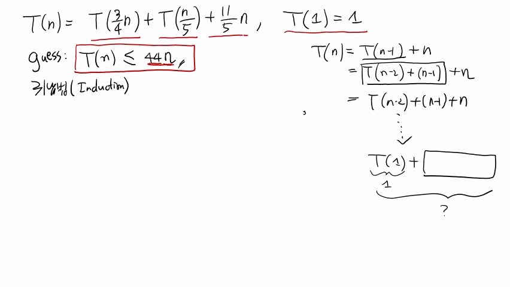
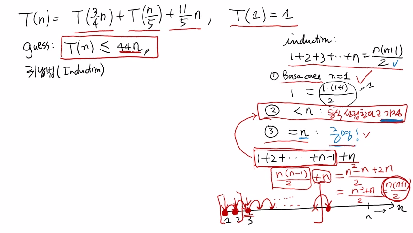
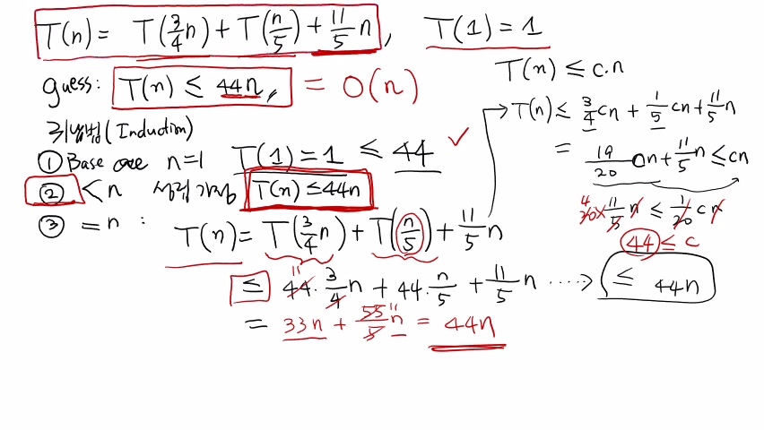

>
해당 포스트는 아래 수업들의 내용을 바탕으로 작성되었습니다.  
> - <a href='https://www.youtube.com/playlist?list=PLsMufJgu5933ZkBCHS7bQTx0bncjwi4PK' target='-blank'>'자료구조 - Data Structures with Python'</a>
> - <a href='https://www.youtube.com/playlist?list=PLsMufJgu5932XYejsOwcUDJ2F75f56nrl' target='-blank'>'알고리즘 - Algorithm with Python'</a>
>
\- Youtube :
<a href='https://www.youtube.com/channel/UCJ4SXKMLQucqaxt4A6PonwQ' target='-blank'>'Chan-Su Shin'</a>  
\- Professor : 신찬수 교수 (한국 외국어 대학교 컴퓨터 공학부)


# 1. 점화식과 풀이법

## 1-1. MoM 알고리즘의 점화식

이전 수업에서는 MoM 알고리즘의 비교 횟수를 점화식 T(n) 으로 표현해봤다.

```
T(n) = T(3n / 4) + T(n / 5) + (11n / 5), T(1) = 1
```

알고리즘의 수행 과정에서, 총 두 번의 재귀 호출이 수행된다.

- (n / 5) 개의 medians 에서, 중앙값들의 중앙값을 구하기 위해 재귀적으로 호출한다.
- 최대 (3n / 4) 개의 원소를 갖는 A 또는 B에서 값을 찾기 위해 재귀적으로 호출한다.

<br>

n = 1 일 때, 즉, 첫 번째 항(초항) 을 1이라고 가정해보자.

- 값이 하나밖에 없을 때, 그중에서 k번째로 작은 숫자를 찾으면, k는 무조건 1일 수밖에 없다.
- 따라서, 주어진 입력 값이 답이 되고, 이는 상수 시간, 즉, 1이라고 생각해도 전혀 문제가 없다.

## 1-2. 전개를 이용한 풀이

이전에 살펴봤던 점화식 T(n) = T(n - 1) + n 의 경우, 점화식을 전개해서 풀었다.

```
T(n) = T(n - 1) + n
     = (T(n - 2) + (n - 1)) + n
     = T(n - 2) + (n - 1) + n
       ...
     = T(1) + (전개해서 나온 값들의 합)
       └─┬┘               │
         1                │
         └───────┬────────┘
                 ?
```

- 이 때, T(n - 1) = T(n - 2) + (n - 1) 이므로, T(n) = (T(n - 2) + (n - 1)) + n 이다.
- 이것을 T(1) 까지 계속 전개하면, T(n) = T(1) + (전개해서 나온 값들의 합) 이 된다.
- T(1) = 1 이기 때문에, 1 + (전개해서 나온 값들의 합) 을 구하면 점화식을 풀 수 있다.

## 1-3. 추측과 귀납법

이렇게, 전개하여 푸는 방식 외에, 다른 방식으로도 점화식을 풀 수 있다.

```
guess: T(n) <= 44n
```

점화식을 푸는 가장 쉬운 방법의 하나는, 바로 **'추측(Guess)'** 을 이용하는 것이다.

> 예를 들어, 'T(n) 은 아무리 커도, 44n보다는 작을 것이다.' 라고 추측하는 것이다.

<Br>

추측하는 방법이 따로 정해져 있는 것은 아니지만, 경험에 의한 추측이 가능하다.

> 44n으로 추측한 후에, 틀렸다면 높여보고, 맞았다면 낮춰보는 식으로 하면 된다.

<Br>

이 때, MoM 알고리즘의 비교 횟수를 44n 이하로 추측하여 증명하려는 것은 아래와 같다.

> 'MoM 알고리즘의 수행 시간은 O(n log n) 보다 더 작은, 44n 정도면 충분하다.'

- 44n인 이유는 뒷부분에서 다룰 것이며, 우선, 44n이 맞는지를 확인해볼 것이다.
- 이러한 추측의 내용을 증명하기 위해서 **'귀납법(Induction)'** 을 이용할 수 있다.

<br>

<details><summary>참고 : 실제 교수님 강의 화면 필기 내용</summary>



</details>

# 2. 귀납법으로 증명하기

귀납법은 어떠한 식이 성립한다는 것을 증명하는 상황에서 많이 사용되는 방법이다.

> 1 + 2 + 3 + ... + n = (n(n + 1) / 2) 이라는 등식이 성립함을 귀납법을 통해 증명해보자.

## 2-1. 귀납법의 규칙(rule)

```
1 + 2 + 3 + ... + n = (n(n + 1) / 2)

1. Base case(n = 1) => 1 = (1(1 + 1) / 2) = 1

2. < n : 등식이 성립한다고 가정

3. = n : 증명!
```

1. 우선, 바닥 조건(Base Case), 즉, n이 가장 작을 때인 n = 1 일 때를 확인한다.
   - n = 1 을 대입하면, 1 = (1(1 + 1) / 2) = 1 이므로, 왼쪽 항과 오른쪽이 같다.
   - 이렇게 n이 가장 작은 값인 상황, 즉, 바닥 조건에서 주어진 등식이 성립한다.
2. 다음으로, n보다 작은 경우(< n) 에 대해, 주어진 등식이 성립한다고 가정한다.
3. 그리고, n인 경우(= n) 에 대해, 주어진 등식이 실제로 성립함을 증명하면 된다.
   - 이미, 'n보다 작은 모든 n에 대해, 주어진 등식이 항상 성립한다.' 라고 가정했다.
   - 따라서, 아직 증명되지 않은 n에 대해서, 이러한 등식이 성립함을 증명하면 된다.

## 2-2. 규칙에 대한 설명

등식이 성립한다는 것은, n = 1 부터, 이후의 모든 n에 대해 성립한다는 것을 의미한다.

> 왜냐하면, 특정 n에 대해서만 성립하는 경우, 등식이 항상 성립한다고 할 수 없기 때문이다.

```
↓ ↓ ↓     ↓
├─┼─┼───────────|─┤
1 2 3    ...      n
```

- 현재의 예시에서는 바닥 조건, 즉, n = 1 일 때에 등식이 성립한다는 것을 확인했다.
- 따라서, 이후의 n = 2 -> n = 3 -> ... -> 의 상황에서도 등식이 성립함을 보여야 한다.
- 하지만, 무수히 많은 n에 대해, 각각의 등식이 성립한다는 것을 일일이 보일 수는 없다.
- 때문에, 바닥 조건이 성립함을 보이고, n이 되기 직전까지 성립한다고 가정하는 것이다.
- 결국, n에서도 성립함을 보이면, 연쇄적으로 모든 n에 대해 성립함을 증명한 것이 된다.

## 2-3. 귀납법의 증명 과정

```
1 + 2 + ... + (n - 1) + n

1 + 2 + ... + (n - 1) + n
└─────────┬─────────┘
    (n(n - 1) / 2) + n = ((n^2 - n + 2n) / 2)
                       = ((n^2 + n) / 2)
                       = (n(n + 1) / 2)
```

- n보다 작은 경우에 대해, 1 + 2 + 3 + ... + n = (n(n + 1) / 2) 은 참이다.
- 따라서, 1 + 2 + ... + (n - 1) = (n(n - 1) / 2) 이 성립한다고 할 수 있다.
- (n(n - 1) / 2) 에 n을 더하고, 식을 다시 정리하면, (n(n + 1) / 2) 이 된다.

<br>

> 귀납법은, 이렇게 바닥 조건부터 하나씩 연쇄적으로 식이 성립함을 증명하는 방법이다.

<br>

<details><summary>참고 : 실제 교수님 강의 화면 필기 내용</summary>



</details>

# 3. MoM 알고리즘의 수행 시간

## 3-1. 점화식 풀이

MoM 알고리즘의 점화식에 대한 추측인 T(n) <= 44n 을 귀납법으로 풀어보자.

```
guess : T(n) <= 44n

1. Base case(n = 1) => T(1) = 1 <= 44

2. < n : 성립 가정  => T(n) <= 44n

3. = n : T(n) = T(3n / 4) + T(n / 5) + (11n / 5)
                    └──┐        └───────┐  └───────────┐
                       ↓                ↓              ↓
              <= (44 * (3n / 4)) + (44 * (n / 5)) + (11n / 5) <= 44n
                  = 33n + (44n / 5) + (11n / 5)
                  = 33n + (55n / 5)
                  = 33n + 11n = 44n
```

1. 우선, n이 가장 작을 때, 즉, n = 1 일 때, T(n) <= 44n 이 성립함을 증명한다.
   - T(1) = 1 이므로, T(1) = 1 <= 44 가 되면서 바닥 조건이 성립하게 된다.
2. 다음으로, n보다 작은 모든 값에 대해, T(n) <= 44n 이 성립한다고 가정한다.
3. 마지막으로, n인 경우에 대해, T(n) <= 44n 이 성립한다는 것을 증명하면 된다.
   - 이 때, T(3n / 4) 은 n이 아닌, n보다 작은 (3n / 4) 에 대한 수행 시간이다.
   - 이는 n보다 작은 경우이기 때문에, T(n) <= 44n 을 그대로 사용할 수 있다.
   - 따라서, T(3n / 4) 을 44의 (3n / 4) 에 해당하는 값으로 대체할 수 있다.
   - 마찬가지로, T(n / 5) 도 44의 (n / 5) 에 해당하는 값으로 대체할 수 있다.
   - 이렇게 완성된 식을 풀어보면 33n + (44n / 5) + (11n / 5) = 44n 이 된다.
   - 결국, T(n) = 44n <= 44n 이므로, T(n) <= 44n 이라는 것이 증명되었다.

## 3-2. 수행 시간 분석

T(n) <= 44n 가 증명되었으므로, T(n) 은 O(n log n) 이 아닌, O(n) 이 된다.

- 이는, 'MoM 알고리즘이 수행되는데 필요한 비교 횟수는 n에 비례한다' 라는 것을 의미한다
- 다시 말해, n개의 숫자 중에서 k번째로 작은 숫자를 찾는 데에 선형 시간이 걸린다는 뜻이다.

## 3-3. 추측의 근거

```
T(n) <= (c * n)

T(n) = T(3n / 4) + T(n / 5) + (11n / 5)
     <= (3cn / 4) + (cn / 5) + (11n / 5)
         = ((19 / 20) * cn) + (11n / 5) <= cn
                              (11n / 5) <= ((1 / 20) * cn)
                                     44 <= c
```


- 'T(n) 은 임의의 상수 c에 대한 (c * n) 보다 작거나 같을 것이다.' 라고 가정한다.
- 이렇게 만들어진 T(n) = (c * n) 이라는 등식에, 그대로 귀납법을 적용하면 된다.
- T(n) = (3cn / 4) + (cn / 5) + (11n / 5) 이 되고, 이 값이 cn보다 작으면 된다.
- 결국, 이러한 식을 풀면 44 <= c 가 되므로, 44n이라는 값을 추측하게 된 것이다.

<br>

> 강의 영상의 점화식은 강의노트의 것과 살짝 다르지만, 이해하기 더 쉬운 점화식이다.

<br>

<details><summary>참고 : 실제 교수님 강의 화면 필기 내용</summary>



</details>
