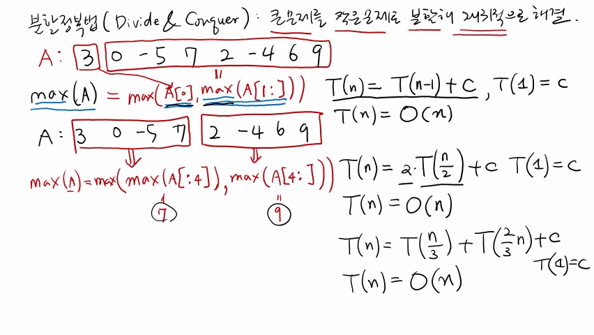
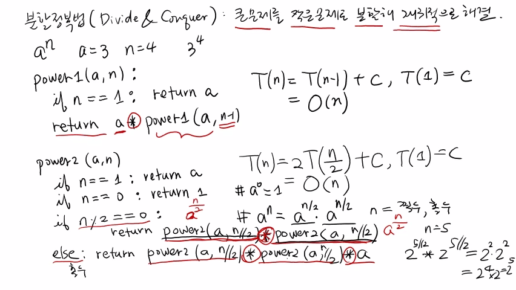
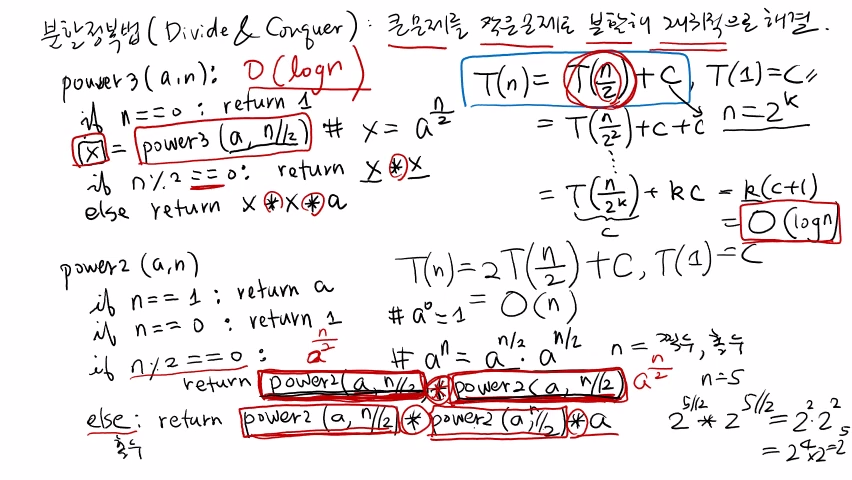

>
해당 포스트는 아래 수업들의 내용을 바탕으로 작성되었습니다.  
> - <a href='https://www.youtube.com/playlist?list=PLsMufJgu5933ZkBCHS7bQTx0bncjwi4PK' target='-blank'>'자료구조 - Data Structures with Python'</a>
> - <a href='https://www.youtube.com/playlist?list=PLsMufJgu5932XYejsOwcUDJ2F75f56nrl' target='-blank'>'알고리즘 - Algorithm with Python'</a>
>
\- Youtube :
<a href='https://www.youtube.com/channel/UCJ4SXKMLQucqaxt4A6PonwQ' target='-blank'>'Chan-Su Shin'</a>  
\- Professor : 신찬수 교수 (한국 외국어 대학교 컴퓨터 공학부)


# 1. 분할 정복법

이전 수업에서 살펴봤던 '재귀 알고리즘으로 문제를 해결하는 방법' 을 좀 더 일반화하여 정리해보자.

> 이렇게, 문제 해결을 위해 재귀를 이용하는 방법을 '분할 정복법(Divide & Conquer)' 이라 한다.

## 1-1. 분할 정복법이란

말 그대로, 쪼개진(divide) 작은 문제들을 정복(conquer) 하여, 원래 문제의 답을 구하는 방법이다.

- 우선, 큰 문제 하나를, 해결하기 쉬운 작은 문제 여러 개로 나누는 것을 재귀적으로 반복한다.
- 그러한 작은 문제들의 답을 찾은 다음, 그것을 하나씩 종합해서 더 큰 문제의 답을 반환한다.
- 최종적으로는, 처음에 구하고자 했던 결과, 즉, 원래 문제의 입력에 대한 출력을 얻을 수 있다.

## 1-2. 최대값 찾기 풀이1

주어진 n개의 숫자 중에서 최대값을 구하는 '최대값 찾기 문제' 를 예시로 살펴보자.

> 최대값 찾기 문제는 이전 수업(시간 복잡도, 선택 문제) 에서 살펴봤던 예제다.

```
A: 3, 0, -5, 7, 2, -4, 6, 9
   │  └─────────┬─────────┘
   └─┐          │ 
     ↓          ↓
max(A[0], max(A[1:])) = max(A)
```

- 우선, 입력으로 받은 A에 (3, 0, -5, 7, 2, -4, 6, 9), 총 8개의 숫자가 있다고 가정한다. 
- 맨 앞에 있는 숫자와 나머지 (n - 1) = 7 개의 숫자를 비교해, 최대값을 구할 수 있다.
- 다시 말해, 'A[0] 과 A[1:] 의 최대값 중에서 더 큰 숫자' 를 최대값이라 정의할 수 있다.
- 이는 결국, 'A의 최대값을 구하기 위해, A[1:] 의 최대값을 구한다.' 는 것을 의미한다.
- 따라서, '맨 앞에 있는 값과 나머지의 최대값 중에서 더 큰 값' 이 원래 입력의 답이 된다.

<br>

이런 식으로 문제를 나눴을 때, 문제 해결에 필요한 전체 수행 시간 T(n) 을 구해보자.

```
T(n) = T(n - 1) + c
```

- (n - 1) 개의 원소에 대해 똑같은 문제를 풀어야 해서, T(n - 1) 만큼의 수행 시간이 필요하다.
- 그렇게 구한 최대값과 맨 앞에 있는 원소를 비교하기 위해, 상수 횟수의 연산을 수행하게 된다.

<br>

이전의 수업에서 언급했듯, 이러한 알고리즘의 수행 시간은 n에 관한 점화식으로 표현된다.

```
T(1) = c, T(n) = O(n)
```

- 그리고, 이러한 점화식을 풀려면, 바닥 조건, 즉, n = 1 일 때의 수행 시간 T(1) 이 필요하다.
- 이 때, T(1) 은 보통 1 또는 임의의 상수 c라고 가정하며, 이것을 풀면 T(n) = O(n) 이 된다.

## 1-3. 최대값 찾기 풀이2

앞에서처럼 '하나와 나머지 (n - 1) 개' 로 나누는 대신에, 문제를 반으로 나눠도 된다.

```
A: 3, 0, -5, 7, 2, -4, 6, 9
   └────┬────┘  └────┬────┘
        ↓            ↓
max(max(A[:4]), max(A[4:])) = max(A)
```

- 왼쪽 반과 오른쪽 반으로 나눠서, 최대값을 구하기 위해 각각 2번의 재귀 호출을 하게 된다.
- 이렇게 구한 왼쪽의 최대값과 오른쪽의 최대값 중에 큰 값이 문제의 답인 A의 최대값이 된다.

<br>

이렇게 문제를 반으로 나눴을 때, 필요한 전체 수행 시간 T(n) 은 아래와 같다.

```
T(n) = (2 * T(n / 2)) + c, T(1) = c
     = O(n)
```

- 왼쪽과 오른쪽을 절반씩, 재귀적으로 호출해서, T(n / 2) 만큼의 수행 시간이 2번 필요하다.
- 그렇게 구한 왼쪽과 오른쪽의 최대값을 비교하기 위해, 상수 횟수의 연산을 수행하게 된다.
- 앞에서와 마찬가지로, T(1) 의 값을 c라고 가정하고, 이 점화식을 풀어보면, O(n) 이 된다.

<br>

이렇게 절반씩 나누는 대신, 왼쪽 (1 / 3) 과 오른쪽 (2 / 3) 로 나눠도 문제는 없다.

```
T(n) = T(n / 3) + T(2n / 3) + c, T(1) = c
     = O(n)
```

- 이 때, 왼쪽과 오른쪽의 재귀적인 호출에 필요한 수행 시간은 T(n / 3) + T(2n / 3) 이다.
- 이번에도, 왼쪽과 오른쪽의 최대값을 비교하기 위해, 상수 횟수의 연산을 수행하게 된다.
- 위에서와 마찬가지로, T(1) 의 값을 c라고 가정하고 풀었을 때, 이 점화식도 O(n) 이 된다.

<br>

<details><summary>참고 : 실제 교수님 강의 화면 필기 내용</summary>



</details>

# 2. 거듭제곱 문제 - O(n)

최대값 찾기와 비슷한, 다른 예제와 함께 분할 정복법을 좀 더 자세하게 살펴보자.

```
a^n, a = 3, n = 4 => 3^4
```

- a와 n이 주어졌을 때, a^n 을 구하는, 즉, 거듭제곱을 구하는 문제를 살펴볼 것이다.
- 예를 들어, a의 값과 n의 값으로 각각 3, 4가 주어지면, 3^4 을 구해야 하는 것이다.
- 알고리즘의 이름은 'power(거듭제곱)' 라 하고, 뒤에는 순서대로 숫자를 붙일 것이다.

## 2-1. 풀이1

위에서 언급했듯, 현재 예시에서 문제 해결에 사용할 알고리즘의 이름은 power1 이다.

```
power1(a, n): a^n = a * a^(n - 1)
     │                  └───┬───┘
     │                      └──┐
     │                         ↓
     └-> power1(a, n) = power1(a, n - 1) * a
```

- '최대값 찾기 풀이1' 와 마찬가지로, 문제를 '하나와 나머지 전부' 로 나눌 수 있다.
- 이 때, a^n = a * a^(n - 1) 이고, a^(n - 1) 은 power1(a, n - 1) 로 구할 수 있다.
- 즉, 알고리즘을 재귀 호출하여 a^(n - 1) 을 구하고, 거기에 a를 곱하면 a^n 이 된다.

<br>

이렇게 파악한 방법, 즉, 알고리즘을 그대로 옮겨서, 의사 코드를 작성할 수 있다.

```py
power1(a, n):
    if n == 1: return a         <- 1
    return a * power1(a, n - 1) <- 2
           │   └──────┬───────┘
           │      a^(n - 1)
           └─────┬────┘
                a^n
```

1. 재귀 알고리즘이기 때문에, 처음에는 무조건 바닥 조건을 확인해야 한다.
   - 만약 n == 1 이면, a^1 = a 이기 때문에, a를 반환하면 된다.
2. 바닥 조건이 아니라면, a에 power1(a, n - 1) 을 곱한 값을 반환하면 된다.
   - 이 때, n의 값이 1이 될 때까지, 알고리즘이 재귀적으로 호출된다.
   - 이후, n의 값이 1이 되면, 값이 반환되면서, a^(n - 1) 이 계산된다.
   - 그리고, a^(n - 1) 에 a를 곱하면, a^n, 즉, 원래 문제의 답이 된다.

> 참고 : 실제로 코드를 실행하기 위해선, n == 0 일 때, 1을 반환하는 코드를 추가해야 한다.

<br>

이러한 방법을 사용했을 때, 문제 해결에 필요한 수행 시간 T(n) 은 아래와 같다.

```
T(n) = T(n - 1) + c, T(1) = c
     = O(n)
```

- a^(n - 1) 을 구하는 재귀 호출에 필요한 수행 시간은 T(n - 1) 이다.
- a^(n - 1) 과 a를 곱하기 때문에, 상수 횟수의 연산을 수행하게 된다.
- n == 1 일 때, 즉, 바닥 조건일 때의 수행 시간인 T(1) 은 상수가 된다.
- 이 점화식을 풀면, '최대값 찾기 풀이1' 와 마찬가지로, O(n) 이 된다.

## 2-2. 풀이2

'최대값 찾기 풀이2' 와 마찬가지로, '왼쪽 반과 오른쪽 반' 으로 나눌 수 있다.

```py
power2(a, n):
    if n == 1: return a
    if n == 0: return 1 # a^0 = 1
    if n % 2 == 0:      # a^n = a^(n / 2) * a^(n / 2)
        return power2(a, n // 2) * power2(a, n // 2)
    else:               # 홀수
        return power2(a, n // 2) * power2(a, n // 2) * a
```

- 만약 n == 1 이면, a를 반환하고, 만약 n == 0 이면, a^0 = 1 이므로, 1을 반환한다.
- n이 1 또는 0이 아니라면, n이 짝수인지 홀수인지에 따라, 그에 맞는 값을 반환한다.
- a^n = a^(n / 2) * a^(n / 2) 이고, a^(n / 2) 은 power2(a, n // 2) 로 구할 수 있다.
- n = 5 일 때, (5 // 2) = 2 이므로, a^(n / 2) * a^(n / 2) = a^2 * a^2 = a^4 가 된다.
- 이렇게, 지수가 1 부족하므로, n이 홀수라면, a^(n / 2) * a^(n / 2) 에 a를 곱해야 한다.
- 따라서, n이 짝수면 a^(n / 2) * a^(n / 2) 를, 홀수면 거기에 a를 곱해서 반환하면 된다.

<br>

이렇게, 문제를 반으로 나눠서 해결했을 때의 수행 시간 T(n) 은 아래와 같다.

```
T(n) = (2 * T(n / 2)) + c, T(1) = c
     = O(n)
```

- (n / 2) 에 대해 재귀적으로 호출하기 때문에, T(n / 2) 만큼의 수행 시간이 2번 필요하다.
- 짝수일 때는 곱하기 1번, 홀수일 때는 곱하기 2번, 즉, 상수 횟수의 연산을 수행하게 된다.
- 이 때, T(1) = c 이고, 점화식을 풀면, ‘최대값 찾기 풀이2’ 와 마찬가지로, O(n) 이 된다.

<br>

<details><summary>참고 : 실제 교수님 강의 화면 필기 내용</summary>



</details>

# 3. 거듭제곱 문제 - O(log2(n))

이렇게 살펴본 방법들은, 재귀 호출 횟수에 상관없이 모두 선형 시간 O(n) 에 수행된다.

> 하지만, 앞에서 살펴봤던 power2 알고리즘의 경우, 효율성 향상의 여지가 있다.

- power2 알고리즘은, a^(n / 2) 의 값을 구하기 위해서 재귀 호출을 두 번 수행한다.
- 사실, 두 번 계산할 필요 없이, 둘 중의 하나만 계산해서, 그 값을 다시 사용하면 된다.

## 3-1. 코드 작성

```py
power3(a, n):
    if n == 0: return 1
    x = power3(a, n // 2) # x = a^(n / 2)
    if n % 2 == 0: return x * x
    else: return x * x * a
```

- n == 1 일 때, 재귀 호출에서 (1 // 2) = 0 으로 처리되므로, n == 0 일 때만 처리한다.
- 그리고, x라는 변수를 선언해서, a^(n / 2) 의 값, 즉, power3(a, n // 2) 을 할당한다.
- power2 처럼, n이 짝수면 a^(n / 2) * a^(n / 2), 홀수면 거기에 a를 곱하여 반환한다.
- x = a^(n / 2) = power3(a, n // 2) 이므로, power3(a, n // 2) 대신 x 를 사용한다.

## 3-2. 수행 시간 파악

```
T(n) = T(n / 2) + c, T(1) = c, n = 2^k
```

- (n / 2) 에 대해서 재귀 호출을 한 번 수행할 때, 필요한 수행 시간은 T(n / 2) 다.
- 이전과 마찬가지로, 부가적인 연산들(곱하기, 비교) 은 상수 횟수만큼 수행된다.
- 이번에도 T(1) = c 이며, 점화식을 계산하기 위해서 n = 2^k 이라고 가정한다.  
- n = 2^k 이라고 가정하는 이유는, 재귀 호출마다 n이 반으로 줄어들기 때문이다.

## 3-3. 점화식 풀이

```
T(n) = T(n / 2) + c
     = (T(n / 2^2) + c) + c
       ...
     = T(n / 2^k) + kc
     = T(n / n) + kc
     = T(1) + kc
     = c + kc
     = c * (k + 1)
     = c * (log2(n) + 1)
     = c * log2(n) + c
     = O(log2(n))
```

- T(n / 2) = T(n / 2^2) + c 을 이용해, T(n / 2^k) 이 될 때까지 점화식을 풀어준다.
- n이 반으로 줄어들 때마다 c가 추가되어, T(n / 2^k) 일 때, c의 개수는 k가 된다.
- n = 2^k 이므로, T(n / 2^k) = T(n / n) = T(1) = c, T(n) = c * (k + 1) 이 된다.
- k의 값을 구하기 위해, n = 2^k 에서 양변에 로그를 취하면, k = log2(n) 이 된다.
- 점화식을 풀면, T(n) = c * (k + 1) = c * (log2(n) + 1) = c * log2(n) + c 이 된다.
- 이를 빅오 표기법으로 표현하면, 결국, power3 의 수행 시간은 O(log2(n)) 이 된다.

<br>

power1, power2의 수행 시간은 O(n) 이었지만, power3의 수행 시간 O(log2(n)) 이다.

> 이 때, n보다 log2(n) 이 더 천천히 증가하므로, power3가 더 빠르게 수행된다고 할 수 있다.

## 3-4. 정리

이렇게, 거듭제곱을 구하는 3가지 재귀적인 방법을 설명했다.

1. a를 하나 고정하고, 나머지 a^(n - 1) 을 구하기 위해서 재귀 호출을 한 번 하는 방법
2. a^n 을 반으로 나눈 값인 a^(n / 2) 을 구하기 위해서 재귀 호출을 두 번 하는 방법
3. 한 번의 재귀 호출로 a^(n / 2) 을 미리 구해둔 후에, 임의의 변수에 저장해놓는 방법

<br>

이 때, 3번 방법은 '원래 입력의 절반' 에 대해서 '한 번' 만 재귀 호출을 수행한다.

- 따라서, 3번 방법의 수행 시간은 O(log2(n)), 나머지 1, 2번 방법은 O(n) 이다.
- 이렇게, 재귀를 어떤 식으로 하는지에 따라서, 수행 시간에 차이가 날 수 있다.

<br>

재귀 방식을 바꿔서 수행 시간을 개선하는 방법은 나중에 다른 수업에서 살펴보자.

> 다음 수업에서는, 피보나치 수를 구하는 여러 가지 방법에 대해 다뤄볼 것이다.

<br>

<details><summary>참고 : 실제 교수님 강의 화면 필기 내용</summary>



</details>
