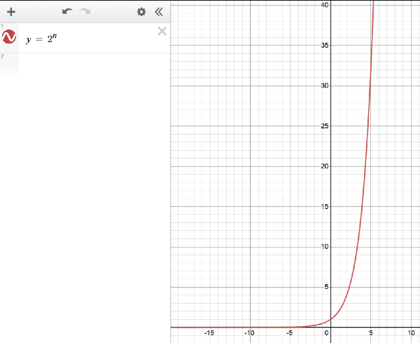
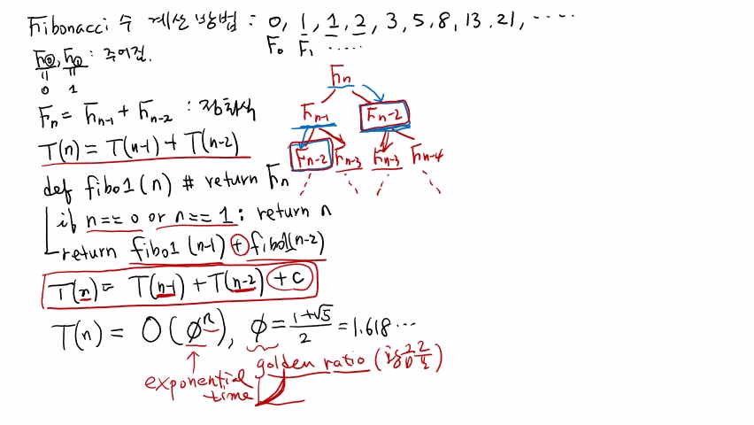
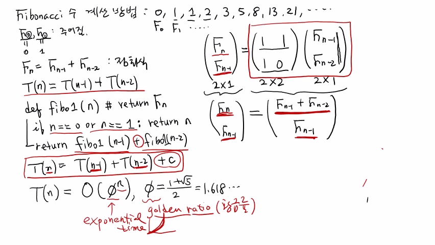
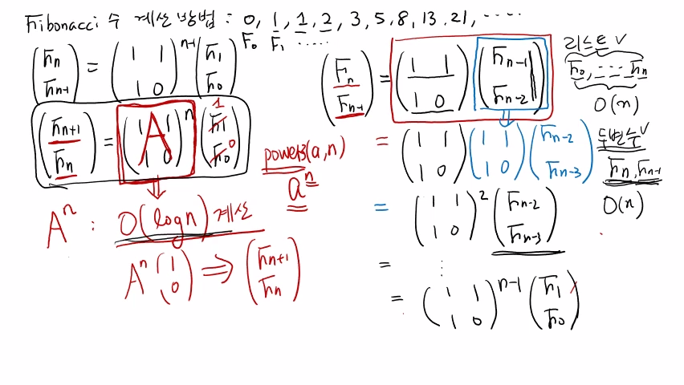

>
해당 포스트는 아래 수업들의 내용을 바탕으로 작성되었습니다.
> - ['자료구조 - Data Structures with Python'](https://www.youtube.com/playlist?list=PLsMufJgu5933ZkBCHS7bQTx0bncjwi4PK)
> - ['알고리즘 - Algorithm with Python'](https://www.youtube.com/playlist?list=PLsMufJgu5932XYejsOwcUDJ2F75f56nrl)
>
\- Youtube :
['Chan-Su Shin'](https://www.youtube.com/channel/UCJ4SXKMLQucqaxt4A6PonwQ)  
\- Professor : 신찬수 교수 (한국 외국어 대학교 컴퓨터 공학부)


# 1. 피보나치 수

이번 수업에서는 '피보나치 수(Fibonacci Number)' 를 계산하는 방법에 대해 살펴볼 것이다.

## 1-1. 피보나치 수의 정의

피보나치 수는 보통 0과 1부터 시작하며, 다음 수는 앞에 있는 두 수를 더한 수가 된다.

```
Fibonacci : 0, 1, 1, 2, 3, 5, 8, 13, 21, ...
            ↑  ↑
            F0 F1 ...
```

- 0 + 1 = 1, 1 + 1 = 2, 1 + 2 = 3, 2 + 3 = 5, .. 와 같이, 값이 계속 증가한다.
- 이러한 규칙에 따라, 값이 무한히 증가하는 수열을 피보나치 수열이라고 한다.
- 그리고, 0번째 피보나치 수 F0, 첫 번째 피보나치 수 F1, .. 와 같이 정의한다.
- 이 때, 기본적으로 피보나치 수열에서 주어지는 F0과 F1의 값은 각각 0, 1이다.

<br>

> 이외에, 같은 방식으로 구성되지만, 처음에 주어지는 두 수가 0과 1이 아닌 수열도 있다.

## 1-2. n번째 피보나치 수

```
Fn = F(n - 1) + F(n - 2)

T(n) = T(n - 1) + T(n - 2)
```

- n번째 피보나치 수 Fn은 바로 앞에 있는 피보나치 수 F(n - 1), F(n - 2) 를 더해서 만든다.
- 이는 점화식으로 표현되며, 수행 시간처럼 표현하면, T(n) = T(n - 1) + T(n - 2) 가 된다.

## 1-3. 쉽게 계산하는 방법

```py
def fibo1(n): # return Fn              <- 1
    if n == 0 or n == 1: return n      <- 2
    return fibo1(n - 1) + fibo1(n - 2) <- 3
```

1. n번째 피보나치 수 Fn을 계산하여 반환하는 가장 쉬운 방법을 'fibo1' 이라고 해보자.
2. 바닥 조건은 F0을 반환해야 하거나, F1을 반환해야 할 때, 즉, n = 0, n = 1 인 경우다.
   - 이 때, n = 0 일 때 F0 = 0, n = 1 일 때 F1 = 1 이므로, 그냥 n을 반환하면 된다.
3. 그렇지 않으면, n번째 피보나치 수를 계산하는 방법을 그대로 적용하여 반복하면 된다.
   - (n - 1), (n - 2) 번째 피보나치 수를 계산하도록 fibo1 함수를 재귀 호출하면 된다.

<br>

> 이러한 방식으로, n번째 피보나치 수를 계산하는 분할 정복 알고리즘을 정의할 수 있다.

## 1-4. 알고리즘 파악

```
                Fn
             /      \
    F(n - 1)          F(n - 2)
    /      \          /      \
F(n - 2) F(n - 3) F(n - 3) F(n - 4)
  /  \     /  \     /  \     /  \
                 ፧
```

fibo1 로 Fn을 구하려면, fibo(n - 1), fibo1(n - 2) 를 재귀적으로 호출해야 한다.

- F(n - 1) 은, 다시 내부적으로 fibo1(n - 2), fibo1(n - 3) 을 재귀적으로 호출한다.
- 이와 마찬가지로, F(n - 2) 도 fibo1(n - 3), fibo1(n - 4) 를 재귀적으로 호출한다.

<br>

사실, 이러한 방식으로 계속해서 재귀적으로 호출하는 것은 굉장히 비효율적이다.

- 우선, Fn의 값과 F(n - 1) 의 값을 구하기 위해서는, F(n - 2) 의 값을 알아야 한다.
- 이 때, F(n - 2) 라는 하나의 값을 구하기 위해 Fn과 F(n - 1) 은 재귀 호출을 한다.
- 즉, 공통으로 사용하는 값들을 재사용하지 않고, 똑같은 계산을 반복하는 것이다.
- 이렇게, fibo1 알고리즘의 수행 과정에서는, 불필요한 재귀 호출이 많이 수행된다.

## 1-5. 수행 시간 파악

```
T(n) = T(n - 1) + T(n - 2) + c
     = O(φ^n)

φ = (1 + √5) / 2 = 1.618... = golden ratio
```

fibo1 알고리즘은 상수 횟수의 비교와 더하기 연산을 수행한 후에 재귀 호출을 수행한다.

- 이 때, 재귀 호출을 수행하기 때문에, T(n - 1), T(n - 2) 만큼의 수행 시간이 필요하다.
- 정리된 점화식은 상수 횟수의 연산이 추가되었을 뿐, 피보나치 수의 식과 거의 비슷하다.

<br>

이러한 점화식을 전개해서 계산해보면(생략), 수행 시간 T(n) 은 O(φ^n) 정도가 된다.

- 이 때, 파이(φ) 는 가장 좋은 비율을 나타내는 '황금비(Golden Ratio)' 라고 부른다.
- 황금비, 즉, 파이의 값은 대략 1.6이므로, O(φ^n) 은 O(1.6^n) 정도라고 할 수 있다.

<br>

이렇게 n이 지수로 표현되는 수행 시간을 '지수 시간(Exponential Time)' 이라고 한다.

- n의 값이 조금만 커져도, 수행 시간이 기하급수적(exponential) 으로 증가하게 된다.

<details><summary>수행 시간 O(φ^n) 을 그래프로 살펴보면, 엄청나게 빠르게 증가한다는 것을 알 수 있다.</summary>



</details>

## 1-6. 알고리즘 정리

이는 같은 값을 재사용하지 않고, 각자 재귀적으로 구하는 굉장히 비효율적인 알고리즘이다.

- 왜냐하면, 같은 값들을 재사용하지 않고, 그것을 구하기 위해서 각자 재귀 호출하기 때문이다.
   - F(n - 1) 과 F(n - 2) 도, F(n - 3) 을 구하기 위해 독립적으로 재귀 호출을 수행한다.
- 따라서, 불필요한 계산을 너무 많이 수행하게 되므로, 이러한 해결 방식은 바람직하지 못하다.

<br>

이렇게 살펴본 'n번째 피보나치 수를 쉽게 구하는 알고리즘' 도, 분명히 분할 정복 알고리즘이다.

> n번째 피보나치 수를 구하기 위해 (n - 1), (n - 2) 번째 피보나치 수를 같은 방식으로 구하기 때문이다.

<br>

<details><summary>참고 : 실제 교수님 강의 화면 필기 내용</summary>



</details>

# 2. 행렬을 이용하는 방법

두 번째 방법은 '행렬 곱셈을 활용하는 방법' 으로, 어떻게 보면 매우 흥미로운 방법이다.

```
┌          ┐   ┌       ┐  ┌          ┐
│ Fn       │   │ 1   1 │  │ F(n - 1) │
│          │ = │       │  │          │
│ F(n - 1) │   │ 1   0 │  │ F(n - 2) │
└          ┘   └       ┘  └          ┘
```

- 우선, n번째 피보나치 수와 (n - 1) 번째 피보나치 수를 2 * 1 행렬로 묶은 것을 N이라고 한다.
- 그리고, (1, 1, 1, 0) 의 2 * 2 행렬, (F(n - 1), F(n - 2)) 의 2 * 1 행렬을 각각 A, B라고 한다.
- 이 때, 'A 행렬에 B 행렬을 곱한 것은 N과 같다.' 라는 식이 성립함을 증명하는 풀이 방식이다.

<br>

'왼쪽과 오른쪽 항이 같다.' 는 것을 보이기만 하면 되기 때문에, 이는 간단하게 증명할 수 있다.

```
┌       ┐  ┌          ┐   ┌                     ┐
│ 1   1 │  │ F(n - 1) │   │ F(n - 1) + F(n - 2) │
│       │  │          │ = │                     │
│ 1   0 │  │ F(n - 2) │   │      F(n - 1)       │
└       ┘  └          ┘   └                     ┘
```

- 오른쪽 항에 있는 행렬 곱셈의 결과를 구하기 위해 A 행렬의 각 행과 B 행렬의 각 열을 곱한다.
- A의 1행과 B의 1열을 곱하면, (1 * F(n - 1)) + (1 * F(n - 2)) = F(n - 1) + F(n - 2) 가 된다.
- 다음으로, A의 2행과 B의 1열을 곱하면, (1 * F(n - 1)) + (0 * F(n - 2)) = F(n - 1) 이 된다.
- 이는 (n - 1), (n - 2) 번째 피보나치 수의 합과 (n - 1) 번째 피보나치 수의 2 * 1 행렬이 된다.

<br>

이렇게 계산된 '오른쪽 항에 있는 행렬 곱셈의 결과' 를 왼쪽 항에 있는 행렬과 비교하면 된다.

```
┌          ┐   ┌                     ┐
│ Fn       │   │ F(n - 1) + F(n - 2) │
│          │ = │                     │
│ F(n - 1) │   │      F(n - 1)       │
└          ┘   └                     ┘

Fn = F(n - 1) + F(n - 2), F(n - 1) = F(n - 1)
```

- n번째 피보나치 수는 (n - 1), (n - 2) 번째 피보나치 수의 합이므로, 첫 번째 등식은 참이 된다.
- 그리고, F(n - 1) = F(n - 1) 은 왼쪽 항과 오른쪽 항이 같기 때문에, 두 번째 등식도 참이 된다.

<br>

> 이는, n번째와 (n - 1) 번째 피보나치 수를 이러한 행렬 곱셈식으로도 구할 수 있다는 것을 의미한다.

<br>

<details><summary>참고 : 실제 교수님 강의 화면 필기 내용</summary>



</details>

# 3. 피보나치 수 구하기

이번에는, 이러한 행렬 곱셈식을 활용해 n번째 피보나치 수를 구하는 방법을 살펴보자.

## 3-1. 행렬 곱셈식 전개

```
┌          ┐   ┌       ┐  ┌          ┐
│ Fn       │   │ 1   1 │  │ F(n - 1) │
│          │ = │       │  │          │
│ F(n - 1) │   │ 1   0 │  │ F(n - 2) │
└          ┘   └       ┘  └          ┘
                   │      └─────┬────┘
                   │            └────┐
                   │                 ↓
                   ↓      ┌─────────────────────┐
               ┌       ┐  ┌       ┐  ┌          ┐
               │ 1   1 │  │ 1   1 │  │ F(n - 2) │
             = │       │  │       │  │          │
               │ 1   0 │  │ 1   0 │  │ F(n - 3) │
               └       ┘  └       ┘  └          ┘
               ┌       ┐ 2  ┌          ┐
               │ 1   1 │    │ F(n - 2) │
             = │       │    │          │
               │ 1   0 │    │ F(n - 3) │
               └       ┘    └          ┘
                           ፧
               ┌       ┐ (n - 1)  ┌    ┐
               │ 1   1 │          │ F1 │
             = │       │          │    │
               │ 1   0 │          │ F0 │
               └       ┘          └    ┘
```

- N, A, B는 각각 (Fn, F(n - 1)), (1, 1, 1, 0), (F(n - 1), F(n - 2)) 의 행렬이다.
- 그리고, B 행렬은 A 행렬과 (F(n - 2), F(n - 3)) 의 행렬의 곱으로 표현할 수 있다.
- 따라서, N은 (A * A) 에 (F(n - 2), F(n - 3)) 행렬을 곱한 것과 같다고 할 수 있다.
- 이 때, 행렬 곱셈은 결합법칙이 성립하기 때문에, (A * A) 를 A^2 로 표현할 수 있다.
- 이러한 전개 과정을 반복하면, A^(n - 1) 에 (F1, F0) 의 행렬을 곱한 형태가 된다.

## 3-2. 풀이법과 수행 시간

이렇게 전개한 행렬 곱셈식을 활용하면, 아래와 같이 n번째 피보나치 수를 구할 수 있다.

```
┌          ┐   ┌       ┐ n  ┌    ┐
│ F(n + 1) │   │ 1   1 │    │ F1 │
│          │ = │       │    │    │
│ Fn       │   │ 1   0 │    │ F0 │
└          ┘   └       ┘    └    ┘
               ┌       ┐ n  ┌   ┐
               │ 1   1 │    │ 1 │
             = │       │    │   │
               │ 1   0 │    │ 0 │
               └       ┘    └   ┘
```

- n을 1 증가시키면, (F(n + 1), Fn) 행렬을 A^n 과 (F1, F0) 행렬의 곱으로 표현할 수 있다.
- 그리고, F1 = 1, F0 = 0 이므로, 오른쪽 항은 A^n 과 (1, 0) 행렬의 곱과 같다고 할 수 있다.
- 다시 말해, A^n 과 (1, 0) 행렬을 곱하면, n번째와 (n + 1) 번째 피보나치 수를 구할 수 있다.

<br>

이 때, A^n 을 구하기 위해, 이전 수업에서 배웠던 거듭제곱 알고리즘을 활용할 수 있다.

```
power3(a, n) => power3(A, n)

power3(A, n) = A^n -> A^n * (1, 0) = (F(n + 1), Fn)
```

- A 행렬을 숫자로 취급하여, 어떤 수 a의 제곱을 구하는 대신, 행렬의 제곱을 구하는 것이다.
- 숫자와 행렬의 차이일 뿐, 곱하는 방식은 같아서, 분할 정복 방식으로 A^n 을 구할 수 있다.
- 그중에서도 power3 알고리즘을 이용하면, 계산에 필요한 수행 시간은 O(log n) 이 된다.
- 또, 이렇게 구한 A^n 에 (1, 0) 의 행렬을 곱하여, (F(n + 1), Fn) 의 행렬을 구할 수 있다.

<br>

따라서, n번째 피보나치 수를 구하는 데 필요한 수행 시간은 O(log n) 이라고 할 수 있다.

> 이처럼, 같은 분할 정복 방식이라도, 풀이법에 따라, 필요한 수행 시간이 크게 달라진다.

## 3-3. 또 다른 방법

강의 노트에는 재귀 알고리즘을 사용하는 방법 외에, 다른 풀이법도 포함되어 있다.

- 리스트를 사용해, 0 ~ n 번째의 모든 피보나치 수를 계산하는 방법이 있다.
- 그리고, 2개의 변수만을 사용해, n번째 피보나치 수를 구하는 방법도 있다.
- 이 방법들은 아주 쉽고 간단한 알고리즘이며, 필요한 수행 시간은 O(n) 이다.

> #### 강의 영상 속 힌트
> 1. 점화식을 이용해 피보나치 수를 하나씩 구하고, 모든 피보나치 수를 리스트에 저장한다.
> 2. 2개의 변수로 n번째와 (n - 1) 번째 피보나치 수를 계속 유지하며, 순서대로 계산한다.
> 3. 이렇게 구성되는 알고리즘들은 모두 O(n), 즉, 선형 시간 내에 수행되는 알고리즘이다.
>
(하지만, 가장 빠른 방법은 이번 수업에서 살펴본 '행렬 곱셈식으로 피보나치 수를 구하는 방법' 이다.)

<br>

<details><summary>참고 : 실제 교수님 강의 화면 필기 내용</summary>



</details>

<br>

- 20210727 - 빅오 표기법 로그 시간 표기 수정(O(log2(n)) -> O(log n))
