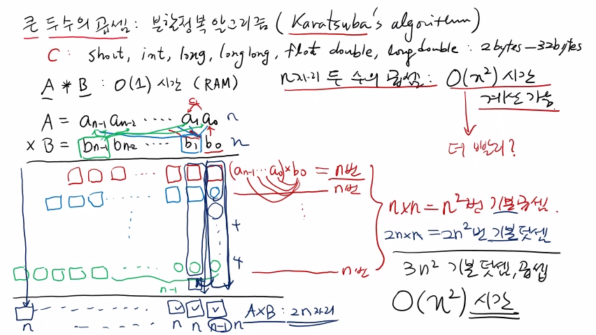
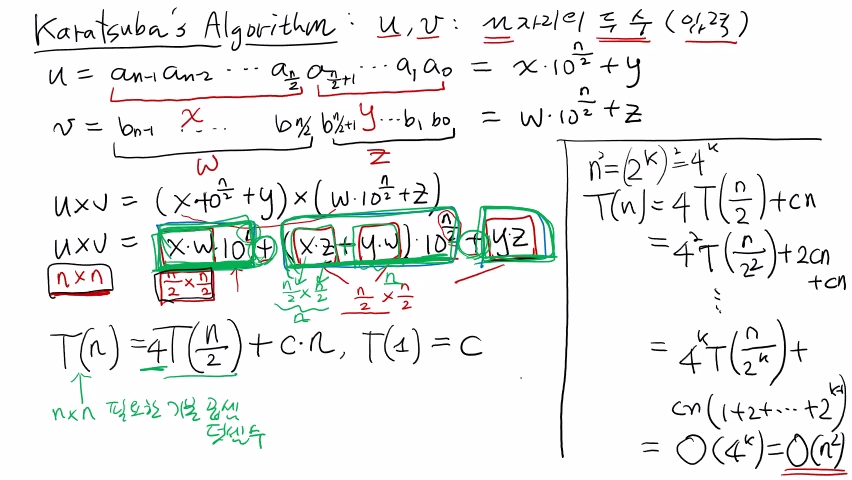
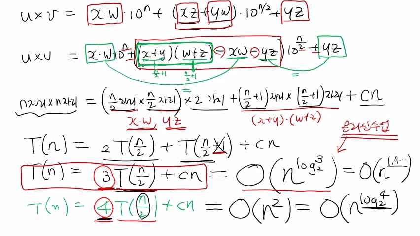

>
해당 포스트는 아래 수업들의 내용을 바탕으로 작성되었습니다.
> - ['자료구조 - Data Structures with Python'](https://www.youtube.com/playlist?list=PLsMufJgu5933ZkBCHS7bQTx0bncjwi4PK)
> - ['알고리즘 - Algorithm with Python'](https://www.youtube.com/playlist?list=PLsMufJgu5932XYejsOwcUDJ2F75f56nrl)
>
\- Youtube :
['Chan-Su Shin'](https://www.youtube.com/channel/UCJ4SXKMLQucqaxt4A6PonwQ)  
\- Professor : 신찬수 교수 (한국 외국어 대학교 컴퓨터 공학부)


# 1. 큰 수 곱셈 문제

이번 수업에서는, '두 개의 큰 수를 얼마나 효율적으로 곱셈할 수 있는가?' 에 대한 문제를 살펴보자.

- 이러한 문제는, 분할 정복법을 사용하는, 비교적 유명한 알고리즘을 활용하여 해결할 수 있다.
- 이는, 제안한 사람의 이름을 따서, '카라추바 알고리즘(Karatsuba Algorithm)' 이라고 한다.

## 1-1. 문제 설명

프로그래밍 언어, 특히, C 언어에서는 정수와 실수를 나타낼 수 있는 여러 가지 타입을 제공한다.

- 이 때, 실수를 표현하는 타입은 '부동 소수점 타입(floating point type)' 이라고 부른다.
- 정수는 short, int, long, longlong, 실수는 float, double, longdouble 등이 제공된다.
- 사실, 이러한 숫자 타입들은 최소 2바이트, 최대 32바이트에 해당하는 메모리를 사용한다.
- 이와 같이, 바이트 수에 제한이 있어서, 큰 수나 정밀한 실수를 표현하는 데에 한계가 있다.

<br>

> 이러한 '많은 자리수를 갖는 수' 를 표현하는 방법에 대해서는, 이후에 다른 수업에서 살펴볼 것이다.

<br>

이전의 수업에서 살펴봤듯, RAM 모델은, 상수 시간, 즉, 단위 시간 내에 두 수의 곱셈을 수행한다.

- 숫자의 크기/정밀도에 상관없이, 단위 시간 내에 곱셈을 수행하는 컴퓨터 모델이라고 가정했다.
- 하지만, 이것은 가상의, 이상적인 컴퓨터 모델이었기 때문에 가능했던 것이지, 현실은 다르다.
- 물론, 정수형(int) 타입의 두 숫자에 대한 곱셈은, 현실에서도, 상수 시간 내에 수행될 수 있다.
- 하지만, 자리수가 많은 두 수를 곱하려면, 상수 시간보다 훨씬 더 많은 시간이 필요할 것이다.

<br>

> 이 때, '그러한 두 숫자를 더 효율적으로, 더 빠르게 곱하는 방법을 찾는 문제' 가 '큰 수 곱셈' 문제다.

## 1-2. 기본적인 곱셈법

임의의 n자리 숫자 A, B가 입력으로 주어진다고 가정하고, 기본적인 곱셈 과정에 대해 살펴보자.

```
A = a(n - 1) a(n - 2) ... a1 a0
B = b(n - 1) b(n - 2) ... b1 b0
```

- A의 맨 왼쪽 숫자를 a(n - 1) 이라고 하면, a0은 1의 자리, a1은 10의 자리라고 할 수 있다.
- 그러므로, A라는 숫자의 각 자리수를, a(n - 1) a(n - 2) .. a1 a0 의 형태로 표현할 수 있다.
- 굳이 n자리가 아니어도 상관없지만, n자리 숫자라고 가정했던 B의 경우도, 이와 마찬가지다.

<br>

이러한 두 수를 곱한다고 가정했을 때, 실제 학교에서 배우는 기본적인 곱셈의 과정은 다음과 같다.

```
                              c1
        a(n - 1) a(n - 2) ... a1 a0 = A
    *   b(n - 1) b(n - 2) ... b1 b0 = B
    ───────────────────────────────
      []   []       [] ... [] [] []  <-  b0 * (a(n - 1) ... a0)
   [] []   []       [] ... [] []  0  <-  b1 * (a(n - 1) ... a0)

                   ፧

[] [] []    0        0 ...  0  0  0  <-  b(n - 1) * (a(n - 1) ... a0)
            └──────────┬──────────┘
                    (n - 1)
───────────────────────────────────
[]    ...    ...    ...    [] [] []  <-  A * B
```

- b0 * a0 의 값을 아래에 적고, 올림수(carry) 가 있으면, 그것(c1) 을 다음 자리로 넘긴다. 
- 다음으로, (b0 * a1) + c1 를 계산한 결과를 아래에 적고, 이러한 과정을 끝까지 반복한다.
- 그러면 결국, b0 * (a(n - 1) .. a0) 를 계산한 결과가, 아래 부분의 첫 번째 행에 나열된다.
- 마찬가지로, b1에 대해서도 (a(n - 1) .. a0) 를 곱한 결과를, 두 번째 행에 나열할 수 있다.
- 이 때, b1은 10의 자리 숫자이므로, 맨 오른쪽에 0을 1개 채운 후에, 결과를 나열해야 한다.
- 이를 반복하면, (n - 1) 개의 0과 b(n - 1) * (a(n - 1) .. a0) 의 값이 마지막 행에 나열된다.
- 그런 다음, 1의 자리에 있는 값들의 합을 아래에 적고, 올림수가 있으면 다음 자리로 넘긴다.
- 그리고, 올림수를 포함하여, 10의 자리에 있는 값들의 합을 구하고, 그 값을 아래에 적는다.
- 이러한 과정을 마지막 자리수까지 반복해서 얻은 결과는, 결국, A와 B를 곱한 결과가 된다.

## 1-3. 연산 횟수 파악

이번에는, n자리 숫자 2개를 곱하기 위해서, 몇 번의 기본 연산(곱셈, 덧셈) 이 필요한지 파악해보자.

```
  a(n - 1) a(n - 2) ... a1 a0
* b(n - 1) b(n - 2) ... b1 b0
─────────────────────────────
       b0 * (a(n - 1) ... a0)   -> n ┐
       b1 * (a(n - 1) ... a0)   -> n │
                                     ├ n * n = n^2
              ፧                   ፧   │
                                     │
 b(n - 1) * (a(n - 1) ... a0)   -> n ┘
─────────────────────────────
[]        ...        [] [] []  <-  A * B
↓                    ↓  ↓    ↘
n         ...        n  n   (n - 1) ≈ n
└──────────────────┬──────────────────┘
            2n * n = (2 * n^2)
```

- 첫 번째 행을 완성하려면, b0 * a0, b0 * a1, .. b0 * a(n - 1) 로, 총 n번의 곱셈이 필요하다.
- 다른 모든 행에 대해서도 n번의 곱셈을 수행해야 하므로, n * n = n^2 번의 곱셈이 필요하다.
- 그런 다음, 첫 번째 열에 있는 n개의 값을 다 더해야 하므로, 총 (n - 1) 번의 덧셈이 필요하다.
- 하지만, 올림수가 있는 열의 경우, (n + 1) 개의 값을 더해야 하므로, 총 n번의 덧셈이 필요하다.
- 이 때, n자리 숫자 2개의 곱셈에 대한 결과, 그것이 가질 수 있는 자리수의 최대 크기는 2n이다.
- 여기서, (n - 1) 를 n으로 취급하면, 필요한 덧셈의 횟수는, 총 2n * n = (2 * n^2) 번이 된다.

## 1-4. 정리

이 때, 덧셈과 곱셈은 적당한 크기의 두 수에 대한 기본 연산이므로, 상수 시간, 즉, 단위 시간이 걸린다.

- n^2 + (2 * n^2) = (3 * n^2) 번의 곱셈/덧셈을 수행했으므로, 이는, O(n^2) 이라고 할 수 있다.
- 즉, 'n자리 숫자 2개의 곱셈은 O(n^2) 만큼의 시간으로 충분히 계산할 수 있다.' 라고 할 수 있다.

<br>

이는, 학교에서 배웠던 곱셈 알고리즘을 사용했을 때에 필요한 수행 시간이 O(n^2) 임을 의미한다.

- 하지만, '큰 수 곱셈' 문제의 목적은, 이 방법보다 더 효율적이고, 더 빠른 방법을 찾는 것이다.
- 이 때, '그러한 방법이 있다.' 라는 것을 보이는 것이 바로, 카라추바의 분할 정복 알고리즘이다.

<br>

<details><summary>참고 : 실제 교수님 강의 화면 필기 내용</summary>



</details>

# 2. 카라추바 알고리즘(분할)

이전과 마찬가지로, n자리 숫자 2개를 곱하는 상황이라 가정하고, 카라추바 알고리즘에 대해 살펴보자.

> 입력으로는, n자리의 두 수, u와 v가 주어지며, 이들을 O(n^2) 보다 더 빠르게 곱하는 것이 목표다.

## 2-1. 작은 문제로 나누기

```
u = a(n - 1) a(n - 2) ... a(n / 2) a((n / 2) - 1) ... a1 a0 = (x * 10^(n / 2)) + y
    └─────────────┬──────────────┘ └───────────┬──────────┘
                  x                            y

v = b(n - 1) b(n - 2) ... b(n / 2) b((n / 2) - 1) ... b1 b0 = (w * 10^(n / 2)) + z
    └─────────────┬──────────────┘ └───────────┬──────────┘
                  w                            z

u * v = ((x * 10^(n / 2)) + y) * ((w * 10^(n / 2)) + z)
      = (xw * 10^n) + ((xz + yw) * 10^(n / 2)) + yz
```

- 우선, 입력으로 주어진 n자리 숫자 u를, 가운데를 기준으로 반씩 나눈 다음, 각각을 x, y라고 한다.
- 이 때, x라는 숫자는 (n / 2) 자리에서 시작하기 때문에, x의 실제 크기는 x * 10^(n / 2) 이 된다.
- 그러므로, n자리 숫자 u의 실제 크기는, u = (x * 10^(n / 2)) + y 라는 등식으로 표현할 수 있다.
- v도 마찬가지로, 반씩 나눠서, 각각을 w, z라 하고, v = (w * 10^(n / 2)) + z 로 표현할 수 있다.
- 이것을 정리하면, u * v = (x * 10^(n / 2) + y) * ((w * 10^(n / 2)) + z) 라는 등식을 얻게 된다.
- 이러한 등식을 풀어보면, 결국, u * v = (xw * 10^n) + ((xz + yw) * 10^(n / 2)) + yz 가 된다.

<br>

여기서 중요한 것은, u * v 를 계산하기 위해서는, xw, xz, yw, yz를 모두 계산해야 한다는 것이다.

```
u * v = (xw * 10^n) + ((xz + yw) * 10^(n / 2)) + yz
  │       └────────────┐ └─┐  └──┐   ┌───────────┘
  ↓                    ↓   ↓     ↓   ↓
(n * n) problem  ->  ((n / 2) * (n / 2)) problem + (*, +)
```

- 이 때, xw = x * w 이며, x의 자리수와 w의 자리수는 모두, n을 절반으로 나눈 (n / 2) 이 된다.
- 다시 말해, xw는 x와 w를 곱하는 것과 같으며, 이는 (n / 2) 자리 숫자 2개를 곱하는 것과 같다.
- 또한, xw와 마찬가지로, xz, yw, yz도, (n / 2) 자리 숫자 2개를 곱하는 것과 같다고 할 수 있다.
- 이 때, xw의 값을 구한 후에 10^n 을 곱해야 하는데, 이는, n개의 0을 뒤에 추가하는 것과 같다.
- 마찬가지로, 등식의 두 번째 항, (xz + yw) * 10^(n / 2) 에서는, 0을 (n / 2) 개 추가해야 한다.
- 등식의 마지막 항인 yz는 따로 곱하는 값이 없으므로, 자리수를 추가하지 않고 그대로 쓰면 된다.
- 이렇게, (n / 2) 자리 숫자 2개를 총 4번 곱한 결과에, 각각 자리수를 추가하여, 전부 더하면 된다.

<br>

>
결국, n자리 숫자 2개를 곱하는 문제는, (n / 2) 자리 숫자를 2개 곱하는 문제 4개로 나뉘며,  
그러한 작은 문제들의 결과마다 자리수를 추가하고, 모두 더하는 방법을 통해 해결할 수 있다.

## 2-2. 수행 시간 파악


n자리 숫자 2개를 곱하는 데 필요한 기본 연산 횟수를 T(n) 이라고 가정하고, 수행 시간을 구해보자.

```
T(n) = (4 * T(n / 2)) + ?

(xw * 10^n) + ((xz + yw) * 10^(n / 2)) + yz
  ↓             ↓       ↘                ↓
T(n / 2)    T(n / 2)   T(n / 2)      T(n / 2)
```

- xw, xz, yw, yz를 구하려면 (n / 2) 자리 숫자 2개를 곱해야 하므로, 이는 재귀적으로 해결한다.
- 재귀적으로 호출하는 데 필요한 기본 연산의 횟수는 T(n / 2) 이며, 이를, 총 4번 반복해야 한다.

<br>

그런 다음, 위에서 구한 등식의 모든 항, 즉, xw * 10^n, (xz + yw) * 10^(n / 2), yz를 구해야 한다.

```
T(n) = (4 * T(n / 2)) + 3n + ?

(xw * 10^n) + ((xz + yw) * 10^(n / 2)) + yz
    ↓              ↓     ↓
    n              n  (n / 2)
    └───────────┬───────────┘
         n + n + (n / 2)
```

- 이렇게 구한 xw, xz, yw, yz는, 모두 (n / 2) 자리 숫자 2개를 곱한 것이므로, n자리 숫자가 된다.
- 또, 이러한 n자리 숫자 2개를 더하려면, 모든 자리수를 더해야 하므로, 총 n번의 덧셈이 필요하다.
- 그리고, 첫 번째 항인 xw * 10^n 에서, xw에 10^n 을 곱하는 것은, 10을 n번 곱하는 것과 같다.
- 따라서, 등식의 모든 항을 완성하기 위해서는, 곱셈 n번, 덧셈 n번과 곱셈 (n / 2) 번이 필요하다.
- 결국, 필요한 연산의 수는 n + n + (n / 2) = 2n + (n / 2) <= 3n, 아무리 커도 3n을 넘지 않는다.

<br>

마지막으로, 이렇게 구한 3개의 항을 더해야 하며, 그때 필요한 기본 연산의 횟수까지 파악하면 된다.

```
T(n) = (4 * T(n / 2)) + 3n + 3n
     = (4 * T(n / 2)) + 6n
     = (4 * T(n / 2)) + cn

(xw * 10^n) + ((xz + yw) * 10^(n / 2)) + yz
     ↓                    ↓              ↓
     2n           n + (n / 2) <= 2n      n   <- 각 항의 자리수
     └─────────────┬──────────────┘      │
                   └──────────┬──────────┘
                       n + (n / 2) + n = 2n + (n / 2) <= 3n
```

- 우선, 첫 번째 항은, n자리 숫자 xw에 n개의 0을 추가한 것과 같으므로, n + n = 2n 자리가 된다.
- 이 때, 첫 번째 항이 가장 큰 수이므로, 나머지 모든 항의 자리수는 2n을 넘지 않는다고 할 수 있다.
- 따라서, 모든 항을 더하는 데에 필요한 덧셈의 횟수는, 아무리 커도 3n을 넘지 않는다고 할 수 있다.
- 결국, 임의의 상수를 c라고 하면, 재귀 호출 이후에 필요한 기본 연산의 수는 cn이라고 할 수 있다.

<br>

이번에는, T(1) = c, n = 2^k 이라고 가정하고, 점화식 T(n) = (4 * T(n / 2)) + cn 을 풀어보자.

> 이 때, n = 2^k 이라고 가정하는 이유는, 점화식의 n이, 반씩 줄어들도록 구성되어 있기 때문이다.

```
T(1) = c, n = 2^k -> n^2 = (2^k)^2 = (2^2k) = 4^k

T(n) = (4 * T(n / 2)) + cn
     = (4 * ((4 * T(n / 2^2)) + (cn / 2))) + cn
     = (4^2 * T(n / 2^2)) + (4 * (cn / 2)) + cn
     = (4^2 * T(n / 2^2)) + 2cn + cn
     = (4^2 * T(n / 2^2)) + cn(1 + 2)
       ...
     = (4^k * T(n / 2^k)) + cn(1 + 2 + ... + 2^(k - 1))
     = (n^2 * T(n / 2^k)) + cn(1 + 2 + ... + 2^(k - 1))
     = O(n^2)
```

- T(n / 2) = (4 * T(n / 2^2)) + (cn / 2) 이므로, T(n) = (4^2 * T(n / 2^2)) + cn(1 + 2) 가 된다.
- 이러한 전개 방식을 반복하면, T(n) = (4^k * T(n / 2^k)) + cn(1 + 2 + .. + 2^(k - 1)) 이 된다.
- 또한, n = 2^k 의 양변을 제곱하면, n^2 = 4^k 이므로, 식을 더 풀어보면, 결국, O(n^2) 이 된다.

## 2-3. 정리

n자리 숫자 2개를 곱하는 문제를, 절반 크기의 문제 4개로 나눠서 풀면, 수행 시간은 O(n^2) 이 된다.

- 앞에서 살펴본 '학교에서 배웠던 기본적인 곱셈법' 의 수행 시간 O(n^2) 과 다를 게 없는 것이다.
- 이는, '분할 정복법을 사용했음에도 불구하고, 필요로 하는 수행 시간이 같다.' 는 것을 의미한다.

<br>

결국, '나쁜 방법은 아니지만, 그렇다고 해서, 더 좋은 방법인 것도 아니다.' 라는 것을 의미한다.

> 이에, 카라추바는 생각했다. "아, 여기서 좀 더, 효율적으로 만들 방법이 없을까?" 라고 말이다.

<br>

<details><summary>참고 : 실제 교수님 강의 화면 필기 내용</summary>



</details>

# 3. 카라추바 알고리즘(정복)

카라추바는 '재귀적으로 풀어야 하는 문제의 수를 줄이면, 수행 시간을 줄일 수 있다.' 라고 생각했다.

> 예를 들어, 원래 문제를 해결하는 데 필요한 절반 크기의 문제가, 4개가 아니라, 3개가 되는 것이다.

## 3-1. 등식 변형하기

카라추바는, 이러한 아이디어에 근거하여, 기존의 등식에 있는 xz + yw 를 다르게 표현하기로 했다.

```
u * v = (xw * 10^n) + ((xz + yw) * 10^(n / 2)) + yz
          └──────┐      └──┬──┘  ┌────────────────┘
                 │       ┌─┘     │
                 ↓    ┌──┴──┐    ↓
(x + y)(w + z) = xw + xz + yw + yz
               = (xz + yw) + xw + yz
                  └──┬──┘
                     └────────┐
                           ┌──┴──┐
(x + y)(w + z) - xw - yz = xz + yw
└───────────┬──────────┘
            └──────────────────────┐
                        ┌──────────┴───────────┐
u * v = (xw * 10^n) + (((x + y)(w + z) - xw - yz) * 10^(n / 2)) + yz
         │                               ↑     ↑                   │
         └───────────────────────────────┘     └───────────────────┘
```

- (x + y)(w + z) = xw + xz + yw + yz 이므로, (x + y)(w + z) - xw - yz = xz + yw 가 된다.
- 즉, u * v = (xw * 10^n) + (((x + y)(w + z) - xw - yz) * 10^(n / 2)) + yz 라고 할 수 있다.
- 이는, 식의 나머지 부분은 그대로 두고, xz + yw 만 (x + y)(w + z) - xw - yz 로 바꾼 것이다.
- 이 때, (x + y)(w + z) - xw - yz 의 xw와 yz는, 다른 항에서 구한 값을 그대로 사용하면 된다.
- 즉, xz와 yw를 따로 구하기 위해 2번 곱셈하는 대신, (x + y)(w + z) 를 1번만 계산하면 된다.
- 이 때, x + y, w + z 는 (n / 2) 자리 숫자 2개의 합이므로, 최대 (n / 2) + 1 자리 숫자가 된다.

## 3-2. 수행 시간 파악

이렇게, 여러 과정을 거쳐서, n자리 숫자 2개를 곱하는 문제를, 이전과는 조금 다른 형태로 나눠봤다.

```
u * v = (xw * 10^n) + (((x + y)(w + z) - xw - yz) * 10^(n / 2)) + yz
  │      │              └─────┬──────┘                             │
  │      └─┐             ┌────┘        ┌───────────────────────────┘
  ↓        ↓             ↓             ↓
T(n) = T(n / 2) + T((n / 2) + 1) + T(n / 2) + cn
     = (2 * T(n / 2)) + T((n / 2) + 1) + cn

T((n / 2) + 1) ≈ T(n / 2)

T(n) = (2 * T(n / 2)) + T((n / 2)) + cn
     = (3 * T(n / 2)) + cn
```

- 우선, xw와 yz를 구하기 위해서, (n / 2) 자리 숫자 2개에 대한 곱셈을 총 2번 계산해야 한다.
- 그런 다음, 우선, (x + y)(w + z) 를 구하기 위해서, (n / 2) + 1 자리 숫자 2개를 곱해야 한다.
- 그리고, xz + yw 를 구하기 위해, (x + y)(w + z) 의 계산 결과에서, xw와 yz를 빼줘야 한다.
- 또한, 각 항에 자리수를 추가하고, 모든 항을 더하기 위해서, 추가 기본 연산을 수행해야 한다.
- 따라서, 뺄셈, 곱셈, 덧셈과 같은 기본 연산을, n에 비례하는 임의의 횟수만큼 수행해야 한다.

<br>

이렇게 얻은 점화식 T(n) = (2 * T(n / 2)) + T((n / 2) + 1) + cn 을 풀어서, 수행 시간을 구해보자.

```
T((n / 2) + 1) ≈ T(n / 2)

T(n) = (2 * T(n / 2)) + T((n / 2) + 1) + cn
     = (2 * T(n / 2)) + T((n / 2)) + cn
     = (3 * T(n / 2)) + cn
```

- 빅오 표기법을 사용할 것이기 때문에, T((n / 2) + 1) 을, 간단하게 T(n / 2) 로 취급할 수 있다.
- 이렇게, 식을 단순하게 만든 후에, 다시 식을 정리해보면, T(n) = (3 * T(n / 2)) + cn 이 된다.
- T(n) = (4 * T(n / 2)) + cn 과 비교했을 때, T(n / 2) 앞에 붙어있는 계수가 1만큼 줄어들었다.
- 즉, 풀어야 하는 절반 크기의 문제가, 원래는 4개였으나, 식을 변형한 후에 3개로 줄어든 것이다.
- 따라서, 절반 크기의 문제를 위한 재귀 호출의 횟수가 줄어든 만큼, 수행 시간도 줄어들 것이다.

<br>

일단, 자세한 과정은 생략하고, 이전 방식에 대한 점화식과 비교하여 수행 시간을 파악해 볼 것이다.

```
2 = log2(4) -> n^2 = n^log2(4)

(4 * T(n / 2)) + cn => O(n^2) = O(n^log2(4))

T(n) = (3 * T(n / 2)) + cn = O(n^log2(3))
```

- 우선, 절반 크기의 문제를 4번 풀었기 때문에, 이전 점화식을 O(n^log2(4)) 으로 표현할 수 있다.
- 같은 이유로, 절반 크기의 문제를 3번 풀어야 할 때의 점화식은 O(n^log2(3)) 이라고 할 수 있다.
- n^log2(3) < n^log2(4) 이므로, O(n^log2(3)) < O(n^log2(4)) = O(n^2) 이라고 할 수 있다.

<details><summary>추가 : T(n) = (3 * T(n / 2)) + cn = O(n^log2(3)) 를 직접 확인해보았다.</summary>

```
T(1) = c, n = 2^k

T(n) = (3 * T(n / 2)) + cn
     = (3^2 * T(n / 2^2)) + ((3 / 2) * cn) + cn
     = (3^2 * T(n / 2^2)) + (cn * (1 + (3 / 2)))
     = (3^2 * (3T(n / 2^3) + (c * (n / 2^2)))) + (cn * (1 + (3 / 2)))
     = (3^3 * T(n / 2^3)) + (3^2 * (c * (n / 2^2))) + (cn * (1 + (3 / 2)))
     = (3^3 * T(n / 2^3)) + ((3^2 / 2^2) * cn) + (cn * (1 + (3 / 2)))
     = (3^3 * T(n / 2^3)) + (cn * (1 + (3 / 2) + (3 / 2)^2))
       ...
     = (3^k * T(n / 2^k)) + (cn * (1 + (3 / 2) + (3 / 2)^2 + ... + (3 / 2)^(k - 1)))
     = (3^k * T(n / n)) + (cn * (1 + (3 / 2) + (3 / 2)^2 + ... + (3 / 2)^(k - 1)))
     = (3^k * T(1)) + (cn * (1 + (3 / 2) + (3 / 2)^2 + ... + (3 / 2)^(k - 1)))
     = (3^k * c) + (cn * (1 + (3 / 2) + (3 / 2)^2 + ... + (3 / 2)^(k - 1)))
     = O(3^k)
              ↖
                k = log2(n) 이며, 지수부에 n이 있는 항이, n에 대한 일차항보다 차수가 높기 때문

n = 2^k <=> k = log2(n) -> 3^k = 3^log2(n)
                                 └───┬───┘
    ┌────────────────────────────────┘
┌───┴───┐
3^log2(n) = (2^log2(3))^log2(n) = 2^(log2(3) * log2(n))
└───┬───┘                            └───────┬───────┘
    └────┐                ┌──────────────────┘
     ┌───┴───┐    ┌───────┴───────┐
log2(3^log2(n)) = log2(3) * log2(n) = log2(n) * log2(3) = log2(n^log2(3))
     └───┬───┘                                                 └───┬───┘
    ┌────┘      ┌──────────────────────────────────────────────────┘
┌───┴───┐   ┌───┴───┐
3^log2(n) = n^log2(3)

O(3^k) = O(3^log2(n)) = O(n^log2(3))
```

</details>

<br>

> 점화식 T(n) = (3 * T(n / 2)) + cn 이 O(n^log2(3)) 이 되는 이유는 온라인 수업 시간에 설명할 것이다.

<br>

<details><summary>참고 : 실제 교수님 강의 화면 필기 내용</summary>



</details>
