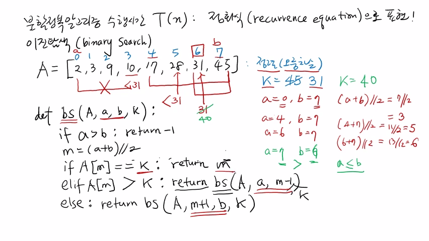
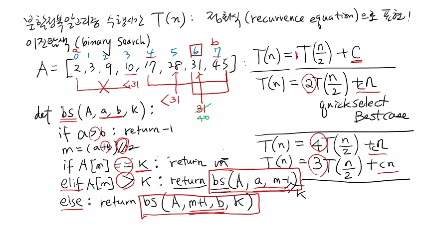

>
해당 포스트는 아래 수업들의 내용을 바탕으로 작성되었습니다.
> - ['자료구조 - Data Structures with Python'](https://www.youtube.com/playlist?list=PLsMufJgu5933ZkBCHS7bQTx0bncjwi4PK)
> - ['알고리즘 - Algorithm with Python'](https://www.youtube.com/playlist?list=PLsMufJgu5932XYejsOwcUDJ2F75f56nrl)
>
\- Youtube :
['Chan-Su Shin'](https://www.youtube.com/channel/UCJ4SXKMLQucqaxt4A6PonwQ)  
\- Professor : 신찬수 교수 (한국 외국어 대학교 컴퓨터 공학부)


# 1. 이진 탐색

지금까지 살펴본 분할 정복 알고리즘들의 수행 시간 T(n) 은, n에 대한 점화식으로 표현되었다.

- 왜냐하면, 나눠진 작은 문제들을 풀 때도 원래 문제와 같은 방법을 이용해서 풀기 때문이다.
- 이 때, 작은 문제를 푸는 데 필요한 수행 시간 또한, 더 작은 n에 대한 식으로 표현되었다.

<br>

이전에 따로 설명하진 않았지만, 교재와 강의 내용에는 이진 탐색이라는 문제가 포함되어 있다.

> 이진 탐색은 분할 정복 알고리즘의 대표적인 예시이며, 영어로는 **'Binary Search'** 라고 한다.

## 1-1. 업 앤 다운 게임

예를 들어, 어떤 두 사람이 '업 앤 다운(Up & Down)' 이라는 게임을 하는 상황이라고 가정해보자.

- 업 앤 다운은 한 사람이 1 ~ 100 사이의 어떤 수를 정하면, 다른 사람이 그것을 맞추는 게임이다.
- 간단한 설명을 위해, 해당 게임에서 숫자를 정하는 사람은 A, 숫자를 맞히는 사람은 B라고 한다.
- B가 어떤 숫자를 제시하면, A는 해당 숫자가 정답보다 큰지, 작은지, 정답인지를 대답해야 한다.
- 이 때, 해당 게임에서 B의 목표는, 숫자를 제시하는 횟수를 최소한으로 하여 정답을 찾는 것이다.

<br>

이 때, 숫자를 맞히는 쪽은, 제시 횟수를 최소화하기 위해 숫자를 전략적으로 제시할 필요가 있다.

- 정답은 1 ~ 100 사이에 있으므로, 가장 안전한 방법은 중간값인 50을 제시하는 방법일 것이다.
- 만약 정답이 50보다 작다면, 50보다 큰, 50 ~ 100 사이에 정답이 없다는 것을 확인할 수 있다.
- 또한, 정답이 1 ~ 49 사이에 있다는 것을 확인했으니, 계속해서 선택 가능 범위를 줄일 수 있다.
- 다시 말해, 한 번의 제시로, 전체 100개의 숫자 중 50개의 숫자를 정답 후보에서 제외한 것이다.

<br>

이렇게, 선택 가능 범위의 중간값을 제시하면, 선택 가능 범위를 계속해서 절반으로 줄일 수 있다.

- 이러한 원리를 이용해, '어떤 숫자 또는 값들 사이에서 원하는 값을 찾는 방법' 이 이진 탐색이다.
- 업 앤 다운 게임의 목표가 제시 횟수의 최소화이듯, 이진 탐색의 목표는 비교 횟수의 최소화이다.

## 1-2. 예시 문제

오름차순으로 정렬된 8개의 숫자가 담긴 리스트 A, 찾고자 하는 값 k가 주어졌다고 가정해보자.

> 이렇게, 이진 탐색 알고리즘의 대상이 되는 리스트(또는 배열) 는 항상 **'정렬된 상태'** 여야 한다.

<br>

이 때, A에는 8개의 숫자(2, 3, 9, 10, 17, 28, 31, 45) 가 담겨 있으며, k의 값은 31이라고 가정한다.

```
A = [2, 3, 9, 10, 17, 28, 31, 45]
k = 31
```

> #### 정리하자면,
'주어진 리스트 A에 31이라는 숫자가 있는지, 있다면 어느 위치에 있는지' 를 확인하는 문제다.

## 1-3. 간단한 풀이법

A에서 31을 찾으려면 숫자를 하나씩 비교해야 하므로, 몇 번째 숫자부터 비교할지 정해야 한다.

> 이 때, 가장 간단한 방법은 '맨 앞에 있는 숫자부터 하나씩 차례대로 비교하는 방법' 이다.

```
A = [2, 3, 9, 10, 17, 28, 31, 45]
     ↑  ↑       ...        ↑
    31 31       ...       31
```

- 즉, k의 값인 31과 A에 있는 모든 숫자를, 인덱스 순서에 맞춰서 하나씩 비교하는 것이다.
- 이후, 6번째 인덱스에 도달하면, 주어진 리스트에 찾고자 하는 값이 있다는 것이 확인된다.

<br>

> 이 때, 입력으로 n개의 숫자가 주어진다고 가정하면, 최악의 경우에 필요한 비교 횟수는 n번이다.

## 1-4. 해결 아이디어

여기서 중요한 것은, '입력으로 주어지는 리스트 A는 오름차순으로 정렬되어 있다.' 라는 조건이다.

> 이는, 숫자가 뒤죽박죽 섞여 있지 않으니, 하나씩 순서대로 비교할 필요가 없다는 것을 의미한다.

<br>

이러한 '정렬되어있다.' 라는 정보를 이용하면, 비교 횟수를 줄이는 방법에 대한 힌트를 얻을 수 있다.

> '업 앤 다운 게임' 을 '(1, 2, 3, ..., 100) 이 담긴 A에서 임의의 k를 찾는 문제' 로 생각할 수 있다.

- 이는, '업 앤 다운 게임' 에서 살펴봤던 전략을, 예시 문제에도 그대로 적용할 수 있다는 뜻이다.
- 즉, 'k와 비교해야 하는 숫자는 선택 가능 범위의 중간값이다.' 라는 명확한 기준이 생긴 것이다.

## 1-5. 이진 탐색 풀이

우선, 선택 가능 범위가 시작되는 부분의 인덱스를 a, 끝나는 부분의 인덱스를 b라고 해보자. 

```
A = [2, 3, 9, 10, 17, 28, 31, 45], k = 31
     0  1  2   3   4   5   6   7
     a                         b
```

- 입력으로 주어진 리스트 A는 총 8개의 원소를 가지고 있으며, 0 ~ 7 의 인덱스를 가진다.
- 선택 가능 범위는 인덱스로 표시되므로, 0 ~ 7 이 되며, a와 b의 값은 각각 0과 7이 된다.
- 다시 말해, 0번째 인덱스와 7번째 인덱스 사이에, k가 있는지를 확인해야 하는 상황이다.

<br>

우선, k와 선택 가능 범위의 중간값을 비교해야 하므로, 중간값을 가리키는 인덱스를 구해야 한다.

```
a = 0, b = 7

(a + b) // 2 = (0 + 7) // 2
             = 7 // 2
             = 3

A[3] = 10 < 31

A = [   ...   10       ...      ]
     0  1  2   3   4   5   6   7
     └────┬────┘   └─────┬─────┘
          x              k
```

- 이 때, 중간값을 가리키는 인덱스는 a와 b를 더한 후에, 그 값을 2로 나누면 구할 수 있다.
- 계산 결과는 7 // 2 = 3 이므로, 비교 대상인 선택 가능 범위의 중간값은 A[3] = 10 이 된다.
- k와 10을 비교하면, 31 > 10 이므로, k가 중간값보다 큰 수에 해당한다는 것을 알 수 있다.
- 따라서, 중간값보다 작은 수를 나타내는 범위, 즉, 인덱스 0 ~ 3 은 확인하지 않아도 된다.

<br>

이렇게, 선택 가능 범위가 인덱스 4 ~ 7 로 바뀌었으므로, 이제 a와 b의 값은 각각 4와 7이 된다.

```
a = 4, b = 7

(a + b) // 2 = (4 + 7) // 2
             = 11 // 2
             = 5

A[5] = 28 < 31

A = [       ...       28   ...  ]
     0  1  2   3   4   5   6   7
     └────┬────┘   └─┬─┘   └─┬─┘
          x          x       k
```

- 선택 가능 범위의 중간값을 가리키는 인덱스는 11 // 2 = 5 이며, 중간값은 A[5] = 28 이다.
- k와 28을 비교하면, 31 > 28 이므로, 다시, 선택 가능 범위는 인덱스 6 ~ 7 로 바뀌게 된다.

<br>

이제 a = 6, b = 7 이고, 중간값을 가리키는 인덱스는 13 // 2 = 6 이며, 중간값은 A[6] = 31 이다.

```
a = 6, b = 7

(a + b) // 2 = (6 + 7) // 2
             = 13 // 2
             = 6

A[6] = 31 = 31

A = [         ...         31    ]
     0  1  2   3   4   5   6   7
                           ↓
                           k
```

- k와 31을 비교하면, 31 = 31 이므로, 찾고자 하는 값 k의 위치, 즉, 인덱스를 구한 것이다.
- 이제, A의 6번째 인덱스에 k가 있다는 것을 확인했으니, 마지막으로, 6을 반환하면 된다.

## 1-6. 값이 없는 경우

물론, 업 앤 다운 게임과 다르게, 찾고자 하는 값이 항상 주어진 범위 내에 있다는 보장은 없다.

```
...

a = 6, b = 7

...

A[6] = 31 < 40

A = [         ...         31    ]
     0  1  2   3   4   5   6   7
              ...          ↓   ↓
              ...          x   k
```

- 예를 들어, 위에서 살펴봤던 예시 문제에서 k의 값으로 31 대신 40이 주어졌다고 가정해보자.
- 거의 모든 비교 과정이 그대로 진행되지만, 마지막에 k와 비교하는 값은 31이 아닌 40이 된다.
- 이 때, 40 > 31 이므로, 인덱스 6 ~ 6 사이에는 찾고자 하는 값 k가 없다는 사실을 알 수 있다.

<br>

즉, 선택 가능 범위는 해당 범위를 제외한 인덱스 7 ~ 7 이 되고, a와 b의 값은 각각 7과 7이 된다.

```
a = 7, b = 7

(a + b) // 2 = (7 + 7) // 2
             = 14 // 2
             = 7

A[7] = 45 > 40

A = [           ...           45]
     0  1  2   3   4   5   6   7
                ...            ↓
                ...            x
```

- 선택 가능 범위의 중간값을 가리키는 인덱스는 14 // 2 = 7 이며, 중간값은 A[7] = 45 이다.
- 이 때, 40 < 45 이므로, 현재의 중간값 45보다 작은 수를 나타내는 범위를 확인해야 한다.

<br>

여기서 잠시, 중간값보다 작은 수를 나타내는 범위와 큰 수를 나타내는 범위에 대해 파악해보자.

```
A = [     ...     m     ...     ]
     x           ...           y
     └────┬────┘  ↓  └────┬────┘
         < m      m      m < 
          ↓               ↓
     x ~ (m - 1)     (m + 1) ~ y
```

- 임의의 수 x, y, m 에 대해, 선택 가능 범위는 x ~ y, 중간값의 인덱스는 m이라고 가정한다.
- 이 때, 중간값보다 작은 수, 큰 수를 나타내는 범위는 각각 x ~ (m - 1), (m + 1) ~ y 이다.

<br>

이를 통해, 값이 없는 경우의 예시에서 마지막으로 확인해야 하는 선택 가능 범위를 알 수 있다.

- 이 때, 선택 가능 범위는 7 ~ 7 이므로, 확인해야 하는 범위는 7 ~ (7 - 1) => 7 ~ 6 이 된다.
- 결국, 확인해야 하는 범위(선택 가능 범위) 는 7 ~ 6 이며, a와 b의 값은 각각 7과 6이 된다.

<br>

선택 가능 범위가 시작되는 부분의 인덱스 a와 끝나는 부분의 인덱스 b의 크기에 주목해보자.

```
a = 7, b = 6 => a > b

start = 7, end = 6 => selectable_area = 7 ~ 6 => x
```

- 이 때, 선택 가능 범위가 시작되는 부분의 인덱스 a가 끝나는 부분의 인덱스 b보다 크다.
- 그리고, 당연하게도 시작되는 부분이 끝나는 부분보다 뒤에 있는 범위는 존재할 수 없다.
- 따라서, 선택 가능 범위, 즉, 찾고자 하는 숫자 k가 속하는 범위는 A에 포함되지 않는다.

<br>

결국, k의 위치, 즉, 인덱스는 A에 존재하지 않으므로, 인덱스가 될 수 없는 값을 반환해야 한다.

> 이 때, 값이 없음을 간단하게 표현하기 위해, 인덱스가 될 수 없는 음수, -1을 반환할 것이다.

## 1-7. 코드 작성

그래서 이것을 코드로 작성해보면 아래와 같다.

```
def bs(A, a, b, k):
    if a > b: return -1
    m = (a + b) // 2
    if A[m] == k: return m
    elif A[m] > k: return bs(A, a, m - 1, k)
    else: return bs(A, )
```

- 함수의 이름은 'binary search' 를 줄여서, 'bs' 라고 한다.
- 이 함수는 A에서, a번째 인덱스와 b번째 인덱스 사이에 있는 값 중에서 k라는 값의 위치를 찾는 함수다.
- 우선, 조건문을 이용해 a가 b보다 큰지 확인한다.
   - 만약 그렇다면, 찾고자 하는 숫자 k가 A에 없음을 의미하므로, -1을 반환하도록 한다.
- 그렇지 않다면, a와 b를 더한 값을 2로 나눗셈한 결과를 m이라는 변수에 할당한다.
   - 이 때, m은 현재 탐색 범위(a번째 인덱스부터 b번째 인덱스까지) 의 가운데 인덱스다.
- 다음으로, 조건문을 이용해 가운데 인덱스에 있는 값인 A[m] 과 k가 같은지 확인한다.
   - 만약 같다면, 원하는 값을 찾은 것이므로, 가운데 인덱스인 m을 반환하도록 한다.
- 그렇지 않다면, 조건문을 이용해 중앙값인 A[m] 이 찾고자 하는 값인 k보다 큰지를 확인한다.
   - 이는, 찾고자 하는 값 k가 현재의 중앙값보다 작은지를 확인하는 것이다.
   - 만약 그렇다면, 중앙값보다 작은 값 중에 k가 있다는 것이다.
   - 즉, 중앙값보다 작은 값, 즉, 원래의 절반 크기에 해당하는 탐색 범위에 대해 다시 이진 탐색을 반복해야 한다.
   - 이 때, 이진 탐색의 범위는 중앙값을 제외해야 한다.
   - 현재 탐색 범위의 시작 인덱스 a부터, 가운데 인덱스보다 1작은 (m - 1) 까지가 된다.
   - 따라서, 해당 범위에 대해 이진 탐색 알고리즘을 재귀적으로 호출하면 된다.
   - 그리고, 해당 재귀 호출에서 값을 찾는지 여부에 상관없이, 그대로 결과를 반환하면 된다.
- 그렇지 않다면, 찾고자 하는 값 k가 현재의 중앙값보다 크다는 것을 의미한다.
   - 즉, 위에서와 마찬가지로 중앙값보다 큰 범위에 대해 똑같이 재귀적으로 호출하면 된다.
   - 이 때, 이진 탐색 범위는 중앙값보다 1큰 값, 즉, (m + 1) 부터, 탐색 범위의 마지막 인덱스 b까지가 된다.

## 1-8. 정리

이렇게 하면, 재귀적으로 이진 탐색 알고리즘을 설계할 수 있는 것이다.

여기서 핵심은, 이진 탐색이 a부터 b까지의 범위에 대해서 찾는 것이 다음 재귀 호출에서는 중앙값보다 작은 범위에서 찾든지, 큰 범위에서 찾든지, 찾는 범위가 절반으로 줄어든다는 것이다.

아니면, 찾고자 하는 값을 바로 찾아서 즉시 반환하게 된다.

<br>

<details><summary>참고 : 실제 교수님 강의 화면 필기 내용</summary>



</details>

# 2.

이것을 점화식으로 표현해보자.

이진 탐색 알고리즘의 수행 시간을 T(n) 이라고 해보자.

```
T(n) = T(n / 2) + c
```

- 이 때, T(n) 은, 재귀 호출의 범위(중앙보다 큰 또는 작은)에 상관없이 둘 중에 하나만 호출하게 된다.
- 왜냐하면, `elif` 와 `else` 로 구분되기 때문이다.
- 즉, 어떤 것을 호출하든, 원래의 n개의 원소 중에서 찾는 문제가 (n / 2) 개 중에 값을 찾는 문제로 바뀌게 된다.
- 따라서, 절반 크기의 범위에 대해, 한 번만 재귀적으로 호출되는 것이다.
- 또, 재귀 호출 수행 전에 수행되는 덧셈, 나눗셈, 비교 연산 등의 기본 연산은 상수 횟수만큼만 수행된다.

<br>

이렇게 구성된 점화식 T(n) = T(n / 2) + c 을 풀면 된다.

앞에서 했었던 점화식들과 함게 살펴보자.

```
Best Case of Quick Select
T(n) = T(n / 2) + n

First Divide & Conquer Approach of Large Integer Multiplication
T(n) = (4 * T(n / 2)) + cn

Karatsuba Algorithm
T(n) = (3 * T(n / 2)) + cn
```

- Quick Select 알고리즘의 최선의 경우는 T(n) = T(n / 2) + n 이다.
- 큰 두 수를 곱할 때의 첫 번째 분할 정복 방법은 T(n) = (4 * T(n / 2)) + cn 이다.
- 두 번째 분할 정복 방법이었던 카라추바 알고리즘은 T(n) = (3 * T(n / 2)) + cn 이다.
- 이렇게, 굉장히 다양한 형태의 점화식들이 만들어진다.
- 그리고, 이러한 점화식들을 전개해서 풀 수 있다.
- 이러한 점화식들은 모두 n의 크기의 절반에 대해 재귀적으로 호출한다.
- 때문에, n이 몇 개의 (n / 2) 개의 문제, 즉, 반쪽 짜리 문제로 나누어지느냐가 다르다.
- 위에서 볼 수 있듯, 이러한 중간 크기 문제들의 개수는  1, 3, 4 등 다양한 개수가 될 수 있다.
- 물론, 이러한 재귀 호출 외에, 상수 횟수 또는 n의 크기에 비례하는 연산이 필요할 수 있다.
- 이외에도 다른 값들이 점화식에 추가될 수 있다.
- 하여튼, 이런 식으로 점화식이 만들어지는데, 이러한 점화식을 계속 전개해서 풀어도 된다.
- 하지만, 직관적으로, 즉, 그림으로 표현해서 쉽게 알 수 있는 방법도 있다.
- 그 내용은, 다음 수업에서 설명할 것이다.

<br>

<details><summary>참고 : 실제 교수님 강의 화면 필기 내용</summary>



</details>
