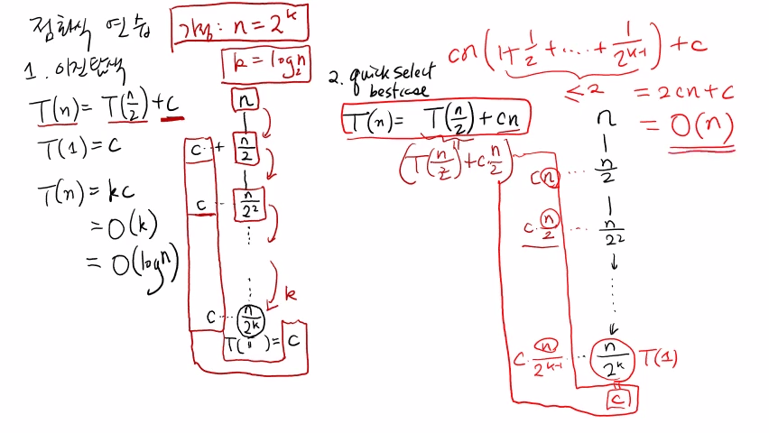
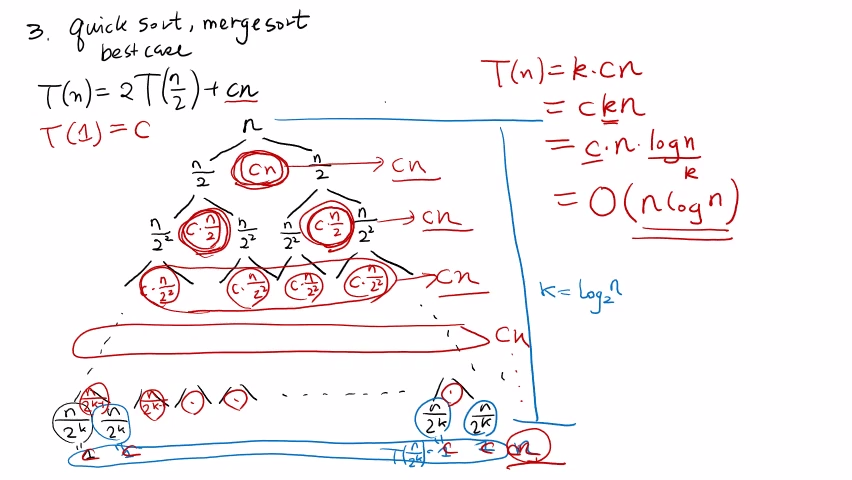
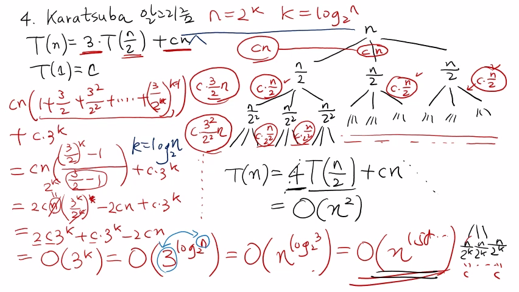

>
해당 포스트는 아래 수업들의 내용을 바탕으로 작성되었습니다.
> - ['자료구조 - Data Structures with Python'](https://www.youtube.com/playlist?list=PLsMufJgu5933ZkBCHS7bQTx0bncjwi4PK)
> - ['알고리즘 - Algorithm with Python'](https://www.youtube.com/playlist?list=PLsMufJgu5932XYejsOwcUDJ2F75f56nrl)
>
\- Youtube :
['Chan-Su Shin'](https://www.youtube.com/channel/UCJ4SXKMLQucqaxt4A6PonwQ)  
\- Professor : 신찬수 교수 (한국 외국어 대학교 컴퓨터 공학부)


# 1. 이전 항의 계수가 1인 점화식

지금까지 살펴본 분할 정복 알고리즘의 수행 시간은, 모두 T(n) 에 대한 점화식으로 표현되었다.

> 그리고, 이러한 점화식들은 알고리즘이 동작하는 방식에 따라서 여러 가지 형태를 띠었다.

- 물론, 지금까지의 수업에서는 이러한 점화식들을 모두 직접 전개하는 방식으로 풀어왔다.
- 하지만, 이번 수업에서는, 지금까지와는 다르게, 그림을 이용해 개념적으로 풀어볼 것이다.

## 1-1. 이진 탐색 알고리즘

첫 번째로 살펴볼 것은, 바로 이전 수업에서 살펴봤던 이진 탐색 알고리즘에 대한 점화식이다.

```
T(n) = T(n/2) + c, T(1) = c
```

> 이를 재귀적인 관점 대신, '문제의 크기가 절반으로 줄어든다.' 라는 직관적인 관점에서 살펴보자.

<br>

이 때, n 크기의 문제가 계속해서 n/2 크기의 문제로 나뉘므로, n = 2^k 라고 가정할 것이다.

- 물론, 무조건 2^k 일 필요는 없다. 왜냐하면, 빅오 표기법의 결과가 같을 것이기 때문이다.
- 하지만, n을 2로 k번 나누면 1이 되는 간단한 식을 유도하기 위해, 이렇게 가정하는 것이다.

<br>

그러면, 이것을 T(n/2) 대신에, T(n/2^2) + c 처럼 계속 대입을 해서 T(1) 에 도달할 때까지 계속 반복해도 되지만, 그림으로 그리면, 더 직관적으로 이해하기 쉽다.

무슨 말이냐면, 우선 n이 있다.

n은 n/2 로 쪼개진다.

그러면서, +c 만큼의 일을 하는 것이다.

그러면, +c 를 c만큼 일을 하는 것이다.

n/2 짜리 문제가 n/2^2 짜리 문제로 쪼개지고, 거기서 c만큼의 일을 또 해야 한다.(연산이 필요한 것이다.)

그 다음에 이를 계속 반복하는 것이다.

그러다가, n/2^k 까지 내려갈 것이다.

그러면, n/2^k 까지 내려가면서 c만큼의 일을 하고, T(n/2^k) 값은 c다.

그러면 결국은, n 문제가 반쪽 짜리 문제가 되는데, c만큼의 연산을 해서 반쪽 짜리 문제가 되었고, 또 그것의 반쪽짜리 문제가 되는데, 또 c만큼을 투자한 것이다.

결국, n ~ n/2^k 까지 내려오면서 생긴 c를 다 더하면 되는 것이다.

그러면 이 c가 몇 개냐 하면, n이 몇 번 내려 갔는가? k번 내려갔다.

k번 내려갔는데, 그러면 c가 몇 개냐면, k개 생기는 것이다.

그래서 결국, 각각 반씩 내려가면서 발생했던 기본 연산 횟수 c를 다 합치면, kc가 된다.

그래서, T(n) = kc 가 되는데, 마찬가지로 n = 2^k 의 양변에 로그를 취해서, k = log2(n) 이라는 것을 알고 있는 것이고, 그러면, 결국은 O(k) 가 되는 것이고, c는 상수이기 때문에, k는 log2(n) 이니까, O(log n) 이 되는 것이다.

즉, log2(n) 번만 비교하면, 이진 탐색을 할 수 있다는 것이다.

정렬이 되어있다는 것을 잘 이용한 것이다.

그렇지 않고, a[0] 부터 차례대로 비교했으면, 최악의 경우에는 n번을 비교해야 되는데, 정렬이 되어있기 때문에, log2(n) 번 만으로도 내가 원하는 값이 있는지 없는지 알 수 있다는 것이다.

## 1-2. Quick Select 알고리즘의 최선의 경우

그 다음에, 두 번째로, Quick Select 에서, 최선의 경우(Best Case) 가 있다.

이것은 T(n) = T(n/2) + cn 으로, 한 쪽을 택하는 것이었다.

이 경우에는 똑같이, n 문제를 어떻게 했냐면, n 문제가, 이 경우도 마찬가지, n 문제가 n/2 문제가 되고, 그런데, 여기서는 상수가 아니고, cn만큼의 일을 하는 것이다.

문제를 반으로 줄이기 위해서, cn 정도의 일을 한 것이다.

그리고 다시, 이 문제가 n/2^2 문제로 다시 나뉘는데, 이 때는 c * (n/2) 정도의 일을 한다.

왜냐하면, 기존의 점화식에 n대신에 n/2가 들어가서 T(n/2) = T(n/2^2) + c * (n/2) 이기 때문이다.

그래서, 이것을 계속 반복하는 것이다.

그러다가, n/2^k 까지 내려오는 것이다.

그러면 여기서 나온 일의 양(연산) 은, c * n/2^(k-1) 이 될 것이다.

이 때, c * n/2^k = c * 1 = c 에 해당한다.

그러면, 결국, c는 마지막 c는 더하나 마나니까 결국 우리가 원하는 거는 이만큼을 다 더하는 건데 사실은, c는 상수니까, 의미가 없는 것이고, 그러면, 여기있는 것을 모두 더한다고 치면, n은 다 공통으로 들어있다.

n과 c는 공통으로 들어있으니 모두 빼고, 그러면 남는 것은 cn * (1 + 1/2 + ... + 1/2^(k-1)) + c 가 된다.

그런데, 여기서 1 + 1/2 + ... + 1/2^(k-1) 는, 무조건 2보다 크지 않다.

그러면, cn * (1 + 1/2 + ... + 1/2^(k-1)) + c = 2cn + c = O(n) 이 되는 것이다.

그래서, Quick Select 의 최선의 경우에는, 이러한 점화식이 나타나는데, 이 경우를 그림처럼 풀면, O(n) 이 나온다는 것이다.

<br>

<details><summary>참고 : 실제 교수님 강의 화면 필기 내용</summary>



</details>

# 2.

이번에는, T(n) = 2 * T(n/2) + cn 이라는 점화식을 가지고 있는 알고리즘이 있다고 가정을 해보자.

그 알고리즘은 앞으로 우리가 다음 주에 배울 정렬 알고리즘에 등장하는 몇 가지 정렬 알고리즘의 수행 시간이 이렇게 정의가 되는데, 첫 번째는 Quick Sort 알고리즘의 Best Case 이다.

Quick Select 의 정렬 버전인데, 그 경우에 pivot 을 잘 고르면, 반반씩 두 개로 쪼개져서, 반쪽 짜리 문제 두 개를 풀면 되는 것이다.

뭐, 그런 식으로 하는 것이고, 그와 유사하게, Quick Sort 말고, Merge Sort 라는 것도 있는데, Merge Sort 도 분할 정복 알고리즘으로 하는 것이다.

그런데 그것도, 원래 n개를 정렬하는 문제를 n/2개를 정렬하는 문제 두 개로 쪼개서 푼다는 것이다.

그 때 이제, 추가적으로 cn만큼의 연산을 더해야 하는 것이다.

그래서 이러한 점화식이 만들어지는 것이다.

이것을 이제, 그림처럼 전개해서 푼다고 치면, 한 번 어떻게 되는지 보자.

우선, 크기가 n인 문제를 풀어야 한다.

그런데 여기서는 어떻게 되냐면, n/2 짜리 문제가 두 개 만들어 지는 것이다.

그 때, 얼마만큼의 일을 추가로 하냐면, cn만큼의 일을 한다.

그 다음에 다시 또 재귀적으로, n/2^2의 문제 두 개로 쪼개지는 것이고, 이 때, 얼마만큼의 일을 하냐면, n대신에 n/2가 들어가므로, c * (n/2) 의 일을 하는 것이다.

그러면, 이것만 하는 것이 아니고, 이것도 두 개씩 쪼개지는 것이다.

그러면, 이것도 두 개로 쪼개지고, 이전 단계에서 쪼개졌던 문제들이 모두 n/2^3 짜리 두 개로 쪼개진다.

그래서, 여기는 c * n/2^2 만큼의 일을 하는 것이다.

그래서, 이것을 계속 반복하다가, 어디까지 내려오냐면, n/2^k, 즉, 하나가 남을 때까지 이렇게 내려오는 것이다.

그러면, n/2^k 짜리 문제로 쪼개지는 시점에서는 일을 얼마나 하냐면, n/2^(k-1) 만큼의 일을 하는 것이다.

그러면, 이것을 몇 번 내려가냐면, k번 내려간다.

k = log2(n) 이다.

그러면, n/2^k = 1 이므로, T(n/2^k) = 1 이라는 것이다.

이 1은 n개 있다.

즉, 여기 있는 모든 1을 모으면 n이다.

그 다음에 해야 하는 일이 뭐냐면, 맨 처음에 n을 두 개로 쪼갰을 때, cn만큼의 일을 한다.

그 다음에, 그렇게 두 개로 쪼개진 것을 각각 또 두 개씩 총 네 개로 쪼개졌을 때 c * n/2 + c * n/2 만큼의 일을 한다.

이것을 다 더해야 한다.

그런데, 여기 일은 cn이다.

그 다음에, 여기 두 개를 다 합치면 c * n/2 * 2 니까 마찬가지로 다 합치면 cn이다.

그 다음에, 여기 있는 네 개를 다 합치면, c * n/4 * 4 니까, 또 cn이다.

각 레벨마다, 필요했던 것들을 다 합치면 모든 단계에서 cn 이다.

T(1) = c 라고 하면, 모두 cn이 된다.

cn은 몇 개 나올까? 레벨마다 한 개씩 나오므로, 총 k개가 나온다.

그러면, T(n) = kcn 이 되는 것이다.

c는 상수니까 ckn이다.

k = log2(n) 이니까 T(n) = c * n * log2(n) 이다.

그러면, 빅오로 표현하면 상수는 없어지고, O(n log n) 이 최고 차항이 되는 것이다.

log2(n) 도 n에 관한 항이기 때문에 없애면 안된다.

n log n 자체가 하나의 항이다.

그래서, 이 알고리즘은 O(n log n), n 시간이 아니고, n보다 log2(n) 을 곱한 조금 더 오래 걸리는 시간으로 동작하는 알고리즘이다라는 것이다.

<br>

<details><summary>참고 : 실제 교수님 강의 화면 필기 내용</summary>



</details>

# 3.

그러면, Karatsuba 알고리즘의 점화식은 n 짜리 문제를 반 쪽 짜리 문제 3개로 쪼갠 다음에, 재귀적으로 하는것이다.

그렇게 쪼개기 위해서 얼마만큼의 연산이 있냐면, cn만큼의 일을 한 것이다.

즉, 원래 문제가 1/2 크기의 문제 세 개로 쪼개지고, 쪼개지면서 뭔가 cn만큼의 일을 해서 쪼갠 것이다.

그래서, 쪼개진 문제들은 다시 또, 계속 반복해서 쪼개지는 것이다.

이것을 그림처럼 그려보자.

만약, n개의 문제가 n/2개의 문제로 쪼개진다.

그런데, 이 때, 얼마만큼의 일을 했냐면, cn만큼의 일을 한 것이다.

cn만큼의 일을 해서, 3개의 반 쪽 짜리 문제로 쪼갠 것이다.

그런 다음에, n/2 크기의 문제를 다시 n/2^2 크기의 문제 3개로 쪼갠다.

이 때, 얼마만큼의 일을 했냐면, c * n/2 정도의 일을 한 것이다.

마찬가지로, 다른 n/2 크기의 문제들도 n/2^2 크기의 문제 세 개로 쪼개지면서 각각 c * n/2 정도의 일을 하게 된다.

그러면 이것을 계속 반복하다가, n/2^k 까지 나올 것이다.

그래서 T(1) = T(n/2^k) = c 이므로, 마지막으로 쪼개진 문제는 전부 다 c다.

그러면, 맨 위에서부터 아래까지는 깊이가 k다.

k = log2(n) 이다.

그 다음에, 내려올 때마다 얼마씩 일을 했냐면, cn + c * n/2 * 3 + c * n/2^2 * 3^2 + ... + c * n/2^k * 3^k 다.

여기서 cn이 공통적으로 들어가있고, 1 + 3/2 + 3^2/2^2 + ... + (3/2)^(k-1) 까지 내려가고, 맨 마지막의 c의 개수는 3^k 개다.

cn * (1 + 3/2 + 3^2/2^2 + ... + (3/2)^(k-1)) + c * 3^k 이 된다.

그러면, 이것을 계산해보면, (1 + 3/2 + 3^2/2^2 + ... + (3/2)^(k-1)) 수열의 값은 3/2 씩이니까, 3/2 이 공비가 되고, 항의 개수가 k개이므로, ((3/2)^k - 1) / (3/2 - 1) 이 될 것이다.

즉, cn * ((3/2)^k - 1) / (3/2 - 1) + c * 3^k 이다.

그리고 이것은, 2cn((3/2)^k) - 2cn + c * 3^k 이 된다.

그런데 n = 2^k 이다.

(3/2)^k = 3^k/2^k 이므로, 2cn((3/2)^k) - 2cn + c * 3^k = 2c * 2^k * ((3/2)^k) - 2cn + c * 3^k = 2c3^k + c * 3^k - 2cn 이 된다.

그러면 결국은, O(3^k) 이 된다.

k = log2(n) 이므로, O(3^k) = O(3^log2(n)) = O(n^log2(3)) = O(n^1.58...) 이다.

그러니까, n^2 보다는 작은 것이다.

반쪽짜리 문제를 세 개 풀고, 그러기 위해서 cn 정도의 연산을 했다고 하면, n^log2(3) 정도의, 즉, n^1.58 정도의 수행 시간을 갖게 된다라는 것이다.

앞에서 했었던 것은 뭐였냐면, T(n) = 2 * T(n/2) + cn 이었고, 그 때는 O(n) 이었다.

그런데, 반쪽짜리 문제를 세 개 풀었더니, O(n) 이 아니고, n보다 더 큰 n^1.58 이 된 것이다.

그러면 만약에, 카라추바 알고리즘 전에 일반적인 곱셈 알고리즘을 분할 정복으로 하면, T(n) = 4 * T(n/2) + cn 이 된다.

그러면 이 경우에는, 반쪽짜리 문제를 세 개도 아니고 네 개를 푼 것이니까, 카라추바 알고리즘의 수행 시간보다 더 많이 나와야 한다.

이 점화식은 똑같이 직접 풀어보자.

이 점화식은 O(n^2) 이 된다.

즉, n^1.58 보다 더 많이 되는 것이다.

그러니까, 반 쪽 짜리 문제를 두 개 풀 때, 세 개 풀 때, 네 개 풀 때, 당연히 두 개 풀 때가 더 적게 걸려야 되고, 네 개 풀 때가 가장 많이 걸려야 되는 것이다.

이것은 이제, 대입해서 계속 풀 수도 있지만, 이번 수업에서 본 그림처럼 그림으로 그려서 하면, 좀 더 개념적이고, 조직적으로 이해할 수가 있다.

모든 점화식을 다 이런 식으로 접근할 순 없지만, 이런 식으로 접근하는 게, 점화식이 어떤 식으로 동작하는지 이해하는 데 도움이 된다.

<br>

<details><summary>참고 : 실제 교수님 강의 화면 필기 내용</summary>



</details>
