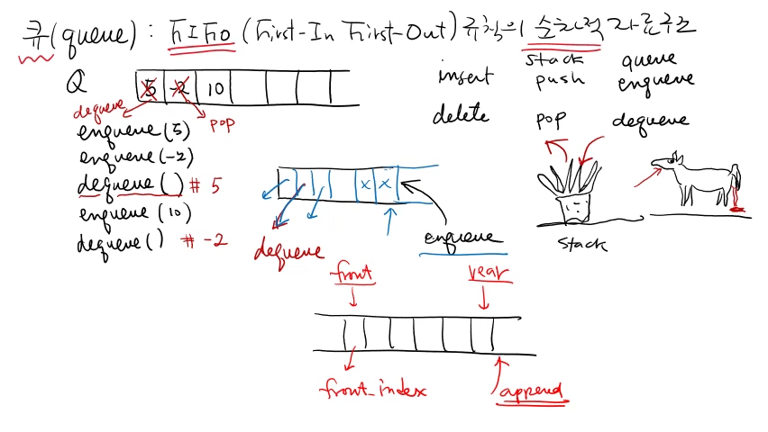
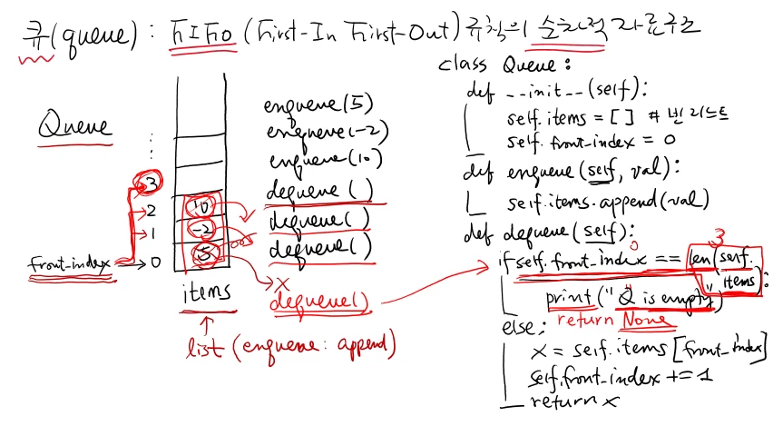
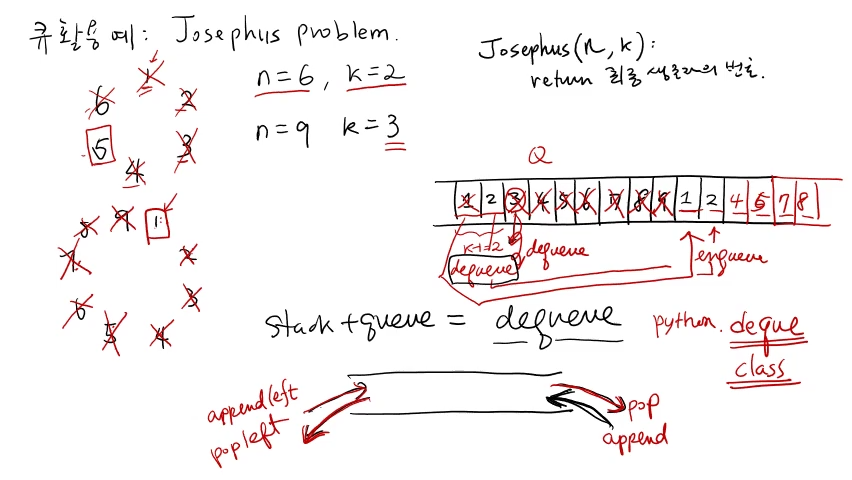

>
해당 포스트는 아래 수업들의 내용을 바탕으로 작성되었습니다.
> - ['자료구조 - Data Structures with Python'](https://www.youtube.com/playlist?list=PLsMufJgu5933ZkBCHS7bQTx0bncjwi4PK)
> - ['알고리즘 - Algorithm with Python'](https://www.youtube.com/playlist?list=PLsMufJgu5932XYejsOwcUDJ2F75f56nrl)
>
\- Youtube :
['Chan-Su Shin'](https://www.youtube.com/channel/UCJ4SXKMLQucqaxt4A6PonwQ)  
\- Professor : 신찬수 교수 (한국 외국어 대학교 컴퓨터 공학부)


# 1. 큐(Queue)

이전 수업에서 살펴봤었던 **'스택(Stack)'** 은 나중에 삽입된 값이 먼저 삭제되는 자료 구조였다.

- 스택 자료 구조가 따르는 이러한 규칙을, **'후입 선출(Last-In First-Out)'** 이라고 부른다.
- 위의 설명을 뒤집어서 생각해보면, 먼저 삽입된 값이 나중에 삭제된다는 것을 알 수 있다.

<br>

이와 달리, 이번 수업에서 배울 **'큐(Queue)'** 는 먼저 삽입된 값이 먼저 삭제되는 자료 구조다.

- 이러한 큐 자료 구조의 규칙은, 은행에서 번호표를 뽑는 것과 같은 상황에 비유할 수 있다.
- 큐는, 번호표를 먼저 뽑은 사람이 은행 서비스를 먼저 받듯, 정보를 선착순으로 관리한다.

<br>

즉, 먼저 삽입된 값이 먼저 삭제되는, **'선입 선출(First-In First-Out)'** 규칙을 따르는 것이다.

> 이러한 선입 선출의 규칙에 따라, 자료가 삽입/삭제되는 순차적인 자료 구조를 큐라고 한다.

<br>

임의의 큐 자료 구조가 있다고 가정하고, 아래와 같이, 배열과 같은 형태로 그려서 살펴보자.

```
Q = [  ][  ][  ][  ][  ][  ][  ][  ]
```

## 1-1. 제공하는 연산

스택에서 push() 라고 부르는 삽입(insert) 연산의 경우, 큐에서는 enqueue() 라고 부른다.  
`(이처럼, 스택과 큐 자료 구조에서 제공하는 모든 연산의 이름들은, 관례적으로 정해져 있다.)`

```
enqueue(5)
                                        <- 1
Q = [ 5][  ][  ][  ][  ][  ][  ][  ]
--------------------------------------------
enqueue(-2)
                                        <- 2
Q = [ 5][-2][  ][  ][  ][  ][  ][  ]
```

1. 텅 비어있는 큐에 5라는 값을 삽입하면, 위와 같이, 가장 왼쪽 빈칸에 5가 들어가게 된다.  
   `(만약, 큐 자료 구조를 세워서 그렸다고 가정한다면, 이는 가장 아래쪽 빈칸이 될 것이다.)`
2. 그런 다음, -2라는 값을 큐에 삽입하면, 5가 들어간 바로 다음 칸에, -2가 들어가게 된다.

<br>

스택에서 pop() 이라고 불리는 삭제(delete) 연산의 경우, 큐에서는 dequeue() 라고 부른다.

```
dequeue() # 5
                                        <- 1
Q = [-2][  ][  ][  ][  ][  ][  ][  ]
--------------------------------------------
enqueue(10)
                                        <- 2
Q = [-2][10][  ][  ][  ][  ][  ][  ]
--------------------------------------------
dequeue() # -2
                                        <- 3
Q = [10][  ][  ][  ][  ][  ][  ][  ]
```

1. 위 상황에 이어서, 값을 삭제하면, 선입선출 규칙에 따라, 먼저 삽입된 값 5가 삭제된다.  
   `(이 과정을 그대로 스택에서 처리했다면, 더 나중에 삽입된 값인 -2가 삭제되었을 것이다.)`
2. 이 상태에서 다시 10이라는 값을 삽입하면, -2가 있는 칸 바로 뒤에 10이 들어가게 된다.
3. 여기서 다시, 삭제 연산을 수행하면, 저장된 값 중 가장 먼저 들어온 값인 -2가 삭제된다.

<br>

큐의 삽입/삭제 연산은, 이렇게, 뒤로 삽입하고, 앞에 있는 원소를 삭제하는 식으로 수행된다.

> 이전 수업에서도 언급했듯, 스택과 큐의 연산 수행 규칙을 생물에 빗대어 표현할 수 있다.

- 스택의 경우, 바닷속에 사는, 입으로 먹어서, 입으로 배설하는 말미잘에 비유할 수 있다.
- 큐의 경우, 입으로 먹어서, 뒤(?) 로 배설하는, 말과 같은 평범한 동물에 비유할 수 있다.

## 1-2. 연산에 필요한 정보

이번에는, 이러한 enqueue(), dequeue() 연산을 수행할 때, 어떤 정보가 필요한지 살펴보자.

- 스택의 경우, 가장 마지막에 저장된 값(top) 의 인덱스만 알면, 연산을 수행할 수 있다.
- 왜냐하면, 값을 삽입하거나 삭제하면서 반환할 때 필요한 인덱스가 모두 같기 때문이다.

<br>

이러한 스택과는 다르게, 큐는, 값이 삽입될 위치와 삭제될 위치의 인덱스를 모두 필요로 한다.

- enqueue() 연산의 경우, 몇 개의 값이 저장되어 있는지를 알고 있어야 수행할 수 있다.
- 다음으로, dequeue() 연산의 경우, 반환할 값의 인덱스를 알고 있어야 수행할 수 있다.
- 이는, 순서대로 삽입되고, 삽입된 순서 그대로, 차례대로 삭제되는 큐의 특징 때문이다.
- 정리하자면, 큐는 삽입/삭제 연산용 인덱스를 따로 관리하는 자료 구조라고 할 수 있다.

<br>

enqueue() 연산은 원소를 뒤에 추가하므로, 리스트의 append() 와 같다고 생각할 수도 있다.

> 이렇게, enqueue() 를 append() 로 생각하면, 삽입할 위치를 따로 관리할 필요가 없어진다.

<br>

dequeue() 연산은, enqueue() 와는 다르게, 처리할 대상의 인덱스가 무조건 필요한 연산이다.

> 이 때, dequeue() 연산의 대상인, 큐의 맨 앞부분을 가리키는 인덱스를 'front' 라고 부른다.

<br>

이렇게, 큐의 앞부분은 'front' 라 부르며, 반대편에 해당하는 뒷부분은 보통 'rear' 라고 부른다.

> 다시 말해, 'rear' 에는 enqueue() 연산, 'front' 에서는 dequeue() 연산이 처리되는 것이다.

<br>

<details><summary>참고 : 실제 교수님 강의 화면 필기 내용</summary>



</details>

# 2. 직접 구현해보기

이렇게 큐의 특징과 제공하는 연산들에 대해 알아봤으니, 이번에는, 큐를 클래스로 구현해보자.

- 우선, 파이썬 문법에 따라 클래스를 선언할 것이며, 클래스 이름은 'Queue' 라고 할 것이다.
- 실제로 정보를 저장할 공간이 필요한데, 이는 'items' 라는 이름의 리스트로 구현할 것이다.  
  `(저장 공간이 리스트이기 때문에, enqueue() 를 구현할 때, append() 를 활용할 수 있다.)`
- dequeue() 를 구현하기 위해, 'front\_index('front' 의 인덱스)' 라는 변수도 사용할 것이다.
- 즉, 선언할 클래스는 'items' 리스트와 'front\_index' 변수를 멤버 변수로 갖게 되는 것이다.

<br>

이렇게, 큐 자료 구조에 대한 클래스를 어떻게 구현할지 정했으니, 이를 직접 코드로 작성해보자.

```py
class Queue:
    def __init__(self):
        self.items = [] # 빈 리스트
        self.front_index = 0

    def enqueue(self, val):
        self.items.append(val)

    def dequeue(self):
        if self.front_index == len(self.items):
            print("Q is empty")
        else:
            x = self.items[front_index]
            self.front_index += 1
            return x
```

<br>

파이썬으로 클래스를 작성할 때, 맨 처음으로 작성해야 하는 것은, 생성자 메소드 \_\_init\_\_() 이다.

- 우선, 생성자 내부에, 멤버 변수 'items' 를 선언한 후, 이를, 빈 리스트로 초기화할 것이다.
- 이렇게, 저장 공간이 준비되었으니, 다음으로는, 'front\_index' 를 0으로 초기화하면 된다.

<br>

이렇게, 클래스 생성자 작성이 끝났으니, 이제, enqueue() 연산을 처리할 메소드를 구현해보자.

- '클래스를 통해 생성된 객체' 를 가리키는 'self' 와 삽입하려는 값인 'val' 을 인자로 받는다.
- 입력된 값은 'items' 리스트의 뒷부분에 삽입되어야 하므로, append() 메소드를 사용한다.

<br>

여기서 중요한 것은 dequeue() 연산을 어떤 식으로 처리하느냐인데, 하나씩 차근차근 살펴보자.

- 연산을 수행할 대상, 즉, '클래스를 통해 생성된 객체' 를 가리키는 'self' 를 인자로 받는다.
- 그리고, 해당 객체의 'front\_index' 에 있는 값을 삭제한 후, 그 값을 그대로 반환하면 된다.

<br>

이 때, 객체의 'front\_index' 와 'items' 리스트의 길이가 같다면, 그런 경우는 따로 처리할 것이다.

> '큐가 비어있음을 알리는 문구' 를 출력하도록 할 텐데, 이유는 아래에서 예시와 함께 살펴보자.

<br>

우선, 큐에 5, -2, 10이 저장되어 있다고 가정했을 때, 'front\_index' 는 5를 가리키고 있을 것이다.

```
Q = [ 5][-2][10][  ][  ][  ][  ][  ]
     fi

front_index = 0, len(items) = 3
```

- 여기서 dequeue() 연산을 수행하면, 'items' 의 길이와 'front\_index' 의 값이 달라질 것이다.
- 아무것도 하지 않았을 경우, 'items' 의 길이는 3, 'front\_index' 는 0으로, 값이 서로 다르다.
- 이는, 큐에 원소가 있다는 것을, 다르게 말하면, dequeue() 할 원소가 있다는 것을 의미한다.

<br>

이제, 연산을 실제로 처리하기 위해, if 문 뒤에 else 문을 추가해, 값을 삭제/반환하도록 할 것이다.

```
Q = [ 5][-2][10][  ][  ][  ][  ][  ]
         fi

front_index = 1, len(items) = 3
```

- 이 때, 'items' 의 'front\_index' 에 있는 값을 따로 변수에 저장해뒀다가, 삭제/반환하면 된다.
- 여기서 '삭제한다.' 는 '큐의 원소가 아니다.' 이므로, 실제로는 원소를 삭제하지 않아도 된다.
- 이를 엄청나게 단순하게 처리할 수 있는데, 바로, 'front\_index' 의 값을 1 증가시키는 것이다.
- 현재 예시 상황에서 dequeue() 를 수행하면, 'front\_index' 는 1이 되어, -2를 가리키게 된다.
- 이렇게 하면, 'front\_index' 가 '다음 dequeue() 연산에서 반환해야 할 값' 을 가리키게 된다.
- 이렇게 삭제 작업을 마친 후에는 앞에서 저장해두었던 변수를 그대로 반환하기만 하면 된다.

<br>

그러면, 왜 여기서 self 객체의 front\_index 가 items 리스트에 있는 원소의 개수와 같으면 큐에 dequeue 할 게 아무것도 없는 비어 있는 큐인지 보면 된다.

예를 들어서 dequeue 를 한번 더 했다고 가정해보자.

그러면, 다음 위치에 있는 값인 -2가 반환되고, front\_index 는 10이 들어있는 2번 인덱스를 가리키게 된다.

그 다음에 또 한번 dequeue 를 하면, 10이 반환되고, front\_index 는 3이 된다.

그러면, 그 다음에 다시 dequeue 를 한다고 가정해보자.

그러면, 현재 front\_index 는 3이고, items 에는 3개의 원소가 들어있다.

사실, 원소를 실제로 삭제한 것은 아니고, 인덱스만 하나씩 올려서, 예전에 들어왔던 값들이 실제로는 들어있지만, 인덱스를 조정해서 없는것처럼 흉내를 낸 것이기 때문에, 현재 큐, 즉, items 리스트에는 3개의 원소가 들어있는 것과 마찬가지다.

그래서 len() 으로 길이를 확인하면, 그 값이 3이 되는 것이다.

그런데, front\_index 도 지금 3을 가리키고 있기 때문에, 결국은 enqueue 된 원소들이 전부 dequeue 되었다는 것이다.

그래서, 현재 items 에는 아무것도 없고, 비어있다는 것이며, 이는 더이상 dequeue 할 것이 없다는 뜻이다.

그래서, 큐가 비어있다라는 메시지를 출력하고, 결과가 없음을 나타내기 위해 None 을 반환하면 된다.

그래서 None 이 반환되었다는 것은, 큐가 비어있어서 dequeue 할 것이 아무것도 없다는 의미로 받아들이면 된다.

<br>

<details><summary>참고 : 실제 교수님 강의 화면 필기 내용</summary>



</details>

# 3.

큐의 연산 enqueue, dequeue 를 좀 더 명확하게 이해하기 위해서, 예제를 하나 들 것이다.

꽤 유명한 문제인 요세푸스 문제(Josephus Problem) 를 살펴볼 것이다.

요세푸스 문제는 위키피디아 같은 곳을 찾아보면 알겠지만, 어떤 전투 중에 어떤 군인들이 동굴에 갇혀 적들에게 포위된 상황에서, 비굴하게 항복하느니 차라리 순번을 정해서 차례로 죽자, 그리고 최후의 승자 한 명만 살아남아서 항복을 하든지 하자라고 결정했다고 한다.

그래서 1번부터 6번까지 6명의 군인이 그림에서 보이는 것처럼 동그랗게 앉은 상황, 즉, n = 6 이며, 매 두 번째 사람마다 죽는 것으로 결정한 상황, 즉, k = 2 이다.

우선은 기준이 되는 번호가 있어야 하므로, 시작 번호는 1번이라고 가정한다.

처음에는, 두 번째 순서인 2번 군인이 죽게 되며, 다음으로, 4번 군인이 죽고, 6번 군인이 죽게 된다.

그러면, 1, 3, 5번 군인이 살아남게 된다.

마지막 순서였던 6번 군인의 다음은 1번 군인, 그 다음 순서는 3번 군인이므로, 다음으로는 3번 군인이 죽게 된다.

다음으로, 3번 군인의 다음 순서인 5번 군인을 지나, 그 다음 순서인 1번 군인이 죽게 된다.

그러면, 5번 군인이 최종 승자가 되는 것이다.

이렇게, n이 주어지고 k가 주어지면, 최종적으로 살아남는 유일한 사람의 번호는 몇 번인지를 계산하는 문제가 요세푸스 문제다.

그런데 지금 여기서는 k가 2라고 했지만, 예를 들어, n = 9, k = 3 이 될 수도 있다.

그러면, 1번부터 시작한다고 하면, 매 세 번째 사람마다 죽게 된다.

그러면, 3, 6, 9, 4, 8, 5, 2, 7번 순서로 군인들이 죽게 되면서, 1번 군인이 최종 승자가 된다.

이를 구현하기 위해, 여러분들은 아래와 같은 함수를 하나 작성할 수 있다.

해당 함수의 이름은 Josephus 이며, 인자로 n과 k가 주어지면, 최종 생존자의 번호를 반환하는 함수다.

이러면, 이제 문제를 풀어야 하는데, 이를 해결할 수 있는 여러 가지 방법이 있다.

큐를 활용해도 된다.

이는, 큐를 활용하는 것이 효율적이라는 뜻이 아니라, 큐를 활용해서 이 문제를 그대로 시뮬레이션할 수 있다는 뜻이다.

우선, 큐가 아래와 같은 형태를 띤다고 가정해보자.

우선, 1번부터 차례대로, 9개의 원소를 enqueue 를 한다.

그리고, k = 3 이라고 가정할 것이다.

k = 3 이라는 것은, 매 세 번째 사람을 큐에서 제거하면 된다는 뜻이다.

여기서 처음에는 3을 제거해야 하는데, 이 자료 구조는 큐이기 때문에, dequeue 를 하면, 1이 나오게 된다.

그렇기 때문에, 3을 바로 dequeue 할 수는 없다.

그래서, 처음에는 k - 1 개, 즉, 여기서는 k = 3 이므로, 처음 3 - 1 = 2 개를 먼저 dequeue 해서, dequeue 를 하자마자 다시 enqueue 하는 것이다.

1번 군인은 아직 생존해 있는 상태이므로, dequeue 를 하자마자 enqueue 를 하는 것이다.

그러면 큐의 맨 오른쪽 끝에 1이 추가될 것이다.

그 다음에, 다시 2도 dequeue 한 뒤에, 그대로 enqueue 하면 된다.

그러면, 위에서 뒤로 보낸 1의 뒤에 2가 위치하게 된다.

그 다음에, k번째 값은, enqueue 를 하지 않고, 그냥 dequeue 만 하면 된다.

그러면, 없어진다.

즉, 처음의 k - 1 개는 dequeue 한 것을 enqueue 했기 때문에, 맨 뒤에 붙어있게 된다.

그리고, k번째만 dequeue 하면, k번째 원소만 해당 큐에서 사라지게 되는 것이다.

즉, 처음으로 탈락하게 되는 것이다.

그 다음에, dequeue 한 다음에 enqueue 하는 것을 두 번 반복하고, 다음 세 번째 원소는 dequeue 만 한다.

이런 식으로, dequeue, enqueue, dequeue, enqueue, dequeue 를 했을 때, 큐에는 1, 2, 4, 5, 7, 8이 남아있게 된다.

처음에 한 바퀴를 돌면, 1, 2, 4, 5, 7, 8만 살아남고 나머지는 다 죽게 되는 것이다.

이런 식으로 계속, 큐에 남아있는 원소가 하나가 될 때까지 하면 된다.

그 남아있는 값이, 9명의 군인 중에서, 마지막까지 살아남은 사람의 번호가 된다.

이 코드는 강의 노트에 있으니, 강의 노트와 구름을 참조하면 된다.

그리고, 이제, 스택과 큐를 합친 순차적인 자료 구조를 deque 라고 한다.

강의 영상에서는 deque 를 dequeue 라고 표기하고 있다. (이는, 잘못된 표기는 아니지만, 권장되지는 않는 표기다.)

이 자료 구조는 queue 의 원소를 제거하는 연산인 dequeue 와 이름이 똑같은데, 해당 자료 구조는 스택과 큐가 합쳐진 새로운 자료 구조도 dequeue 라고 부른다.

dequeue 는 말그대로, 오른쪽 끝에서 들어가서 오른쪽 끝에서만 나올 수 있는 스택과 오른쪽 끝으로 들어가서 왼쪽 끝으로 나오는 큐가 합쳐져서, 양쪽 끝으로 다 들어가고 나올 수 있다.

즉, 삽입 연산이 양쪽 끝에서 이뤄지고, 삭제 연산도 양쪽 끝에서 처리될 수 있는 것이다.

즉, 오른쪽 끝으로 들어가면 append, 왼쪽 끝으로 들어가는 것은 appendleft 라고 한다.

그리고, 오른쪽 끝에서 나오면 pop, 왼쪽 끝에서 나오는 것은 popleft 라고 한다.

그리고 실제로, 이러한 deque 는, 앞에서 말했듯, 큐와 같이 클래스를 만들어서 사용할 수도 있지만, 파이썬에서는 deque 라는 클래스르 제공한다.

이러한 deque 클래스를 어떻게 사용하는지, 그리고, deque 를 이용해서 쉽게 생각할 수 있는 예제는 무엇이 있는지에 대해서는 온라인으로 Q&A 시간에 따로 다뤄볼 것이다.

<br>

<details><summary>참고 : 실제 교수님 강의 화면 필기 내용</summary>



</details>
