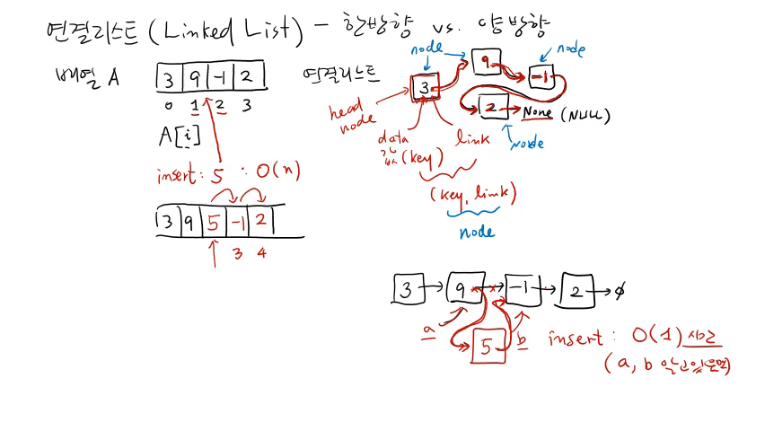
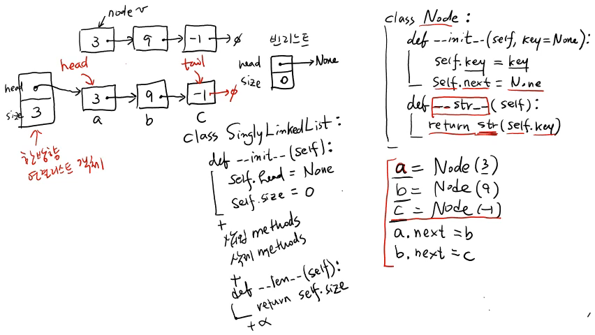

>
해당 포스트는 아래 수업들의 내용을 바탕으로 작성되었습니다.
> - ['자료구조 - Data Structures with Python'](https://www.youtube.com/playlist?list=PLsMufJgu5933ZkBCHS7bQTx0bncjwi4PK)
> - ['알고리즘 - Algorithm with Python'](https://www.youtube.com/playlist?list=PLsMufJgu5932XYejsOwcUDJ2F75f56nrl)
>
\- Youtube :
['Chan-Su Shin'](https://www.youtube.com/channel/UCJ4SXKMLQucqaxt4A6PonwQ)  
\- Professor : 신찬수 교수 (한국 외국어 대학교 컴퓨터 공학부)


# 1. 연결 리스트

이번 수업에서는, 순차적 자료 구조의 하나인 연결 리스트(Linked List) 에 대해 살펴볼 것이다.

- 배열과 함께 가장 중요한 순차적 자료 구조 중 하나이며, 한방향과 양방향 총 2종류가 있다.
- 우선, 한방향 연결 리스트를 살펴보고, 양방향 연결 리스트는 다음 수업에서 다뤄볼 것이다.

<br>

우선, 이러한 연결 리스트를, 같은 순차적 자료 구조인 배열(리스트) 과 비교해가면서 살펴보자.

> 순차적 자료 구조를 소개하면서 잠시 언급했던 부분들을, 이번에는 좀 더 자세하게 알아보자.

## 1-1. 개념

배열은 연속된 메모리 공간을 차지하는, 상수 시간 내에 값을 읽거나 쓸 수 있는 자료 구조이다.

```
A = [3, 9, -1, 2]
```

- 기본적으로, A[i] 형태로 인덱스를 지정하여 해당 위치에 있는 값을 읽거나 수정할 수 있다.
- 각 값이 메모리에 연속적으로 할당되어 있어서, 이러한 기본 연산은 상수 시간에 처리된다.
- 정확하게는, 특정 인덱스가 시작되는 메모리 주소를 상수 시간에 계산할 수 있기 때문이다.

<br>

이러한 배열과는 대조적으로, 연결 리스트에 저장된 값들은 메모리의 여러 위치에 흩어져 있다.

```
   9 ⤵
3 ⤴   1
       ↪ 2 → None
```

- 첫 번째 값이 3일 때 3이 저장되는 메모리 공간에 다음 값의 메모리 주소가 함께 저장된다.
- 그 메모리 주소를 확인해보면, 위의 그림과 같이 9와 그다음 메모리 주소가 저장되어 있다.
- 이런 식으로 메모리 주소를 계속 따라가면 저장된 값들을 하나씩 순서대로 확인할 수 있다.

<br>

연결 리스트의 마지막 값이 저장된 위치의 '다음 위치를 가리키는 메모리 주소' 는 'None' 이다.

- 'None' 은 아무런 의미가 없는 값을 의미하며, C 언어에서는 이를 'NULL' 이라고 표현한다.
- 이렇게, 특별한 경우나 어떤 것의 끝 등을 표현할 때, 주로 'None' 이나 'NULL' 을 사용한다.
- 여기서 'None' 은 '더 이상 다음 값이 없으니, 이것이 마지막 값이다.' 라는 의미를 나타낸다.

<br>

이처럼, 연결 리스트는 하나의 메모리 공간에 다음 값의 주소와 현재 값을 같이 저장해야 한다.

> 이는, 사용하는 메모리 공간이 연속적이지 않아서, 전체 순서를 따로 관리해야 하기 때문이다.

- 이 때, 현재 위치의 실제 값과 다음 위치의 주소로 구성된 한 쌍을 노드(node) 라고 부른다.
- 이러한 노드에 저장된 값, 다음 위치의 주소는, 보통, 데이터(data), 링크(link) 라고 부른다.
- 연결 리스트의 경우, 각 노드를 구별하기 위해, 데이터 항목에 보통 키(key) 값을 저장한다.
- 이렇게 여러 노드가 링크로 연결되는 형태를 띠기 때문에, 연결 리스트라고 부르는 것이다.

## 1-2. 기본 연산

배열과 연결 리스트는 각각 장단점이 있는데, 둘을 비교해보면서 어떤 차이가 있는지 살펴보자.

```
A[0], A[1], A[2], ..., A[100], ..., A[n]
```

<br>

우선, 배열은 특정 인덱스에 저장된 값을 상수 시간에 알 수 있지만 연결 리스트는 그렇지 않다.

- 연결 리스트를 구성하는 노드 중 맨 앞에 있는 노드는, 특별히 머리(head) 노드라고 부른다.
- 저장되는 위치를 봤을 때, 연결 리스트의 머리 노드는, 배열에서는 0번 인덱스가 될 것이다.
- 이 때, '배열의 2번 인덱스에 해당하는 노드' 에 저장된 값은 상수 시간 내에 확인할 수 없다.
- 왜냐하면, 연결 리스트는, 배열과 다르게 해당 위치의 주소를 계산할 방법이 없기 때문이다.

<br>

즉, 연결 리스트에서 특정 위치의 값을 알려면, 매번 머리 노드부터 링크를 따라 이동해야 한다.

- 2번째 노드와 100번째 노드를 확인하는 데 필요한 이동 횟수는 2번, 100번이 되는 것이다.
- n개의 노드를 포함하는 연결 리스트에서, 마지막 노드를 확인하려면 총 n번 이동해야 한다.
- 즉, n번째 노드를 확인하려면, 총 n번 이동해야 하므로, O(n) 만큼의 시간이 필요한 것이다.
- 즉, 연결 리스트는, 배열과 달리 어떤 위치의 값을 상수 시간 내에 확인할 수 없다는 뜻이다.

<br>

이번에는, 배열은 가질 수 없는 연결 리스트만의 장점 중, 가장 대표적인 장점에 대해 살펴보자.

> 배열, 연결 리스트의 형태가 각각 아래와 같을 때, 2번 인덱스 위치에 5를 삽입한다고 해보자.

```
A = [3, 9, -1, 2]
```

<br>

배열의 경우, 특정 위치에 값을 삽입하기 위해, 삽입할 위치의 메모리 공간을 미리 비워야 한다.

```
[3, 9, -1, 2] => [3, 9, Ø, -1, 2] => [3, 9, 5, -1, 2]
                         ->  ->
```

- 또, 공간을 비우려면 삽입할 위치부터 그 뒤에 있는 값들을 전부 한 칸씩 뒤로 옮겨야 한다.
- 이 때, 옮겨야 하는 원소의 개수는 삽입 위치에 따라 달라지지만, 결국, n에 수렴하게 된다.
- 즉, 뒤에 있는 값들을 이동하는 과정에서, O(n) 만큼의 대입 연산을 수행해야 하는 것이다.
- 정리하자면, 배열의 삽입 연산은, 최악의 경우에 O(n) 만큼의 시간이 걸린다고 할 수 있다.

<br>

물론, 연결 리스트에 값을 삽입할 때는, 공간을 만들기 위해 기존의 값들을 옮기지 않아도 된다.

```
[3]->[9]->[-1]->[2]->Ø => [3]->[9]--x->[-1]->[2]->Ø => [3]->[9]->[5]->[-1]->[2]->Ø
      ↑                          ↘     ↗
      A                            [5]
```

- 대신, 값을 저장할 노드를 새로 하나 만든 다음, 링크를 수정해 삽입할 위치에 넣으면 된다.
- 삽입할 위치 바로 앞에 있는 노드를 A라고 하면, 노드 A의 링크를 수정해주면 되는 것이다.
- 새로 삽입한 노드의 링크는, 노드 A가 기존에 가리키고 있던 주소를 가리키도록 하면 된다.

<br>

이런 식으로, 링크를 적절히 수정하면, 연결 리스트의 특정 위치에 새로운 값을 삽입할 수 있다.

- 만약 삽입에 필요한 노드의 주소를 이미 알고 있다면, 이를 상수 시간 내에 처리할 수 있다.
- 왜냐하면, 노드의 링크를 수정하는 것은, 주소값을 바꾸는 단순한 대입 연산이기 때문이다.  
  `(단, 해당 명제는 연산에 필요한 노드들의 주소값을 이미 알고 있다는 전제하에서만 성립한다.)`

<br>

<details><summary>참고 : 실제 교수님 강의 화면 필기 내용</summary>



</details>

# 2. 코드로 구현하기

이번에는, 한방향 연결 리스트와 양방향 연결 리스트 사이에 어떤 차이가 있는지부터 살펴보자.

## 2-1. 구조적 특징 살펴보기

이름에서도 유추할 수 있듯, 한방향 연결 리스트는 링크를 한쪽으로만 저장하는 연결 리스트다.

```
[3]->[9]->[-1]->Ø
```

- 위 연결 리스트의 경우, 링크를 따라서 이동할 수 있는 경로가 3에서 9, 9에서 -1밖에 없다.
- 반대로 9가 저장된 노드에서 3이 저장된 노드로 이동하는 것은 주소가 없어서 불가능하다.
- 왜냐하면, 연결 리스트의 특성상 링크에 저장된 메모리 주소로만 이동할 수 있기 때문이다.
- 한방향 연결 리스트는 이렇게 한쪽 링크만 있고, 반대쪽으로는 링크가 없는 연결 리스트다.

<br>

이러한 한방향 연결 리스트의 각 노드에 반대쪽 링크까지 추가하면 양방향 연결 리스트가 된다.

```
Ø<-[3]⇄[9]⇄[-1]->Ø
```

- 양방향 연결 리스트의 경우, 위처럼, 한쪽으로 이동할 수 있으면, 반대로도 이동할 수 있다.
- 기차 칸처럼 서로 연결되어 있기만 하면 어느 방향으로든 자유롭게 이동할 수 있는 것이다.
- 즉, 양방향 연결 리스트의 노드에는, 양쪽으로 하나씩 총 2개의 링크가 저장된다는 뜻이다.

<br>

물론, 연결 리스트의 노드에는 데이터(키 값) 와 링크 외에, 다른 부가적인 값이 저장될 수 있다.

- 예를 들어, 키 값으로는 학번을 저장하고, 학과나 이메일 주소 등을 추가로 저장할 수 있다.
- 노드를 구분하고 연결하는 키와 링크는 필수지만, 다른 값들은 선택적으로 저장하면 된다.
- 즉, 연결 리스트를 사용하는 목적에 맞춰, 어떤 값들을 저장할지 설정할 수 있다는 뜻이다.

## 2-2. 노드 클래스 구현하기

연결 리스트를 구현하려면, 우선, 연결 리스트를 구성할 노드에 대한 클래스부터 정의해야 한다.

```py
class Node:
    def __init__(self, key=None):
        self.key = key
        self.next = None

    def __str__(self):
        return str(self.key)
```

<br>

클래스를 생성할 때는, 클래스의 이름(Node) 을 지정한 후, 생성자(\__init\__()) 를 선언해야 한다.

- 생성된 노드 객체들을 구별하려면 키가 필요하므로, 'key' 라는 매개변수를 추가할 것이다.
- 이 때, 키 값이 따로 주어지지 않을 때도 있으므로, 기본값은 'None' 으로 지정해둘 것이다.
- 꼭 필요한 것은 아니지만, 매개변수에 'value' 를 추가해, 아예 다른 값을 저장할 수도 있다.  
  `(강의 노트의 예제 코드에는 'value' 도 매개변수로 설정되어 있지만 여기서는 생략할 것이다.)`
- 다음으로, 인자로 입력받은 키 값을 저장하기 위해, 'key' 라는 멤버 변수를 추가할 것이다.
- 다른 노드를 연결하려면 링크도 저장해야 하므로, 'next' 라는 멤버 변수도 추가할 것이다.  
  `(한방향 연결 리스트의 링크는, 순서상 다음 위치의 노드를 가리켜서 보통 'next' 라고 한다.)`
- 생성된 시점에는 다음 위치에 아무것도 없으므로, 초기값은 'None' 으로 지정해둘 것이다.

<br>

다음으로, 단순히 값을 반환하기만 하는 \__str\__() 이라는 특수 메서드를 하나 더 선언할 것이다.

```py
v = Node(3)

# without __str__()

print(v)     # <__main__.Node object at (object id)>
print(v.key) # 3

# with __str__()

print(v)     # 3
print(v.key) # 3
```

- 이는, 클래스를 통해 생성된 객체의 멤버 변수 'key' 를, 문자열로 바꿔 반환하는 메서드다.
- 원래는 어떤 노드 v의 키 값을 출력하려면, print() 함수에 인자로 v.key 를 전달해야 한다.
- 이 메서드를 정의한 경우, print() 함수의 인자로 객체를 전달해도, 바로 키 값이 출력된다.
- 코드는 print(v) 로 작성되어 있어도, 내부적으로는, print(v.\__str\__()) 로 동작하는 것이다.  
  `(print() 함수는, v.__str__()에서 반환된 문자열을 그대로 출력하는 역할만 하는 것이다.)`
- 이렇게, print() 함수를 통해, 바로 출력하고 싶은 값이 있을 땐, \__str\__() 를 정의하면 된다.

## 2-3. 연결 리스트 구성하기

이렇게, 기본 구성 요소인 노드를 구현했으니, 이번엔 노드를 이용해 연결 리스트를 구현해보자.

> 위에서 살펴봤던 [3, 9, -1] 형태의 연결 리스트를 구성한다고 가정하고, 그 과정을 살펴보자.

```py
a = Node(3)
b = Node(9)
c = Node(-1)

a.next = b
b.next = c
```

- 우선, 위에서 작성한 클래스로 키 값이 3인 노드를 하나 생성하여 변수 a에 저장할 것이다.  
  `(이렇게 생성된 노드 a를 보면, 키 값(key)은 현재 3이고, 링크(next)는 아직 None이다.)`
- 그리고, a 뒤의, 키 값이 9인 노드와 -1인 노드를 생성해, 각각 변수 b와 c에 저장할 것이다.
- 이제 a의 링크는 b, b의 링크는 c를 가리키도록 하여, 노드들을 순서대로 연결해줄 것이다.  
  `(여기서, 클래스에 지정된 링크의 기본 값이 'None' 이므로, c의 링크는 바꿀 필요가 없다.)`

<br>

그런데, 이렇게 노드를 개별적으로 생성하면, 생성할 때마다, 새로운 변수명을 지정해줘야 한다.

- 물론 이렇게 머리 노드를 제외한 다른 나머지 노드들을 일일이 변수에 저장할 필요는 없다.
- 왜냐하면, 머리 노드만 알면 나머지 노드들은 링크를 따라가면서 확인할 수 있기 때문이다.
- 연결 리스트의 순서상 마지막 위치에 저장되는 노드는, 특별히 꼬리(tail) 노드라고 부른다.
- 노드를 링크로만 관리하면 이러한 꼬리 노드를 찾기 위해 다른 모든 노드를 거쳐야만 한다.
- 즉, 연결 리스트가 커질수록, 꼬리 노드를 찾는 데 필요한 시간 또한 늘어나게 되는 것이다.  
  `(이는, 한방향 연결 리스트의 구조적인 특징 때문에 생기는 문제이기 때문에, 어쩔 수가 없다.)`

## 2-4. 연결 리스트 클래스 구현하기

이번에는, 머리 노드와 연결 리스트의 크기를 저장하는 새로운 클래스를 하나 만들어볼 것이다.

- 머리(head) 라는 이름으로 멤버 변수를 만들어, 머리 노드의 메모리 주소를 저장할 것이다.
- 크기(size) 라는 이름의 멤버 변수에는 연결 리스트에 저장된 노드의 개수를 저장할 것이다.
- 이러한 클래스를 이용해 새로운 객체를 생성하면, 그것이 한방향 연결 리스트 객체가 된다.

<br>

우선, 한방향 연결 리스트 클래스임을 나타내기 위해 이름은 'SinglyLinkedList' 라고 할 것이다.

```py
class SinglyLinkedList:
    def __init__(self):
        self.head = None
        self.size = 0

    # (+ 삽입 메소드)
    # (+ 삭제 메소드)

    def __len__(self):
        return self.size
```

<br>

위에서 했던 것처럼 생성자를 선언할 것인데, 이번에는, 매개변수를 따로 추가하지 않을 것이다.

- 메서드 내부에는, 머리 노드와 연결 리스트의 크기를 저장하는 멤버 변수를 정의할 것이다.
- 한방향 연결 리스트 객체가 생성된 시점에는, 아무것도 저장되어 있지 않은 상태일 것이다.
- 이러한 상태를 나타내기 위해, 각 멤버 변수의 초기값은 'None' 과 0으로 지정해둘 것이다.
- 반대로 말하면, 멤버 변수를 이용해 연결 리스트가 비어있음을 나타낼 수도 있다는 뜻이다.

<br>

다음으로, 노드를 삽입하거나 기존에 있던 노드를 삭제할 수 있도록, 메서드들을 추가해야 한다.

> 자료 구조에서 기본적으로 제공해야 하는 삽입, 삭제 등의 연산도, 이렇게 메서드로 구현된다.

<br>

연결 리스트에 저장된 노드의 개수, 즉, 크기를 반환하는 \__len\__() 라는 메서드도 추가해야 한다.

> 이는, 이미 'size' 라는 멤버 변수에 저장되어 있으니, 단순히 그 값을 반환해주기만 하면 된다.

<br>

이외에도 제공해야 하는 메소드가 더 있는데, 이는 다음 수업에서 더 본격적으로 살펴볼 것이다.

<br>

<details><summary>참고 : 실제 교수님 강의 화면 필기 내용</summary>



</details>
