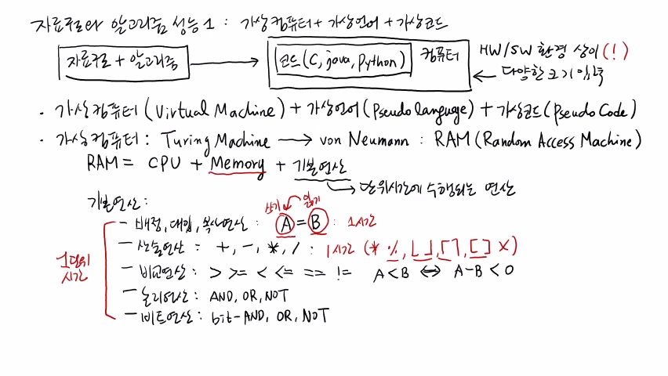

>
해당 포스트는 아래 수업들의 내용을 바탕으로 작성되었습니다.  
> - <a href='https://www.youtube.com/playlist?list=PLsMufJgu5933ZkBCHS7bQTx0bncjwi4PK' target='-blank'>'자료구조 - Data Structures with Python'</a>
> - <a href='https://www.youtube.com/playlist?list=PLsMufJgu5932XYejsOwcUDJ2F75f56nrl' target='-blank'>'알고리즘 - Algorithm with Python'</a>
>
\- Youtube :
<a href='https://www.youtube.com/channel/UCJ4SXKMLQucqaxt4A6PonwQ' target='-blank'>'Chan-Su Shin'</a>  
\- Professor : 신찬수 교수 (한국 외국어 대학교 컴퓨터 공학부)


# 1. 자료 구조와 알고리즘 성능 1

우리가 사용하는 자료 구조와 그 자료 구조를 활용해서 어떤 문제를 해결하는 알고리즘이  
어느 정도 성능을 보이는지 측정하고 비교하는 방법에 대해서 살펴볼 것이다.

## 1-1. 실제 환경에서의 알고리즘

임의의 자료 구조를 사용해서 알고리즘을 설계했다고 가정한다.

- 이 자료 구조와 알고리즘은 결국은 어떤 코드로 기술된다.
   - 이 때, 코드는 C, Java, Python 등의 언어일 수도 있다.
- 이 때, 코드를 통해 알고리즘이 어떻게 동작하는지 알 수 있게 된다.

<br>

이러한 실제 코드는 실제 컴퓨터에서 동작하기 때문에, 아래와 같은 문제가 있다.

1. 실제 하드웨어(Hard Ware, HW) 와 소프트웨어(Soft Ware, SW) 환경이 서로 상이하게 된다.
   - 서로 다른 컴퓨터가 있을 때, 똑같은 알고리즘을 똑같은 언어로 구현하는 상황이다.
   - 같은 알고리즘도 소프트웨어, 하드웨어 환경에 따라 서로 다른 성능을 보이게 된다.
   - 성능을 비교할 때, 이것은 굉장히 큰 문제가 될 수 있다.
2. 굉장히 다양한 크기의 입력이 존재한다.
   - 어떤 알고리즘은 어떤 입력에서는 굉장히 빠르게 동작하지만, 다른 입력에서는 늦게 동작할 수도 있다.
   - 그리고 당연히, 입력의 크기가 점점 커질수록, 시간도 더 많이 걸린다.
   - 이렇게 여러 가지 종류의 다양한 크기의 입력에 대해서 성능을 비교해야 한다.

<br>

이런 이유로, 아래와 같은 현실적인 문제가 발생한다.

> '내가 작성한 코드가 어느 정도로 빠르게 동작하는지를 어떻게 객관적으로 측정할 수 있을까?'

## 1-2. 가상 환경

위와 같은 문제와 상관없이 성능을 비교하는 방법을 알아보자.

### 1-2-1. 전체적인 구성

우선, HW / SW 환경에 구애받지 않은 좀 더 객관적인 컴퓨터 모델을 하나 가정해야 한다.

- 실제 모델일 필요가 없기 때문에, HW / SW 환경에 독립적인 가상의 컴퓨터를 하나 정의한다.
- 이것을 보통, 가상 머신(Virtual Machine) 이라고 한다.

또, 이런 가상 머신에서 가상의 언어로 알고리즘을 기술해야 한다.

- 이런 가상의 언어는 의사 언어(Pseudo Language) 라고 한다.
- 이런 가상의 언어로 짜여진 코드를 의사 코드(Pseudocode) 라고 한다.

<br>

>
이러한 가상의 요소들에 대한 약속을 정해두면, HW / SW 환경에 독립적이기 때문에,  
누구나 다 같은 환경에서 여러 알고리즘들을 객관적으로 비교할 수 있게 된다.

### 1-2-2. 가상 컴퓨터의 개념

가장 처음으로 등장한 컴퓨터란 개념은 튜링 기계(Turing Machine) 이다.

- 굉장히 원시적인 형태의 컴퓨터 모델이다.

<br>

튜링 기계는 폰 노이만이라는 수학자가 제시한 조금 더 현대적인 모델로 정착했다.

- 이는 우리가 현재 사용하고 있는 컴퓨터 모델과 굉장히 유사한 모델들이다.
- 여러 가지가 있지만 그 중에서도 RAM(Random Access Machine) 을 의미한다.  
    - 컴퓨터에서 사용하는 기억 장치인 RAM(Random Access Memory) 과는 다른 것이다.
    - 여기서 임의 접근 기계(RAM) 는 컴퓨터 자체를 의미한다.
    - 그런데, 여기서의 '임의 접근' 도 기억 장치에 임의로 접근할 수 있다는 것을 의미한다.
    - 따라서, 임의 접근 기억 장치와 개념적으로는 큰 차이가 없다.

### 1-2-3. 임의 접근 기계

RAM(임의 접근 기계) 이라는 컴퓨터 모델은 중앙 처리 장치, 기억 장치, 기본 연산으로 구성되어 있다.

- CPU(중앙 처리 장치) 는 실제 컴퓨터의 계산을 수행한다.
- Memory(기억 장치) 는 프로그램 뿐만 아니라 프로그램이 다루는 모든 정보를 저장한다.

<br>

CPU가 Memory에 접근해서 정보를 읽고, 쓰고 변형시켜, 원하는 값을 만들어 내는데,  
이런 상황에서 어떤 식으로 기억 장치에 있는 정보를 가공할지를 결정하는 것은 코드다.

- 코드는 단위 시간에 수행되는 연산들의 모음인 기본 연산들로 구성되어 있다.
- 기본 연산들은 단위 시간에 수행될 수 있을 정도로 아주 간단한 형태의 연산이다.

<br>

이런 기본 연산들을 반복적으로 사용해서 CPU, Memory와 함께 어떤 특정한 일을 한다.

- 이것이 바로 알고리즘이고, 그 알고리즘이 RAM이라는 가상 기계에서 돌아가는 것이다.

## 1-3. 기본 연산

기본 연산에는 보통 우리가 생각할 수 있는 기초적인 연산들이 모두 포함된다.

우선, 가장 쉽게 생각할 수 있는 것은 대입 연산이라고 불리는 것이다.

- 대입 연산은 배정 연산 또는 복사 연산이라고 불리기도 한다.
- 예를 들어서, A = B 은 B에 있는 값을 읽어서, A에 쓰는 것이다.
    ```
     A  =  B
     ↑     ↓
    쓰기   읽기
     ↖    ↙
       값
    ```
- 기억 장치에 접근해서 B의 값을 읽어오는 작업도 시간이 걸린다.
- 읽어온 값을 기억 장치의 A 위치에 써넣는 작업도 시간이 걸린다.
- 하지만, 이 모든 과정을 1 단위 시간(기본 시간) 내에 할 수 있다고 가정한다.

<br>

다음으로 많이 사용되는 연산은 산술 연산이다.

- 산술 연산은 4개의 사칙연산(+, -, \*, /) 이 포함된다.
- 여러 개의 숫자가 아니라 두 개의 숫자에 대한 사칙연산이 기본 시간에 수행된다.
- 여기서 주의할 점은 일부 수학적 연산들은 기본 연산으로 정의되지 않는다는 것이다.
   - 나머지 연산(%), 버림 연산, 올림 연산, 반올림 연산([]) 등이 해당된다.
   - 어떻게 보면, 기본 시간 내에 수행되는 연산으로 볼 수도 있다.
   - 하지만, 실제로 RAM 모델에서는 기본 연산으로 정의하지 않는다.
- 그렇지만, 현재 수업에서는 이러한 연산들도 전부 다 기본 시간 내에 수행된다고 가정할 것이다.

<br>

다음으로는 비교 연산이 있다.

- 비교 연산에는 >, >=, <, <=, ==, != 이 포함된다.
- 사실, 두 수를 비교하는 것도 기본 시간 내에 수행되는 작업이다.
- 두 수를 비교를 한다는 것은 두 값의 차이를 0과 비교하는 것과 같다.
    ```
    A < B <=> A - B < 0
    ```
- 이 때, 수행되는 빼기(-) 연산은 기본 연산 중 산술 연산에 포함되기 때문에, 기본 시간만큼 걸린다.
- 따라서, 비교 연산도 기본 시간이 걸린다라고 가정한다.

<br>

마지막으로, 논리 연산과 비트(bit) 연산이 있다.

- 논리 연산도 AND, OR, NOT 도 기본 시간 내에 수행된다.
- 비트 연산도 비트 별 AND, OR, NOT 이 모두 기본 시간 내에 수행된다.

<br>

이러한 연산들을 기본 시간 내에 수행되는 기본 연산으로 정의한 가상의 컴퓨터를 RAM 모델이라고 부른다.

- 앞으로, 이런 RAM 모델 위에서 알고리즘의 수행 시간을 측정하고, 그 측정된 시간으로 비교를 할 것이다.  

<br>

<details><summary>참고 : 실제 교수님 강의 화면 필기 내용</summary>



</details>

# 2. 가상 언어

앞에서 설명한 가상 머신(가상 컴퓨터) 위에 알고리즘을 동작시켜야 하는데,  
그러기 위해선 가상 컴퓨터가 알아들을 수 있는 형태의 언어가 필요하다.

> 그 언어로 기술된 알고리즘이 그 가상 머신 위에서 실행되는 것이다.

## 2-1. 가상 언어의 특징

- RAM 모델에서 제공하는 기본 연산들을 표현할 수 있는 언어면 된다.
- 또한, 여러 가지 제어 흐름 명령어들의 집합을 제공해주면 된다.
   - 제어 흐름에 관련된 내용은
     <a href='/Crash-Course/12.-프로그래밍의-기본---문장과-함수/#4-조건문' target='-blank'>
     '12. 프로그래밍의 기본 - 문장과 함수'
     </a> 참고
- 이 때, 언어에 따라서 작성된 코드인 가상 코드가 가상 머신 위에서 실행된다.
   - 실제로 실행되는 것이 아니라, 가상 머신 위에서 시뮬레이션되는 것이다.
   - 명령어에 따라서 하나하나씩 순차적으로 동작한다.
- 가상의 언어(Virtual Language) 가 실제 프로그래밍 언어일 필요는 없다.
   - 우리가 보통 사용하는 말보다는 조금 더 명확하면 된다.
   - 실제 프로그래밍 언어보다는 문법적으로 느슨한 형태면 된다.

## 2-2. 가상 언어의 조건

- 대표적으로, 배정, 산술, 비교, 논리, 비트 논리 연산과 같은 기본 연산들을 표현할 수 있어야 한다.
   - 이런 연산에 대한 문법들은 파이썬의 문법에서 그대로 가져와서 사용해도 된다.
- 그 다음으로 필요한 것은 제어를 할 수 있는 명령어들이 필요하다.
   - 비교를 하기 위해 아래와 같은 구조의 명령어를 제공해야 한다.
      - 'if' 또는 'if else' 또는 'if else if(elif) ... else' 등
   - 또한, 반복문을 사용할 수 있는 문법을 제공해야 한다.
      - 반복문을 사용할 수 없으면, 프로그램 또는 코드 자체가 말이 안되게 길어진다.
      - 따라서, 자주 사용되는 for, while 문과 같은 반복문이 제공되야 한다.
      - C, Python 의 반복문처럼 이해할 수 있는 문법이면 어떤 형태든 상관없다.
- 그리고, 함수와 관련된 문법이 필요하다.
   - 함수를 정의(define), 호출(call), 반환(return) 할 수 있는 문법이 존재하면 된다.
   - 기존에 있는 프로그래밍 언어에서 제공하는 문법을 그대로 사용해도 된다.

<br>

> 기준이 따로 정해져있지 않아서, 위와 같은 문법들을 제공하기만 하면 모두 가상의 언어라고 할 수 있다.

## 2-3. 가상 코드

이런 가상의 언어로 작성된 것이 가상의 코드고, 이것을 의사 코드라고도 부른다.

- 실제 컴퓨터가 아니라, RAM 모델에서 실행되기 때문에, 내용만 정확히 전달되면 된다.
- 세미 콜론(;) 을 문장 뒤에 찍어야 하는 등의 조건이 전혀 없어서, 훨씬 더 자유롭게 기술할 수 있다.

<br>

아주 간단한 예시와 함께 가상 코드를 살펴보자.

```
algorithm ArrayMax(A, n):
    input  : n개의 정수를 갖는 배열 A
    output : A의 수 중에서 최대값 리턴
    currentMax = A[0]
    for i = 1 to n - 1 do
        if currentMax < A[i]:
            currentMax = A[i]
    return currentMax
```

1. 알고리즘의 이름과 받을 입력에 대해 작성한다.
   - 'algorithm ArrayMax' 는 'ArrayMax 라는 알고리즘을 기술하겠다.' 라는 뜻이다.
   - 뒤에 있는 '(A, n)' 은 알고리즘이 받는 입력이다.
2. 'input' 항목에 알고리즘의 입력에 대한 내용을 작성한다.
3. 'output' 항목에 알고리즘이 계산하는 것에 대한 내용을 작성한다.
   - 이 때, 가장 쉬운 방법은 하나씩 비교하면서 현재까지 확인된 가장 큰 값을 유지하는 것이다.
4. 맨 처음에는 A[0] 을 currentMax 라는 변수에 집어넣도록 작성한다.
5. 모든 원소를 확인하기 위해 for 문을 작성한다.
   - 1 ~ (n - 1) 까지 반복하도록 한다.
6. 값을 비교하기 위해 if 문을 추가한다.
   - currentMax 는 현재까지 확인된 가장 큰 값이고, 현재 원소의 값은 A[i] 다.
   - currentMax 보다 A[i] 가 더 큰 경우, currentMax 의 값을 갱신한다.
7. 모든 원소의 반복이 끝났을 때, 전체에 대한 최대값인 currentMax 를 반환한다.

<br>

여기서 for 문은 가상 언어에서 제공되는 반복문 문법에 맞게 작성된다.

```
for i = 1 to n - 1 do
```

- 'i = 1 부터 n - 1 까지 아래 내용을 반복해라' 라는 뜻이다.
   - i 의 값이 1, 2, .., n - 1 로 변하는 동안 반복된다.

- 프로그래밍 언어마다 문법의 형태가 조금씩 다르다.
```
C      => for(i = 1; i < n; i++){}
Python => for i in range(1, n):
```

> 이렇게 의사 코드를 작성하면 어떤 방식의 for 문인지를 누구나 쉽게 이해할 수 있다.

## 2-4. 알고리즘

이번에는, ArrayMax 알고리즘에 A = [3, -1, 9, 2, 12], n = 5 을 입력하여,  
ArrayMax 알고리즘이 수행하는 기본 연산의 횟수에 대해 파악해볼 것이다.

```
기본 연산은 많이 하면 많이 할수록 시간이 오래걸리는데,  
10번 수행했다고 가정하면, (기본 시간 * 10) 의 시간이 필요하다.
```

<br>

위에서 정한 '구체적인 하나의 입력' 을 처리하는 과정을 살펴보자.

```
algorithm ArrayMax(A, n):
    input  : n개의 정수를 갖는 배열 A
    output : A의 수 중에서 최대값 리턴
    currentMax = A[0]          <- 1
    for i = 1 to n - 1 do      <- 2
        if currentMax < A[i]:  <- 3, 4, 5, 6
            currentMax = A[i]  <- 4, 6
    return currentMax
```

1. 대입 연산으로 1 기본 시간이 필요하다.
2. 다음으로 for 문에 들어간다.
   - 여기서 i 에 1을 집어넣기 때문에 대입 연산이 수행된다. `(i = 1)`
   - 반복 내용을 모두 수행한 다음에 i 를 1 증가시키는 산술 연산이 수행된다.
   - 이후에 증가된 i 값이 n - 1 보다 작은지를 확인하여 비교 연산이 수행된다.
   - 이렇게 for 문 안에서 내부적으로 여러 번의 기본 연산을 수행하게 된다.
   - 하지만, 이는 복잡하므로 for 문 내부적으로 하는 기본 연산은 다 세지 않을 것이다.
3. 다음으로 if 문에서 값을 비교한다.
   - currentMax(= 3) 와 A\[1](= -1) 을 비교하므로, 비교 연산이 수행된다.
   - 이 경우 3이 -1보다 크므로, 비교 문장(currentMax < A[i]) 은 거짓(false) 이 된다.
   - 따라서, 그 아래에 있는 currentMax = A[i] 는 수행되지 않는다.
4. 다시 for 문으로 들어가서 if 문을 수행한다. `(i = 2)`
   - A[2] = 9 이고, currentMax = 3 이다.
   - currentMax < A[i] 는 참(true) 이 된다.
   - currentMax = A\[i] (= 9) 라는 대입 연산이 수행된다.
5. 다시 for 문으로 들어가서 if 문을 수행한다. `(i = 3)`
   - A[3] = 2 이고, currentMax = 9 이다.
   - currentMax < A[i] 가 거짓이기 때문에, 비교 연산만 수행한다.
6. 다시 for 문으로 들어가서 if 문을 수행한다. `(i = 4)`
   - A[4] = 12 이고, currentMax = 9 이다.
   - currentMax < A[i] 가 참이기 때문에, 비교 연산과 대입 연산이 수행된다.

이 때 수행되는 기본 연산을 정리하면 아래와 같다.

```
A = [
    3,  => 1     | 대입 연산(1)
    -1, => 1     | 비교 연산(3)
    9,  => 1 + 1 | 비교 연산(4) + 대입 연산(4)
    2,  => 1     | 비교 연산(5)
    12  => 1 + 1 | 비교 연산(6) + 대입 연산(6)
]
```

이렇게, 총 7회의 기본 연산이 수행되므로, (기본 시간 * 7) 의 시간이 필요하다.

## 2-5. 수행 시간의 분석

그러나 문제는, 이런 입력이 무한히 많다는 것이다.

- 예를 들어, n 이 5일 때 가능한 A의 수는 무한히 많다.
   - A[0] ~ A[4] 까지, 들어갈 수 있는 수의 종류가 무한히 많기 때문이다.
- 또, 입력의 크기인 n 이 될 수 있는 수는 무한히 많다.
   - 현재는 n = 5 지만, 어떤 수라도 n 이 될 수 있기 때문이다.

<br>

이렇게 '무한히 많은 입력의 크기' 와 '무한히 많은 숫자들의 입력' 이 주어지는데,  
이것을 모두 고려해서 그 때마다 기본 연산의 수행 횟수를 일일이 파악할 수는 없다.

다음 수업에서는 이와 관련된 굉장히 중요하고 심각한 문제에 대해서 살펴볼 것이다.

> 어떤 방식으로 입력에 대한 알고리즘의 수행 시간(기본 연산) 을 측정할 것인가?

<br>

<details><summary>참고 : 실제 교수님 강의 화면 필기 내용</summary>


</details>

<br>

- 20210516 - 포스팅 제목 변경(2. 알고리즘 시간복잡도 1 -> 3. 알고리즘 - 시간복잡도 1)
- 20210516 - 이미지 경로 변경(2. -> 3.)
