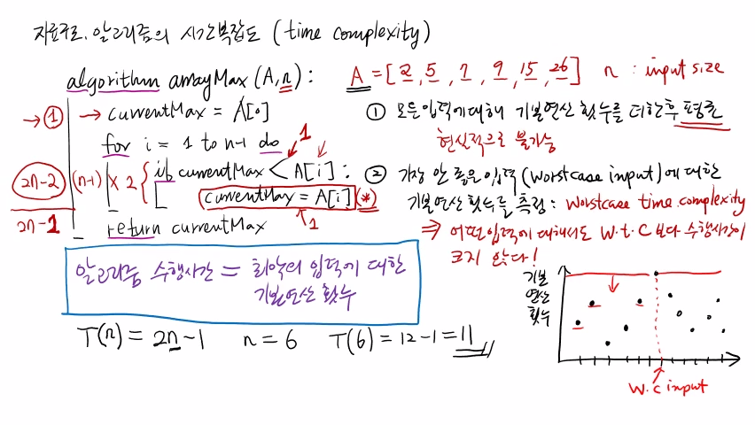
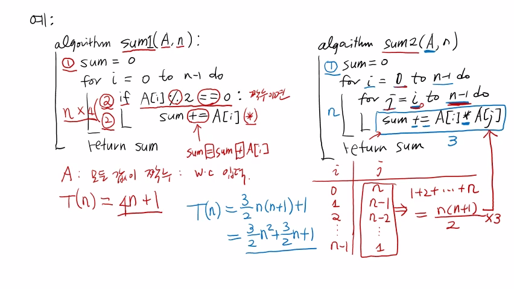

>
해당 포스트는 아래 수업들의 내용을 바탕으로 작성되었습니다.  
> - <a href='https://www.youtube.com/playlist?list=PLsMufJgu5933ZkBCHS7bQTx0bncjwi4PK' target='-blank'>'자료구조 - Data Structures with Python'</a>
> - <a href='https://www.youtube.com/playlist?list=PLsMufJgu5932XYejsOwcUDJ2F75f56nrl' target='-blank'>'알고리즘 - Algorithm with Python'</a>
>
\- Youtube :
<a href='https://www.youtube.com/channel/UCJ4SXKMLQucqaxt4A6PonwQ' target='-blank'>'Chan-Su Shin'</a>  
\- Professor : 신찬수 교수 (한국 외국어 대학교 컴퓨터 공학부)


# 1. 자료 구조, 알고리즘의 시간 복잡도

이전 강의에 이어서, 알고리즘의 시간 복잡도(Time Complexity),  
즉, '알고리즘의 수행 시간을 어떻게 정의할 것인가' 라는 문제를 더 알아보자.

<br>

앞서 언급했던 arrayMax 알고리즘을 예시로 살펴볼 것이다.

- arrayMax는 배열 A에 포함된 값 중에서 가장 큰 값을 구하는 알고리즘이다.
- 입력으로는 입력의 크기(input size) 인 n과 n 크기의 배열 A가 주어진다.  
  `ex) n = 6, A = [_, _, _, _, _, _]`

```
algorithm arrayMax(A, n):
    currentMax = A[0]
    for i = to n - 1 do
        if currentMax < A[i]:
            currentMax = A[i]
    return currentMax
```

## 1-1. 평균을 이용하는 방법

이 때, 주어지는 n의 값과 A 배열에 포함된 값들이 바뀔 때마다  
arrayMax가 실제로 수행해야 하는 기본 연산의 횟수도 달라지는데,

이런 상황에서 알고리즘의 시간 복잡도를 파악하는 가장 좋은 방법의 하나는,  
모든 입력에 대해서 기본 연산 횟수를 더한 후에 평균을 내는 방법이다.

- 결국, 모든 입력을 다 고려해서 평균을 취하는 것이다.
- 때문에, 알고리즘의 평균적인 기본 연산 수행 횟수를 파악할 수 있다.
- 이 때, 기본 연산 수행 횟수는 알고리즘 동작 시간과 비례하게 된다.

<br>

하지만, 이 방법은 고려해야 할 입력이 무한히 많기 때문에 현실적으로 거의 불가능하다.

물론, 모든 경우를 고려하지 않더라도, 수학적인 평균을 구할 수 있긴 하지만,  
모든 알고리즘의 평균 시간을 분석하는 것은 현실적으로 복잡하고, 어려움이 많다.

## 1-2. 최악의 경우를 이용하는 방법

그래서 두 번째로 생각해볼 수 있는 방법은 모든 입력을 고려하는 대신,  
가장 안 좋은 입력에 대한 기본 연산의 횟수를 측정하는 방법이다.

- 알고리즘의 기본 연산 횟수를 최대한 많이 필요로 하게 만드는 입력이다.
- 영어로는 worst-case input 이라고 하고, 이런 상황을 최악의 경우라 한다.
- 이렇게 측정된 시간 복잡도를 worst-case time complexity (W.T.C) 라고 한다.

<br>

사실 이 방법은, 모든 입력에 대해 측정하는 것이 아니기 때문에 결과가 정확하지 않지만,  
'어떤 입력에 대해서도 W.T.C 보다 수행 시간이 크지 않다는 것이 보장된다' 는 장점이 있다.

### 1-2-1. 간단한 예시

예를 들어, 어떤 알고리즘이 가장 안 좋은 입력에 대해서 100번의 기본 연산을 수행한다면,  
같은 입력 규모인 n에 대해 어떤 입력이 주어져도 기본 연산은 100번 미만으로 수행되는데,

이는 해당 알고리즘이 가장 안 좋은 입력에 대해 100회의 기본 연산을 해야 한다는 사실이  
다른 입력에 대해서는 100회 이하의 기본 연산만으로도 동작할 수 있음을 보장하기 때문이다.

이 상황을 그래프와 함께 더 자세히 살펴보자. `(x : n | y : 기본 연산 횟수)`

- 특정 n에 대해서 무수히 많은 입력이 존재할 때, 입력마다 연산 횟수가 다르다.
- 이 때, 기본 연산 횟수가 가장 큰 값이 되는 입력이 가장 안 좋은 입력이다.
- 따라서, 다른 입력들은 가장 안 좋은 입력보다 기본 연산 횟수가 작거나 같다.

```
↑
┼-------o---------     worst-case
┼  o  o ፧ o     o    ┐
┼ o  o  ፧  o   o     ├ another inputs
┼   o   ፧    o       ┘
┼++++++++++++++++→
        └ worst-case input
```

### 1-2-2. 개념 정리

이렇게 알고리즘의 수행 시간을 가장 안 좋은 입력에 대한 기본 연산 횟수로 정의하면,  
'어떤 입력이 주어져도 해당 횟수 이상으로는 연산을 수행하지 않는다' 는 것이 보장된다.

이런 이유로, 알고리즘 분야에서는 보통 알고리즘의 시간 복잡도를 아래와 같이 정의한다.

> '알고리즘의 수행 시간은 최악의 입력에 대한 기본 연산 횟수로 정의한다.'

- 물론, 평균 시간 복잡도를 측정하는 방법의 정확성이 가장 높다.
- 하지만, 현실적인 제약으로 인해 차선책을 택했다고 볼 수 있다.

## 1-3. 알고리즘 예시

> arrayMax 의 가장 안 좋은 입력은 무엇이며, 가장 안 좋은 입력을 쉽게 알 수 있는가?

알고리즘이 최대한 많은 기본 연산을 수행하도록 하면,  
대부분의 알고리즘에서 가장 안 좋은 입력을 쉽게 확인할 수 있다.

### 1-3-1. 알고리즘 확인

위에서 살펴봤던 arrayMax 알고리즘을 확인해보자.

```
algorithm arrayMax(A, n):
    currentMax = A[0]         <- 대입 연산
    for i = to n - 1 do
        if currentMax < A[i]: <- 비교 연산
            currentMax = A[i] <- 대입 연산
    return currentMax
```

1. 입력에 상관없이 한 번의 대입 연산은 무조건 수행된다.
2. for 문 내부에 있는 if 문의 비교 연산도 무조건 한 번은 수행된다.
3. if 문의 비교 결과가 참인 경우에만 한 번의 대입 연산이 수행된다.
   - 경우에 따라서 한 번도 수행되지 않거나, 계속해서 수행될 수 있다.
   - 당연히, 비교 결과가 계속 참이 되어 연산이 수행될 때가 최악의 경우다.

### 1-3-2. 최악의 경우 확인

최악의 경우를 확인하기 위해 비교 결과가 참이라는 것의 의미를 파악해보자.

- 비교 문장은 `(currentMax < A[i])` 이다.
- currentMax는 현재까지 확인된 가장 큰 값을 나타내는 변수다.
- A[i]는 현재 확인하고 있는 값을 나타내는 변수다.
- 따라서, 현재 확인하고 있는 값이 현재까지 확인된 가장 큰 값보다 크면 참이 된다.

<br>

이 때, 비교 결과가 계속 참이 되려면 매번 값이 커져야 하기 때문에,  
for 루프마다 이전보다 큰 값이 나오는 오름차순으로 정렬된 배열이 필요하다.

> A = [2, 5, 7, 9, 15, 26] 인 경우를 예로 들 수 있다.

- 이런 입력은 비교 문장 내부의 연산까지 수행하도록 한다.
- 따라서 이런 입력이 가장 안 좋은 입력이라는 것이 명확해진다.

### 1-3-3. 연산 횟수 파악

이번에는 가장 안 좋은 입력에 대해 수행되는 기본 연산의 횟수를 확인해보자.  
`(일반적으로, 입력의 크기인 n에 대해서 생각한다.)`

```
algorithm arrayMax(A, n):
    currentMax = A[0]         <- 대입 연산
    for i = to n - 1 do
        if currentMax < A[i]: <- 비교 연산
            currentMax = A[i] <- 대입 연산
    return currentMax
```

- 비교 연산을 1회 수행하여 참이 되면, 내부의 대입 연산도 1회 수행된다.
- 따라서, for 루프 한 번당 총 2회의 기본 연산이 수행된다.
- 이 때, for 루프는 1 부터 (n - 1) 까지 총 (n - 1) 번 반복된다.
- 결국, (n - 1) 번 반복될 때마다 기본 연산은 2회씩 수행된다.
- (n - 1) * 2 = (2n - 2) 이므로, 기본 연산은 총 (2n - 2) 번 수행된다.
- 여기에 맨 앞의 대입 연산까지 추가하면 전체 연산 횟수를 구할 수 있다.
- 최종적으로, 2n - 2 + 1 = (2n - 1) 이므로, 기본 연산은 총 (2n - 1) 번 수행된다.

### 1-3-4. 함수 식으로 표현

보통, 어떤 알고리즘의 수행 시간은 n에 관한 함수로 표시된다.

- f(x) 와 같은 함수의 형태를 이용하며, n이 등장하는 식으로 표현된다.
- 여기서는 arrayMax의 수행 시간을 표시하기 때문에 아래처럼 구성된다.
```
T(n) = 2n - 1
```
- 입력의 규모인 n은 매번 바뀌기 때문에, 일종의 미지수다.
- 그래서, 위에 있는 식이 의미하는 바를 정리하면 아래와 같다.
> n이 구체적으로 얼마인지 정해지면, (2n - 1) 번의 기본 연산을 수행해야 한다.
- 예를 들어, n의 값이 6이라면 T(6) = (2 * 6) - 1 = 12 - 1 = 11 이 된다.
   - 따라서 n이 6일 때, 최악의 경우 11번의 기본 연산을 수행하게 된다.
- 앞에서 잠깐 봤던 A = [2, 5, 7, 9, 15, 26] 도 최악의 경우다.
   - 따라서, 이와 같은 A가 입력되는 경우, arrayMax의 수행 시간은 11이 된다.

<br>

이렇게 어떤 알고리즘의 시간 복잡도(수행 시간) 는 가장 안 좋은 입력에 대한 연산 횟수로 정의한다.

<br>

<details><summary>참고 : 실제 교수님 강의 화면 필기 내용</summary>



</details>

# 2. 예시와 함께 살펴보기

몇 가지 예를 한 번 살펴보자.

## 2-1. 예시 1

우선, sum1이라는 알고리즘부터 살펴보자.

### 2-1-1. 알고리즘 확인

```
algorithm sum1(A, n):     <- 1
    sum = 0               <- 2
    for i = 0 to n - 1 do <- 3
        if A[i] % 2 == 0: <- 4
            sum += A[i]   <- 5
    return sum
```

1. A라는 배열에 n개의 값이 저장되어 있다고 가정한다.
2. 처음에 sum이라는 변수를 0으로 초기화한다.
   - 대입 연산이기 때문에, 1번의 기본 연산을 무조건 수행하게 된다.
3. i는 0부터 (n - 1) 까지, 모든 A의 값에 대해서 왼쪽부터 차례대로 살펴본다.
4. 'A[i] 를 2로 나눈 나머지가 0이다.' 라는 조건을 확인한다.
   - 이는 A[i] 가 짝수인지를 확인하는 것이라고 할 수 있다.
   - 이를 위해 나누기 연산, 비교 연산이 1번씩 수행된다.
   - 이렇게 총 2번의 기본 연산이 수행되어야 한다.
5. if 문의 비교 결과가 참이면, 해당 문장을 실행한다.
   - 이 때, sum += A[i] 는 sum = sum + A[i] 와 같다.
   - 이를 위해 더하기 연산, 대입 연산이 1번씩 수행된다.
   - 이렇게 총 2번의 기본 연산이 수행되어야 한다.

### 2-1-2. 최악의 경우 확인

sum1 알고리즘에서의 최악의 경우를 확인해보자.

- 최악의 경우가 되기 위해선 무조건 더 많은 기본 연산을 수행하도록 해야 한다.
- if 문의 비교 결과가 참인 경우에만, 내부에 있는 연산들이 수행된다.
- 이 때, 비교 결과가 참이 되는 경우는 대상이 짝수인 경우다.
- 때문에, 배열 A에 포함되는 n개의 값이 모두 짝수여야 한다.
- 정리하면, 배열 A의 모든 값이 짝수일 때를 최악의 경우라고 할 수 있다.

### 2-1-3. 수행 시간 파악

최악의 경우를 확인했으니 sum1 알고리즘의 수행 시간을 파악해보자.

- 가장 안 좋은 입력에 대해 수행되는 기본 연산의 수를 확인해야 한다.
- 이렇게 확인된 기본 연산의 수가 sum1 의 수행 시간인 T(n) 이 된다.
- if 문과 그 내부에 있는 문장은 각각 2번의 기본 연산이 필요하다.
- 이렇게 총 4번의 기본 연산이 0부터 (n - 1) 까지 총 n번 반복된다.
- 맨 앞의 대입 연산까지 합해, 총 (4n + 1) 번의 기본 연산이 수행된다.
- 따라서, 이 알고리즘의 수행 시간은 아래와 같이 표현된다.
```
T(n) = 4n + 1
```

## 2-2. 예시 2

이번에는, sum2라는 알고리즘을 살펴보자.

### 2-2-1. 알고리즘 확인

```
algorithm sum2(A, n):
    sum = 0                    <- 1
    for i = 0 to n - 1 do      <- 2
        for j = i to n - 1 do  <- 2
            sum += A[i] * A[j] <- 3
    return sum
```

1. 처음에 sum이라는 변수를 0으로 초기화하는 대입 연산을 수행한다.
2. 이 때, for 루프는 i에 대한 루프와 j에 대한 루프로 중첩되어 있다.
   - i에 대한 for 루프는 0부터 (n - 1) 까지 총 n번 반복된다.
   - j에 대한 for 루프는 i의 값에 따라서 반복의 횟수가 정해진다.
3. 루프 내부의 문장은 곱하기 연산, 더하기 연산, 곱하기 연산이 수행된다.
   - 결국, 해당 문장은 총 3번의 기본 연산이 수행되어야 한다.

<br>

이 때, j에 해당하는 for 루프를 좀 더 자세히 살펴보자.

- i의 값에 따라 반복 횟수가 달라진다.
- i가 0일 때, j에 대한 for 루프는 n번 반복된다.
- j에 대한 루프가 종료되면 i의 값이 1 증가한다.
- i가 1일 때, j에 대한 for 루프는 (n - 1) 번 반복된다.
- i가 2일 때, j에 대한 for 루프는 (n - 2) 번 반복된다.
- 이렇게 i의 값이 1 증가하면 반복 횟수는 1씩 감소한다.
- 마지막으로 i 가 (n - 1) 일 땐, (n - 1) 부터 (n - 1) 이므로 1번 반복된다.

<details><summary>클릭하여, 표로 확인해보자.</summary>

| i | j에 대한 for 루프의 반복 횟수 |
|-|-|
| 0 | n |
| 1 | n - 1 |
| 2 | n - 2 |
| ... | ... |
| n - 1 | 1 |

</details>

<br>

- 이 값들을 모두 합하면, 1 + 2 + .. + n = (n(n + 1) / 2) 가 된다.
- 따라서, 중첩된 for 루프는 총 (n(n + 1) / 2) 번 반복된다.

### 2-2-2. 최악의 경우 확인

sum2 알고리즘에서의 최악의 경우를 확인해보자.

- if 문이 없기 때문에, 모든 입력이 가장 안 좋은 입력이다.
- 더 빠르게, 혹은 더 느리게 수행되는 경우는 존재하지 않는다.
- 따라서, 어떤 입력이 오더라도 항상 중첩된 루프를 반복해야 한다.

### 2-2-3. 수행 시간 파악

sum2 알고리즘의 수행 시간을 파악해보자.

- 모든 경우가 최악의 경우이므로 기본 연산 횟수만 파악하면 된다.
- 기본 연산이 3번 수행되는 문장을 (n(n + 1) / 2) 번 반복한다.
```
(n(n + 1) / 2) * 3 
```
- 여기에 맨 앞의 대입 연산까지 합한다.
```
(3 / 2 * n(n + 1)) + 1
```
- 이것을 풀면 아래와 같이, n에 관한 2차 식이 된다.
```
((3 / 2) * n^2) + ((3 / 2) * n) + 1
```
- 따라서, 이 알고리즘의 수행 시간은 아래와 같이 표현된다.
```
T(n) = ((3 / 2) * n^2) + ((3 / 2) * n) + 1
```

## 2-3. 비교

sum1 알고리즘과 sum2 알고리즘을 비교해보자.

- sum1의 수행 시간은 n에 관한 1차 식으로 표현된다.
- sum2의 수행 시간은 n에 관한 2차 식으로 표현된다.
- n이 커지면, sum1의 수행 시간은 n에 비례해서 커진다.
- n이 커지면, sum2의 수행 시간은 n^2에 비례해서 커진다.
- 즉, n의 값이 커질수록 sum2의 수행 시간이 더 빠르게 증가한다.
- 이는 수행 시간이 그만큼 더 오래 걸린다는 것을 의미한다.

다음 수업에서는 아래와 같은 내용에 대해서 살펴볼 것이다.

> 함수로 표현된 다항식의 성질에 따른 수행 시간의 변화와 수행 시간을 표기하는 좀 더 간단한 방법

<br>

<details><summary>참고 : 실제 교수님 강의 화면 필기 내용</summary>



</details>

<br>

- 20210516 - 포스팅 제목 변경(3. 알고리즘 시간복잡도 2 -> 4. 알고리즘 - 시간복잡도 2)
- 20210516 - 이미지 경로 변경(3. -> 4.)
