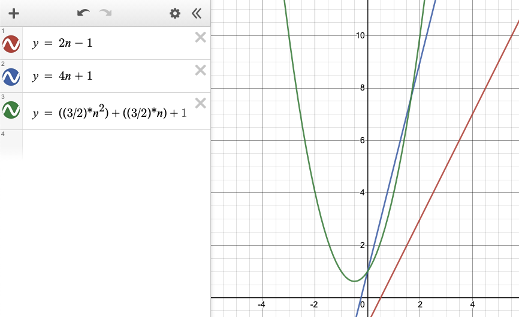
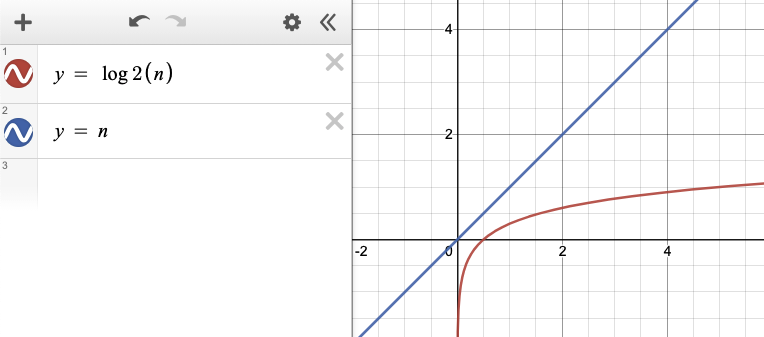
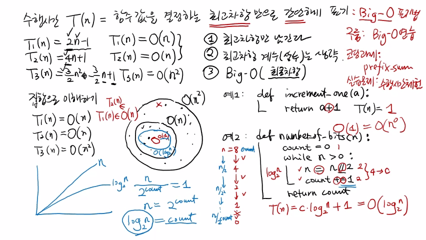

>
해당 포스트는 아래 수업들의 내용을 바탕으로 작성되었습니다.
> - ['자료구조 - Data Structures with Python'](https://www.youtube.com/playlist?list=PLsMufJgu5933ZkBCHS7bQTx0bncjwi4PK)
> - ['알고리즘 - Algorithm with Python'](https://www.youtube.com/playlist?list=PLsMufJgu5932XYejsOwcUDJ2F75f56nrl)
>
\- Youtube :
['Chan-Su Shin'](https://www.youtube.com/channel/UCJ4SXKMLQucqaxt4A6PonwQ)  
\- Professor : 신찬수 교수 (한국 외국어 대학교 컴퓨터 공학부)


# 1. Big-O 표기법

지난 수업의 내용을 간략하게 요약하면 아래와 같다.

## 1-1. 알고리즘의 시간 복잡도

1. 알고리즘의 시간 복잡도 또는 수행 시간을 구하는 방법을 살펴봤다.
   - 알고리즘의 기본 연산을 가장 많이 수행하게끔 하는 최악의 경우를 파악한다.
   - 최악의 경우의 입력에 대해 알고리즘이 수행하는 기본 연산의 횟수를 파악한다.
   - 이렇게 구한 기본 연산의 횟수를 알고리즘의 수행 시간 또는 시간 복잡도라고 한다.
```
알고리즘의 시간 복잡도(수행 시간) = 최악의 경우의 입력에 대한 기본 연산 횟수
```
2. 최악의 경우를 파악하는 방법이 가장 정확한 방법은 아니다.
   - 왜냐하면, 가장 정확한 수행 시간을 측정하는 방법이 있기 때문이다.
   - 모든 입력에 대해 기본 연산 횟수를 파악하여, 그들의 평균을 구한다.
   - 이 평균값이 가장 정확한 알고리즘의 수행 시간이라고 할 수 있다.
3. 하지만, 이 방법은 계산하기에 상당히 복잡하고 현실적으로 어렵다.
   - 때문에, 차선책으로 최악의 경우에 대한 기본 연산 횟수로 수행 시간을 정의한다.
4. 정확한 값을 구할 수는 없지만, 최악의 경우를 파악하는 방법이 좋은 이유가 있다.
   - 기본 연산 횟수는 다른 어떤 입력이 와도, 최악의 경우보다 더 적게 수행된다.
   - 따라서, '알고리즘은 최대 몇 번의 기본 연산만 수행하면 된다' 라고 할 수 있다.  
     `(최악의 경우가 기본 연산을 가장 많이 수행한다는 것은 항상 보장되기 때문)`

## 1-2. Big-O 표기법

이전 수업에서 살펴봤던 알고리즘들을 정리하면 아래와 같다.

```
최악의 경우에 대한 수행 시간은 함수로 표현한다.

x = arrayMax => x(n) = 2n - 1
y = sum1     => y(n) = 4n + 1
z = sum2     => z(n) = ((3 / 2) * n^2) + ((3 / 2) * n) + 1
```

<details><summary>클릭하여, 그래프로 표현된 수행 시간을 살펴보자.</summary>



</details>

### 1-2-1. 대략적인 성능 비교

- x(n)과 y(n)의 차이는 약 2배이므로, y는 x보다 2배 느리다.
- z는 (n < 5 / 3) 이면, y보다 빠르지만, 모든 n에 대해서 x보다 느리다.
- z는 (n > 5 / 3) 이면(n이 특정 값을 넘어가면), **항상 y보다 느리다.**

### 1-2-2. 공통점과 차이점

- x와 y는 n에 대해 선형적으로 함숫값(수행 시간)이 증가한다.
   - x(n)은 n의 2배, y(n)은 n의 4배에 비례해서 증가하기 때문이다.
   - 물론, 1이 빼지거나 더해지는데, 이것은 여기서 중요하지 않다.
   - 그래프에서 직선으로 표현되었듯, n의 값에 대해서 선형적으로 증가한다.
- 반면에, z(n)은 n에 대해 제곱(n^2) 으로 함숫값이 증가한다.
- 이렇게, x와 y의 최고차항과 z의 최고차항은 다르다. `n(1차항) <=> n^2(2차항)`

### 1-2-3. 최고차항과 증가율

- 여기서, 최고차항은 n에 대한 함숫값의 증가율을 결정한다.  
`(n이 커질 때, 함숫값이 얼마나 빠르게 커지는지) = (n -> ∞) => f(n) ↑`
- x(n)과 y(n)은 최고차항이 n(1차항) 으로 같다.  
  `=> n의 값에 비례하게(정비례) 증가한다.`
- 반면에, z(n)은 n^2(2차항) 으로 다르다.  
  `=> n을 1번 더 곱한(n의 제곱) 값에 비례하게 증가한다.`
- 따라서, n이 커지면 제곱의 경우에서 함숫값이 더 빠르게 증가한다.  
  `=> n이 증가할수록 더 많은 기본 연산이 필요해지므로, 더 느리다고 할 수 있다.`

### 1-2-4. 수행 시간의 표기법

- 그래프에서 볼 수 있듯, x(n)과 y(n)은 실제로는 2배 차이가 난다.
- 하지만, 결국 n이 커지면 둘 다 n에 비례하여 증가한다.  
  `=> 증가율의 관점에서 보면, 같은 수행 시간을 가진다고 할 수 있다.`
- 이와 달리, z(n)은 n의 제곱에 비례하기 때문에, 훨씬 더 빨리 증가한다.  
  `=> 따라서, 앞의 둘과의 수행 시간과는 반드시 구별해야 한다.`
- 이러한 아이디어로 알고리즘의 수행 시간을 간단하게 표기하려고 한다.
   - 모든 항을 다 분석해서 구체적인 값을 표현하지 않는다.
   - 대신, 그중에서도 가장 중요한 항인 최고차항을 이용한다.  
   - 이 때, 최고차항은 n에 대한 함숫값의 증가율을 결정한다.  
     `=> 최고차항으로도 수행 시간 함수의 대략적인 형태를 나타낼 수 있다.`

<br>

이렇게 최고차항만으로 수행시간을 표기하는 방법을 **'Big-O 표기법'** 이라고 한다.

<br>

<details><summary>참고 : 실제 교수님 강의 화면 필기 내용</summary>


</details>

# 2. 예시와 함께 살펴보기

## 2-1. Big-O 표기법 추가 정리

```
+ 수행 시간 T(n) = 함숫값을 결정하는 최고차항만으로 간단하게 표기
+ Big-O 는 '대문자 O' 를 가리키며, '빅오' 라고 읽는다.
```

### 2-1-1. 사용하기

위에서 살펴봤던 x(n) = 2n - 1 을 더 간단하게 표현할 수 있다.

- 다른 것은 모두 생략하고, 최고차항만을 표기한다. `x(n) = n`
- 대신에, 이것을 간단하게 표현했다는 것을 어떤 식으로든 알려야 한다.
- 그래서, 대문자 O 를 쓰고, 괄호로 최고차항을 묶는다. `x(n) = O(n)`
- 이 때, x(n) = O(n) 은 '엑스 엔은 빅오 엔이다.' 라고 읽으면 된다.
- 예시 상황은 아래와 같다.
    ```
    Q : 너의 알고리즘의 수행 시간이 얼마냐?
    A : 내 알고리즘은 빅오 엔(O(n)) 이야!
    
    Q 가 이해한 내용
    1. 아, 너의 알고리즘의 수행 시간을 나타내는 함수의 최고차항은 n이구나!
    2. 즉, n이 증가하면 선형적으로 수행 시간이 증가하겠구나! 

    => 이렇게 표현해도 전혀 문제 될 것이 없다.
    ```

### 2-1-2. 비교하기

y(n) = 4n + 1 이므로, 최고차항만 남겨 표기하면 y(n) = O(n) 이 된다.

- 빅오 표기법으로 하면 x와 y의 수행 시간은 같다.
- 세부적으로는 분명히 2배의 차이가 난다.
- 그렇지만, 증가율의 관점에서 보면 큰 문제는 없다.
- 따라서, x와 y는 O(n) 의 수행 시간을 지닌다고 할 수 있다.

<br>

이와 달리, z의 수행 시간은 ((3 / 2) * n^2) + ((3 / 2) * n) + 1 이다.

- 수행 시간의 최고차항만 남겨 표기하면, z(n) = O(n^2) 이 된다.
- 즉, n^2 이 최고차항이므로, n^2에 비례해서 증가하는 알고리즘이다.
- n이 증가할 때, n보다 n^2의 수행 시간이 훨씬 더 빠르게 증가한다.
- 때문에, z는 x와 y보다 훨씬 더 느린(안 좋은) 알고리즘이라 할 수 있다.

### 2-1-3. 표기 방법

1. 최고차항만 남긴다.
2. 최고차항의 계수(상수) 를 생략한다.
3. 빅오(O) 로 최고차항을 감싼다. `O(최고차항)`

## 2-2. 집합으로 이해하기

```
x(n) = O(n)
y(n) = O(n)
z(n) = O(n^2)
```

- x(n)과 y(n)의 수행 시간이 같다. `x(n) = O(n), y(n) = O(n)`
- O(n)을 n에 관한 1차식을 포함하는 집합이라고 생각할 수 있다.
   - 이 때, x(n)과 y(n)이 모두 이 집합에 포함된다.
   - x(n)은 O(n)이라는 이름의 집합의 원소다. `x(n) ∈ O(n)`
   - 여기서 ∈ 기호 대신에 = 기호를 사용하는 것으로 생각하면 된다.
   - y(n)도 마찬가지로 O(n)이라는 이름의 집합의 원소다.
- z(n)은 O(n) 을 포함하는 더 큰 집합 O(n^2) 에 포함되어 있다.
   - O(n^2) 집합은 2차식들을 무한히 많이 모아놓은 집합이다.
   - 당연히, n에 관한 2차식 안에는 1차식도 포함한다.
   - 따라서, O(n) 집합은 O(n^2) 집합에 포함되어 있다고 할 수 있다.

## 2-3. 예시 1

```python
def increment_one(a):
    return a + 1
```

- 더하기 연산을 수행한 후에 값을 반환하는 함수다.
- 이 함수의 수행 시간 t(n) = 1 이 되며, 이 때 최고차항은 n^0 이다.
- O(n^0) = O(1) 이므로, 상수항밖에 없는 함수라고 할 수 있다.

<br>

따라서, t(n) = O(1) 이라고 표현하면 된다.

- O(1)이라는 표현은 수행 시간이 꼭 1이 아니어도 사용할 수 있다.
- 상수 횟수만큼 기본 연산을 수행하는 함수(알고리즘) 면 된다.
- t(n)의 값이 6, 10, 100, .. 처럼 상수인 경우를 예로 들 수 있다.
- 이 때, O(1)의 수행 시간은 '상수 시간' 이라고도 표현한다.

## 2-4. 예시 2

```python
def number_of_bits(n):
    count = 0          <- 1
    while n > 0:       <- 2
        n = n // 2
        count += 1
    return count       <- 3
```

### 2-4-1. 알고리즘 확인

> n이라는 값을 2진수로 표현하는 데 필요한 비트의 개수를 구하는 함수다.

1. 비트 수를 표기하는 count 변수를 초기화한다.
2. n이 0이 아닌 동안, while 문을 반복한다.  
   - n을 반으로 나누면서, count 값을 1씩 증가시킨다.
3. n이 0이 되면, count 값을 반환한다.

### 2-4-2. 수행 시간 파악

> 정확히 계산할 필요는 없지만, 여기선 정확히 계산한다고 친다.

- n = 8 일 때, n의 값은 while 루프마다 절반으로 줄어든다. 
   ```
   n = 8 -> 4 -> 2 -> 1 -> 0
   ```
- 일반적인 n에 대해서, while 루프가 반복되는 횟수는 아래와 같다.
   ```
   8 -> 4 = n / 2^1
   4 -> 2 = n / 2^2
   2 -> 1 = n / 2^3

   (n / 2) -> (n / 2^2) -> .. -> (n / 2^count)
   ```
- while 루프는 n이 1일 때까지만 반복된다.
   ```
   (n / 2^count) = 1
   => n = 2^count
   => log2(n) = count
   ```
- while 루프는 count 의 값, 즉 log2(n) 번 반복된다.
   - 이 때, 루프마다 총 4번의 기본 연산이 수행된다. (대입, 나누기, 덧셈, 대입 연산이 수행된다.)
   - 사실, 빅오 표기법에서 최고차항의 계수는 무시되므로 횟수는 중요하지 않다.
   - 중요한 것은 while 루프에서 수행되는 연산의 횟수가 상수(constant, c) 라는 것이다.
- 이 함수의 기본 연산 수행 횟수는 아래와 같이 표현된다. (맨 앞의 대입 연산 포함)
```
t(n) = (c * log2(n)) + 1
```

### 2-4-3. 수행 시간 표기

(c * log2(n)) + 1 은 빅오 표기법으로 O(log n) 이다.

<details><summary>log2(n) 은 n보다 훨씬 더 천천히 증가하는 함수다.</summary>



</details>

## 2-5. 집합과 함께 살펴보기

- 상수 시간에 수행되는 알고리즘(예시 1) 은 O(1) 집합에 포함된다.  
  `=> 이 때, O(1) 집합은 O(n) 집합에 포함되어 있다.`
- O(log n) 은 O(1) 보다는 느리고, O(n) 보다는 빠르다.  
  `=> 따라서, O(log n) 의 집합은 O(1) 과 O(n) 사이에 있다.`
- 이러한 집합들은 수없이 많은 계층(layer) 들로 구성되어 있다.  
  `=> O(1), O(log n), O(n), O(n^2), .. 등 계속 포함 관계를 가진다.`

이번 수업에서 살펴본 내용들은 아래와 같이 정리된다.

```
어떤 알고리즘이나 자료 구조의 수행 시간에 대해서 표현할 때,  
최고차항만 남겨놓고 빅오 기호로 감싸서 간단하게 표기한다.

반대로, 빅오 괄호 안에 있는 항은 수행 시간의 최고차수를 나타낸다.
```

<br>

<details><summary>참고 : 실제 교수님 강의 화면 필기 내용</summary>



</details>

<br>

- 20210418 - 맞춤법 수정(는 지 -> 는지)
- 20210516 - 포스팅 제목 변경(4. 알고리즘 시간복잡도 BigO -> 5. 알고리즘 - 시간복잡도 BigO)
- 20210516 - 이미지 경로 변경(4. -> 5.)
- 20210727 - 빅오 표기법 로그 시간 표기 수정(O(log2(n)) -> O(log n))
