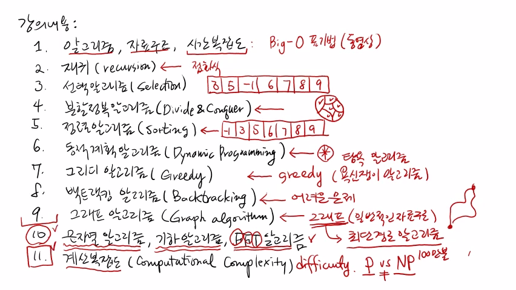

>
해당 포스트는 아래 수업들의 내용을 바탕으로 작성되었습니다.
> - ['자료구조 - Data Structures with Python'](https://www.youtube.com/playlist?list=PLsMufJgu5933ZkBCHS7bQTx0bncjwi4PK)
> - ['알고리즘 - Algorithm with Python'](https://www.youtube.com/playlist?list=PLsMufJgu5932XYejsOwcUDJ2F75f56nrl)
>
\- Youtube :
['Chan-Su Shin'](https://www.youtube.com/channel/UCJ4SXKMLQucqaxt4A6PonwQ)  
\- Professor : 신찬수 교수 (한국 외국어 대학교 컴퓨터 공학부)

# 0. 강의 내용

**<실제 수강생을 대상으로 한 내용은 생략>**

- 파이썬, 구름 에듀 사용법에 대해 간략한 설명
- 프로그래밍 언어 관련 내용은 생활 코딩 참고 권유

# 1. 알고리즘, 자료 구조, 시간 복잡도

> 이전 수업들에서 다뤘던 내용들이다.

- 자료 구조, 알고리즘의 개념과, 서로의 연관성에 대해 설명했다.
- 알고리즘과 자료 구조의 효율성을 따지는 방법에 대해 설명했다.
- 이런 연산의 효율성은 시간이 얼마나 걸리느냐에 따라 결정된다.
   - 따라서, '효율성은 수행 시간으로 결정된다' 고 할 수 있다.
- 수행 시간이 얼마만큼 복잡한지를 나타내는 것이 바로 **'시간 복잡도'** 다.
- 시간 복잡도는 **'가장 안 좋은 경우'** 에 대해 정의하는 것이 일반적이다.
- 시간 복잡도를 표기할 때, 가장 많이 사용되는 것은 **'빅오 표기법'** 이다.

# 2. 재귀(recursion)

- 함수 중에는 자기 자신을 호출하는 **'재귀 함수'** 가 있다.
- 이러한 특징을 활용해 알고리즘 문제를 해결할 수 있다.
- 재귀 알고리즘의 수행 시간은 어떤 점화식의 형태를 띤다.
- 그런 점화식을 전개하면, 그게 바로 시간 복잡도가 된다.

# 3. 선택 알고리즘(selection)

- 최초로 배우는 알고리즘 문제는 선택 알고리즘 문제다.
- 선택 알고리즘 문제의 예를 들자면 아래와 같다.
   - n개의 숫자가 주어진다. `예) 3, 5, -1, 6, 7, 8, 9`
   - 비교 횟수를 최소화하여 가장 큰 수 혹은 3번째로 큰 수를 찾아라.
- 이러한 문제를 어떻게 해결해야 할지를 배우는 것이다.

# 4. 분할 정복 알고리즘(divide & conquer)

- 분할 정복 알고리즘을 간단히 설명하면 아래와 같다.
   - 당장은 풀 수 없을 정도로 큰 문제를 풀어야 한다.
   - 이 때, 큰 문제를 여러 개의 작은 문제로 쪼갠다.
   - 작은 문제들의 답을 모아 원래 문제의 답으로 만든다.
- 큰 문제는 어렵지만, 작은 문제는 비교적 쉽다는 것을 활용한다.
- 굉장히 기본적인 알고리즘 기술 중의 하나이다.

# 5. 정렬 알고리즘(sorting)

- 정렬 알고리즘은 선택 알고리즘과 쌍을 이룬다.
   - 선택 알고리즘과 마찬가지로, n개의 숫자가 무작위로 주어진다.
   - 이 때, 숫자들은 배열이나 리스트를 통해 주어진다.
   - 이 숫자들을 오름차순 또는 내림차순으로 정렬하는 것이다.
   - `예) [3, 5, -1, 6, 7, 8, 9] => [-1, 3, 5, 6, 7, 8, 9]`
- 두 수를 비교해서 서로 자리를 바꾸는 방식을 이용한다.
- 비교 횟수, 자리바꿈 횟수에 따라 효율성이 달라진다.
   - 비교와 자리바꿈의 횟수를 최소화하는 것이 중요하다.
- 가장 기본적인 알고리즘이며, 굉장히 많은 사람이 연구했다.
- 그중에서도, 대표적인 정렬 알고리즘 문제를 살펴볼 것이다.

# 6. 동적 계획 알고리즘(dynamic programming)

- 동적 계획법은 가장 강력한 알고리즘 기술 중 하나다.
- 분할 정복 알고리즘처럼 문제를 작은 문제들로 쪼갠다.
- 작은 문제들의 답을 조합해서 원래 문제의 답을 만든다.
- 많은 문제를 해결할 수 있는 핵심적인 알고리즘 기법이다.

# 7. 그리디 알고리즘(greedy)

- 그리디 알고리즘의 'greedy' 는 '욕심이 많은' 이라는 뜻이다.
- '욕심쟁이 알고리즘', '탐욕 알고리즘' 등으로 번역되기도 한다.
- 굉장히 단순한 기법을 가진 알고리즘이며, 내용 자체는 굉장히 간단하다.
- 하지만, 항상 올바른 답을 내는지를 증명하는 것은 약간 어려울 수 있다.

# 8. 백트래킹 알고리즘(backtracking)

- 답을 찾아서 최대한 많은 경우의 수를 테스트해보는 방법이다.
- 잘 풀리지 않는 어려운 문제들을 백트래킹 문제로 많이 푼다.  
  `(분할 정복, 동적 계획법, 그리디 알고리즘으로 해결되지 않는 경우 등)`

# 9. 그래프 알고리즘(graph algorithm)

- 가장 일반적인 자료 구조인 그래프와 관련된 문제다.
- 굉장히 많은 문제가 존재하며, 역사 또한 깊다.
- 가장 대표적인 문제는 그래프에서 최단 경로를 구하는 문제다.
- 내비게이션에서 최단 경로를 알려주는 것을 예로 들 수 있다.
   - 출발지에서 목적지까지 가는 가장 가까운 길을 알려준다.
   - ⤻ 이렇게 갈 수도 있고, ↷ 이렇게 갈 수도 있을 것이다.
- 이런 문제를 해결하는 방법을 최단 경로 알고리즘이라 한다.
   - 지도가 그래프로 모델링 될 수 있기 때문에, 내비게이션에서 사용할 수 있다.  

> 강의에서는 여기까지의 내용만 다룰 것이다.

# 10. 문자열, 기하, FFT 알고리즘

>
강의 노트에만 포함된 내용이다.  
`(시간 관계상 강의 내용에서 다룰 수 없다.)`

- 문자열 알고리즘
   - 문자 정보가 자주 사용되기 때문에 굉장히 중요하다.
- 기하 알고리즘
   - 점, 선, 면들이 있는 기하 객체들과 관련된 문제를 해결한다.
- FFT 알고리즘
   - 고속 푸리에 변환(fast Fourier transform) 이라고 한다.

> 

# 11. 계산 복잡도(computational complexity)

>
아직 강의 노트에도 포함되어 있지 않은 내용이다.  
`(완성 이후에 제공될 예정이다.)`

- 문제가 얼마나 어려운지(난이도) 를 정리하는 내용이다.
   - 어떤 문제는 다른 문제보다 얼마나 쉬운지, 어려운지
- P vs NP(P-NP 문제) 와 같은 내용을 다룬다.
   - 어떤 문제는 P에 속하고, 어떤 문제는 NP에 속한다.
   - 이 둘이 과연 같을까 다를까
   - 100만 불짜리 공개 문제(밀레니엄 문제) 이다.

 

참고 : 실제 교수님 강의 화면 필기 내용

 

- 20210516 - 포스팅 제목 변경(5. 알고리즘 강의 소개 -> 6. 알고리즘 - 강의 소개)
- 20210516 - 이미지 경로 변경(5. -> 6.)
