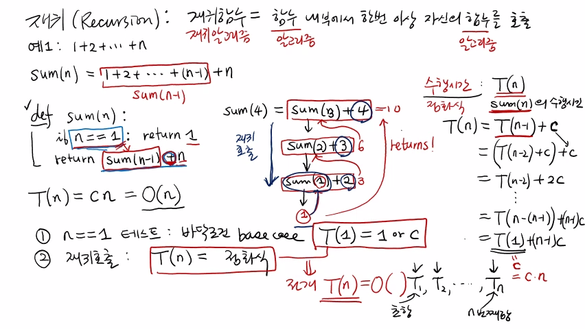
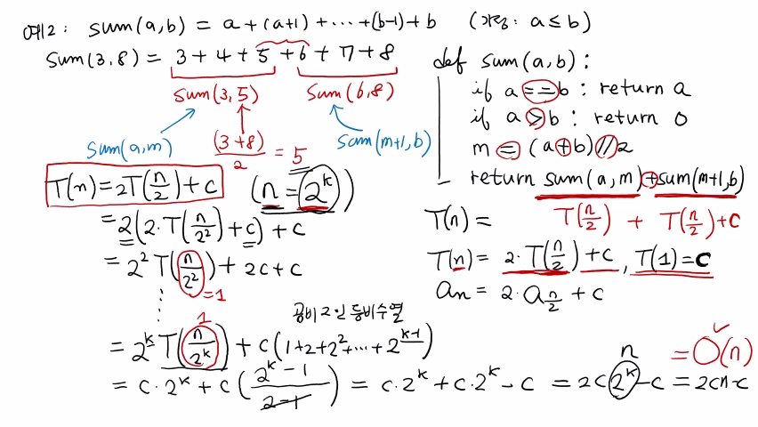
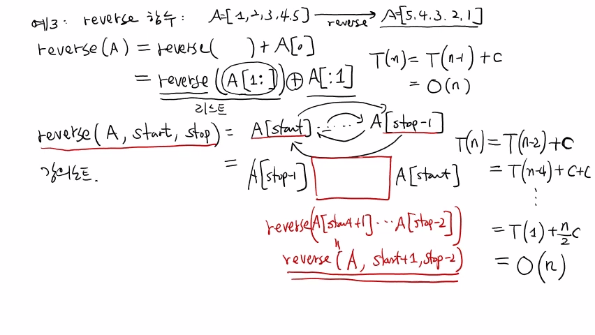

>
해당 포스트는 아래 수업들의 내용을 바탕으로 작성되었습니다.  
> - <a href='https://www.youtube.com/playlist?list=PLsMufJgu5933ZkBCHS7bQTx0bncjwi4PK' target='-blank'>'자료구조 - Data Structures with Python'</a>
> - <a href='https://www.youtube.com/playlist?list=PLsMufJgu5932XYejsOwcUDJ2F75f56nrl' target='-blank'>'알고리즘 - Algorithm with Python'</a>
>
\- Youtube :
<a href='https://www.youtube.com/channel/UCJ4SXKMLQucqaxt4A6PonwQ' target='-blank'>'Chan-Su Shin'</a>  
\- Professor : 신찬수 교수 (한국 외국어 대학교 컴퓨터 공학부)


# 1. 재귀(Recursion)

재귀 함수 또는 재귀 알고리즘에 대해서 살펴보자.

## 1-1. 재귀 함수/알고리즘

> 보통, C, Java, Python 등의 프로그래밍 언어에서 재귀 함수를 지정할 수 있다.

- 어떤 함수 내부에서 한 번 이상 자신(함수) 을 호출하는 함수를 재귀 함수라고 부른다.
- 함수는 입력받은 값을 계산해서 반환(출력) 하므로, 알고리즘과 같다고 볼 수 있다.
   - 입력에 대한 어떤 특정한 출력을 위해서 계산을 하는 것이 알고리즘이기 때문이다.
- 재귀 함수의 설명에 대해 이름만 바꿔, 다시 정리하면 아래와 같다.
> 알고리즘 내부에서 한 번 이상 자신(알고리즘) 을 다시 적용해서 문제를 푸는 것이다.

## 1-2. 예 1)

더 직관적이고 이해하기 쉬운 설명을 위해 예시를 들어볼 것이다.

### 1-2-1. 알고리즘

- 1부터 n까지 더하는 함수 sum(n) 을 재귀 함수로 구현한다.
    ```
    sum(n) = 1 + 2 + .. + (n - 1) + n
    ```
- 여기서, 1부터 (n - 1) 까지 더하는 것은 sum(n - 1) 과 같다.
    ```
    1 + 2 + .. + (n - 2) + (n - 1) = sum(n - 1)
    ```
- 이 때, sum(n - 1) 의 결과에 n을 더하면, sum(n) 이 된다.
    ```
    sum(n) = 1 + 2 + .. + (n - 1) + n
           = 1 + 2 + .. + (n - 2) + (n - 1)
           = sum(n - 1)
    ```

### 1-2-2. 정리

- sum(n) 은 1부터 n까지의 모든 숫자를 더하는 함수다.
- 1부터 (n - 1) 까지의 계산을 수행하기 위해, sum(n - 1) 을 호출할 수 있다.
   - 이는 인자의 값만 바꿔서, 자기 자신을 호출하는 것과 같다.
- sum(n - 1) 에서 계산된 값을 n에 더하면, sum(n) 이 된다.

<br>

즉, sum() 이라는 함수를 위해, sum() 이라는 함수를 한 번 더 호출한 것이다.

> 이 때, 함수에 주어지는 인자의 값은 달라진다.

### 1-2-3. 코드

```python
def sum(n):
   if n == 1: return 1   <- 1
   return sum(n - 1) + n <- 2
```

1. 맨 처음에는 무조건 n이 가장 작은 수(처음수) 인지를 확인해야 한다.
   - n이 1이 들어왔다면, 1부터 1까지의 합을 구해야 하므로 1을 반환하면 된다.
2. 그렇지 않은 경우, 1 + 2 + .. + (n - 1) + n 을 재귀적으로 구한다.
   - 위에서 봤던 재귀 함수식을 그대로 써서 바로 반환하면 된다.
   - sum(n - 1) 을 호출하고, 그 결과와 n을 더해서 반환하는 것이다.

결과적으로, 1부터 n까지 더하는 가장 간단한 형태의 재귀 함수가 된다.

## 1-3. 입력 예시

sum(4) 를 호출한 경우를 살펴보자.

### 1-3-1. 재귀 호출

```
sum(4) = sum(3) + 4 <- 1
sum(3) = sum(2) + 3 <- 2
sum(2) = sum(1) + 2 <- 3
sum(1) = 1          <- 4
```

1. sum(4) 에서 'n == 1' 이 거짓이므로, sum(n - 1) + n 을 반환한다.
   - 이 때, sum(3) 이 계산이 되어야만 sum(4) 의 결과를 얻을 수 있다.
   - 따라서, n의 값을 3으로 하여 sum() 함수를 다시 호출해야 한다.
2. sum(3) 도 마찬가지로 sum(n - 1) + n 을 반환한다.
3. sum(2) 는 sum(1) + 2 가 된다.
4. sum(1) 에서 n은 1이므로, 'n == 1' 이 참이 되어 1을 반환하게 된다.

### 1-3-2. 결과 반환

```
sum(1) = 1

sum(2) = sum(1) + 2 <- 1
       = 1 + 2 = 3
sum(3) = sum(2) + 3 <- 2
       = 3 + 3 = 6 
sum(4) = sum(3) + 4 <- 3
       = 6 + 4 = 10
```

1. sum(1) + 2 는 (1 + 2 = 3) 이 되므로, 3을 반환하게 된다.
2. sum(2) 의 결과는 3이므로, sum(2) + 3 은 (3 + 3 = 6) 이 된다.
3. sum(3) 의 결과는 6이므로, sum(3) + 4 은 (6 + 4 = 10) 이 된다.

### 1-3-3. 정리

- 이런 식으로 호출하는 것을 '재귀 호출(Recursive Call)' 이라고 한다.
- 각 호출의 결과는 재귀 호출이 일어난 반대의 순서로 반환된다.
- 이렇게, 재귀 호출과 결과 반환은 차례대로 진행된다.

## 1-4. 기본 연산 확인

```python
def sum(n):
   if n == 1: return 1   <- 1
   return sum(n - 1) + n <- 2
```

1. n의 값을 1과 비교하여, 바로 1을 반환하거나 sum(n - 1) + n 을 계산한다.
2. sum(n - 1) + n 에서는 sum(n - 1) 이 계산되어야만, n의 값을 더할 수 있다.

따라서, 비교 연산 1번, 더하기 연산 1번으로 총 2번의 기본 연산이 수행된다.

## 1-5. 수행 시간 파악

### 1-5-1. 기본 연산 횟수 파악

- sum(n) 의 수행 시간을 T(n) 이라고 가정한다.
- 비교 연산과 더하기 연산이 수행되는데, 더하기 연산을 위해 sum(n - 1) 을 계산해야 한다.
   - T(n) 은 sum(n) 의 수행 시간이므로, sum(n - 1) 의 수행 시간은 T(n - 1) 이 된다.
- 기본 연산의 횟수는 상수(constant, c) 이므로 값 자체는 중요하지 않다.
```
T(n) = T(n - 1) + c 
```
- 따라서, (1 ~ n) 에 대한 수행 시간은 (1 ~ (n - 1)) 에 대한 수행 시간에 상수를 더한 것과 같다.
   - 이것은 일종의 점화식이며, T(n) 은 무조건 T(n) 에 관한 점화식으로 표현된다는 것을 뜻한다.

### 1-5-2. 점화식 풀이

> 점화식을 푸는 가장 쉬운 방법은 일반적으로 대입을 이용하는 것이다.

```
T(n) = T(n - 1) + c
     = (T(n - 2) + c) + c
     = T(n - 2) + 2c
       ...
     = T(n - (n - 1)) + (n - 1) * c
     = T(1) + (n - 1) * c
```

이러한 형태의 점화식을 수열로 볼 수 있다. ($T_{1}$, $T_{2}$, $T_{3}$, ..,  $T_{n}$)
- 이 때, $T_{1}$ 은 첫 번째 항(초항) 이 되고, $T_{n}$ 은 n번째 항이 된다.
- $T_{1}$ 은 n이 1일 때, $T_{2}$ 은 n이 2일 때 필요한 수행 시간이다.
- $T_{n}$은 일반적인 n에 대해, 1부터 n까지 더하는 데 필요한 수행 시간이다.
- $T_{1}$ 은 1에서 1까지 더하는 데 필요한 상수 시간이므로, T(1) = c 라고 할 수 있다.
    ```
    T(n) = T(1) + (n - 1) + c
         = c + (n - 1) * c
         = c * n
    ```

### 1-5-3. 빅오 표기법

T(n) = c * n 이므로, sum() 함수는 총 (c * n) 번의 기본 연산을 수행한다고 할 수 있다.

- 이 때, c는 상수이고 최고 차항은 n이므로, 이 점화식은 n에 관한 1차 식이 된다.
- 따라서, n의 앞에 있는 상수(c) 를 무시하고 O(n) 이라고 표시할 수 있다.

## 1-6. 정리

sum() 함수는 n에 비례한 만큼의 기본 연산을 수행한다.

- 결국, 더하기를 n번 하는 것과 마찬가지라고 할 수 있다.
- 재귀 호출마다 더하기 연산을 하나씩 수행하기 때문이다.
- 따라서, n번의 덧셈, 즉 O(n) 만큼의 수행 시간이 필요하다.

<br>

재귀 함수는 처음에 항상, n이 1인 경우를 테스트해야 한다.

- 반드시 1이 아니어도 되며, 가장 기본적인 n의 값이면 된다.
- 이러한 기본적인 경우를 '바닥 조건(Base Case)' 이라고 한다.

<br>

바닥 조건의 경우는 값을 반환하고, 아니면 재귀 호출을 하면 된다.

- 바닥 조건의 경우, 수행 시간은 초항이 된다.
   - 보통, 1 또는 상수 c라고 표현한다. (T(1) = 1 or c)
- 재귀 호출의 경우, T(n) 은 T(n) 에 관한 점화식이 된다.
   - 초항을 이용해 점화식을 전개하면, 알고리즘의 수행 시간을 구할 수 있다.
   - 이렇게 구한 수행 시간을 빅오 표기법을 통해 간단하게 표현하는 것이다.

<br>

<details><summary>참고 : 실제 교수님 강의 화면 필기 내용</summary>



</details>

# 2. 예 2)

위에서 살펴본 함수와 아주 약간 다른 함수를 살펴보자.

## 2-1. 알고리즘

1부터 더하는 함수가 아닌, a부터 b까지 더하는 함수다.

```
sum(a, b) = a + (a + 1) + .. + (b - 1) + b
```

- 이 때, a가 b보다 크지 않다(a <= b) 는 것을 자연스럽게 가정할 수 있다.
- 작은 a부터 시작해서, 큰 b까지 1씩 증가시키면서 값을 더하는 것이다.

## 2-2. 입력 예시

```
sum(3, 8) = 3 + 4 + 5 + 6 + 7 + 8
```

앞에서 사용한 방식과 같은 방식으로 풀이할 수 있다.

```
sum(3, 8) = sum(3, 7) + 8
sum(3, 7) = sum(3, 6) + 7
...
```

하지만, 이번에는 반씩 더하는 방법으로 풀이해 볼 것이다.

```
sum(3, 8) = 3 + 4 + 5 + 6 + 7 + 8
            └---┬---┘   └---┬---┘
            sum(3, 5)   sum(3, 5)
```

- (3 ~ 5), (6 ~ 8) 을 각각 더한 후, 그 결과끼리 더하는 방법이다.
   - sum(3, 5), sum(6, 8) 을 각각 계산하면 된다.
- 먼저 주어진 값들의 사이에 있는 중간 값을 구해야 한다.
   - 현재 입력 예시에서는 3과 8의 중간 값인 5와 6에 해당한다.
   - 작은 값(3) 과 큰 값(8) 을 더한 후, 반으로 나눠서 구할 수 있다.
```
(3 + 8) / 2 = 5
```

## 2-3. 코드

```python
def sum(a, b):
    if a == b: return a              <- 1
    if a > b: return 0               <- 2
    m = (a + b) // 2                 <- 3
    return sum(a, m) + sum(m + 1, b) <- 4
```

1. 우선, 바닥 조건을 확인해야 한다.
   - 바닥 조건은 a와 b가 같아서 숫자가 하나밖에 없는 경우다.  
     `a에서 출발해서 a(= b)에서 끝나기 때문`
   - 합은 당연히 a의 값 자체이며, b를 반환해도 상관은 없다.
2. 경우에 따라서는 a가 b보다 클 수도 있다.
   - 기본적인 가정이 어긋나므로, 합 자체가 존재하지 않는다.
   - 따라서, 이런 경우에는 그냥 0을 반환하면 된다.
3. 두 조건문을 모두 만족하지 않는다면, a가 b보다 작다는 뜻이다.
   - 이 때, 중간 값(m) 은 a와 b를 더해 2로 나눈 몫이 된다.
4. 중간을 기준으로 반으로 나눠, 재귀적으로 호출하여 값을 더하면 된다.
   - 이 때, 앞부분은 a에서부터 m까지 더하면 구할 수 있다.
   - 반대로, 뒷부분은 (m + 1) 에서부터 b까지 더하면 구할 수 있다.
   - sum(3, 5) 는 sum(a, m), sum(6, 8) 은 sum(m + 1, b) 에 해당한다.

이렇게 알고리즘을 구성해도 재귀적으로 호출하는 데에는 문제가 없다.

- 앞에서 살펴본 '예 1)' 과 다르게 함수 내에서 자기 자신을 총 2번 호출했다.
- 재귀 함수는 자기 자신을 2번 이상(3번, 4번, ..) 호출해도 문제없이 동작한다.

## 2-4. 수행 시간 파악

### 2-4-1. 기본 연산 횟수 파악

- sum(a, b) 의 수행 시간을 T(n) 이라고 가정한다.
- 재귀 호출을 제외한 기본 연산은 총 6번 수행되어야 한다.
   - 비교(2), 더하기(2), 나누기(1), 대입(1)
- 2번의 재귀 호출을 수행해야 한다. (총 n개의 숫자를 더한다고 가정)
   - sum(a, m), sum(m + 1, b) 의 수행 시간은 모두 T(n / 2) 이다.
- 재귀 호출에 대한 수행 시간과 기본 연산 횟수(상수) 를 합한다.
```
T(n) = T(n / 2) + T(n / 2) + c = T(n) = (2 * T(n / 2)) + c
```
- $a_{n}$ = 2 * $a_{n/2}$ + c 와 같은 점화식 형태로 생각해도 전혀 문제없다.

### 2-4-2. 점화식 풀이

- 초항은 하나의 수만 더하는 경우이며, 상수 시간에 수행된다.
- 계산을 간단히 하기 위해 n을 2의 제곱의 형태(n = 2^k) 라고 가정한다. 
   - 2^3 = 8, 2^4 = 16, .. 등의 값인 경우의 n만 고려하는 것이다.
   - 당연히 n은 2의 제곱의 형태로 나타나지 않을 수도 있다.
   - 하지만, 그런 경우(예: 14) 도 모두 똑같이 해결할 수 있다.

```
T(1) = c

n = 2^k => n / 2^k = 2^k / 2^k = 1

T(n) = (2 * T(n / 2)) + c
     = 2(2 * T(n / 2^2) + c) + c
     = (2^2 * T(n / 2^2)) + (2 * c) + c
       ...
     = (2^k * T(n / 2^k)) + c(1 + 2 + 2^2 + .. + 2^(k - 1))
     = (2^k * T(1)) + c(1 + 2 + 2^2 + .. + 2^(k - 1))
     = (2^k * c) + c(1 + 2 + 2^2 + .. + 2^(k - 1))
---------------------------------------------------------------
     c(1 + 2 + 2^2 + .. + 2^(k - 1)) <- 공비가 2인 등비수열
---------------------------------------------------------------
     = (2^k * c) + c((2^k - 1) / (2 - 1))
     = (c * 2^k) + (c * 2^k) - c
     = ((2 * c) * 2^k) - c
     = ((2 * c) * n) - c
```

### 2-4-3. 빅오 표기법

점화식의 최고 차항만 남겨두면 O(n) 이 된다.

```
((2 * c) * n) - c => O(n)
```

- '예 1)' 과 마찬가지로 '예 2)' 도 O(n) 만큼의 시간이 필요하다.
- 이렇게 재귀 호출을 2번 수행해도, 여전히 수행 시간은 O(n) 이다.

<br>

<details><summary>참고 : 실제 교수님 강의 화면 필기 내용</summary>



</details>

# 3. 예 3)

어떤 문자열이나 리스트에 있는 값을 거꾸로 나열하는 reverse() 함수를 살펴보자.

```
A = [1, 2, 3, 4, 5] -- (reverse) --> [5, 4, 3, 2, 1]
```

- A라는 리스트에 들어있는 원소가 1, 2, 3, 4, 5라고 가정한다.
- A에 있는 값을 거꾸로(5, 4, 3, 2, 1) 나열해서 재배열하는 것이다.

## 3-1. 알고리즘1

맨 앞의 값을 맨 뒤로 옮기는(A[0] 를 맨 뒤로 보내는) 방법이다.

```
reverse(A) => reverse() + A[0]

reverse(A) = reverse(A[1:]) + A[:1]
```

- 0번째 원소를 뺀 나머지 원소를 전부 재귀적으로 reverse() 하면 된다.
   - A[0] 을 뺀 나머지 부분을 리스트의 슬라이싱 연산자로 슬라이스한다.
   - 결과적으로, 0번째를 제외한 나머지 값들이 전부 거꾸로 나열된다.
- 전체 원소를 reverse() 한 결과에 A[0] 를 추가하면 된다.
   - 0번째부터 0번째까지를 나타내는 A[:1] 을 이용해도 된다.
   - 최종적으로, 전체 원소가 reverse() 된 형태가 된다.

<br>

(n - 1) 개의 원소를 재귀적으로 reverse 시키고, 0번째 인자를 연결(concatenation) 시킨다.

```
T(n) = T(n - 1) + c
     = O(n)
```

- 따라서, 수행되는 기본 연산의 횟수는 상수 횟수가 된다.
- 이것은 위에서 살펴본 '예 1)' 과 마찬가지로 O(n) 이 된다.

## 3-2. 알고리즘2

A의 start 부터 stop 바로 전까지 있는 원소들을 서로 거꾸로 나열하는 방법이다.

- (stop - 1) 번째 원소는 맨 앞으로, start 번째 원소는 맨 뒤로, ..
    ```
                                 ┌------------┐
                                 |    ┌--┐    |
                                 |    |  ↓    ↓
    reverse(A, start, stop) = A[start] .. A[stop - 1]
                                 ↑    ↑  |    |
                                 |    └--┘    |
                                 └------------┘
    ```

- A[start] 와 A[stop - 1] 의 위치를 서로 바꾼다.
```
A[start] .. A[stop - 1] => A[stop - 1] .. A[start]
```
- (start + 1) ~ (stop - 2) 의 원소들을 다시 reverse() 하면 된다.
```
reverse(A[start + 1] .. A[stop - 2]) => reverse(A, start + 1, stop - 2)
```

<br>

한 번의 reverse() 마다 원소 2개의 위치가 서로 바뀌며 재귀 호출이 수행된다.

```
T(n) = T(n - 2) + c
     = (T(n - 4)) + c + c
       ...
     = T(1) + (c * (n / 2))
     = O(n)
```
- n의 값은 2씩 줄어들고 c의 값은 1씩 늘어난다.
   - 원소의 개수가 2개 줄어든 상태에 대한 재귀 함수를 호출한다.
   - 원소의 위치를 바꾸기 위해 상수 횟수의 기본 연산이 필요하다.
- 이것은 빅오 표기법으로 O(n) 이라고 표시할 수 있다.

<br>

<details><summary>참고 : 실제 교수님 강의 화면 필기 내용</summary>



</details>

<br>

- 20210516 - 포스팅 제목 변경(6. 재귀(Recursion) -> 7. 알고리즘 - 재귀(Recursion))
