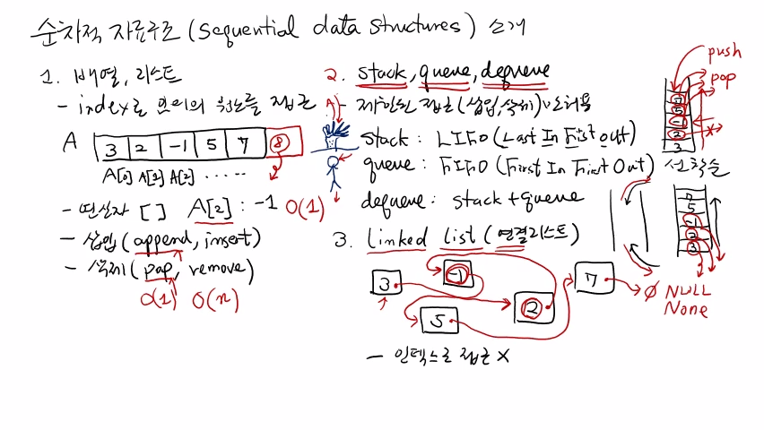
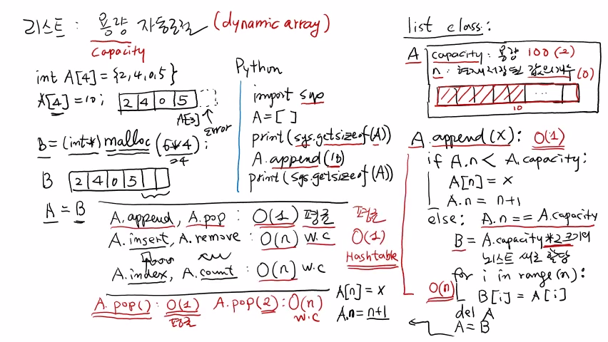

>
해당 포스트는 아래 수업들의 내용을 바탕으로 작성되었습니다.
> - ['자료구조 - Data Structures with Python'](https://www.youtube.com/playlist?list=PLsMufJgu5933ZkBCHS7bQTx0bncjwi4PK)
> - ['알고리즘 - Algorithm with Python'](https://www.youtube.com/playlist?list=PLsMufJgu5932XYejsOwcUDJ2F75f56nrl)
>
\- Youtube :
['Chan-Su Shin'](https://www.youtube.com/channel/UCJ4SXKMLQucqaxt4A6PonwQ)  
\- Professor : 신찬수 교수 (한국 외국어 대학교 컴퓨터 공학부)


# 1. 배열(array) 과 리스트(list)

이번 수업에서는 주제를 바꿔, 여러 자료 구조를 하나씩 구체적으로 살펴볼 것이다.

<br>

첫 번째로 살펴볼 것은 **'배열(array)'** 이라는 가장 기본적인 자료 구조다.

- 여러 개의 값이 연속적으로 저장된 형태의 자료 구조다.
   - 순차적인(sequential) 자료 구조라고도 표현한다.
- C, Java, Python 등의 언어를 배우면서 접할 수 있다.

<br>

파이썬의 경우, 'array' 보다는 **'리스트(list)'** 가 더 자주 사용된다.  
`(실제로, 파이썬에도 array 자료 구조가 있긴 하다.)`

- 이러한 배열과 리스트를 서로 비교하면서 살펴볼 것이다.
- 아주 기본적이지만 가장 많이 사용되므로, 그만큼 중요하다.

## 1-1. C 언어의 배열

### 1-1-1. 개념 정리

C 언어에서 배열을 선언하는 방법부터 살펴보자.

```c
int A[4] = {2, 4, 0, 5};
```

이 코드가 의미하는 바는 아래와 같은 내용으로 정리할 수 있다.

- A라는 배열에 4개의 정수를 저장할 수 있다.
- 각각 2, 4, 0, 5라는 값으로 초기화되어 있다.

<br>

배열의 첫 번째 원소는 A[0] 이고, A[1], A[2], A[3] 의 순서를 가진다.

- 이렇게, 배열의 인덱스(index) 는 0부터 시작한다.

<br>

이 때, 변수 A는 자체적으로 주소 값을 가지고 있다.

- 정수형 정보는 총 4개의 바이트로 구성되어 있으며, 바이트 별로 주소가 있다.
- 이 때, 정수형 정보는 첫 번째 바이트의 주소 값을 자신의 주소 값으로 사용한다.
- 배열 자료 구조의 경우, 첫 번째 원소의 주소 값을 자신의 주소 값으로 사용한다.
- 정리하자면, 변수 A가 가리키는 주소 값은 A[0] 의 첫 번째 바이트의 주소 값이다.
> 예를 들어, A[0] 의 주소 값이 100이면, 변수 A가 가리키는 주소 값도 100이 된다.

### 1-1-2. 예시와 함께 살펴보기

```c
A[2] = A[2] + 1; <- 1

A[2] = 0 + 1;    <- 2
```

1. A[2] 의 값을 읽고, 1을 더해서, 다시 A[2] 에 쓰는 코드다.
2. A[2] 에 있는 값 0에 1을 더한 값으로 A[2] 의 값이 업데이트된다.

<br>

위에 있는 예시 코드의 수행 시간을 파악해보자.

- 읽기, 쓰기, 산술, 대입 연산이 각각 1회씩 수행된다.
- 이들은 모두 기본 연산이므로, 상수 시간 O(1) 이 필요하다.

<br>

이전 수업에서 정리했을 땐, 기본 연산에 읽기/쓰기 연산이 포함되어 있지 않았다.

- 계산의 편의상 비용이 없는 연산이라고 가정했기 때문이다.
- 하지만, 읽기/쓰기 연산도 단위 시간에 수행되는 기본 연산이다.

### 1-1-3. 배열의 읽기/쓰기 연산

이번에는 배열에서 읽기/쓰기 연산이 어떻게 단위 시간에 수행되는지를 알아보자.

> A[2] 의 값에 대한 읽기 연산을 하는 경우라고 가정한다.

<br>

A[2] 의 값을 읽으려면 우선, A[2] 의 주소를 알아야 한다.

- 메모리에 있는 주소로 찾아가서 해당 위치의 값을 읽어올 수 있기 때문이다.
- 이것이 가능한 이유를 정리하면 아래와 같다.
   - 현재, 가상 머신 모델을 사용하고 있다고 가정한다.
   - 그 가상 머신 모델은 임의 접근 기억 장치를 사용한다.
   - 따라서, 주소만 있으면 해당 위치에 있는 값에 직접 접근할 수 있다.

<br>

이번에는 A[2] 의 주소를 계산하는 방법에 대해 알아보자.

- 배열의 앞부분에 있는 A[0], A[1] 의 다음에 A[2] 가 위치한다.
- 이렇게 4바이트씩 차지하는 정수 원소를 2개 건너뛰어야 한다.
- 즉, A[0] 의 주소에 (2 * 4 = 8) 바이트를 더한 값이 A[2] 의 주소다.
- A[0] 의 주소 값을 100이라고 하면, A[2] 의 주소 값은 (100 + 8 = 108) 이 된다.
- 결국, 메모리 주소 108에서 4바이트를 연속으로 읽어, A[2] 의 값을 얻을 수 있다.

<br>

주소 값을 계산하기 위해 수행된 기본 연산의 횟수를 정리해보자.

- 더하기 연산 1회, 곱하기 연산 1회, 총 2번의 연산을 수행했다.
- 이 때, 이러한 기본 연산들은 모두 단위 시간 내에 수행된다.
- 따라서, 상수 시간 내에 A[2] 의 주소를 읽고, 값을 읽어올 수 있다.

이렇게 모든 시간을 합쳐도 상수 시간이므로, 단위 시간 내에 수행된다고 할 수 있다.

> C 와 Java 는 배열에 대한 읽기와 쓰기를 기본 연산으로 제공한다.


### 1-1-4. 정리

- A[1], A[2] 의 1, 2처럼 원소의 위치를 나타내는 값을 보통 인덱스라고 부른다.
- 인덱스를 이용해 어떤 배열의 특정 위치에 있는 값을 상수 시간 내에 읽고 쓸 수 있다.
- 위와 같은 2개의 기본 연산을 제공하는 자료 구조를 통틀어서 배열이라고 한다.

## 1-2. 파이썬의 리스트

### 1-2-1. 개념 정리

파이썬에는 C, Java 의 배열과 유사한 자료 구조인 리스트가 있다.

- 배열과 마찬가지로 인덱스를 통해서 값에 접근할 수 있다.
- C 언어의 배열보다, 훨씬 더 다양한 종류의 연산을 제공한다.
   - 이러한 연산들은 C 언어에서 제공하는 것보다 더 강력하고 유연하다.
- 그래서, 파이썬으로 코딩할 때는 리스트를 엄청나게 많이 사용하게 된다.
   - 따라서, 리스트의 장단점을 잘 이해하고 사용해야, 효율적인 코드를 구성할 수 있다.
- 여러 원소의 값을 나열하고 대괄호로 묶으면, 그것이 하나의 리스트가 된다.
```python
A = [2, 4, 0, 5] 
```

### 1-2-2. 배열과 비교하기

배열과 리스트의 결정적인 차이점을 정리하면 아래와 같다.

```
[2, 4, 0, 5]
 |  └┐ └-┐└--┐
 ↓   ↓   ↓   ↓
[2] [4] [0] [5]
```

- 인덱스를 이용해 원소에 접근한다는 것은 같지만, 각 원소에는 실제 값이 저장되어 있지 않다.
- 실제 값은 다른 메모리 위치에 따로 저장되어 있으며, 그러한 값들은 객체(object) 로 취급된다.
- 그리고, 리스트의 원소는 해당 객체가 저장된 곳의 주소를 가리킨다.
   - A[0] = 2 는, A[0] 이 2가 저장된 곳의 주소를 가리킨다는 것을 의미한다.

<br>

배열에서 살펴봤던 예시처럼 A[2] 에 있는 값에 2를 더한다고 가정해보자.

```python
A[2] = A[2] + 1
```

- A[2] 는 0이므로, 위의 코드는 0에 1을 더하는 것과 같다.
- 여기서 주의할 것은, 객체 0의 값이 1로 바뀌는 것이 아니라는 것이다.
- 0은 그대로 있고, A[2] 가 (0 + 1 = 1) 이라는 객체를 가리키게 된다.
   - 기존의 0이라는 값을 가진 객체는 어딘가에 그대로 존재한다.
   - 해당 객체의 값에 1을 더한 값을 가지는 새로운 객체가 만들어진다.
   - A[2] 는 이렇게 생성된 객체의 주소를 가리키게 되는 것이다.

이러한 차이에 대한 이해는 이후에 엄청나게 중요해진다.

> 파이썬에서 제공하는 자료 구조들을 이해하는 데에 크고 중요한 열쇠가 되기 때문이다.

### 1-2-3. 제공하는 연산들

<details><summary>append() : 리스트의 맨 뒤에 새로운 값을 삽입(insert) 하는 연산이다.</summary>

위에서 살펴본 배열에 대해 A.append(6) 을 한다고 가정해보자.

```
A = [2, 4, 0, 5] => [2, 4, 0, 5, 6]
```

- 맨 뒤인 A[3] 의 바로 다음 위치인 A[4] 에 6을 집어넣는다.
- 이 때, A[4] 에 6이라는 값이 바로 들어가는 것이 아니다.
- A[4] 는 어딘가에 저장이 된 6이라는 객체를 가리킨다.

</details>

<details><summary>pop() : append() 와는 반대로 특정 값을 삭제(delete) 하는 연산이다.</summary>

A.pop() 처럼 아무런 인자가 주어지지 않으면, 맨 뒤의 값을 제거하고 반환한다.

```
A = [2, 4, 0, 5, 6] => [2, 4, 0, 5]
```

- 위에서 append() 된 6이 반환되고, 6을 가리키던 A[4] 의 연결은 끊긴다.
   - 즉, A[4] 는 아무것도 저장되어 있지 않은 상태가 된다.

<hr>

A.pop(1) 처럼 인자를 주는 경우에는, 해당 인덱스의 값을 제거하고 반환한다.

```
A = [2, 4, 0, 5] => [2, 0, 5]
```

- A[1] 을 제거했을 때, A는 아래와 같은 순서로 변한다.
```
[2, 0, 5,  ]
 |  └┐ └-┐└--┐
 ↓   ↓   ↓   ↓
[2] [0] [5]  x
```
   - A[0] 은 여전히 객체 2의 주소를 가리키고, A[1] 은 더는 4를 가리키지 않게 된다.
   - A[1] 이 가리키던 값이 없어지면서, A[2] 가 가리키던 값 0을 A[1] 이 대신 가리키게 된다.
   - A[2] 도 A[3] 이 가리키던 값 5를 대신 가리키게 되고, A[3] 은 아무것도 가리키지 않게 된다.
- 이렇게 특정한 위치에 있던 값이 pop() 되면, 그 뒤에 있는 값들이 한 칸씩 빈 곳을 메꾸게 된다.

</details>

<br>

- append() 와 pop() 은 리스트에서 제공하는 아주 기본적인 삽입/삭제 연산이다.
- C 언어에서는 이러한 연산을 지원하지 않으므로, 함수를 직접 구현해야 한다.
> 새 원소를 끝에 삽입하거나, 끝이나 중간에 있는 값을 제거하는 등

<br>

파이썬의 리스트는 이외에도 다른 삽입/삭제 연산을 제공한다.

<details><summary>insert() : 인자로 받은 특정한 인덱스에 특정한 값을 삽입하는 연산이다.</summary>

A.insert(1, 10) 을 예시로 살펴보자.

```
A = [2, 0, 5] => [2, 10, 0, 5]
```

- A.insert(1, 10) 은 A[1] 에, 10을 삽입하라는 것을 의미한다.
- 그러나, 현재 A[1] 은 다른 값을 가리키고 있는 상태다.
- 따라서, A[1] 과 그 뒤에 있는 값들이 한 칸씩 밀려나게 된다.
- 그러면, A[1] 이 가리키는 값이 없어지면서, 10을 저장할 수 있게 된다.

</details>

<details><summary>remove() : 인자로 받은 값을 리스트의 앞부터 찾아, 삭제하는 연산이다.</summary>

A.remove(value) 처럼 어떤 값을 인자로 줘서 사용할 수 있다.

- A에서 value에 해당하는 값들을 찾고, 그 중 첫 번째 value 를 제거한다.
- 빈 인덱스가 생기면, 그 뒤에 있는 값들이 한 칸씩 빈 곳을 메꾸게 된다.

</details>

<br>

이외에도, index() 와 count() 연산을 제공한다.

- index() 는 A.index(value) 형태로 사용할 수 있다.
   - 어떤 값(value) 을 주면, 앞에서부터 value 값을 찾는다.
   - 그 값이 처음으로 등장한 위치의 인덱스를 반환한다.
- count() 는 A.count(value) 형태로 사용할 수 있다.
   - 어떤 값(value) 을 주면, 앞에서부터 value 의 개수를 센다.
   - 해당 값이 리스트에 몇 번 등장하는지, 그 횟수를 반환한다.

<br>

### 1-2-3. 정리

- C 언어의 배열은 연산이 읽기와 쓰기밖에 제공되지 않는다.
- 파이썬의 리스트는 읽기/쓰기 뿐만 아니라, 다양한 연산들을 제공한다.
- 따라서, 파이썬의 리스트가 훨씬 더 높은 편의성을 지닌다.

<br>

<details><summary>참고 : 실제 교수님 강의 화면 필기 내용</summary>



</details>

# 2. 파이썬의 리스트

## 2-1. 용량 자동 조절

배열과는 다르게 리스트만이 가지는 또 다른 특징이 있다.

- 리스트는 내부적인 규칙에 따라 자신의 용량을 자동으로 조절한다.
- 여기서 용량(capacity) 은 몇 개의 값을 저장할 수 있는지를 나타낸다.

<br>

리스트가 처음에 2개의 값을 저장할 수 있는 메모리만 할당받았다고 가정한다.

- 이 때, append() 가 3번 수행되면, 3번째 값을 저장할 공간이 없다.
- 하지만, 이렇게 공간이 모자라면, 더 큰 용량을 할당하여 값을 저장할 수 있다.
- 또는, pop() 이 여러 번 수행되어, 리스트에 빈 공간이 생기기도 한다.
- 큰 용량을 유지할 필요가 없으므로, 더 작은 용량을 할당받아 리스트를 유지할 수 있다.

<br>

이렇게 자동으로 용량을 조절하는 배열을 '동적 배열(dynamic array)' 라고 부른다.

- C 언어의 경우, 동적 배열을 지원하지 않는다.
- 파이썬의 리스트는 기본적으로 동적 배열이다.

## 2-2. C 언어의 메모리 할당

### 2-2-1. 예시

2, 4, 0, 5의 원소로 구성된 A가 있을 때, A[4] 에 10을 삽입한다고 가정해보자.

```c
int A[4] = {2, 4, 0, 5};

A[4] = 10;
```

- 배열 A에는 4개의 정수만을 위한 메모리가 할당된 상태다.
- A[4] 는 맨 마지막 원소에 해당하는 A[3] 의 바로 다음 위치다.
- 하지만, A[4] 는 배열 A에 할당된 메모리 영역이 아니다.
- 따라서, A의 영역이 아닌 곳에 10을 저장하라는 문장이 된다.
- 이것은 허락받지 않은 메모리를 침범하는 것이므로 에러를 일으킨다.

### 2-2-2. 메모리 할당

따라서, 더 큰 용량이 필요한 경우, 프로그래머가 코드상에서 제어해야 하는데,  
이 때, '메모리 할당(memory allocation)' 을 뜻하는 malloc() 이라는 함수를 사용할 수 있다.

```c
B = (int *)malloc(6 * 4);
```


- 예를 들어, 정수형 정보를 6개 저장하기 위해선 총 24바이트의 저장 공간이 필요하다.
- 24바이트에 해당하는 메모리를 연속적으로 할당하여, 그 시작 주소를 B로 반환한다.
- B는 6개의 공간을 가진 배열이 되므로, A에 있는 2, 4, 0, 5를 모두 복사한다.
```
A { [2][4][0][5] } ↴ 
B { [ ][ ][ ][ ][ ][ ] } => B { [2][4][0][5][ ][ ] }
```
- 이렇게 되면, 배열 B에는 2개의 정수를 더 받아들일 수 있는 공간이 생긴다.
- 마지막으로, 변수 A가 새로 생긴 배열 B를 가리키도록 하면 된다.
```c
A = B;
```

<br>

이것은 A가 4개의 방이 있는 집에서 6개의 방이 있는 더 큰 집으로 이사하는 것과 같다.

- 여기서, B는 임시로 사용하는 배열의 이름이다.
- 6개의 공간을 할당받은 B를 A에 할당하는 것이다.
- 따라서, A는 더 큰 용량을 갖는 새로운 배열이 된다.
- 기존에 A에 있던 값을 B로 옮길 때도 연산이 수행되어 비용이 든다.
   - 이와 관련된 내용은 나중에 더 다뤄볼 것이다.

### 2-2-3. 정리

- C 언어에서는 배열을 선언할 때, 항상 크기를 정해야 한다.
- 더 크거나 더 작은 배열이 필요하면, 프로그래머가 직접 조정해야 한다.
- 이 때, malloc(), calloc() 같은 할당 함수를 사용할 수 있다.

## 2-3. 파이썬의 메모리 할당

반면에, 파이썬에서는 메모리 할당이 자동으로 이뤄진다.

```python
import sys # module               <- 1
A = [] # empty list               <- 2
print(sys.getsizeof(A)) # 28bytes <- 3
A.append(10) # A = [10]           <- 4
print(sys.getsizeof(A)) # 44byte  <- 5
```

1. sys 라고 하는 시스템 모듈을 import 한다.
2. A는 아무런 값이 저장되어 있지 않은 빈 리스트다.
3. sys 모듈의 getsizeof() 함수를 호출한다.
   - A가 실제로 차지하는 메모리의 바이트 수를 반환한다.
      - C 언어의 sizeof() 함수와 똑같은 함수다.
   - 빈 리스트가 얼마만큼의 용량을 차지하는지 확인할 수 있다.
   - 이 때, A는 빈 리스트지만, 0이 아닌 28이 반환된다.  
   > 컴퓨터나 운영 체제마다 다른 값이 나올 수 있다.
4. 10이라는 값을 append() 한다.
   - A는 10이란 값이 저장된 리스트가 된다.
   - 값을 저장하기 위해 메모리를 사용하게 된다.
5. 다시 print() 를 해본다.
   - 28바이트는 1개의 숫자를 저장하기에 충분하다.
   - 하지만, A의 크기는 44바이트로 늘어난다.
   - 파이썬의 규칙에 따라 정해지므로, 원인은 알 수 없다.

이렇게 파이썬은 메모리가 부족하면 늘리고, 남으면 줄이는 것을 시시때때로 한다.

## 2-4. 좀 더 자세히 알아보기

- 파이썬에서 리스트는 단순한 자료 구조가 아니라, 클래스(class) 다.
- 용량 자동 조절 기능을 구현하기 위해, 내부적으로 여러 정보를 관리한다.

### 2-4-1. 추상적인 예시

A라는 리스트가 있다고 가정한다.

- 리스트 A에는 실제 값이 저장되는 배열 형태의 영역이 있다.
- 하지만, 내부에는 그 외에도 부가적인 변수들이 포함되어 있다.
- 하나는 용량(capacity), 현재 리스트에 있는 빈 공간의 수다.
   - 100개의 빈 공간이 있다는 것은 용량이 100이라는 것을 의미한다.
   - 초기값이 2라고 가정하면, 리스트에 2개의 값만 저장할 수 있다.
   - append() 가 계속 수행되면, 용량도 함께 증가하게 된다.
- n은 현재 A에 저장된 값의 개수다.
   - 리스트에 10개의 값이 있다면, n은 10이 된다.
   - 용량이 100이면, n의 값은 100보다 작아야 한다.
   - 빈 리스트에서 시작하면, n의 초기값은 0이다.
- 용량의 값은 n보다 작아지면 늘어나고, 아니면 변하지 않는다.
- 반대로 n의 값은 용량의 값이 변해도 영향을 받지 않는다.

### 2-4-2. 함수 살펴보기

A.append(x) 의 내부적인 동작 방식과 개념에 대해 간단하게 살펴보자.

```python
A.append(x) : 
    if A.n < A.capacity:      <- 1
        A[n] = x              <- 2
        A.n = n + 1           <- 3
    else: # A.n == A.capacity <- 4
        B = A.capacity * 2    <- 5
        for i in range(n):    <- 6
            B[i] = A[i]       <- 7
        del A                 <- 8
        A = B                 <- 9
        A[n] = x              <- 10
        A.n = n + 1           <- 11
```

1. A에 저장된 값의 개수 n과, A의 용량을 비교한다.
   - 이 때, 'n < capacity' 은 여유 공간이 있다는 것을 뜻한다.
2. 만약 그렇다면, A[n] 의 위치에 x를 삽입하면 된다.
3. 값이 삽입되었으니, n의 값을 증가시키면 된다.
4. 저장된 값의 개수가 용량과 같은 상황이 된다.
   - 이것은 리스트의 용량이 가득 차있다는 것을 의미한다.
   - 따라서, 기존보다 더 큰 용량을 할당받아야 한다.
5. C 언어와 마찬가지로, 새로운 임시 리스트 B를 만든다.
   - 기존 용량의 2배 크기의 리스트를 새로 만든다.
6. A에 있는 값들을 모두 B로 옮기기 위해 반복문을 사용한다.
   - for 루프를 n의 범위에 대해 수행한다.
7. A에 저장된 값들을 전부 새로운 배열 B로 옮긴다.
   - 이 때, 수행되는 기본 연산에 대한 비용은 O(n) 이다.
   - 왜냐하면, A[i] 를 B[i] 로 n번만큼 대입하기 때문이다.
8. 이제, 기존에 사용되던 A는 삭제해야 한다.
9. 변수 A에 값이 모두 옮겨진 새로운 배열 B를 할당하면 된다.
   - 이것은 B라는 더 큰 리스트의 이름을 A로 바꾸는 것과 같다.
10. 이제 공간이 충분하므로, A[n] 의 위치에 x를 삽입하면 된다.
11. 마지막으로, 값이 삽입되었으니, n의 값을 증가시키면 된다.

<br>

<details><summary>참고 : 실제 교수님 강의 화면 필기 내용</summary>

- 강의 노트의 일부 내용은 강의 영상에서 생략되었습니다. `(분량 조절 실패! ㅋㅋ)`



</details>

<br>

- 20210516 - 포스팅 제목 변경(7. 순차적 자료 구조 - 배열과 리스트 -> 8. 자료 구조 - 순차적 자료 구조 | 배열과 리스트)
- 20210516 - 이미지 경로 변경(7. -> 8.)
