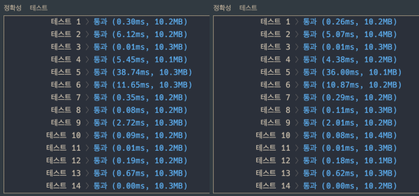
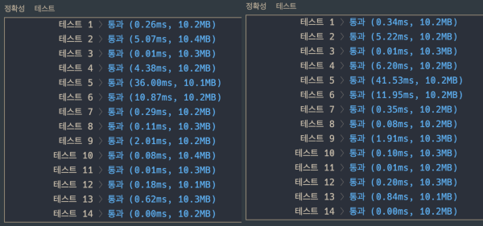
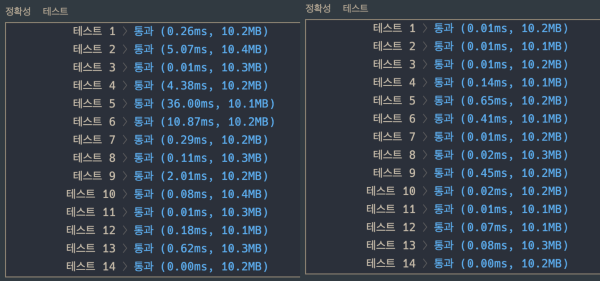

## 문제 확인

<details><summary>펼쳐보기</summary>

### 문제 설명

트럭 여러 대가 강을 가로지르는 일 차선 다리를 정해진 순으로 건너려 합니다. 모든 트럭이 다리를 건너려면 최소 몇 초가 걸리는지 알아내야 합니다. 트럭은 1초에 1만큼 움직이며, 다리 길이는 bridge_length이고 다리는 무게 weight까지 견딥니다.

※ 트럭이 다리에 완전히 오르지 않은 경우, 이 트럭의 무게는 고려하지 않습니다.

예를 들어, 길이가 2이고 10kg 무게를 견디는 다리가 있습니다. 무게가 [7, 4, 5, 6]kg인 트럭이 순서대로 최단 시간 안에 다리를 건너려면 다음과 같이 건너야 합니다.

| 경과 시간 | 다리를 지난 트럭 | 다리를 건너는 트럭 | 대기 트럭 |
|-|-|-|-|
| 0 | [] | [] | [7,4,5,6] |
| 1~2 | [] | [7] | [4,5,6] |
| 3 | [7] | [4] | [5,6] |
| 4 | [7] | [4,5] | [6] |
| 5 | [7,4] | [5] | [6] |
| 6~7 | [7,4,5] | [6] | [] |
| 8 | [7,4,5,6] | [] | [] |

따라서, 모든 트럭이 다리를 지나려면 최소 8초가 걸립니다.

solution 함수의 매개변수로 다리 길이 bridge\_length, 다리가 견딜 수 있는 무게 weight, 트럭별 무게 truck\_weights가 주어집니다. 이때 모든 트럭이 다리를 건너려면 최소 몇 초가 걸리는지 return 하도록 solution 함수를 완성하세요.

### 제한 조건

- bridge_length는 1 이상 10,000 이하입니다.
- weight는 1 이상 10,000 이하입니다.
- truck_weights의 길이는 1 이상 10,000 이하입니다.
- 모든 트럭의 무게는 1 이상 weight 이하입니다.

### 입출력 예

| bridge_length | weight | truck_weights | return |
|-|-|-|-|
| 2 | 10 | [7,4,5,6] | 8 |
| 100 | 100 | [10] | 101 |
| 100 | 100 | [10,10,10,10,10,10,10,10,10,10] | 110 |

※ 공지 - 2020년 4월 06일 테스트케이스가 추가되었습니다.

### 제공하는 소스 코드

```python
def solution(bridge_length, weight, truck_weights):
    answer = 0
    return answer
```

출처 :
['프로그래머스'](https://programmers.co.kr/learn/courses/30/lessons/42583)

</details>

## 접근

다리에 먼저 올라간 트럭이 먼저 건너가야 하기 때문에, 큐(Queue) 가 필요하다고 생각했다.  
`(터널처럼 먼저 들어간 것이 먼저 나간다는 것이 큐(Queue) 의 특징이다.)`

조건

- 정해진 무게 이상으로는 다리에 올라갈 수 없다.
- 트럭이 이동할 때마다 시간 변수의 값이 1씩 증가한다.
- 트럭이 모두 건너는데에 필요한 시간을 구해야 한다.

<br>

<details><summary>처음에는 모든 과정을 수행하지 않고 답을 구하는 방법에 대해 생각해봤다.</summary>

- 트럭들이 한 번에 다리를 지나갈 때 걸리는 시간은 (다리 길이 + 트럭 수) 이다.
- 가능한 많은 수의 트럭이 한 번에 다리를 지나가면 계산 횟수가 줄어들 것이다.
- 해결 아이디어의 내용을 코드로 구현하기 위해 내용을 정리해봤다.

방법

1. (다리 길이) 값으로 시간 변수를 선언한다.
2. 다리 큐에 가능한 만큼 트럭을 넣는다.
3. 시간 변수에 다리에 올라가 있는 트럭의 수를 더한다.
4. 모든 트럭을 다리 큐에서 뺀다.
6. 가장 앞에 있는 트럭부터 차례대로 반복한다.

하지만, 이 방법은 맨 앞의 트럭이 다리를 건넌 후에,  
다른 트럭이 올라오는 경우를 계산하기에 부적합했다.

</details>

<details><summary>다음으로는 모든 과정을 효율적으로 수행하는 방법에 대해 고민해봤다.</summary>

- 다리가 견딜 수 있는 무게보다 작다면, 최대한 많은 트럭을 다리에 올려야 한다.
- 다리 위에 올라간 시간 + 다리의 길이로 도착 예정 시간을 구할 수 있다.
- 트럭이 다리를 완전히 건너는 시간은 도착 예정 시간 + 1 이다.
- 따라서, 마지막 트럭의 도착 예정 시간에 1을 더하면 답을 구할 수 있다.

방법

1. 시간 변수, 다리 큐, 도착 시간 배열 선언한다.
2. 대기 중인 트럭이 없어질 때까지 작동하는 반복문을 추가한다.
3. 맨 앞의 트럭이 다리를 지나갔다면 다리 큐를 최신화한다.
   - 도착 시간과 현재 시간을 비교하여 처리한다.
4. 다음 트럭이 다리에 올라갈 수 있다면 다리 큐와 도착 시간 배열을 최신화 한다.
   - 다리 큐에 포함된 값과 다음 트럭의 무게 값을 합한 후에  
     다리가 버틸 수 있는 최대 무게와 비교하여 처리한다.
5. 반복문이 1번 수행될 때마다 시간을 1씩 증가시킨다.
6. 반복문이 종료되면, 도착 시간 배열의 마지막 값에 1을 더해 반환한다.

</details>

## 검색

별도의 검색은 하지 않았다.

## 풀이

<details><summary>1. 주어진 소스 코드에 docstring 을 추가했다.</summary>

```python
def solution(bridge_length, weight, truck_weights):
    '''
    input
        - bridge_length : 다리의 길이 (1 <= i <= 10000)
        - weight        : 다리가 견딜 수 있는 무게 (1 <= i <= 10000)
        - truck_weights : [트럭의 무게] (1 <= [] <= 10000, 1 <= truck <= weight)
    output
        - answer        : 모든 트럭이 다리를 건너는데 걸리는 최소 시간
    '''
    answer = 0
    return answer
```

</details>

<details><summary>2. 동작에 필요한 변수들을 선언했다.</summary>

- 시간 변수, 다리 큐, 도착 시간 배열을 선언했다.

```python
def solution(bridge_length, weight, truck_weights):
    '''
    input
        - bridge_length : 다리의 길이 (1 <= i <= 10000)
        - weight        : 다리가 견딜 수 있는 무게 (1 <= i <= 10000)
        - truck_weights : [트럭의 무게] (1 <= [] <= 10000, 1 <= truck <= weight)
    output
        - answer        : 모든 트럭이 다리를 건너는데 걸리는 최소 시간
    '''
    time = 0
    bridge = []
    arrival = []
```

</details>

<details><summary>3. 트럭들이 다리를 지나가도록 반복문을 구성했다.</summary>

- 대기 중인 트럭이 있는 동안만 동작한다.
- 트럭이 도착한 시간에 다리에서 트럭을 뺀다.
- 다음 트럭이 다리에 올라갈 수 있다면 트럭을 올린다.

```python
def solution(bridge_length, weight, truck_weights):
    '''
    input
        - bridge_length : 다리의 길이 (1 <= i <= 10000)
        - weight        : 다리가 견딜 수 있는 무게 (1 <= i <= 10000)
        - truck_weights : [트럭의 무게] (1 <= [] <= 10000, 1 <= truck <= weight)
    output
        - answer        : 모든 트럭이 다리를 건너는데 걸리는 최소 시간
    '''
    time = 0
    bridge = []
    arrival = []

    while truck_weights:
        truck = truck_weights[0]

        if arrival and time == arrival[0]:
            bridge.pop(0)
            arrival.pop(0)

        if sum(bridge) + truck <= weight:
            bridge.append(truck_weights.pop(0))
            arrival.append(time + bridge_length)

        time += 1
```

</details>

<details><summary>4. 마지막 트럭이 다리를 건너는 시간을 반환한다.</summary>

```python
def solution(bridge_length, weight, truck_weights):
    '''
    input
        - bridge_length : 다리의 길이 (1 <= i <= 10000)
        - weight        : 다리가 견딜 수 있는 무게 (1 <= i <= 10000)
        - truck_weights : [트럭의 무게] (1 <= [] <= 10000, 1 <= truck <= weight)
    output
        - answer        : 모든 트럭이 다리를 건너는데 걸리는 최소 시간
    '''
    time = 0
    bridge = []
    arrival = []

    while truck_weights:
        truck = truck_weights[0]

        if arrival and time == arrival[0]:
            bridge.pop(0)
            arrival.pop(0)

        if sum(bridge) + truck <= weight:
            bridge.append(truck_weights.pop(0))
            arrival.append(time + bridge_length)

    return arrival[-1] + 1
```

</details>

<br>

<details><summary>참고 : 반복문의 첫 동작을 생략할 수 있다.</summary>

- 첫 트럭이 이동한 시점의 값으로 변수를 선언하면 된다.

<details><summary>결과 비교하기</summary>

- 모든 과정을 반복하는 것이 왼쪽, 첫 번째 동작을 생략한 것이 오른쪽이다.



</details>

```python
def solution(bridge_length, weight, truck_weights):
    '''
    input
        - bridge_length : 다리의 길이 (1 <= i <= 10000)
        - weight        : 다리가 견딜 수 있는 무게 (1 <= i <= 10000)
        - truck_weights : [트럭의 무게] (1 <= [] <= 10000, 1 <= truck <= weight)
    output
        - answer        : 모든 트럭이 다리를 건너는데 걸리는 최소 시간
    '''
    time = 1
    truck = truck_weights.pop(0)
    bridge = [truck]
    arrival = [bridge_length]
    on_bridge = truck

    while truck_weights:
        truck = truck_weights[0]

        if time == arrival[0]:
            on_bridge -= bridge.pop(0)
            arrival.pop(0)

        if on_bridge + truck <= weight:
            on_bridge += truck
            bridge.append(truck_weights.pop(0))
            arrival.append(time + bridge_length)

        time += 1

    return arrival[-1] + 1
```

</details>

<details><summary>추가 : 도착시간 배열을 생성하지 않아도 된다.</summary>

- 다리 큐에 트럭 무게 대신에 (트럭 무게, 도착 시간) 을 넣으면 된다.

<details><summary>결과 비교하기</summary>

- 코드의 줄 수가 조금 줄어들지만, 성능 상의 이점은 거의 없다.  
  `(오른쪽이 도착 시간 배열을 없앤 경우다.)`



</details>

```python
def solution(bridge_length, weight, truck_weights):
    '''
    input
        - bridge_length : 다리의 길이 (1 <= i <= 10000)
        - weight        : 다리가 견딜 수 있는 무게 (1 <= i <= 10000)
        - truck_weights : [트럭의 무게] (1 <= [] <= 10000, 1 <= truck <= weight)
    output
        - answer        : 모든 트럭이 다리를 건너는데 걸리는 최소 시간
    '''
    time = 1
    truck = truck_weights.pop(0)
    bridge = [(truck, bridge_length)]
    on_bridge = truck

    while truck_weights:
        truck = truck_weights[0]

        if time == bridge[0][1]:
            on_bridge -= bridge.pop(0)[0]

        if on_bridge + truck <= weight:
            on_bridge += truck
            bridge.append((
                truck_weights.pop(0),
                time + bridge_length))

        time += 1

    return bridge[-1][1] + 1
```

</details>

<details><summary>추가 : 시간을 건너 뛰도록 할 수 있다.</summary>

- 다음 트럭이 올라오지 못하는 경우엔, 맨 앞의 트럭의 도착 시간으로 이동하면 된다.

<details><summary>결과 비교하기</summary>

- 시간을 건너뛴 경우가 오른쪽이다.



</details>

```python
def solution(bridge_length, weight, truck_weights):
    '''
    input
        - bridge_length : 다리의 길이 (1 <= i <= 10000)
        - weight        : 다리가 견딜 수 있는 무게 (1 <= i <= 10000)
        - truck_weights : [트럭의 무게] (1 <= [] <= 10000, 1 <= truck <= weight)
    output
        - answer        : 모든 트럭이 다리를 건너는데 걸리는 최소 시간
    '''
    time = 1
    truck = truck_weights.pop(0)
    bridge = [truck]
    arrival = [bridge_length]
    on_bridge = truck

    while truck_weights:
        truck = truck_weights[0]

        if time == arrival[0]:
            on_bridge -= bridge.pop(0)
            arrival.pop(0)

        if on_bridge + truck <= weight:
            on_bridge += truck
            bridge.append(truck_weights.pop(0))
            arrival.append(time + bridge_length)
        else:
            time = arrival[0] - 1

        time += 1

    return arrival[-1] + 1
```

</details>

<br>

> <details><summary>같은 동작을 자바스크립트로 코딩해봤다.</summary>
>
> ```javascript
> const solution = (bridge_length, weight, truck_weights) => {
>   let time = 1;
>   let truck = truck_weights.shift();
>   const bridge = [truck];
>   const arrival = [bridge_length];
>   let on_bridge = truck;
> 
>   while (truck_weights.length) {
>     truck = truck_weights[0];
> 
>     if (time == arrival[0]) {
>       on_bridge -= bridge.shift();
>       arrival.shift();
>     }
> 
>     if (on_bridge + truck <= weight) {
>       on_bridge += truck;
>       bridge.push(truck_weights.shift());
>       arrival.push(time + bridge_length);
>     }
> 
>     time += 1;
>   }
> 
>   return arrival.pop() + 1;
> };
> ```
>
> </details>

## 배운 것

- 값 비교에 'is' 키워드를 사용하면 엄청나게 비효율적이다.
   - 제대로 동작하는 코드를 제출했는데 시간 초과 판정을 받았었다.
   - 뭔가 이상하다 싶어서 조건문에 있던 'is' 를 '==' 으로 바꿨고, 정답 처리를 받았다.
   - is 는 완전히 같은 정보인지 여부를 판단할 때만 사용하자..
- 다른 사람의 풀이를 보고 시간을 건너뛰도록 코드를 추가할 수 있다는 것을 배웠다.

<details><summary>시간을 건너뛰는 구문을 추가한 풀이</summary>

```javascript
function solution(bridge_length, weight, truck_weights) {
  // '다리'를 모방한 큐에 간단한 배열로 정리 : [트럭무게, 얘가 나갈 시간].
  let time = 0, qu = [[0, 0]], weightOnBridge = 0;

  // 대기 트럭, 다리를 건너는 트럭이 모두 0일 때 까지 다음 루프 반복
  while (qu.length > 0 || truck_weights.length > 0) {
    // 1. 현재 시간이, 큐 맨 앞의 차의 '나갈 시간'과 같다면 내보내주고,
    //    다리 위 트럭 무게 합에서 빼준다.
    if (qu[0][1] === time) weightOnBridge -= qu.shift()[0];

    if (weightOnBridge + truck_weights[0] <= weight) {
      // 2. 다리 위 트럭 무게 합 + 대기중인 트럭의 첫 무게가 감당 무게 이하면 
      //    다리 위 트럭 무게 업데이트, 큐 뒤에 [트럭무게, 이 트럭이 나갈 시간] 추가.
      weightOnBridge += truck_weights[0];
      qu.push([truck_weights.shift(), time + bridge_length]);
    } else {
      // 3. 다음 트럭이 못올라오는 상황이면 얼른 큐의
      //    첫 번째 트럭이 빠지도록 그 시간으로 점프한다.
      //    참고: if 밖에서 1 더하기 때문에 -1 해줌
      if (qu[0]) time = qu[0][1] - 1;
    }
    // 시간 업데이트 해준다.
    time++;
  }
  return time;
}
```

</details>

<br>

- 20210404 - 마크다운 구성 변경
- 20210418 - 맞춤법 수정(첫번째 -> 첫 번째)
