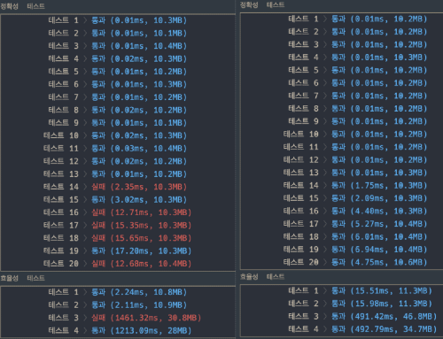

## 문제 확인

<details><summary>펼쳐보기</summary>

### 문제 설명

전화번호부에 적힌 전화번호 중, 한 번호가 다른 번호의 접두어인 경우가 있는지 확인하려 합니다.
전화번호가 다음과 같을 경우, 구조대 전화번호는 영석이의 전화번호의 접두사입니다.

- 구조대 : 119
- 박준영 : 97 674 223
- 지영석 : 11 9552 4421

전화번호부에 적힌 전화번호를 담은 배열 phone_book 이 solution 함수의 매개변수로 주어질 때, 어떤 번호가 다른 번호의 접두어인 경우가 있으면 false를 그렇지 않으면 true를 return 하도록 solution 함수를 작성해주세요.

### 제한 사항

- phone_book의 길이는 1 이상 1,000,000 이하입니다.
   - 각 전화번호의 길이는 1 이상 20 이하입니다.
   - 같은 전화번호가 중복해서 들어있지 않습니다.

### 입출력 예제

| phone_book | return |
|-|-|
| ["119", "97674223", "1195524421"] | false |
| ["123","456","789"] | true |
| ["12","123","1235","567","88"] | false |

### 입출력 예 설명

>
입출력 예 #1  
앞에서 설명한 예와 같습다.

>
입출력 예 #2  
한 번호가 다른 번호의 접두사인 경우가 없으므로, 답은 true입니다.

>
입출력 예 #3  
첫 번째 전화번호, “12”가 두 번째 전화번호 “123”의 접두사입니다. 따라서 답은 false입니다.

---

알림

2021년 3월 4일, 테스트 케이스가 변경되었습니다. 이로 인해 이전에 통과하던 코드가 더 이상 통과하지 않을 수 있습니다.

### 제공하는 소스 코드

```python
def solution(phone_book):
    answer = True
    return answer
```

출처 :
['프로그래머스'](https://programmers.co.kr/learn/courses/30/lessons/42577)

</details>

## 접근

각 문자열마다 모든 다른 문자열을 조회하는 방법은 최대한 피하려고 했다.

>
최악의 경우, O(N^2) 에 수렵하는 시간복잡도를 가질 것이기 때문에,  
입력 배열의 길이 범위인 1 ~ 1,000,000 을 처리하기에는 조금 별로라고 생각했다.

<br>

그래서, 해시 테이블을 활용하면서 반복 횟수를 최소한으로 줄이는 방법을 찾는데 초점을 뒀다.  

바로, 모든 번호를 문자열의 인덱스만큼만 조회하도록 구성하는 방법이었다.

>
접두어와 접두어를 포함하는 단어는 앞에서부터는 무조건 같은 형태일테니,  
첫 인덱스부터 공통되는 문자의 개수를 세면 접두어가 없는 경우를 가장 빠르게 찾는다.

<br>

하지만, 코딩한 내용을 제출한 결과가 정확도 부분을 만족하지 못했고,  
코드 수정을 몇 번 해보고는, 접근 방식에 문제가 있다는 것을 깨달았다.

## 검색

문제를 검색 해보았고, 처리 방식은 맞았는데 구현 방식이 문제였다는 것을 확인했다.

> ['[프로그래머스] 해시 - 전화번호 목록 - Velog'](https://velog.io/@vvakki_/%ED%94%84%EB%A1%9C%EA%B7%B8%EB%9E%98%EB%A8%B8%EC%8A%A4-%ED%95%B4%EC%8B%9C-%EC%A0%84%ED%99%94%EB%B2%88%ED%98%B8-%EB%AA%A9%EB%A1%9D)

<br>

정답 코드의 구성을 파악해보니, 동작 순서를 반대로 구현한 것이었다.

<details><summary>적용한 방법 : 인덱스 값을 늘려가면서 모든 문자열을 조회하는 방법</summary>

- 해당 문자열이 확실하게 접두어인지 검증하는 부분이 없다..  
  `(뭔가 잘못됐음을 깨닫고 코딩을 멈춘 상태..)`

```python
def solution(phone_book):
    '''
    input
        - phone_book : [전화번호] (1 <= [] <= 1000000, 1 <= i <= 20)
    output
        - answer     : 임의의 번호가 다른 번호의 접두어인 경우의 진리값
    result
        - 정확성 : 62.5/100
        - 효율성 : 12.5/100
    '''
    table   = dict()
    index   = 0
    maximum = len(max(phone_book, key=len))


    while index < maximum:
        count = dict()

        for number in phone_book:
            if number in table:
                continue
            digit = number[index]

            if digit not in count:
                count[digit] = 0
            count[digit] += 1

        if max(count.values()) == 1:
            return True

        for number in phone_book:
            if number in table:
                continue
            if count[number[index]] >= 1 and len(number) - 1 == index:
                return False
            if count[number[index]] <= 1 or len(number) - 1 <= index:
                table[number] = 0

        index += 1
```

</details>

<details><summary>올바른 방법 : 모든 문자열을 첫 문자부터 더해가면서, 해시 테이블에 존재하는지 확인하는 방법</summary>

```python
def solution(phone_book):
    '''
    input
        - phone_book : [전화번호] (1 <= [] <= 1000000, 1 <= i <= 20)
    output
        - answer     : 임의의 번호가 다른 번호의 접두어인 경우의 진리값
    result
        - 정확성 : 100/100
        - 효율성 : 100/100
    '''
    answer = True
    hash_map = {}
    for phone_number in phone_book:
        hash_map[phone_number] = 1
    for phone_number in phone_book:
        temp = ""
        for number in phone_number:
            temp += number
            if temp in hash_map and temp != phone_number:
                answer = False
    return answer
```

</details>

<br>

<details><summary>두 풀이 방식의 결과 비교하기</summary>

- 왼쪽(내 풀이) 은 평균적으로 메모리를 적게 사용했고, 일부 효율성 테스트에서는 더 좋은 성능을 보였다.  
  `(접두어가 없는 경우엔 즉시 반환하기 때문인 것 같다.)`



</details>

## 풀이

> 올바른 풀이를 기준으로 작성했다.

<details><summary>1. 전화번호들을 저장할 해시 테이블을 생성한다.</summary>

```python
def solution(phone_book):
    answer = True
    hash_map = {}
    return answer
```

</details>

<details><summary>2. 각 전화번호를 해시 테이블의 key 로 입력한다.</summary>

```python
def solution(phone_book):
    answer = True
    hash_map = {}
    for phone_number in phone_book:
        hash_map[phone_number] = 1
    return answer
```

</details>

<details><summary>3. 전화번호부를 순회하는 반복문를 생성하고, 임시 접두어 변수를 선언한다.</summary>

```python
def solution(phone_book):
    answer = True
    hash_map = {}
    for phone_number in phone_book:
        hash_map[phone_number] = 1
    for phone_number in phone_book:
        temp = ""
    return answer
```

</details>

<details><summary>4. 전화번호를 하나씩 더해, 가능한 접두어를 모두 구성하도록 반복문을 추가한다.</summary>

```python
def solution(phone_book):
    answer = True
    hash_map = {}
    for phone_number in phone_book:
        hash_map[phone_number] = 1
    for phone_number in phone_book:
        temp = ""
        for number in phone_number:
            temp += number
    return answer
```

</details>

<details><summary>5. 임시 접두어 변수가 해시 테이블에 있는지 조회한다.</summary>

- 이 때, 현재의 전화번호와 조회하는 접두어가 일치하지 않도록 조건을 추가한다.

```python
def solution(phone_book):
    answer = True
    hash_map = {}
    for phone_number in phone_book:
        hash_map[phone_number] = 1
    for phone_number in phone_book:
        temp = ""
        for number in phone_number:
            temp += number
            if temp in hash_map and temp != phone_number:
                answer = False
    return answer
```

</details>

## 배운 것

- 자신의 의도를 올바르게 코드로 옮기는 능력을 기를 필요가 있다.
   - 여러 문제를 풀어보면서, 감을 익혀야겠다.
   - 구현하려는 기능을 정리하는 방법에 대해 연구해봐야겠다..
- Python 에서 딕셔너리를 선언하는 방법에는 성능 차이가 있다.
   - 처음 알게된 사실이었고, 공학 수업을 듣고있는 터라 뭔가 더 와닿았다.
   - ['스택오버플로 - dict() vs {}'](https://stackoverflow.com/questions/17097985/dict-vs-in-python-which-is-better/17098017)
     에서 내용을 확인할 수 있다.
- 해시 테이블과 해시 맵의 차이점을 알게됐다.
   - Java 기준으로, 동기화 지원 여부의 차이가 있다고 한다.
   - 해시 테이블은 Null 값을 허용하지 않고, 병렬 처리(동기화) 가 필요할 때 사용한다.
   - 반대로, 해시 맵은 NUll 값을 허용하고, 병렬 처리를 고려하지 않을 때 사용한다.
   - ['[자료구조] Hash/HashTable/HashMap - Hee\'s story'](https://hee96-story.tistory.com/48) 참고
- 다른 사람의 풀이를 보고 zip() 함수와 startswith() 메서드의 사용법을 알게됐다.

<details><summary>해시를 사용하지 않은 풀이 방법</summary>

`(Python 에서 camelCase 라니; 불-편..)`

```python
def solution(phoneBook):
    phoneBook = sorted(phoneBook)

    for p1, p2 in zip(phoneBook, phoneBook[1:]):
        if p2.startswith(p1):
            return False
    return True
```

</details>

<details><summary>zip 함수는 반복 가능한 객체(iterable) 를 인자로 받아, 컨테이너 구조의 zip 객체를 반환한다.</summary>

- 여러 개의 인자를 받을 수 있으며, 입력받은 모든 객체의 정보를 순서대로 묶어 반환한다.

```python
>>> zip([1, 2, 3], [4, 5, 6], [7, 8, 9])
<zip object at 0x7ff80a3190a0>
>>> a = zip([1, 2, 3], [4, 5, 6], [7, 8, 9])
>>> a
<zip object at 0x7ff80a319690>
>>> list(a)
[(1, 4, 7), (2, 5, 8), (3, 6, 9)]
```

</details>

<details><summary>startswith 메서드는 문자열 정보에서만 지원되고, 진리 값을 반환한다.</summary>

- 해당 문자열이 인자로 받은 문자열로 시작되는지 여부를 탐색하고, 그 결과를 반환한다.

<details><summary>첫 번째 인자로는 문자열, 혹은 문자열로만 구성된 튜플 자료형만 입력받을 수 있다.</summary>

```python
>>> test = 'haha'
>>> test.startswith(1)
Traceback (most recent call last):
  File "<stdin>", line 1, in <module>
TypeError: startswith first arg must be str or a tuple of str, not int
>>> test.startswith(1.1)
Traceback (most recent call last):
  File "<stdin>", line 1, in <module>
TypeError: startswith first arg must be str or a tuple of str, not float
>>> test.startswith([])
Traceback (most recent call last):
  File "<stdin>", line 1, in <module>
TypeError: startswith first arg must be str or a tuple of str, not list
>>> test.startswith({})
Traceback (most recent call last):
  File "<stdin>", line 1, in <module>
TypeError: startswith first arg must be str or a tuple of str, not dict
>>> test.startswith(())
False
>>> test.startswith(('ha'))
True
>>> test.startswith('h')
True
```

</details>

<details><summary>2, 3번째 인자를 통해 탐색 범위를 지정할 수 있다.</summary>

| Parameter | Description |
|-|-|
| value | Required. The value to check if the string starts with |
| start | Optional. An Integer specifying at which position to start the search |
| end | Optional. An Integer specifying at which position to end the search |

\- 출처 :
['w3schools.com'](https://www.w3schools.com/python/ref_string_startswith.asp)

</details>

</details>

<br>

- 20210404 - 마크다운 구성 변경
- 20210418 - 표기 수정(2번째, 3번째 -> 2, 3번째)
- 20220418 - 표기 수정(접근법 -> 처리 방식, 메소드 -> 메서드)
