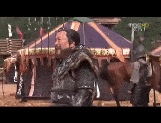
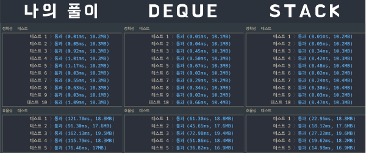

## 문제 확인

<details><summary>펼쳐보기</summary>

### 문제 설명

초 단위로 기록된 주식가격이 담긴 배열 prices가 매개변수로 주어질 때, 가격이 떨어지지 않은 기간은 몇 초인지를 return 하도록 solution 함수를 완성하세요.

### 제한사항

- prices의 각 가격은 1 이상 10,000 이하인 자연수입니다.
- prices의 길이는 2 이상 100,000 이하입니다.

### 입출력 예

| prices | return |
|-|-|
| [1, 2, 3, 2, 3] | [4, 3, 1, 1, 0] |

### 입출력 예 설명

- 1초 시점의 ₩1은 끝까지 가격이 떨어지지 않았습니다.
- 2초 시점의 ₩2은 끝까지 가격이 떨어지지 않았습니다.
- 3초 시점의 ₩3은 1초뒤에 가격이 떨어집니다. 따라서 1초간 가격이 떨어지지 않은 것으로 봅니다.
- 4초 시점의 ₩2은 1초간 가격이 떨어지지 않았습니다.
- 5초 시점의 ₩3은 0초간 가격이 떨어지지 않았습니다.

※ 공지 - 2019년 2월 28일 지문이 리뉴얼되었습니다.

### 제공하는 소스 코드

```python
def solution(prices):
    answer = []
    return answer
```

출처 :
['프로그래머스'](https://programmers.co.kr/learn/courses/30/lessons/42584)

</details>

## 접근

배열의 길이가 최대 100,000이기 때문에, 반복문을 중첩하면 심각하게 비효율적이다.

<details><summary>그래서 반복문을 하나만 사용한다는 전제하에 문제를 풀기로 했다. - 1</summary>

'주식이 떨어지지 않은 기간' 의 본질에 대해 생각해봤고,  
정확한 값을 구하기 위해서는 어떤 식이 필요한지 파악했다.

'주식이 떨어진 시점으로부터 해당 시점이 얼마나 멀리 있는가?'

> 주식이 떨어지지 않은 기간 = 주식이 떨어진 시점(시간) - 현재 시점(시간)

식을 정리한 후에 '시간 순서를 거꾸로 진행하는 방법' 에 초점을 두고, 문제를 다시 파악했다.

다시 예제를 봤고, 2가지 사실을 발견했다.

- 주식이 떨어지는 시점까지 결과 값은 1씩 줄어든다.
- 마지막 결과는 주식이 떨어지는지 파악할 수 없기 때문에 항상 0이다.

이것을 반대로 생각하면, 주식이 떨어진 시점으로부터 뒤로 갈수록 값이 증가한다는 것이다.

이 때, '시간의 흐름을 거꾸로 진행한다.' 라는 아이디어가 맞았다고 판단했고,  
입력받은 배열을 스택으로 취급해, 마지막 원소부터 반복을 진행하기로 결정했다.

매 번 원소를 맨 앞에 삽입하면, 인덱스 수정으로 인해 비효율적일 것이기 때문에,  
모든 원소를 순서대로 삽입해 마지막에 뒤집는 작업을 해주기로 결정했다.

코드를 짜기 전에 어떻게 동작해야 하는지를 정리해봤다.

- 주식가격의 흐름이 담긴 배열을 뒤집어서 반복해야 한다.
- 반복하는 시점의 원소보다 이전 시점의 원소가 작거나 같다면 값을 1씩 늘리고,  
  반대의 경우라면(크다면) 값을 다시 1로 초기화하도록 동작을 구성해야 한다.
- 이미 정해진 값인 0을 결과 배열에 넣고 시작하기 때문에,  
  마지막 반복(첫 번째 원소) 에 대한 작업은 수행하지 않는다.

필요한 것을 정리해보면 아래와 같다.

- 0이 담긴 정답 배열
- 정답 배열에 담길 시간 값을 나타내는 변수
- 입력받은 배열을 (총 길이 - 1) 횟수만큼 거꾸로 반복하는 반복문
- 현재 원소와 이전 인덱스 원소를 비교하는 조건문
- 시간 값 변수를 증가시키는 구문
- 시간 값 변수를 정답 배열에 삽입하는 구문

이 때, 값을 1대신 0으로 초기화하고, 값을 증가시키는 구문이 항상 실행되도록 하면,  
값을 증가시키는 동작에 대해 별도의 조건문을 생성하지 않아도 된다는 생각이 들었다.

<details><summary>이렇게 해결 아이디어를 정리했고, 코드를 작성했다.</summary>

```python
def solution(prices):
    '''
    input
        - prices : [주식가격] (2 <= [] <= 100000, 1 <= i <= 10000)
    output
        - answer : 각 시점마다 주식이 떨어지지 않은 기간
    '''
    answer = [0]
    time   = 0

    for current, price in enumerate(list(reversed(prices))[:-1]):
        if price > prices[current - 1]:
            time = 0
        time += 1
        answer.append(time)

    return answer
```

</details>

</details>

<br>

하지만 결과를 보고, 놓친 부분이 있다는 것을 깨달았다.

바로, '가격이 떨어진다' 의 기준이 모든 시점에 대해 적용된다는 것이었다.

<details><summary>해결 방식이 잘못됐다고 생각했고, 다른 방식으로 풀어보기로 했다. - 2</summary>

반복문을 중첩하되, 내부 반복문은 해당 시점에서부터만 동작하도록 구성하기로 했다.

이 방법의 경우 반복문 내부에서 수행되는 반복문이 점점 짧게 동작하게 된다.

내부의 반복문은 기준 원소보다 작은 원소를 만났을 때 바로 종료되도록 하면,  
모든 원소가 아닌 필요한 만큼의 원소에 대해서만 반복하게 되기 때문에 더 효율적이다.

코드를 짜기 전에 어떻게 동작해야 하는지를 정리해봤다.

- 주식가격 배열에 대한 반복문을 수행한다. - A
- A 반복문 내부에서 또 다른 반복문을 수행한다. - B
- A, B 반복문 동작 과정의 값은 각각 a, b라 한다.
- B는 a 이후의 원소들에 대해서만 동작한다.
- B의 동작마다 기간을 나타내는 변수를 1씩 증가시킨다.
- b가 a보다 작은 경우 B를 종료한다.
- 이 때, 정답 배열에 값을 삽입한다.
- B가 종료될 때마다 시간 변수를 초기화해준다.

필요한 것을 정리해보면 아래와 같다.

- 텅 빈 상태의 정답 배열
- 정답 배열에 담길 시간 값을 나타내는 변수
- 입력받은 배열을 반복하는 반복문 A
- A의 내부에서 a이후의 원소를 반복하는 반복문 B
- a와 b의 값을 비교하는 조건문
- 시간 값 변수를 증가시키는 구문
- 시간 값 변수를 정답 배열에 삽입하는 구문
- 시간 값 변수를 초기화하는 구문

<details><summary>이렇게 해결 아이디어를 정리했고, 코드를 작성했다.</summary>

```python
def solution(prices):
    '''
    input
        - prices : [주식가격] (2 <= [] <= 100000, 1 <= i <= 10000)
    output
        - answer : 각 시점마다 주식이 떨어지지 않은 기간
    '''
    from itertools import islice
    answer = []
    time   = 0

    for current, price in enumerate(prices):
        for _price in islice(prices, current + 1, None):
            time += 1
            if price > _price:
                break
        answer.append(time)
        time = 0

    return answer
```

</details>

</details>

<br>

정확한 풀이였지만, 효율성에서 문제가 있었다.

<details><summary>그래서 이번에는 반복문의 동작 방식만 바꿔서 풀어봤다. - 3</summary>

매번 새로운 배열을 생성하게 되는 것이 문제라 생각했고,  
인덱스를 기준으로 반복문이 수행되도록 코드의 구성을 바꿨다.

```python
def solution(prices):
    '''
    input
        - prices : [주식가격] (2 <= [] <= 100000, 1 <= i <= 10000)
    output
        - answer : 각 시점마다 주식이 떨어지지 않은 기간
    '''
    answer = []
    maximum = len(prices) - 1

    for current in range(maximum):
        price = prices[current]
        time  = 0
        while current + time < maximum:
            time += 1
            if price > prices[current + time]:
                break
        answer.append(time)
    answer.append(0)

    return answer
```

</details>

</details>

## 검색

<details><summary>'1' 의 접근 방식에서 검색한 내용</summary>

반복문을 수행하기 위해 인덱스와 값을 모두 필요로 하는 상황이여서,  
enumerate() 와 range(len()) 중에 어떤 것이 더 효율적인지 검색해봤다.

 1. enumerate() 를 사용하는 경우
     - 반복 구문 내에서 사용 가능한 원소가 있다.
     - 해당 원소에 대한 인덱스 값이 있다.
     - 컴퓨터가 수행하는 동작 : enumerate() + 배열 인덱스에 접근

 2. range(len()) 을 사용하는 경우
     - 반복에 대한 인덱스만 있다.
     - 컴퓨터가 수행하는 동작 : range() + len() + 배열 인덱스에 접근 * 2

검색어는 아래와 같다.

- 'python enumerate vs range'
- 'python enumerate vs range performance'

참고한 문서는 아래와 같다. `(+ 블로그 글에 인용된 스택오버플로 질문들)`

- ['Python range(len()) vs enumerate() 속도 차이'](https://siahn95.tistory.com/12)
- ['[ Python Skill ] range 대신 enumerate를 써야 하는 이유'](https://potensj.tistory.com/114)

<br>

**성능도 중요하지만, 인덱싱을 사용하면 가독성이 떨어질 것 같아서 enumerate() 를 사용하기로 했다.**

</details>

<details><summary>'2' 의 접근 방식에서 검색한 내용</summary>

특정 시점 이후부터 수행되는 반복문의 효율을 높이는 방법을 고민해봤다.

- 슬라이싱을 적용하면, 매번 잘린 배열을 생성하게 되어 비효율적이다.
- 시작 인덱스를 정하는 방법이 따로 있지 않을까?

검색어는 아래와 같다.

- 'python for loop with start index'

참고한 문서는 아래와 같다.

- ['Start index for iterating Python list'](https://stackoverflow.com/questions/6148619/start-index-for-iterating-python-list)

<br>

**두 번째 답변을 참고하여 itertools 라이브러리의 islice() 함수를 사용하기로 했다.**

</details>

## 풀이

<details><summary>1. 주어진 소스 코드에 docstring 을 추가했다.</summary>

```python
def solution(prices):
    '''
    input
        - prices : [주식가격] (2 <= [] <= 100000, 1 <= i <= 10000)
    output
        - answer : 각 시점마다 주식이 떨어지지 않은 기간
    '''
    answer = []
    return answer
```

</details>

<details><summary>2. 동작에 필요한 변수를 선언했다.</summary>

- 반복이 종료되는 시점을 표시하기 위해 최대 범위 변수를 선언했다.

```python
def solution(prices):
    '''
    input
        - prices : [주식가격] (2 <= [] <= 100000, 1 <= i <= 10000)
    output
        - answer : 각 시점마다 주식이 떨어지지 않은 기간
    '''
    answer = []
    maximum = len(prices) - 1

    return answer
```

</details>

<details><summary>3. 매 시간마다 가격이 떨어지는 지점을 기록하도록 했다.</summary>

- 마지막 결과는 0으로 고정되어 있기 때문에, 반복 범위를 1만큼 줄였다.

```python
def solution(prices):
    '''
    input
        - prices : [주식가격] (2 <= [] <= 100000, 1 <= i <= 10000)
    output
        - answer : 각 시점마다 주식이 떨어지지 않은 기간
    '''
    answer = []
    maximum = len(prices) - 1

    for current in range(maximum):
        price = prices[current]
        time  = 0
        while current + time < maximum:
            time += 1
            if price > prices[current + time]:
                break
        answer.append(time)
    answer.append(0)

    return answer
```

</details>

## 배운 것

- enumerate() 함수보다 range(len()) 을 사용하는 것이 더 빠르다.
- itertools 라이브러리의 islice() 함수에 대해 배웠다.

<details><summary>islice() 함수는 반복 가능 객체를 입력받아 iterator 를 생성한다.</summary>

- iterator 를 생성/활용하는 함수들의 집합인 'itertools' 라이브러리에 포함된 함수다.
- 반복 가능한 객체(iterable), 시작점(start), 끝점(stop), 건너뛰기(step) 을 인자로 받는다.
- 2개 이상의 인자를 받고, 인자의 갯수에 따라 다르게 동작한다. `(iterable 객체는 고정이다.)`
- 입력된 값에 의해 선택된 인자들을 반환하는 iterator 를 생성한다.

</details>

<details><summary>islice() 함수의 동작 방식을 코드로 표현하면,</summary>

\- 출처 : 
['Python'](https://docs.python.org/ko/3/library/itertools.html#itertools.islice)

```python
def islice(iterable, *args):
    # islice('ABCDEFG', 2) --> A B
    # islice('ABCDEFG', 2, 4) --> C D
    # islice('ABCDEFG', 2, None) --> C D E F G
    # islice('ABCDEFG', 0, None, 2) --> A C E G
    s = slice(*args)
    start, stop, step = s.start or 0, s.stop or sys.maxsize, s.step or 1
    it = iter(range(start, stop, step))
    try:
        nexti = next(it)
    except StopIteration:
        # Consume *iterable* up to the *start* position.
        for i, element in zip(range(start), iterable):
            pass
        return
    try:
        for i, element in enumerate(iterable):
            if i == nexti:
                yield element
                nexti = next(it)
    except StopIteration:
        # Consume to *stop*.
        for i, element in zip(range(i + 1, stop), iterable):
            pass
```

</details>

- 다른 사람의 풀이를 보고, '덱(deque)' 자료 구조에 대해 알게됐다.

<details><summary>덱을 활용한 풀이</summary>

- 덱을 활용해 효율적으로 원소를 제거하고, 나머지 정보들에 대해 반복하는 방식이다.
- 해당 시간의 가격에 대해 더 싼 가격이 등장할 때까지만 비교한다.

```python
from collections import deque
def solution(prices):
    answer = []
    prices = deque(prices)
    while prices:
        c = prices.popleft()

        count = 0
        for i in prices:
            if c > i:
                count += 1
                break
            count += 1

        answer.append(count)

    return answer
```

</details>

<details><summary>덱은 큐와 스택을 합친 형태의 자료구조라고 볼 수 있다.,</summary>

- 양쪽이 끝인 큐(**D**ouble-**E**nded **QUE**ue) 이다.
- 양쪽에서 삭제, 삽입할 수 있는 자로 구조다.
- 파이썬의 내장 모듈인 'collections' 에 포함되어 있다.
- 모든 동작에 대해 O(1) 의 시간 복잡도를 보장한다.  
  `(평범한 list 의 경우, O(n)의 시간 복잡도로 동작한다..)`

</details>

- 구글에서 찾은 '스택을 이용한 풀이 방식' 을 보고, 새로운 문제 접근 방식을 배웠다.

<details><summary>stack 을 활용한 풀이</summary>

- 현재 가격보다 더 비싼 가격이었을 때의 시간 값이 스택에 남아있지 않을 때까지  
  (현재 시간 - 비싼 시점의 시간) 값을 정답 배열의 해당 시간 인덱스에 넣고,  
  모든 시간에 대한 반복이 끝난 후에도 스택에 시간 값이 남아있다면  
  (마지막 시간 - 해당 시간) 을 정답 배열의 인덱스에 넣는 방식이다.
- 스택을 활용한 다른 풀이들보다 훨씬 더 빠른 속도로 동작한다.

\- 출처 : 
['프로그래머스 문제 풀이 주식 가격'](https://gurumee92.tistory.com/170)

```python
def solution(prices):
    n = len(prices)
    # 1. answer를 prices 길이와 맞춘다.
    answer = [0] * n
    # 2. 스택 생성
    st = []
    # 3. 0 ~ n-1 초까지 순회
    for i in range(n):
        # 1. 스택 비지 않고, prices[top] > prices[i] 이라면 다음 반복
        # 1-1. 스택에서 마지막에 저장된 시간 top 꺼냄
        # 1-2. answer[top]에 i - top을 저장
        while st and prices[st[-1]] > prices[i]:
            top = st.pop()
            answer[top] = i - top
        # 2. 스택에 현재 시간 i 저장
        st.append(i)

    # 4. 만약 스택이 남아있다면, 스택이 빌 때까지 다음 반복
    while st:
        # 1. 스택에서 마지막에 저장된 시간 top 꺼냄
        # 2. answer[top]에 가장 마지막 시간 n - i 에서 top을 뺸 시간 저장
        top = st.pop()
        answer[top] = n - 1 - top

    return answer
```

</details>

- 확실하게 잘못된 접근이 아닌 이상, 더 끈기있게 문제를 풀어야 한다는 것도 배웠다.
   - 첫 시도가 실패했을 때, 모든 시점을 저장하는 방법으로 방향을 바꿨어야 했다..
   - ['지난번 문제 풀이'](/Algorithm/Programmers/프로그래머스 - 위장(Hash Lv.2)/#배운-것)
     때의 충격이 아직 남아있어서, 방향을 너무 쉽게 틀어버렸다.. (PTSD;;)

<details><summary>이렇게 멋진 풀이를 직접 해내지 못했다는게 아직도 분하다!!!!</summary>

- 왜 놓친 부분이 있는걸 알고, 해결 방식을 바꿔야 한다는 사실을 알고도 그랬을까 ㅠㅜㅠㅜㅠ



</details>

<details><summary>각각의 풀이에 대한 결과</summary>



</details>

<br>

- 20210404 - 마크다운 구성 변경
- 20210418 - 맞춤법 수정(첫번째 -> 첫 번째, 고려해야했기 -> 고려해야 했기, 진행해야하는데 -> 진행해야 하는데, 써야하는 -> 써야 하는, 는 지 -> 는지)
