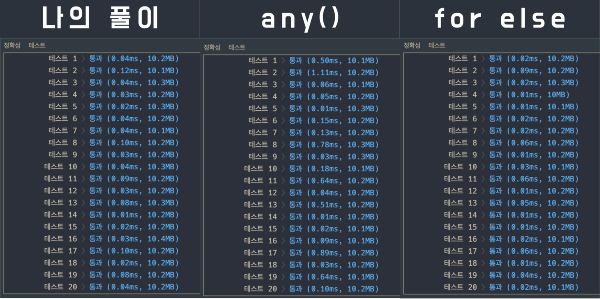

## 문제 확인

<details><summary>펼쳐보기</summary>

### 문제 설명
일반적인 프린터는 인쇄 요청이 들어온 순서대로 인쇄합니다. 그렇기 때문에 중요한 문서가 나중에 인쇄될 수 있습니다. 이런 문제를 보완하기 위해 중요도가 높은 문서를 먼저 인쇄하는 프린터를 개발했습니다. 이 새롭게 개발한 프린터는 아래와 같은 방식으로 인쇄 작업을 수행합니다.

```
1. 인쇄 대기목록의 가장 앞에 있는 문서(J)를 대기목록에서 꺼냅니다.
2. 나머지 인쇄 대기목록에서 J보다 중요도가 높은 문서가 한 개라도 존재하면 J를 대기목록의 가장 마지막에 넣습니다.
3. 그렇지 않으면 J를 인쇄합니다.
```

예를 들어, 4개의 문서(A, B, C, D)가 순서대로 인쇄 대기목록에 있고 중요도가 2 1 3 2 라면 C D A B 순으로 인쇄하게 됩니다.

내가 인쇄를 요청한 문서가 몇 번째로 인쇄되는지 알고 싶습니다. 위의 예에서 C는 1번째로, A는 3번째로 인쇄됩니다.

현재대기목록에 있는 문서의 중요도가 순서대로 담긴 배열 priorities와 내가 인쇄를 요청한 문서가 현재 대기목록의 어떤 위치에 있는지를 알려주는 location이 매개변수로 주어질 때, 내가 인쇄를 요청한 문서가 몇 번째로 인쇄되는지 return 하도록 solution 함수를 작성해주세요.

### 제한사항

- 현재 대기목록에는 1개 이상 100개 이하의 문서가 있습니다.
- 인쇄 작업의 중요도는 1~9로 표현하며 숫자가 클수록 중요하다는 뜻입니다.
- location은 0 이상 (현재 대기목록에 있는 작업 수 - 1) 이하의 값을 가지며 대기목록의 가장 앞에 있으면 0, 두 번째에 있으면 1로 표현합니다.

### 입출력 예

| priorities | location | return |
|-|-|-|
| [2, 1, 3, 2] | 2 | 1 |
| [1, 1, 9, 1, 1, 1] | 0 | 5 |

### 입출력 예 설명

>
예제 #1  
문제에 나온 예와 같습니다.

>
예제 #2  
6개의 문서(A, B, C, D, E, F)가 인쇄 대기목록에 있고 중요도가 1 1 9 1 1 1 이므로 C D E F A B 순으로 인쇄합니다. 

### 제공하는 소스 코드

```python
def solution(priorities, location):
    answer = 0
    return answer
```

출처 :
['프로그래머스'](https://programmers.co.kr/learn/courses/30/lessons/42587)

</details>

## 접근

특정 문서가 인쇄되는 시점의 인쇄 횟수를 반환하는 문제라는 것을 파악했고,  
다른 해결 아이디어가 떠오르지 않아서 설명에 있는 방식대로 문제를 풀기로 했다.

<details><summary>구현하면서 신경 쓸 내용, 효율성, 동작에 대해 정리했다.</summary>

문서가 인쇄될 때마다 배열의 원소를 삭제 + 인쇄 횟수를 1 증가시키고,  
중요도가 낮아 인쇄되지 않은 경우에는 배열의 마지막에 다시 삽입한다.

문제를 푸는 동안 신경 쓸 내용들을 정리했다.

- 앞에서부터 원소가 삭제되므로 중요도 배열을 큐로 취급한다.
- 중요도가 가장 높은 문서만 인쇄되므로 조건을 매번 확인해야 한다.
- 배열이 변할 때마다 요청한 문서의 인덱스도 최신화해야 한다.
- 원소가 삭제될 때마다 인쇄 횟수 변수의 값을 증가시켜야 한다.

효율성을 늘리기 위한 방법들을 정리했다.

- 배열의 맨 앞 원소를 삭제할 때 일반 배열보다 더 성능이 좋은 deque 를 사용한다.
- 매번 배열의 원소 전체를 비교하는 대신, 크기 순으로 정렬된 배열과 비교한다.
- 크기 순으로 정렬된 배열은 스택을 이용한다.

코드를 짜기 전에 어떻게 동작해야 하는지를 정리했다.

- 지정된 문서가 조건을 만족할 때까지 반복해야 한다.
- 인쇄 가능 여부를 확인하기 위해 중요도의 크기를 비교해야 한다.
- 인쇄가 가능한 문서는 배열에서 삭제하고, 횟수(정답 변수의 값) 를 1 증가시킨다.
- 인쇄가 불가능한 문서는 배열의 맨 뒤로 보내야 한다.
- 인쇄된 문서가 지정된 문서라면, 정답 변수를 반환한다.

필요한 것을 정리해보면 아래와 같다.

- 순서대로 문서를 확인하기 위한 큐
- 인쇄 중요도를 크기로 정렬한 스택
- 가장 큰 중요도의 값을 가리키는 변수
- 인쇄 횟수를 가리키는 정답 변수
- 조건이 만족되면 종료되는 반복문
- 현재 원소의 중요도가 가장 큰 지 확인하는 조건문
   - 크다면, 원소를 삭제하고 정답 변수의 값을 1 증가
   - 작다면, 원소를 삭제하고 배열의 맨 뒤에 추가
- 인쇄된 문서가 지정된 문서인지 확인하는 조건문
</details>

## 검색

<details><summary>list.pop() 과 list.pop(0), deque 의 시간 복잡도에 대해 검색해봤다.</summary>

검색어는 아래와 같다.

- 'python pop time complexity'
- 'python deque time complexity'

참고한 문서는 아래와 같다. `(+ 블로그 글에 인용된 문서들)`

- ['파이썬 자료형 별 주요 연산자의 시간 복잡도 (Big-O)'](https://wayhome25.github.io/python/2017/06/14/time-complexity)
- ['파이썬 기본 연산자들의 시간 복잡도(Big-O) 정리'](https://dev.plusblog.co.kr/42)
- ['Time complexity in the Python wiki'](https://wiki.python.org/moin/TimeComplexity)

<br>

**앞으로, 스택/큐를 사용하는 경우에는 무조건 deque 를 사용하기로 했다.**

</details>

<details><summary>import 후에 접근하는 방식과 from, import 의 성능 차이에 대해 검색해봤다.</summary>

검색어는 아래와 같다.

- 'python from import vs import performance'

참고한 문서는 아래와 같다.

- ['Python import X or from X import Y? (performance)'](https://stackoverflow.com/questions/3591962/python-import-x-or-from-x-import-y-performance)

<br>

**모듈을 가져올 땐 꼭 필요한 것만 가져올 수 있도록 습관을 들이기로 했다.**

</details>

## 풀이

<details><summary>1. 주어진 소스 코드에 docstring 을 추가했다.</summary>

```python
def solution(priorities, location):
    '''
    input
        - priorities : [인쇄 중요도] (1 <= [] <= 100, 1 <= i <= 9)
        - location : 요청한 문서의 인덱스 (0 <= i <= len(priorities) - 1)
    output
        - answer : 요청된 문서가 출력되는 순서
    '''
    answer = 0
    return answer
```

</details>

<details><summary>2. 큐, 스택, 중요도 변수, 정답 변수를 선언했다.</summary>

```python
def solution(priorities, location):
    '''
    input
        - priorities : [인쇄 중요도] (1 <= [] <= 100, 1 <= i <= 9)
        - location : 요청한 문서의 인덱스 (0 <= i <= len(priorities) - 1)
    output
        - answer : 요청된 문서가 출력되는 순서
    '''
    from collections import deque

    task_queue = deque(map(
        lambda _: (priorities[_], _ == location),
        range(len(priorities))))
    task_stack = sorted(priorities)
    urgent     = task_stack.pop()
    answer     = 0

    return answer
```

</details>

<details><summary>3. 큐에 담긴 원소를 순회하는 반복문을 추가했다.</summary>

```python
def solution(priorities, location):
    '''
    input
        - priorities : [인쇄 중요도] (1 <= [] <= 100, 1 <= i <= 9)
        - location : 요청한 문서의 인덱스 (0 <= i <= len(priorities) - 1)
    output
        - answer : 요청된 문서가 출력되는 순서
    '''
    from collections import deque

    task_queue = deque(map(
        lambda _: (priorities[_], _ == location),
        range(len(priorities))))
    task_stack = sorted(priorities)
    urgent     = task_stack.pop()
    answer     = 0

    while task_queue:
        priority, is_target = task_queue.popleft()

    return answer
```

</details>

<details><summary>4. 조건이 충족되면 인쇄되도록 조건문을 추가했다.</summary>

- 가장 큰 중요도를 나타내는 변수의 값을 최신화하는 구문도 추가했다.

```python
def solution(priorities, location):
    '''
    input
        - priorities : [인쇄 중요도] (1 <= [] <= 100, 1 <= i <= 9)
        - location : 요청한 문서의 인덱스 (0 <= i <= len(priorities) - 1)
    output
        - answer : 요청된 문서가 출력되는 순서
    '''
    from collections import deque

    task_queue = deque(map(
        lambda _: (priorities[_], _ == location),
        range(len(priorities))))
    task_stack = sorted(priorities)
    urgent     = task_stack.pop()
    answer     = 0

    while task_queue:
        priority, is_target = task_queue.popleft()

        if priority == urgent:
            answer += 1

            urgent = task_stack.pop()

            continue

    return answer
```

</details>

<details><summary>5. 지정된 문서가 출력되면 값을 반환하는 조건문을 추가했다.</summary>

- 결과를 즉시 반환하도록 하면서 반복 유지 조건도 변경했다.
- 출력되지 않으면 다시 큐에 삽입하는 구문도 추가했다.

```python
def solution(priorities, location):
    '''
    input
        - priorities : [인쇄 중요도] (1 <= [] <= 100, 1 <= i <= 9)
        - location : 요청한 문서의 인덱스 (0 <= i <= len(priorities) - 1)
    output
        - answer : 요청된 문서가 출력되는 순서
    '''
    from collections import deque

    task_queue = deque(map(
        lambda _: (priorities[_], _ == location),
        range(len(priorities))))
    task_stack = sorted(priorities)
    urgent     = task_stack.pop()
    answer     = 0

    while True:
        priority, is_target = task_queue.popleft()

        if priority == urgent:
            answer += 1

            if is_target:
                return answer

            urgent = task_stack.pop()

            continue

        task_queue.append((priority, is_target))
```

</details>

<br>

> <details><summary>같은 동작을 자바스크립트로 코딩해봤다.</summary>
>
> ```javascript
> const solution = (priorities, location) => {
>   const taskQueue = priorities.map((priority, _) => [priority, _ == location]);
>   const taskStack = priorities.sort();
>   let urgent = taskStack.pop();
>   let answer = 0;
>   let condition = false;
> 
>   while (taskQueue.length) {
>     const [priority, isTarget] = taskQueue.shift();
> 
>     priority == urgent
>       ? (answer++,
>         isTarget && (condition = !condition),
>         (urgent = taskStack.pop()))
>       : taskQueue.push([priority, isTarget]);
>     if (condition) return answer;
>   }
> };
> ```
>
> </details>

## 배운 것

- 파이썬에서 스택/큐처럼 양 끝의 원소를 활용할 땐 deque 만한 것이 없다.  
  `(단, 중간 값을 활용하는 경우에는 그냥 배열을..)`
- import 구문은 필요한 모듈만 가져오도록 from 까지 사용하는 것이 훨신 효율적이다.
- 파이썬에는 2진 명령어(byte code) 에 대한 역 어셈블러(disassembler) 가 있다.
   - 모듈 형태로 제공되서 `import dis` 로 가져온 후에 사용할 수 있다.
   - 정확하게는 CPython 인터프리터의 구현 세부 사항을 표기하는 것이라고 한다.  
     \- 출처 : 
     ['Python'](https://docs.python.org/ko/3.8/library/dis.html)
- 다른 사람의 풀이를 보고, 내장 함수 any() 와, for, else 문을 배웠다.

<details><summary>any()를 활용한 풀이</summary>

- 인쇄되는 여부에 상관없이 반복하면서 인쇄된 경우에만 정답 변수를 증가시키고,  
  인쇄된 문서가 지정된 문서라면 정답을 반환하는 풀이 방식이다.
- any 의 인자로 'generator expression(생성기 표현식)' 이 입력되어 있다.
- 효율성은 조금 아쉽지만, any() 를 활용했다는 점이 인상 깊었다.

```python
def solution(priorities, location):
    queue =  [(i,p) for i,p in enumerate(priorities)]
    answer = 0
    while True:
        cur = queue.pop(0)
        if any(cur[1] < q[1] for q in queue):
            queue.append(cur)
        else:
            answer += 1
            if cur[0] == location:
                return answer
```

</details>

<details><summary>any() 함수는 반복 가능 객체를 입력받아 진리값을 반환한다.</summary>

- 입력받은 객체의 원소 중 '참' 인 경우가 하나라도 있는지를 확인할 때 사용한다.
- 하나라도 참이면 'True', 아니라면 'False' 가 된다.
- 자매품으로 전체 원소가 참인지 여부를 확인하는 all() 함수가 있다.

</details>

<details><summary>any() 함수의 동작 방식을 코드로 표현하면,</summary>

\- 출처 : 
['Python'](https://docs.python.org/3/library/functions.html?#any)

```python
def any(iterable):
    for element in iterable:
        if element:
            return True
    return False
```

</details>

<details><summary>all() 함수의 동작 방식을 코드로 표현하면,</summary>

\- 출처 : 
['Python'](https://docs.python.org/3/library/functions.html?#all)

```python
def all(iterable):
    for element in iterable:
        if not element:
            return False
    return True
```

</details>

<details><summary>for, else 문을 활용한 풀이</summary>

- 인쇄된 여부를 비교하고, 현재 인쇄되어야 하는 값만 수정하는 풀이 방식이다.
- 원소를 삭제하지 않고, 조건에 의해 무시되도록 하는 방식이 인상 깊었다.
- 배열을 변형하지 않기 때문에 훨씬 더 효율적으로 동작했다..
- for 문의 동작 과정에서 break 없이 동작이 온전히 종료된 경우에 else 절로 넘어간다.

```python
def solution(priorities, location):
    answer = 0
    search, c = sorted(priorities, reverse=True), 0
    while True:
        for i, priority in enumerate(priorities):
            s = search[c]
            if priority == s:
                c += 1
                answer += 1
                if i == location:
                    break
        else:
            continue
        break
    return answer
```

</details>

<details><summary>각각의 풀이에 대한 결과</summary>



</details>

<br>

- 20210404 - 마크다운 구성 변경
- 20210418 - 맞춤법 수정(인상깊 -> 인상 깊, 신경쓸 -> 신경 쓸, 는 지 -> 는지)
