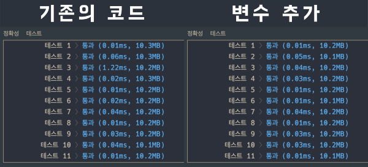
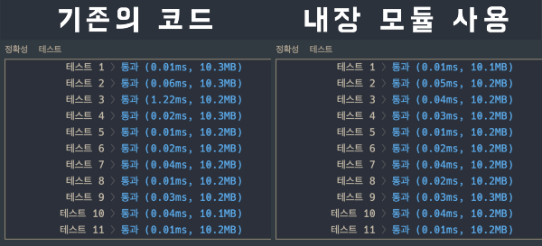
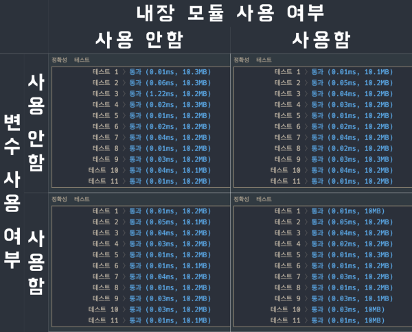

## 문제 확인

<details><summary>펼쳐보기</summary>

### 문제 설명

프로그래머스 팀에서는 기능 개선 작업을 수행 중입니다. 각 기능은 진도가 100%일 때 서비스에 반영할 수 있습니다.

또, 각 기능의 개발속도는 모두 다르기 때문에 뒤에 있는 기능이 앞에 있는 기능보다 먼저 개발될 수 있고, 이때 뒤에 있는 기능은 앞에 있는 기능이 배포될 때 함께 배포됩니다.

먼저 배포되어야 하는 순서대로 작업의 진도가 적힌 정수 배열 progresses와 각 작업의 개발 속도가 적힌 정수 배열 speeds가 주어질 때 각 배포마다 몇 개의 기능이 배포되는지를 return 하도록 solution 함수를 완성하세요.

### 제한 사항

- 작업의 개수(progresses, speeds배열의 길이)는 100개 이하입니다.
- 작업 진도는 100 미만의 자연수입니다.
- 작업 속도는 100 이하의 자연수입니다.
- 배포는 하루에 한 번만 할 수 있으며, 하루의 끝에 이루어진다고 가정합니다. 예를 들어 진도율이 95%인 작업의 개발 속도가 하루에 4%라면 배포는 2일 뒤에 이루어집니다.

### 입출력 예

| progresses | speeds | return |
|-|-|-|
| [93, 30, 55] | [1, 30, 5] | [2, 1] |
| [95, 90, 99, 99, 80, 99] | [1, 1, 1, 1, 1, 1] | [1, 3, 2] |

### 입출력 예 설명

> 
입출력 예 #1  
첫 번째 기능은 93% 완료되어 있고 하루에 1%씩 작업이 가능하므로 7일간 작업 후 배포가 가능합니다.  
두 번째 기능은 30%가 완료되어 있고 하루에 30%씩 작업이 가능하므로 3일간 작업 후 배포가 가능합니다. 하지만 이전 첫 번째 기능이 아직 완성된 상태가 아니기 때문에 첫 번째 기능이 배포되는 7일째 배포됩니다.  
세 번째 기능은 55%가 완료되어 있고 하루에 5%씩 작업이 가능하므로 9일간 작업 후 배포가 가능합니다.
>
따라서 7일째에 2개의 기능, 9일째에 1개의 기능이 배포됩니다.

>
입출력 예 #2  
모든 기능이 하루에 1%씩 작업이 가능하므로, 작업이 끝나기까지 남은 일수는 각각 5일, 10일, 1일, 1일, 20일, 1일입니다. 어떤 기능이 먼저 완성되었더라도 앞에 있는 모든 기능이 완성되지 않으면 배포가 불가능합니다.
>
따라서 5일째에 1개의 기능, 10일째에 3개의 기능, 20일째에 2개의 기능이 배포됩니다.

※ 공지 - 2020년 7월 14일 테스트케이스가 추가되었습니다.

### 제공하는 소스 코드

```python
def solution(progresses, speeds):
    answer = []
    return answer
```

출처 :
<a href='https://programmers.co.kr/learn/courses/30/lessons/42584' target='-blank'>프로그래머스</a>
</details>

## 접근

처음에는 작업 진도 배열과 작업 속도 배열을 하나씩 더해볼까 생각했는데,  
완료된 작업이라도 순서대로 배포된다는 조건을 보고 다른 아이디어가 떠올랐다.

<details><summary>아이디어를 정리하고, 코드를 작성했다.</summary>

- 문제를 해결하기 위해 필요한 것은 '한 번에 배포되는 작업의 수' 다.
- 작업 진도, 속도 배열은 '작업의 진행 상태' 를 나타낸다.
- 배포 완료된 작업은 '진행 중인 작업' 에 포함되지 않는다.
- 따라서, 배포된 이후에는 작업 진행 상태에 기록될 필요가 없다.
- 순서대로 배포되므로 진행 상태 배열의 원소들도 앞에서부터 삭제해야 한다.
- 앞에서부터 정보를 제거해야 하므로, 큐 자료구조를 사용한다.
- 작업이 완료되어 가는 과정보다 배포 가능한 시점에 완료된 작업의 수가 중요하다.
- 따라서, 시간의 변화가 아닌, 배포 가능한 시점에 초점을 둬야 한다.
- 맨 앞에 있는 작업이 배포되는 시점마다 앞에서부터 완료된 작업을 제외하면 된다.

코드를 짜기 전에 어떻게 동작해야 하는 지를 정리해봤다.

- 작업 진도 배열이 텅 빌때까지 반복해야 한다.
- 배포 시점을 확인하기 위해 맨 앞에 있는 작업이 완료되기까지 걸리는 시간을 계산한다.
- 같이 배포된 작업의 수를 파악하기 위해 정답 배열에 값을 추가해둔다.
- 진행 상태를 확인하기 위해 작업 진도 배열의 값들을 해당 시점 기준으로 최신화한다.
- 앞에서부터 완료된 작업을 삭제하고 정답 배열의 맨 마지막 값을 1씩 증가시킨다.

필요한 것을 정리해보면 아래와 같다.

- 배포된 작업의 수를 기록할 정답 배열
- 진행할 작업이 없을 때까지 반복하는 반복문
- 가장 앞에 있는 작업이 배포되기까지 걸리는 시간을 나타내는 변수
- 정답 배열에 값을 추가하는 구문
- 작업 진도 배열을 해당 시점으로 최신화하는 반복문
- 조건에 따라 아래 작업을 반복하는 반복문
   - 배포 가능한 작업을 작업 진도 배열에서 제거
   - 정답 배열의 값을 1 증가

매 시점마다 최신화할 필요가 없다는 생각이 들었고, 시간 변수를 추가하기로 했다.

- 맨 앞의 작업이 배포되는 시점을 계산한다.
- 진행 중인 작업이 나타날 때까지 아래 동작을 반복한다.
   - 작업 진도 배열에서 값을 제거한다.
   - 정답 배열의 마지막 원소의 값을 1 증가시킨다.
- 진행 중인 작업이 등장하면 아래 동작을 수행한다.
   - 배포되는 시점을 최신화한다.
   - 정답 배열에 원소를 추가한다.

<details><summary>이렇게 해결 아이디어를 정리했고, 코드를 작성했다.</summary>

```python
def solution(progresses, speeds):
    '''
    input
        - progresses : [작업 진도] ([] <= 100, 1 <= i < 100)
        - speeds     : [작업 속도] ([] <= 100, 1 <= i <= 100)
    output
        - answer     : [한 번에 배포된 작업의 수]
    '''
    answer = []
    time   = 0

    while progresses:
        if progresses[0] + (speeds[0] * time) >= 100:
            progresses.pop(0)
            speeds.pop(0)
            answer[-1] += 1
            continue

        time = (100 - progresses.pop(0)) / speeds.pop(0)
        answer.append(1)

    return answer
```
</details>
</details>

<br>

정확성 테스트 중 하나를 통과하지 못해서 놓친 부분이 있나 문제를 다시 봤고,  
하루가 온전히 지난 상태에서 배포된다는 조건을 잊고있었다는 것을 확인했다.

<details><summary>배포되기까지 필요한 시간을 올림하는 코드를 추가하여 테스트를 통과했다.</summary>

```python
def solution(progresses, speeds):
    '''
    input
        - progresses : [작업 진도] ([] <= 100, 1 <= i < 100)
        - speeds     : [작업 속도] ([] <= 100, 1 <= i <= 100)
    output
        - answer     : [한 번에 배포된 작업의 수]
    result
        - 정확성 : 100/100
    '''
    answer = []
    time   = 0

    while progresses:
        if progresses[0] + (speeds[0] * time) >= 100:
            progresses.pop(0)
            speeds.pop(0)
            answer[-1] += 1
            continue

        time = (100 - progresses.pop(0)) / speeds.pop(0)
        answer.append(1)

        if time != int(time):
            time = int(time) + 1

    return answer
```
</details>

## 검색

별도의 검색은 하지 않았다.

## 풀이

<details><summary>1. 주어진 소스 코드에 docstring 을 추가했다.</summary>

```python
def solution(progresses, speeds):
    '''
    input
        - progresses : [작업 진도] ([] <= 100, 1 <= i < 100)
        - speeds     : [작업 속도] ([] <= 100, 1 <= i <= 100)
    output
        - answer     : [한 번에 배포된 작업의 수]
    '''
    answer = []
    return answer
```
</details>

<details><summary>2. 작업 진행을 계산하기 위해 시간 변수를 추가했다.</summary>

```python
def solution(progresses, speeds):
    '''
    input
        - progresses : [작업 진도] ([] <= 100, 1 <= i < 100)
        - speeds     : [작업 속도] ([] <= 100, 1 <= i <= 100)
    output
        - answer     : [한 번에 배포된 작업의 수]
    result
        - 정확성 : 100/100
    '''
    answer = []
    time   = 0

    return answer
```
</details>

<details><summary>3. 진행할 작업이 없을 때까지 배포 시간을 최신화하는 코드를 추가했다.</summary>

```python
def solution(progresses, speeds):
    '''
    input
        - progresses : [작업 진도] ([] <= 100, 1 <= i < 100)
        - speeds     : [작업 속도] ([] <= 100, 1 <= i <= 100)
    output
        - answer     : [한 번에 배포된 작업의 수]
    result
        - 정확성 : 100/100
    '''
    answer = []
    time   = 0

    while progresses:
        time = (100 - progresses.pop(0)) / speeds.pop(0)
        answer.append(1)

    return answer
```
</details>

<details><summary>4. 배포 가능한 작업들을 처리하고, 정답 배열의 값을 증가시키는 코드를 추가했다.</summary>

```python
def solution(progresses, speeds):
    '''
    input
        - progresses : [작업 진도] ([] <= 100, 1 <= i < 100)
        - speeds     : [작업 속도] ([] <= 100, 1 <= i <= 100)
    output
        - answer     : [한 번에 배포된 작업의 수]
    result
        - 정확성 : 100/100
    '''
    answer = []
    time   = 0

    while progresses:
        if progresses[0] + (speeds[0] * time) >= 100:
            progresses.pop(0)
            speeds.pop(0)
            answer[-1] += 1
            continue

        time = (100 - progresses.pop(0)) / speeds.pop(0)
        answer.append(1)

    return answer
```
</details>

<details><summary>5. 정확한 시간에 배포할 수 있도록, 계산된 시간을 올림하는 코드를 추가했다.</summary>

```python
def solution(progresses, speeds):
    '''
    input
        - progresses : [작업 진도] ([] <= 100, 1 <= i < 100)
        - speeds     : [작업 속도] ([] <= 100, 1 <= i <= 100)
    output
        - answer     : [한 번에 배포된 작업의 수]
    result
        - 정확성 : 100/100
    '''
    answer = []
    time   = 0

    while progresses:
        if progresses[0] + (speeds[0] * time) >= 100:
            progresses.pop(0)
            speeds.pop(0)
            answer[-1] += 1
            continue

        time = (100 - progresses.pop(0)) / speeds.pop(0)
        answer.append(1)

        if time != int(time):
            time = int(time) + 1

    return answer
```
</details>

<br>

<details><summary>추가 : 작업 진행도와 속도에 대한 변수를 추가하면 코드가 깔끔해진다.</summary>

- <details><summary>결과 비교하기</summary>

  
  </details>

```python
def solution(progresses, speeds):
    '''
    input
        - progresses : [작업 진도] ([] <= 100, 1 <= i < 100)
        - speeds     : [작업 속도] ([] <= 100, 1 <= i <= 100)
    output
        - answer     : [한 번에 배포된 작업의 수]
    result
        - 정확성 : 100/100
    '''
    answer = []
    time   = 0

    while progresses:
        progress = progresses.pop(0)
        speed    = speeds.pop(0)

        if progress + (speed * time) >= 100:
            answer[-1] += 1
            continue

        time = (100 - progress) / speed
        answer.append(1)

        if time != int(time):
            time = int(time) + 1

    return answer
```
</details>

<details><summary>추가 : 내장 모듈을 이용하면 성능을 향상시킬 수 있다.</summary>

- <details><summary>결과 비교하기</summary>

  
  </details>

```python
def solution(progresses, speeds):
    '''
    input
        - progresses : [작업 진도] ([] <= 100, 1 <= i < 100)
        - speeds     : [작업 속도] ([] <= 100, 1 <= i <= 100)
    output
        - answer     : [한 번에 배포된 작업의 수]
    result
        - 정확성 : 100/100
    '''
    from math import ceil
    answer = []
    time   = 0

    while progresses:
        if progresses[0] + (speeds[0] * time) >= 100:
            progresses.pop(0)
            speeds.pop(0)
            answer[-1] += 1
            continue

        time = ceil((100 - progresses.pop(0)) / speeds.pop(0))
        answer.append(1)

    return answer
```
</details>

<details><summary>추가 : 두 가지 모두 적용하면 깔끔한 코드, 준수한 성능을 얻을 수 있다.</summary>

- <details><summary>결과 비교하기</summary>

  
  </details>

```python
def solution(progresses, speeds):
    '''
    input
        - progresses : [작업 진도] ([] <= 100, 1 <= i < 100)
        - speeds     : [작업 속도] ([] <= 100, 1 <= i <= 100)
    output
        - answer     : [한 번에 배포된 작업의 수]
    result
        - 정확성 : 100/100
    '''
    from math import ceil
    answer = []
    time   = 0

    while progresses:
        progress = progresses.pop(0)
        speed    = speeds.pop(0)

        if progress + (speed * time) >= 100:
            answer[-1] += 1
            continue

        time = ceil((100 - progress) / speed)
        answer.append(1)

    return answer
```
</details>

<br>

> <details><summary>같은 동작을 자바스크립트로 코딩해봤다.</summary>
>
> ```javascript
> const solution = (progresses, speeds) => {
>   const answer = [];
>   let time = 0;
> 
>   progresses.forEach((progress, i) => {
>     const speed = speeds[i];
> 
>     progress + speed * time >= 100
>       ? answer[answer.length - 1]++
>       : ((time = Math.ceil((100 - progress) / speed)), answer.push(1));
>   });
> 
>   return answer;
> };
> ```
> </details>

## 배운 것

- 다른 사람의 풀이를 보고, 나누기 몫의 올림 값을 효율적으로 구하는 방법을 배웠다.
  <details><summary>음수의 나눗셈 몫을 활용한 풀이</summary>

  - 모든 정보들이 효율적으로 구성되어 있다는 점이 인상깊었다.
      - 진도와 속도를 하나로 묶고 for 문을 사용해 불필요한 동작이 최소화된다. `(pop() 등)`
      - (배포 시점, 배포된 작업 수) 형태의 정보가 깔끔하게 활용된다.
  - 음수의 나눗셈을 이용하면 나눗셈 몫을 효율적으로 올림할 수 있다는 것을 배웠다.  
    `(생각지도 못한 신선한 방법; ㄴㅇㄱ)`

  ```python
  def solution(progresses, speeds):
        Q=[]
        for p, s in zip(progresses, speeds):
            if len(Q)==0 or Q[-1][0]<-((p-100)//s):
                Q.append([-((p-100)//s),1])
            else:
                Q[-1][1]+=1
        return [q[1] for q in Q]
  ```
  </details>

- 20210329 - 표현 수정('별다른' -> '별도의')
