>
해당 포스트는 아래 수업의 내용을 바탕으로 작성되었습니다.
> - ['Crash Course - Computer Science'](https://www.youtube.com/playlist?list=PL8dPuuaLjXtNlUrzyH5r6jN9ulIgZBpdo)
>
\- Youtube :
['Crash Course'](https://www.youtube.com/channel/UCX6b17PVsYBQ0ip5gyeme-Q)  
\- Professor : ['Carrie Anne Philbin'](https://about.me/carrieannephilbin)


# 0. 시작하기에 앞서,

지난 수업에서는 몇 가지 고전 알고리즘들에 대해 살펴봤다.

> 숫자 목록의 정렬, 그래프 상의 최단 경로 찾기 등

하지만, 알고리즘이 실행되는 정보가 컴퓨터 기억 장치에 저장되는 방법은 다루지 않았다.

<br>

대부분의 경우에 수많은 정보가 여기저기 널브러져 있는 상태보다,  
체계적으로 정돈된 상태가 정보를 검색하고, 확인하기에 훨씬 쉽다.

때문에, 컴퓨터 과학자들은 **'자료 구조(Data Structure)'** 라는 것을 이용한다.

# 1. 배열

지난 수업에서 살펴봤던 **'배열(Array)'** 을 좀 더 자세하게 살펴보자.

> 기본적인 자료 구조 중 하나이고, 리스트(List) 혹은 벡터(Vector) 라고도 부른다.

<details><summary>배열은 기억 장치에 연속적으로 저장된 값들을 가리킨다.</summary>

- 아래와 같이 단일 값 대신에 일련의 숫자 전체를 정의하여 배열 변수에 저장할 수 있다.
```
j = 5                        | 단일 값을 할당하는 경우
j = {5, 3, 7, 21, 82, 4, 19} | 일련의 숫자를 할당하는 경우
```

</details>

<details><summary>배열에서 특정 값을 찾으려면 '인덱스(index)' 를 지정해야 한다.</summary>

- 인덱스는 거의 모든 프로그래밍 언어에서 0부터 시작한다.
- 배열의 특정 항목에 접근할 땐 대괄호 구문과 함께 인덱스를 사용한다.
- 예를 들어, 배열 j의 1, 3번째 자리의 값의 합을 변수 a에 저장하는 코드는 아래와 같다.
```
a = j[0] + j[2]
```

</details>

<br>

또, 배열이 기억 장치에 저장되는 방식은 매우 직관적인데,  
컴파일러가 기억 장치의 위치 1000에 배열을 저장했다고 가정해보자.

<details><summary>배열에는 7개의 숫자가 포함되어 있으며, 하나씩 순서대로 저장되어 있다.</summary>

| 기억 장치 주소 | 값 |
|-|-|
| ... | ... |
| 1000 | 5 |
| 1001 | 3 |
| 1002 | 7 |
| 1003 | 21 |
| 1004 | 84 |
| 1005 | 4 |
| 1006 | 19 |
| 1007 | ... |
| 1008 | ... |
| 1009 | ... |
| ... | ... |

</details>

<details><summary>j[0] 을 입력하면 5의 값을 얻을 수 있다.</summary>

- 컴퓨터가 기억 장치의 위치 1000으로 이동한다.
- 오프셋이 0인 위치의 값을 확인한다.

```
이 때, 오프셋(offset) 은 특정 요소의 처음부터 특정 지점의 위치 차이를 표현하는데,  
낮은 수준의 언어에서는 상대적인 주소(relative address) 라고 부르기도 한다.

아래 표에선 화살표 옆의 괄호 안에 있는 숫자가 오프셋이다.
```

| 기억 장치 주소 | 값 |
|-|-|
| ... | ... |
| 1000 (0) | 5 |
| ... | ... |

</details>

<details><summary>j[5] 를 입력하면 4의 값을 얻을 수 있다.</summary>

- 컴퓨터가 기억 장치의 위치 1000으로 이동한다.
- 오프셋이 5인 위치의 값을 확인한다.

| 기억 장치 주소 | 값 |
|-|-|
| ... | ... |
| 1000 (0) | 5 |
| 1001 (1) | 3 |
| 1002 (2) | 7 |
| 1003 (3) | 21 |
| 1004 (4) | 84 |
| 1005 (5) | 4 |
| ... | ... |

</details>

<br>

이 때, 5번째 숫자와 5의 인덱스에 있는 숫자를 헷갈릴 수도 있는데,  
0의 인덱스가 배열의 첫 번째 숫자를 가리킨다는 것을 기억해야 한다.

> #### 추가로,
정렬 함수처럼 배열을 다룰 수 있는 유용한 함수도 있다.
> - 배열을 입력하면 정렬된 배열을 출력하는 함수다.
> - 정렬 함수는 거의 모든 프로그래밍 언어에 내장되어 있다.
> - 덕분에, 알고리즘을 처음부터 작성하지 않아도 된다.

# 2. 문자열

배열과 매우 밀접하게 연관된 자료 구조로는 **'문자열(String)'** 이 있는데,  
이는 단순하게 문자나 숫자, 기호와 같은 문자들이 저장된 배열이라고 보면 된다.

> 컴퓨터가 문자를 저장하는 방법은 
['4. 이진수로 숫자와 문자 나타내기'](/Computer Science/Crash Course/4. 이진수로 숫자와 문자 나타내기/#7-문자의-표현) 참고

<br>

대부분은 문자열을 기억 장치에 저장하기 위해서 따옴표를 사용하는데,  
`j = "STAN ROCKS"` 처럼 배열과 생김새가 다르지만, 문자열도 배열이 맞다.

<details><summary>클릭하여, 기억 장치에 저장되어 있는 문자열을 살펴보자.</summary>

| 기억 장치 주소 | 값 |
|-|-|
| ... | ... |
| 1000 | S |
| 1001 | T |
| 1002 | A |
| 1003 | N |
| 1004 | (space) |
| 1005 | R |
| 1006 | O |
| 1007 | C |
| 1008 | K |
| 1009 | S |
| 1010 | (zero) |
| ... | ... |

</details>

<br>

이 때, 예시 문자열은 문자 '0' 이 아닌 2진수의 값 0을 나타내는 (zero) 로 끝나는데,  
이것은 **'널(NULL)'** 문자라고 불리며, 기억 장치에 저장된 문자열의 끝을 나타낸다.

널 문자는 문자열이 끝나는 위치를 알려주는 중요한 역할을 한다.

> #### 예를 들어,
화면에 문자열을 출력하는 'print quote' 라는 임의의 함수가 호출되었을 때,  
널 문자가 없으면, 시작 지점부터 기억 장치의 맨 끝까지 멈추지 않고 실행된다.
>
이처럼, 문자열이 끝나는 위치를 알아야 하는 경우가 존재한다.

<details><summary>또, 문자 정보는 매우 자주 사용되기 때문에, 문자열만을 다루는 함수도 있다.</summary>

- 두 문자열을 받아 두 번째 문자열을 첫 번째 문자열 뒤에 붙여넣는 'strcat' 함수를 예로 들 수 있다.  
  `(strcat 은 '문자열 연결 함수(string concatenation function)' 의 준말이다.)`
```
first = 'ada '
last  = 'lovelace'
name  = strcat(first, last)
print(name)
===========================
output => ada lovelace
```

</details>

# 3. 행렬

1차원 목록인 배열을 활용하면 **'행렬(matrix)'** 과 같은 2차원의 정보를 구성할 수도 있다.

> 스프레드시트의 격자나 컴퓨터 화면의 픽셀 등을 예로 들 수 있다.

<br>

<details><summary>이 때, 행렬은 여러 배열로 구성된 배열이라고 생각할 수 있다.</summary>

- 실제로 3 * 3 행렬은 크기가 3인 배열 3개가 담긴 배열이다.
- 아래와 같은 방법으로 행렬을 초기화할 수 있다.

```
10 15 12
8  7  42
18 12 7
==========================================
{
    {10, 15, 12},
    {8, 7, 42},
    {18, 12, 7}
}
==========================================
=> {{10, 15, 12}, {8, 7, 42}, {18, 12, 7}}
```

</details>

<details><summary>실제 기억 장치에는 정보들이 순서대로 저장되어 있다.</summary>

- 아래의 표에서 볼 수 있듯, 순서대로 뭉쳐져 있다.
```
{10, 15, 12}, => 1000 ~ 1002
{8, 7, 42},   => 1003 ~ 1005
{18, 12, 7}   => 1006 ~ 1008
```

| 기억 장치 주소 | 값 |
|-|-|
| ... | ... |
| 1000 | 10 |
| 1001 | 15 |
| 1002 | 12 |
| 1003 | 8 |
| 1004 | 7 |
| 1005 | 42 |
| 1006 | 18 |
| 1007 | 12 |
| 1008 | 7 |
| 1009 | (other data) |
| 1010 | (other data) |
| ... | ... |

</details>

<details><summary>2개의 인덱스를 지정하여 행렬 내부의 특정 값에 접근할 수 있다.</summary>

```
j = {{10, 15, 12}, {8, 7, 42}, {18, 12, 7}}
```

- j\[2][1] 로 특정 값에 접근하여 12의 값을 얻기까지의 과정은 아래와 같다.


</details>

<br>

> #### 추가로,
행렬은 3 * 3 보다 더 큰 규모, 더 높은 차원에 대해서도 만들 수 있다.
>> j[2][0][18][13][3] 처럼 작성하면 5차원 행렬의 특정 값에 접근할 수 있다.

# 4. 구조체

지금까지 다뤘던 숫자, 문자와 같은 개별 정보들과는 다르게,  
서로 관련이 있는 변수들을 블록으로 묶은 자료 구조도 있다.

> 은행 계좌 번호와 잔액을 함께 저장하는 등 이런 자료 구조는 꽤 유용하다.

이와 같은 변수들의 집합들을 **'구조체(Struct)'** 라고 부르는데,  
이는 복합형 자료 구조이기 때문에, 여러 정보를 한 번에 저장할 수 있다.

```
struct account
    variable accountNumber
    variable balance
end struct

j.accountNumber = 127823221
j.balance = 189.14
```

<details><summary>이렇게 정의한 구조체를 배열에 담으면, 기억 장치에도 자동으로 묶여서 저장된다.</summary>

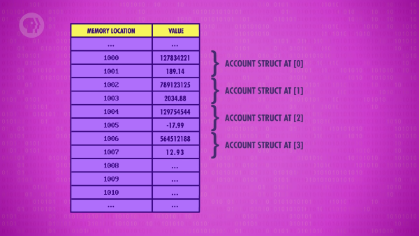

</details>

<details><summary>특정 인덱스에 접근하면, 저장된 구조체의 내용을 모두 확인할 수 있다.</summary>

- 아래와 같이 필요한 정보 전체를 가져온 후에, 계좌 번호와 잔액을 확인할 수 있다.
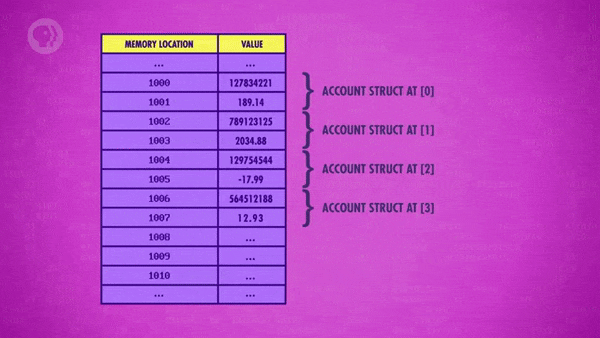

</details>

# 5. 연결 리스트

배열은 생성되는 시점에 크기가 고정되기 때문에 항목을 추가할 수 없고,  
기억 장치에 순서대로 저장되기 때문에 중간에 새로운 값을 추가하기도 어렵다.

이는 위에서 살펴봤던 '구조체로 구성된 배열' 에도 해당하는 제한 사항이지만,  
다른 형태의 구조체를 활용해 이런 제약들을 극복하고 더 복잡한 자료 구조를 구축할 수 있다.

<details><summary>'노드(Node)' 라는 구조체에 대해서 살펴보자.</summary>

- 노드는 숫자와 같은 변수와 **'포인터(Pointer)'** 를 저장한다.
- 포인터는 이름에서 알 수 있듯, 기억 장치의 특정 위치를 가리키는(point) 변수다.

```
struct node
    variable i
    pointer next
end struct
```

</details>

<br>

이런 노드 구조체를 이용해 **'연결 리스트(Linked List)'** 를 만들 수 있다.

- 연결 리스트는 많은 노드를 저장할 수 있는 유연한 자료 구조다.
- 각 노드의 포인터가 다음 노드의 주소를 가리키도록 구성되어 있다.

<br>

<details><summary>노드 구조체가 기억 장치의 위치 1000, 1002, 1008 에 각각 저장되어 있다고 가정해보자.</summary>

- 서로 다른 시간에 생성된 정보이기 때문에 간격이 있을 수 있다.
- 때문에, 각 노드 구조체 사이에 다른 정보가 저장되어 있을 수 있다.

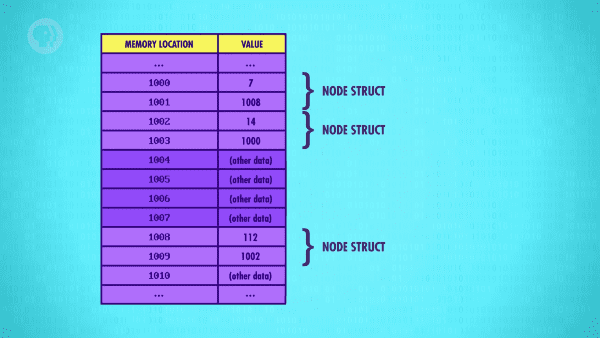

</details>

<details><summary>1. 기억 장치의 위치 1000에 있는 첫 번째 노드부터 살펴보자.</summary>

- 값에 해당하는 7과 '다음(next)' 노드의 위치를 가리키는 포인터 1008이 저장되어 있다.


</details>

<details><summary>2. 다음 노드의 위치로 이동해서 해당 노드를 살펴보자.</summary>

- 연결 리스트의 다음 항목은 '1' 에서 살펴봤듯 기억 장치의 위치 1008 에 저장되어 있다.
- 해당 노드는 112의 값과 다음 노드의 위치를 가리키는 1002라는 값을 저장하고 있다. 
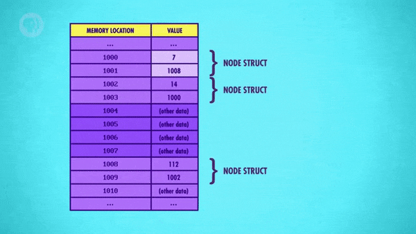

</details>

<details><summary>3. 다시, 다음 노드의 위치로 이동해서 해당 노드를 살펴보자.</summary>

- 이번 노드는 14의 값과 첫 번째 노드의 위치를 가리키는 1000이라는 값을 저장하고 있다.
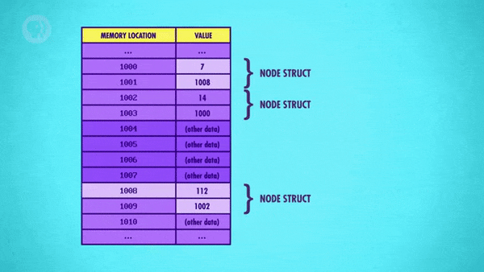

</details>

<br>

>
위에서 살펴본 연결 리스트는 순회하는(circular) 구조이지만,  
포인터 값을 널(NULL) 로 변경해 정보의 끝을 표시할 수도 있다.

<details><summary>프로그래머들이 연결 리스트를 사용할 때 포인터 값을 실제로 확인하는 경우는 드물다.</summary>

- 더 쉽게 개념화하기 위해 포인터 값 대신 아래와 같은 추상화된 연결 리스트를 이용한다.
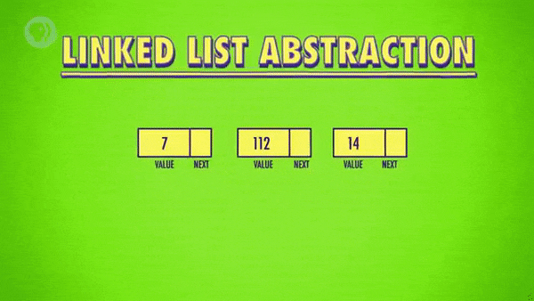

</details>

<details><summary>크기를 미리 지정해야 하는 배열과는 달리, 연결 리스트는 동적으로 크기를 조절할 수 있다.</summary>

- 기억 장치에 새 노드를 할당한 뒤에 포인터를 변경해, 새로운 값을 추가할 수 있다.
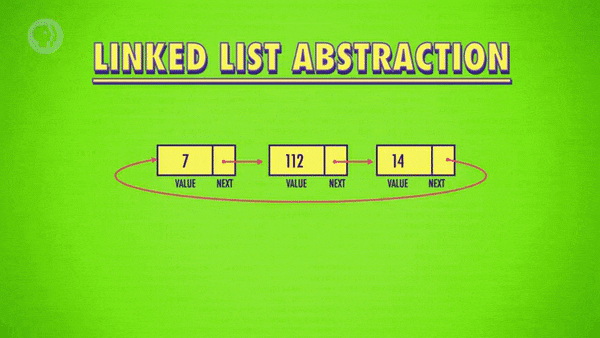

</details>

<br>

> #### 추가로,
연결 리스트는 재정렬, 잘라내기, 나누기, 뒤집기 등의 작업이 수월하기 때문에,  
지난 수업에서 살펴봤던 정렬 알고리즘을 구현하는 데에도 유용하게 사용된다.

# 6. 큐와 스택

연결 리스트의 유연성을 활용해 더 복잡한 자료 구조들을 구성할 수 있는데,  
그중에서도 가장 보편적으로 알려진 것은 **'큐(Queue)'** 와 **'스택(Stack)'** 이다.

큐는 우체국 등의 장소에서 도착한 순서대로 줄을 서 있는 상황에 비유할 수 있는데,  
당연하게도, 가장 오래 기다린(먼저 들어온) 사람이 가장 먼저 서비스를 받는다(나간다).

> 이와 같은 양상을 선입선출(First-In First-Out) 혹은 FIFO 라고 한다.

<br>

<details><summary>우체국의 상황에 비유하여 더 자세하게 살펴보자.</summary>

- 우체국의 대기열을 표현하는 연결 리스트가 있다.
- 연결 리스트의 첫 번째 노드를 가리키는 포인터가 있다.
- 이 포인터를 'postOfficeQueue' 라고 할 것이다.

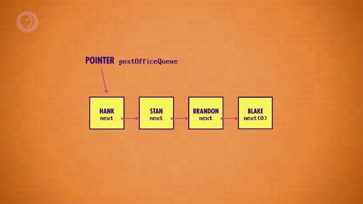

</details>

<details><summary>큐에서 특정 항목이 삭제되는 경우를 살펴보자.</summary>

- 행크의 용무가 끝나면, 다음 사람의 위치를 가리키는 포인터를 읽는다.
- 'postOfficeQueue' 의 포인터를 해당 값으로 갱신한다.
- 이렇게 행크의 연결이 해제되면서, 연결 리스트에서 제거(dequeue)된다.  
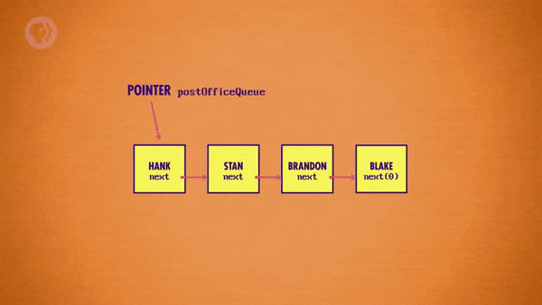

</details>

<details><summary>큐에 특정 항목을 삽입하는 경우를 살펴보자.</summary>

- 우체국 대기열에 누군가 추가되면, 마지막 항목으로 이동한다.
- 마지막 항목의 next 포인터가 추가된 사람을 가리키도록 한다.
- 이렇게 마지막 항목의 포인터가 새 항목의 주소를 가리키면서, 연결 리스트에 추가(enqueue)된다.
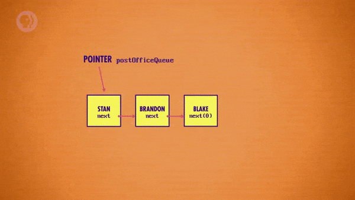

</details>

<br>

> 이렇게 큐에 정보를 삽입하는 연산은 enqueue, 삭제하는 연산은 dequeue 라고 한다.

<br>

여기서 약간만 변경하면, 연결 리스트를 스택으로 활용할 수 있다.

- 큐와 다르게 후입선출(Last-In First-Out 혹은 LIFO) 하는 자료 구조다.
- 스택은 여러 겹으로 쌓여있는 팬케이크에 비유할 수 있다.
   - 새로 만든 팬케이크는 위쪽으로 쌓인다.
   - 팬케이크를 하나 먹을 땐 위에서부터 가져간다.
- 스택에 정보를 쌓는 연산은 push, 꺼내오는 연산은 pop 이라고 한다.  
  `(상자에 '밀어 넣는', '튀어나오는' 으로 생각해도 된다.)` 

# 7. 트리

노드 구조체의 포인터를 2개로 늘리면, **'트리(Tree)'** 라는 자료 구조도 만들 수 있다.

```
struct node
    variable i
    pointer nextLeft
    pointer nextRight
end struct
```

> 트리는 다양한 알고리즘에 사용되며, 연결 리스트처럼 그림으로 개념화된다.

<br>

<details><summary>트리의 최상위 노드는 루트(Root) 라고 부른다.</summary>

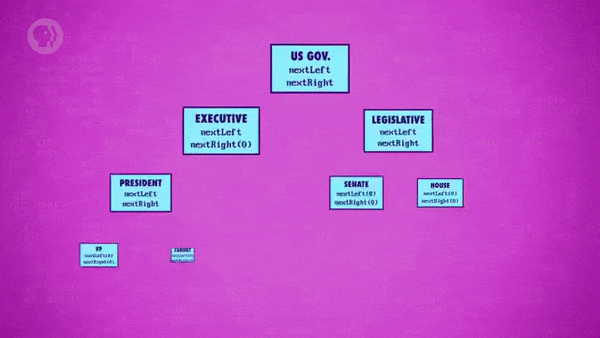

</details>

<details><summary>다른 노드에 매달려 있는 노드를 자식(Children) 이라고 부른다.</summary>

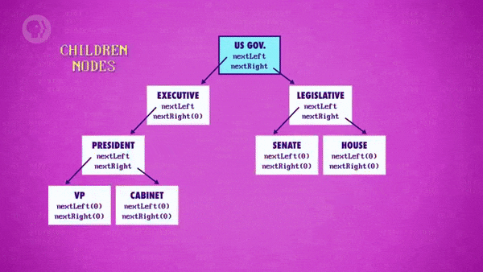

</details>

<details><summary>반대로, 자식 노드의 위에 있는 노드는 부모(Parent) 라고 부른다.</summary>

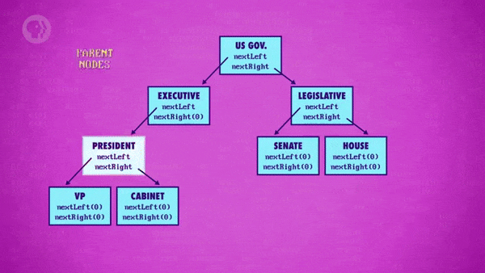

</details>

<details><summary>자식이 없는, 트리의 끝 부분에 위치한 노드를 리프(Leaf) 라고 부른다.</summary>

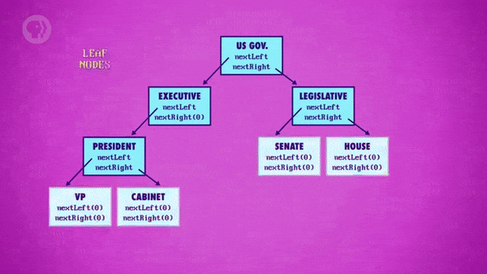

</details>

<details><summary>이렇게 구성된 트리는 '이진 트리(Binary Tree)' 라고 한다.</summary>

- 하나의 노드가 최대 2개의 자식을 갖는 특별한 형태다.
- 자료 구조를 적절하게 수정하면 최대 자식의 수를 늘릴 수도 있다.
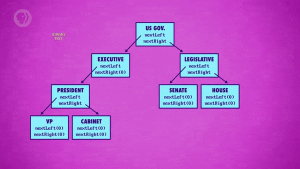

</details>


<br>

>
또, 트리에 연결된 모든 노드를 연결 리스트에 저장해 트리 노드를 만들 수 있다.  
`(You can even have tree nodes that use linked lists to store all the nodes they point to.)`

# 8. 그래프

루프처럼 비교적 자유로운 형태로 연결된 정보를 다뤄야 하는 경우,  
단방향 연결 구조의 트리 대신에 **'그래프(Graph)'** 를 이용할 수 있다.

<br>

>
['13. 알고리즘 소개'](/Computer Science/Crash Course/13. 알고리즘 소개/#6-그래프-탐색)
에서 도로로 연결된 도시들을 예시로 살펴봤다.

<br>

- 그래프는 트리처럼 여러 개의 포인터를 갖는 노드들을 저장한다.
- 이 때, 각각의 노드는 자신이 아닌 다른 노드들을 가리킬 수 있다.
- 때문에, 루트, 리프, 부모, 자식 등 노드 간의 관계에 대한 개념이 없다.

# 9. 다양한 자료 구조

지금까지, 컴퓨터 과학에서 사용되는 거의 모든 기본적인 자료 구조들을 살펴봤는데,  
프로그래머들은 이와 같은 기본 개념들을 변형하여 새로운 형태의 자료 구조들을 만들어왔다.

> 레드-블랙 트리(Red-Black Tree), 힙(Heap) 등을 예로 들 수 있다.

이런 다양한 자료 구조들은 특정 연산에 더 유용하도록 설계되어 있기 때문에,  
상황에 적합한 자료 구조를 선택하면 문제를 더 효율적으로 해결할 수 있게 된다.

> 따라서, 작업을 시작하기 전에 정보를 어떻게 구조화할지부터 생각해두는 것이 중요하다.

# 10. 자료 구조에 관하여,

다행히, 대부분의 프로그래밍 언어에서는 자료 구조 라이브러리를 제공한다.

> C++ 의 'Standard Template Library', Java 의 'Java Class Library' 를 예로 들 수 있다.

<br>

덕분에 프로그래머들은 기본적인 요소의 구현에 필요한 시간을 절약함과 동시에,  
다양한 자료 구조들을 활용하는 여러 가지 일들을 더 쉽게 처리할 수 있게 되었고,

이는, 다시 한 번 새로운 추상화를 가능하게 했다.


# 배운 점, 느낀 점

처음 들어본 자료 구조인 구조체, 포인터, 노드에 대해 알게됐고,  
자세하게는 아니지만 여러 형태를 가지는 자료 구조의 구성 원리를 배웠다.

정보를 체계적으로 정리해 다루는 것이 중요한 이유에 대해 깨달았고,  
'문제를 다양한 관점에서 바라보기 위해 더 많이 공부해야겠다' 는 생각이 들었다.

## 1.

- 쉽게 검색, 확인할 수 있도록 체계적으로 정돈된 정보 형태인 자료 구조
- 기억 장치에 단일 값이 아닌, 여러 값을 연속적으로 저장하는 배열
- 배열 안에 있는 항목들의 위치를 표시하기 위해 사용하는 인덱스
- 문자, 숫자, 기호와 같은 문자들이 저장된 배열인 문자열
- 연속적으로 저장된 정보의 끝을 나타내는 문자인 널 문자
- 여러 배열로 구성된 배열로 다양한 규모, 차원을 표현하는 행렬

<br>

자료 구조를 사용하는 이유가 정보를 더 효율적으로 다루기 위함임을 배웠다.

배열을 리스트, 벡터라고 부르기도 한다는 것을 알게됐고,  
기억 장치에는 각 항목이 순서대로 저장된다는 것을 배웠다.

배열의 인덱스가 배열이 저장된 위치와 특정 항목의 위치 차이인 오프셋을 나타낸다는 것을 알게됐다.

문자열이 배열이라는 사실과 기억 장치에 한 문자씩 저장된다는 것을 알게됐다.

실제 2진수 0을 이용해서 NULL 이라는 값을 표현한다는 것과  
연속적인 정보들이 끝나는 위치를 표시하는 데 사용된다는 것을 알게됐다.

여러 배열로 구성된 배열을 행렬이라 한다는 것을 배웠고,  
여러 차원의 정보를 저장할 수도 있다는 사실을 알게됐다.

## 2.

- 서로 관련이 있는 정보들을 하나의 블록으로 묶어 저장하는 구조체
- 기억 장치의 특정 위치를 가리키는 변수인 포인터
- 값과 포인터에 대한 정보를 저장하는 구조체인 노드
- 각 노드가 다음 노드를 가리키도록 구성된 노드 구조체의 배열인 연결 리스트

<br>

여러 정보를 한 번에 저장하는 구조체에 대해 배웠다. `(처음 들어봤다;)`

구조체에 저장된 정보가 기억 장치에 묶여서 저장된다는 것을 배웠다.

포인터가 기억 장치의 위치를 가리키는 변수라는 것을 배웠다.

정보와 포인터로 구성된 구조체를 노드라고 한다는 것을 배웠다.

연결 리스트가 여러 노드를 연속적으로 연결한 자료 구조라는 것을 배웠다.

추상화된 그림 덕분에 연결 리스트를 더 쉽게 이해할 수 있었다.

## 3.

- 연결 리스트로 구성되어 정보를 선입선출하는 큐와 후입선출하는 스택
- 여러 포인터를 활용하여 명확한 계층 관계를 표현하는 트리
- 하나의 노드가 최대 2개의 자식을 갖는 형태의 트리인 이진 트리
- 자기 자신이 아닌 다른 노드를 가리키는 여러 개의 노드로 구성된 그래프
- 작업을 시작하기 전에 정보의 구조화를 통해 적합한 자료 구조를 선택해야 한다는 사실

<br>

큐와 스택이 연결 리스트의 변형이라는 사실을 알게됐다.

그림 덕분에 선입선출, 후입선출이라는 개념의 원리를 쉽게 이해할 수 있었다.

포인터를 여러 개 사용한 구조체로 트리를 구성할 수 있다는 것을 배웠다.

하나의 노드가 2개의 포인터로 자식을 가리키는 형태를 이진 트리라 한다는 것을 배웠다.

여러 개의 노드가 서로를 가리키는 자유로운 형태의 자료 구조가 그래프라는 것을 배웠다.

작업 시작 전에 자료 구조, 알고리즘을 생각해야 하는 이유에 대해 배웠다.

(해당 글의 작성 과정은 
[post/crash-course/14 (#105)](https://github.com/ensia96/ensia96.github.io/pull/105)
에서 확인하실 수 있습니다.)
