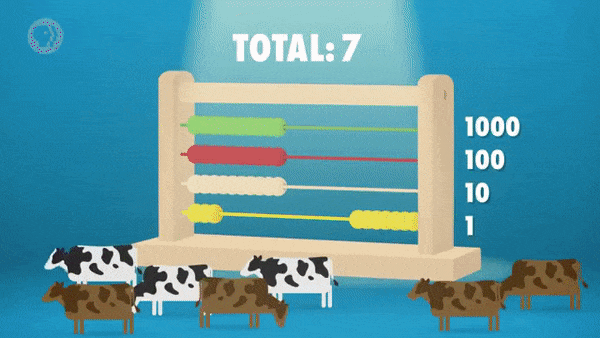
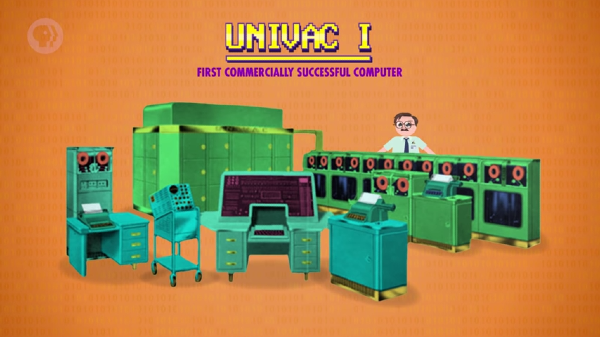
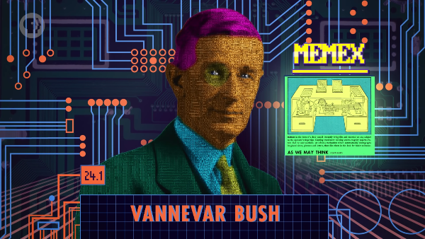
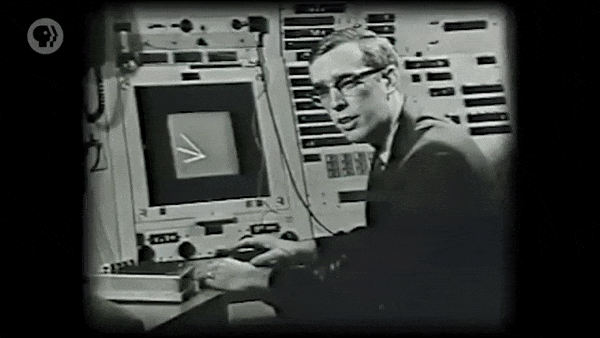
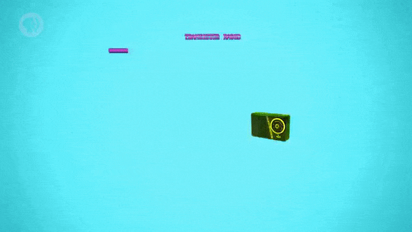
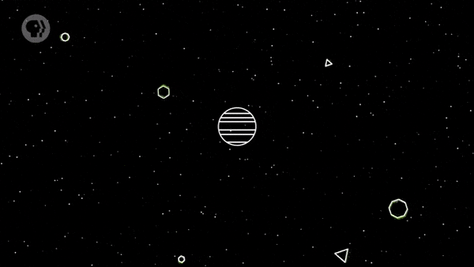
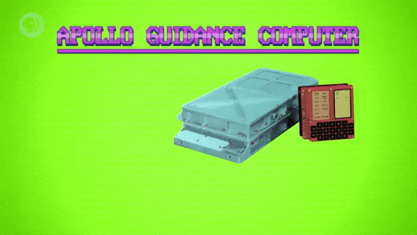
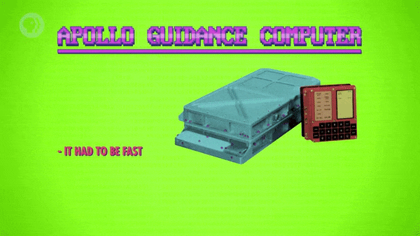
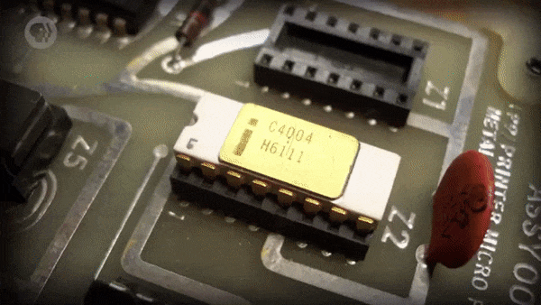
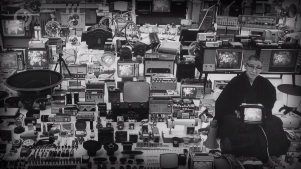

>
해당 포스트는 아래 수업의 내용을 바탕으로 작성되었습니다.
> - ['Crash Course - Computer Science'](https://www.youtube.com/playlist?list=PL8dPuuaLjXtNlUrzyH5r6jN9ulIgZBpdo)
>
\- Youtube :
['Crash Course'](https://www.youtube.com/channel/UCX6b17PVsYBQ0ip5gyeme-Q)  
\- Professor : ['Carrie Anne Philbin'](https://about.me/carrieannephilbin)

# 0. 시작하기에 앞서,

강의 초반부에서 우리는, 1940년대 중반까지의 컴퓨팅의 역사에 대해 살펴봤었다.

- 이는, 문명의 시작부터 전자 범용 컴퓨터가 등장하기까지의 내용이었다.

 

지난 23편의 수업의 내용은 전부, 대략 30년 사이에 일어난 일들이었다.

> 프로그래밍 언어, 컴파일러, 알고리즘, 집적 회로, 플로피 디스크, 운영 체제, 전신타자기, 화면 등

- 1940년대 중반부터 1970년대 중반까지 등장한 많은 요소에 대해 살펴봤었다.

 

이러한 시기는 Apple, Microsoft 와 같은 회사들이 존재하기 이전의 컴퓨팅 시대였다.

> 그리고 이는, 아무도 트윗, 구글링, 우버 요청 등을 할 수 없던 시기였다.

 

또한, 강의 후반부에서 다룰 다양한 주제들이 등장할 수 있도록 기반을 다지던 시기였다.

> 개인용 컴퓨터, 월드 와이드 웹, 자율 주행 자동차, 가상 현실 등

 

이번 수업에서는, 회로와 알고리즘이 아닌, 이러한 영향력 있는 시기에 대해 검토해볼 것이다.

> 냉전, 우주 경쟁, 세계화와 소비주의의 부상 등의 역사적 배경에 주목할 것이다.

# 1. 냉전 시기의 컴퓨팅

제2차 세계대전이 끝난 직후인 1945년, 미국과 소련 사이에 긴장감이 감돌았다.

> 그렇게 **'냉전(Cold War)'** 이 시작되었고, 과학과 공학에 대한 막대한 정부 지출이 시작되었다.

 

전쟁에서 맨해튼 프로젝트와 나치 통신 해독 등에 기여한 컴퓨팅의 가치는 이미 입증된 상태였다.

> 덕분에, 컴퓨팅 분야는 정부로부터 풍족한 재정 지원을 받을 수 있었다.

 

이러한 재정 지원 아래에서, 거대한 규모의 컴퓨팅 프로젝트를 수행할 수 있었다.

> 이는, 이전의 수업에서 다뤘던 ENIAC, EDVAC, Atlas, Whirlwind 등을 포함한다.

 

재정 지원은 상업적인 분야만으로는 불가능했을 정도의 빠른 기술 발전을 촉진했다.

> 컴퓨팅 프로젝트는 보통, 판매를 통한 개발 비용 회수만을 기대할 수밖에 없었다.

# 2. 상업용 컴퓨터의 등장

이러한 양상은 1950년대 초, 특히, '유니박(UNIVAC)' 의 등장과 함께 변화하기 시작했다.

- 유니박은 에커트와 모클리가 개발한 최초의 상업용 컴퓨터이며, 상업적으로 성공했다.
- 단일 컴퓨터인 ENIAC, Atlas 와는 달리, 컴퓨터 모델이었으며, 총 40개 이상 제작되었다.

 

유니박은 대부분, 최첨단 기술에 대한 비용을 감당할 만큼 자본력 있는 곳에서 사용되었다.

> 당시, 성장 중이던 군사 산업 단지의 대기업이나 관공서 등을 예로 들 수 있다.

 

유니박은 1952년 미국 대통령 선거 결과 예측에 사용된 것으로도 유명하다.
> 미국 원자력 위원회에 설치된 유니박을 CBS 라는 방송사에서 사용했다.

- 유니박은 개표된 1%의 표로 아이젠하워의 압승을 정확하게 예측했다.
   - 반면에, 전문가들은 스티븐슨을 지지했다.
- 이 사건은 컴퓨팅에 대한 대중들의 관심을 끌어내는 데 도움이 되었다.

# 3. 컴퓨팅의 잠재력

컴퓨팅은 일반적으로 인간의 신체적 능력을 증강하는 과거의 기계와는 달랐다.

- 트럭을 이용하면, 사람들은 더 많은 물건을 운반할 수 있었다.
- 자동 직기는 사람보다 더 빨랐으며, 공작 기계는 더 정확했다.
- 이러한 장치들 외에도 산업 혁명을 대표하는 수많은 장치가 있었다.
- 이들과는 다르게, 컴퓨터는 인간의 지적 능력을 증강할 수 있었다.

'Vannevar Bush' 는 이러한 컴퓨팅의 잠재력을 놓치지 않았다.

그는 'Memex' 라는 가상 컴퓨팅 장치를 고안했고, 1945년에 관련 기사를 발표했다.

>
A memex is a device in which an individual stores all his books, records, and communications,  
and which is mechanized so that it may be consulted with exceeding speed and flexibility.  
It is an enlarged intimate supplement to his memory.  
\- Vannevar Bush
>

>
메멕스는 개인이 자신의 모든 장부, 기록 및 통신을 저장하는 장치이며,  
기계화되어 있기 때문에, 참조될 때 엄청난 속도와 유연성을 지닐 수 있다.  
그것은 그의 기억을 확장하는 사적인 보충 장치다.

그는 또한 완전히 새로운 형태의 백과사전이 나타날 것이라고 예언했다.

>
Wholly new forms of encyclopedias will appear,  
ready made with a mesh of associative trails running through them, ...  
\- Vannevar Bush
>

>
완전히 새로운 형태의 백과사전이 나타날 것이며,  
그들을 통과하는 연관성 있는 자국들이 그물망을 이루며 기성품이 될 것이다.

> #### 글쓴이 안내
원문과 번역이 모두 완벽하지 않으니, 아래의 문서들을 참고 바랍니다.
>
\- 참고1 (원문) :
['As We May Think - The Atlantic'](https://www.theatlantic.com/magazine/archive/1945/07/as-we-may-think/303881)

>
\- 참고2 (번역) :
['미디어와 사이버공간: As we may think (by Vannebar Bush)'](http://literarynote.kr/wiki/index.php/Literarynote/Vannebarbush)

메멕스는 이후에 등장할 몇몇 혁신적인 체계에 대해 직접적인 영향을 주었다.

- 지난 수업에서 살펴본 'Ivan Sutherland' 의 스케치패드를 예로 들 수 있다.
- 이후의 수업에서 살펴볼 'Doug Engelbart' 의 온라인 시스템도 마찬가지다.

 

부시는 미국 '과학연구개발국(Office of Scientific Research and Development)' 의 책임자였다.

> 과학연구개발국은 제2차 세계대전 중 과학 연구에 대한 재정 지원과 조직화를 담당했다.

냉전이 발발하고, 부시는 '미국 국립과학재단(National Science Foundation)' 의 설립을 위해 노력했다.

> 미국 국립과학재단은 1950년에 설립되었으며, 평시의 과학연구개발국이라고 할 수 있었다.

미국 국립과학재단은 오늘날까지도 미국의 과학 연구를 지원하기 위해 연방 기금을 제공한다.

> 이렇게 충분한 지원은, 미국이 기술 부문에서 선두를 유지할 수 있도록 하였다.

# 4. 산업 경쟁의 시작

소비자들이 트랜지스터로 작동하는 장치를 구매하기 시작한 것도 1950년대였다.

- 그중에서도 눈에 띄는 것은, 작고 튼튼하면서, 배터리로 구동되는 '트랜지스터라디오' 였다.
- 또한, 1940년대와 그 이전에 사용되던 진공관 기반 라디오 세트와는 달리 휴대성이 뛰어났다.
- 이러한 트랜지스터라디오는 당시로써는 혁명적인 발명품이었으며, 말도 안 되는 성공을 거뒀다.

 

전후 경제를 부양하기 위해 산업적인 기회를 찾고 있던 일본 정부는 곧 행동하기 시작했다.

- 1952년에 벨 연구소에서 트랜지스터에 대한 권리를 허가받았다.
- 일본 반도체 및 전자 공학 산업들이 성장할 수 있도록 지원했다.

 

1955년에는 Sony 의 첫 번째 제품인 'TR-55' 트랜지스터라디오가 출시되었다.

- 품질과 가격에 집중한 일본 기업들은, 불과 5년 만에 미국 휴대용 라디오 시장의 절반을 차지했다.
- 그리고, 이 사건은 향후 수십 년 동안 이어질, 주요 산업 경쟁의 시작을 알리는 신호탄이 되었다.

# 5. 우주 경쟁

1953년, 컴퓨터는 지구 전체를 통틀어 약 100대 정도밖에 없었다.

- 소련은 1950년에 처음으로 프로그래밍 가능한 전자 컴퓨터를 완성했다.
- 이렇게, 소련은 컴퓨팅 기술에 있어 서구보다 몇 년 정도 뒤처져 있었다.

 

그러나, 소련은 급증하는 '우주 경쟁(Space Race)' 에서는 훨씬 앞서고 있었다.

- 1957년, 소련은 세계 최초의 인공위성 '스푸트니크 1호(Спутник-1)' 를 궤도로 발사했다.
- 몇 년 후인 1961년, 소련의 'Yuri Gagarin' 은 우주에 다녀온 최초의 인간이 되었다.

 

이러한 사실은 미국 대중의 자존심을 건드렸고, 케네디 대통령을 자극했다.

> 가가린의 임무로부터 한 달 후, 케네디는 10년 이내에 사람을 달에 보내도록 국가를 부추겼다.

 

하지만, 사람을 달에 보내기 위해서는 엄청나게 큰 비용이 필요했다.

- NASA의 예산은 거의 10배 증가하여, 1966년에는 연방 정부 예산의 약 4.5%로 정점을 찍었다.
- 오늘날 NASA의 예산이 0.5% 내외라는 점을 생각해보면, 이는 엄청난 비용에 해당하는 것이다.

 

NASA는 이렇게 지원받은 자금을 사용하여 엄청난 도전 과제들을 해결했다.

- 아폴로 계획이 절정에 이르렀을 때는, 약 400,000명의 직원이 고용되었다.
- 더 나아가, 20,000군데 이상의 대학과 기업에서도 추가적인 지원을 받았다.

# 6. 집적 회로로의 전환

이러한 우주 경쟁에서의 거대한 도전 과제 중 하나는 우주 탐사였다.

- NASA는 복잡한 궤도를 처리하고 우주선에 유도 명령을 내릴 컴퓨터가 필요했다.
- 이를 위해, '아폴로 안내 컴퓨터(Apollo Guidance Computer)' 가 개발되었다.

 

아폴로 안내 컴퓨터의 개발에 대해, 세 가지 중요한 요구 사항이 있었다.

첫 번째, (당연한 이야기지만,) 컴퓨터의 속도가 빨라야 한다.

두 번째, 컴퓨터의 크기는 아주 작고, 무게는 가벼워야 한다.

- 우주선의 공간이 좁고, 달까지 먼 거리를 비행하려면 작은 무게라도 줄여야 하기 때문이다.

마지막으로, 정말 믿을 수 없을 정도로 안정적이어야 한다.

- 왜냐하면, 우주선에는 진동, 방사선, 온도 변화 등의 요인이 많기 때문이다.

 

당시의 기술들(진공관과 이산 트랜지스터) 은 이러한 조건에 부합하지 않았다.

- 그래서 NASA는, '집적 회로' 라는 새로운 기술로 눈을 돌렸다.
>
집적 회로에 대한 내용은
['17. 집적 회로와 무어의 법칙'](/Computer Science/Crash Course/17. 집적 회로와 무어의 법칙/#3-집적-회로)
에서 다뤘다.
- 아폴로 안내 컴퓨터는 집적 회로가 적용된 최초의 컴퓨터였다.
> 그리고, 이는 전형적인 컴퓨터에 대한 인식을 크게 바꿔놓았다.

 

또, 당시에 집적 회로에 대한 비용을 감당할 수 있는 곳은 NASA가 유일했다.

- 컴퓨터는 초기 가격이 '칩 하나당 약 50달러' 였던 집적 회로를 수천 개나 필요로 했다.
- 하지만, 이러한 비용을 지불한 덕분에, 미국은 소련과의 우주 경쟁에서 이길 수 있었다.

# 7. 컴퓨팅 장치의 상품화

아폴로 안내 컴퓨터는 집적 회로의 개발과 채택을 촉진한 것으로 유명하다.

- 하지만, 당시의 집적 회로는 소량 생산(low-volume) 품목에 불과했다.
   - 아폴로 임무는 전부 합쳐도 고작 17개에 불과했기 때문이다.
- 집적 회로가 대량 생산(mass-produced) 될 수 있던 이유는 따로 있었다.
   - 바로, 군사적인 응용, 특히 'Minuteman' 과 'Polaris' 였다.

 

이러한 발전은 미국이 거대한 강력한 컴퓨터를 개발하고 구매하면서 더욱 가속화되었다.

- 사람들은 이러한 컴퓨터들을 보통 '슈퍼컴퓨터(supercomputer)' 라고 불렀다.
- 왜냐하면, 출시 당시, 지구 상의 다른 어떤 컴퓨터보다도 10배 이상 빨랐기 때문이다.

 

하지만, 슈퍼컴퓨터들은 거의 정부 기관에서만 구매할 수 있을 정도로 엄청나게 비쌌다.

- CDC, Cray, IBM과 같은 회사에서 개발된 슈퍼컴퓨터들이 이에 해당한다.
- 미국 국가안보국(NSA) 과 같은 정부 기관이나 정부 연구 기관에서 사용되었다.
   - 로렌스 리버모어 국립 연구소, 로스앨러모스 국립 연구소 등

 

이렇게 초기의 미국 반도체 산업은 고수익의 정부 계약에 힘입어 호황을 누렸다.

> 하지만, 이는 대부분의 미국 기업들이 이윤이 적은 소비자 시장을 간과했음을 의미했다.

- 일본 반도체 산업은 1950, 60년대에 적은 이윤으로 운영을 유지하며, 틈새시장을 지배했다.
- 또, 규모의 경제를 실현하기 위해, 제조 능력의 발전을 위해 엄청나게 많은 금액을 투자했다.
> 품질 및 수율 향상을 위한 연구, 제조 비용을 낮추기 위한 자동화 등

 

1970년대, 우주 경쟁과 냉전이 잠잠해지면서, 방위 계약의 수는 줄어들기 시작했다.

- 그에 따라, 미국의 반도체 및 전자 제품 회사들은 점점 더 경쟁력을 잃어가고 있었다.
- 많은 컴퓨터 부품들은 **'상품화(Commoditization)'** 추진에 크게 도움이 되지 않았다.
   - 아무리 뛰어난 집적 회로라도, DRAM은 그저 DRAM일 뿐이었기 때문이다.
   - 또, 비싼 인텔 제품을 히타치에서는 훨씬 더 저렴하게 구매할 수 있었다.

# 8. 마이크로프로세서의 등장

1970년대에 걸쳐, 미국 기업들은 규모를 축소하거나, 합병하거나, 완전히 도산했다.

- 1974년, 인텔은 전체 직원의 1/3을 해고할 수밖에 없었다.
- 그 유명한 페어차일드 반도체조차, 파산 직전인 1979년에 인수되었다.

 

많은 기업이 생존을 위한 비용 절감을 위해, 제조업을 위탁하기 시작했다.

- 인텔은 주력 생산 제품 범주(category) 에서 메모리 집적 회로를 제외했다.
- 그리고, 프로세서 제조에 다시 집중하기로 했고, 결국, 회사를 되살리는 데 성공했다.

 

이러한 미국 전자 산업의 저조는 일본 기업이 컴퓨팅 제품 시장을 독점하도록 했다.

- Sharp, Casio 등의 기업들은 휴대용 전자계산기를 판매하기 시작했다.
- 휴대용 전자계산기는 1970년대에 등장한 획기적인 컴퓨팅 제품이었다.
- 집적 회로를 사용해, 휴대용 전자계산기를 작고 저렴하게 만들 수 있었다.

 

휴대용 전자계산기는, 당시 사무실에서 볼 수 있던 고가의 데스크톱 계산기들을 대체했다.

- 거의 모든 사람이 종이에 적어서 직접 계산하거나, 계산자를 사용하던 시기였다.
- 휴대용 전자계산기의 등장은 엄청난 혁신이었고, 순식간에 수백만 대씩 팔려나갔다.
- 이러한 소비 시장에서의 흥행 덕분에, 집적 회로의 가격은 더욱 저렴해졌다.

 

또한, 이는 'Intel 4004' 와 같은 마이크로프로세서의 개발과 보급으로 이어졌다.

- 'Intel 4004' 는 일본의 계산기 제조사 'BUSICOM' 의 요청으로 제작되었다.
- ['7. 중앙 처리 장치 (CPU)'](/Computer Science/Crash Course/7. 중앙 처리 장치 (cpu)/#8-최초의-cpu)
  에서 살펴봤듯, 1971년에 인텔에서 만들어졌다.

# 9. 컴퓨팅 장치의 대중화

얼마 지나지 않아, 일본에서 제조한 전자 제품들은 어디에서나 볼 수 있게 되었다.

- 비디오카세트 레코더 텔레비전, 디지털 손목 시계, 워크맨 등

 

저렴한 마이크로프로세서의 효용은 아주 새로운 제품의 탄생으로 이어졌다.

- 이로 인해, 비디오 게임방(video arcade) 이 등장하게 되었다.

- 1972년, 세계 최초의 아케이드 비디오 게임인 'Pong' 이 출시되었다.
- 1976년에는 'Pong' 의 영향을 받은 'Breakout' 이라는 게임도 출시되었다.

 

가격은 계속 저렴해졌고, 평범한 사람들도 컴퓨팅 장치를 구입할 수 있게 되었다.

- 1975년에는 'Altair 8800' 과 같은 최초의 가정용 컴퓨터가 등장했다.
- 1977년에는 'Atari 2600' 과 같은 최초의 가정용 게임 콘솔이 등장했다.
- 이러한 가정용(home) 컴퓨팅 장치의 등장은 완전히 새로운 시대를 열었다.

# 10. 컴퓨팅의 발전에 관하여,

불과 30년 만에, 컴퓨터에 관련된 기술들은 엄청난 속도로 발전했다.

>
CPU 내부에서 사람이 걸어 다닐 수 있을 정도로 컸던 기계 장치에서,  
어린이가 갖고 노는 휴대용 장치에 마이크로프로세서가 탑재되기까지..

 

이러한 극적인 발전은 정부와 소비자라는 강력한 영향력 없이는 불가능했을 것이다.

- 냉전 당시의 미국처럼, 재정 지원 덕분에 초기의 많은 컴퓨팅 기술들이 빠르게 적용될 수 있었다.
- 또, 이러한 자금력은 컴퓨팅과 관련된 전체 산업이 충분히 성장할 때까지, 버팀목이 되어주었다.
- 기술이 발전하고 상업적 실현이 가능해지면서, 기업과 소비자들은 이를 주류로 삼을 것을 요구했다.

 

냉전은 이미 한참 전에 끝났지만, 이러한 관계는 오늘날까지도 이어지고 있다.

> 과학 연구에 대한 정부 지원, 정보기관들의 슈퍼컴퓨터 구매, 우주를 향한 인간의 노력 등..

 

그리고 오늘날, 우리는 텔레비전, Xbox, 노트북, 스마트폰을 계속 사용하고 있다.

> 이러한 이유로, 컴퓨팅은 계속해서 더욱 빠른 속도로 발전하고 있다.

# 배운 점, 느낀 점

제2차 세계대전 직후, 냉전 시기 동안 있었던 컴퓨팅의 발전에 대해 배웠다.

- 냉전이 발발하고, 전쟁에서의 기여를 인정받은 컴퓨팅은 정부로부터 엄청난 재정 지원을 받았다.
- 컴퓨팅 분야는 자금 확보 수단이 부족했지만, 이러한 지원 덕분에 빠른 속도로 성장할 수 있었다.
- 1950년대 초, 상업용 컴퓨터 유니박의 등장으로 정부 지원에 의존하던 양상이 바뀌기 시작했다.
- 하지만, 상업적인 성공에도 불구하고, 비싼 가격으로 인해 정부 기관이나 대기업에서만 사용되었다.

 

소비자 시장에 전자 제품이 등장했던 시기의 시대적 배경에 대해 배웠다.

- 전시에 과학 연구를 관리하던 기관의 책임자 버니바 부시는 컴퓨팅의 잠재력을 알아봤다.
- 선구적인 시각으로 메멕스를 고안했던 그는, 과학 연구의 지원을 지속하기 위해 노력했다.
   - 이후, 미국 국립과학재단이 설립된 덕분에, 미국의 기술력은 꾸준히 발전할 수 있었다.
- 이와 비슷한 시기에, 소비자 시장에는 트랜지스터라디오라는 혁명적인 발명품이 등장했다.
- 일본 정부는 이러한 흥행을 경제 부양의 기회로 봤고, 여러 산업체의 성장을 지원했다.
   - 그렇게, 소니의 신제품과 함께 미국의 휴대용 라디오 시장의 점유율을 높이기 시작했다.

 

냉전 중에 일어난 우주 경쟁과 우주 탐사를 위해 개발된 아폴로 안내 컴퓨터에 대해 배웠다.

- 소련은 미국보다 컴퓨팅 기술이 뒤처져 있었지만, 우주 기술은 훨씬 앞서고 있었다.
   - 최초의 인공위성 스푸트니크 1호로 시작, 최초의 우주인 유리 가가린에서 정점을 찍었다.
- 소련의 기술적 선전에 자극받은 미국은 우주 기술 개발에 재정적인 지원을 쏟아부었다. 
- 당시, 미국은 우주 경쟁에서 이기는 방법이 우주 탐사에 성공하는 것뿐이라 생각했다.
   - 이러한 목표를 달성하기 위해선, 복잡한 계산을 험악한 환경에서 처리할 수 있어야 했다.
- 그렇게, 집적 회로라는 안정성 있는 기술이 적용된 아폴로 안내 컴퓨터가 개발되었다.

 

냉전과 우주 경쟁이 사그라지면서, 소비자 시장의 중요성이 커졌다는 것을 배웠다.

- 군사적으로 응용된 컴퓨팅 분야는 고수익의 정부 계약을 바탕으로 엄청난 호황을 누렸다.
   - 덕분에, 집적 회로가 대량 생산될 수 있었고, 이는 슈퍼컴퓨터의 개발로 이어졌다.
- 냉전, 우주 경쟁이 잠잠해져 정부 계약이 줄었고, 미국 기업은 경쟁력을 잃어가기 시작했다.
   - 반대로, 소비자 시장을 겨냥한 일본 반도체 산업의 제조 능력은 엄청난 발전을 이뤘다.
- 그렇게, 컴퓨팅 제품의 상품화에 성공한 일본 기업들이 소비자 시장을 독점하게 되었다.
   - 미국 기업들은 위기를 극복하기 위해, 컴퓨팅 제품에 사용되는 프로세서 제조에 집중했다.

 

소비자 시장에서의 흥행 덕분에, 가정용 컴퓨팅 장치가 등장할 수 있었다는 것을 배웠다.

- 당시, 일본 기업들은 휴대용 전자계산기를 판매했고, 이는 사무실에서 엄청난 인기를 끌었다. 
   - 덕분에, 집적 회로의 가격은 저렴해졌고, 이는 마이크로프로세서의 개발로 이어졌다.
- 마이크로프로세서의 등장으로, 다양한 전자 제품이 소비자 시장에서 판매되기 시작했다.
   - 이후, 마이크로프로세서의 가격도 저렴해지면서, 가정용 컴퓨팅 장치가 등장할 수 있었다.

(해당 글의 작성 과정은 
[post/crash-course/24 (#116)](https://github.com/ensia96/ensia96.github.io/pull/116)
에서 확인하실 수 있습니다.)
