>
해당 포스트는 아래 수업의 내용을 바탕으로 작성되었습니다.
> - ['Crash Course - Computer Science'](https://www.youtube.com/playlist?list=PL8dPuuaLjXtNlUrzyH5r6jN9ulIgZBpdo)
>
\- Youtube :
['Crash Course'](https://www.youtube.com/channel/UCX6b17PVsYBQ0ip5gyeme-Q)  
\- Professor : ['Carrie Anne Philbin'](https://about.me/carrieannephilbin)

# 0. 시작하기에 앞서,

전자 컴퓨팅의 초기 30년간, 컴퓨터를 혼자만 사용한다는 발상은 드물었다.

- 왜냐하면, 당시의 컴퓨터는 개인이 소유하고 사용하기에는 너무 비쌌기 때문이다.
> 지난 수업에서 살펴봤던 **'개인용 컴퓨터(Personal Computer)'** 말이다.

 

하지만, 1970년대 초반까지, 컴퓨터 구성에 필요한 부품들은 모두 저렴해졌다.

- 그럼에도, 컴퓨터는 여전히 강력했고, 장난감이 아닌 도구로써 유용하게 사용되었다.

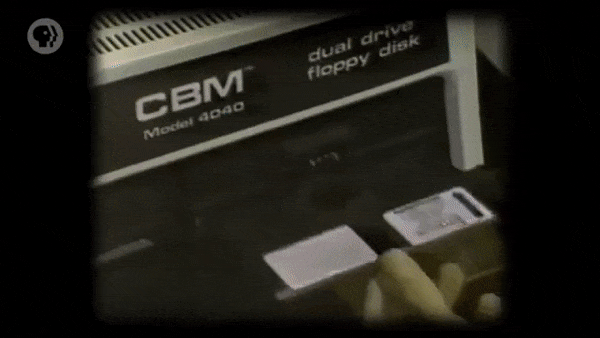

이것에 가장 큰 영향을 준 것은 '단일 칩 CPU(Single Chip CPU)' 의 등장이었다.

- 이러한 단일 칩 CPU는 엄청나게 강력한 성능을 지녔음에도, 작고 저렴했다.

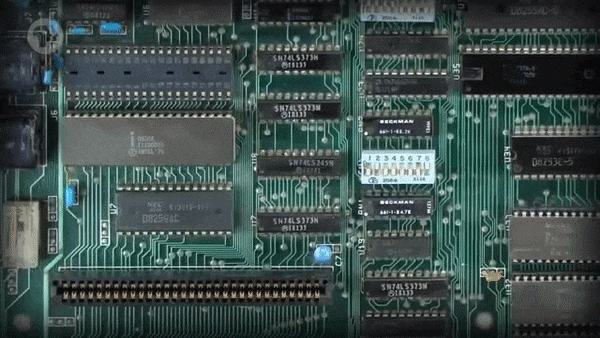

집적 회로의 발전은 또한 솔리드 스테이트 메모리의 가격을 저렴하게 만들었다.

- 이러한 솔리드 스테이트 메모리는 컴퓨터 RAM과 ROM에서 사용되었다.

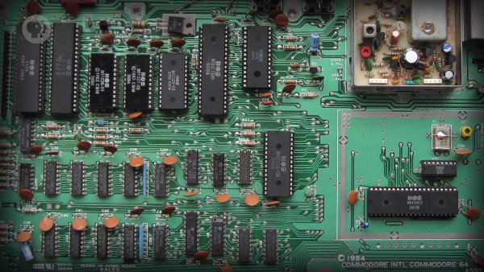

또, 비용 절감 덕분에 컴퓨터 전체를 하나의 회로 기판에 구성할 수 있게 되었다.

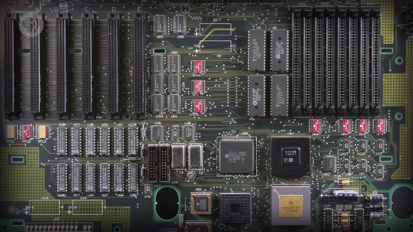

게다가, 당시에 있었던 다양한 컴퓨터 저장 장치들은 저렴하면서도 안정적이었다.

- 자기 테이프 카세트와 플로피 디스크 등을 예로 들 수 있다.

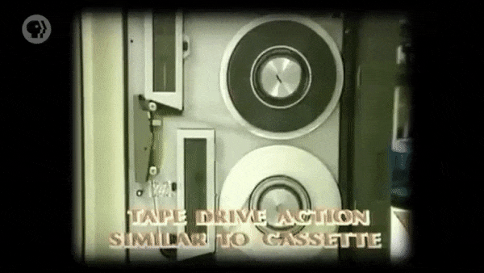

컴퓨터의 마지막 구성 요소는 텔레비전을 개조한, 저렴한 가격의 디스플레이였다.

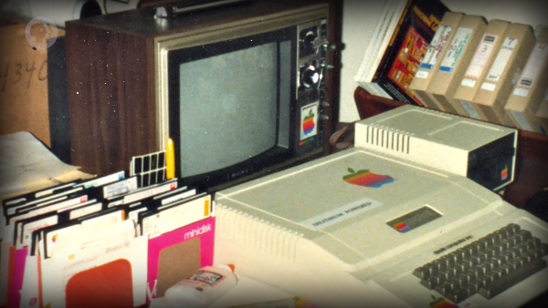

 

1970년대에는 위의 요소들이 합쳐진 **'마이크로컴퓨터(Microcomputer)'** 가 등장했다.

> 당시, 기업이나 대학에서 사용되던 '일반적인' 컴퓨터와 비교하면, 크기가 훨씬 작았다.

 

하지만, 작은 크기보다 더 중요한 것은 컴퓨터 가격이 충분히 저렴해졌다는 것이다.

- 개인이 혼자서 사용하기 위해, 한 대의 컴퓨터를 구매하는 것이 가능해진 것이다.
- 시분할 시스템과 다중 사용자 접속 없이, 단 한 명의 소유자와 사용자만 존재했다.

 

이렇게, 마이크로컴퓨터의 등장과 함께, 개인용 컴퓨터의 시대가 도래했다.

# 1. 최초의 개인용 컴퓨터

결국, 컴퓨터의 가격과 성능은 개인용 컴퓨터가 등장할 수 있는 수준이 되었다.

- 하지만, 이것이 정확히 어느 시점에 일어난 일인지를 정의하는 것은 매우 어렵다.
- 때문에, '최초의(first)' 개인용 컴퓨터라는 타이틀을 놓고 경쟁하는 사람들이 많다.
   - 'Kenbak-1' 과 'MCM/70' 을 예로 들 수 있다.

 

하지만, 논란이 가장 적은 것은 최초로 상업적인 성공을 거둔 'Altair 8800' 이다.

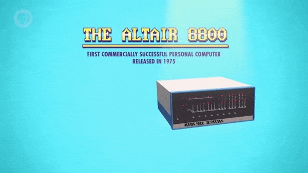

- 'Altair 8800' 은 1975년, 'Popular Electronics' 의 표지에 등장하면서 알려졌다.
- 그리고, 구매자가 직접 만들어야 하는 조립형 제품의 경우, 439달러에 판매되었다.
- 물가 상승률을 적용하면, 오늘날을 기준으로 약 2,000달러에 해당하는 금액이다.
- 2,000달러가 적은 돈은 아니지만, 1975년의 컴퓨터치고는 매우 저렴한 가격이었다.

 

'Altair 8800' 의 조립형 제품은 컴퓨터 애호가들에게 수만 대씩 판매되었다.

이러한 인기 덕분에, 곧 다양한 종류의 실용적인 장치(add-on) 들이 등장했다.

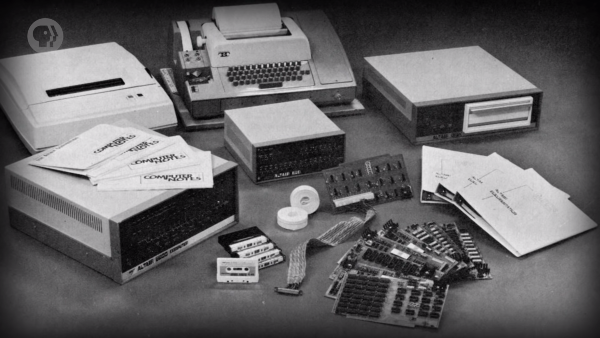

추가 메모리, 천공 테이프 판독기, 전신타자기 인터페이스 등을 예로 들 수 있다.

- 천공 테이프에서 더 길고 복잡한 프로그램을 로드할 수 있었다.
- 또, 전신타자기 단말기를 통해 프로그램과 상호작용할 수 있었다.

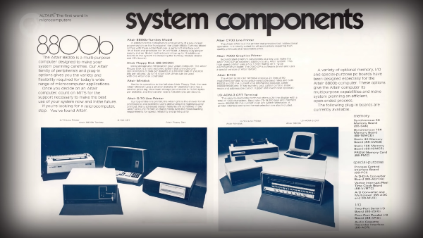

하지만, 컴퓨터 프로그램을 작성하기 위해선, 여전히 기계어를 사용해야 했다.

- 기계어는 컴퓨터광들에게조차 아주 낮은 수준의 형편없는 언어였다.

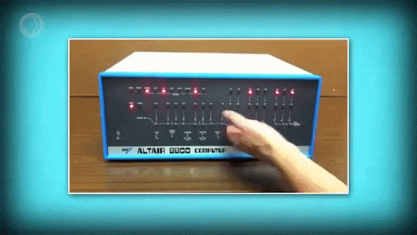

# 2. 베이식과 인터프리터

'기계어에 의존한다.' 라는 문제는 'Bill Gates' 와 'Paul Allen' 에 의해 해결되었다.

> 당시, 빌의 나이는 19세, 폴의 나이는 22세로, 둘 다 엄청나게 젊었다.

- 빌과 폴은 'Altair 8800' 의 제조사 'MITS' 에 연락해, 아래와 같은 제안을 했다.
>
컴퓨터에서 **'베이식(BASIC)'** 으로 작성된 프로그램을 실행할 수 있도록 하면,  
'Altair 8800' 은 컴퓨터 애호가들 사이에서 더 많은 인기를 끌 수 있을 것이다.

- 베이식은 단순한 프로그래밍 언어로, 당시에 대중적으로 사용되었다.

 

이를 위해, 그들은 베이식 명령어를 순수 기계어로 변환하는 프로그램을 작성해야 했다.

> 이러한 프로그램을 **'인터프리터(Interpreter)'** 라고 한다. 

- 인터프리터는 컴파일러(compiler) 와 매우 유사하지만, 실행 시점에서 차이가 있다.
- 컴파일러는 미리(beforehand) 실행되지만, 인터프리터는 프로그램과 동시에 실행된다.

# 3. 마이크로소프트의 탄생

'MITS' 는 제안에 관심을 보였고, 시연을 위해 빌과 폴을 만나는 것에 동의했다.

- 문제는, 빌과 폴은 아직 인터프리터 프로그램을 작성하지 않았다는 것이었다.

 

그들은 'Altair 8800' 도 없는 상태에서, 단 몇 주 만에 프로그램을 완성했다.

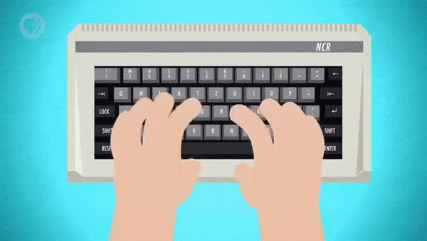

- 마지막 코드 조각은 프로그램 시연을 하러 가는 비행기에서 작성되었다고 한다.

 

그들은 'MITS' 본사에서 데모를 시연하면서, 코드가 작동한다는 것을 확인했다.

- 본사가 있는 뉴멕시코 주의 앨버커키까지 찾아가서야 처음으로 코드를 실행해본 것이다.

 

다행히도, 인터프리터는 문제없이 작동했고, 'MITS' 는 소프트웨어 배포에 동의했다.

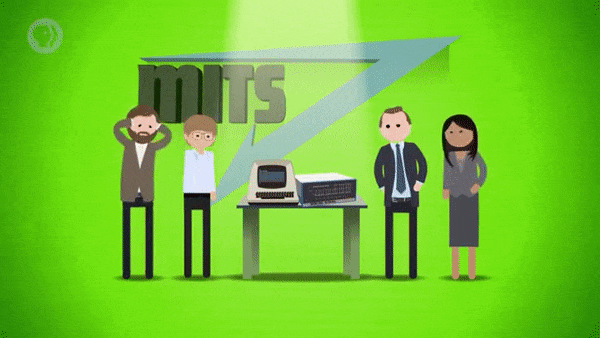

- 이렇게 **'마이크로소프트(Microsoft)'** 라는 새로운 회사가 탄생하게 되었다.
- **'알테어 베이식(Altair Basic)'** 은 마이크로소프트의 첫 번째 제품이 되었다.

# 4. 애플 컴퓨터의 탄생

물론, 컴퓨터에 대한 취미 활동을 하는 사람들은 1975년 이전에도 존재했다.

- 하지만, 컴퓨터 애호가들의 활동은 'Altair 8800' 의 등장과 함께 활발해지기 시작했다.
- 그렇게, 컴퓨팅에 대한 지식과 소프트웨어, 열정을 공유하는 애호가 집단이 생겨났다.

 

가장 유명한 모임은 '홈브루 컴퓨터 클럽(Homebrew Computer Club)' 이었다.

- 1975년 3월 5일, 캘리포니아로 배송된 첫 'Altair 8800' 의 검토와 함께 시작되었다.

 

첫 번째 모임에 참가했던 24세의 'Steve Wozniak' 은 'Altair 8800' 에서 영감을 받았다.

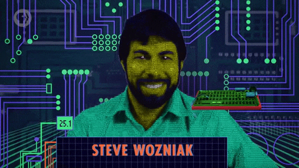

- 이후, 워즈니악은 이러한 영감과 함께 자신만의 컴퓨터를 설계하기 시작했다.
- 1976년 5월, 워즈니악은 자신이 만든 원형(prototype) 을 모임에서 시연했다.
- 그리고, 원형에 관심 있어 하는 다른 회원들에게 회로도(schematic) 를 공유했다.
- 당시 제품들과는 다르게 텔레비전에 연결되었으며, 문자 인터페이스를 제공했다.
   - 이러한 설계와 기능을 제공하는 것은 저가형 컴퓨터 중에서는 처음이었다.

 

엄청난 관심을 받고, 얼마 지나지 않아, 워즈니악의 친구 'Steve Jobs' 는 제안을 했다.

- 잡스는 홈브루 컴퓨터 클럽 동료 회원이면서, 워즈니악의 대학 친구였다.

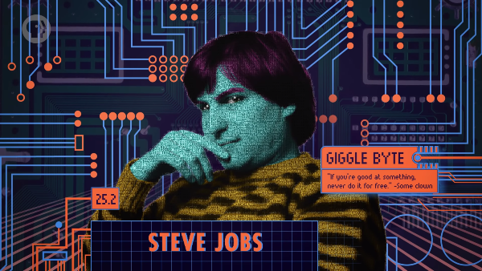

> 디자인을 무료로 공유하는 대신, 조립된 메인보드(motherboard) 를 판매해야 한다. 

 

하지만, 이 컴퓨터에는 키보드와 전원 공급장치, 케이스(enclosure) 를 추가해야 했다.

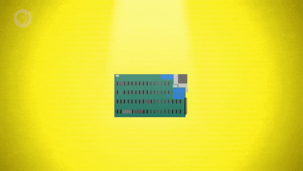

- 1976년 7월, 666.66달러의 가격에 판매된 이 컴퓨터는, 'Apple I' 이라고 불렸다.
- 그리고, 'Apple I' 은 **'애플 컴퓨터(Apple Computer)'** 의 첫 번째 제품이 되었다.

# 5. 1977년의 삼위일체

'Altair 8800' 과 마찬가지로, 'Apple I' 은 조립형 제품으로 판매되었다.

- 이는, 납땜을 개의치 않는 애호가가 아닌, 소비자와 기업의 관심을 끌지 못했다.
- 하지만, 이러한 양상은 1977년, 세 대의 획기적인 컴퓨터가 출시되면서 바뀌었다.

 

아래의 컴퓨터들은 '상자에서 꺼내자마자 즉시 사용할 수 있는 제품' 이다.

첫 번째는 애플에서 출시한 최초의 완성형 제품인 'Apple II' 였다.

- 이 제품은 전문적으로 설계/제조된 '완전한 체계(complete system)' 로 판매되었다.
- 당시의 저가 제품으로써는 엄청난 기능인, 기초적인 색상 그래픽과 소리 출력을 제공했다.
- 수백만 대씩이나 판매된 'Apple II' 시리즈는, 애플을 개인용 컴퓨터 업계의 선두에 세웠다.

두 번째는 'Tandy Corporation' 에서 제조한 'TRS-80 Model I' 이다.

- 줄여서 'TRS' 라고 불렸으며, 'Radio Shack' 이라는 전자 기기 소매점에서 판매되었다.
- 'Apple II' 보다 기술적으로는 덜 발전했지만, 가격이 절반이었고, 불티나게 팔려나갔다.

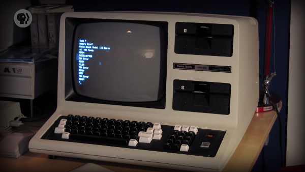

세 번째는 독특한 일체형(all-in-one) 설계의 'Commodore PET 2001' 이다.

- 소비자의 관심을 끌기 위해 컴퓨터, 모니터, 키보드, 테이프 드라이브를 하나로 결합했다.
- 이 제품의 등장으로 컴퓨터와 가전제품(appliance) 사이의 경계가 모호해지기 시작했다.

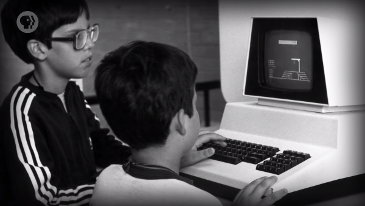

 

이러한 세 대의 컴퓨터는 **'1977년의 삼위일체(1977 Trinity)'** 로 알려지게 되었다.

- 이 컴퓨터들은 모두 베이식 언어의 인터프리터를 기본 구성 번들로 제공했다.
- 덕분에, 일반인들(non-computer-wizards) 도 프로그램을 만들 수 있게 되었다.

# 6. 개인용 컴퓨터 시장의 확대

개인용 컴퓨터를 위한 프로그램을 제공하는 소비자용 소프트웨어 산업도 등장했다.

- 게임 또는 계산기나 워드 프로세서와 같은 생산성 도구를 예로 들 수 있다.

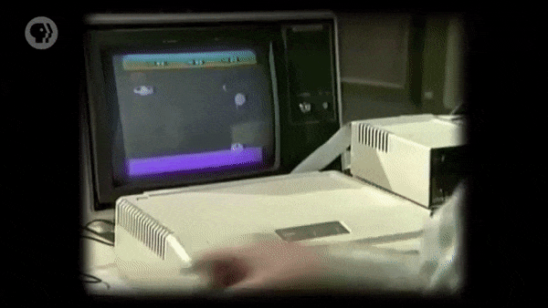

당시의 '킬러 애플리케이션(killer application)' 은 1979년에 출시된 'VisiCalc' 였다.

- 최초의 스프레드시트 프로그램인 'VisiCalc' 는 종이보다 훨씬 유용했다.
- 이는 'Microsoft Excel', 'Google Sheet' 와 같은 프로그램의 조상님이다.

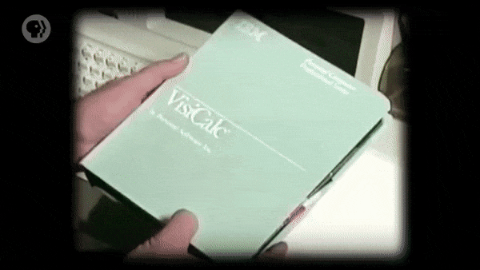

하지만, 이러한 컴퓨터들이 남긴 가장 큰 유산은 아마 마케팅일 것이다.

- 기업과 애호가뿐만 아니라, 가정까지 대상으로 삼은 마케팅은 이번이 처음이었다.

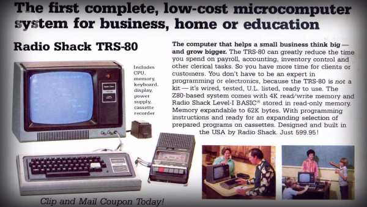

그리고, 사실상 처음으로 컴퓨터가 가정, 중소기업, 학교에서 사용되기 시작했다.

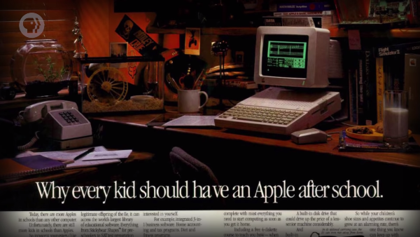

 

이러한 변화는 지구 상에서 가장 큰 컴퓨터 회사인 IBM의 관심을 끌었다.

- 전체 컴퓨터 시장에서, IBM의 점유율은 1970년 60%에서 1980년 30%로 줄어들었다.
- 주된 이유는 IBM이 매년 약 40%씩 성장하는 마이크로컴퓨터 시장을 무시했기 때문이다.

 

마이크로컴퓨터가 개인용 컴퓨터로 발전하고, IBM은 조치를 취해야 한다는 것을 알았다.

> 하지만, 이를 위해서는 컴퓨터에 대한 계획과 설계를 근본적으로 다시 생각해야 했다.

- 1980년을 기준으로, IBM에서 가장 저렴한 컴퓨터는 '5120' 이었다.
- '5120' 의 가격은 약 1만 달러로, 'Apple II' 와는 비교도 되지 않았다.

# 7. IBM PC와 개방형 구조

이는 IBM이 모든 것을 아예 처음부터 다시 시작해야 한다는 것을 의미했다.

- 이러한 이유로, IBM은 12명의 공학자로 특성화 팀(crack team) 을 구성했다.  
- 훗날 'Dirty Dozen' 이라는 별명이 붙은 이 팀은 플로리다의 보카러톤으로 보내졌다.
- 이렇게 독립된 환경을 갖춘 사무실 덕분에, 그들은 마음껏 재능을 발휘할 수 있었다.

 

IBM의 내부 정치로부터 보호받은 그들은 원하는 대로 기계를 설계할 수 있었다.

- IBM 상표가 달린 CPU를 사용하는 대신, 'Intel' 에서 만든 칩을 선택했다.
- IBM이 선호하는 운영 체제 'CP/M' 대신 'MS-DOS' 의 사용 허가를 받았다.  
  `(참고로, 'MS-DOS' 는 '마이크로소프트의 디스크 운영 체제' 다.)`
- 이렇게 화면부터 프린터까지, 모든 구성을 다른 회사의 제품으로 대체했다.

 

>
처음으로, IBM 사업부는 컴퓨터용 하드웨어와 소프트웨어를 놓고 다른 회사와 경쟁해야 했다.  
>
이렇게 회사의 전통이었던 사내 개발(in-house development) 을 급진적으로 깨부숨으로써,  
IBM은 여러 비용을 저렴하게 유지할 수 있었고, 파트너 회사들을 진영으로 끌어들일 수 있었다.

 

개발을 시작한 지 단 1년 만에, 'IBM PC(IBM Personal Computer)' 가 출시되었다.

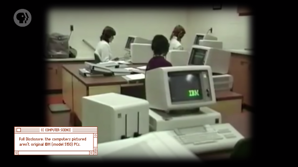

- 오랫동안 IBM 상표(brand) 를 신뢰해온 기업들 덕분에 즉각적인 성공을 거두었다.

 

하지만, 성공에 가장 큰 영향을 준 것은 '개방형 구조(Open Architecture)' 였다.

- 문서화(documentation) 가 잘 되어 있고, 확장 슬롯(expansion slots) 까지 갖췄다.
- 덕분에, 제3자(third-party) 가 플랫폼을 위한 하드웨어나 주변기기를 만들 수 있었다.

 

제3자에 의해 만들어진 수많은 실용적인 장치들이 사용자들에게 제공되었다.

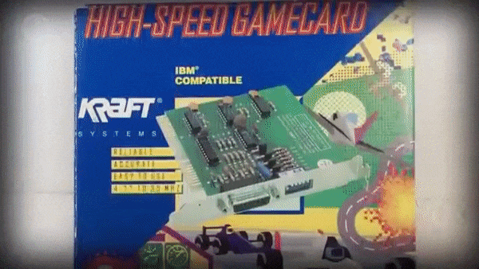

- 그래픽 카드, 사운드 카드, 외장 하드 드라이브, 조이스틱 등을 포함한다.

# 8. IBM 호환 플랫폼의 성장

이로 인해, 혁신과 경쟁이 촉진되었고, 거대한 제품 생태계(ecosystem) 가 형성되었다.

- 이러한 개방형 구조는 'IBM 호환(IBM Compatible)' 이라는 이름으로 알려졌다.
- IBM 호환 컴퓨터를 구매하면, 이처럼 거대한 생태계의 요소들을 사용할 수 있었다.
- 개방형 구조에서는, 기준만 충족되면 경쟁 업체도 IBM 호환 컴퓨터를 만들 수 있었다.

 

얼마 지나지 않아, 'Compaq' 과 'Dell' 은 자체적으로 생산한 PC 복제품을 판매했다.

- 그리고, 마이크로소프트는 그들에게 'MS-DOS' 의 사용을 허가했다.
- 덕분에, 'MS-DOS' 는 가장 대중적인 PC 운영 체제로 빠르게 자리 잡았다.

 

IBM은 출시한 지 3년 만에 2백만 대의 컴퓨터를 판매하여, 애플을 추월했다.

- 수많은 개발자가 대규모 사용자를 기반으로 하는 IBM 호환 플랫폼에 집중했다.
- 이는 단순히 소프트웨어나 하드웨어를 판매할 사용자가 더 많았기 때문이었다.

 

이후, 사람들은 사용 가능한 소프트웨어/하드웨어가 가장 많은 컴퓨터를 구매하길 원했다.

- 그리고, 이러한 효과의 영향력은 눈덩이처럼 불어나기 시작했다.
- 반면에, 우수한 사양의 컴퓨터라도, IBM과 호환되지 않으면 실패했다.

# 9. 폐쇄형 구조

IBM과의 호환성 없이도 시장 점유율을 유지할 수 있었던 것은 애플뿐이었다.

- 애플은 '폐쇄형 구조(Closed Architecture)' 라는 정반대의 접근 방식을 선택했다.
- 이는 보통, 다른 사람이 컴퓨터에 새로운 하드웨어를 추가하는 것을 막는 독점적인 설계다. 

 

이는, 애플이 컴퓨터와 운영 체제, 주변기기들까지 자체적으로 만들었다는 것을 의미한다.

- 주변기기는 보통 디스플레이, 키보드, 프린터와 같은 것들을 만들었다.

 

애플은 전체 요소(full stack) 를 장악하여, 사용자 경험을 제어하고 안정성을 향상했다.

- 이는 하드웨어에서 소프트웨어에 이르기까지, 모든 요소를 통제한 덕분이었다.
- 이러한 경쟁적인 사업 전략은 'Mac vs PC' 의 기원이 되어 오늘날까지 존재한다.

# 10. 그래픽 사용자 인터페이스에 관하여,

애플은 저가형 PC와의 경쟁을 위해, PC와 DOS가 제공할 수 없는 사용자 경험을 제공해야 했다.

이에 대한 그들의 해답은, 1984년에 출시된 '매킨토시(Macintosh)' 였다.

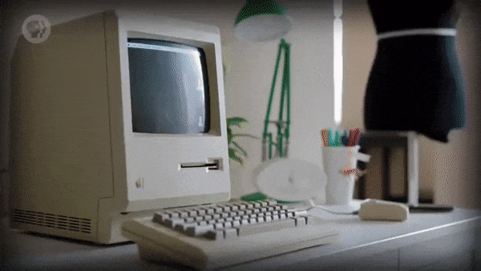

- 매킨토시는 아주 획기적인 일체형 컴퓨터이면서, 가격은 합리적으로 저렴했다.
- 명령 줄 문자 인터페이스를 사용하지 않았으며, 다른 인터페이스로 부팅되었다.

 

그것은 바로, 다음 수업에서 살펴볼 **'그래픽 사용자 인터페이스(Graphical User Interface)'** 다.

# 배운 점, 느낀 점

개인용 컴퓨터가 처음으로 등장한 시기의 시대적 배경에 대해 배웠다.

- 1970년대 초, 컴퓨터 부품들의 가격이 저렴해지면서, 마이크로컴퓨터가 등장하기 시작했다.
- 그중에서도 조립형 제품으로 판매되었던 'Altair 8800' 은 최초로 상업적인 성공을 거두었다.
- 엄청난 인기와 함께 주변기기들도 등장했지만, 프로그램 작성에는 여전히 기계어가 필요했다.

 

마이크로소프트, 애플 컴퓨터라는 회사가 설립되기까지의 과정에 대해 배웠다.

- 빌 게이츠와 폴 앨런은 'Altair 8800' 제조사에 베이식 인터프리터를 지원할 것을 제안했다.
- 제조사는 완성된 베이식 인터프리터의 정상 동작을 확인한 후, 소프트웨어 배포에 동의했다.
- 그렇게, 그들은 '알테어 베이식' 소프트웨어의 배포/판매를 위해 마이크로소프트를 설립했다.
- 스티브 워즈니악은 '홈브루 컴퓨터 클럽' 모임에서 영감을 받아 새로운 컴퓨터를 설계했다.
- 동료 회원이자 대학 친구인 스티브 잡스는 워즈니악의 컴퓨터를 판매하자는 제안을 건넸다.
- 그렇게, 그들은 메인 보드만 덜렁 있는 'Apple I' 를 판매하기 위해 애플 컴퓨터를 설립했다.

 

개인용 컴퓨터 시장의 성장에 영향을 주었던 여러 가지 요인에 대해 배웠다. 

- 초기에 등장한 조립형 컴퓨터들은, 납땜을 꺼리는 소비자와 기업들로부터 관심을 못 받았다.
- 이후, 조립이 필요 없고, 인터프리터가 번들로 제공되는 소비자 친화적인 컴퓨터들이 등장했다.
- 곧, 컴퓨터와 가전제품의 경계는 모호해졌고, 일반인들도 프로그램을 작성할 수 있게 되었다.
- 또, 소비자용 소프트웨어와 가정을 대상으로 한 마케팅 덕분에 컴퓨터가 널리 사용되기 시작했다.

 

'IBM PC' 의 등장 배경과 등장 이후에 일어난 컴퓨터 업계의 변화에 대해 배웠다.

- 개인용 컴퓨터 시장을 무시하던 IBM은, 시장 점유율 하락에 대한 위기감을 느끼기 시작했다.
- 시장의 상황을 따라잡기 위해, IBM은 사내 개발이라는 전통을 내려놓고, 새로운 시도를 했다.
- 타사 제품을 모두 수용하는 개방형 구조로 비용을 절감하면서, 1년 만에 'IBM PC' 를 출시했다.
- 그렇게, 제3자 간의 경쟁과 혁신이 촉진되었고, 'IBM 호환' 이라는 거대한 생태계가 형성되었다.
- IBM 호환 플랫폼의 규모는 점점 커졌지만, 애플은 독점적 설계 구조인 폐쇄형 구조를 고집했다.
- 그렇게, 사용자 환경을 제어하여 안정성을 높인 폐쇄형 구조는 개방형 구조와 대립하게 되었다.

(해당 글의 작성 과정은 
[post/crash-course/25 (#117)](https://github.com/ensia96/ensia96.github.io/pull/117)
에서 확인하실 수 있습니다.)
