>
해당 포스트는 아래 수업의 내용을 바탕으로 작성되었습니다.
> - ['Crash Course - Computer Science'](https://www.youtube.com/playlist?list=PL8dPuuaLjXtNlUrzyH5r6jN9ulIgZBpdo)
>
\- Youtube :
['Crash Course'](https://www.youtube.com/channel/UCX6b17PVsYBQ0ip5gyeme-Q)  
\- Professor : ['Carrie Anne Philbin'](https://about.me/carrieannephilbin)

# 0. 시작하기에 앞서,

지난 두 편의 수업에서는, 인터넷의 기반이 되는 여러 구성 요소와 규약에 대한 내용을 다뤘다.

> 전선, 전기 신호, 네트워크 스위치, 패킷, 라우터, 프로토콜과 같은 요소들을 살펴봤다.

 

이번 수업에서는, 이러한 요소들을 기반으로 하는, 더 높은 추상화 계층으로 올라가 볼 것이다.

> 그리고, **'월드 와이드 웹(World Wide Web, WWW)'** 이라는 개념에 대해 살펴볼 것이다.

 

인터넷과 월드 와이드 웹의 차이를 모르는 사람들이 많을 텐데, 사실, 이 둘은 명백히 다르다.

- 월드 와이드 웹은 'Skype', 'Minecraft', 'Instagram' 과 비슷하게, 인터넷상에서 운영된다.
- 인터넷은, 이러한 모든 응용 프로그램들의 기반이 되며, 정보를 전달하는 통로 역할을 한다.

 

그리고, 월드 와이드 웹은, 인터넷을 기반으로 하는 여러 서비스 중에서도, 규모가 가장 크다.

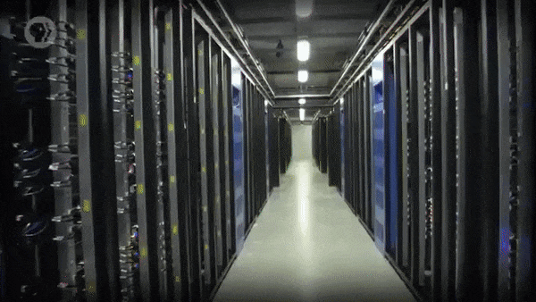

- 이는, 전 세계 수백만 대의 서버 컴퓨터에서 실행되는 거대한 분산형 응용 프로그램이다.
- 그리고, **'웹 브라우저(Web Browser)'** 라는 특별한 프로그램을 사용해 접근할 수 있다.

 

> 이번 수업에서는, 이러한 월드 와이드 웹과 웹 브라우저에 관련된 내용들을 살펴볼 것이다.

# 1. 하이퍼링크

월드 와이드 웹은, 줄여서 웹이라고 하며, 기본적인 구성 요소는 '단일 페이지(single page)' 다.

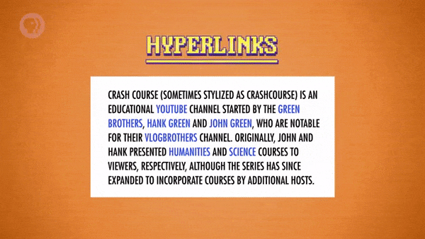

- 페이지(page) 는 '내용이 있는 문서' 이며, 다른 페이지에 대한 연결(link) 을 포함할 수 있다.
- 이러한 연결을 **'하이퍼링크(Hyperlink)'** 라고 부르는데, 아마, 사용해본 적이 있을 것이다.
- 하이퍼링크는 클릭할 수 있는 문자 또는 이미지이며, 이를 클릭하면, 다른 페이지로 이동한다.
- 이러한 하이퍼링크로, '상호 연결된(interconnected) 정보의 거대한 망(web)' 이 형성된다.
- 그리고, 모든 관련 요소는, 이렇게 구성된 망, 즉, 웹이라는 표현에서 이름을 따서 명명되었다.

 

아마, 하이퍼링크라는 아이디어가 엄청나게 단순하고, 대단한 것이 아니라고 생각할 수도 있다.

>
하지만, 하이퍼링크가 구현되기 전에 다른 컴퓨터에 있는 또 다른 정보를 확인하기 위해선,  
원하는 정보를 얻기까지 파일 시스템을 일일이 뒤지거나, 검색 상자에 입력해서 찾아야 했다.
>
하이퍼링크를 사용하면, 하나의 주제에서 그것에 관련된 다른 주제로 쉽게 이동할 수 있다.

 

하이퍼링크로 연결된 정보의 가치는 1945년에 'Vannevar Bush' 에 의해 개념화되었다.

> '24. 냉전과 소비주의' 에서 살펴봤듯, 그는 가상의 기계 'Memex' 에 대한 기사를 발표했다.

부시는 해당 기사에서, 메멕스에 대한 내용 중, 연관 색인화라는 개념을, 이렇게 묘사했다.

>
... associative indexing ...  
whereby any item may be caused at will to select immediately and automatically another.  
\- Vannevar Bush
>

>
연관 색인화 ...  
이로 인해 임의의 항목이 즉시 자동으로 다른 항목을 선택하도록 할 수 있다.

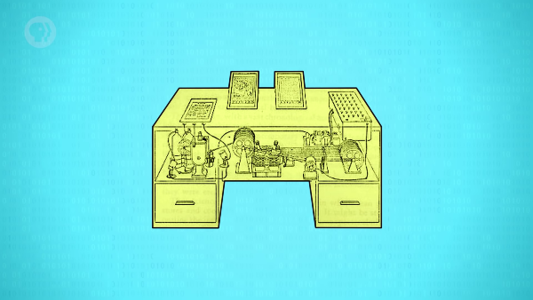

그리고 그는, 같은 기사의 뒷부분에서, 연관 색인화에 대해 조금 더 구체적으로 설명했다.

>
The process of tying two items together is the important thing.  
...  
Thereafter, at any time, when one of these items is in view,  
the other can be instantly recalled merely by tapping a button ...
>

>
두 항목을 하나로 묶는 과정이 중요하다.  
...  
그 이후에는, 언제든지, 이러한 항목 중 하나가 표시되었을 때,  
버튼을 누르기만 하면 다른 항목을 즉시 불러올 수 있다 ...

 

1945년, 당시의 컴퓨터에는 화면조차 없었기 때문에, 이는 시대보다 훨씬 앞선 아이디어였다.

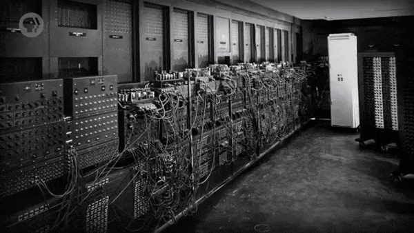

- 하이퍼링크를 포함하는 텍스트는, 마찬가지로, **'하이퍼텍스트(Hypertext)'** 라고 명명되었다.
- 웹 페이지(web page) 는, 오늘날, 가장 흔하게 찾아볼 수 있는 유형의 하이퍼텍스트 문서다.
- 웹 페이지를 탐색하거나, 렌더링하는 작업은 웹 브라우저가 처리하는데, 이는 뒤에서 살펴보자.

# 2. URL

페이지가 서로 연결되기 위해서는, 하이퍼텍스트 페이지마다 고유한 주소를 가지고 있어야 한다.

> 이 때, 웹에서는, 이렇게 고유한 주소를 **'URL(Uniform Resource Locator)'** 로 지정한다.

 

웹 페이지에 대한 연결 과정을 'thecrashcourse.com/courses' 라는 URL을 예시로 하여 살펴보자.

지난 수업에서 살펴봤듯, 어떤 사이트를 요청했을 때, 컴퓨터가 가장 먼저 하는 일은 DNS 조회다.

- DNS 서버에는 아래와 같이, 'thecrashcourse.com' 라는 도메인 이름이 입력으로 주어진다.

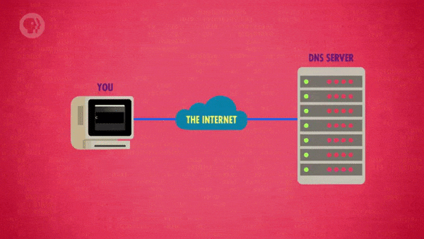

DNS 서버는 도메인 이름을 입력받아, 해당 도메인 이름에 연결된 컴퓨터의 IP 주소를 응답한다.

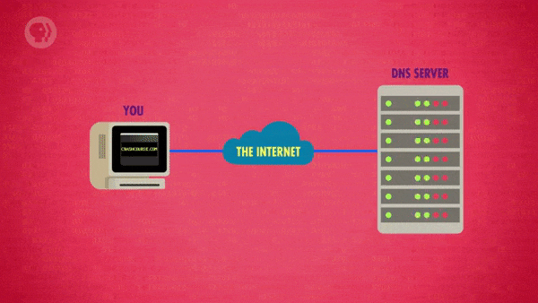

이제, IP 주소를 전달받은 웹 브라우저는, 연결하고자 하는 컴퓨터에 대해 TCP 연결을 설정한다.

- 연결 대상은, 웹 서버(web server) 라는 특별한 소프트웨어를 실행하고 있는 컴퓨터다.  
  `(이 때, 이러한 웹 서버에서 주로 사용하는 포트 번호는 '80' 이다.)`

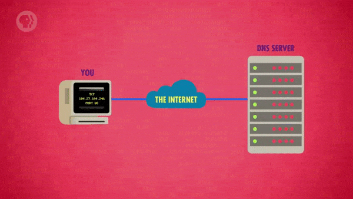

 

현재 시점에서 컴퓨터가 마친 작업은, 'thecrashcourse.com' 주소의 웹 서버에 연결한 것밖에 없다.

> 다음으로 해야 할 일은, 해당 웹 서버에 'courses' 라는 하이퍼텍스트 페이지를 요청하는 것이다.

# 3. HTTP

하이퍼텍스트 페이지를 요청할 때는, **'HTTP(Hypertext Transfer Protocol)'** 를 사용하면 된다.

- 최초의 문서화된 버전은, 1991년에 만들어진 'HTTP 0.9' 이며, 당시에는 'GET' 명령만 있었다.
- 다행히, 현재는 특정 페이지를 가져오기만 하면 되기 때문에, GET 명령 하나만 있어도 충분하다.

 

이번에는, 'courses' 페이지를 가져오기 위해, 서버에 'GET /courses' 라는 명령을 보낸다.

- 그러면 웹 서버는, 이러한 명령을 원시적인 아스키(ASCII) 문자 형태로 전달받는다.

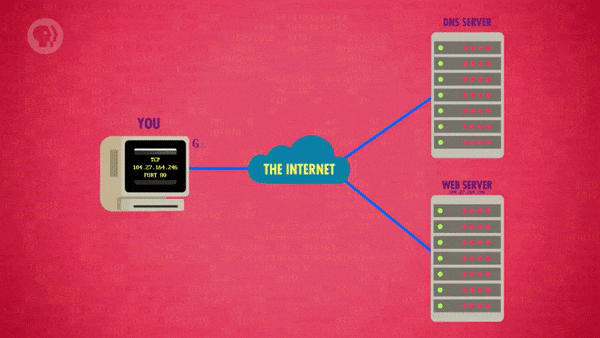

요청을 받은 서버는, 사용자가 요청한 웹 페이지에 해당하는 하이퍼텍스트 문서를 응답한다.

- 해당 하이퍼텍스트 문서는 사용자 컴퓨터의 웹 브라우저에 의해 해석되어 화면에 렌더링된다.

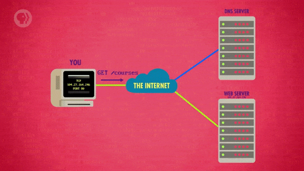

사용자가 다른 페이지에 대한 링크를 클릭하면, 컴퓨터는 또 다른 GET 요청을 발행한다.

- 이렇게, 사용자가 웹 사이트를 탐색하는 동안에는, 이러한 과정이 계속 반복된다.

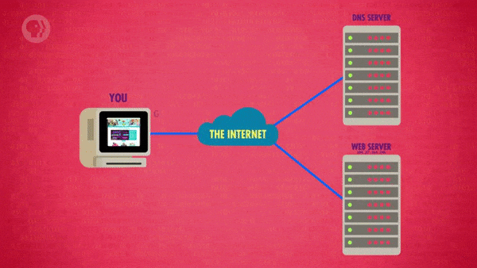

 

이후에 등장한 HTTP 버전에는, 서버 응답의 앞부분에 상태 코드(status code) 가 추가되었다.

예를 들어, 상태 코드 '200' 은 '페이지 확인 성공, 요청한 페이지를 전송하겠다.' 를 의미한다.

400번대의 상태 코드는 '오류가 발생했고, 오류의 원인은 클라이언트(client) 다.' 를 의미한다.

- 예를 들어, 사용자가 웹 서버에 존재하지 않는 페이지를 요청한 경우는 '404' 에러가 발생한다.

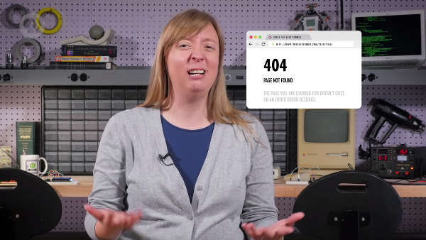

# 4. HTML

이러한 하이퍼텍스트 웹 페이지는, 평범한 문자 형태의 정보(plain text) 로 저장되거나 전송된다.

- 그리고, 이러한 정보를 구성하는 것은 아스키 또는 'UTF-16' 방식으로 인코딩된 문자다.
- 관련 내용은 '4. 이진수로 숫자와 문자 나타내기', '20. 파일과 파일 시스템' 에서 다뤘다.

 

이렇게 일반적인 문자를 저장하는 파일에는, 링크인 것과 링크가 아닌 것을 지정할 방법이 없었다.

> 때문에, '텍스트 파일에 하이퍼텍스트 요소의 표식을 남기는(mark up) 방법' 을 개발해야 했다.

 

이를 위해, 표식을 남기는 언어인 **'HTML(Hypertext Markup Language)'** 이 개발되었다.

> 1990년에 만들어진 HTML의 최초 버전 'HTML 0.8' 은 18개의 요소에 대한 HTML 명령을 제공했다.

 

18개의 명령으로도 충분하니, 이번에는 이들을 이용하여 간단한 웹 페이지를 구성해보자.

우선, 웹 페이지의 구성을 저장할 HTML 문서 파일에, 큰 제목(heading) 을 추가해보자.

- 이 때, 제목을 추가하려면, 'h1' 을 입력한 후, 그 문자를 꺾쇠괄호(<>) 로 묶으면 된다.
- '\<h1>' 은 HTML 표식(tag) 의 한 예시이며, 최상위 제목의 시작을 나타내는 표식이다.

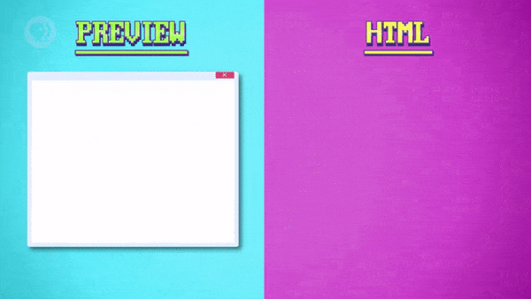

이렇게 표식을 만들었으니, 그 뒤에 제목으로 삼고 싶은 내용을 아무거나 입력하면 된다.

- 이 때, 페이지 전체가 제목으로 취급되지 않도록 하려면, 'h1' 표식을 닫아줘야 한다.
- 'h1' 표식을 닫으려면, 'h1' 앞에 '/' 를 붙인 '\</h1>' 표식을, 뒤에 추가해주면 된다.

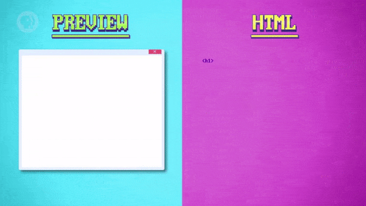

이렇게 완성한 제목의 아래 부분에는, 평범한 사람은 이해하기 힘들만 한 문장을 추가했다.

- 아마도, 방문자 대다수는 클링온(klingon) 이라는 단어의 의미가 무엇인지 모를 것이다.
- 따라서, 추가 정보를 제공할 수 있도록, 클링온이라는 단어를 하이퍼링크로 만들 것이다.
- 그리고, 그 하이퍼링크는 'KLI(Klingon Language Institute)' 라는 곳으로 연결할 것이다.

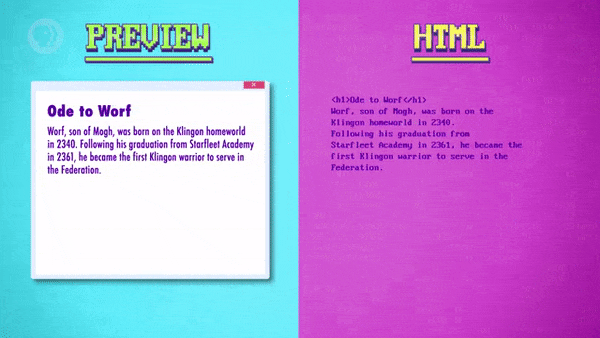

이 때, HTML 문서에 포함된 단어를 하이퍼링크로 만들기 위해, 'a' 표식을 사용할 수 있다.

- 'a' 표식 내부에, 하이퍼링크를 클릭했을 때 어떤 페이지로 이동시킬지 지정할 수 있다.
- 이는 '하이퍼링크 참조(hyperlink reference, href)' 라는 속성을 이용해 처리할 수 있다.
- 그리고 마지막으로, 새로 추가한 'a' 표식을 닫음으로써, 표식 작업을 마무리하면 된다.

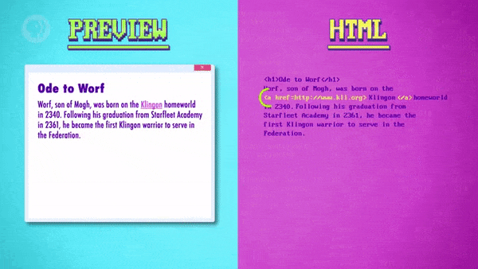

이번에는, 'h1' 보다 한 단계 낮은 수준의 제목을 나타내는 'h2' 라는 표식을 추가해보자.

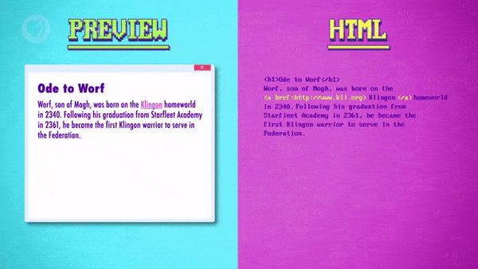

HTML은, 이러한 표식들 외에도, 목록을 만드는 데에 사용할 수 있는 표식들을 제공한다.

- 'ordered list', 줄여서, 'ol' 이라는 표식을 추가함으로써, 목록 만들기를 시작할 수 있다.
- 그런 다음에, 'list item', 줄여서, 'li' 라는 표식을 이용하여, 여러 항목을 추가할 수 있다.

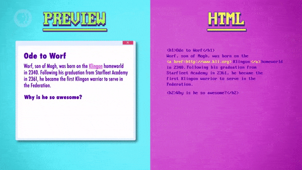

목록에 있는 "Bat'leth" 를 모르는 사람도 많을 테니, 해당 항목도 하이퍼링크로 만들어보자.

- 마지막으로, 목록이 깨지지 않고, 원래 모양을 유지할 수 있도록, 'ol' 표식을 닫아야 한다.

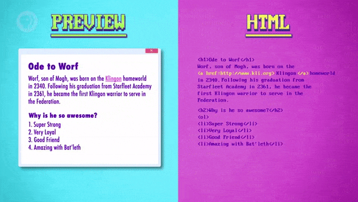

 

이렇게, 마지막에 사용한 표식까지 닫아주면, 아주 간단한 구성의 웹 페이지가 완성된다.

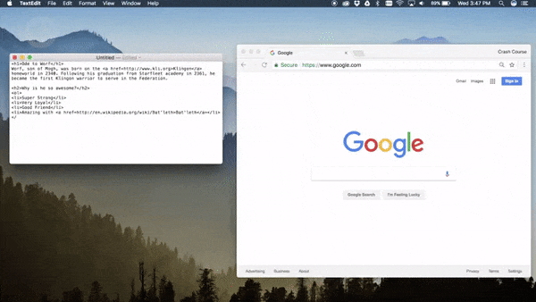

- 이렇게 작성한 내용은, 메모장과 같은 텍스트 편집 응용 프로그램을 이용해 저장할 수 있다.
- 그리고, 'test.html' 과 같은 이름으로 저장하면, 컴퓨터 웹 브라우저에서 열어볼 수도 있다.

 

물론, 오늘날에 찾아볼 수 있는 웹 페이지들은, 위에 있는 예시보다는 조금 더 정교한 편이다.

HTML의 최신 버전인 'HTML 5' 는, 다양한 요소를 표현할 수 있도록, 여러 표식을 제공한다.

- 덕분에, 이미지, 표, 양식, 버튼 등, 100개 이상의 서로 다른 요소들을 표현할 수 있다.

또한, HTML 페이지에 삽입해서 더 화려한 작업을 처리하는 데 사용할 수 있는 기술들도 있다.

- 'CSS(Cascading Style Sheets)', '자바스크립트(JavaScript)' 등을 예로 들 수 있다.

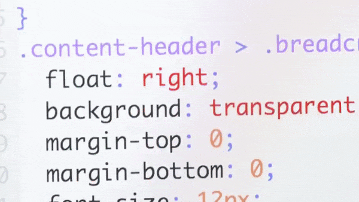

# 5. 월드 와이드 웹의 등장

위에서 살펴봤듯, 웹 브라우저라는 응용 프로그램을 사용하여 모든 웹 서버와 통신할 수 있다.

> 이렇게 브라우저는, 페이지와 미디어 요소를 요청할 뿐만 아니라, 응답받은 내용도 렌더링한다.

 

최초의 웹 브라우저와 웹 서버는, 1990년, 'Tim Berners-Lee' 경에 의해 작성되었다.

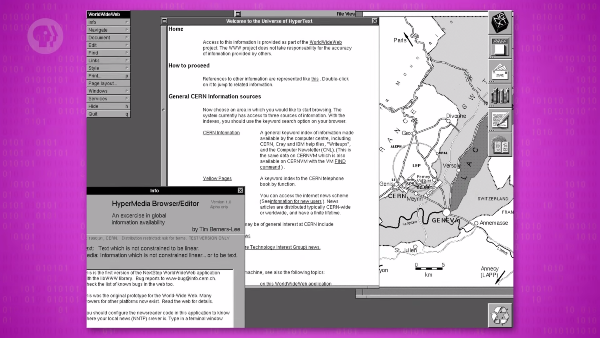

- 당시, 그는 스위스의 'CERN' 에서 근무하고 있었으며, 2개월의 작업 끝에, 이들을 완성했다.
- 이를 위해, 그는 위에서 살펴봤던 기본 웹 표준들(URL, HTML, HTTP) 도 동시에 만들었다.
- 이러한 결실을 얻기까지, 그는 거의 10년이 넘는 기간 동안 하이퍼텍스트 체계를 연구해왔다.

 

이는 CERN 소속 구성원들에게 가장 먼저 공유되었으며, 1991년에 대중들에게 공개되었다.

> 그렇게, 이것이 점점 널리 퍼지면서, 월드 와이드 웹이라는 정보 체계가 탄생하게 되었다.

 

>
여기서 중요한 것은, 월드 와이드 웹은 개방형 표준(open standard) 이기 때문에,  
누구든지 마음만 먹으면, 새로운 웹 서버와 웹 브라우저를 개발할 수 있다는 사실이다.

# 6. 월드 와이드 웹의 발전

시간은 흘러 1993년, 일리노이 대학교 어배너-섐페인의 한 팀이 새로운 웹 브라우저를 만들었다.

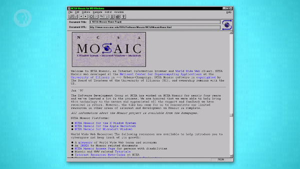

- 이것이 바로, 문자와 그래픽을 함께 삽입할 수 있는 최초의 브라우저, **'모자이크(Mosaic)'** 다.
- 모자이크가 등장하기 전에 사용되던 브라우저들의 경우, 그래픽을 별도의 창에 표시해야 했다.
- 또한, 새로 도입된 북마크 등의 기능들과 GUI 인터페이스를 갖춘 덕분에 많은 인기를 얻었다.
- 모양새가 조금 투박하긴 해도, 오늘날 사용되는 웹 페이지의 모습을 알아볼 수는 있을 정도다.

 

이후, 1990년대 말까지, 여러 웹 브라우저가 개발되었으며, 일부는 오늘날까지도 사용되고 있다.

- 'Netscape Navigator', 'Internet Explorer', 'Opera', 'OmniWeb', 'Mozilla' 등

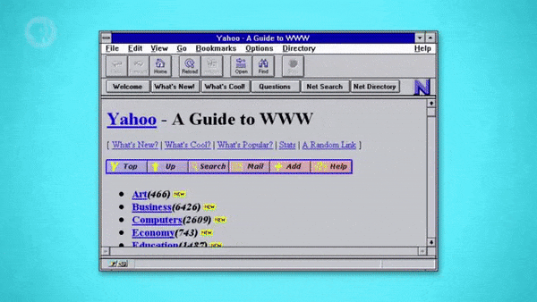

또, 아파치(Apache), 마이크로소프트의 인터넷 정보 서비스(IIS) 등, 많은 웹 서버도 개발되었다.

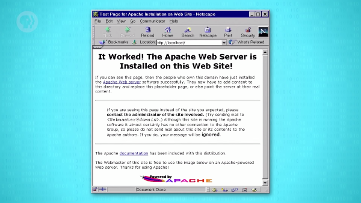

이외에도, 당시에는 매일같이 새로운 웹 사이트가 등장하는 등, 여러 폭발적인 성장이 있었다.

- 아마존, 이베이처럼, 웹의 주축이 되는 사이트들도 1990년대 중반에 설립되었다.

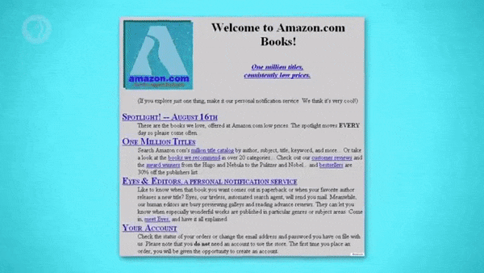

# 7. 검색 엔진

이후, 웹이 널리 사용되기 시작하면서, '원하는 정보를 찾는 방법' 에 대한 필요성도 커져만 갔다.

- 'ebay.com' 처럼 이동하고자 하는 웹 주소를 알고 있다면, 브라우저에 입력만 하면 된다.
- 하지만, 원하는 정보가 있어도, 정보를 어디서 얻을 수 있는지를 모른다면 불편할 것이다.

 

처음에는, 이러한 불편함을 해소하기 위해 '하이퍼링크 디렉토리' 역할을 하는 웹 페이지가 등장했다.

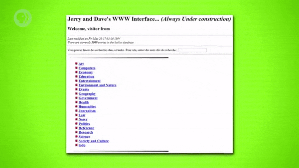

- 사람들은, 다른 웹 사이트로 연결되는 하이퍼링크들을 해당 웹 페이지에 저장하고 직접 관리했다.
- 그중에 가장 유명한 것은 **'Jerry and David's Guide to the World Wide Web'** 이었다.
- 이후, 1994년에 해당 '웹 디렉토리(web directory)' 의 이름은 **'야후!(Yahoo!)'** 로 바뀌었다.

 

웹이 성장하면서, 이렇게 사람이 편집하는(human-edited) 디렉토리는 점점 관리하기 어려워졌다.

> 이러한 이유로, **'검색 엔진(Search Engine)'** 이라는 새로운 소프트웨어 체계가 개발되었다.

 

오늘날의 검색 엔진과 비슷한 방식으로 작동하는 최초의 웹 검색 엔진은 **'JumpStation'** 이다.

> 점프스테이션은 1993년, 스털링 대학에 다니던 'Jonathon Fletcher' 에 의해 개발되었다.

 

보통, 검색 엔진들은 '조직적으로 함께 작동하는 세 가지 유형의 소프트웨어' 로 구성된다.

- 첫 번째는, 웹에서 발견되는 모든 링크를 따라가는 소프트웨어인 **'웹 크롤러(web crawler)'** 다.
> 방문한 페이지에 포함된 링크가 새로 발견한 링크라면, 웹 크롤러는 그것을 목록에 추가한다.
- 두 번째는, 크롤러가 방문한 페이지에 등장한 모든 용어(term) 를 기록하는 **'색인(index)'** 이다.
> 이러한 색인은, 웹 크롤러가 정보를 수집하는 과정에서, 계속해서 확대된다(ever-enlarging).
- 세 번째는, 수집된 색인들을 참조(consult) 하는 **'검색 알고리즘(search algorithm)'** 이다.
> 검색 엔진에 특정 단어를 입력하면, 해당 단어가 등장하는 모든 웹 페이지가 목록에 표시된다.

# 8. 검색 알고리즘

초기의 검색 엔진들은, 아주 단순한 측정 기준(metric) 을 사용해 검색 결과의 순위를 매겼다.

- 이러한 시기에 주로 사용되던 측정 기준은 '검색어가 웹 페이지에 등장한 횟수' 였다.

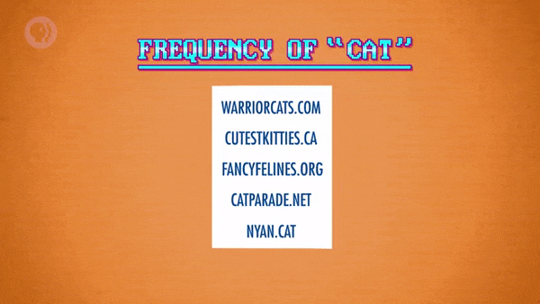

물론, 이러한 방식은 사람들이 '체계를 악용하는 행위' 를 시작하기 전까지는 문제가 없었다.

- 트래픽을 유도하려고, 똑같은 단어를 수백 번 작성하는 편법이 등장하기 전까진 괜찮았다.

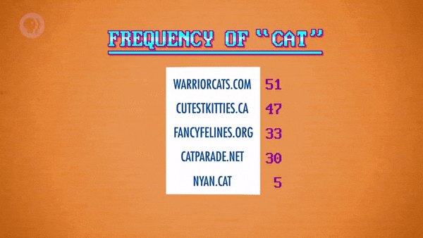

 

구글이 유명해진 이유의 상당 부분은, 이러한 문제의 영향을 받지 않는 알고리즘 덕분이었다.

> 웹 페이지의 내용을 신뢰하는 대신, 다른 사이트가 해당 페이지에 연결되는 방식을 확인했다.

웹상의 어떤 사이트도, 특정 단어가 도배된 스팸 웹 페이지의 링크를 연결하진 않을 것이다.

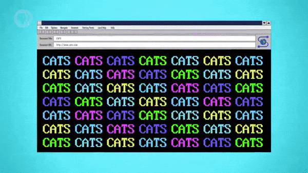

반대로, 해당 주제에 대해 권위가 있는 웹 페이지라면, 다른 사이트에서 링크를 연결할 것이다.

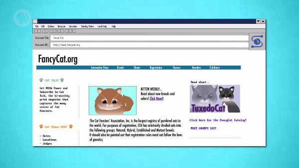

이러한 이유로, '백링크(backlink)' 의 수는, 특정 페이지의 품질을 나타내는 지표가 되었다.

- 특히, 평판이 좋은 사이트에서 연결되는 백링크의 수는, 페이지의 품질을 확실히 인증했다.

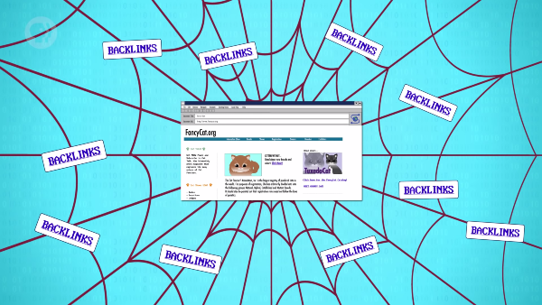

이는, 1996년에 스탠퍼드 대학교에서 진행된 'BackRub' 이라는 연구 프로젝트에서 시작되었다.

- 이러한 알고리즘을 기반으로 하는 검색 엔진의 이름은, 2년 후에 현재의 이름인 구글로 바뀌었다.

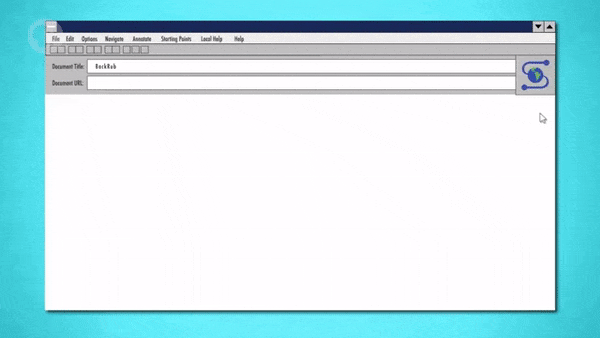

# 9. 망 중립성

이번에는, 한때 논란이 되었던 **'망 중립성(Net Neutrality)'** 이라는 주제에 대해 다뤄볼 것이다.

>
수업을 진행하면서, 패킷, 라우팅, 월드 와이드 웹의 개념에 대한 이해가 쌓였을 테니,  
망 중립성에 관한 논쟁의 본질, 최소한의 기술적 핵심을 충분히 이해할 수 있을 것이다.

 

간단히 말해서, 망 중립성은 **'인터넷상의 모든 패킷이 동등하게 취급되어야 한다.'** 라는 원칙이다.

- 패킷의 종류에 상관없이, 해당 패킷의 전송 속도와 우선순위는 모두 같아야 한다는 뜻이다.
- 해당 패킷이 특정 사용자의 이메일인지, 다른 사용자의 비디오 스트리밍인지는 상관이 없다.
- 하지만, 기업의 관점에서는 자기 회사의 정보가 전달되는 우선순위가 더 높기를 원할 것이다.

 

미국에서 가장 큰 인터넷 서비스 제공자 중 하나인 '컴캐스트(Comcast)' 를 예시로 살펴보자.

> 컴캐스트는 'NBC', 'The Weather Channel' 등의 온라인 스트리밍 채널들을 소유하고 있다.

- 망 중립성이 없다면, 컴캐스트는 자사 스트리밍 품질만 높이고, 타사 품질을 낮출 수 있다.
- 의도적으로 타사 스트리밍 서비스의 대역폭을 줄이고, 우선순위를 낮출 수도 있다는 뜻이다.
- 이는 극단적인 예시일 뿐, 추측에 불과하며, 컴캐스트를 콕 집어서 이야기하는 것은 아니다.

 

망 중립성 옹호론자들은 인터넷 서비스 제공자들이 이를 상업적으로 이용할 것이라고 주장했다.

- 대역폭과 우선순위를 조작하여, 인터넷 통행료(toll) 를 설정할 수도 있게 되기 때문이다.
- 즉, 다른 기업들은 더 좋은 환경에서 패킷을 전송하기 위해 추가 비용을 내야 한다는 것이다.
- 더 큰 문제는, 이를 통해 다른 기업들을 착취하는 사업 모델이 만들어질 수 있다는 것이다.

 

ISP는 경쟁사들에게 강력한 인센티브를 요구하며, 타사의 컨텐츠 전송에 제약을 줄 수도 있다.

- 이 때, 'Netflix', 'Google' 과 같은 대기업은, 큰 비용을 지불하여 특혜를 받을 수도 있다.
- 그렇게 된다면, 스타트업이나 중소기업들은 상대적으로 불리한 처지에 놓이게 될 것이다.
- 문제는, 이렇게 기업 규모에 따라 생겨나는 차이가, 혁신을 가로막을 수 있다는 것이다.

 

물론, 정보(패킷) 의 유형에 따라 전송 속도를 다르게 하는 것이 훨씬 더 적합한 상황도 있다.

- Skype 통화와 같이, 실시간으로 정보를 주고받아야 하는 경우, 우선순위가 중요하다.
- 반면에, 이메일 등의 정보들은 몇 초 늦게 도착한다고 해서 큰 문제가 되지는 않는다.
- 이렇게, 패킷의 전송 속도를 다르게 하는 방식이 오히려 좋은 상황들도 분명 존재한다.

 

망 중립성 반대론자들은, 시장의 힘과 경쟁 구조가 부당한 행위들을 억제할 것이라고 주장한다.

> 고객으로서는, 자신이 선호하는 사이트를 제한하는 ISP를 사용하고 싶지 않을 것이기 때문이다.

# 10. 배움의 중요성에 관하여,

망 중립성에 관한 논쟁은 2017년도에 크게 주목받았는데, 최근(2021년) 들어 다시 논란이 되고 있다.

- 이외에도 망 중립성의 의미는 아주 복잡하고 광범위하기 때문에, 이 정도만 다뤄보고자 한다.
- 해당 수업에서 항상 권장해왔듯, 수업에서 다루는 범위를 넘어, 더 많은 것들을 배우길 바란다.

 

**<작성 중인 글입니다.>**

**<아래 내용은 정리 중입니다.>**

# 배운 점, 느낀 점

월드 와이드 웹의 기반이 되는 여러 가지 요소들과 각각의 개념, 원리에 대해 배웠다.

월드 와이드 웹이 탄생하고 발전하는 과정에서 있었던 주요한 사건들에 대해 배웠다.

웹 페이지 탐색을 위해 등장한 검색 엔진과 검색 엔진의 순위 측정 기준에 대해 배웠다.

인터넷 서비스 요금에 관한 원칙인 망 중립성의 개념과 그에 관한 논쟁에 대해 배웠다.
