>
해당 포스트는 아래 수업의 내용을 바탕으로 작성되었습니다.
> - ['Crash Course - Computer Science'](https://www.youtube.com/playlist?list=PL8dPuuaLjXtNlUrzyH5r6jN9ulIgZBpdo)
>
\- Youtube :
['Crash Course'](https://www.youtube.com/channel/UCX6b17PVsYBQ0ip5gyeme-Q)  
\- Professor : ['Carrie Anne Philbin'](https://about.me/carrieannephilbin)

# 0. 시작하기에 앞서,

지난 수업에서는, 컴퓨터 체계의 보안에 관련된 기초적인 원칙들과 기술들에 대해 살펴봤다.

- 하지만, 이러한 노력에도 불구하고, 사이버 공격에 관련된 뉴스는 꾸준히 나오고 있다.
- 이 때, 기술적 지식을 활용해 컴퓨터 체계에 침입하는 사람을 **'해커(Hacker)'** 라고 한다.

> #### '해킹(Hacking)' 이라는 용어는,
일반적으로, '문제에 대한 창의적인 해결책을 개발하는 행위' 라는 의미로 더 자주 사용된다.

 

물론, 해커라고 해서, 악의를 갖고 다른 사람의 컴퓨터를 공격하는 해커만 있는 것은 아니다.

- 버그를 찾아 고치고, 보안 취약점을 보완해, 체계를 더 안정적으로 만드는 해커도 있다.
- 회사나 정부 기관의 경우, 보안 평가를 치르기 위해, 이러한 해커들을 고용하기도 한다.
- 이렇게 바람직한 방향으로 역량을 발휘하는 해커를 **'하얀 모자(White Hat)'** 라고 한다.
- 반대로, 보안 취약점과 정보를 악용/판매하는 해커는 **'검은 모자(Black Hat)'** 라고 한다.

> #### 여기서 잠깐,
'WannaCry' 라는 랜섬웨어의 공격을 막는 데에 크게 기여한 하얀 모자 해커가 있었다.  
그의 이름은 'Marcus Hutchins', 이후, 검은 모자 활동 이력으로 미국에서 기소되었다.
>
이렇게, 하얀 모자와 검은 모자는 한 끗 차이이며, 그 경계가 엄청나게 모호한 편이다.

 

이렇게, 해커가 특징에 따라 구분되는 것처럼, 해킹 행위에 대한 동기 또한 다양하게 나뉜다.

- 재미나 호기심과 같은 동기도 있지만, 사이버 범죄자들의 주 동기는 금전적인 이득이다.
- 이외에도, 정치/사회적 목표를 홍보하고자 활동하는 **'핵티비스트(Hacktivist)'** 도 있다.

 

이렇게 해커의 특징이나 동기에 대해 살펴봤지만, 당연하게도, 이는 빙산의 일각에 불과하다.

> 흔한 고정관념 중 하나인 피자 상자로 가득 찬 어두운 방에 앉아 있는 모습과도 거리가 멀다.

 

이번 수업에서는, 해커가 되는 방법 대신, 컴퓨터 체계에 침입하는 방식에 대해 살펴볼 것이다.

> 고전적인 예시와 함께, 해커가 어떠한 원리로 컴퓨터 체계에 침입할 수 있었는지 살펴보자.

# 1. 사회 공학과 피싱

해커들이 컴퓨터 체계에 침입할 때 가장 자주 사용하는 방법은 사용자를 속이는 방법이다.

- 기술을 따로 사용하지 않는 이러한 기법을 **'사회 공학(Social Engineering)'** 이라 한다.
- 사용자를 속여서, 기밀을 누설하게 하거나, 보안 관련 설정을 바꾸도록 하는 방식이다.
- 주로, 취약점이 생기도록 보안 설정을 바꾸게 만든 후, 해당 취약점으로 직접 침입한다.

 

가장 일반적인 공격 유형은 특정 계정에 로그인하도록 유도하는 '피싱(Phishing)' 이다.

- 가장 흔한 것은 은행 홈페이지와 같은 특정 웹 사이트에 로그인하기를 요청하는 메일이다.

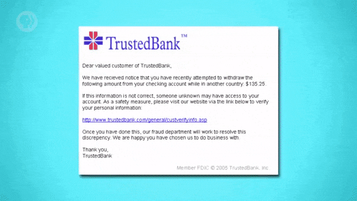

- 이 때, 해당 링크를 클릭하면, 평범한 사람은 알아채기 힘든 복제 웹 사이트로 연결된다.
- 여기서, 사용자가 아이디와 비밀번호를 입력하면, 해당 정보는 해커에게 바로 전달된다.
- 나쁜 소식은, 해커가 해당 정보를 이용해 사용자의 계정으로 로그인할 수 있다는 것이다.

 

이러한 피싱 공격은, 0.1%의 확률로 성공한다고 가정해도, 수많은 피해자를 만들게 된다.

> 성공률이 0.1%면, 백만 개의 전자 메일을 보냈을 때 수천 명의 피해자가 생겨날 것이다.

# 2. 프리텍스팅과 트로이 목마

사회 공학 기법의 또 다른 유형으로는 **'프리텍스팅(Pretexting)'** 이라는 공격 방식도 있다.

> 기업과 같은 곳에 직접 전화를 걸어, 회사의 주요 관계자인 척 연기를 하는 방식이다.

 

이 때, 공격자는 보통, 중간 부서에 전화를 건 후, 전화를 다른 부서로 돌려달라고 요청한다.

> 이렇게 하면, 회사 내부 번호로 위장할 수 있어서, 피해자를 더 쉽게 속일 수 있게 된다.

- 공격자는, 전화를 받은 대상이 컴퓨터를 손상시키거나 정보를 공개하도록 유도한다.
- 이 과정에서 공격자는, 비밀번호를 얻거나, 네트워크 구성 등을 조작할 수 있게 된다.

> #### 여기서 잠깐,
'저기, IT 부서의 Susan인데요. 네트워크 문제가 있어서 그러는데, 설정 좀 확인해 주실래요?'
>
프리텍스팅 공격은 위처럼 한 번쯤은 있을법한, 아무 문제 없을 것 같은 대화에서 시작된다.

 

공격자는 사칭할 직원의 이름과 같은 정보를 미리 조사해둠으로써, 설득력을 얻기도 한다.

> 물론, 정보를 얻기까지 여러 번 시도해야 하지만, 성공하는 순간 공격자가 승리하게 된다.

 

이와 비슷한 사회 공학 기법으로는, **'트로이 목마(Trojan Horse)'** 라는 공격 유형도 있다.

- 이 때, 트로이 목마 공격에 사용되는 일반적인 전달 매체(mechanism) 는 이메일이다.
- 맬웨어를 송장(invoice), 사진과 같이 안전해 보이는 첨부 파일로 위장하는 방식이다.

 

이러한 맬웨어는 공격 방식에 따라 특징이 달라지기 때문에, 다양한 형태를 취하게 된다.

- 은행용 인증서(credential) 와 같은, 특정 정보를 도용하는 형태를 예로 들 수 있다.
- 또, 파일들을 암호화한 후에, 몸값을 요구하는 **'랜섬웨어(Ransomeware)'** 도 있다.

# 3. 낸드 미러링

공격자는 맬웨어 실행이나 침입 경로 확보에 실패한 경우, 다른 강제적인 수단을 찾는다.

- 그중 하나는, 지난 수업에서 간략하게 언급했던 무차별 대입 공격을 시도하는 것이다.
- 이 때, 무차별 대입 공격은 가능한 모든 비밀번호의 조합을 시도하는 공격 방식이다.

 

요즘 사용되는 보안 체계는 대부분, 이러한 공격 유형에 대한 방어 체계가 갖춰져 있다.

> 잘못된 접근 시도마다 대기 시간을 늘리거나, 일정 횟수 후에 접근을 완전히 제한한다.

 

비교적 최근에는, 이러한 방어 체계를 무시하는 새로운 유형의 해킹 기술이 등장했었다.

- 바로, 2016년에 화제가 되었던 **'낸드 미러링(NAND Mirroring)'** 이라는 기술이다.
- 이는 장치의 메모리 칩에 전선을 연결해, 메모리 내용을 완전히 복사하는 기술이다.
- 물론, 컴퓨터나 장치에 물리적으로 접근 가능한 상황에만 사용할 수 있는 기술이다.

 

이러한 기법을 사용하면, 체계가 접근을 제한할 때까지 계속해서 접근을 시도할 수 있다.

- 접근 제한에 걸리면, 복사본 정보를 메모리에 덮어씌워 이전의 상태로 초기화한다.
- 이러면, 접근 제한이 무효가 되니, 이전에 시도하던 부분부터 다시 시도하는 것이다.

 

이러한 낸드 미러링 기술은, 아이폰 5c에 적용했을 때 실제로 유효한 결과를 냈다고 한다.

> 물론, 요즘 출시되는 기기들에는 낸드 미러링을 저지하는 메커니즘이 적용되어 있다.

# 4. 취약점 공격과 버퍼 오버플로

컴퓨터에 물리적으로 접근할 수 없는 경우, 공격자는 원격으로 해킹할 방법을 찾아야 한다.

- 이렇게 원격으로 공격하는 경우, 공격자는 인터넷과 같은 매체를 통해 대상에 접근한다.
- 일반적으로, 공격자는 대상의 컴퓨터 체계를 공격하기 위해, 버그나 취약점을 찾는다.
- 그리고, 이렇게 찾은 버그나 취약점을 통해, 접근 권한이나 자격(capability) 을 얻는다.
- 보안 체계의 취약점을 악용하는 이러한 공격 기법을 **'취약점 공격(Exploit)'** 이라 한다.

 

이러한 공격에 악용되는 취약점 중 가장 유명한 것은 **'버퍼 오버플로(Buffer Overflow)'** 다.

- 여기서 버퍼라는 용어는, 보통, 정보를 저장하기 위해 예약된 메모리 블록을 의미한다.
- ['23. 화면 및 2D 그래픽'](/Computer Science/Crash Course/23. 화면 및 2D 그래픽/#8-비트맵-디스플레이)
  에서, 화소 정보를 저장하는 '프레임 버퍼' 에 대해 살펴봤었다.

 

아이디/비밀번호 입력 칸이 있는, 운영 체제 로그인 프롬프트(login prompt) 를 떠올려보자.

여기서, 운영 체제는, 입력된 문자 정보 값들을 저장하기 위해, 내부적으로 버퍼를 사용한다.

- 간단하게 살펴보기 위해, 버퍼의 크기가 각각 10으로 지정되어 있다고 가정할 것이다. 
- 아이디/비밀번호 입력값을 저장하는 두 개의 버퍼는, 메모리에 아래와 같이 저장된다.

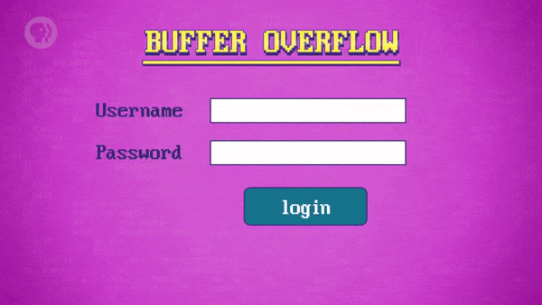

물론, 이러한 아이디/비밀번호 입력값 버퍼 앞뒤로도, 다른 정보들이 저장되어 있을 것이다.

- 왜냐하면, 운영 체제는 아이디/비밀번호 이외에 다른 값들도 추적해야 하기 때문이다.

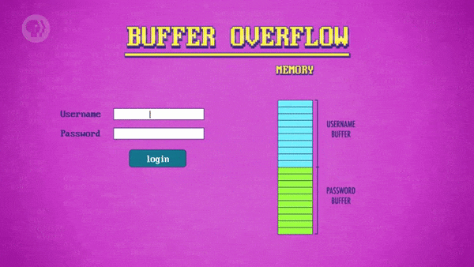

사용자가 아이디/비밀번호를 입력하면, 버퍼에 입력값이 복사된 후, 검증 과정이 진행된다.

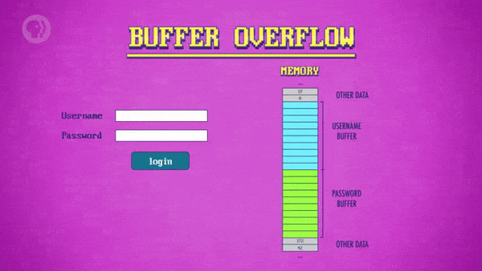

버퍼 오버플로 공격은, 이름에서 알 수 있듯, 버퍼 오버플로를 유도하여 공격하는 방식이다.

- 여기서, 입력값의 길이가 10을 넘으면, 해당 값이 인접한 메모리 공간에 덮어 씌워진다.
- 이 때, 중요한 역할을 하는 값이 덮어씌워지는 경우, 운영 체제가 충돌을 일으킬 수 있다.

 

다른 사람의 컴퓨터 체계에 접근하여 충돌을 유발하는 이러한 공격 행위는, 잘못된 행동이다.

> 이런 공격은, 장난꾸러기 해커가 단순히 장난을 치고 싶어서 하는 짓궂은 행동일 수도 있다.  
  `(단순한 장난으로 다른 사람의 컴퓨터 체계를 망가뜨린다니, 매우 성가시고 불쾌한 일이다..)`

 

하지만, 버퍼 오버플로 현상을 더 영리하게 이용하면, 다른 방식의 공격을 시도할 수도 있다.

- 예를 들어, 프로그램이 사용 중인 메모리의 특정 위치에 원하는 값을 주입할 수도 있다.
- 구체적으로는, 'is\_admin' 과 같이, 권한에 관련된 변수의 값을 'true' 로 설정할 수 있다.

 

이렇게, 공격자는 메모리를 원하는 데로 조작하여, 보안 체계 구성 요소들을 우회할 수 있다.

> 로그인 프롬프트는 물론, 상황만 받쳐준다면, 해당 컴퓨터 체계 전체를 장악할 수도 있다.

# 5. 경계 검사와 카나리아 값

물론, 버퍼 오버플로를 악용하는, 이러한 유형의 공격에 대응하는 방법은 여러 가지가 있다.

- 그중 가장 단순한 방법은, 버퍼에 입력값을 복사하기 전에 길이를 확인하는 방법이다.
- 특정 값의 길이를 확인하는 이러한 기법을 **'경계 검사(Bounds Checking)'** 라고 한다.
- 오늘날, 많은 프로그래밍 언어들은, 경계 검사를 자동으로 수행하도록 구현되어 있다.

 

또한, 프로그램을 작성할 때, 특정 변수의 메모리 위치를 무작위로 지정하도록 할 수도 있다.

- 이 때, 공격자는 덮어쓸 변수의 메모리 위치를 알 수 없어서, 공격하기가 더 힘들어진다.
- 즉, 공격자가 접근 권한을 얻을 확률보다, 프로그램 충돌 발생 확률이 더 커지는 것이다.

 

버퍼 뒤에 별도의 메모리 공간을 마련해, 해당 위치의 값이 바뀌는지 주시하는 방법도 있다.

- 이 때, 해당 값의 변화 여부로, 공격자가 접근을 시도했다는 사실을 알 수 있게 된다.
- 이러한 버퍼 오버플로 감지용 메모리 공간은, **'카나리아 값(Canaries)'** 이라 부른다.
- 이는, 광부들이 광산에 들어갈 때 데리고 다니던 작은 새의 이름을 따서 명명되었다.  
  `(산소 포화도에 민감한 카나리아는, 광산의 공기 상태가 위험한지 파악하는 역할을 했다.)`

# 6. 코드 주입 공격 - 배경지식

취약점 공격에는, **'코드 주입(Code Injection)'** 이라는 기법을 이용하는 공격 유형도 있다.

> 코드 주입은, 데이터베이스 기반 웹 사이트를 공격할 때 가장 자주 사용되는 기법이다.  
  `(오늘날, 거의 모든 대형 웹 사이트가, 서버 체계를 구성할 때 데이터베이스를 사용한다.)`

 

이 강의에서는 데이터베이스에 대해 다루지 않으므로, 간단한 예시를 들어 살펴볼 것이다.

- 그러기 전에, **'구조화된 질의 언어(Structured Query Language)'** 에 대해 알아보자.
- 이는, 유명한 데이터베이스 API이며, '에스큐엘(SQL)', '시퀄(sequel)' 등으로 불린다.

 

이번에는, 운영 체제의 로그인 프롬프트 대신, 웹 사이트의 로그인 페이지를 떠올려보자.

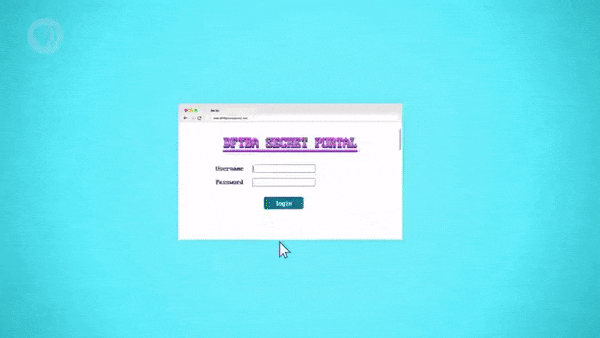

- 사용자가 화면에 있는 로그인 버튼을 클릭하면, 입력된 문자 값이 서버로 전송된다.
- 이 때, 서버는, 입력받은 정보가 데이터베이스에 있는지 확인하는 코드를 실행한다.
- 아이디가 데이터베이스에 있는 경우, 서버는 비밀번호가 일치하는지까지 검증한다.

 

이를 위해, 서버는 'SQL 질의(SQL Query)' 라고 알려진 특이한 형태의 코드를 실행한다.

SQL 질의의 맨 앞쪽에는, 데이터베이스에서 어떤 정보를 조회하려 하는지가 명시된다.

- 비밀번호의 일치 여부를 확인해야 하므로, 가져와야 하는 정보는 비밀번호가 된다.

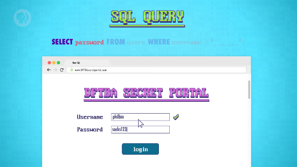

다음 부분에는, 해당 정보를 조회할 위치가 데이터베이스의 어느 부분인지가 명시된다.

- 데이터베이스 체계의 유형마다 정보를 저장하는 데 사용하는 자료 구조가 다르다.
- 현재 예시에서는, '테이블(table)' 이라는 자료 구조를 사용한다고 가정할 것이다.
- 또, 사용자 정보는 'users' 라는 이름의 테이블에 저장되어 있다고 가정할 것이다.

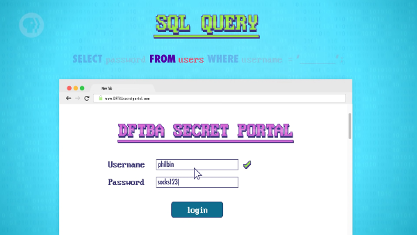

추가로, 데이터베이스의 정보 중, 조건에 맞는 것만 반환되도록 코드를 추가할 수 있다.

- 이 부분이 없으면, 사용자 테이블에 있는 모든 비밀번호에 대한 목록이 반환된다.
- 만약 그렇게 되면, 현재 로그인을 시도한 사용자의 비밀번호를 찾을 수 없게 된다.
- 따라서, 입력된 아이디에 부합하는 비밀번호만 가져오도록 조건을 지정해야 한다.

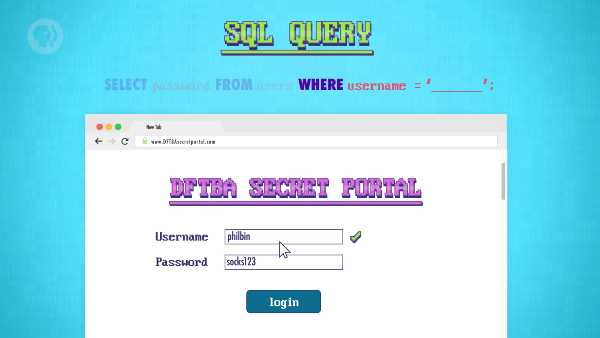

이 때, 서버는 사용자가 입력한 정보를 기반으로 하여 SQL 질의에 조건 값을 추가한다.

- 현재 예시에서 SQL 질의에 추가되는 값은, 아이디 입력 칸에 있는 'philbin' 이다.
- 따라서, 데이터베이스에 실제로 전송되는 SQL 질의는, 아래와 같은 형태를 띤다.

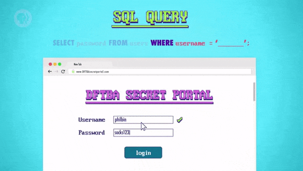

또한, 여기서 눈여겨볼 점은, SQL 질의 명령어가 ';(semicolon)' 으로 끝난다는 점이다.

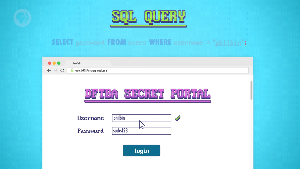

# 7. 코드 주입 공격 - 예제

그러면, 이러한 서버 체계를 어떤 방법으로 해킹할 수 있을지에 대해 한번 생각해보자.

공격자는 악의적인 SQL 명령어를 아이디인 것처럼 위장해 전송하는 식으로 공격한다.

- 아이디 입력 칸에, 아래와 같이 이상한 형태의 아이디를 입력할 수 있듯이 말이다.

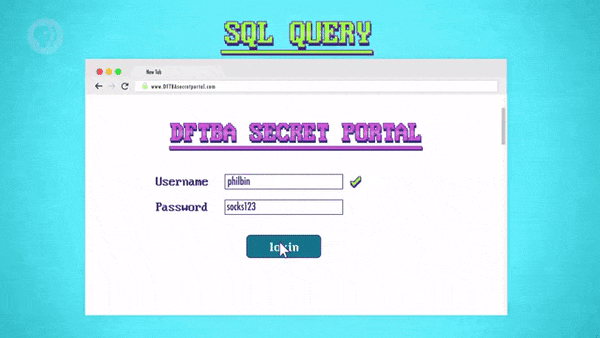

공격자가 입력한 악의적인 입력값이 SQL 질의에 추가되면, 이상한 형태를 띠게 된다.

- 이 때, SQL 질의 명령어는, 중간에 있는 세미콜론에 의해 두 부분으로 나눠진다.
- 따라서, 데이터베이스에서는, 아래의 진하게 표시된 부분이 첫 번째로 실행된다.

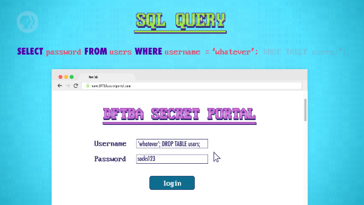

데이터베이스는 입력받은 값인 'whatever' 를 아이디로 사용하는 사용자를 조회한다.

- 사용자가 있으면, 데이터베이스는 해당 아이디에 부합하는 비밀번호를 반환한다.
- 물론, 공격자가 입력한 비밀번호는 틀렸을 테니, 서버는 로그인을 거부할 것이다.
- 사용자가 없으면, 데이터베이스는, 비밀번호 대신에 오류 정보를 제공할 것이다.
- 비정상적인 상황이 발생했기 때문에, 이번에도, 서버는 로그인을 거부할 것이다.

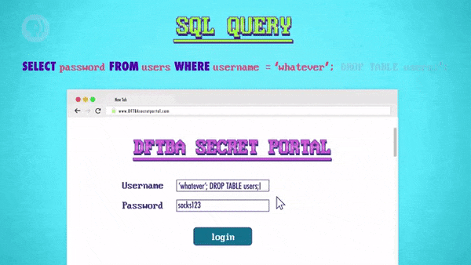

여기서는, 로그인이 제대로 처리되는지보다, 그다음에 실행될 명령어가 더 중요하다.

- 바로, 아이디 입력 칸을 조작하여 주입한 'DROP TABLE users;' 명령어 말이다.

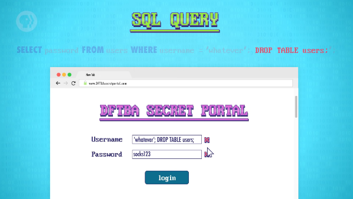

주입된 명령어는, 전체 사용자 정보가 저장된 테이블을 없애도록 지시하는 명령어다.

- 데이터베이스가 명령어를 실행하는 순간, 전체 사용자 정보가 말끔히 삭제된다.
- 꼭 은행과 같은 주요 기관이 아니더라도, 이러한 공격은 아주 치명적일 것이다.

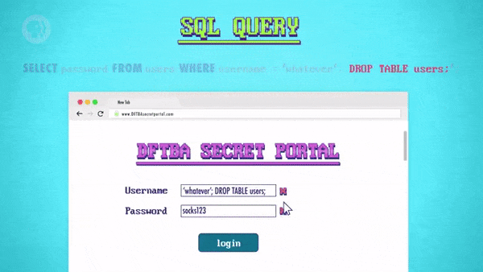

 

여기서 주목해야 할 점은, 공격자가 서버 체계에 직접 침입한 적이 없다는 사실이다.

- 이러한 공격 유형은 아이디나 비밀번호를 찾아내는 방식과는 확연하게 다르다.
- 이렇게, 버그를 악용하면, 제대로 된 접근 권한이 없는 채로도, 공격할 수 있다.

 

해당 예시는, 코드 주입 기법을 활용하는 공격의 예시 중에서도, 가장 단순한 예시다.

> 물론, 오늘날 거의 모든 서버는, 이와 같은 공격을 방어할 수 있도록 설계되어 있다.

 

관리자 계정을 추가하는 등의, 데이터베이스를 조작하는, 더 수준 높은 공격도 있다.

- 데이터베이스에서 신용카드 정보, 주민등록번호와 같은 정보를 훔칠 수도 있다.
- 하지만, 해당 수업에서는, 공격하는 방법에 대해서는 가르쳐 주지 않을 것이다.

# 8. 사이버 공격과 방어

버퍼 오버플로의 예시와 마찬가지로, 외부에서 들어오는 입력은 항상 경계해야 한다.

- 프로그래머라면, 입력값이 가지는 잠재적인 위험성에 대해 항상 고려해야 한다.
- 또, 입력값의 위험성을 확실히 검사하도록, 프로그램을 신중하게 작성해야 한다.

 

대부분의 웹 사이트는 아이디나 비밀번호 양식을 일차적인 방어 수단으로 활용한다.

- 입력값에 세미콜론이나 따옴표와 같은 특수 기호를 포함하지 않도록 규정한다.
- SQL 질의 실행 전에 특수 기호에 대한 표백 작업(sanitize) 을 하는 서버도 있다.

 

취약점 공격에 사용 가능한 소프트웨어는 인터넷상에서 판매되거나 공유되기도 한다.

- 보통, 전파 속도나 위험성이 높을수록 더 유명해지며, 가격이 더 비싸지기도 한다.
- 심지어, 정부조차 첩보 행위 등의 목적으로 공격용 소프트웨어를 구매하기도 한다.

# 9. 제로 데이와 분산 서비스 거부 공격

어떤 소프트웨어든, 해당 소프트웨어의 제작자가 모르는 버그가 숨겨져 있기 마련이다.

- 그중에서도, 취약점 공격에 사용 가능한 버그를 **'제로 데이(Zero Day)'** 라고 한다.
- 검은 모자 해커들은, 해당 취약점으로 최대한 벌어들이기 위해 신속하게 행동한다.
- 취약점의 존재를 알아챈 하얀 모자 해커들이 버그 패치를 출시하기 전까지 말이다.

 

제로 데이 공격에 대응하기 위해서라도 소프트웨어를 항상 최신 상태로 유지해야 한다.

- 소프트웨어 업데이트는, 버그나 취약점을 보완하는 보안 관련 패치가 대부분이다.
- 무방비한 컴퓨터가 많아지면, 공격자는 **'웜(Worm)'** 이라는 프로그램을 작성한다.
- 웜은, 취약점이 노출된 컴퓨터에 자신의 복사본을 확산시키는 악성 소프트웨어다.

 

일정 수 이상의 컴퓨터가 웜에 감염되면, 공격자는 **'봇넷(Botnet)'** 을 형성할 수 있다.

- 감염된 컴퓨터의 컴퓨팅 성능과 다른 사람의 전력을 마음대로 이용하는 것이다.
- 공격 행위 외에도, 대량의 스팸 메일 전송, 비트코인 채굴 등에 사용되기도 한다.

 

**'분산 서비스 거부 공격(Distributed Denial of Service, DDoS)'** 도 할 수 있게 된다.

- 이는, 다수의 컴퓨터를 이용해 수많은 더미(dummy) 메시지를 보내는 공격이다.
- 서버가 감당하기 힘들 정도로 많은 요청을 전송해, 서비스를 마비시키는 것이다.
- 단순한 악의를 넘어, 공격자는 서비스 운영자에게 금전적인 요구를 하기도 한다.

# 10. 사이버 전쟁에 관하여,

여러 노력에도 불구하고, 사이버 공격에 의한 피해는 매일같이 꾸준하게 발생하고 있다.

> 하얀 모자 해커 활동, 취약점 공격 유형 문서화, 소프트웨어 엔지니어링 모범 사례 등

- 이러한 사이버 공격으로 발생하는 피해는, 전 세계적으로, 매년 5조 달러에 달한다.
- 이러한 피해는, 컴퓨팅 체계에 대한 의존도가 높아질수록, 더욱 커져만 갈 것이다.

 

이는, 컴퓨터에 의존하는 기반 시설이 늘어나면서, 정부가 특히 우려하고 있는 사항이다.

- 발전소, 전력망, 신호등, 정수장, 정유소, 항공 교통 관제 센터 등, 다양한 시설이 있다.

- 수많은 전문가가, 다음 전쟁이 일어날 장소로 사이버 공간을 지목하게 할 정도다.
- 물리적인 공격 대신, 기반 시설과 경제를 무력화하여 상대를 제압하는 전쟁 말이다.
- 이러한 양상을 띠는, 국가 규모의 전쟁을 **'사이버 전쟁(Cyberwarfare)'** 이라 한다.

 

총알이 직접적으로 날아다니거나 하지는 않겠지만, 인명 피해는 여전히 발생할 것이다.

> 사람이 사람을 해치던 지금까지의 전쟁보다 더 많은 인명 피해가 발생할 수도 있다.

 

이러한 이유로, 우리 모두, 사이버 보안을 유지하는, 여러 좋은 관행들을 따라야 한다.

- 또한, 인터넷으로 상호 연결된 공동체로서, 컴퓨터의 보안 상태를 유지해야 한다.
- 악의적인 사람들로부터 컴퓨터를 보호하기 위해서라도, 보안 업데이트는 꼭 하자.

 

**<작성 중인 글입니다.>**

**<아래 내용은 정리 중입니다.>**

# 배운 점, 느낀 점

- 
