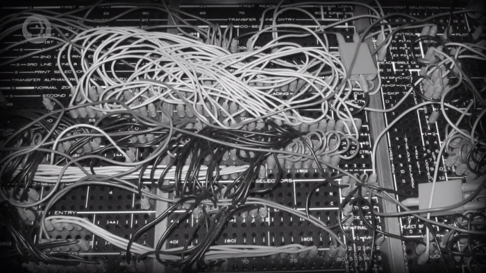
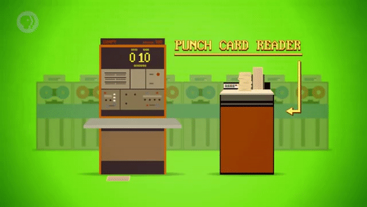
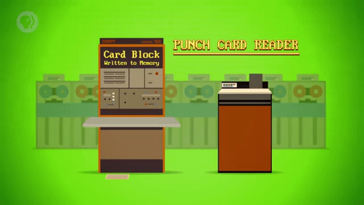
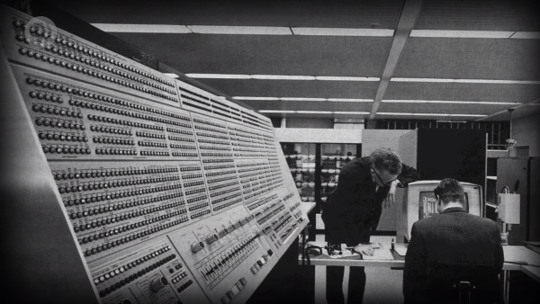
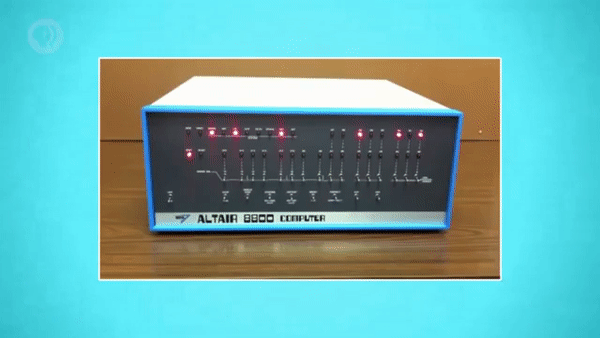
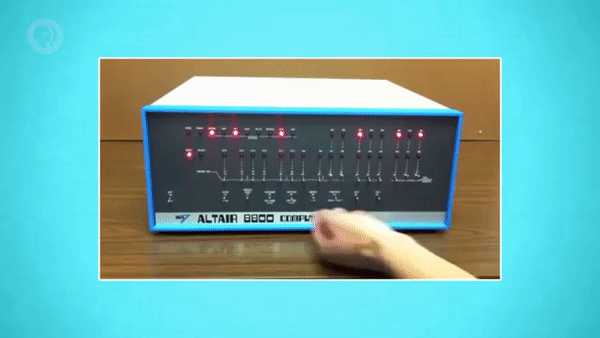

>
해당 포스트는 
Youtube 채널
<a href='https://www.youtube.com/channel/UCX6b17PVsYBQ0ip5gyeme-Q' target='-blank'>'Crash Course'</a>
에서 제공하는 
<a href='https://www.youtube.com/playlist?list=PL8dPuuaLjXtNlUrzyH5r6jN9ulIgZBpdo' target='-blank'>'Computer Science'</a>
수업을 바탕으로 작성되었습니다.  
( 사진 속 인물은
<a href='https://about.me/carrieannephilbin' target='-blank'>'Carrie Anne Philbin'</a>
선생님 입니다! )

# 0. 시작하기에 앞서,

지금까지의 수업에서는 컴퓨터가 작동하는 방식에 대해서 살펴봤다.

>
복잡한 회로를 이용하는 컴퓨터가 어떻게 값을 저장/검색하고,  
그 값들을 이용해 두 숫자를 더하는 등의 연산을 처리하는지 등

여러 동작이 나열되어 구성되는 '프로그램' 에 대해서도 간략하게 살펴봤지만,  
그 프로그램이 어떻게 컴퓨터에 입력되는지에 대해서는 언급하지 않았다.

간단한 구성의 CPU를 만들고, 단순한 예제 프로그램을 살펴보는 과정에서  
'손을 흔들었더니, 기억 장치에 프로그램이 마법처럼 생겨났다!' 라고 했을 뿐이었다.

>
\- 
<a href='/Crash-Course/7.-중앙-처리-장치-(cpu)/' target='-blank'>
'7. 중앙 처리 장치 (CPU)'</a>,
<a href='/Crash-Course/8.-명령어와-프로그램/' target='-blank'>
'8. 명령어와 프로그램'</a> 참고

하지만 실제로는, 프로그램은 컴퓨터 기억 장치에 로드되어야 한다.

**이 수업에서 다루는 것은 '마법' 이 아니라, '컴퓨터 과학' 이기 때문이다.**

# 1. 프로그래밍 가능한 기계

컴퓨터가 개발되기 이전에도 프로그래밍 가능한 기계의 필요성은 존재했는데,  
그중에서도 가장 널리 알려진 예시는 섬유 제조업에서의 필요성이었다.

빨간 식탁보를 짤 땐 단순하게 빨간 실을 직조기에 넣어 작동하면 되지만,  
줄무늬나 격자무늬와 같은 다양한 패턴을 옷에 넣는 경우는 어땠을까?

당연하게도, 작업자들은 무늬가 바뀔 때마다 직조기의 구성을 바꿔야 했는데,  
이렇게 노동집약적이었던 만큼 무늬가 들어간 원단은 비싸질 수밖에 없었다.

이런 상황에서, 'Joseph Marie Jacquard' 는 프로그래밍 가능한 직조기를 개발했다.

'Jacquard Loom (or Machine)' 이라고 불리며, 1801년에 처음으로 시연되었다.

\- 출처 :
<a href='https://ageofrevolution.org/200-object/jacquard-loom/' target='-blank'>
'Age Of Revolution'</a>

`(이 글에선 '자카드 직기' 라고 부를 것이다.)`

 

**기본적인 동작 원리는 아래와 같다.**

- 천공 카드에 의해 옷감에 들어갈 무늬의 각 행(row) 이 정해진다.
- 카드에 구멍이 찍혀있는지 여부로 각각의 실에 대한 높낮이가 결정된다.
- 씨실(weft) 이라고 부르는 실은 다른 실과 교차되어 위/아래로 지나간다.

 

행마다 무늬에 변화를 주기 위해 천공 카드는 길게 연결되었고,  
직조기가 처리해야 하는 여러 작업을 나열한 형태가 되었다.  
`(어디선가 익숙한 내용을 들어봤을 것이다.. ㅎ)`

이런 동작 구조를 갖췄기에, 자카드 직기는 종종 '프로그래밍의 초기 형태' 로 언급된다.

# 2. 천공 카드와 표식기

1890년, 저렴하고 신뢰성있는 천공 카드는 미국의 인구조사에도 사용되었다.

통계 작업은 아래와 같은 순서로 진행되었다.

 

1. 인종, 혼인 여부, 자녀 수, 태어난 도시 등의 개인 정보를 카드에 표기한다.
2. 인구조사국의 서기가 답변 내용에 해당하는 위치에 구멍을 뚫는다.
3. 표식기에 카드를 넣으면, 특정 답변에 대한 통계 값이 1 증가한다.

이 과정을 반복하여 전체 인구에 대한 통계를 진행할 수 있었는데,  
여기서 주목해야할 점은 표식기는 컴퓨터라고 할 수 없다는 사실이다.

- 고정된 동작만 수행하기 때문에, 프로그래밍이 불가능하다.
- 천공 카드는 프로그램은 저장하지 않고, 정보만 저장했다.

# 3. 플러그판

이후 60년간, 수많은 사업용 기계들이 등장하면서 다양한 기능이 추가되었다.

> 사칙연산은 물론, 특정 작업을 언제 처리할지 결정하는 기능도 있었다.

다양한 계산을 수행하기 위해선 이런 기능들을 적절히 동작시켜야 했고,  
프로그래머들은 이를 위해 **제어판(Control Panel)** 에 접근해야 했다.

제어판에는 기계 내부의 각 부분에 연결된 소켓이 나열되어 있는데,  
프로그래머는 특정 소켓에 선을 연결해 기계에 값과 신호를 전달했다.

이렇게 다양한 선이 꼽혀있었기 때문에 **'플러그판(plugboards)'** 이라고도 불렸는데,  
아쉽게도 프로그램이 바뀔 때마다 기계의 배선도 바꿔줘야 하는 불편이 있었다.

다행히 1920년대에 이르러서는 플러그판의 교체가 가능해졌기 때문에,  
프로그래밍 작업은 편해졌고, 기계에 다른 프로그램들을 연결할 수도 있게 되었다.

>
예를 들어, 한쪽 보드에는 매출에 대한 세금을 계산하는 프로그램을,  
다른 한쪽에는 급여 지급에 필요한 프로그램을 연결할 수 있었다.

하지만, 플러그판을 이용한 프로그래밍하기에 매우 복잡했다.

클릭하여, 여러 선이 연결된 플러그판을 살펴보자.

- 아래 사진은 1940년대 유명했던 IBM 402 회계 장치의 플러그판이다.
- 사진의 꼬인 선은 손익을 요약하여 계산하는 프로그램의 배선이다.

 

이후, 플로그판으로 프로그래밍하는 방식은 전자 컴퓨터에서도 적용되었는데,  
1946년에 완성된 에니악에서 사용된 플러그판의 무게는 총 1톤이나 됐다.

> 이미 작성된 프로그램도 배선을 연결하여 실행하기까지 3주 이상 걸렸다고 한다.

# 4. 프로그램 내장식 컴퓨터

프로그램 전환에 몇 주씩이나 걸리는 것은 심각한 문제였고,  
더 빠르고 유연하게 프로그래밍할 수 있는 새로운 방법이 절실했다.

> 초기 컴퓨터는 가격도 가격이지만, 운영/유지 비용이 엄청났다고 한다.

다행히 1940년대 후반에 등장한 전자 기억 장치를 컴퓨터에 사용할 수 있었는데,  
덕분에 플러그판에 저장하던 프로그램을 기억 장치에 저장할 수 있게 되었다.

또, 기억 장치는 수정하기 쉽고 CPU가 빠르게 접근할 수도 있었기 때문에,  
컴퓨터에 소모되는 비용은 줄어들었고, 그만큼 기억 장치의 규모를 더 늘릴 수 있었다.

이렇게 전자 기억 장치에 프로그램 명령어를 저장하는 컴퓨터를  
**'프로그램 내장식 컴퓨터(Stored-Program Computers)'** 라고 한다.

# 5. 폰 노이만 구조

컴퓨터 기억 장치에 프로그램을 저장하고도 여유 공간이 있는 경우에는  
프로그램에 필요한 정보나 프로그램 실행 중에 생긴 값들을 저장할 수도 있었는데,

이렇게 프로그래밍 정보를 하나의 공유 기억 장치에 저장하는 설계 형태를  
**'폰 노이만 구조(von Neumann Architecture)'** 라고 한다.

설계자 중 한 명인 **'존 폰 노이만(John von Neumann)'** 의 이름을 따서 만들어졌다.

- 맨허튼 프로젝트와 몇몇 초기 전자 컴퓨터 작업에 참여했다.
- 유명한 수학자이자 물리학자다. `(컴퓨터 공부하는데 폰 노이만 선생님을 모르면..;)`

 

>
"I'm thinking about something much more important than bombs. I'm thinking about computers."  
(나는 폭탄보다 훨씬 더 중요한 무언가에 대해 생각하고 있다. 나는 컴퓨터에 대해 생각하고 있다.)  
\- John von Neumann

 

**폰 노이만 컴퓨터의 특징은 아래와 같다.**

- 여러가지 요소로 구성된 단일 처리 장치(processing unit) 를 사용한다.  
  `(산술 논리 장치, 정보 레지스터, 명령어 레지스터, 명령어 주소 레지스터 등)`
- 명령어와 정보를 모두 저장하는 주 기억 장치를 사용한다.
- 최초의 폰 노이만 구조 프로그램 내장식 컴퓨터는 1948년, 맨체스터 대학에서 탄생했다.  
  `(별명이 'Baby' 였기 때문에, 'Manchester Baby' 라고 불린다.)`
- <a href='/Crash-Course/7.-중앙-처리-장치-(cpu)/' target='-blank'>'7. 중앙 처리 장치 (CPU)'</a>
  에서 구성했던 컴퓨터도 폰 노이만 컴퓨터였다.
- 오늘날 사용되는 대부분의 컴퓨터는 폰 노이만 구조가 적용되어 있다.  
  `(현재 글을 보고 있는, 혹은 수업 영상을 보고 있는 컴퓨터도 마찬가지다.)`

# 6. 천공 카드 판독기

전자 기억 장치가 있더라도 정보를 미리 입력해야 컴퓨터를 작동시킬 수 있었고,  
프로그래밍 정보를 기억 장치에 로드하는데에 천공 카드가 사용되기 시작했다.

1980년대에는 거의 모든 컴퓨터가 **'천공 카드 판독기(punched card reader)'** 를 갖게 되었다.

- 

천공 카드를 한 장씩 빨아들여 카드의 내용을 컴퓨터의 기억 장치에 써넣는 장치다.

  
  

- 

판독기에 천공 카드 뭉치가 로드되면, 전체 정보를 순서에 맞춰 큰 블록으로 저장했다.

  
  

- 

기억 장치에 프로그래밍 정보가 있다면, '실행하라(execute)' 라고 컴퓨터에 표시된다.

  
  

 

간단한 프로그램도 수백개의 명령어로 구성되어 있어서 여러 장의 천공 카드에 나눠서 저장되는데,  
실수로 인해 천공 카드 뭉치의 순서가 뒤섞여버리면 복구하기까지 몇 주씩이나 걸리기도 했다.

이런 상황에 대비하기 위해 보통 '스트라이핑' 이라 불리는 기법을 사용했다.

> 카드 뭉치의 옆면에 대각선을 그어, 각 천공 카드의 위치를 표시하는 방법이다.

# 7. 천공 카드의 활용

천공 카드에 저장된 가장 큰 프로그램은 1955년에 완성된 미국 공군의 세이지 방공 체계였다.

- 전성기에는 전 세계 프로그래머의 20% 가 고용되었을 정도였다고 한다.
- 주 제어 프로그램은 약 5MB 크기였고, 62,500 장의 천공 카드에 저장되었다.

 

또, 천공 카드는 이렇게 정보를 저장하고 입력하는 데 유용했을 뿐만 아니라,  
프로그램 실행 결과를 다른 천공 카드에 기록하여 출력하는 데 사용될 수도 있었는데,

이렇게 출력된 정보는 분석되거나 추가 계산을 위해 다른 프로그램에 로드될 수도 있었다.

- 천공 카드와 원리는 같지만 쭉 이어진 형태인 '천공 테이프(punched tape)' 도 있다.
- 하드 드라이브, CD-ROM, DVD, USB 등의 장치에 대해선 나중의 수업에서 다뤄볼 것이다.

# 8. 패널 프로그래밍

플러그판, 천공 카드 외에 1980년대 이전의 컴퓨터를 제어하던 방법으로는  
**'패널 프로그래밍(panel programming)'** 이라는 방식도 있었다.

- 큰 판에 달린 스위치와 버튼을 이용해 컴퓨터를 제어한다.
- 기억 장치 내부의 값, 기능들을 표시하는 표시등이 있다. 
- 평범한 사용자들은 비싼 주변 장치를 구입할 여력이 없었기 때문에,  
  초기 가정용 컴퓨터에는 대부분의 경우에 스위치가 사용되었다.
- 

5 ~ 60년대에는 거대한 제어 콘솔로 구성된 컴퓨터도 종종 있었다.

  
  

# 9. 최초의 가정용 컴퓨터

최초의 가정용 컴퓨터인 'Altair 8800' 는 2가지 형태로 판매되었는데,  
완성형과 조립형으로 구분되었으며 상업적으로 매우 성공한 제품이었다.

특히, 조립형은 아마추어 컴퓨터 매니아들 사이에서 매우 인기를 끌었는데,  
1975년 기준으로 약 400달러라는 전례없이 저렴한 가격에 팔렸다고 한다.

'Altair 8800' 을 프로그래밍하는 방법은 아래와 같다.

1. 

원하는 명령의 2진수 명령 코드가 구성되도록 스위치들을 토글한다.

   
   

2. 

'넣어두기(deposit)' 버튼을 이용하여 기억 장치에 값을 써넣는다.

   
   

3. 프로그램을 순서대로 구성하기 위해 1, 2 과정을 반복한다.
4. 전체 프로그램을 입력했다면, 0번 위치로 이동하는 스위치를 토글한다.
5. 실행 버튼을 누르고 작은 불빛들이 깜빡이는 것을 확인한다.

> 이상, 1975년에 가정용 컴퓨터를 사용하는 방법이었다..

# 10. 프로그래밍 언어에 관하여,

프로그램을 작성하려면 하드웨어에 대한 기본적인 지식이 필요했고  
많은 사람들에게 프로그래밍은 매우 힘들고 지루한 작업이었기 때문에

초기 컴퓨터들은 프로그래밍 방식에 상관없이 전문가(+기술덕후) 의 영역이었다.

심지어, 공학자나 과학자 등의 전문가들도 컴퓨터를 최대한 활용하기 위해 고군분투했다.

'컴퓨터 프로그램을 더 간단하게 작성하는 방법' 에 대한 필요성은,  
**'프로그래밍 언어(Programming Language)'** 의 등장으로 이어졌다.

이 부분은 다음 수업에서 다뤄볼 예정이다.

 

**<작성 중인 글입니다.>**

**<아래 내용은 정리 중입니다.>**

# 배운 점, 느낀 점

기계 장치를 원하는 데로 작동시키기 위해 등장한 다양한 기술들을 배웠고,  
프로그램을 저장하는 데에 천공 카드가 사용되었다는 사실을 알게됐다.

프로그래밍 언어가 있는 시대에 태어나서 다행이라는 생각이 들었고,  
현대의 기술력에 이르기까지 있었던 엄청난 노고에 매우 감사했다.

## 1.

- 천공 카드를 이용해 옷감의 무늬를 프로그래밍하는 자카드 직기 
- 저렴한 비용으로 다양한 정보를 저장할 수 있는 천공 카드
- 천공 카드에 저장된 정보에 따라 다르게 동작하는 표식기

## 2.

- 소켓에 선을 연결해 기계를 조작하기 위해 사용된 플러그판
- 전자 기억 장치에 프로그램을 저장하는 프로그램 내장식 컴퓨터
- 단일 처리 장치와 통합 기억 장치로 구성되는 폰 노이만 구조

## 3.

- 천공 카드에 저장된 정보를 컴퓨터에 로드하는 천공 카드 판독기
- 큰 판에 달린 스위치와 버튼으로 컴퓨터를 제어하는 패널 프로그래밍
- 상업적으로 성공한 최초의 가정용 컴퓨터인 Altair 8800
