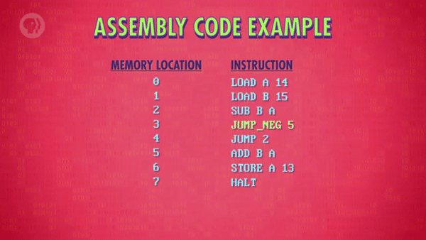
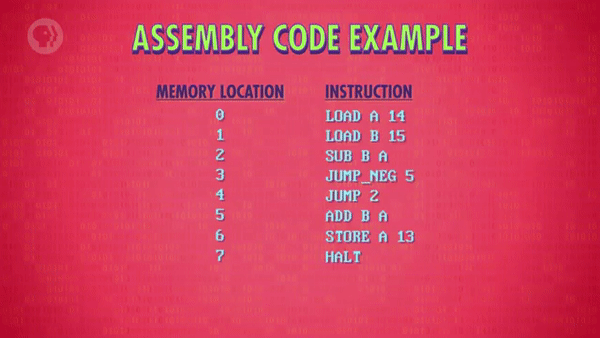
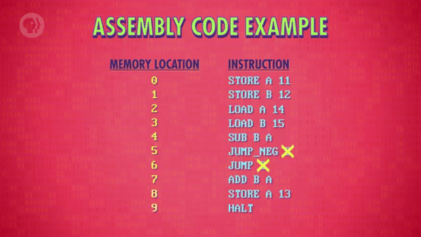
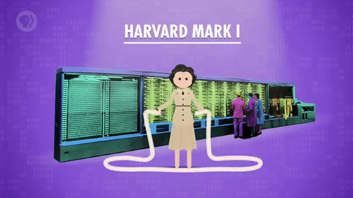
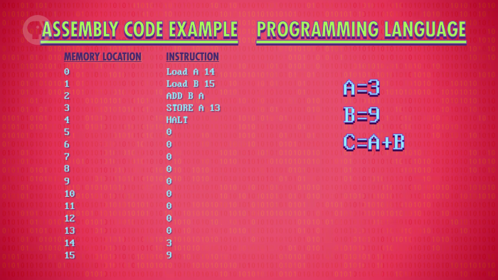

>
해당 포스트는 
Youtube 채널
<a href='https://www.youtube.com/channel/UCX6b17PVsYBQ0ip5gyeme-Q' target='-blank'>'Crash Course'</a>
에서 제공하는 
<a href='https://www.youtube.com/playlist?list=PL8dPuuaLjXtNlUrzyH5r6jN9ulIgZBpdo' target='-blank'>'Computer Science'</a>
수업을 바탕으로 작성되었습니다.  
( 사진 속 인물은
<a href='https://about.me/carrieannephilbin' target='-blank'>'Carrie Anne Philbin'</a>
선생님 입니다! )

# 0. 시작하기에 앞서,

지금까지는 컴퓨팅의 물리적인 구성 요소인 하드웨어에 주로 초점을 맞춰왔다.

> 전기와 회로, 레지스터와 RAM, ALU 와 CPU 등

<br>

하지만, 하드웨어 수준의 프로그래밍은 매우 번거롭고 융통성이 떨어졌기 때문에,  
더 다재다능하고 **부드러운** 프로그래밍 수단에 대한 필요성은 점점 커져만 갔다.

그렇다.

**사람와 컴퓨터 사이의 부드러운 매개체, 소프트웨어에 대한 내용을 다뤄볼 것이다.**

# 1. 기계어

<a href='/Crash-Course/8.-명령어와-프로그램/' target='-blank'>'8. 명령어와 프로그램'</a>
에서 살펴봤던 단순한 프로그램을 떠올려보자.

## 1-1. 컴퓨터 명령어

해당 프로그램에서 처음으로 실행되는 명령어는 0번 주소의 '0010 1110' 이었다.

- 명령어 앞부분의 4비트 '0010' 은 명령 코드(opcode) 다.
   - 이 때, 명령 코드 '0010' 은 'LOAD_A' 명령을 나타낸다.
   - 'LOAD_A' 는 기억 장치의 값을 레지스터A로 써넣는 명령이다.
- 나머지 4비트는 기억 장치의 위치를 나타낸다.
   - 2진수 '1110' 은 기억 장치의 14번 위치를 나타낸다.

<br>

따라서, '0010 1110' 이라는 8자리 숫자가 실제로 의미하는 바는  
'기억 장치의 14번 주소의 값을 레지스터A로 써넣는다.' 이다.  
`(다른 표현 방식을 사용했을 뿐이다.)`

## 1-2. 영어와 모스 부호

위의 경우는 영어와 모스 부호에 비유할 수 있다.

> 'Hello' 와 '.... .-.. .-.. ---' 처럼 다르게 인코딩된 것일 뿐이다.

<br>

이렇게 두 언어 사이에도 복잡성의 수준에서 차이가 있다.

- 영어는 26개의 알파벳으로 구성되어 있고, 다양한 발음이 존재한다.
- 모스 부호는 점(.) 과 대시(-) 만으로 구성되어 있다.

컴퓨터 언어도 이와 비슷하게 '다른 형태로 같은 의미를 전달한다' 고 보면 된다.

## 1-3. 컴퓨터의 언어

이전까지의 수업에서 살펴봤듯, 컴퓨터 하드웨어는 2진수 명령어만 처리할 수 있다.  
`(전기 신호에 따라 다르게 동작하는 회로들로 구성되어 있기 때문)`

이것을 다시 말하면, '프로세서가 사용할 수 있는 유일한 언어' 라고도 할 수 있는데,  
이런 컴퓨터 프로세서의 언어를 **'기계어(Machine Language)'** 라고 부른다.

> 순수(raw) 2진수 정보이며, 'Machine Code' 라고 부르기도 한다.

# 2. 의사 코드

컴퓨팅 초기에는 프로그램을 작성하기 위해 기계어를 사용해야 했다.

사실, 프로그램을 당장 기계어로 작성하는 것은 무리였기 때문에,  
영어로 작성된 높은 수준의 프로그램을 종이에 미리 적어두곤 했다.

예를 들자면, 이런 내용이다.

```
Retrieve the next sale from memory,  
then add this to the running total  
for the day, week and year,  
then calculate any tax to be added..

기억 장치에서 다음 판매 기록을 검색하고,  
그 값을 일, 주, 연 단위 합계에 더한 후에,  
추가할 세금을 계산한다..
```

위와 같은 '프로그램에 대한 높은 수준의 설명' 을 **'의사 코드(Pseudo-Code)'** 라고 한다.  
`(프로그램에 대해서 읽기 쉽게 작성한 내용이라고 보면 된다.)`

이렇게 전체 프로그램에 관한 내용을 서류상으로 미리 정리해둔 후에,  
이 내용을 명령 코드표 등을 활용해 직접 2진 기계어로 번역하는 식이었다.

이후에, 프로그램의 번역이 끝난 후에야 컴퓨터에 입력되고 실행될 수 있었다.

# 3. 니모닉

당연하게도, 의사 코드를 이용한 프로그래밍 과정은 매우 번거로웠다.  
`(사람들은 금새 싫증을 냈다고 한다.)`

그래서 프로그래머들은 1940년대 말부터 1950년대에 이르기까지,  
사람이 쉽게 읽을 수 있는(human-readable) 더 높은 수준의 언어를 개발했다.

명령 내용을 쉽게 떠올릴 수 있도록 각각의 명령 코드마다 문자를 지정하기도 했는데,  
이렇게 특정한 내용을 상징하는 문자들을 **'니모닉(mnemonics)'** 이라고 불렀다.

덕분에, 프로그래머들은 0과 1로 구성된 2진수 명령 코드 대신에,  
'LOAD_A 14' 와 같은 니모닉 문자를 이용해 명령어를 작성할 수 있게 되었다.

> 
<a href='/Crash-Course/8.-명령어와-프로그램/' target='-blank'>'8. 명령어와 프로그램'</a>
에서 사용했던 표현들도 니모닉 문자였다.  
`(명령어를 더 쉽게 파악하기 위해 사용했었다.)`

# 4. 어셈블리어

CPU는 'LOAD_A 14' 와 같은 문자 기반 언어를 인식할 수 없었기 때문에,  
프로그래머들은 이런 상황을 해결하기 위한 영리한 기술을 생각해냈다.

바로, **'어셈블러(Assembler)'** 라는 프로그램이다.

**어셈블러의 특징은 아래와 같다.**

- 2진수로 작성된 재사용 가능한 도우미(reusable helper) 프로그램이다.
- 문자 기반의 명령어를 읽어서 2진 명령어를 조립(assemble)하는 프로그램이다.
- 이 때, 문자 기반의 명령어를 **'어셈블리어(Asemmbly Language)'** 라고 한다.  
  `(이전부터 등장했던 'LOAD_A 14' 도 어셈블리어라고 할 수 있다.)`

## 4-1. 실용적인 기능

시간이 지나면서 어셈블러에는 여러 가지 새로운 기능들이 추가되었는데,  
그중에서도 '점프 주소를 자동으로 식별하는 기술' 은 특히 실용적이었다.

<a href='/Crash-Course/8.-명령어와-프로그램/' target='-blank'>'8. 명령어와 프로그램'</a>
에서 사용했던 프로그램을 예시로 살펴보자.

<details><summary>1. 'JUMP NEG 5' 명령과 'JUMP 2' 명령에 주목해보자.</summary>


</details>

<details><summary>2. 프로그램 초반부에 코드가 추가된 경우를 살펴보자.</summary>

- 이 때, 모든 주소 정보가 바뀌게 된다. `(머리가 어질어질..;)`
- 이렇게 프로그램을 수정할 때마다 주소 값을 바꿔줘야 하는 상황이 발생하는 것이다..


</details>

<details><summary>3. 같은 상황에서 어셈블러를 이용하는 경우를 살펴보자.</summary>

- 이렇게, 점프할 위치에 대한 라벨을 설정할 수 있다.
- 프로그램을 입력받은 어셈블러는 해당 주소 값을 식별한다.


</details>

<br>

이렇게 컴퓨터 내부의 동작과 같은 불필요한 복잡성을 감춤으로써,  
프로그래머들은 더욱 정교한 프로그래밍 작업에 몰두할 수 있게 되었다.

## 4-2. 구조적인 한계

어셈블러에 '자동 주소 링크' 처럼 훌륭한 기능들이 있었음에도,  
어셈블리어는 여전히 기계어에 겉치장을 한 상태에 불과했다.  

1. 기계어로 직접 변환될 수 있으니, 하드웨어에 종속될 수밖에 없다.
   - 1대1로 연결(mapping) 되기 때문에, 모양만 다를 뿐이었다..
2. 프로그래머가 어떤 레지스터, 주소를 사용할 지 고민해야 한다.
   - 추가적인 값이 필요한 경우, 그에 맞춰 많은 코드를 변경해야 한다..

# 5. 컴파일러

어셈블리어의 구조적 한계는 'Grace Hopper' 박사에 의해 극복되었다.

>
<a href='/Crash-Course/2.-전자-컴퓨팅/' target='-blank'>'2. 전자 컴퓨팅'</a>
에서도 등장했던 호퍼 박사는 미국의 해군 장교였으며,  
1944년에 완성된 'Harvard Mark I' 의 최초 프로그래머 중 한 명이었다.  
`(이 글에선 '하버드-1' 이라고 부를 것이다.)`

## 5-1. 낮은 수준의 프로그래밍

우선, 호퍼 박사가 프로그래밍 작업을 했던 하버드-1 에 대해 알아보자.

**하버드-1의 특징은 아래와 같다.**

- 제 2차 세계대전 중 IBM이 연합군을 위해 개발했다.
- 천공 테이프에 저장된 프로그램을 입력받으면 동작했다.

- <details><summary>버그들을 '패치(patch)' 하기 위해 종이 조각(patch) 를 사용했다.</summary>

  - 천공 테이프의 구멍들에 종이 조각을 덧붙여서 문제를 해결했다.

  
  </details>

- 점프 명령조차 없을 정도로 원시적인 명령어 집합이 사용됐다.

- <details><summary>동일한 작업을 여러 번 반복하려면, 물리적인 고리를 만들어야 했다.</summary>

  - 천공 테이프의 두 끝을 붙여서 진짜 고리 형태로 만들어야 했다.

  
  </details>

<br>

> '하버드-1의 프로그래밍은 악몽 그 자체였다!' 고 할 수 있다.

## 5-2. 새로운 언어 체계의 등장

호퍼 박사는 전쟁이 끝난 후에도 컴퓨터 분야의 선두에서 활약했는데,

높은 수준의 프로그래밍 언어 'Arithemetic Language Version 0 (A-0)' 을 설계했고,  
그런 프로그래밍 언어를 기계어로 변역하기 위해서 **'컴파일러(Compiler)'** 를 개발했다.  
`(1952년에 개발되었고, 현대의 컴파일러와는 조금 다른 역할을 했다.)`

- CPU가 이해할 수 있는 기계어와 1대1로 대응되는 어셈블리어와는 다르게,  
  높은 수준의 프로그래밍 언어는 1줄로도 수십 개의 명령을 실행시킬 수 있다.
- 컴파일러는 프로그래밍 언어로 작성된 **'소스 코드(Source Code)'** 를  
  CPU가 바로 실행할 수 있는 기계어나 어셈블리어로 변환하는 프로그램이다.

## 5-3. 프로그래밍의 새로운 시대

더 쉬운 프로그래밍에 대한 가능성에도 불구하고, 많은 사람들은 호퍼 박사의 생각에 회의적이었다.

<br>

>
'I had a running compiler and nobody would touch it.  
... they carefully told me, computers could only do arithmetic;  
they could not do programs.'  
\- Grace Hopper
> <hr>
>
나는 작동되는 컴파일러를 가지고 있었는데 아무도 손대지 않았다.  
... 그들은 나에게 조심스럽게 말했다,  
컴퓨터는 산수만 할 수 있고, 프로그램은 할 수 없다. 라고..

<br>

하지만, 호퍼 박사의 이런 아이디어는 아주 좋은 아이디어였기 때문에,  
얼마 지나지 않아 새로운 프로그래밍 언어를 만들기 위한 다양한 시도가 생겨났다.

> 오늘날에는 수백 가지의 프로그래밍 언어가 있다.

# 6. 낮은 수준, 높은 수준의 비교

> A-0의 예가 남아 있지 않아서, 현대 프로그래밍 언어 파이썬을 예시로 살펴볼 것이다.

높은 수준의 언어와 낮은 수준의 언어를 예시와 함께 간단하게 비교해보자.

- <details><summary>클릭하여, '두 수를 더하고, 저장하는 프로그램' 을 살펴보자.</summary>

  
  </details>

- <details><summary>클릭하여, 어셈블리어와 파이썬의 차이를 살펴보자.</summary>

  | 언어 | 어셈블리어 | 파이썬 |
  |-|-|-|
  | 동작 | 1. 기억 장치에서 값을 가져와 레지스터에 저장한다.<br>2. 레지스터에 저장되어 있는 두 개의 값을 더한다.<br>3. 계산 결과를 기억 장치의 13번 주소에 저장한다.<br>4. 중지 명령어로 프로그램을 종료시킨다. | 1. A라는 변수에 3이라는 값을 저장한다.<br>2. B라는 변수에 9라는 값을 저장한다.<br>3. C라는 변수에 A와 B를 더한 값을 저장한다. |
  | 특징 | - 기억 장치에서 값을 인출한다.<br>- 레지스터의 값과 그 외의 낮은 수준의 세부 사항들을 다룬다. | - 레지스터, 기억 장치 위치를 별도로 처리하지 않는다.<br>- 대신, 컴파일러가 다양한 낮은 수준의 작업들을 처리한다.<br>- 덕분에, 불필요한 세부 사항들을 신경쓰지 않아도 된다. |
  </details>

<br>

위 예시처럼 프로그래밍 언어는 기억 장치 위치에 이름을 붙여서 사용할 수 있는데,  
값이 저장된 위치에 대해 추상화한 요소를 **'변수(variable)'** 라고 부른다.

- 예시에서는 A, B, C라고 이름을 붙였지만, 변수 이름을 다르게 지정할 수도 있다.
- 이 때, 레지스터A에 저장된 값이 A 변수인지, B 변수인지는 신경쓰지 않아도 된다.

# 7. 포트란

역사적으로 중요한 요소임에도 불구하고 널리 사용되지 않았던 'A-0' 과는 다르게,  
몇년 후인 1957년, IBM에서 출시한 **'Fortran'** 은 초기 프로그래밍 분야를 지배했다.  
`(이 글에선 '포트란' 이라고 부를 것이다.)`

<details><summary>클릭하여, 포트란 프로젝트의 기획자가 당시 인터뷰에서 했던 말을 살펴보자.</summary>

>
'Much of my work has come from being lazy.  
I didn't like writing programs, and so...  
I started work on a programming system to make it easier to write programs'  
\- John Backus
> <hr>
>
'제 작업의 대부분은 게으름에서 비롯되었습니다.  
저는 프로그램 작성을 좋아하지 않았기 때문에  
프로그램 작성을 더 쉽게하기 위해 프로그래밍 시스템 작업을 시작했습니다.'

<br>

>
그는 스스로를 위해 프로그래밍 체계를 만드는 전형적인 게으른 사람이다..  
\- Carrie Anne Philbin

`(일침 무엇;)`
</details>

<br>

**포트란의 특징을 정리하면 아래와 같다.**

- 포트란이라는 이름은 수식 변환기(**FOR**mula **TRAN**slation) 의 약자다.
   - 말 그대로 수식 계산에 사용되고, 과학 분야의 계산에 주로 활용된다.
- 같은 프로그램을 작성해도, 어셈블리어보다 훨씬 더 짧은 코드로 구성된다.
   - 작성된 코드의 양은 평균적으로 20배 정도 차이난다고 한다.
- 순수 기계어(native machine code) 로 번역하는 컴파일러를 사용한다.

<br>

커뮤니티에서는 컴파일러로 인한 성능 저하에 대해 회의적인 입장이 많았지만,  
더 많은 코드를 더 빠르게 작성할 수 있다는 효율성 덕분에 널리 사용될 수 있었고,

물론, 포트란 언어가 등장하고 얼마 동안은 IBM 컴퓨터에서만 실행될 수 있었다.  
`(이후, 다른 컴퓨터 제조업체에서 포트란 컴파일러를 요청했다고 한다.)`

<br>

>
약간의 연산 처리 시간 증가와 의미있을 정도의 프로그래밍 시간 감소를 교환한 것이다..  
`(아, 워라밸은 못 참지 ㅋㅋ)`

# 8. 코볼

1950년대에 등장한 대부분의 프로그래밍 언어와 컴파일러는  
한 종류의 컴퓨터에서만 실행되도록 설계되었기 때문에,

컴퓨터를 업그레이드하면, 모든 코드를 다시 작성해야 하는 경우가 많았다.

## 8-1. CODASYL

이런 상황을 개선하기 위해, 1959년에 산업, 학계 및 정부의 컴퓨터 전문가들은  
서로 다른 기계에서 사용될 수 있는 범용 프로그래밍 언어 개발을 안내하는 단체인

**'CODASYL(Conference/Committee on Data Systems Languages)'** 을 설립했다.

- CODASYL은 데이터 시스템 언어 회의와 위원회 모두를 뜻한다.
- 위에서 등장했던 호퍼 박사도 참여하여 많은 기여를 했다.

## 8-2. COBOL

이후, CODASYL은 호퍼 박사의 프로그래밍 언어 설계 디자인을 기반으로 하여,  
높은 수준의 사용하기 쉬운 언어인 **'COBOL(사무 지향 보통 언어)'** 을 개발했다.  
`(이 글에선, '코볼' 이라고 부를 것이다.)`

> **CO**mmon **B**usiness-**O**riented **L**angage

<br>

기본 하드웨어에 관계없이 컴퓨팅 구조에 코볼 컴파일러를 추가하기만 하면,  
똑같은 코볼 소스 코드를 어떤 컴퓨터에 입력하더라도 문제없이 실행되었다.

- 이런 개념을 **'한번 쓰면 어디서나 실행(Write Once Run Anywhere)'** 라고 한다.
- 오늘날 대부분의 언어들은 CPU에 따라 달라지는 기계어, 어셈블리어에 영향을 받지 않는다.

## 8-3. 프로그래밍의 발전

이러한 발전들은 컴퓨터에 대한 진입장벽을 낮추는 데 큰 영향을 끼쳤다.

높은 수준의 언어가 등장하기 전, 컴퓨팅은 전문가들이 독점하는 영역이었지만,  
점차 과학, 공학, 경제, 교육 등 다양한 분야에 접목되어 활용되기 시작했다.

이렇게 '어렵고 복잡한 학문' 에서 '편리한 범용 도구' 로 발전함과 동시에,  
전문적인 프로그래머들은 이전보다 더 정교한 프로그램들을 작성할 수 있게 되었다.

>
어셈블리어로 코딩했다면, 수백만, 수천만 줄 이상의 코드가 작성되었을 것이다..  
`(이렇게나 추상화가 중요합니다..)`

<br>

**<작성 중인 글입니다.>**

**<아래 내용은 정리 중입니다.>**

# 9. 다양한 언어의 등장

자, 이 역사는 1959년에 끝나지 않았다.

사실, 프로그래밍 언어의 황금 시대가 시작되어 컴퓨터 하드웨어의 획기적인 진보와 함께 진화를 거듭했다.

1960년대에는 ALGOL 이나, LISP, BASIC 과 같은 언어를 사용했고,  
70년대에는 파스칼, C언어 및 SmallTalk 가 출시되었다.

80년대에는 C++, Objective-C, Perl 이 탄생했다.

그리고 90년대에는 파이썬, 루비, 자바.
2000년대에는 Swift, C#, Go.

어쨋든, 이 중 일부는 친숙하게 들릴지도 모른다.

많은 것들이 아직도 오늘날도 사용된다.

지금 사용하고 있는 웹 브라우저는 C++ 또는 Objective-C 로 작성되었다.

방금 전에 말했던 목록은 빙산의 일각이다.

세련되고 새로운 기능을 갖춘 언어는 항상 제안되었다.

각각의 새로운 언어는 새롭고 영리한 추상화를 활용하여  
프로그래밍의 일부 측면을 보다 쉽고 강력하게 만들거나

신기술 및 플랫폼을 활용함으로써 더 많은 사람들이  
보다 놀라운 일들을 더 빨리할 수 있게 했다.

# 10. 프로그래밍 언어에 관하여,

많은 사람들이 프로그래밍의 성배를 '평범한 영어' 를 사용하는 것이라고 생각한다.

문자 그대로 여러분이 컴퓨터가 할 일을 말하면, 그것을 알아내고 실행한다.

이러한 종류의 지능 시스템은 지금은 과학 소설과 같다.

그리고 2001년의 팬: 스페이스 오딧세이가 괜찮을지도 모른다.

이제 프로그래밍 언어에 대해 모두 알았으므로,  
우리는 다음 몇 개의 수업에서 좀 더 깊이있게 알아볼 것이다.

그리고 계속해서 어떻게 프로그래밍 언어와 소프트웨어가  
멋있고 믿기지 않는 일들을 하는데 사용되는지에 대한 이해를 구축해 나갈 것이다.
