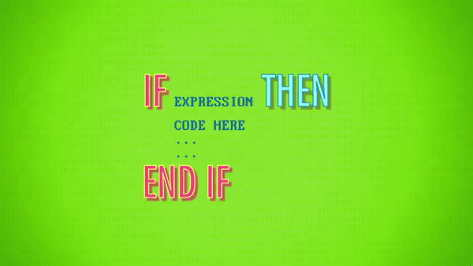
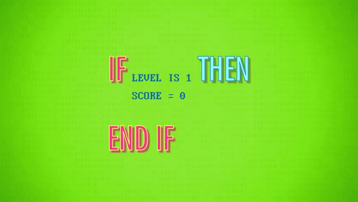
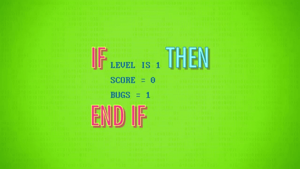
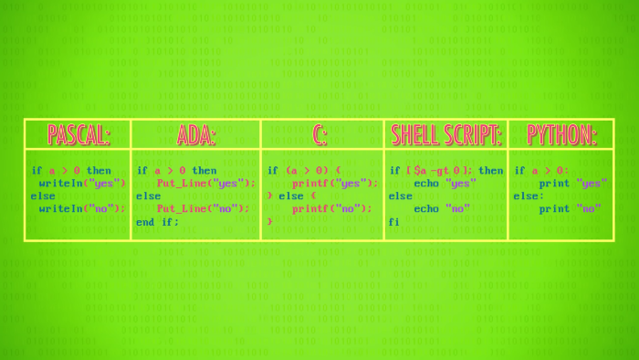
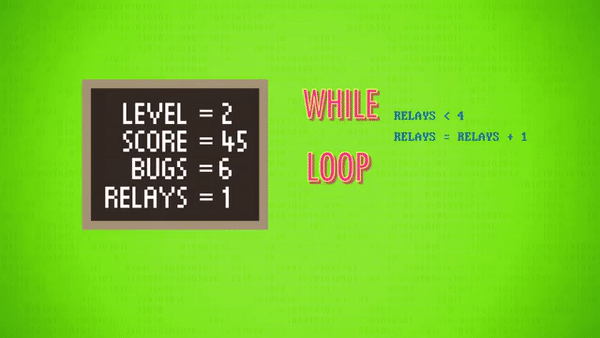
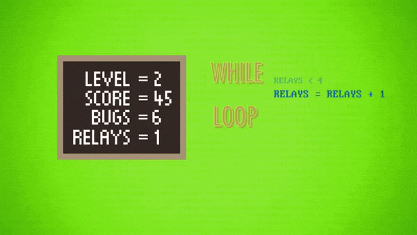
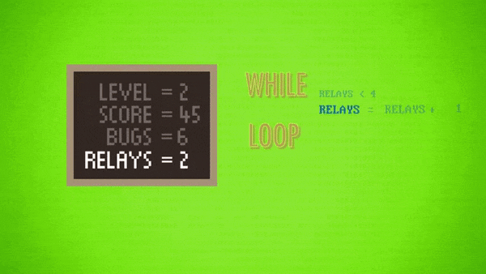
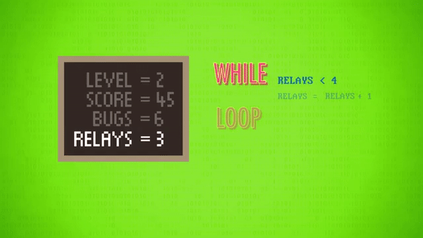
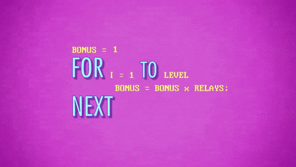
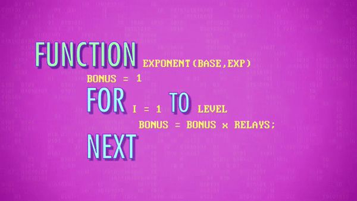

>
해당 포스트는 
Youtube 채널
<a href='https://www.youtube.com/channel/UCX6b17PVsYBQ0ip5gyeme-Q' target='-blank'>'Crash Course'</a>
에서 제공하는 
<a href='https://www.youtube.com/playlist?list=PL8dPuuaLjXtNlUrzyH5r6jN9ulIgZBpdo' target='-blank'>'Computer Science'</a>
수업을 바탕으로 작성되었습니다.  
( 사진 속 인물은
<a href='https://about.me/carrieannephilbin' target='-blank'>'Carrie Anne Philbin'</a>
선생님 입니다! )

# 0. 시작하기에 앞서,

지난 수업에서는 순수 기계어를 이용해 프로그램을 작성하는 방법과,  
낮은 수준의 세부 사항들로 인해 발생하는 많은 불편에 대해 살펴봤다.  

> 복잡한 프로그램을 작성하는 경우에 특히 심했다.

이러한 낮은 수준의 세부 사항들을 추상화하기 위해 프로그래밍 언어가 개발되었고,  
프로그래머들은 하드웨어적 요소보다 컴퓨팅을 활용한 문제 해결에 더 집중할 수 있게 되었다.

이번 수업에서도 이와 관련된 내용들을 계속해서 다뤄볼 것이고,  
프로그래밍 언어들이 제공하는 기본적인 구성 요소들을 살펴볼 것이다.

# 1. 문장과 구문

'나는 차를 마시고 싶다.', '비가 내리고 있다.' 처럼 입으로 말하는 언어(구어) 와 마찬가지로,  
프로그래밍 언어에도 개별적인 생각을 온전히 나타내는 **'문장(statement)'** 이 존재한다.

또, '나는 주스를 마시고 싶다.' 처럼 다른 단어를 사용해서 의미를 바꿀 수는 있지만,  
문법적으로 말이 안되는 '나는 비가 내리고 싶다.' 와 같은 표현으로는 바꿀 수는 없는데,

```
I want tea => I want juice   (o)
I want tea => I want raining (x)
```

이렇게 언어에서 문장의 구성과 구조에 대해 다루는 규칙 집합을 **'구문(syntax)'** 이라고 하는데,  
영어, 한국어와 같은 언어들이 구문을 갖고 있듯, 모든 프로그래밍 언어에도 구문이 존재한다.

# 2. 할당문

프로그래밍 언어의 문장 `a = 5` 는 값 5가 변수 a에 저장된다는 것을 나타내는데,  
이렇게 변수에 값을 할당하는 문장을 **'할당문(assignment statement)'** 이라고 한다.

```
a = 5
b = 10
c = a + b
```

위와 같이 여러 개의 문장을 이용해 더 복잡한 내용들을 표현할 수 있는데,  
이렇게 구성된 프로그램은 컴퓨터가 아래와 같이 변수를 설정하도록 한다.

```
a = 5       → 1. 변수 'a' 에 값 '5' 를 할당한다.
b = 10      → 2. 변수 'b' 에 값 '10' 을 할당한다.
c = a + b   → 3. a 와 b 를 합친 값 '15' 를 변수 'c' 에 할당한다.
```

또, 위 예시의 `a, b, c` 를 `apples, pears, fruits` 로 바꿀 수도 있는데,  
아무리 독특한 변수명을 사용하더라도 서로 겹치지만 않는다면 문제없이 동작한다.

> 단, 다른 사람들이 쉽게 이해할 수 있도록 구성하는 것이 가장 좋은 방법이다.

# 3. 변수 초기화

여러 명령어로 구성된 프로그램은 음식 조리법과 비슷하다.

<details><summary>물을 끓이고, 국수를 넣고, 10분 동안 기다린 후에 물기를 빼서 먹는다.</summary>


</details>

- 컴퓨터 프로그램도 위와 같이, 처음부터 끝까지 한 문장씩 실행된다.

<br>

두 숫자를 더하는 지루한 프로그램대신, 이번엔 비디오 게임을 만들어보자.

>
물론, 전체 게임을 코딩하기에는 너무 이르기 때문에,  
기본 원리를 다루는 작은 코드 조각(snippet) 들을 예시로 사용할 것이다.

벌레(bug) 가 하버드-1 에 들어가 내부에 있는 계전기(relay) 를 고장내기 전에  
호퍼 박사가 그 벌레들을 잡는 내용의 고전 아케이드 게임을 만들어볼 것이다.

- 매 단계마다 벌레의 수가 증가한다.
- 호퍼 박사는 벌레가 기계 안으로 들어가기 전에 잡아야 한다.
- 다행히, 호퍼 박사는 여분의 계전기를 갖고 있다.

<details><summary>이런 느낌의 게임이다.</summary>

`(크.. 고전 게임 갬성에 취한다..)`


</details>

<br>

우선, 게임 실행에 꼭 필요한 여러 가지 값들을 추적하기 위해서,  
사용할 변수들의 초기값을 지정, 즉, **'초기화(initialize)'** 해야 한다.

> 현재 사용자의 단계와 점수, 남아있는 벌레의 수, 호퍼 박사가 갖고 있는 예비 계전기의 수 등

<details><summary>클릭하여, 변수 초기화의 예시를 살펴보자.</summary>

| 변수 | 내용 | 초기값 |
|-|-|-|
| level | 현재 단계 | 1 |
| score | 현재 점수 | 0 |
| bugs | 남은 벌레 | 5 |
| relays | 예비 계전기 | 4 |
| playername | 사용자 이름 | 'Andre' |


</details>

# 4. 조건문

단순히 위에서 아래로 실행되는 프로그램은 상호작용이 불가능하므로,  
이번 수업에서 만들기로 한 게임에는 흐름을 조절할 방법이 필요한데,

이를 위해서 **제어 흐름(control flow)** 문장들을 사용해볼 것이다.

<br>

우선, 가장 일반적인 유형인 **'if 문(if statement)'** 부터 살펴보자.

- 'If X is true, then do Y.(X가 참이라면, Y를 하세요.)' 와 같은 형태이다.
<details><summary>영어로 구성된 예시 문장과 함께 더 자세하게 살펴보자.</summary>

  > 'If I am tired, then get the tea(내가 피곤하다면 차를 마셔라.)' 

  - 'I am tired.(나는 피곤하다)' 가 참이면, 차를 마실 것이다.
  - 'I am tired.(나는 피곤하다)' 가 거짓이면, 차를 마시지 않을 것이다.

</details>

- if 문은 참과 거짓의 여부에 따라 경로가 선택되는(conditional) 갈림길과 같다.
   - 때문에, 이런 표현을 **'조건문(conditional statement)'** 이라고 한다.

- 대부분의 프로그래밍 언어에서 if 문은 아래와 같은 형태를 띈다.
<details><summary>if <표현(식)> 뒤에 <코드> 뒤에 end if</summary>

  

</details>

<br>

간단한 예시와 함께 더 구체적으로 살펴보자.

<details><summary>1. 게임을 방금 시작한 경우, 점수는 0으로 설정한다.</summary>

```
if level is 1 then
    score = 0
end if
```



</details>

<details><summary>2. 쉬운 난이도로 시작할 수 있도록, 벌레의 수는 1로 설정한다.</summary>

```
if level is 1 then
    score = 0
    bugs  = 1
end if
```



</details>

<details><summary>3. 이 때, if 와 end if 사이에서 조건을 나타내는 코드에 주목해보자.</summary>

- 당연하게도, 조건부 표현들을 테스트하고 싶은 내용으로 바꿀 수도 있다.
   - `level is 1` 을 `score > 10` 나 `bugs < 1` 로 변경할 수도 있다.



</details>

<details><summary>4. 또, 표현식이 거짓인 모든 경우에서 작동하는 'else 문' 과 함께 사용될 수도 있다.</summary>

- if 문의 조건이 거짓인 경우, else 블록의 코드가 대신 실행된다.
- 아래 상황에서는 'level' 이 1이 아니면, 처리해야 할 벌레의 수는 레벨의 3배로 설정된다.
   - 이 때, 벌레의 수는 '2단계에선 6마리, 3단계에선 9마리, ..' 가 될 것이다.
   - 또, 'score' 의 값은 수정되지 않기 때문에, 사용자가 얻은 점수를 유지할 수 있다.

```
if level is 1 then
    score = 0
    bugs  = 1
else
    bugs  = level * 3
end if
```


</details>

<br>

<details><summary>클릭하여, 유명한 프로그래밍 언어들의 if-then-else 문을 살펴보자.</summary>

- 조금씩 다른 구문으로 구성되지만, 기본 구조는 거의 동일하다.



</details>

# 5. 조건 제어 루프 (while)

프로그램 진행 중에 if 문은 조건부 경로가 선택되면 한 번만 실행되는데,  
여러 문장을 여러 번 반복하기 위해서는 조건부 루프(conditional loop) 를 만들어야 한다.

조건부 루프를 만드는 방법 중 하나는 **'while 문(statement)'** 을 사용하는 것인데,  
이름에서 짐작할 수 있듯, 특정 조건이 참인 동안(while) 만 내부의 코드들이 반복된다.

> 또, 이렇게 구성된 루프는 **'while 루프(loop)'** 라고 부른다.

어떤 프로그래밍 언어든지, 아래와 같은 형태로 구성된다.

```
while expression
    code to be
    looped here
    ...
loop
```

특정 시점마다 친절한 동료가 등장해 호퍼 박사의 계전기를 다시 채워넣는다고 가정해보자.

> 이 때, while 문을 사용하여 계전기의 갯수가 최대 4개가 될 때까지 보충하도록 할 수 있다.

이 과정을 코드와 함께 더 자세하게 살펴보자.

<details><summary>1. 동료가 오기 전, 호퍼 박사가 소지한 계전기의 수가 1개라고 가정해보자.</summary>

- while 루프에 진입할 때, 컴퓨터는 'relays < 4' 라는 조건을 먼저 테스트한다.
- 현재 'relays' 의 값은 1이므로 조건은 참이 되고, 루프의 내부로 진입하게 된다.



</details>

<details><summary>2. 이제, 다음 줄에 있는 'relays = relays + 1' 이라는 코드를 마주치게 된다.</summary>

- 변수의 할당문에 변수 자체가 사용되서 헷갈릴 수 있겠지만, 항상 등호의 오른쪽부터 파악하면 된다.
- 현재 'relays' 의 값은 1이므로, 'relays + 1' 의 결과는 '1 + 1 = 2' 가 된다.
- 따라서, 위에서 얻은 결과값 2가 'relays' 에 덮어 씌워진다.



</details>

<details><summary>3. while 루프의 끝에 도달했으니, 프로그램의 위쪽(while) 으로 다시 올라간다.</summary>

- 이전과 마찬가지로, 루프에 진입할 지 여부를 확인하기 위해 조건을 테스트한다.
- 현재 'relays' 의 값은 2이므로 'relays < 4' 는 참이 되고, 다시 루프의 내부로 진입한다.
- '2 + 1 = 3' 이 'relays' 에 덮어씌워지고, 다시 위쪽으로 올라간다.



</details>

<details><summary>4. 조건이 거짓이 될 때까지, '3' 의 과정을 반복한다.</summary>

```
'relays(3) < 4' => relays = 3 + 1 (4) => 'relays(4) < 4' => x
```



</details>

5. 조건이 거짓이 되면, 루프에서 빠져나와 다음 줄의 코드로 이동한다.

<br>

이렇게, while 루프의 동작 방식에 대해 알아봤다.

# 6. 횟수 제어 루프 (for)

조건이 거짓이 될 때까지 영원히 반복되는 while 루프 대신에  
특정 횟수만큼만 반복되는 **'for 루프(for loop)'** 를 사용할 수도 있다.

>
'조건 제어 루프(condition-controlled loop)' 인 while 루프와 다르게,  
for 루프는 '횟수 제어 루프(count-controlled loop)' 라고 할 수 있다. 

for 루프의 구성은 대략 아래와 같다. `(세부적인 구성은 언어마다 다르다.)`

```
for variable = start_value
to end_value
    code to be looped here
    ...
next
```

<details><summary>실제 값을 대입하여 더 자세하게 살펴보자.</summary>

```
for i = 1 to 10
    code to be looped here
    ...
next
```

- 예시의 변수 'i' 의 값은 1부터 시작해서 10까지 올라가도록 지정했기 때문에 10번 반복된다.
- for 루프에서 'next' 에 도달할 때마다 'i' 의 값은 1씩 증가한다.
- 'i'의 값이 10이면 컴퓨터는 10번 반복되었음을 인식하고 루프에서 빠져나간다.
- 반복 횟수는 10, 42, 10억, .. 등 사용자가 필요로 하는 값으로 지정할 수 있다.

</details>

<br>

매 단계가 끝날 때마다, 보너스 계전기를 지급한다고 가정해보자.

난이도가 어려워질수록 여분의 계전기 수를 유지하기 힘들어질 테니,  
보너스 계전기의 수를 단계마다 기하급수적으로 증가시킬 필요가 있다.

따라서, '지수' 에 대해 계산하는 코드 조각을 작성해야 한다.

> 숫자를 일정 횟수만큼 곱해야 하므로 루프를 활용하기 매우 적합하다.

<br>

루프를 활용하여 해당 코드를 구성해보자.

<details><summary>1. 새로운 변수 'bonus' 를 초기화하여 값을 1로 설정한다.</summary>

```
bonus = 1
```

</details>

<details><summary>2. 1부터 시작해서 'level' 까지 반복하는 for 루프를 생성한다.</summary>

```
bonus = 1

for i = 1 to level

next
```

</details>

<details><summary>3. 루프 내부에서 'bonus * relays' 를 'bonus' 에 저장하도록 한다.</summary>

```
bonus = 1

for i = 1 to level
    bonus = bonus * relays
next
```

</details>

<br>

<details><summary>'relays' 는 2, 'level' 은 3인 경우를 살펴보자.</summary>

1. for 루프는 1부터 3까지 총 3번 반복된다.

```
bonus = 1

for i = 1 to 3
    bonus = bonus * 2
next
```

2. 'i' 의 값이 증가하면, 'bonus' 값은 아래처럼 변한다.

```
i = 1 => bonus = 1 * 2 (2)
i = 2 => bonus = 2 * 2 (4)
i = 3 => bonus = 4 * 2 (8)
```

3. 이렇게, 2가 3번 곱해져서, 2^3(2의 3승) 이 된다.

```
1 * 2 * 2 * 2 = 2^3
```

</details>

# 7. 함수

위에서 작성한 지수 계산용 코드 조각이 다른 곳에서 유용하게 사용될 수도 있는데,  
필요한 위치마다 복사해서 붙여넣기는 귀찮을 것이고, 변수명 또한 매번 바꿔줘야 한다.

또, 버그를 발견하면 사용된 모든 위치를 찾아 코드를 수정해야 하는 데다가,  
코드의 길이가 길어지는 만큼 내용을 파악하기에 더 혼란스러워질 수밖에 없다.  
`(대부분의 경우에 코드의 양이 적을수록 더 좋다.)`

이런 상황에서 필요한 것은 지수 계산용 코드 조각을 포장(package) 하여,  
내부의 복잡성을 보지 않으면서, 포장된 패키지를 사용하고 결과만 얻는 방법이다.  

> 다시 한 번, 더 높은 추상화 계층으로 넘어가보자. 

<br>

프로그래밍 언어는 복잡성을 분류하고 감추기 위해, 코드 조각을 이름있는 **'함수(function)'** 로 포장할 수 있다.

- 언어에 따라서 메서드(method), 서브 루틴(subroutine) 이라 부르기도 한다.
- 프로그램의 어떤 위치에서라도 이름을 호출(call) 하여 사용할 수 있다.

<br>

이번에는 위에서 구성한 지수 계산용 코드를 함수로 변환해보자.

<details><summary>1. 코드 조각을 포장하기 위해 함수명부터 지정해야 한다.</summary>

- 'HappyUnicorn' 처럼 어떤 이름이든 붙일 수 있지만,  
  지수 계산용 코드이므로 'exponent(지수)' 라는 함수명을 사용할 것이다.



</details>

<details><summary>2. 함수에 초기값을 전달(pass) 하기 위해 변수명을 정해야 한다.</summary>

- 나머지 코드는 이전과 동일하게 구성하되, 변수명만 바꾸면 된다.
- 'relays' 와 'level' 처럼 특정 요소를 가리키는 변수명 대신,  
  'base(밑)' 와 'exp(지수)' 처럼 포괄적인 변수명을 사용할 것이다.
- 이 변수를 이용하면, 프로그램 내부의 다른 위치에서 초기값을 전달할 수 있다.
- 이 때, 기존의 코드 구성은 그대로 두고, 변수명만 바꿔주면 된다.



</details>

# 8. 반환문

마지막으로, 프로그램 내부의 '함수가 사용된 위치' 로 함수의 결과를 보내야 하는데,  
이 때, 값을 되돌려보내기(return) 위해 **'return statement(반환문)'** 을 사용할 수 있다.

위에서 살펴본 'exponent' 함수는 결과값을 나타내는 'result' 를 반환하면 된다.

<details><summary>클릭하여, 반환문이 추가된 전체 코드의 구성을 확인해보자.</summary>

```
function exponent(base, exp)
    result = 1
    for i = 1 to exp
        result = result * base;
    next
return result
```

- 함수 이름과 숫자 2개만 넘겨주면 프로그램의 어느 부분에서라도 사용할 수 있다.
- 예를 들어, 2의 44제곱을 계산하는 경우 'exponent(2, 44)' 라고 호출하면 된다.
   - 2와 44는 'base(밑)' 와 'exp(지수)' 에 각각 저장된다.
   - 변수의 값으로 지정된 반복 횟수(44) 만큼 루프를 수행한다.
   - 모든 루프가 마무리된 후에 결과값(약 18조) 을 반환한다.

</details>

# 9. 함수의 활용

위에서 구성한 함수를 사용해 보너스 점수를 계산해보자.

<details><summary>1. 우선, 'bonus' 변수를 0으로 초기화한다.</summary>

```
bonus = 0
```

</details>

<details><summary>2. if 문을 이용해 사용자가 여분의 계전기를 소지하고 있는 지 확인한다.</summary>

```
bonus = 0

if relays > 0

end if
```

</details>

<details><summary>3. 여분의 계전기를 소지하고 있다면, 보너스를 계산한다.</summary>

- exponent 함수에 'relays' 와 'level' 을 전달한다.
- 계전기의 갯수를 단계의 수만큼 제곱한 결과가 반환된다.

```
bonus = 0

if relays > 0
    exponent(relays, level)
end if
```

</details>

<details><summary>4. 이 때, 반환된 결과를 'bonus' 변수에 저장한다.</summary>

```
bonus = 0

if relays > 0
    bonus = exponent(relays, level)
end if
```

</details>

<details><summary>5. 보너스 계산 코드는 나중에 유용하게 사용될 수 있으니, 함수로 정리해보자.</summary>

- 이렇게 함수를 호출하는 함수를 구성할 수도 있다.

```
function calcbonus(relays, level)
    bonus = 0

    if relays > 0
        bonus = exponent(relays, level)
    end if
return bonus
```

</details>

<br>

이후에, 위의 함수를 훨씬 더 복잡한 함수에서 사용할 수도 있는데,  
사용자가 게임을 한 단계씩 완료할 때마다 호출될 함수를 작성해보자.

<details><summary>1. 함수에 'levelfinished' 라는 이름을 붙인다.</summary>

```
function levelfinished
```

</details>

<details><summary>2. 함수에 필요한 값들이 전달되도록 한다.</summary>

- 남은 계전기의 수(relays), 현재 단계(level), 사용자의 점수(score) 가 필요하다.

```
function levelfinished(relays, level, score)
```

</details>

<details><summary>3. 함수 내부에서 현재 점수에 보너스 점수를 추가한다.</summary>

- 보너스 점수를 계산하기 위해서 'calcbonus' 함수를 사용한다.

```
function levelfinished(relays, level, score)
    score = score + calcbonus(relays, level)
```

</details>

<details><summary>4. 현재 점수가 게임의 최고 점수보다 높으면, 점수와 사용자 이름을 저장한다.</summary>

```
function levelfinished(relays, level, score)
    score = score + calcbonus(relays, level)
    if score > highscore
        highscore  = score
        highplayer = playername
    end if
```

</details>

<details><summary>5. 마지막으로, 현재의 점수를 반환한다.</summary>

>
함수를 호출하는 함수를 호출하는 함수를 호출하는 화려한 코드가 되었어요!  
\- Carrie Anne Philbin

```
function levelfinished(relays, level, score)
    score = score + calcbonus(relays, level)
    if score > highscore
        highscore  = score
        highplayer = playername
    end if
return score
```

</details>

<br>

루프나 변수같은 모든 복잡한 요소들이 함수 내부에 숨겨져 있기 때문에,  
아래처럼 작성된 단 한 줄의 코드만으로도 마법처럼 결과를 얻을 수 있게 된다.  

```
totalscore = levelfinished(2, 5, 21)
```

> 마법처럼 보일 수 있지만, 이것이 바로 추상화의 힘이다.

# 10. 현대 프로그래밍에 관하여,

위의 예제를 이해했다면, 함수의 능력과 현대 프로그래밍의 본질에 대해서도 이해한 것이라 할 수 있다.

<details><summary>클릭하여, 더 구체적인 예시들을 살펴보자.</summary>

> #### 예를 들어,
웹 브라우저를 구성하기 위해 문장들을 단순히 나열하는 것은 현실적이지 않으며,  
구성하더라도, 수백만 줄에 달하는 방대한 규모의 내용을 이해할 수 없을 것이다.

이런 이유로, 소프트웨어는 서로 다른 기능을 담당하는 수천 개의 작은 함수들로 구성된다.

>
또, 현대 프로그래밍에서는 100줄이 넘어가는 함수를 찾아보기 힘들다.  
`(그때 쯤이면 별도의 함수로 구성될만한 요소가 생길 수 밖에 없기 때문..)`

</details>

<details><summary>클릭하여, 프로그램을 함수로 모듈화(modularize) 했을 때의 효과를 살펴보자.</summary>

- 단 한 명의 프로그래머가 전체 프로그램을 작성할 수 있게 된다.
- 여러 사람들로 구성된 팀들이 훨씬 더 큰 프로그램에 대해서도 효율적으로 작업할 수 있게 된다.
- 서로 다른 프로그래머가 서로 다른 함수에 대해 작업할 수 있다.
   > 모든 프로그래머가 작성한 코드가 올바르게 동작하면,  
     그것들을 합친 전체 프로그램 또한 제대로 동작하게 된다.

</details>

<br>

<details><summary>실제 프로그래머들은 'exponent' 와 같은 것을 작성하는데 시간을 낭비하지 않는다.</summary>

**'라이브러리(Library)'** 라고 하는 '미리 작성된 함수들의 거대한 집합들' 이 있기 때문이다.

- 전문적인 코더에 의해 작성되고, 효율적이고 엄격한 테스트를 거친 후에 공개된다.
- 네트워킹, 그래픽, 음향 등 거의 모든 분야에서, 다양한 라이브러리를 찾아볼 수 있다.  
  `(이 부분은 이후의 수업에서 다뤄볼 예정이다.)`

</details>

<br>

하지만 이런 내용들을 다루기 전에, 우리는 **'알고리즘(Algorithm)'** 에 대해 배울 필요가 있다.

<br>

>
호기심이 생기나요? 그래야 할 겁니다.  
\- Carrie Anne Philbin


<br>

**<작성 중인 내용입니다.>**

**<아래 내용은 정리 중입니다.>**

# 배운 점, 느낀 점

코딩 공부만 하느라 부족했던 기초를 확실하게 다질 수 있어서 좋았고,  
기본 개념이 확실하면 어떤 언어를 사용하든 상관없다는 것을 깨달았다.

## 1.

- 개별적인 동작을 온전히 나타내는 코드 조각인 문장
- 문장에 대한 구성, 구조에 대한 규칙들의 집합인 구문
- 프로그램에 사용할 변수에 값을 할당하는 문장인 할당문
- 할당문을 통해 변수들의 초기값을 지정하는 변수 초기화
- 프로그램의 흐름을 제어하는 제어 흐름 문장 중 하나인 조건문
- 조건에 따라 여러 문장을 여러 번 반복하는 조건 제어 루프
- 지정된 횟수에 대해서만 반복을 수행하는 횟수 제어 루프
- 복잡성을 감추기 위해 코드 조각을 포장한 요소인 함수
- 함수가 호출된 위치로 결과를 보내기 위해 사용되는 반환문
- 함수를 호출하는 함수 등 다양하게 활용되는 함수
- 모듈화를 통해 더 효율적으로 작업하는 현대의 프로그래밍 방식
- 미리 작성된 함수들의 거대한 집합인 라이브러리
