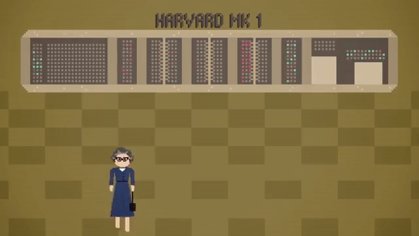
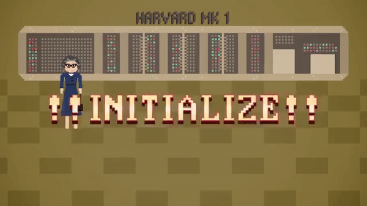

>
해당 포스트는 
Youtube 채널
<a href='https://www.youtube.com/channel/UCX6b17PVsYBQ0ip5gyeme-Q' target='-blank'>'Crash Course'</a>
에서 제공하는 
<a href='https://www.youtube.com/playlist?list=PL8dPuuaLjXtNlUrzyH5r6jN9ulIgZBpdo' target='-blank'>'Computer Science'</a>
수업을 바탕으로 작성되었습니다.  
( 사진 속 인물은
<a href='https://about.me/carrieannephilbin' target='-blank'>'Carrie Anne Philbin'</a>
선생님 입니다! )

# 0. 시작하기에 앞서,

지난 수업에서는 순수 기계어를 이용해 프로그램을 작성하는 방법과,  
낮은 수준의 세부 사항들로 인해 발생하는 많은 불편에 대해 살펴봤다.  
`(복잡한 프로그램을 작성하는 경우에 특히 심했다.)`

이러한 낮은 수준의 세부 사항들을 추상화하기 위해 프로그래밍 언어가 개발되었고,  
프로그래머들은 하드웨어적 요소보다 컴퓨팅을 활용한 문제 해결에 더 집중할 수 있게 되었다.

이번 수업에서도 이와 관련된 내용들을 계속해서 다뤄볼 것이고,  
프로그래밍 언어들이 제공하는 기본적인 구성 요소들을 살펴볼 것이다.

# 1. 문장과 구문

'나는 차를 마시고 싶다.', '비가 내리고 있다.' 처럼 입으로 말하는 언어(구어) 와 마찬가지로,  
프로그래밍 언어에도 개별적인 생각을 온전히 나타내는 **'문장(statement)'** 이 존재한다.

또, '나는 주스를 마시고 싶다.' 처럼 다른 단어를 사용해서 의미를 바꿀 수는 있지만,  
문법적으로 말이 안되는 '나는 비가 내리고 싶다.' 와 같은 표현으로는 바꿀 수는 없는데,

```
I want tea => I want juice   (o)
I want tea => I want raining (x)
```

이렇게 언어에서 문장의 구성과 구조에 대해 다루는 규칙 집합을 **'구문(syntax)'** 이라고 하는데,  
영어, 한국어와 같은 언어들이 구문을 갖고 있듯, 모든 프로그래밍 언어에도 구문이 존재한다.

# 2. 할당문

프로그래밍 언어의 문장 `a = 5` 는 값 5가 변수 a에 저장된다는 것을 나타내는데,  
이렇게 변수에 값을 할당하는 문장을 **'할당문(assignment statement)'** 이라고 한다.

```
a = 5
b = 10
c = a + b
```

위와 같이 여러 개의 문장을 이용해 더 복잡한 내용들을 표현할 수 있는데,  
이렇게 구성된 프로그램은 컴퓨터가 아래와 같이 변수를 설정하도록 한다.

```
a = 5       → 1. 변수 'a' 에 값 '5' 를 할당한다.
b = 10      → 2. 변수 'b' 에 값 '10' 을 할당한다.
c = a + b   → 3. a 와 b 를 합친 값 '15' 를 변수 'c' 에 할당한다.
```

또, 위 예시의 `a, b, c` 를 `apples, pears, fruits` 로 바꿀 수도 있는데,  
아무리 독특한 변수명을 사용하더라도 서로 겹치지만 않는다면 문제없이 동작한다.

> 단, 다른 사람들이 쉽게 이해할 수 있도록 구성하는 것이 가장 좋은 방법이다.

# 3. 변수 초기화

여러 명령어로 구성된 프로그램은 음식 조리법과 비슷하다.

<details><summary>물을 끓이고, 국수를 넣고, 10분 동안 기다린 후에 물기를 빼서 먹는다.</summary>


</details>

- 컴퓨터 프로그램도 위와 같이, 처음부터 끝까지 한 문장씩 실행된다.

<br>

두 숫자를 더하는 지루한 프로그램대신, 이번엔 비디오 게임을 만들어보자.

>
물론, 전체 게임을 코딩하기에는 너무 이르기 때문에,  
기본 원리를 다루는 작은 코드 조각(snippet) 들을 예시로 사용할 것이다.

벌레(bug) 가 하버드-1 에 들어가 내부에 있는 계전기(relay) 를 고장내기 전에  
호퍼 박사가 그 벌레들을 잡는 내용의 고전 아케이드 게임을 만들어볼 것이다.

- 매 단계마다 벌레의 수가 증가한다.
- 호퍼 박사는 벌레가 기계 안으로 들어가기 전에 잡아야 한다.
- 다행히, 호퍼 박사는 여분의 계전기를 갖고 있다.

<details><summary>이런 느낌의 게임이다.</summary>

`(크.. 고전 게임 갬성에 취한다..)`


</details>

<br>

우선, 게임 실행에 꼭 필요한 여러 가지 값들을 추적하기 위해서,  
사용할 변수들의 초기값을 지정, 즉, **'초기화(initialize)'** 해야 한다.

> 현재 사용자의 단계와 점수, 남아있는 벌레의 수, 호퍼 박사가 갖고 있는 예비 계전기의 수 등

<details><summary>클릭하여, 변수 초기화의 예시를 살펴보자.</summary>

| 변수 | 내용 | 초기값 |
|-|-|-|
| level | 현재 단계 | 1 |
| score | 현재 점수 | 0 |
| bugs | 남은 벌레 | 5 |
| relays | 예비 계전기 | 4 |
| playername | 사용자 이름 | 'Andre' |


</details>

<br>

**<작성 중인 내용입니다.>**

**<아래 내용은 정리 중입니다.>**

# 4. 조건문

단순히 위에서 아래로 실행되는 프로그램은 상호작용이 불가능하므로,  
이번 수업에서 만들기로 한 게임에는 흐름을 조절할 방법이 필요한데,

이를 위해서 **제어 흐름(control flow)** 문장들을 사용해볼 것이다.

<br>

우선, 가장 일반적인 유형인 **'if 문(if statement)'** 부터 살펴보자.

- 'If X is true, then do Y.(X가 참이라면, Y를 하세요.)' 와 같은 형태이다.
- if 문은 참과 거짓의 여부에 따라 경로가 선택되는 갈림길과 같다.

영어로 구성된 예시 문장과 함께 더 자세하게 살펴보자.

> 'If I am tired, then get the tea(내가 피곤하다면 차를 마셔라.)' 

- 'I am tired.(나는 피곤하다)' 가 참이면, 차를 마실 것이다.
- 'I am tired.(나는 피곤하다)' 가 거짓이면, 차를 마시지 않을 것이다.

<br>

이러한 표현을 '조건문(conditional statement)' 이라고 한다.

대부분의 프로그래밍 언어에서 if문은 다음과 같이 보인다.

if 포현, then 뒤에 일부 코드, end if

예를 들어, '레벨이 1이면 점수를 0으로 설정하십시오.' 왜냐하면 플레이어가 방금 시작했기 때문이다.

또한 벌레 수를 지금은 약간 쉽게 1로 정하자.

if문과 end if 사이에서 조건을 나타내는 코드의 줄들을 주목해보자.

물론, 조건식을 우리가 테스트하고 싶은데로 변경할 수 있다.

예를 들면, '합계가 10보다 크거나 벌레 수가 1보다 적으면'

if문은 else문과 결합할 수 있다.

else문은 표현식이 거짓이면 다른 작업을 하도록 한다.

레벨 1이 아니면 대신 else 블록이 실행되고  
호퍼 박사가 잡아야 하는 벌레 수를 레벨 숫자의 3배로 설정하도록 한다.

레벨 2에서는 6마리의 벌레가 있을 것이고, 레벨 3에는 9마리가 있을 것이다.

점수는 else블록에서 조정되지 않으며, 그래서 호퍼 박사는 얻은 점수를 유지하게 된다.

몇 가지 유명한 프로그래밍 언어의 if-then-else 문의 몇 가지 예는 다음과 같다.

구문이 조금씩 다르긴 하지만 근본적인 구조는 거의 같다.

# 5. while 루프

if문이 한 번 실행되면, 조건부 경로가 선택되고 프로그램이 계속 진행된다.

여러 번 문장을 반복하기 위해서는 조건부 루프를 만들어야 한다.

한 가지 방법은 'while문(while statement)'이라고도 하며, 'while루프(while looop)' 라고 부르기도 한다.

짐작했겠지만, 이 루프는 조건이 참일 동안 while 코드를 반복한다.

프로그래밍 언어에 관계없이 그들은 다음과 같이 보여진다.

게임 안의 어떤 시점에서, 친절한 한 동료가 Grace 에게 계전기를 보낸다고 가정해보자.

재고를 최대 4개까지 보충해주는 동작을 만들려면, while루프를 사용할 수 있다.

이 코드를 살펴보자.

먼저 호퍼 박사는 그녀의 친구가 들어올 때 1개의 계전기가 남아있다고 가정한다.

while루프를 시작할 때, 제일 먼저 컴퓨터는 조건부를 테스트한다.

'계전기는 4보다 작습니까?'

'음, 계전기는 현재 1입니다. 그렇습니다.'

이제 루프를 시작합니다!

다음 코드 줄을 보면 '계전기 = 계전기 + 1' 이라고 되어있다.

할당문에서 변수가 자기 자신을 사용하고 있어서 약간 혼란스럽다.

그래서 그것을 분석해보자.

우리는 항상 등호의 오른쪽부터 있는 것을 알아내는 것으로 시작한다.

그러면 '계전기 + 1' 은 무엇이 나오는가?

자, 계전기는 현재 값이 1이니까 1 + 1은 2와 같다.

그런 다음 이 결과가 변수 계전기로 저장되어 이전 값을 덮어쓴다.

이제 계전기는 값 2를 저장한다.

while루프가 끝났다. 프로그램을 다시 시작한다.

이전과 마찬가지로 조건부를 테스트하여 루프를 시작할 수 있는 지 확인한다.

계전기가 4보다 작습니까?

네, 계전기는 2입니다. 다시 루프 시작!

2 + 1 은 3과 같다.

그래서 3이 계전기에 저장된다.

다시 반복한다.

3이 4보다 작습니까?

예, 그렇습니다. 루프 안으로 다시.

3 + 1은 4와 같다.

그래서 우리는 계전기에 4를 저장한다.

다시 반복한다.

4는 4보다 작습니까?

아니다!

그래서 조건은 이제 거짓이며, 따라서 루프를 빠져 나와 남아있는 코드로 이동한다.

이게 while루프가 작동하는 방식이다.

# 6. for 루프

일반적인 것들 중 하나로 for루프도 있다.

조건이 거짓이 될 때까지 영원히 반복되는 조건 제어 루프대신,  
for루프는 횟수를 조정할 수 있어 특정 횟수만큼 반복한다.

그들은 다음과 같이 보인다.

자, 실제 값을 입력해보자.

이 예제는 변수 'I' 가 값 1에서 시작하여 10까지 가도록 명시되어 있기 때문에 루프가 10번 반복된다.

for루프의 독특한 점은 next를 누를 때마다 'I' 에 1을 더한다.

'I' 가 10일 때, 컴퓨터는 그것은 10번 반복되었다는 것을 알고 루프를 종료시킨다.

여러분이 번호를 원하는데로 설정할 수 있다.

10, 42 또는 10억이든 마음대로 할 수 있다.

플레이어에게 남은 진공 계전기 수에 대해 각 레벨의 끝에 보너스를 주고 싶다고 해보자.

게임이 어려워질수록 사용하지 않은 계전기를 얻는데에 더 많은 기술이 필요하다.

그래서 우리는 레벨에 따라 기하급수적으로 올라가는 보너스를 원한다.

우리는 지수를 계산하는 코드를 작성해야 한다.

그것은 특정한 횟수만큼 자기 자신을 곱하는 코드다.

루프가 이것에 딱이다!

먼저 '보너스' 라는 새로운 변수를 초기화하고 1로 설정한다.

그런 다음 1에서 시작하는 for루프를 만들고, 레벨 숫자까지 반복한다.

그 루프 안에서, 보너스에 계전기의 숫자를 곱하고 새로운 값을 다시 보너스로 저장한다.

예를 들어, 계전기가 2개이고, 레벨은 3이다.

따라서 for루프는 3번 반복된다.

보너스는 다음과 같이 곱해진다.

보너스 * 계전기 수 * 계전기 수 * 계전기 수

이 경우에는, 보너스는 '2 * 2 * 2 = 8' 이다.

그것은 2의 3승이다!

# 7. 함수

이 지수 코드는 유용해서 코드의 다른 부분에서 사용하길 원할지도 모른다.

이걸 모든 곳에 복사하여 붙여 넣는 것은 귀찮고, 변수 이름을 매번 변경해야 한다.

또 벌레를 발견하면 사냥을 하고 우리가 사용했던 모든 장소들을 변경해야 한다.

이건 코드를 더 보기에 혼란스럽게 만든다.

적은 것이 더 좋은 것!

필요한 것은 지수 코드를 패키지화해서 그걸 사용하여 결과를 얻는 방법이다.

모든 내부 복잡성을 볼 필요가 없이 말이다.

우리는 다시 한번 새로운 단계의 추상화로 간다.

복잡성을 분류하고 숨기려면 프로그래밍 언어는 코드 조각을 명명된 함수(function) 로 패키지화할 수 있다.

함수는 다른 프로그래밍 언어로 메서드(method) 혹은 서브 루틴(subroutine) 이라고도 한다.

이러한 함수는 해당 프로그램의 다른 부분에서 이름을 호출하면 사용될 수 있다.

지수 코드를 함수로 변환해보자.

먼저 이름을 지정해야 한다.

'HappyUnicorn' 처럼 어떤 이름이든 붙일 수 있다.

하지만, 우리 코드는 지수를 계산하기 때문에 'exponent' 라고 부를 것이다.

또한 계전기나 레벨같은 특정 변수 이름을 사용하는 대신  
base 나 exp 와 같은 포괄적인 변수 이름을 지정한다.

이 변수의 초기값은 프로그램의 다른 부분에서 함수로 '전달' 된다.

나머지 코드는 이전과 동일하며, 이제는 함수와 새로운 변수 이름을 사용한다.

# 8. 반환문

마지막으로 지수 코드의 결과를 요청한 프로그램의 부분으로 되돌려야 한다.

이를 위해 'return statement(반환문)' 을 사용하고 result 의 값을 반환하도록 지정한다.

그래서 전체 함수 코드는 다음과 같다.

이제 이 함수를 프로그램 어디에서나 사용할 수 있다.

단순히 함수를 호출하고 두 개의 숫자를 전달함으로써 말이다.

예를 들어, 2의 44승을 계산하려고 한다.

단지 'exponent' 에 2와 44를 부르기만 하면 된다.

그리고 약 18조(17,592,186,044,416) 가 결과로 돌아올 것이다.

뒷 배경에서 2와 44가 함수 안의 바탕수(base) 와 지수(exp) 로 저장된다.

필요한 만큼 모든 루프를 수행한 다음 함수는 결과를 반환한다.

# 9. 함수의 활용

새로 작성한 함수를 사용해서 점수 보너스를 계산해보자.

먼저, 보너스를 1로 초기화한다.

그런 다음 플레이어의 if문에 남은 계전기가 있는지 확인한다.

만약 그렇다면 지수 함수를 호출해서 계전기의 숫자와 레벨의 수를 전달한다.

계전기 수를 레벨의 수만큼 곱하고 결과로 반환하여 보너스로 저장한다.

이 보너스 계산 코드는 나중에 유용할 수 있으므로 함수로 정리하자!

맞다! 함수를 호출하는 함수!

그리고, 잠시 기다리면 이 함수를 더 복잡한 함수 안에서 사용할 수 있다.

플레이어가 레벨을 완료할 때마다 호출하는 것을 작성해보자.

이 함수는 'leverfinished' 라고 부를 것이다.

남은 계전기의 수와 레벨, 현재 점수를 알아야 한다.

이 값들은 함수에 전달되어야 한다.

함수 안에서는 calcbonus 함수를 사용하여 보너스를 계산해 그것을 현재 점수에 더한다.

또한 만약 현재 점수가 게임의 높은 점수보다 더 높다면, 새로운 점수와 플레이어 이름을 저장한다.

마지막으로 현재 점수를 반환한다.

이제 꽤나 멋진 것을 만들었다.

함수가 함수를 호출하고, 또 함수를 호출하고 또 함수를 호출한다.

이와 같은 한 줄의 코드를 호출하면, 복잡성은 숨겨지게 된다.

모든 내부 루프와 변수를 보지 않아도 되고, 반환된 결과만 확인하면 된다.

마법처럼, 총 점수는 53점 이다.

그러나 그것은 마법이 아니고, 추상화의 힘이다!

이 예제를 이해한다면, 함수의 힘과 현대 프로그래밍의 본질을 이해하게 될 것이다.

글로 쓰는 것은 불가능하다.

예를 들어 웹 브라우저를 거대하고 긴 문장의 목록으로 쓸 순 없다.

그것은 수백만 줄이면서 이해하기 불가능할 것이다.

대신 소프트웨어는 수천개의 서로 다른 기능을 맡는 작은 함수들로 구성되어 있다.

현대 프로그래밍에서는 100줄보다 더 긴 함수를 찾아보긴 힘들다.

그때쯤이면 아마 끌어내서 자체 기능으로 만들어야 하는 무언가가 있을 것이기 때문이다.

함수로 프로그램을 모듈화하는 것은 한 명의 프로그래머가 전체 프로그램을 작성할 수 있게 할 뿐 아니라,  
팀 구성원들이 매우 큰 프로그램에 대해서도 효율적으로 작업할 수 있도록 한다.

다른 프로그래머가 다른 함수 작업을 할 수 있다.

만약 모든 사람이 그들의 코드가 정확하게 작동한다고 확신하면,  
모든 것이 입력되었을 때, 전체 프로그램이 작동해야 한다.

# 10. 알고리즘에 관하여,

그리고 현실 세계에서 프로그래머들은 지수를 쓰는 것과 같은 시간 낭비를 하지 않는다.

현대 프로그래밍 언어는 미리 작성된 함수들, 라이브러리라고 불리는 엄청난 묶음이다.

이들은 전문 코더에 의해 쓰여지고 효율적이게 만들며 엄격하게 테스트한 다음 모든 사람에게 제공된다.

네트워킹, 그래픽 및 사운드를 모팜하는 거의 모든 것을 위한 라이브러리가 있다.

이 주제에 대해서는 앞으로의 강의에서 다룰 예정이다.

그러나 우리가 그것들을 다루기 전에 알고리즘에 대해 말할 필요가 있다.

궁금한가? 그래야만 할 것이다.
