>
해당 포스트는 
Youtube 채널
<a href='https://www.youtube.com/channel/UCX6b17PVsYBQ0ip5gyeme-Q' target='-blank'>'Crash Course'</a>
에서 제공하는 
<a href='https://www.youtube.com/playlist?list=PL8dPuuaLjXtNlUrzyH5r6jN9ulIgZBpdo' target='-blank'>'Computer Science'</a>
수업을 바탕으로 작성되었습니다.  
( 사진 속 인물은
<a href='https://about.me/carrieannephilbin' target='-blank'>'Carrie Anne Philbin'</a>
선생님 입니다! )

# 0. 시작하기에 앞서,

지난 2편의 수업에선 파이썬이나 자바와 같은 고급 프로그래밍 언어를 처음으로 경험해봤다.

- 할당문, if 문, 루프 등 프로그래밍 언어의 다양한 문장들을 살펴봤다.
- 여러 가지 문장들을 함수에 넣어 계산을 수행하는 함수를 구성해봤다.  

<br>

중요한 것은, 예시로 살펴봤던 '지수를 계산하는 함수' 는 여러 해결 방법 중에 하나이고,  
다른 문장들을 다른 순서로 나열해 함수를 구성해도 같은 수치 결과를 얻을 수 있다는 것이다.

이 때, 계산을 완료하기까지 수행되는 특정한 단계들을 **'알고리즘(Algorithm)'** 이라 하는데,  
같은 결과를 만드는 알고리즘이라 해도, 다른 알고리즘보다 더 우수한 알고리즘이 존재하기도 한다.

일반적으로는 계산 수행에 필요한 단계의 수가 적을수록 더 좋은 알고리즘이라 하는데,  
'해당 알고리즘이 얼마만큼의 메모리를 사용하는지' 와 같은 다른 요소가 중요한 경우도 있다.

>
알고리즘은 1000년 이상 전에 대수학의 아버지라고 불렸던 페르시아의 천재,  
**'Muḥammad ibn Mūsā al-Khwārizmī'** 라는 사람의 이름에서 유래된 용어이다.

현대 컴퓨터가 등장하기 훨씬 이전부터 존재했던 문제였던 '효율적인 알고리즘의 제작' 은  
계산을 활용하는 전체 과학 분야로 이어졌고, 이는 현대 학문인 컴퓨터 과학으로 발전하게 되었다.

# 1. 정렬

컴퓨터 과학에서 가장 잘 알려진 알고리즘 문제 중 하나는 바로 **'정렬(Sorting)'** 인데,  
이름이나 숫자와 같은 요소들을 정렬하는 등 컴퓨터는 항상 정렬 작업을 수행한다.

가장 저렴한 항공료 찾기, 받은 순서대로 메일 나열하기, 성별로 연락처 분류하기 등  
이렇게 일상생활 속에서 정렬이 필요한 경우를 쉽게 찾아볼 수 있다.

'정렬은 쉬운 것 같은데, 알고리즘이 많아 봐야 얼마나 많겠어?' 라고 생각할 수도 있지만,  
컴퓨터 과학자들이 수십 년 동안이나 발명해온 만큼, 수많은 정렬 알고리즘이 존재한다.

> 버블 정렬(bubble sort), 스파게티 정렬(spaghetti sort) 등 이름들도 참 멋있다.

# 2. 선택 정렬

정렬의 예시와 함께 더 자세하게 살펴보자.

<details><summary>인디애나폴리스행 항공료 목록을 정렬한다고 가정한다.</summary>

- 아래와 같은 정보가 기억 장치에 저장되는 방식은 다음 수업에서 다룰 예정이다.

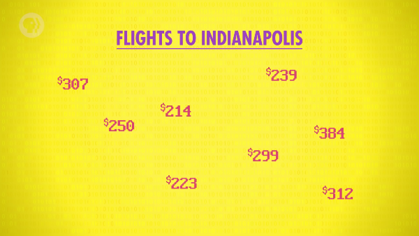

<details><summary>이렇게, 여러 항목이 나열된 정보 형태를 배열(array)이라고 한다.</summary>

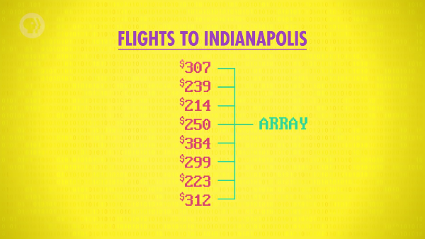

</details>

</details>

<br>

프로그래밍적으로 정렬하는 방법을 확인하기 위해, 숫자들을 살펴보자.  
`(간단한 알고리즘부터 살펴볼 것이다.)`

우선, 가장 작은 숫자를 찾기 위해 배열을 훑어보자.

<details><summary>1. 307이라는 값이 있는 맨 위에서부터 시작한다.</summary>

- 현재까지 확인된 유일한 숫자이므로, 가장 작은 숫자다.

```
현재 가장 작은 숫자 : 307

$307 <- 현재 위치
$239
$214
$250
$384
$299
$223
$312
```

</details>

<details><summary>2. 다음 숫자인 239는 307보다 작으므로 새로운 가장 작은 숫자가 된다.</summary>

```
현재 가장 작은 숫자 : 239

$307
$239 <- 현재 위치
$214
$250
$384
$299
$223
$312
```

</details>

<details><summary>3. 다음 숫자인 214가 다시 새로운 가장 작은 숫자가 된다.</summary>

```
현재 가장 작은 숫자 : 214

$307
$239
$214 <- 현재 위치
$250
$384
$299
$223
$312
```

</details>

<details><summary>4. 이후의 250, 384, 299, 223, 312 은 모두 가장 작은 숫자가 될 수 없다.</summary>

- 이렇게 모든 숫자를 확인하여 214가 가장 작은 숫자라는 것을 확인했다.

```
현재 가장 작은 숫자 : 214

$307
$239
$214
$250
$384
$299
$223
$312 <- 현재 위치
```

</details>

<details><summary>5. 오름차순으로 정렬하기 위해 214와 맨 위에 있는 숫자의 위치를 바꾼다.</summary>

```
현재 가장 작은 숫자 : 214

$307 => $214
$239
$214 => $307
$250
$384
$299
$223
$312
```

</details>

<br>

나머지 숫자들도 위와 같은 절차를 반복하여 정렬할 수 있는데,  
이미 정렬된 숫자들의 바로 다음 위치에서부터 시작하면 된다.

<br>

<details><summary>1. 가장 먼저 확인된 239는 가장 작은 숫자가 된다.</summary>

```
현재 가장 작은 숫자 : 239

$214
==========================
$239 <- 현재 위치
$307
$250
$384
$299
$223
$312
```

</details>

<details><summary>2. 배열의 남은 부분을 확인하여 가장 작은 숫자가 223임을 확인한다.</summary>

```
현재 가장 작은 숫자 : 223

$214
==========================
$239
$307
$250
$384
$299
$223 <- 가장 작은 숫자
$312
```

</details>

<details><summary>3. 가작 작은 숫자 233과 배열의 두 번째 위치에 있는 숫자의 위치를 바꾼다.</summary>

```
현재 가장 작은 숫자 : 223

$214
==========================
$239 => $223
$307
$250
$384
$299
$223 => $239
$312
```

</details>

<details><summary>4. 다시 세 번째 위치부터 위 과정을 반복해 239의 위치를 바꾼다.</summary>

```
현재 가장 작은 숫자 : 223

$214
$223
==========================
$307 => $239
$250
$384
$299
$239 => $307
$312
```

</details>

<details><summary>5. 마지막 숫자에 도달할 때까지 계속 반복한다.</summary>

- 이렇게 인디애나폴리스로 가는 비행기를 예약할 준비가 끝났다!

```
$214
$223
$239
$250
$299
$307
$312
$384
```

</details>

<br>

방금 살펴본 과정은 '배열을 정렬하는 하나의 방법 혹은 알고리즘' 이라고 할 수 있는데,  
이는 **'선택 정렬(Selection Sort)'** 이라고 불리는 매우 기초적인 알고리즘이다.

# 3. 복잡성과 빅오 표기법

<details><summary>선택 정렬 알고리즘의 의사 코드(Pseudo-Code) 를 살펴보자.</summary>

- 이렇게 한 번 작성해둔 함수는 다른 항목의 정렬에서도 사용할 수 있다.
- 배열의 맨 위에서 맨 아래까지, 각 위치마다 가장 작은 수를 찾을 때까지 반복된다.

```
function selectionSort(array)
    for i = 0 to end of array

        smallest = i
        for index = i + 1 to end of array
            if array item index < array item smallest
                smallest = index
            end if
        next

        swap array items at inext and smallest
    next
return array
```

</details>

<br>

이 때, for 루프 내부에 다른 for 루프가 포함되어 있는 것을 확인할 수 있는데,  
위 함수를 사용하여 N 개의 항목을 정렬하는 경우를 대략 정리하면 아래와 같다.

- 정렬이 필요한 N 개의 항목에 대해 반복한다.
- 그 안에서 다시 N 개의 항목에 대해 반복한다.
- 따라서, 총 N * N (혹은 $N^2$) 회 반복된다.

<br>

이와 같은 입력의 규모와 알고리즘 실행 단계 수 사이의 관계는  
알고리즘의 **'복잡성(complexity)'** 이라는 특징을 나타낸다.

- 복잡성은 얼마나 빠른지, 혹은 느린지에 대한 근사치를 제공한다.
- 컴퓨터 과학자들은 이런 복잡성을 **'빅오 표기법(Big-O notation)'** 으로 표현한다.

<br>

>
N 제곱의 복잡성은 그렇게 효율적인 편은 아니다.
>
위에서 살펴본 예제 배열에는 8개의 항목이 있어서(n = 8) 8의 제곱인 64회 반복되는데,  
이 때, 배열의 크기를 8에서 80으로 늘린 경우의 실행 시간은 80의 제곱인 6400이 된다.
>
>> 배열의 크기가 10배 증가했을 뿐인데, 실행 시간은 100배나 증가한 것이다. `(64 -> 6400)`
>
이런 현상은 배열이 커질수록 확대되기 때문에,
>
수백만, 수십억 개의 항목이 포함된 배열을 정렬해야 하는 구글과 같은 회사에선 큰 문제가 된다.

# 4. 합병 정렬

더 효율적인 정렬 알고리즘을 살펴보기 위해 정렬되지 않은 배열로 돌아가보자.

이번에는 **'합병 정렬(Merge Sort)'** 이라는 다른 알고리즘에 대해 살펴볼 것이다.

<details><summary>1. 우선, 배열의 크기가 1보다 큰 지 확인한다.</summary>

```
[307, 239, 214, 250, 384, 299, 223, 312]
```

</details>

<details><summary>2. 1보다 큰 경우, 배열을 반으로 나눈다.</summary>

- 현재 배열의 크기는 8이므로, 크기가 4인 배열 2개로 분할된다.

```
[307, 239, 214, 250], [384, 299, 223, 312]
```

</details>

<details><summary>3. 배열의 크기가 1이 될 때까지 반으로 나눈다.</summary>

- 최종적으로, 각각 1개의 항목이 담긴 배열 8개로 분할된다.
- 이렇게 모두 나뉜 상태부터 합병 정렬을 시작할 수 있다.

```
[307, 239], [214, 250]. [384, 299], [223, 312]
```
```
[307], [239], [214], [250], [384], [299], [223], [312]
```

</details>

<details><summary>4. 처음의 두 배열부터 값을 확인하여 새로운 배열에 넣는다.</summary>

- 이 경우에는 항목이 하나씩밖에 없고, 값은 각각 307과 239다.
- 새 배열에 작은 값인 239를 먼저 넣고, 그 후에 남은 숫자인 307을 넣는다.
- 이렇게, 첫 번째 배열을 성공적으로 병합했다.

```
([307], [239] => [239, 307]), [214], [250], [384], [299], [223], [312]
```

</details>

<details><summary>5. 다른 배열들에 대해서도 같은 작업을 반복한다.</summary>

```
[239, 307]
[214], [250] => [214, 250]
[384], [299] => [299, 384]
[223], [312] => [223, 312]
```

- 배열의 각 쌍이 모두 정렬된 상태가 된다.

```
[239, 307], [214, 250], [299, 384], [223, 312]
```

</details>

<details><summary>6. 다시 처음의 두 배열부터 값을 확인하여 새로운 배열에 넣는다.</summary>

<details><summary>새 배열에 214와 239 중, 더 작은 수인 214를 넣는다.</summary>

```
[239, 307], [214, 250] => [239, 307], [250] | [214]
[299, 384], [223, 312]
```

</details>

<details><summary>다음으로, 239와 250 중, 더 작은 수인 239를 넣는다.</summary>

```
[239, 307], [250], [214] => [307], [250] | [214, 239]
[299, 384], [223, 312]
```

</details>

<details><summary>다음으로, 307과 250 중, 더 작은 수인 250을 넣는다.</summary>

```
[307], [250], [214, 239] => [307] | [214, 239, 250]
[299, 384], [223, 312]
```

</details>
<details><summary>마지막으로 남은 307을 넣는다.</summary>

```
[307] | [214, 239, 250] => [214, 239, 250, 307]
[299, 384], [223, 312]
```

</details>
<details><summary>크기가 2인 나머지 배열에 대해서도 같은 과정을 반복한다.</summary>

```
[214, 239, 250, 307], ([299, 384], [223, 312] => [223, 299, 312, 384])
```

</details>

   - 이제, 크기가 4인 정렬된 배열 2개가 남았다.

</details>

<details><summary>7. 모든 숫자가 합병되어 배열이 완전히 정렬될 때까지 반복한다.</summary>

```
[214, 239, 250, 307], [223, 299, 312, 384] => [214, 223, 239, 250, 299, 307, 312, 384]
```

</details>

<br>

> 이렇게, 모든 경우에서 개별적으로 정렬된 2개의 배열을 합병해 더 큰 정렬된 배열로 만든다.

# 5. 복잡성 비교

이번엔 합병 정렬의 복잡성에 대해 살펴보자.

- 합병 정렬의 복잡성은 N * logN 이다. `O(NlogN)`
- 앞쪽의 N 은 비교와 합병이 수행되는 횟수이고, 배열 항목 수와 비례한다.
- 뒤쪽의 logN 은 합병이 몇 단계로 구성되었는지를 나타낸다.
   - 위 예시에서는 '8 -> 4 -> 2 -> 1' 의 순서로 총 3번 합병된다.
   - 이렇게 절반씩 나눠지기 때문에 합병 단계는 배열 항목 수와 log 관계를 갖게 된다.
   - 배열의 크기를 2배로 늘려 16이 되면, 분할 단계는 1만큼 증가한다.
```
log2(8)  = 3
log2(16) = 4
```
   - 배열의 크기를 1000배 늘려 8000이 되도, 대략 13의 값이 되어, 약 4배 정도 차이가 난다.
```
log2(8)    = 3
log2(8000) ≈ 13
```
- 이런 이유로, 합병 정렬이 선택 정렬보다 훨씬 더 효율적이다.

# 6. 그래프 탐색

수십 개의 정렬 알고리즘이 있지만 하나씩 알아보기에는 너무 많기 때문에,  
다른 고전 알고리즘 분야의 문제인 **'그래프 탐색(graph search)'** 을 살펴볼 것이다.  
`(참고로, 선생님이 가장 좋아하는 분야라고 한다.)`

- 그래프는 선으로 연결된 노드(교차점) 들의 네트워크(망) 다.
- 도시와 그들을 연결하는 도로가 그려진 지도라고 생각해도 된다.
- 도시 간의 경로마다 서로 다른 시간이 걸린다.
- 선마다 비용(cost) 혹은 무게(weight) 라고 하는 내용을 표시할 수 있다.
   - 그래프를 지도로 비유했을 때, 비용은 '이동에 걸리는 기간' 이다.

<br>

<details><summary>클릭하여, 예시로 살펴볼 그래프를 확인해보자.</summary>

~~`(왕좌의 게임을 예시로.. 가슴이 웅장해진다..)`~~


</details>

# 7. 무차별적 접근

> 위에서 살펴본 예시 그래프를 기준으로 한다.

하이가든에 있는 군대가 윈터펠의 성에 이동해야 하는 상황에서,  
가장 적은 시간이 걸리는 경로를 찾아야 한다고 가정해보자.

가장 간단한 방법은 도로마다 이동 경로를 확인해, 각 경로에 대한 총비용을 계산하는 것인데,  
이런 접근 방식(알고리즘) 을 **'무차별적 접근(Brute-Force Aproach)'** 이라고 한다.

<details><summary>클릭하여, 무차별적 접근 방식이 적용된 예시 그래프를 살펴보자.</summary>

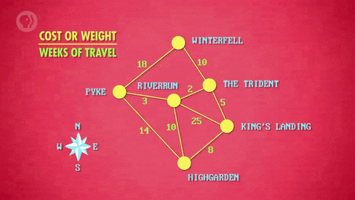

</details>

<br>

- 모든 항목을 체계적으로 확인하기 때문에 배열의 정렬 여부를 확인할 때도 사용할 수 있다.
- 무차별적 접근 알고리즘을 사용하여 정렬을 수행하는 경우 O(N!) 의 복잡성을 가진다.
- N! 은 (N * (N - 1) * (N - 2) * .. * 1) 이기 때문에, N^2 보다 훨씬 비효율적이다.

# 8. 다익스트라 알고리즘

무차별적 접근 방식보다 더 효율적인 방법을 알아보자.

이번엔, 이와 같은 그래프 문제에 적용할 수 있는 알고리즘 중에서도,  
**'다익스트라 알고리즘(Dijkstra Algorithm)'** 이라는 고전적인 해법을 이용해볼 것이다.

> #### 다익스트라 알고리즘은
컴퓨터 과학 실습/이론 분야에서 가장 위대한 인물 중 한 명인  
'Edsger Dijkstra' 가 발명했으며, 그의 이름을 따서 만들어졌다.

<br>

<details><summary>1. 출발 지점인 하이가든에서 0의 비용(cost) 으로 시작한다.</summary>

- 하이가든의 노드 안에 0을 표시한다.
- 지금 시점에서는 다른 도시까지 이동하는 비용을 알 수 없다.
- 따라서, 나머지 도시들의 노드 안에 ? 로 표시해둔다.

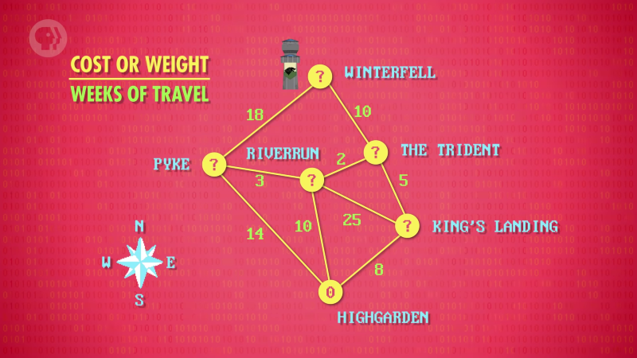

</details>

<details><summary>2. 다익스트라 알고리즘은 항상 가장 낮은 비용의 노드부터 시작한다.</summary>

- 이 경우, 하이가든이라는 노드 하나만 알고 있으므로, 하이가든에서 시작한다.

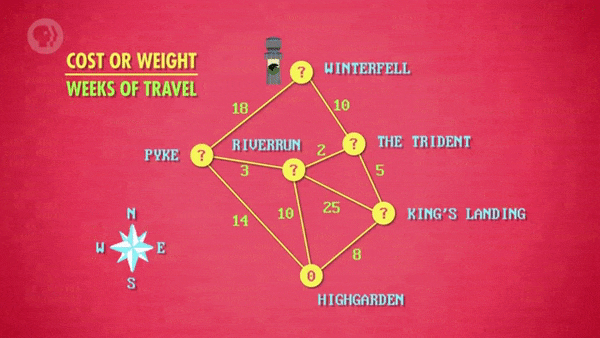

</details>

<details><summary>3. 한 단계 떨어져 있는 노드로 연결된 모든 경로로 이동하며, 비용을 기록한다.</summary>

- 이렇게 알고리즘의 한 단계를 수행했다.

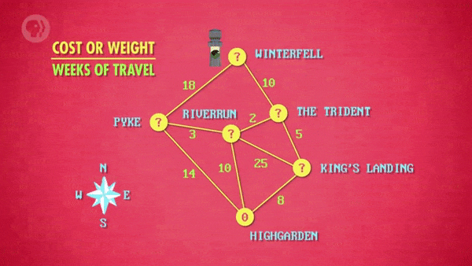

</details>

<details><summary>4. 아직 윈터펠에 도달하지 않았으므로, 다익스트라 알고리즘을 반복한다.</summary>

- 이미 확인된 하이가든 다음으로 가장 낮은 비용의 노드는 킹스랜딩이다.
- 이번에도, 방문하지 않은 모든 경로를 통해 연결된 노드로 이동한다.

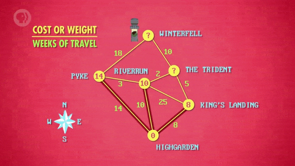

</details>

<details><summary>4-1. 킹스랜딩에서 트라이던트로 이동하는 경로의 비용은 5이다.</summary>

- 이 때, 하이가든에서 이동한 비용도 유지되기 때문에 총 비용은 8 + 5 = 13 이 된다.

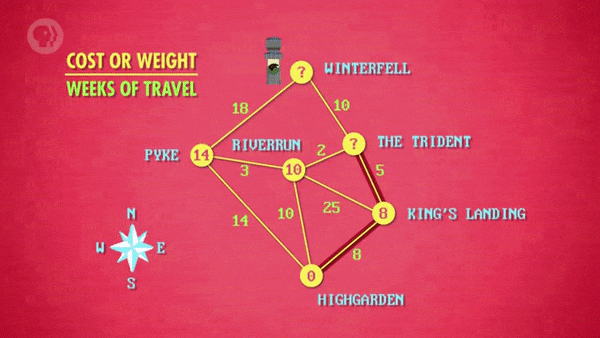

</details>

<details><summary>4-2. 킹스랜딩에서 리버런으로 이동하는 경로의 비용은 25이다.</summary>

- 리버런 노드의 기존 값인 10이 총 비용인 8 + 25 = 33 보다 더 작으므로, 값을 변경하지 않는다.


</details>

<details><summary>5. 킹스랜딩의 모든 경로를 살펴봤음에도 윈터펠에 도달하지 못했으니, 계속 진행한다.</summary>

- 다음으로 가장 낮은 비용의 노드는 리버런이다.

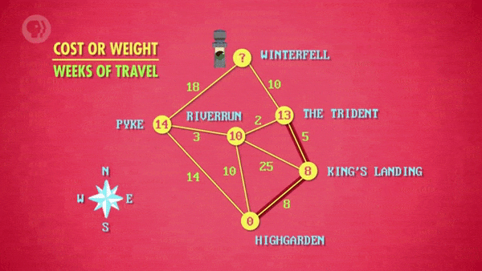

</details>

<details><summary>5-1. 리버런에서 트라이던트로 이동하는 경로의 비용은 2다.</summary>

- 트라이던트 노드의 기존 값인 13보다 10 + 2 = 12가 더 작으므로, 값을 변경한다.

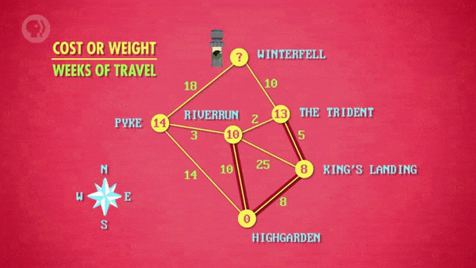

</details>

<details><summary>5-2. 리버런에서 파이크로 이동하는 경로의 비용은 3이다.</summary>

- 파이크의 기존 값인 14보다 총 비용인 10 + 3 = 13 이 더 작으므로, 값을 변경한다.


</details>

<details><summary>6. 리버런의 모든 경로를 살펴봤음에도 윈터펠에 도달하지 못했으니, 계속 진행한다.</summary>

- 다음으로 가장 낮은 비용의 노드는 트라이던트다.

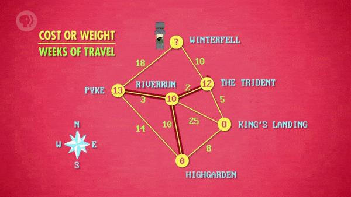

</details>

<details><summary>7. 트라이던트 노드에서 아직 방문하지 않은 경로는 윈터펠로 가는 경로뿐이다.</summary>

- 윈터펠로 이동하는 경로의 비용은 10이므로, 총 비용은 12 + 10 = 22 다.

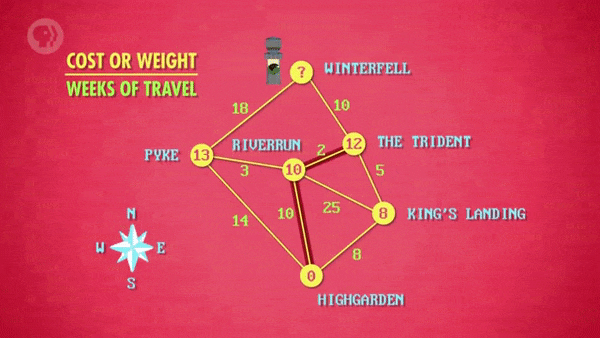

</details>

<br>

> 파이크를 거쳐 윈터펠로 이동하는 경로의 총 비용은 13 + 18 = 31 이다.

이렇게 하이가든에서 윈터펠로 이동하는 가장 낮은 비용의 경로를 찾아냈다.  
~~`(킹스랜딩까지 피해서 가다니, 1석 2조 효과!)`~~

# 9. 다익스트라의 복잡성

이제, 다익스트라 알고리즘의 복잡성에 대해 살펴보자.

- 1956년에 구상된 기본 다익스트라 알고리즘은 O(N^2) 만큼의 복잡성을 가졌다.
   - 이 때, N 은 그래프 내부에 있는 노드의 수다.
   - 위에서 봤듯 제곱의 복잡성을 지닌 알고리즘은 그렇게 좋은 알고리즘이라 할 수 없다.
   - 미국의 전체 로드맵처럼 확장된 규모의 문제를 해결하기에 부적합하다.
- 다행히도, 몇 년 후에 다익스트라 알고리즘의 복잡성은 O(NlogN + I) 로 개선되었다.  
  `(단순하게 전체 원소를 순회하는 대신 우선순위 큐를 활용하는 경우)`
   - 이 때, I 는 각 노드를 연결하는 선의 갯수다.
   - NlogN + I 는 더 복잡해보일 수도 있지만, 실제로는 훨씬 더 빠르다.

<br>

<details><summary>클릭하여, 위의 예시 그래프를 기준으로 비교한 내용을 살펴보자.</summary>

```
N (도시의 수) = 6
I (도로의 수) = 9

N^2       = 6 * 6          = 36
NlogN + I = (6 * log6) + 9 = 13.7
```

</details>

# 10. 알고리즘에 관하여,

정렬과 마찬가지로, 그래프 탐색에도 다양한 장단점을 지닌 수많은 알고리즘이 존재한다.

또, 우리가 구글 지도와 같은 서비스를 이용해 '길 찾기' 기능을 이용할 때마다,  
서버에서는 최적의 경로를 찾기 위해 다익스트라와 같은 알고리즘을 수행하는데,

이렇게 거의 모든 곳에서 사용되기 때문에, 오늘날에는 없어선 안 될 존재가 되었다.

>
이런 이유로 컴퓨터 과학자로서 가장 중요하게 신경 써야 할 부분은  
기존 알고리즘을 활용하고, 새로운 알고리즘을 작성하는 것이라고 할 수 있다.

이번 수업에서는 알고리즘 분야의 아주 작은 부분을 다뤘지만,  
이런 작은 경험을 통해 더 많은 궁금증이 생겨났길 바란다.


# 배운 점, 느낀 점

정렬과 그래프 탐색 분야에 어떤 알고리즘이 있고, 기본 원리는 무엇인지 배웠다.

단순한 내용을 다뤄서 아쉬웠지만, 몰랐던 알고리즘들을 새로 알게 돼서 좋았다.  
`(지식의 깊이에 대해서는 항상 아쉬움이 남는 것 같다.)`

여러 알고리즘을 그림으로 살펴봐서 훨씬 쉽게 이해할 수 있었다.

## 1.

- 계산을 완료하기까지 수행되는 특정한 단계들인 알고리즘
- 컴퓨터 과학에서 가장 자주 사용되고, 잘 알려진 문제인 정렬
- 배열의 모든 위치에서 모든 항목의 크기를 비교하는 방식의 선택 정렬

<br>

알고리즘의 개념을 '계산이 완료되기까지 수행되는 특정한 단계들' 이라고 생각할 수 있게 되었다.

여러 곳에서 자주 사용되는 만큼 다양한 정렬 알고리즘이 발명되었다는 것을 알게됐다.

선택 정렬의 수행 과정을 보면서, 알고리즘을 공부할 땐 직관적인 방법부터 배워야겠다는 생각이 들었다.

## 2.

- 입력의 규모와 알고리즘 실행 단계 수 사이의 관계인 복잡성
- 기호를 통해 알고리즘의 복잡성을 표현하는 방식인 빅오 표기법
- 정렬 대상을 분할하여 항목별 비교 횟수를 줄이는 방식인 합병 정렬
- 계산 수행 방식에 따라 달라지는 알고리즘의 효율성

<br>

알고리즘이 얼마나 복잡한 과정으로 수행되는지를 복잡성으로 표현한다는 것을 배웠다.

입력 규모를 기호로 사용해, 수행되는 계산의 수를 나타내는 빅 O 표기법을 배웠다.

배열을 반으로 나눈 후에, 정렬하면서 합병하는 방법이 합병 정렬이라는 것을 배웠다.

알고리즘의 효율성 차이는 입력의 규모가 커질수록 심해진다는 것과  
효율적으로 문제를 해결하기 위해선 수행되는 계산의 수를 줄여야 한다는 것을 배웠다.

알고리즘의 효율성을 수학적으로 분석하는 능력도 중요하다는 것을 배웠다.

## 3.

- 비용이라는 수치를 갖는 선으로 연결된 노드들의 망인 그래프
- 그래프 내의 최단 경로를 찾는 등, 고전적인 알고리즘 문제인 그래프 탐색
- 선마다 경로를 확인하여 총비용을 계산하는 방식의 무차별적 접근
- 가장 낮은 총비용을 갖는 경로를 우선적으로 탐색하는 다익스트라 알고리즘
- 우선순위 큐를 활용하여 개선할 수 있는 다익스트라 알고리즘의 복잡성

<br>

여러 항목의 연결 상태를 나타내는 요소를 그래프라고 부른다는 것과  
그래프의 각 꼭지점이 노드이고, 각 선마다 비용이 있다는 것을 배웠다.

특정 항목에서 다른 항목까지의 최단 경로를 찾는 문제인 그래프 탐색에 대해 배웠다.

무차별적 접근 알고리즘이 모든 경로를 확인해, 각각의 총 비용을 계산하는 방식이라는 것과  
N^2 보다 훨씬 더 비효율적인 N! 의 복잡성을 지닌다는 사실에 대해 알게 됐다.

다익스트라 알고리즘이 노드까지 도달하는데 필요한 최저 비용을 갱신하는 방법이라는 것을 배웠다.

전체적인 동작 원리는 같아도, 일부 개선을 통해 효율성을 높일수 있다는 것을 배웠다.

(해당 글의 작성 과정은 
<a href='https://github.com/ensia96/ensia96.github.io/pull/103' target='-blank'>post/crash-course/13 (#103)</a>
에서 확인하실 수 있습니다.)

<br>

- 20210418 - 표기 수정(2번째 -> 두 번째, 3번째 -> 세 번째, 큰 O -> 빅오)
- 20210418 - 맞춤법 수정(구성되었는 지를 -> 구성되었는지를)
