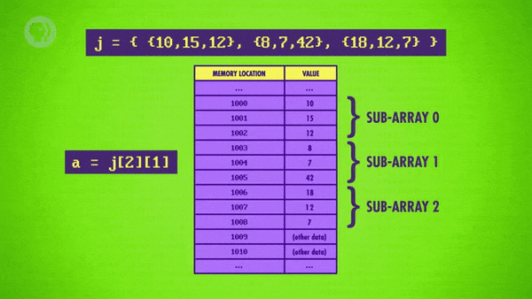

>
해당 포스트는 
Youtube 채널
<a href='https://www.youtube.com/channel/UCX6b17PVsYBQ0ip5gyeme-Q' target='-blank'>'Crash Course'</a>
에서 제공하는 
<a href='https://www.youtube.com/playlist?list=PL8dPuuaLjXtNlUrzyH5r6jN9ulIgZBpdo' target='-blank'>'Computer Science'</a>
수업을 바탕으로 작성되었습니다.  
( 사진 속 인물은
<a href='https://about.me/carrieannephilbin' target='-blank'>'Carrie Anne Philbin'</a>
선생님 입니다! )

# 0. 시작하기에 앞서,

지난 수업에서는 몇 가지 고전 알고리즘들에 대해 살펴봤다.

> 숫자 목록의 정렬, 그래프 상의 최단 경로 찾기 등

하지만, 알고리즘이 실행되는 정보가 컴퓨터 기억 장치에 저장되는 방법은 다루지 않았다.

<br>

아마 대부분의 사람들은 수많은 정보들이 여기저기 널브러져있는 것보다,  
쉽게 검색하고, 확인할 수 있도록 잘 정리되어 체계화된 상태를 원할텐데,

이를 위해 컴퓨터 과학자들은 **'자료 구조(Data Structure)'** 라는 것을 이용한다.

# 1. 배열

지난 수업에서는 기본적인 자료 구조 중의 하나인 **'배열(Array)'** 을 살펴봤다.

> 일부 언어에선 리스트(List), 혹은 벡터(Vector) 라 부르기도 한다.

## 1-1. 인덱스

배열은 기억 장치에 연속적으로 저장되어 있는 값들을 가리키기 때문에,  
단일 값 대신에 일련의 숫자 전체를 정의하여 배열 변수에 저장할 수 있다.

```
j = 5                        | 단일 값을 할당하는 경우
j = {5, 3, 7, 21, 82, 4, 19} | 일련의 숫자를 할당하는 경우
```

이와 같은 배열에서 특정 값을 찾으려면, **'인덱스(index)'** 를 지정해야 하는데,  
거의 모든 언어에서 0부터 시작하며, 배열에 접근할 땐 대괄호 구문과 함께 사용된다.

예를 들어, 배열 j의 1, 3번째 자리의 값의 합을 변수 a에 저장하는 코드는 아래와 같다.

```
a = j[0] + j[2]
```

## 1-2. 예시

또, 배열이 기억 장치에 저장되는 방식은 매우 직관적인데,  
컴파일러가 기억 장치의 위치 1000에 배열을 저장했다고 가정해보자.

<details><summary>배열에는 7개의 숫자가 포함되어 있으며, 하나씩 순서대로 저장되어 있다.</summary>

| 기억 장치 주소 | 값 |
|-|-|
| ... | ... |
| 1000 | 5 |
| 1001 | 3 |
| 1002 | 7 |
| 1003 | 21 |
| 1004 | 84 |
| 1005 | 4 |
| 1006 | 19 |
| 1007 | ... |
| 1008 | ... |
| 1009 | ... |
| ... | ... |

</details>

<details><summary>j[0] 을 입력하면 5의 값을 얻을 수 있다.</summary>

- 컴퓨터가 기억 장치의 위치 1000으로 이동한다.
- 오프셋이 0인 위치의 값을 확인한다.

```
이 때, 오프셋(offset) 은 특정 요소의 처음부터 특정 지점의 위치 차이를 표현하는데,  
낮은 수준의 언어에서는 상대적인 주소(relative address) 라고 부르기도 한다.

아래 표에선 화살표 옆의 괄호 안에 있는 숫자가 오프셋이다.
```

| 기억 장치 주소 | 값 |
|-|-|
| ... | ... |
| 1000 (0) → | 5 |
| ... | ... |

</details>

<details><summary>j[5] 를 입력하면 4의 값을 얻을 수 있다.</summary>

- 컴퓨터가 기억 장치의 위치 1000으로 이동한다.
- 오프셋이 5인 위치의 값을 확인한다.

| 기억 장치 주소 | 값 |
|-|-|
| ... | ... |
| 1000 (0) → | 5 |
| 1001 (1) → | 3 |
| 1002 (2) → | 7 |
| 1003 (3) → | 21 |
| 1004 (4) → | 84 |
| 1005 (5) → | 4 |
| ... | ... |

</details>

<br>

이 때, 5번째 숫자와 5의 인덱스에 위치한 숫자를 헷갈릴 수도 있는데,  
0의 인덱스가 배열의 첫번째 숫자를 가리킨다는 것을 기억해야 한다.

> #### 추가로,
정렬 함수처럼 배열을 다룰 수 있는 유용한 함수도 있다.
> - 배열을 입력하면 정렬된 배열을 출력하는 함수다.
> - 정렬 함수는 거의 모든 프로그래밍 언어에 내장되어 있다.
> - 덕분에, 알고리즘을 처음부터 작성하지 않아도 된다.

# 2. 문자열

배열과 매우 밀접하게 연관된 자료 구조로는 **'문자열(String)'** 이 있는데,  
이는 단순하게 문자나 숫자, 기호와 같은 문자들이 저장된 배열이라고 보면 된다.

> 컴퓨터가 문자를 저장하는 방법은 
<a href='/Crash-Course/4.-이진수로-숫자와-문자-나타내기/#7-문자의-표현' target='-blank'>
'4. 이진수로 숫자와 문자 나타내기'</a> 참고

<br>

대부분의 상황에서 문자열을 기억 장치에 저장하기 위해 따옴표를 사용하는데,  
`j = "STAN ROCKS"` 처럼 배열과는 다르게 생겼지만, 문자열도 배열이 맞다.

<details><summary>클릭하여, 기억 장치에 저장되어 있는 문자열을 살펴보자.</summary>

| 기억 장치 주소 | 값 |
|-|-|
| ... | ... |
| 1000 | S |
| 1001 | T |
| 1002 | A |
| 1003 | N |
| 1004 | (space) |
| 1005 | R |
| 1006 | O |
| 1007 | C |
| 1008 | K |
| 1009 | S |
| 1010 | (zero) |
| ... | ... |

</details>

<br>

이 때, 예시 문자열은 문자 '0' 이 아닌 2진수의 값 0을 나타내는 (zero) 로 끝나는데,  
이것은 **'널(NULL)'** 문자라고 불리며, 기억 장치에 저장된 문자열의 끝을 나타낸다.

널 문자는 문자열이 끝나는 위치를 알려주는 중요한 역할을 한다.

> #### 예를 들어,
화면에 문자열을 출력하는 'print quote' 라는 임의의 함수가 호출되었을 때,  
널 문자가 없으면, 시작 지점부터 기억 장치의 맨 끝까지 멈추지 않고 실행된다.
>
이처럼, 문자열이 끝나는 위치를 알아야 하는 경우가 존재한다.

<br>

- 또, 문자 정보는 매우 자주 사용되기 때문에, 문자열만을 다루는 함수도 있다.
- 두 문자열을 받아 두번째 문자열을 첫번째 문자열 뒤에 붙여넣는 'strcat' 함수를 예로 들 수 있다.  
  `(strcat 은 '문자열 연결 함수(string concatenation function)' 의 준말이다.)`
```
first = 'ada '
last  = 'lovelace'
name  = strcat(first, last)
print(name)
===========================
output => ada lovelace
```

# 3. 행렬

1차원 목록인 배열을 활용하면 **'행렬(matrix)'** 과 같은 2차원의 정보를 구성할 수도 있다.

> 스프레드 시트의 격자나 컴퓨터 화면의 픽셀 등을 예로 들 수 있다.

<br>

<details><summary>이 때, 행렬은 여러 배열로 구성된 배열이라고 생각할 수 있다.</summary>

- 실제로 3 * 3 행렬은 크기가 3인 배열 3개가 담긴 배열이다.
- 아래와 같은 방법으로 행렬을 초기화할 수 있다.

```
10 15 12
8  7  42
18 12 7
==========================================
{
    {10, 15, 12},
    {8, 7, 42},
    {18, 12, 7}
}
==========================================
=> {{10, 15, 12}, {8, 7, 42}, {18, 12, 7}}
```

</details>

<details><summary>실제 기억 장치에는 정보들이 순서대로 저장되어 있다.</summary>

- 아래의 표에서 볼 수 있듯, 순서대로 뭉쳐져 있다.
```
{10, 15, 12}, => 1000 ~ 1002
{8, 7, 42},   => 1003 ~ 1005
{18, 12, 7}   => 1006 ~ 1008
```

| 기억 장치 주소 | 값 |
|-|-|
| ... | ... |
| 1000 | 10 |
| 1001 | 15 |
| 1002 | 12 |
| 1003 | 8 |
| 1004 | 7 |
| 1005 | 42 |
| 1006 | 18 |
| 1007 | 12 |
| 1008 | 7 |
| 1009 | (other data) |
| 1010 | (other data) |
| ... | ... |

</details>

<details><summary>2개의 인덱스를 지정하여 행렬 내부의 특정 값에 접근할 수 있다.</summary>

```
j = {{10, 15, 12}, {8, 7, 42}, {18, 12, 7}}
```

- j\[2][1] 로 특정 값에 접근하여 12의 값을 얻기까지의 과정은 아래와 같다.


</details>

<br>

> #### 추가로,
행렬은 3 * 3 보다 더 큰 규모, 더 높은 차원에 대해서도 만들 수 있다.
>> j[2][0][18][13][3] 처럼 작성하면 5차원 행렬의 특정 값에 접근할 수 있다.

<br>

**<작성 중인 글입니다.>**

**<아래 내용은 정리 중입니다.>**

# 4. 구조체

지금까지 다뤘던 숫자, 문자와 같은 개별 정보들과는 다르게,  
서로 관련이 있는 변수들을 블록으로 묶은 자료 구조도 있다.

> 은행 계좌 번호와 잔액을 함께 저장하는 등 이런 자료 구조는 꽤 유용하다.

이와 같은 변수들의 집합들을 **'구조체(Struct)'** 라고 부르는데,  
이는 복합형 자료 구조이기 때문에, 여러 정보를 한 번에 저장할 수 있다.

```
struct account
    variable accountNumber
    variable balance
end struct

j.accountNumber = 127823221
j.balance = 189.14
```

<details><summary>이렇게 정의한 구조체를 배열에 담으면, 기억 장치에도 자동적으로 묶여서 저장된다.</summary>


</details>

<details><summary>특정 인덱스에 접근하면, 저장되어 있는 구조체의 내용을 모두 확인할 수 있다.</summary>

- 아래와 같이 필요한 계좌 번호와 잔고를 꺼내올 수 있다.


</details>

<br>

구조체의 배열은 여느 배열처럼 만들어질 때 크기가 고정되고 더 확장하지 못한다.

게다가 배열은 메모리에 순서대로 저장되기 때문에 중간에 새로운 값을 넣기 어렵다.

하지만 구조체 데이터 구조를 사용해서 보다 복잡한 데이터 구조를 만드는데 사용할 수 있다.

노드라는 이름의 구조체를 살펴보자.

이는 포인터임과 동시에 숫자와 같은 변수를 저장한다.

포인터란, 메모리의 주소를 가리키는 특별한 변수를 말한다.

# 5. 연결 리스트

이 구조체를 이용해서 노드를 여러 개 저장할 수 있는 유연한 구조체인 연결 리스트를 만들 수 있다.

이것은 각 노드가 목록의 다음 노드를 가리키도록 함으로써 실행된다.

노드 구조체가 메모리 주소 1000, 1002, 1008 이렇게 세 군데에 저장되어 있다고 가정해보자.

각각 다른 시간에 만들어졌기 때문에 멀리 떨어져있고,  
가운데 다른 데이터가 저장되어 있을 수도 있다.

보이듯이 첫 노드에는 값 7이 저장되어 있고, 주소 1008이 그 다음 포인터이다.

이것은 다음 노드가 연결 리스트 안에서 메모리 위치 1008에 있다는 것을 의미한다.

이 연결된 배열을 따라가보면, 다음 위치에서는 값 112를 구할 수 있고  
다음 노드는 1002 주소를 가리키고 있다는 것을 알 수 있다.

그걸 또 따라가면 값 14를 구할 수 있고 다시 메모리 주소 1000으로  
포인트 하고 있다는 것을 알 수 있다.

그렇게 이 연결 리스트는 원형이 되었다.

하지만 다음 포인터 값을 0(NULL) 으로 해줌으로써 연결 리스트를 끝낼 수도 있다.

NULL 값은 끝에 도달했다는 것을 나타낸다.

프로그래머가 연결 리스트를 사용할 때는, 다음 목록에 저장된 메모리 값을 거의 보지 못한다.

대신 그림처럼 추상화된 연결 리스트를 사용해서 훨씬 쉽게 개념화할 수 있다.

크기를 미리 지정해줘야 하는 배열과는 달리, 연결 리스트는 크기를 상황에 따라서 늘이거나 줄일 수 있다.

예를 들어, 메모리에 새 노드를 할당하고 연결 리스트에 삽입할 수 있다.

단지 다음 포인터를 변경하는 것만으로 말이다.

# 6. 큐와 스택

연결 리스트는 쉽게 순서를 바꾸거나, 간략화, 쪼개기, 뒤집기 등등이 가능하다.

꽤 멋있다!

저번 주에 설명했던 정렬 알고리즘에도 유용하게 쓰인다.

이 유연성 덕분에, 더욱 더 복잡한 자료 구조들이 연결 리스트 위에 구축되었다.

가장 유명하고 보편적인 것은 큐와 스택이다.

큐는 우체국에 사람들이 줄을 서있는 것처럼, 도착한 순서대로 들어간다.

가장 오래 기다리던 사람이 가장 먼저 서비스를 받는다.

아무리 좌절한들, 여러분이 우표만 산다고 해도 앞사람이 23개의 소포를 부치는 것을 기다려야 한다는 말이다.

예시와는 관련없이, 이런 현상을 FIFO(First In First Out) 이라고 한다.

그것이 첫번째 부분이다.

연결 리스트의 첫 번째 노드를 가리키는 Post office queue 라는 포인터가 있다고 가정해보자.

행크에게 서비스를 제공해주고 나면, 바로 뒤에 있던 사람의 포인터를 읽고  
Post office queue 포인터를 줄의 다음 사람으로 업데이트 할 수 있다.

행크는 성공적으로 줄에서 제거되었다. 일처리 다했으니까 이제 볼 일 없다.

만약에 누군가를 큐에 넣고 싶다면, 즉, 줄에 추가하려면 연결 리스트의 끝까지 가로질러 가서  
마지막 사람의 포인터를 다음 사람을 향해서 연결해주면 된다.

작은 변화를 주면 연결 리스트를 LIFO 형식인 스택처럼 사용할 수 있다.

LIFO = Last In First Out

스택의 구조를 팬케잌 더미로 예를 들어보자.

하나의 팬케잌을 새로 만들때 마다 더미 위에 하나씩 더 올린다.

그리고 한 개를 먹을 때마다 위에서 하나씩 가져가서 먹는다.

큐에 더하고 빼는 대신, 스택에서 데이터는 push 로 추가되고 pop 으로 제거된다.

이것들이 공식 용어다!

# 7. 트리

우리가 노드 구조체를 포인터 한 개 대신 두 개를 갖게 한다면,  
다양한 알고리즘에 쓰이는 트리 구조를 만들 수 있다.

다시 말하지만 프로그래머는 포인터의 값을 직접 볼 일이 거의 없기 때문에  
대신 트리를 이렇게 개념화 할 수 있다.

가장 위에 있는 노드를 루트라고 한다.

한 노드에서 뻗어져 나오는 노드들은 자식 노드라고 한다.

예상했듯이 자식 노드 위의 노드들은 부모 노드이다.

마지막으로, 자식 노드가 없는 노드 - 그러니까 맨 끝의 노드는 리프 노드라고 한다.

이 예시를 보면 한 노드는 두 개까지의 자식을 가질 수 있다.

그렇기 때문에 이 구조체는 이진 트리라고 한다.

하지만 상황에 맞게 자료 구조를 수정함으로써 트리의 자식 노드 수를 3이나 4 또는 임의의 수로 늘릴 수 있다.

심지어 연결 리스트를 써서 그들이 가리키는 모든 노드를 저장하는 트리 노드도 만들 수 있다.

# 8. 그래프

트리 구조에서 중요한 것은 - 현실과 자료 구조에서 -  
바로 뿌리에서 잎까지 하나의 길이 존재한다는 것이다.

뿌리가 나뭇잎이랑 연결되어 있고 또 뿌리랑 연결되면 이상할 것이다.

무한 루프와 같이 제멋대로 연결되는 자료들은, 대신 그래프 데이터 구조를 사용한다.

저번 시간에 설명했던 그래프를 기억하는가?

도시가 도로로 연결된 예시였다.

이건 트리처럼 많은 포인터를 가지고 있는 노드로 저장할 수 있지만  
루트나 리프, 부모와 자식에 대한 개념은 없다.

무엇이든지 아무거나 포인터로 가리킬 수 있다!


# 9. 다양한 자료 구조

이상 모든 기본적인 자료 구조에 대한 소용돌이 치듯 한 개요였다.

이 기본적인 뼈대 위에, 프로그래머들은 약간 다른 모든 종류의 변형을 만들었다.

힙이나 Red-Black 트리와 같은 자료 구조들 말이다.

다 이야기하기에는 시간이 부족하다..

각각 다른 자료 구조는 특정 계산에 유용한 속성을 가지고 있다.

알맞는 데이터 구조의 선택은 여러분의 일을 매우 쉽게 만들어 준다.

그러므로 실전으로 돌입하기 전에 이런 이론을 배워두는게 정말 중요하다.

# 10. 자료 구조에 관하여,

다행히 많은 프로그래밍 언어는 라이브러리에 이미 만들어진 자료 구조들로 가득 차 있다.

예를 들어 C++ 는 Standard Template Library 가 있고, Java 는 Java Class Library 가 있다.

이건 우리가 프로그램을 맨 처음부터 만드느라 시간을 낭비하지 않아도 된다는 뜻이고  
대신 자료 구조의 힘을 사용해서 더 흥미로운 일을 할 수 있다.

다시 한번, 새로운 추상화 계층으로 넘어간다.
