>
해당 포스트는 
Youtube 채널
<a href='https://www.youtube.com/channel/UCX6b17PVsYBQ0ip5gyeme-Q' target='-blank'>'Crash Course'</a>
에서 제공하는 
<a href='https://www.youtube.com/playlist?list=PL8dPuuaLjXtNlUrzyH5r6jN9ulIgZBpdo' target='-blank'>'Computer Science'</a>
수업을 바탕으로 작성되었습니다.  
( 사진 속 인물은
<a href='https://about.me/carrieannephilbin' target='-blank'>'Carrie Anne Philbin'</a>
선생님 입니다! )

# 0. 시작하기에 앞서,

지난 몇 편의 수업에선 컴퓨터 과학의 기초적인 부분에 대한 원리를 다뤘다.

> 함수, 알고리즘, 자료 구조 등

<br>

이번 수업에서는 현대 컴퓨팅의 바탕이 되는 이론적 개념들을 공식화한 인물에 대해 살펴볼 것이다.

바로 컴퓨터 과학의 아버지, **'앨런 튜링(Alan Mathison Turing)'** 이다.

> 참고로, 튜링은 베네딕트 컴버배치와 그렇게 많이 닮지 않았다.

# 1. 결정 문제

1912년 런던에서 태어난 튜링은, 어릴 때부터 수학과 과학에 놀라운 재능을 보였다.

케임브리지의 킹스 칼리지에서 석사 과정을 밟고 있던 1935년에는,  
현재 우리가 컴퓨터 과학이라고 부르는 분야에 대한 첫 기록을 남겼는데,

당시, 튜링은 독일의 수학자인 다비트 힐베르트(David Hilbert) 가 고안한 문제였던,  
**'Entscheidungsproblem'** 혹은 **'결정 문제(Decision Problem)'** 를 해결하고 있었다.

<br>

아래와 같은 내용의 문제를 결정 문제라고 한다.

>
형식 논리학적으로 작성된 문장(statement) 을 입력으로 받았을 때,  
'예' 와 '아니오' 중 항상 정확한 답변을 생성하는 알고리즘이 있는가?

<br>

만약 결정 문제에서 요구하는 그런 알고리즘이 실제로 존재한다면,  
'모든 숫자보다 큰 숫자가 있는가?' 와 같은 질문에 답할 수 있을 것이다.

물론, 이처럼 이미 정답(아니오) 을 알고 있는 문제들도 많이 있지만,  
아직 풀지 못한 문제들이 많아, 사람들은 그런 알고리즘이 존재하는지 궁금해했다.

<br>

처음으로 해결책을 제시한 사람은 미국의 수학자 알론조 처치(Alonzo Church) 였다.

처치는 '람다 대수(Lambda Calculus)' 라는 수학적 표현 체계를 개발해  
결정 문제에서 요구하는 보편적인 알고리즘이 존재할 수 없음을 증명했다.

> 람다 대수는 어떤 계산이라도 표현할 수 있었지만, 적용하고 이해하기가 어려웠다.

# 2. 튜링 기계

람다 대수의 등장과 비슷한 시기에 대서양 반대편에 있던 튜링은  
결정 문제에 대한 접근 방식으로써 가상의 컴퓨팅 장치를 제안했는데,

간단하면서도 강력한 수학적 계산 모델을 제공하는 이 장치는,  
오늘날 **'튜링 기계(Turing Machine)'** 라고 불리게 되었다.

>
튜링 기계와 람다 대수는 완전히 다른 수학이 적용되었음에도 동일한 계산 능력을 지녔는데,  
당시 빠르게 성장하던 컴퓨터 과학 분야에서는 비교적 단순한 튜링 기계가 훨씬 인기 있었다.

<br>

사실, 튜링 기계는 별다른 준비 없이 설명할 수 있을 정도로 단순하다.

<details><summary>튜링 기계는 이론상으로 존재하는 컴퓨팅 장치다.</summary>

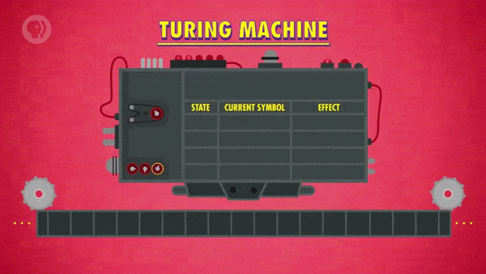

- 기호를 저장하는 무한한 길이의 테이프가 장착되어 있다.
- 테이프의 기호를 다루는 헤드(head)라는 장치가 있다.
   - 기호에 대해 읽기, 쓰기, 수정이 가능하다.
- 기계의 현재 상태에 대한 정보를 저장하는 상태 변수가 있다.
- 기계가 수행해야 하는 일을 명시하는 규칙의 집합이 있다.
   - 상태와 헤드가 읽고 있는 현재 기호가 주어질 때의 동작을 나타낸다.
   - 개별 동작뿐만 아니라, 여러 동작을 조합하여 규칙으로 지정할 수도 있다.

<details><summary>튜링 기계가 수행할 수 있는 개별 동작들</summary>

- 테이프에 기호 써넣기, 상태 변수 바꾸기, 헤드를 왼쪽/오른쪽으로 옮기기 등

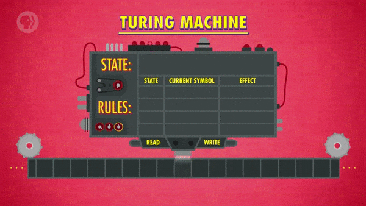

</details>

</details>

<details><summary>위의 내용을 구체화하기 위해 간단한 예시를 살펴볼 것이다.</summary>

- 0으로 끝나는 1의 문자열을 읽고, 1의 개수가 짝수인지 판별하는 튜링 기계다.
- 결과가 참이면 테이프에 1을 써넣고, 거짓이면 0을 써넣는다.

```
input    : '...11111111110'
question : is count of '1' in input a even?

result
- true  => write '1'
- false => write '0'
```

</details>

<details><summary>먼저, 튜링 기계의 규칙들을 정의해야 한다.</summary>

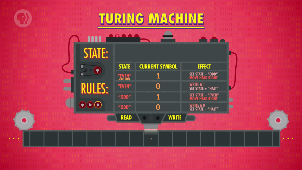

1. 상태가 짝수이고 테이프의 현재 기호가 1인 경우
   - 상태를 'odd' 로 변경하고 헤드를 오른쪽으로 이동한다.
2. 상태가 짝수이고 테이프의 현재 기호가 0인 경우
   - 이는 문자열의 끝에 도달했음을 의미한다.
   - 따라서, 테이프에 '1' 을 써넣고, 기계를 정지한다.
   - 이것은 튜링 기계의 계산이 끝났음을 나타낸다.
3. 상태가 홀수인 경우에도 규칙을 추가해준다.
   - 테이프의 기호가 0인 경우와 1인 경우를 모두 정의한다.
   - 1이면, 상태를 'even' 으로 변경하고 헤드를 오른쪽으로 이동한다.
   - 0이면, 테이프에 '0' 을 써넣고, 기계를 정지한다.
4. 마지막으로 시작 상태를 정해준다.
   - 이 경우에는 'even' 으로 설정할 것이다.

</details>

<details><summary>규칙과 시작 상태를 정의했으니, 예시 입력을 실행할 수 있다.</summary>

- '1 1 0' 이 저장된 테이프가 있다고 가정한다.  
   - 테이프에 기록된 1의 개수는 2개, 즉 짝수다.
- 사용되지 않는 부분은 모두 빈칸으로 처리한다.
   - 헤드를 오른쪽으로 옮기는 규칙만 존재한다.
   - 따라서, 테이프의 나머지 부분은 불필요하다.
   - 단순성을 위해 이와 같은 부분들은 비워둔다.
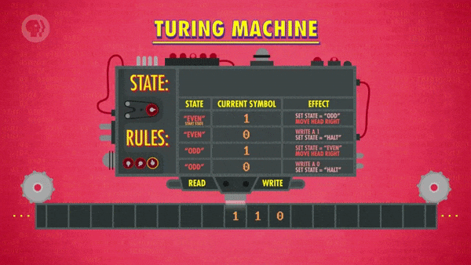

</details>

<br>

튜링 기계에 대한 준비를 모두 마쳤으니, 실행해보자.

<details><summary>1. 현재 상태는 'even' 이고, 첫 번째 숫자는 1이다.</summary>

- 가장 위에 있는 규칙을 수행한다.
> "상태를 'odd' 로 변경하고 헤드를 오른쪽으로 이동한다."

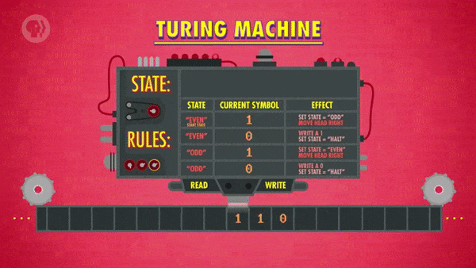

</details>

<details><summary>2. 테이프에 기록된 다음 숫자는 1이다.</summary>

- 현재 상태는 'odd' 이므로 3번째 규칙을 수행한다.
> "상태를 'even' 으로 변경하고 헤드를 오른쪽으로 이동한다."

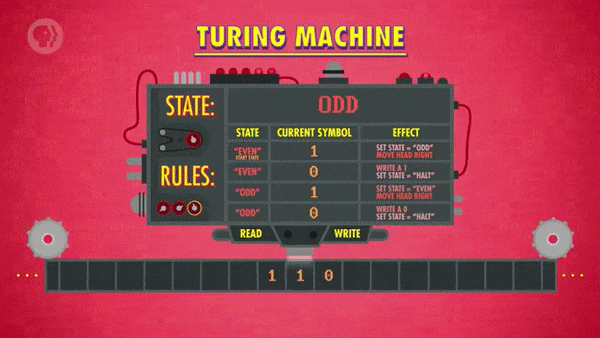

</details>

<details><summary>3. 테이프에 기록된 다음 숫자는 0이다.</summary>

- 현재 상태는 'even' 이므로 2번째 규칙을 수행한다.
> "테이프에 '1' 을 써넣고, 기계를 정지한다."
- 이 때, 테이프에 써넣는 1은 참을 나타낸다.

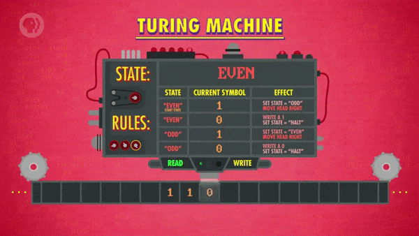

</details>

# 3. 튜링 완전

이렇게 단순한 동작 방식을 가진 가상의 기계가 중요하게 여겨지는 이유는,  
충분한 시간과 기억 수단이 주어지면 어떤 계산도 처리할 수 있기 때문이다.  

> 다시 말하면, 튜링 기계는 범용 컴퓨터를 표현한 가장 단순한 모델이다.

<br>

위에서 예시로 살펴본 프로그램은 아주 간단한 구성이었지만,  
충분한 규칙, 상태, 테이프를 이용하면 무엇이든 구성할 수 있다.

> 웹 브라우저, 온라인 게임(예: 월드 오브 워크래프트) 등

물론, 말도 안 되게 비효율적이겠지만 이론상으로는 가능하기 때문에,  
튜링 기계가 컴퓨팅 모델로서 아주 강력한 아이디어라고 하는 것이다.

<br>

이렇게 튜링 기계는 어떤 계산이든 처리할 수 있기 때문에,  
튜링 기계보다 계산 수행 능력이 뛰어난 기계는 없다고 할 수 있다.

만약, 튜링 기계와 동일한 계산 수행 능력을 지니는 기계가 있다면,  
이러한 기계를 **'튜링 완전(Turing Complete) 하다.'** 고 표현한다.

>
노트북, 스마트폰, 전자레인지와 온도 조절기에 탑재된 소형 컴퓨터 등,  
'오늘날 사용되는 컴퓨팅 체계들은 모두 튜링 완전하다' 라고 할 수 있다.

# 4. 정지 문제

튜링은 결정 문제를 해결하기 위해, 튜링 기계를 다른 계산 문제에 적용했다.

그 문제는 **'정지 문제(Halting Problem)'** 라고 불리며, 내용은 아래와 같다.

```
임의의 프로그램에 대한 설명과 임의의 입력이 주어졌을 때,
아래의 두 결과 중 항상 옳은 것을 결정하는 알고리즘이 존재하는가?

1. 프로그램이 답을 구하지 못해 영원히 실행된다.
2. 프로그램이 답을 구한 후에 정상적으로 정지된다.

(한마디로, '입력에 대한 프로그램의 계산 가능 여부를 판별하는 알고리즘이 존재하는가?' 이다.)
```

>
위에서 살펴봤던 '1 1 0' 처럼 간단한 입력이라면 쉽게 확인할 수 있겠지만,
>
계산이 완료되기까지 몇 년이 걸릴지도 모르는 더 복잡한 문제가 주어진다면,  
튜링 기계를 직접 실행하지 않고도 계산 가능 여부를 확인할 수 있을까?

# 5. 처치-튜링 논제

튜링은 정지 문제가 해결 불가능하다는 증거로서 논리적 모순을 제시했는데,  
이와 같은 결론에 도달하기까지 튜링이 추론했던 내용을 예시와 함께 살펴보자.

<br>

아래와 같은 특징을 지니는 가상의 튜링 기계가 있다고 가정한다.

<details><summary>프로그램에 대한 설명과 몇 가지 입력이 기록된 테이프를 입력받는다.</summary>

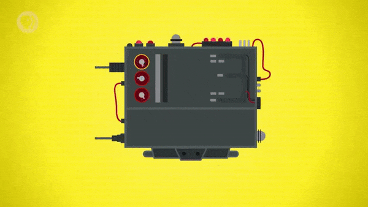

</details>

<details><summary>해당 입력에 대해 '계산 가능', '계산 불가능' 중 하나만을 출력한다.</summary>

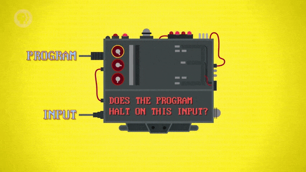

</details>

<details><summary>'Halt'(H) 라는 이름을 가지고 있고, 정지 문제를 해결할 수 있다.</summary>

- 이론상 존재하는 기계이므로, 자세한 동작 방식은 생략한다.

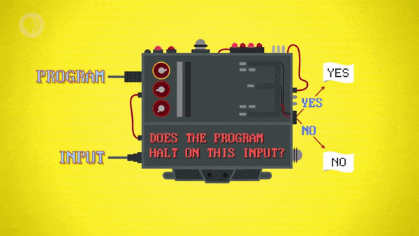

</details>

<br>

튜링은 아래와 같은 내용의 가정을 세웠다.

>
H를 이용해 계산 가능 여부를 결정할 수 없는 경우가 존재한다는 것은,  
'정지 문제를 해결할 수 있는 방법은 존재하지 않는다' 는 것을 의미한다.

<br>

튜링은 이를 증명하기 위해, H를 기반으로 하는 또 다른 튜링 기계를 설계했다.

<details><summary>H에서 '계산 가능' 이 출력되면, 영원히 실행된다.</summary>

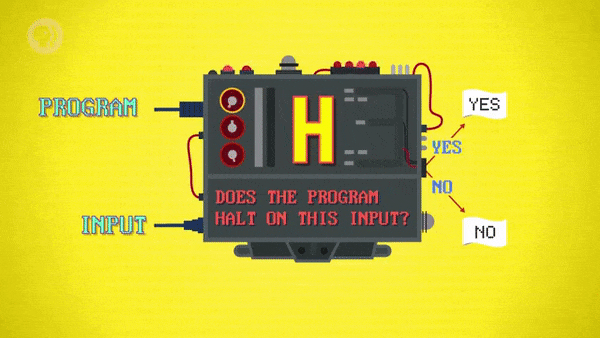

</details>

<details><summary>H에서 '계산 불가능' 이 출력되면, '계산 불가능' 을 출력한다.</summary>

- 본질적으로, H의 결과를 반대로 출력하는 기계가 된다.
- 계산 가능한 경우 영원히 실행되고, 계산 불가능한 경우에 결과를 출력한다.
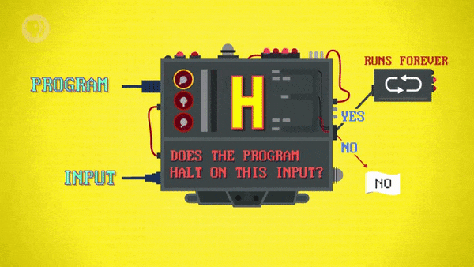

</details>

<details><summary>하나의 입력을 둘로 복사하는 'Splitter'(S) 라는 기계를 추가한다.</summary>

- S에서 복사된 정보는 모두 H의 입력으로 전달된다.

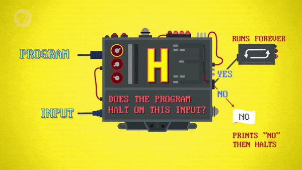

</details>

<details><summary>이 기계는 'Bizarro'(B) 라는 이름을 가지고 있다.</summary>

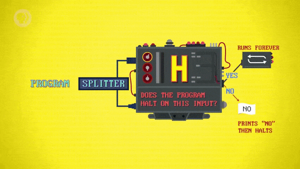

</details>

<br>

B에 'B에 대한 설명' 을 입력하는 경우를 살펴보자.

<details><summary>이는 H를 이용해 "B가 'B에 대한 정지 문제' 를 해결할 수 있는가?" 를 확인하는 것과 같다.</summary>


</details>

<details><summary>1. H의 결과가 '계산 가능' 이면, B는 영원히 실행된다.</summary>


</details>

<details><summary>2. H의 결과가 '계산 불가능' 이면, B는 '계산 불가능' 을 출력한다.</summary>

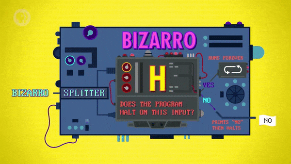

</details>

<br>

> <a href='https://www.youtube.com/watch?v=92WHN-pAFCs&t=431s' target='-blank'>'컴퓨터가 모든 것을 해결할 수 없다는 증명 (정지 문제)'</a>
영상에 더 잘 설명되어 있다.
> - 영상의 'stuck' 은 계산 불가능을 의미하며, 'halt' 와 반대 개념이라고 생각하면 된다.

<br>

- 결국, 정답을 맞추지 못했으므로, H는 정지 문제를 정확하게 해결할 수 없다고 할 수 있다.
- 이 결과는 '튜링 기계로는 정지 문제를 해결할 수 없다' 는 것을 의미하는 역설이 된다.
- 하지만, '튜링 기계는 어떤 계산도 처리할 수 있다.' 라는 것은 이미 증명된 상태다.
- 따라서, 이 결과는 '모든 문제가 계산으로 해결할 수 있는 것은 아니다.' 라는 것을 증명한다.
- 간단하게 말하자면, 처치와 튜링은 '컴퓨터의 능력에 한계가 있음' 을 입증한 것이다.
> 시간과 기억 수단이 아무리 많더라도 해결할 수 없는 문제가 존재한다.

<br>

지금까지 살펴본 모든 내용을 **'처치-튜링 논제(Church-Turing thesis)'** 라고 한다.

- 계산의 한계를 밝혀내고 계산 능력에 대한 개념을 형식화하는 내용이다.
- 처치와 튜링의 노력이 공존하는 논제이며, 아직 완전히 증명되지 않았다.

<br>

이 때는 1936년, 튜링이 24세의 나이에 그의 경력을 시작한 시점이었다.

# 6. 에니그마

이후 1938년까지, 튜링은 프린스턴 대학에서 처치의 지도를 받았으며,  
박사 학위를 취득하고 졸업한 후에는 다시 케임브리지로 돌아갔다.

얼마 지나지 않아, 1939년에는 영국이 제2차 세계대전에 참전했으며,  
튜링의 천재성은 전쟁에 매우 빠르게 적용된 덕분에 많은 기여를 했는데,

사실, 튜링은 전쟁이 시작되기 1년 전부터 이미 GC&CS 에서 시간제로 일하고 있었다.

> Government Code and Cypher School (정부 암호 연구소, GC&CS)

- 블레츨리 공원에 기반을 둔 영국의 암호 해독 단체이다.
- 주요 활동 중 하나는 독일 통신을 해독하는 방법을 알아내는 것이다.
- **'에니그마 기계(Enigma Machine)'** 를 사용한 통신을 주로 다뤘다.

<br>

에니그마 기계를 간단히 설명하자면, 문자들을 뒤섞는 기계라고 할 수 있다.

- 예를 들어, H, E, L, L, O를 입력하면, X, W, D, B, J라는 글자가 나온다.
- 이렇게 변형된 문자가 나오기까지의 과정을 **'암호화(Encryption)'** 라고 한다.
- 문자를 섞는 절차는 무작위가 아니라, 에니그마 기계에 의해 조작된다.
- 기계 위쪽에는 26개의 위치를 지정할 수 있는 회전자(rotor) 가 있다.
   - 여러 개의 회전자가 있으며, 문자를 섞는 방식을 정의하는 역할을 한다.
- 기계 앞쪽에는 문자 2개를 선으로 연결할 수 있는 플러그판이 있다.
   - 한 쌍의 문자가 지정되면, 해당 문자끼리 교환되는 방식이다.
- 이런 요소들을 이용하면, 총 수십억 개의 설정이 가능하다.
>
반대로, 에니그마의 회전자, 플러그판의 설정을 정확히 알고 있는 상태에서  
에니그마 기계에 X, W, D, B, J를 입력하면, H, E, L, L, O라는 글자가 나온다.
>
다시 말해, 메시지의 암호를 해독(decrypt) 한 것이다.

<br>

물론, 독일군은 그들의 에니그마 설정을 철저히 감췄기 때문에,  
연합군은 회전자와 플러그판의 모든 조합을 일일이 직접 확인해야 했다.

# 7. 봄브

다행히, 에니그마 기계와 그것을 작동하는 사람들은 완벽하지 않았는데,  
'일반 문자와 암호 문자가 항상 다르다.' 라는 치명적인 결함이 있었던 것이다.

> H라는 글자를 H로 암호화할 수 없는 것을 예로 들 수 있다.

<br>

튜링은 이런 결함을 이용하는 새로운 컴퓨터를 설계했다.

- 폴란드 암호 해독가들의 초기 작업을 기반으로 하여 만들어졌다.
- '봄브(Bombe)' 라고 불리는 특수 목적의 전자 기계 컴퓨터다.
- 암호화된 메시지에 대해, 수많은 에니그마 설정 조합을 시도하는 장치다.
   - 일반 문자와 암호 문자가 같다면, 그 조합을 폐기하고 다음 조합을 시도한다.
- 이렇게 봄브는 가능한 에니그마 설정의 수를 줄이는 데 사용되었다.
- 덕분에, 암호 해독가들은 가장 가능성 있는 해답을 찾는 데 집중할 수 있게 되었다.
   - 이들은 해독된 메시지 조각에 독일어 단어가 포함되어 있는지를 확인했다.

<br>

독일군은 누군가 통신 내용을 해독하고 있다고 의심했고, 주기적으로 에니그마 기계를 개선했다.

- 더 많은 조합을 만들기 위해 회전자의 개수를 늘리기도 했다.
- 심지어, 완전히 새로운 암호화 기계를 만들기까지 했다.

<br>

하지만, 튜링과 그의 동료들은 암호 체계를 무너뜨리기 위해 전쟁 내내 끊임없이 노력했고,  
해독된 독일 통신에서 얻은 정보 덕분에 연합국은 많은 전장에서 우위를 점할 수 있었다.

> 일부 역사가들은 이런 노력이 전쟁을 몇 년 정도 단축했다고 주장했다.

# 8. 튜링 테스트

전쟁 이후, 튜링은 학계에 복귀해 초기 전자 컴퓨팅 분야에 많은 기여를 했다.
 
- 최초의 프로그램 내장식 컴퓨터인 'Manchester Mark I' 에도 기여했다.
   - <a href='/Crash-Course/10.-초기의-프로그래밍/#5-폰-노이만-구조' target='-blank'>
     '10. 초기의 프로그래밍'</a>
     에서 잠깐 등장했다. (맨체스터 마크 1, 베이비)
- 그중에서도 가장 유명한 것은 **'인공지능(Artificial Intelligence)'** 이었다.
   - 심지어, 1956년 이전에는 이름조차 없었을 정도로 새로운 분야였다.
   - 이는 매우 큰 주제이기 때문에, 나중에 다른 수업에서 다뤄볼 것이다.

<br>

1950년, 튜링은 아주 강력한 컴퓨터가 존재하는 미래를 상상할 수 있었다.

- 컴퓨터가 인간의 지능과 동등한 수준의 지능을 보일 수 있다.
- 적어도 인간과 구분할 수 없을 정도의 지능을 보일 수 있다.
- 미래에는 이와 같은 강력한 성능의 컴퓨터가 존재할 것이다.

<br>

이런 생각과 함께, 튜링은 이에 대한 새로운 가정을 세웠다.

>
"A computer would deserve to be called intelligent  
if it could deceive a human into believing that it was human,"
> <hr>
>
어떤 컴퓨터가 다른 인간을 속여 자신이 인간이라고 믿게 할 수 있다면,  
그 컴퓨터는 지적인 존재(intelligent) 라고 부르는 것이 마땅하다.

<br>

튜링은 이러한 가정을 기반으로 하여 간단한 테스트를 고안했고,  
그것은 현재, **'튜링 테스트(Turing Test)'** 라고 불리게 되었다.

```
아래와 같은 조건에서 두 존재와 소통하는 상황을 가정한다.

- 서로 대면하지 않은 상태이다.
- 목소리(음성) 로 소통하지 않는다.
- 대신, 내용이 적힌 쪽지를 주고받는다.
- 어떤 질문이라도 답변을 받을 수 있다.
- 이 때, 둘 중 하나는 사실 컴퓨터다.

이와 같은 상황에서 컴퓨터가 시험을 통과하는 조건은 다음과 같다.
- 둘 중에 어느 쪽이 컴퓨터이고, 어느 쪽이 사람인지 알 수 없다.
```

<details><summary>현대판 튜링 테스트도 존재한다.</summary>

>
**C**ompletely  
**A**utomated  
**P**ublic  
**T**uring test to tell  
**C**omputers and  
**H**umans  
**A**part  
(캡차, CAPTCHA)

- 컴퓨터와 인간을 구분하는 완전 자동화된 공공 튜링 테스트다.
- 스팸을 작성하는 자동화 체계 등을 예방하기 위해 자주 사용된다.  
  ~~`(인터넷에서 가끔씩 보이는 '지렁이 보여주고, 답하라는 그거')`~~

</details>

# 9. 튜링의 마지막

>
이 강의에서는 보통, 역사적인 인물들의 개인적인 삶은 다루지 않지만,
>
튜링의 명성과 그에게 일어난 비극이 깊게 연결되어 있기 때문에,  
튜링의 경우, 그의 이야기를 언급할만한 가치가 있다고 판단하였다.

<br>

영국과 대부분의 나라에서 동성애가 불법이던 당시, 튜링은 동성애자였는데,

1952년, 튜링의 집에서 일어난 강도 사건에 대한 조사 과정에서,  
그의 성적인 성향이 밝혀졌고, 그는 중대한 외설을 사유로 기소당했다..

이로 인해 유죄 판결을 받은 튜링은 투옥과 호르몬 치료 중 선택해야 했다..

그는 당연히 진행 중이던 학문적 연구를 계속하기 위해 후자를 택했고,  
호르몬 치료의 부작용으로 그의 분위기와 성격은 바뀌게 되었다고 한다..

튜링의 마지막에 대한 정확한 사실은 영원히 알 수 없겠지만,  
'1954년에 독극물을 이용해 자살했다' 라고 널리 받아들여지고 있다..

당시, 그의 나이는 고작 41세였다.

# 10. 앨런 튜링의 공헌에 관하여,

튜링은 컴퓨터 과학 이론 분야에서의 공헌을 인정받았고,  
그런 인정과 함께, 많은 것들이 그의 이름을 따서 만들어졌다.

그중에서도 가장 권위 있는 것은 **'튜링상(Turing Award)'** 이며,  
컴퓨터 과학 분야의 노벨상이라 할 정도로 아주 특별한 상이다.

튜링은 짧은 삶을 살았지만, 1세대 컴퓨터 과학자들에게 많은 영감을 불어넣었고,  
오늘날 우리가 살아가는 디지털 시대를 가능하게 한 핵심적인 기반을 마련했다.


# 배운 점, 느낀 점

내용을 이해하기까지 엄청 힘들고 혼란스러웠지만, 이해하고 나니 엄청 뿌듯했고,  
컴퓨터 과학이라는 분야에 엄청난 영향을 끼친 사람의 마지막이 너무 마음 아팠다..

컴퓨터가 할 수 있는 것과 할 수 없는 것, 지적 능력과 계산의 관계에 대해 생각해보게 되었다.

## 1.

- 문장에 대해 항상 정확한 답변을 생성하는 알고리즘을 요구하는 결정 문제
- 적용하기 어렵지만, 어떤 계산이라도 표현할 수 있는 수학적 표현 체계인 람다 대수
- 테이프, 헤드, 상태, 규칙을 이용해 어떤 계산이라도 수행할 수 있는 튜링 기계
- 튜링 기계와 동일한 계산 수행 능력을 지니는 기계라는 것에 대한 표현인 튜링 완전
- 입력에 대한 프로그램의 계산 가능 여부를 판별하는 알고리즘을 요구하는 정지 문제
- 튜링 기계를 이용해 정지 문제에 대한 논리적 모순을 파악하는 방법
- 계산의 한계와 계산 능력에 대한 개념을 형식화하는 내용의 처치-튜링 논제

<br>

오늘날 볼 수 있는 컴퓨터가 결정 문제에서 요구하는 알고리즘이 아닐까 생각해보게 되었다.

람다 대수가 수학적 계산을 표현하는 수학적 표현 체계라는 것을 배웠다.

입력과 계산을 체계적으로 수행할 수 있는 튜링 기계의 원리에 대해 배웠다.

충분한 자원이 주어지면 어떤 계산이라도 수행할 수 있는 성질을 튜링 완전하다고 표현한다는 것을 배웠다.

계산이 완료되면 기계가 정지하기 때문에 정지 문제라고 부른다는 것을 알게됐고,  
계산 가능 여부를 판별하는 알고리즘의 증명을 요구하는 문제가 정지 문제라는 것을 배웠다.

정지 문제에 대한 모순을 입증하기 위해 튜링이 접근한 방법 알게됐고,  
이렇게 얻은 역설로 컴퓨터의 능력에 한계가 있음을 입증했다는 것을 배웠다.

처치와 튜링의 논제가 계산에 대한 형식화된 개념을 제시했다는 것을 배웠다.

## 2.

- 세계대전에서 독일군이 통신의 암호화를 위해 사용했던 장치인 에니그마 기계
- 독일군의 통신 내용을 해독할 수 있도록 에니그마의 설정을 알아내는 데 사용된 봄브

<br>

에니그마 기계가 회전자와 플러그판을 조작해 설정을 바꾼다는 것을 알게됐다.

일반 문자를 입력했을 때 다른 문자가 나오도록 하는 것이 암호화라는 것을 배웠고,  
에니그마 기계는 일반 문자와 암호 문자가 일치하도록 설정할 수 없다는 것을 알게됐다.

봄브가 에니그마 기계의 설정을 알아내기 위해 여러 조합을 시도하는 기계라는 것을 배웠고,  
가능한 범주를 좁히기 위해 불가능한 상황을 소거하는 데 사용되었다는 것을 알게됐다.

에니그마와 봄브가 활용된 정보전을 보고, '아는 것이 힘이다' 라는 생각이 들었다.  
`(아마 세상에 가치 없는 정보는 없지 않을까?)`

## 3.

- 컴퓨터가 인간 수준의 지능을 보일 수 있는지에 대해 판별하는 튜링 테스트
- 많은 공헌에도 불구하고, 당시 사회의 규범을 받아들일 수밖에 없었던 튜링의 마지막
- 튜링에 대한 인정과 함께 이름 붙은 많은 것들과 컴퓨터 과학 분야의 노벨상인 튜링상

<br>

튜링이 '지적인 존재라 부를 수 있는 컴퓨터가 등장할 것이다.' 라는 가정을 세웠고,  
그런 컴퓨터에 대해 판별하기 위해 튜링 테스트를 고안했다는 사실을 알게됐다.

인터넷을 사용할 때마다 가끔 튀어나오던 캡차가 튜링 테스트였다는 것을 알게됐다.

튜링이 유죄 판결을 받은 상황에서도 학문에 대한 집념을 보였다는 것이 인상 깊었고,  
컴퓨터 과학에 많은 기여를 한 인물의 마지막이 이렇게 초라했다는 사실이 안타까웠다.

(해당 글의 작성 과정은 
<a href='https://github.com/ensia96/ensia96.github.io/pull/106' target='-blank'>post/crash-course/15 (#106)</a>
에서 확인하실 수 있습니다.)
