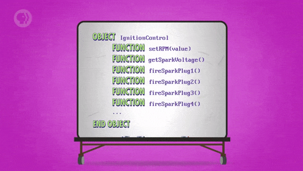
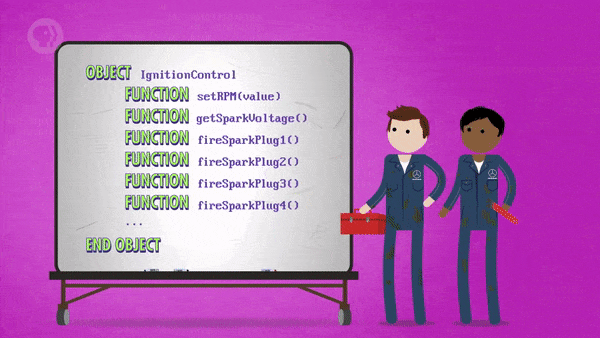

>
해당 포스트는 
Youtube 채널
<a href='https://www.youtube.com/channel/UCX6b17PVsYBQ0ip5gyeme-Q' target='-blank'>'Crash Course'</a>
에서 제공하는 
<a href='https://www.youtube.com/playlist?list=PL8dPuuaLjXtNlUrzyH5r6jN9ulIgZBpdo' target='-blank'>'Computer Science'</a>
수업을 바탕으로 작성되었습니다.  
( 사진 속 인물은
<a href='https://about.me/carrieannephilbin' target='-blank'>'Carrie Anne Philbin'</a>
선생님 입니다! )

# 0. 시작하기에 앞서,

이전 수업에서는 정렬에 관한 내용과 함께 몇 가지 알고리즘을 살펴봤다.

- 보통, 숫자 목록을 정렬하는 알고리즘은 10줄도 안 되는 짧은 코드로 구성된다.
- 이는, 단 한 명의 프로그래머가 쉽게 작성할 수 있을 정도로 작은 규모다.
- 별다른 도구가 필요 없을 정도이며, 기본 메모장으로도 작성할 수 있을 정도다.

<br>

하지만, 정렬 알고리즘은 프로그램이 아니라, 훨씬 더 큰 프로그램의 일부인 경우가 많다.

- 예를 들어, Microsoft Office 는 대략 4천만 줄의 코드로 구성되어 있다.
- 이는, 한 사람이 내용을 모두 파악하거나, 작성하기에 너무나도 큰 규모다.

<br>

프로그래머들은 이처럼 거대한 프로그램을 만들기 위해 여러 도구와 관행들을 활용했는데,  
이들이 한데 모여, **'소프트웨어 공학(Software Engineering)'** 이라는 분야가 형성되었다.

- 소프트웨어 공학이라는 용어는, 공학자 **'마거릿 해밀턴(Margaret Hamilton)'** 이 만들었다.
- 해밀턴은 NASA가 아폴로(Apollo) 를 달에 문제없이 보낼 수 있도록 도움을 준 인물이다.

<br>

>
"it's kind of like a root canal: you waited till the end,  
[but] there are things you could have done beforehand.  
it's like preventative healthcare, but it's preventative software."  
\- Margaret Hamilton
><hr>
>
그것은 일종의 근관과 같았다. 끝까지 기다렸지만,  
[하지만] 미리 할 수 있었던 일들이 있다.  
그것은 예방의학과 비슷하지만, 예방 소프트웨어다.

# 1. 객체

큰 프로그램을 작은 함수들로 나누면, 여러 사람이 동시에 작업할 수 있다.

>
<a href='/Crash-Course/12.-프로그래밍의-기본---문장과-함수/#10-현대-프로그래밍에-관하여' target='-blank'>'12. 프로그래밍의 기본 - 문장과 함수'</a>
에서 언급했던 내용이다.

전체 구성에 대해 걱정할 필요 없이 현재 작업 중인 함수만 신경 쓰면 되는데,  
예를 들어 알고리즘을 작성 중이라면, 해당 기능의 정확성과 효율성만 확인하면 된다.

<br>

하지만, 코드를 함수로 포장하는 것만으로는 충분하지 않다.

- Microsoft Office 는 수십만 개의 함수로 구성되어 있을 것이다.
- 이는, 4천만 줄의 코드를 직접 다루는 것보다는 훨씬 나을 것이다.
- 하지만, 한 사람 혹은 한 팀이 관리하기에는 여전히 많은 양이다.

<br>

해결책은 여러 함수를 포장해 **'계층 구조(Hierarchies)'** 를 형성하고,  
서로 관련이 있는 코드들을 모아 **'객체(Objects)'** 로 만드는 것이다.  

# 2. 계층 구조

자동차를 예시로 하여 계층 구조에 대해 더 자세하게 살펴보자.

## 2-1. 구성하기

<details><summary>자동차 소프트웨어에는 주행 제어와 관련된 기능(함수) 들이 있다.</summary>

```
function setCruiseSpeed(value) # 속도 설정
function nudgeSpeedUp()        # 속도 올리기
function nudgeSpeedDown()      # 속도 내리기
function stopCruiseControl()   # 주행 제어 중지
```

</details>

<details><summary>이들은 서로 관련이 있기 때문에, 하나로 모아 주행 제어 객체로 포장할 수 있다.</summary>

```
object CruiseControl
  function setCruiseSpeed(value)
  function nudgeSpeedUp()
  function nudgeSpeedDown()
  function stopCruiseControl()
end object
```

</details>

<details><summary>위에서 만든 주행 제어 객체는 엔진 소프트웨어의 한 부분이다.</summary>

- 점화 플러그, 연료 펌프, 라디에이터 등을 제어하는 여러 기능이 있다.

```
object CruiseControl   # 주행 제어
object IgnitionControl # 점화 플러그 제어
object FuelPump        # 연료 펌프
object Radiator        # 라디에이터
```

</details>

<details><summary>이 때, 이러한 객체들을 포함하는 엔진 객체를 만들 수 있다.</summary>

- 엔진 객체는 '부모(parent)' 가 되고, 포함된 객체들은 '자식(children)' 이 된다.

```
object Engine            <- parent
  object CruiseControl    ┐
  object IgnitionControl  │
  object FuelPump         ├ children
  object Radiator         │
  ...                     ┘
end object
```

</details>

<details><summary>여기에 추가로, 엔진 객체에도 자체적으로 고유한 기능이 있다.</summary>

- 이렇게, 자식 객체 외에도 다른 함수들을 저장할 수도 있다.

```
object Engine
  object CruiseControl
  object IgnitionControl
  object FuelPump
  object Radiator
  ...
  function startEngine()   # 엔진 켜기
  function stopEngine()    # 엔진 끄기
  function checkOilLevel() # 오일 레벨 확인
  ...
end object
```

</details>

<details><summary>또한, 자동차의 주행거리 등을 나타내는 다양한 변수들도 있다.</summary>

- 내부에서 자체적으로 관리하는 변수들도 저장되어 있다.
- 일반적으로, 객체는 다른 객체와 함수, 변수를 포함할 수 있다.

```
object Engine
  object CruiseControl
  object IgnitionControl
  object FuelPump
  object Radiator
  ...
  function startEngine()
  function stopEngine()
  function checkOilLevel()
  ...
  variable odometer   # 주행거리계
  variable engineTemp # 엔진 온도
end object
```

</details>

<details><summary>물론, 이러한 엔진 객체도 자동차 객체의 한 부분에 불과하다.</summary>

- 변속기, 바퀴, 문, 창문 등 자동차 역시 다양한 요소들로 구성되어 있다.

```
object Car
  object Engine
  object Transmission
  object Wheels
  object Doors
  object Windows
  object FuelTank
  ...
  variable vinNumber
  variable yearBuilt
end object
```

</details>

## 2-2. 탐색하기

프로그래머로서, 이와 같은 객체에서 주행 제어 기능을 설정하는 방법은 다음과 같다.

- 가장 바깥에 있는 객체부터 더 깊이 위치한 객체까지 각 계층을 탐색해 나간다.
```
Car -> Engine -> ..
```
- 실행시키고자 하는 기능(함수) 을 찾았다면, 해당 위치에서 기능을 실행시킨다.
```
Car -> Engine -> CruiseControl -> setCruiseSpeed(55)
```
- 이런 과정을 표현하기 위해, 프로그래밍 언어들은 흔히 아래와 같은 구문을 사용한다.
```
Car.Engine.CruiseControl.setCruiseSpeed(55)
```

# 3. 객체 지향 프로그래밍

이렇게, 기능 단위를 계층화하여 객체로 포장하는 개념을 **'객체 지향 프로그래밍'** 이라고 한다.

> Object Oriented Programming (객체 지향 프로그래밍, O.O.P)

- 높은 수준의 구성 요소에서 낮은 수준의 세부 사항들을 캡슐화하여 복잡성을 감추는 것이다.
- 이전 수업에서 트랜지스터 회로를 추상화하여 높은 수준의 논리 회로로 포장했던 것과 비슷하다.

<br>

큰 프로그램을 기능 단위로 나누는 것은 팀 작업에 아주 적합한데,  
예를 들어, 위에서 살펴봤던 자동차 소프트웨어의 경우는 아래와 같다.

- 여러 사람으로 구성된 하나의 팀이 주행 제어 체계에 대해 책임을 진다.
- 해당 팀 소속의 프로그래머 개개인이 그중 일부 기능만 담당하게 된다.

<br>

이는 고층빌딩처럼 크고 물리적인 요소들이 건설되는 방식과도 비슷하다.

```
전기 기술자 팀 : 전선 작업
배관공 팀     : 배관 작업
용접공 팀     : 용접 작업
도장공 팀     : 페인팅 작업
...
```
- 이외에도, 건설 현장 곳곳에서 여러 사람이 모여 팀을 이뤄 작업한다.
- 이들은 모두 각자의 기술을 활용해, 서로 다른 부분에서 동시에 작업한다.
- 이렇게 작업을 진행하다 보면, 특정 시점에는 건물 전체를 완성할 수 있다.

# 4. 응용 프로그램 프로그래밍 인터페이스

다시, 주행 제어 기능의 예시로 돌아가 보자.

- 주행 제어 기능은 자동차의 속도를 일정하게 유지하는 기능이다.
- 이는 엔진 소프트웨어의 다른 부분에 있는 기능을 사용해야 한다.
- 다시 말해, 주행 제어 코드의 동작을 위해 다른 코드가 필요하다.
- 그 코드는 주행 제어 팀이 아니라, 다른 팀이 담당하는 부분이다.

<br>

이 때, 해당 코드는 주행 제어 팀에서 작성한 코드가 아니기 때문에,  
주행 제어 팀이 그 코드를 사용하려면 아래와 같은 것들이 필요할 것이다.

- 코드를 구성하는 각 함수에 대해 정리된 **'문서(Documentation)'**
- 다른 프로그램에서도 그 코드를 사용할 수 있을 만큼 잘 정의된 인터페이스
   - 이러한 인터페이스를 **'응용 프로그램 프로그래밍 인터페이스(API)'** 라고 한다.
> Application Programming Interface (API)
   - 협업 관계의 프로그래머들끼리 다양한 코드를 통해 상호작용하는 방식이다.

<br>

예를 들어, 점화 플러그 객체에는 아래와 같은 기능들이 있다.

```
object IgnitionControl
  function setRPM(value)     # 엔진 RPM 설정
  function getSparkVoltage() # 점화 플러그 전압 확인
  function fireSparkPlug1()  # 1번 플러그 점화
  function fireSparkPlug2()  # 2번 플러그 점화
  function fireSparkPlug3()  # 3번 플러그 점화
  function fireSparkPlug4()  # 4번 플러그 점화
  ...
end object
```

<details><summary>이 때, 엔진의 RPM을 설정하는 기능은 주행 제어 기능에 매우 유용하게 사용된다.</summary>

- 따라서, 주행 제어 팀은 해당 기능을 수행하는 함수를 호출할 필요가 있다.



</details>

<details><summary>하지만, 주행 제어 팀은 점화 플러그 체계가 작동하는 방법을 잘 모른다.</summary>

- 이 상태에서, 개별 플러그를 점화하는 함수를 잘못 호출하면, 엔진이 폭발할 수도 있다.



</details>

<details><summary>이런 상황에서 API는 사용자가 필요로 하는 함수와 정보만을 제공할 수 있다.</summary>

```
object IgnitionControl
  public function setRPM(value)
  public function getSparkVoltage()
  private function fireSparkPlug1()
  private function fireSparkPlug2()
  private function fireSparkPlug3()
  private function fireSparkPlug4()
  ...
end object
```
- 객체 지향 프로그래밍 언어들은 함수의 공개 여부를 지정할 수 있다.
   - 공개 여부를 지정해 특정 요소에 대한 접근을 제한할 수 있다.
- 비공개(private) 로 표시된 함수는 객체 내부에서만 호출할 수 있다.
   - 위의 예제에선 setRPM() 함수를 통해서만 점화 플러그를 작동시킬 수 있다.
- 반대로, 외부에서는 공개(public) 로 표시된 함수만 호출할 수 있다.
   - 이 때, CruiseControl 과 같은 외부 객체는 setRPM() 함수를 사용할 수 있다.

</details>

<br>

이렇게 필요한 요소만 선택적으로 드러내면서 전체적인 복잡성을 감출 수 있다.

- 이러한 특징이 객체 지향 프로그래밍의 본질이자, 핵심이다.
- 크고 복잡한 프로그램을 만드는 데에 강력하며, 자주 사용된다.

<br>

>
우리가 사용하는 컴퓨터 프로그램, 콘솔 게임과 같은 대부분의 소프트웨어는  
C++, C#, Objective-C 등의 객체 지향 프로그래밍 언어로 작성되어 있으며,
>
이 외에도 한 번쯤 들어봤을 법한 대중적인 객체 지향 언어로는 Python 과 Java 가 있다.

# 5. 통합 개발 환경

컴파일되기 전의 코드는 단순한 문자에 불과하다.

- 앞서 언급했듯, 메모장을 이용해 코드를 작성할 수 있다.
- 실제로, 오래된 워드 프로세서를 사용하는 사람들도 있다.

<br>

보통, 요즘 소프트웨어 개발자들은 특수 목적의 응용 프로그램을 사용한다.

- 프로그램을 작성하기 위해 주로 사용되는 프로그램이다.
- 다양한 기능을 제공하는 많은 도구가 하나로 통합되어 있다.  
  `(코드 작성, 정리 및 컴파일, 테스트 등)`

<br>

필요한 모든 것이 하나로 합쳐져 있기 때문에, **'통합 개발 환경(IDE)'** 이라고 한다.

> Integrated Development Environments (IDE)

- 모든 IDE는 코드 작성을 위한 텍스트 편집기를 제공한다.
   - 코드 작성에 도움이 되는 다양한 기능들을 포함한다.
   - 가독성이 향상되도록 코드에 자동으로 색상을 부여한다.
- 대부분의 IDE는 입력 중에 구문 오류를 확인하는 맞춤법 검사 기능도 있다.
- IDE를 활용하면 많은 파일을 정리하고, 효율적으로 탐색할 수도 있다.
   - 개별 소스 파일의 수가 많은, 큰 프로그램에서 특히 유용하다.

# 6. 디버깅

또한, IDE에는 코드를 컴파일하고 실행하는 기능도 내장되어 있다.

- 프로그램이 충돌하는 경우, IDE는 문제가 발생한 코드 줄로 이동한다.
- 보통, 버그를 추적하고 수정하는 데 도움이 되는 추가 정보를 제공한다.

<br>

이렇게 버그를 추적하여 수정하는 절차를 **'디버깅(debugging)'** 이라고 한다.

- 대부분의 프로그래머는 전체 시간의 7~80%를 테스트와 디버깅에 사용한다.
   - 새로운 코드를 작성하는 것보다 디버깅에 더 많은 시간을 사용한다는 뜻이다.
- 때문에, IDE에서 제공하는 디버깅 보조 기능은 매우 중요하다고 할 수 있다.
   - 프로그래머가 오류를 예방하거나 발견하는 데에 큰 도움이 되기 때문이다.

<br>

>
많은 컴퓨터 프로그래머들은 IDE에 꽤 충실한 편이지만,  
솔직히 말해서, VIM은 그런 마음을 그만두는 방법을 제공한다.  
\- Carrie Anne Philbin

~~`(vim 만세! vim 만세! vim 만세!)`~~

# 7. 문서화와 코드 재사용

코딩과 디버깅 외에도 프로그래머에게 중요한 작업이 있는데,  
그것은 바로, 작성한 코드를 **'문서화(Documenting)'** 하는 것이다.

<br>

독립 실행형 파일인 **'리드미(README)'** 를 통해 문서화할 수 있으며,  
다른 사용자에게 '실행 전에 이것을 읽어보세요.' 라는 의미를 전달한다.

<br>

또 다른 방법으로는, 코드 자체에서 **'주석(comment)'** 을 이용하는 방법이 있다.

- 아래의 문장은 컴파일될 때 프로그램에서 무시되는 명령문이다.  
  `(아래의 예제는 C, C++ 등의 언어에서 사용되는 주석의 예시다.)`
    ```cpp
    /* This function sets the speed of the engine
    in revolutions per minute (RPM). A single integer
    value is passed in, which must be a number between
    1000 and 6000. Any value outside of this range will
    be considered an error and ignored.
    No value is returned. */
    public function setRPM(value)
        ...
    ```
- 프로그래머가 소스 코드의 내용을 파악하는 데 도움을 주기 위해서만 존재한다.
- 잘 작성된 문서는 프로그래머가 코드를 오랜만에 다시 확인할 때 도움이 된다.
   - 해당 코드를 완전히 처음 접하는 프로그래머에게도 중요하다.

> #### 여기서 잠깐!
문서화나 주석 처리가 되지 않은 코드를 툭 하고 던지는 듯한 행위는 **최악의 행위** 이다.  
왜냐하면, 처음 보는 사람이 코드의 내용을 파악하려면 한 줄씩 확인해야 하기 때문이다.
>
`(특히, 누군가와 함께 작업하는 경우에 이런 행위를 삼가야 한다.)`

<br>

또, 문서화는 **'코드의 재사용(code reuse)'** 을 촉진한다.

- 문서 덕분에, 코드를 전부 읽어보지 않고도 쉽게 내용을 확인할 수 있다.
- 덕분에, 다른 사람이 작성한 코드 중에서 필요한 것을 쉽게 찾을 수 있다.
- 필요한 코드를 찾았다면, 기존에 있던 그 코드를 가져다가 사용할 수 있다.
- 그러면, 프로그래머는 계속해서 같은 내용의 코드를 작성하지 않아도 된다.

<br>

**<작성 중인 글입니다.>**

**<아래 내용은 정리 중입니다.>**

# 8. 버전 관리 체계

IDE 외에도 프로그래밍 작업에 도움을 주는 중요한 소프트웨어가 있다.

> Source Control(소스 관리)

- Version Control(버전 관리), Revision Control(개정 관리) 라고도 불린다.  
  `(체계를 뜻하는 'system' 을 붙여, 버전 관리 체계라고 부르기도 한다.)`
- 큰 규모의 팀이 대형 코딩 프로젝트에서 협업하는 것에 도움을 주는 소프트웨어다.

<br>

대부분의 경우, 프로젝트용 코드는 중앙 집중 방식 서버에 저장된다.
   - 이런 서버를 코드 **'저장소(Repository)'** 라고 부른다.
   - Apple 이나 Microsoft 와 같은 대형 소프트웨어 회사에도 있다.

<br>

도서관에서 책을 빌리듯, 작업하고자 하는 코드를 가져올 수 있다.

- '빌리다' 라는 뜻의 **'check out'** 이라는 표현을 사용한다.
- 이렇게 가져온 코드를 IDE에서 바로 사용할 수도 있다.
   - 개인용 컴퓨터에서 코드를 마음대로 수정할 수 있다.
   - 새로운 기능을 추가하여 기능 동작을 테스트할 수도 있다.

<br>

작업한 코드를 다른 사람들이 사용할 수 있도록 다시 저장소로 보낼 수도 있다.

- 이와 같은 행위를 코드를 **'커밋(commit)'** 한다 라고 표현한다.
- 아래와 같은 조건이 만족었을 때 프로그래머가 하는 행위다.
   - 변경한 부분이 문제 없이 잘 동작한다.
   - 전체적으로 봤을 때 덜 작업된 부분이 없다.

<br>

한 조각의 코드가 확인되고, 업데이트되거나 수정될 것으로 예상되는 동안 프로그래머는 그것을 내버려둔다.

이것은 이상한 갈등과 중복된 작업을 방지한다.

이 방법으로 수백명의 프로그래머가 동시에 코드를 체크 인 및 체크 아웃을 할 수 있다.

반복적으로 거대한 시스템을 구축한다.

비판적으로, 여러분은 다른 사람이 버그가 있는 코드를 작성하는 것을 원하지 않는다.

다른 사람이나 팀이 그 정보에 의존할 수 있기 때문이다.

그들의 코드가 충돌하여 혼란을 일으키고 시간을 낭비할 수 있다.

서버에 저장된 코드의 마스터 버전은 항상 오류없이 컴파일하고 최소한의 버그로 실행해야 한다.

하지만 때로는 버그가 슬며시 기어들어 온다.

다행히 소스 제어 소프트 웨어는 모든 변경 사항을 추적하고,  
만약 버그가 발견되면 전체 코드 또는 하나의 코드 조각을 초기의 또는 안정적이 버전으로 되돌릴 수 있다.

Rolled Back

또한 각 변경 사항을 누가 작성했는지 추적하므로, 동료들이 불쾌감을 줄 수도 있다.

그럴 때는, 문제가 있는 사람에게 도움이 되거나 격려할 수 있는 이메일을 보낼 수도 있다.

# 9. 품질 보증

디버깅은 코드 작성과 함께 진행되며, 개인이나 소규모 팀이 가장 자주하는 일이다.

디버깅의 큰 그림 버전은 품질 보증 테스트, 또는 QA 이다.

Quality Assurance

이곳은 팀이 엄격하게 소프트웨어를 테스트하는 곳이다.

실수를 불러일으킬 수도 있는, 예기치 않은 상황을 만들어내어 소프트웨어를 작동시킬 수 있다.

기본적으로 이들은 버그를 이끌어낸다.

모든 주름을 제거하는 것은 엄청난 노력이지만,  
소프트웨어가 출하되기 전에 상상할 수 있는 많은 상황에서  
여러 사용자들을 대상으로 소프트웨어가 작동하는 지 확인하는 데 중요하다.

베타 소프트웨어에 대해 들어봤을 것이다.

이것은 대부분 완성된 소프트웨어 버전이다.

하지만, 100% 완벽하게 테스트한 것은 아니다.

회사는 종종 문제를 식별할 수 있도록 베타 버전을 공개한다.

그것은 기본적으로 무료 품질 보증을 받는 것과 같다.

베타 이전의 버전인 알파 버전은 베타 버전만큼은 많이 들어보진 못했을 것이다.

이것으 일반적으로 매우 거칠고 버그가 있으며, 내부적으로만 테스트된다.

# 10. 컴퓨터의 성능에 관하여,

그래서 그것은 도구, 트릭 및 기술에 관한 용어로썬 빙산의 일각이다.

오늘날 우리가 알고 있고 사랑하는 유튜브, GTA5, 파워포인트처럼 거대한 소프트웨어의 구성에서 말이다.

예상대로, 수백만 줄의 코드는 유용한 속도로 실행되기 위해 만만치 않은 처리 능력이 필요하다.

그래서 다음 수업에서는 컴퓨터가 어떻게 그렇게 놀랍도록 빨라졌는지에 대해 이야기할 것이다.
