>
해당 포스트는 
Youtube 채널
<a href='https://www.youtube.com/channel/UCX6b17PVsYBQ0ip5gyeme-Q' target='-blank'>'Crash Course'</a>
에서 제공하는 
<a href='https://www.youtube.com/playlist?list=PL8dPuuaLjXtNlUrzyH5r6jN9ulIgZBpdo' target='-blank'>'Computer Science'</a>
수업을 바탕으로 작성되었습니다.  
( 사진 속 인물은
<a href='https://about.me/carrieannephilbin' target='-blank'>'Carrie Anne Philbin'</a>
선생님 입니다! )

# 0. 시작하기에 앞서,

지난 6편의 수업에선 소프트웨어의 발전에 관해 탐구해봤다.

> 초기 프로그래밍 분야에서의 여러 노력이 현대 소프트웨어 공학의 여러 관행에 이르기까지

<br>

약 50년간, 소프트웨어의 복잡성은 급격하게 증가했다.

- **'천공 테이프'** 에 **'직접 구멍을 뚫어 표시'** 하는 **'기계 코드'**
- **'통합 개발 환경'** 에서 **'컴파일'** 되는 **'객체 지향 프로그래밍 언어'**

<br>

하지만, 이런 **정교함의 성장**은 **하드웨어의 개선** 없이는 불가능했을 것이다.

# 1. 이산 구성 요소와 숫자의 횡포

컴퓨팅 하드웨어의 성능과 정교함이 성장해온 과정을 살펴보자.

> 우선, 전자 컴퓨팅이라는 개념이 탄생한 시기로 돌아가야 한다.

<br>

<details><summary>대략 1940년대부터 1960년대 중반까지, 모든 컴퓨터는 개별 부품으로 제작되었다.</summary>

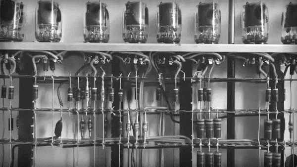

</details>

- 각 부품은 **'이산 구성 요소(Discrete Component)'** 라고 불렸다.
- 이러한 모든 개별 부품들은 전선(wire) 을 통해 서로 연결되어있었다.

<br>

<details><summary>예를 들어, 에니악(ENIAC) 은 아래와 같은 부품들로 구성되었다.</summary>

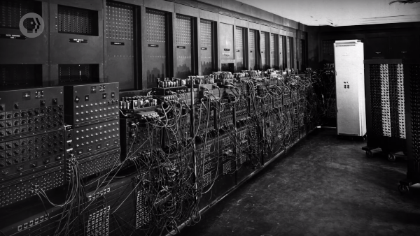

</details>

- 17,000개 이상의 진공관
- 70,000개의 저항기
- 10,000개의 콘덴서
- 7,000개의 다이오드

> 이들을 모두 연결하기 위해 5백만 개의 손 납땜 연결이 필요했다.

<br>

성능을 높이기 위해서는 더 많은 구성 요소를 추가해야 했다.

- 부품의 연결 횟수가 늘어나면서, 필요한 전선의 개수도 점점 많아졌다.
- 이는, 성능이 높아질수록 구성이 더 복잡해져야 한다는 것을 의미했다.
- 이러한 상황은 **'숫자의 횡포(Tyranny of Number)'** 라고 불렸다.

# 2. 트랜지스터 컴퓨터

<details><summary>1950년대 중반에 상용화된 트랜지스터는 컴퓨터를 구성하는 데 사용되기 시작했다.</summary>

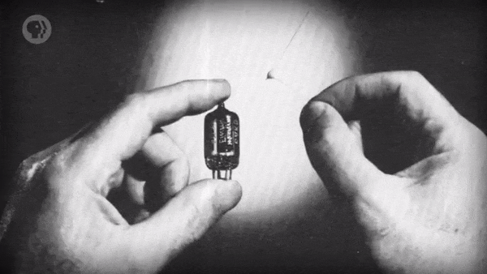

</details>

- 트랜지스터는 진공관보다 훨씬 작고, 빠르며, 더 믿을 만 했다.
- 하지만, 각각의 트랜지스터는 여전히 하나의 이산 구성 요소였다.

<br>

1959년, IBM은 진공관 기반 컴퓨터인 '709' 를 개선했다.

- 컴퓨터에 포함된 모든 이산 진공관을 이산 트랜지스터로 교체했다.
- 이렇게 탄생한 새로운 컴퓨터를 'IBM 7090' 이라고 이름 붙였다.
- 기존과 비교했을 때, 속도는 6배나 빨라졌으며, 비용은 절반으로 줄었다.
- 이렇게 등장한 **'트랜지스터화된 컴퓨터'** 는 2세대 컴퓨터라고 불린다.
> Transistorized Computers

<br>

하지만, 이렇게 더 빠르고, 작아진 트랜지스터도 숫자의 횡포를 해결하진 못했다.

- 수십만 개의 개별 부품으로 컴퓨터를 제조하는 것은 물리적인 어려움이 있었다.
- 이보다 더 심각한 문제는 컴퓨터를 설계하는 것 자체가 훨씬 어려워졌다는 것이다.
- <details><summary>1960년대에 이런 문제는 한계에 도달하고 있었다.</summary>
  
  - 당시, 컴퓨터 내부는 보통 거대하게 엉켜있는 전선들로 가득했다.
  - 아래 사진은 1965년에 출시된 'PDP-8' 이라는 컴퓨터의 내부 모습이다. `(ㅗㅜㅑ;)`
  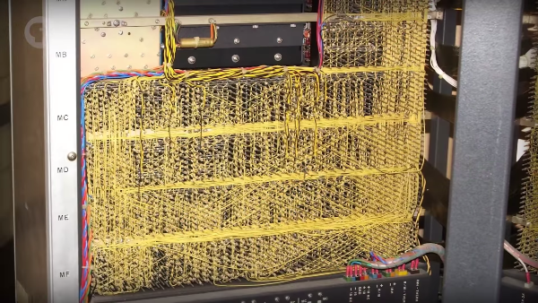
  
  </details>

# 3. 집적 회로

이러한 문제의 해답은, 근본적인 복잡성을 포장해, 추상화의 수준을 높이는 것이었고,  
1958년, 텍사스 인스트루먼트의 'Jack Kilby' 가 새로운 요소와 함께 그 돌파구를 열었다.

- 킬비는 '전자 회로의 모든 구성요소가 통합된' 전자 부품을 시연했다.
- 컴퓨터를 구성하던 많은 구성 요소들을 단일 구성 요소로 통합한 것이다.
- 이 부품을 **'집적 회로(Integrated Circuit, IC)'** 라고 부른다.

<br>

몇 달 후인 1959년, 'Robert Noyce' 가 이끄는 페어차일드 반도체는 집적 회로를 실용화했다.

- 킬비는 집적 회로를 만들 때, 희귀하고 불안정한 물질인 게르마늄을 이용했다.
- 하지만, 페어차일드는 풍부하고, 안정적이며, 믿을만한 자원인 실리콘을 이용했다.  
  `(실리콘은 지각의 약 1/4을 차지할 정도로 많다.)`

<br>

이러한 이유로 노이스는 전자 시대를 주도한 현대 집적 회로의 아버지로 널리 알려지게 되었고,  
페어차일드가 기반을 둔 실리콘 밸리에도 곧 다른 많은 반도체 회사들이 등장하기 시작했다.

# 4. 인쇄 회로 기판

<details><summary>초기의 집적 회로는 몇 개의 트랜지스터가 포함된 단순한 회로로 구성되었다.</summary>

- 아래는 초기 웨스팅하우스 집적 회로의 사진이다.

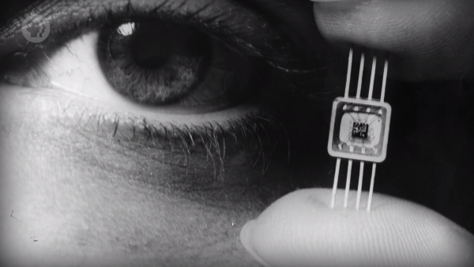

</details>

- 이렇게 작은 규모로도, 간단한 논리 회로를 단일 구성 요소로 포장할 수 있다.
>
<a href='/Crash-Course/3.-부울-연산과-논리-게이트/' target='-blank'>'3. 부울 연산과 논리 게이트'</a>
에서 살펴봤던 논리 회로 등

<br>

<details><summary>집적 회로는 컴퓨터 공학자를 위한 레고라고 생각할 수도 있다.</summary>

  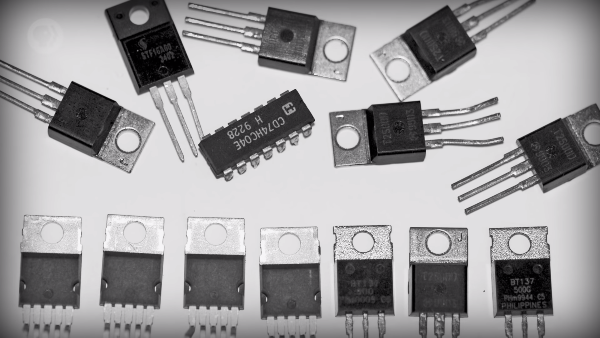

</details>

- 여러 가지 가능한 설계들을 나열해 무한한 길이의 배열처럼 만들 수 있다.
- 하지만, 복잡한 회로를 구성하려면 여전히 각 집적 회로를 연결해야 했다.

<br>

<details><summary>이를 위해, 공학자들은 또 다른 획기적인 요소를 발명했다.</summary>

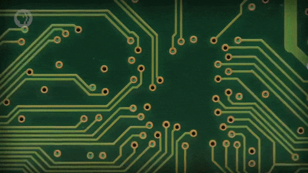

</details>

- 바로, **'인쇄 회로 기판(Printed Circuit Board, PCB)'** 이다.
- 전선을 연결하여 납땜할 필요가 없으며, 대량 생산이 가능하다.
- 모든 금속 전선을 바로 식각(etch) 하여 부품을 서로 연결한다.

<br>

<details><summary>인쇄 회로 기판과 집적 회로를 함께 사용해 기능 회로를 만들 수도 있다.</summary>

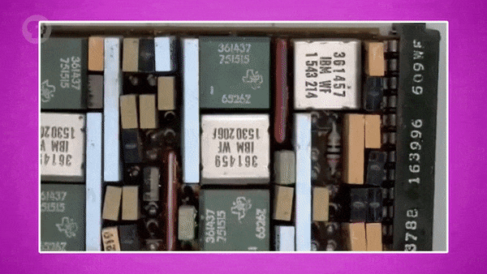

</details>

- 이산 구성 요소를 이용한 기능 회로와 똑같이 동작하게 할 수 있다.
- 구성 요소와 연결을 더 적게 사용해서, 더 작고 저렴하며 더 안정적이다.

<br>

**<작성 중인 글입니다.>**

**<아래 내용은 정리 중입니다.>**

# 5. 포토 리소그래피

초기 집적 회로는 대부분 단일 부품으로 포장된 아주 작은 이산 구성 요소들로 제조되었다.

- <details><summary>1964년에 IBM에서 만든 것과 비슷하게 생겼다.</summary>

  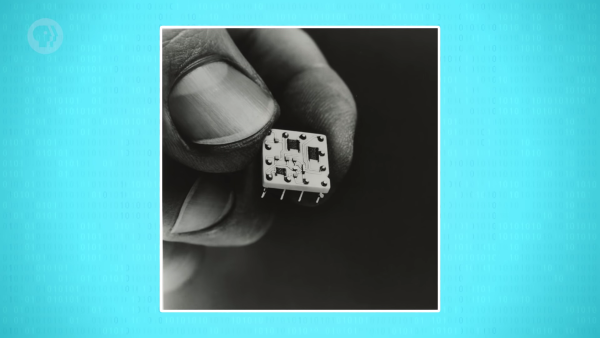

  </details>

- 하지만, 이렇게 작은 부품을 사용해도 하나의 집적 회로에 5개 이상의 트랜지스터를 넣기는 어려웠다.

<br>

더 복잡한 설계를 위해서는 근본적으로 다른 제조 공정이 필요했다.

- 바로, **'포토 리소그래피(Photo Lithography)'** 라는 공정이다.
- 복잡한 패턴을 반도체와 같은 물질에 옮기기 위해 빛을 이용한다.
- 아주 단순한 기본 작업 몇 가지로 엄청나게 복잡한 회로를 만들 수 있다.

<br>

<details><summary>간단하지만 광범위한 예제를 통해 이렇게 생긴 것을 만들어볼 것이다.</summary>

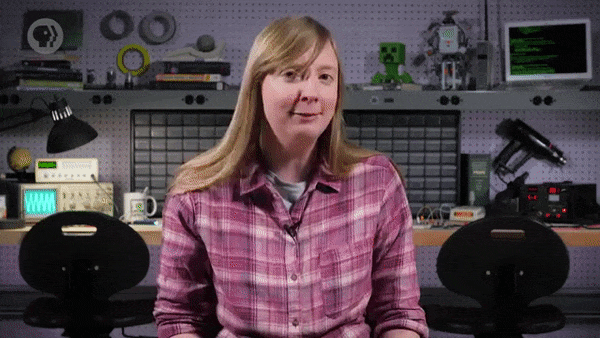

</details>

<br>

<details><summary>1. '웨이퍼(Wafer)' 라고 불리는 얇은 실리콘 조각으로 시작한다.</summary>

- <a href='/Crash-Course/2.-전자-컴퓨팅/#8-1-구성' target='-blank'>'2. 전자 컴퓨팅'</a>
에서 간단하게 설명했듯, 실리콘은 반도체다.
- 반도체는 상황에 따라 전기가 통하거나 통하지 않는 특별한 물질이다.
   - 이러한 현상을 언제 어디서 발생하도록 할지 제어할 수 있다.
   - 따라서, 실리콘은 트랜지스터를 구성하기에 아주 적합한 물질이다.
- 또한, 웨이퍼를 기반으로 하여 복잡한 금속 회로를 놓을 수 있다.
   - 이렇게 하면 모든 요소가 통합되면서 집적 회로가 된다.

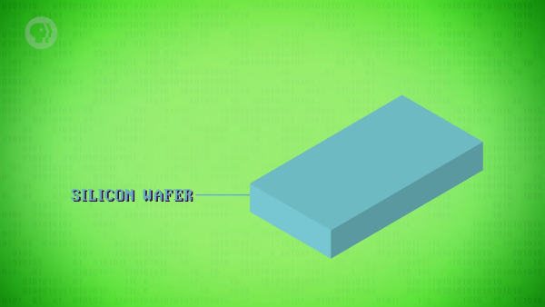

</details>

<details><summary>2. 실리콘 위에 보호 코팅 역할을 하는 얇은 산화물 층(Oxide Layer) 을 추가한다.</summary>


</details>

<details><summary>3. '포토 레지스트(Photoresist)' 라는 특수 화학 물질을 추가한다.</summary>

- 빛에 노출되면 화학 변화가 일어나 용해되기 때문에 다른 특수 화학 물질로 씻어 낼 수 있다.
- 포토 레지스트 자체는 그다지 유용하지 않지만 포토 마스크와 함께 사용하면 매우 강력하다.


</details>

<details><summary>4. 포토 레지스트 자체로는 큰 의미가 없으므로, '포토 마스크(Photomask)' 를 추가한다.</summary>

- 포토 마스크는 사진 필름과 거의 비슷한 역할을 한다고 볼 수 있다.
- 작은 부리토를 먹는 햄스터 대신 웨이퍼에 옮길 패턴이 들어 있다.


</details>

<details><summary>5. 포토 마스크를 웨이퍼 위에 놓고 강력한 조명을 켠다.</summary>

- 포토 마스크에 의해 빛이 차단된 부분은 변하지 않는다.
- 반대로, 빛에 노출된 부분에는 화학적인 변화가 일어난다.


</details>

<details><summary>6. 빛에 노출된 부분만 씻어내, 산화물 층을 선택적으로 드러낸다.</summary>


</details>

<details><summary>7. 또 다른 특수 화학 물질을 이용해 노출된 산화물을 제거한다.</summary>

- 이 과정에서 주로 사용되는 특수 화학 물질은 산(acid) 이다.
- 원재료인 실리콘까지 전체적으로 작은 구멍이 생기도록 식각한다.
- 이 때, 포토 레지스트 아래의 산화물 층은 보호된 상태다.


</details>

<details><summary>8. 남아있는 포토 레지스트를 씻어내기 위해 또 다른 특수 화학 물질을 사용한다.</summary>

- 포토 리소그래피에는 특정한 기능을 지닌 특수 화학 물질들이 많이 사용된다.


</details>

<details><summary>9. 노출된 실리콘에 전기가 더 잘 통하도록 도핑(doping) 이라는 과정을 통해 화학적 변화를 준다.</summary>

- 대부분의 경우에 '인(Phosphorus)' 과 같은 물질을 이용한다.
- 인을 고온 가스로 변환해 실리콘의 노출된 영역에 침투시킨다.
- 이러한 작업이 처리된 부분은 전기적인 특성이 바뀌게 된다.


</details>

> #### 여기서 잠깐!
이 수업에서는 반도체의 물리학, 화학에 대해 다루지 않지만,  
만약 관심이 있다면, 아래의 링크를 참고하길 바란다.  
> - <a href='https://www.youtube.com/watch?v=IcrBqCFLHIY' target='-blank'>
'Veritasium의 Derek Muller가 만든 훌륭한 설명 영상'</a>

<br>

트랜지스터를 만들기 위해서는 포토 리소그래피를 여러 차례 진행해야 한다.

<details><summary>1. 포토 레지스트로 코팅된 새로운 산화물 층을 만드는 것부터 다시 시작한다.</summary>


</details>

<details><summary>2. 다른 새로운 패턴의 포토 마스크를 올린 후, 도핑된 영역 위에서 조명을 켠다.</summary>


</details>

<details><summary>3. 다시 한 번, 남아있는 포토 레지스트를 다시 씻어낸다.</summary>


</details>

<details><summary>4. 실리콘 일부를 다른 형태로 변환하기 위해 다른 가스를 사용해 도핑한다.</summary>

- 이번에는 다른 영역 안에 중첩된 작은 영역만 도핑해야 한다.
- 포토 리소그래피에서는 타이밍이 매우 중요하다.
- 도핑의 확산(diffusion) 및 식각의 깊이 등을 제어해야 하기 때문이다.
- 이제, 트랜지스터를 만드는 데 필요한 모든 부품이 준비되었다.


</details>

<br>

마지막 단계는 산화물 층에 통로를 만드는 것이다.

> 트랜지스터의 다른 부분에 작은 금속 전선을 연결하기 위해서다.

<details><summary>1. 다시 한 번, 포토 레지스트를 덮고 새로운 포토 마스크를 사용해 작은 통로를 식각한다.</summary>


</details>

<details><summary>2. 이번에는 금속화(metalization) 라는 새로운 절차를 진행한다.</summary>

- 알루미늄, 구리 등을 이용해 얇은 금속층을 증착한다.


</details>

<details><summary>3. 전체를 금속으로 덮는 것이 아니라, 아주 구체적인 회로 설계를 식각해야 한다.</summary>

- 따라서, 이전과 매우 유사한 절차들을 한 번 더 반복한다.
```
포토 레지스터 적용 -> 포토 마스크 추가 -> 노출된 영역 용해 -> 노출된 금속 제거
```


</details>

<br>

이렇게, '접합형 트랜지스터(Bipolar Junction Transistor)' 를 완성했다.

- 서로 다른 세 부분에 연결되는 작은 전선들이 포함되어 있다.
- 각 부분은 서로 다른 방식의 도핑이 적용되어 만들어졌다.
- 이 트랜지스터는 양극성 접합 트랜지스터라고 불리기도 한다.
- <details><summary>1962년에 실제로 특허를 냈고, 이 발명은 세상을 영원히 바꿔놓았다.</summary>
  
  
  
  </details>

<br>

포토 리소그래피를 통해 저항기, 축전기 등 다른 유용한 전자 요소들을 만들 수도 있다.

- 위의 예시와 유사한 절차들을 거치되, 조금씩 변화를 주면 된다.
- 여러 개의 전자 요소들을 단일 실리콘 조각에 만들 수도 있다.
- 게다가, 회로 연결에 필요한 모든 전선도 포함하도록 구성할 수 있다.
- 따라서, 이산 구성 요소를 이용하지 않고도 복잡한 회로를 구성할 수 있다.

<br>

예시와 다르게, 실제 포토 마스크에는 수백만 개의 작은 세부 사항들이 한 번에 표시되어 있다.

- 여러 전선이 서로 위아래로 교차하여, 모든 개별 요소들을 연결한다.
- 아래는 집적 회로를 위에서 살펴본 모습이다.

<br>

예시와 다르게, 실제로는 원하는 크기로 빛을 투사할 수 있다는 이점을 활용하기도 한다.

- 영화관에서 전체 화면을 채우기 위해 필름을 투사하는 것과 같은 방식이다.
- 웨이퍼 전체가 아니라 아주 작은 실리콘 조각에 빛의 초점을 맞추는 것이다.
- 포토 마스크에 표시된 어떤 세부 정보라도 웨이퍼에 기록할 수 있다.

<br>

한 개의 실리콘 웨이퍼로 보통 수십 개의 집적 회로를 만들 수 있다.

전체 웨이퍼가 가득 차게 되면, 그것들을 잘라내 마이크로 칩으로 포장한다.

전자 제품에서 늘 볼 수 있는 작은 검은색 직사각형이다.

기억할 것은 각각 칩들의 핵심은 이러한 작은 실리콘 조각 중 하나다.

# 6. 무어의 법칙

포토 리소그래피 기술이 발전함에 따라 트랜지스터의 크기는 작아지고, 밀도는 높아졌다.

1960년대 초반 집적 회로는 5개 이상의 트랜지스터가 거의 포함되지 않았고, 실제로도 적합하지 않았다.

그러나 1960년대 중반까지 우리는 시장에서 100개 이상의 트랜지스터가 있는 집적 회로를 보기 시작했다.

1965년에 Gordon Moore 는 다음과 같은 추세를 볼 수 있었다.

대략 2년 마다, 재료와 제조의 발전 덕분에 두 배의 트랜지스터를 같은 공간에 장착할 수 있다.

이것을 무어의 법칙(Moore's Law) 이라고 한다.

이 용어는 약간 잘못되었다.

추세를 따르면 절대적인 법칙이 아니었다.

그러나 좋은 표본이다.

집적 회로의 가격도 1962년 평균 50달러에서 1968년 2달러로 급격히 떨어졌다.

오늘날엔, 집적 회로를 몇 센트로 살 수 있다.

# 7. 마이크로 프로세서

더 작은 크기와 더 높은 밀도의 트랜지스터에는 다른 이점도 있다.

트랜지스터가 작을수록 이동해야 하는 부담이 적어져 상태 변환이 빨라지고 소비 전력을 줄일 수 있다.

또한 소형 회로는 신호 지연이 적어 클럭 속도도 빨라졌다.

1968년 Robert Noyce 와 Gordon Moore 가 팀을 이루어 새로운 회사를 설립했다.

통합(Integrated) 과 전기(Electronics) 라는 단어를 조합하여,  
오늘날의 가장 큰 칩 제조업체인 인텔(Intel) 을 만들었다.

7강과 8강에 등장했던 Intel 4004 CPU 는 중요한 이정표였다.

1971년에 출시된 집적 회로는 마이크로 프로세서라고 불리는 최초의 프로세서였다.

그것은 매우 아름답고 작았기 때문에 마이크로 프로세서라고 불렸다.

그것은 2,300개의 트랜지스터를 포함하고 있다.

사람들은 하나의 칩 안에 든 전체 CPU로의 통합 수준에 놀라움을 금치 못했다.

불과 20년 전만 해도 전체 공간을 개별 구성 부품들로 채워야 했었기 때문이다.

집적 회로의 시대, 특히 마이크로 프로세서는 컴퓨팅의 3세대로 안내했다.

# 8. 집적 회로의 발전

그리고 Intel 4004 는 시작에 불과했다.

CPU 안의 트랜지스터 수가 증폭했다!

1980년까지 CPU에는 3만 개의 트랜지스터가 들어가 있었다.

1990년까지 CPU에 들어가는 트랜지스터는 백만 개가 넘었다.

2000년까지는 3천만 개의 트랜지스터, 2010년까지는 집적 회로 하나에 십억 개의 트랜지스터를 넣었다.

이 밀도를 얻기 위해 포토 리소그래피로 가능한 최고 분해 능력이 대략 1만 나노 미터에서  
1만 나노 미터는 인간 머리카락 두께의 약 1/10이다.
오늘날 약 14 나노 미터에까지 이르렀다.

그것은 적혈구보다 400배 이상 작다.

물론 이러한 발전은 CPU에만 유용한 것이 아니다.

대부분의 전자 제품들이 본질적으로 기하급수적으로 발전했다.

> 램, 그래픽 카드, 고체 상태의 하드 드라이브, 카메라 센서 등등

iPhone 7의 A10 CPU와 같은 오늘날의 프로세서는  
약 3억 3천만의 트랜지스터가 1cm * 1cm 크기의 집적 회로에 장착되어 있다.

그것은 우표보다 작다.

# 9. 초고밀도 집적 회로

그리고 현대 기술자들은 이들을 한 번에 하나씩 트랜지스터를 손수 설계하고 배치하지 않았다.

인간적으로는 불가능하다.

1970년대에, 초대형 통합(Very-Large-Scale-Integration)  
또는 VLSI 소프트웨어가 대신 자동으로 칩 디자인을 생성하는 데 사용되었다.

논리 합성(Logic Synthesis) 과 같은 기술을 사용하여  
메모리 캐시와 같은 전체적인 고급 수준의 구성 요소를 놓을 수 있으며,

소프트웨어는 가능한 가장 효율적인 방법으로 회로를 생성한다.

많은 사람들이 이것을 4세대 컴퓨터의 시작이라고 여긴다.

# 10. 소형화에 관하여,

불행히도 전문가들은 수십 년동안 무어의 법칙의 종말을 예언해왔고,  
우리는 마침내 그것에 가까워지고 있을 수 있다.

우리를 추가적인 소형화로부터 방해하는 중요한 이슈가 두 가지 있다.

첫째, 우리는 포토 마스크에 특징을 만들 수 있는 정밀도에 대한 한계에 부딪혔다.

포토 리소그래피에 사용된 빛의 파장으로 인해 만들어진 웨이퍼에도 마찬가지다.

과학자들은 이에 대응하여, 더 작고 작은 파장으로 더 미세한 특징을 투사할 수 있는 광원을 개발해왔다.

두 번째 문제는 트랜지스터가 정말 매우 작아질 때, 전극이 수십 개의 원자로 분리되어,  
전자들이 갭을 뛰어넘어 양자 터널링이라고 하는 현상이 일어날 수 있다.

트랜지스터가 전류를 누설하면 그들은 아주 좋은 스위치를 만들지 못한다.

그럼에도 불구하고 과학자와 기술자는 이러한 문제를 해결할 방법을 찾기 위해 열심히 일한다.

1 나노 미터 크기의 트랜지스터가 연구실에서 시연된다.

이것이 상업적으로 실현될 수 있을 지 여부는 신비 속에 숨어있다.

하지만 아마도 우리는 그것을 미래에는 해결할 수 있을 것이다.
