>
해당 포스트는 아래 수업의 내용을 바탕으로 작성되었습니다.
> - ['Crash Course - Computer Science'](https://www.youtube.com/playlist?list=PL8dPuuaLjXtNlUrzyH5r6jN9ulIgZBpdo)
>
\- Youtube :
['Crash Course'](https://www.youtube.com/channel/UCX6b17PVsYBQ0ip5gyeme-Q)  
\- Professor : ['Carrie Anne Philbin'](https://about.me/carrieannephilbin)


# 0. 시작하기에 앞서,

지난 6편의 수업에선 소프트웨어의 발전에 관해 탐구해봤다.

> 초기 프로그래밍 분야에서의 여러 노력이 현대 소프트웨어 공학의 여러 관행에 이르기까지

<br>

약 50년간, 소프트웨어의 복잡성은 급격하게 증가했다.

- **'천공 테이프'** 에 **'직접 구멍을 뚫어 표시'** 하는 **'기계 코드'**
- **'통합 개발 환경'** 에서 **'컴파일'** 되는 **'객체 지향 프로그래밍 언어'**

<br>

하지만, 이런 **정교함의 성장**은 **하드웨어의 개선** 없이는 불가능했을 것이다.

# 1. 이산 구성 요소와 숫자의 횡포

컴퓨팅 하드웨어의 성능과 정교함이 성장해온 과정을 살펴보자.

> 우선, 전자 컴퓨팅이라는 개념이 탄생한 시기로 돌아가야 한다.

<br>

<details><summary>대략 1940년대부터 1960년대 중반까지, 모든 컴퓨터는 개별 부품으로 제작되었다.</summary>


</details>

- 각 부품은 **'이산 구성 요소(Discrete Component)'** 라고 불렸다.
- 이러한 모든 개별 부품들은 전선(wire) 을 통해 서로 연결되어있었다.

<br>

<details><summary>예를 들어, 에니악(ENIAC) 은 아래와 같은 부품들로 구성되었다.</summary>


</details>

- 17,000개 이상의 진공관
- 70,000개의 저항기
- 10,000개의 콘덴서
- 7,000개의 다이오드

> 이들을 모두 연결하기 위해 5백만 개의 손 납땜 연결이 필요했다.

<br>

성능을 높이기 위해서는 더 많은 구성 요소를 추가해야 했다.

- 부품의 연결 횟수가 늘어나면서, 필요한 전선의 개수도 점점 많아졌다.
- 이는, 성능이 높아질수록 구성이 더 복잡해져야 한다는 것을 의미했다.
- 이러한 상황은 **'숫자의 횡포(Tyranny of Number)'** 라고 불렸다.

# 2. 트랜지스터 컴퓨터

<details><summary>1950년대 중반에 상용화된 트랜지스터는 컴퓨터를 구성하는 데 사용되기 시작했다.</summary>


</details>

- 트랜지스터는 진공관보다 훨씬 작고, 빠르며, 더 믿을 만 했다.
- 하지만, 각각의 트랜지스터는 여전히 하나의 이산 구성 요소였다.

<br>

1959년, IBM은 진공관 기반 컴퓨터인 '709' 를 개선했다.

- 컴퓨터에 포함된 모든 이산 진공관을 이산 트랜지스터로 교체했다.
- 이렇게 탄생한 새로운 컴퓨터를 'IBM 7090' 이라고 이름 붙였다.
- 기존과 비교했을 때, 속도는 6배나 빨라졌으며, 비용은 절반으로 줄었다.
- 이렇게 등장한 **'트랜지스터화된 컴퓨터'** 는 2세대 컴퓨터라고 불린다.
> Transistorized Computers

<br>

하지만, 이렇게 더 빠르고, 작아진 트랜지스터도 숫자의 횡포를 해결하진 못했다.

- 수십만 개의 개별 부품으로 컴퓨터를 제조하는 것은 물리적인 어려움이 있었다.
- 이보다 더 심각한 문제는 컴퓨터를 설계하는 것 자체가 훨씬 어려워졌다는 것이다.
- <details><summary>1960년대에 이런 문제는 한계에 도달하고 있었다.</summary>
  
  - 당시, 컴퓨터 내부는 보통 거대하게 엉켜있는 전선들로 가득했다.
  - 아래 사진은 1965년에 출시된 'PDP-8' 이라는 컴퓨터의 내부 모습이다. `(ㅗㅜㅑ;)`
  
  
  </details>

# 3. 집적 회로

이러한 문제의 해답은, 근본적인 복잡성을 포장해, 추상화의 수준을 높이는 것이었고,  
1958년, 텍사스 인스트루먼트의 'Jack Kilby' 가 새로운 요소와 함께 그 돌파구를 열었다.

- 킬비는 '전자 회로의 모든 구성요소가 통합된' 전자 부품을 시연했다.
- 컴퓨터를 구성하던 많은 구성 요소들을 단일 구성 요소로 통합한 것이다.
- 이 부품을 **'집적 회로(Integrated Circuit, IC)'** 라고 부른다.

<br>

몇 달 후인 1959년, 'Robert Noyce' 가 이끄는 페어차일드 반도체는 집적 회로를 실용화했다.

- 킬비는 집적 회로를 만들 때, 희귀하고 불안정한 물질인 게르마늄을 이용했다.
- 하지만, 페어차일드는 풍부하고, 안정적이며, 믿을만한 자원인 실리콘을 이용했다.  
  `(실리콘은 지각의 약 1/4을 차지할 정도로 많다.)`

<br>

이러한 이유로 노이스는 전자 시대를 주도한 현대 집적 회로의 아버지로 널리 알려지게 되었고,  
페어차일드가 기반을 둔 실리콘 밸리에도 곧 다른 많은 반도체 회사들이 등장하기 시작했다.

# 4. 인쇄 회로 기판

<details><summary>초기의 집적 회로는 몇 개의 트랜지스터가 포함된 단순한 회로로 구성되었다.</summary>

- 아래는 초기 웨스팅하우스 집적 회로의 사진이다.


</details>

- 이렇게 작은 규모로도, 간단한 논리 회로를 단일 구성 요소로 포장할 수 있다.
>
['3. 부울 연산과 논리 게이트'](/Crash-Course/3.-부울-연산과-논리-게이트/)
에서 살펴봤던 논리 회로 등

<br>

<details><summary>집적 회로는 컴퓨터 공학자를 위한 레고라고 생각할 수도 있다.</summary>

  

</details>

- 여러 가지 가능한 설계들을 나열해 무한한 길이의 배열처럼 만들 수 있다.
- 하지만, 복잡한 회로를 구성하려면 여전히 각 집적 회로를 연결해야 했다.

<br>

<details><summary>이를 위해, 공학자들은 또 다른 획기적인 요소를 활용하기 시작했다.</summary>


</details>

- 바로, **'인쇄 회로 기판(Printed Circuit Board, PCB)'** 이다.
- 전선을 연결하여 납땜할 필요가 없으며, 대량 생산이 가능하다.
- 모든 금속 전선을 바로 식각(etch) 하여 부품을 서로 연결한다.

<br>

<details><summary>인쇄 회로 기판과 집적 회로를 함께 사용해 기능 회로를 만들 수도 있다.</summary>


</details>

- 이산 구성 요소를 이용한 기능 회로와 똑같이 동작하게 할 수 있다.
- 구성 요소와 연결을 더 적게 사용해서, 더 작고 저렴하며 더 안정적이다.

# 5. 포토리소그래피

초기 집적 회로는 대부분 단일 부품으로 포장된 아주 작은 이산 구성 요소들로 제조되었다.

- <details><summary>1964년에 IBM에서 만든 것과 비슷하게 생겼다.</summary>

  

  </details>

- 하지만, 이렇게 작은 부품을 사용해도 하나의 집적 회로에 5개 이상의 트랜지스터를 넣기는 어려웠다.

<br>

더 복잡한 설계를 위해서는 근본적으로 다른 제조 공정이 필요했다.

- 바로, **'포토리소그래피(Photo Lithography)'** 라는 공정이다.
- 복잡한 패턴을 반도체와 같은 물질에 옮기기 위해 빛을 이용한다.
- 아주 단순한 기본 작업 몇 가지로 엄청나게 복잡한 회로를 만들 수 있다.

## 5-1. 기본 절차

<details><summary>간단하지만 광범위한 예제를 통해 이렇게 생긴 것을 만들어볼 것이다.</summary>


</details>

<details><summary>1. '웨이퍼(Wafer)' 라고 불리는 얇은 실리콘 조각으로 시작한다.</summary>

- ['2. 전자 컴퓨팅'](/Crash-Course/2.-전자-컴퓨팅/#8-1-구성)
에서 간단하게 설명했듯, 실리콘은 반도체다.
- 반도체는 상황에 따라 전기가 통하거나 통하지 않는 특별한 물질이다.
   - 이러한 현상을 언제 어디서 발생하도록 할지 제어할 수 있다.
   - 따라서, 실리콘은 트랜지스터를 구성하기에 아주 적합한 물질이다.
- 또한, 웨이퍼를 기반으로 하여 복잡한 금속 회로를 놓을 수 있다.
   - 이렇게 하면 모든 요소가 통합되면서 집적 회로가 된다.


</details>

<details><summary>2. 실리콘 위에 보호 코팅 역할을 하는 얇은 산화물 층(Oxide Layer) 을 추가한다.</summary>

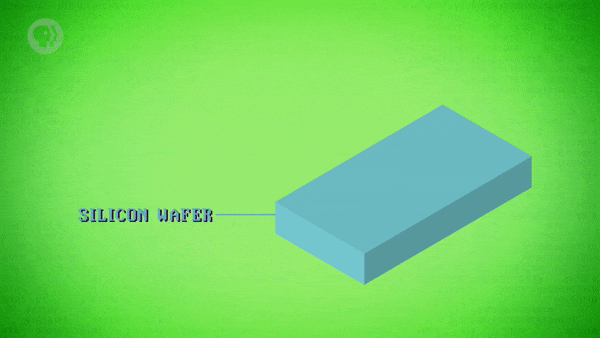

</details>

<details><summary>3. '포토레지스트(Photoresist)' 라는 특수 화학 물질을 추가한다.</summary>

- 빛에 노출되면 화학 변화가 일어나 용해되기 때문에 다른 특수 화학 물질로 씻어 낼 수 있다.

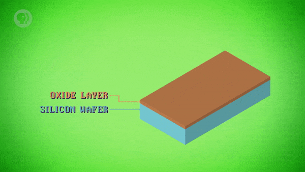

</details>

<details><summary>4. 포토레지스트 자체로는 큰 의미가 없으므로, '포토마스크(Photomask)' 를 추가한다.</summary>

- 포토마스크는 사진 필름과 거의 비슷한 역할을 한다고 볼 수 있다.
- 작은 부리토를 먹는 햄스터 대신 웨이퍼에 옮길 패턴이 들어 있다.

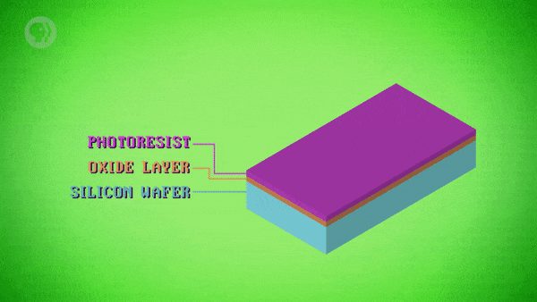

</details>

<details><summary>5. 포토마스크를 웨이퍼 위에 놓고 강력한 조명을 켠다.</summary>

- 포토마스크에 의해 빛이 차단된 부분은 변하지 않는다.
- 반대로, 빛에 노출된 부분에는 화학적인 변화가 일어난다.

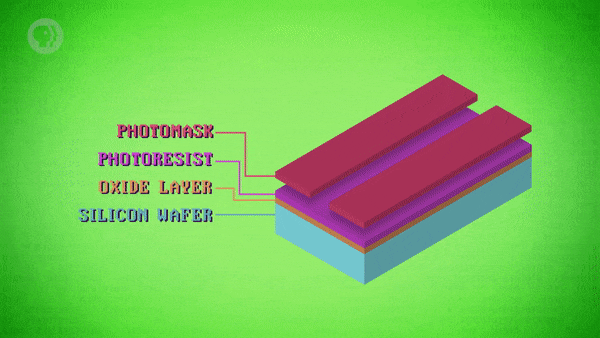

</details>

<details><summary>6. 빛에 노출된 부분만 씻어내, 산화물 층을 선택적으로 드러낸다.</summary>

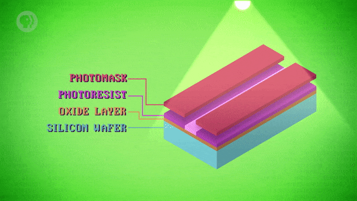

</details>

<details><summary>7. 또 다른 특수 화학 물질을 이용해 노출된 산화물을 제거한다.</summary>

- 이 과정에서 주로 사용되는 특수 화학 물질은 산(acid) 이다.
- 원재료인 실리콘까지 전체적으로 작은 구멍이 생기도록 식각한다.
- 이 때, 포토레지스트 아래의 산화물 층은 보호된 상태다.

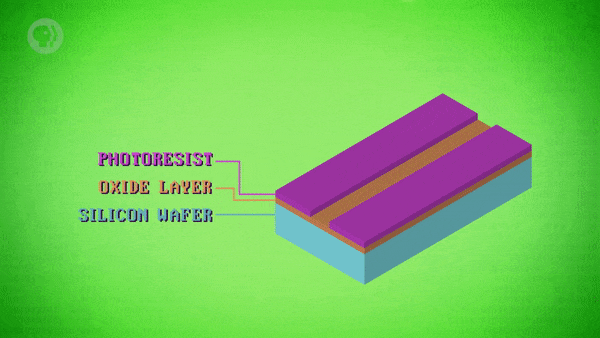

</details>

<details><summary>8. 남아있는 포토레지스트를 씻어내기 위해 또 다른 특수 화학 물질을 사용한다.</summary>

- 포토리소그래피에는 특정한 기능을 지닌 특수 화학 물질들이 많이 사용된다.

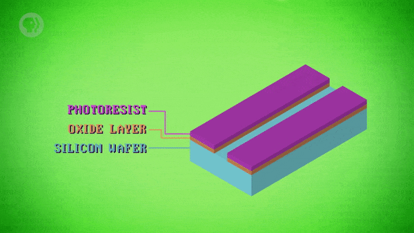

</details>

<details><summary>9. 노출된 실리콘에 전기가 더 잘 통하도록 도핑(doping) 이라는 과정을 통해 화학적 변화를 준다.</summary>

- 대부분의 경우에 '인(Phosphorus)' 과 같은 물질을 이용한다.
- 인을 고온 가스로 변환해 실리콘의 노출된 영역에 침투시킨다.
- 이러한 작업이 처리된 부분은 전기적인 특성이 바뀌게 된다.

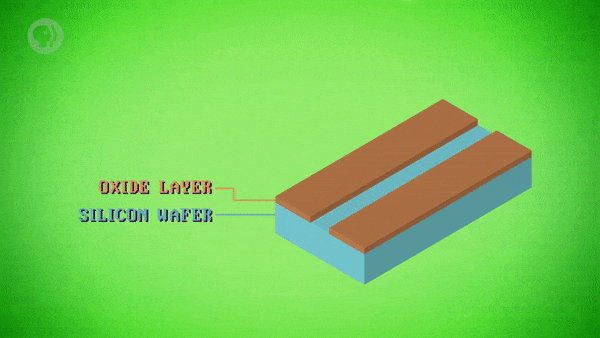

</details>

> #### 여기서 잠깐!
이 수업에서는 반도체의 물리학, 화학에 대해 다루지 않지만,  
만약 관심이 있다면, 아래의 링크를 참고하길 바란다.  
> - ['Veritasium의 Derek Muller가 만든 훌륭한 설명 영상'](https://www.youtube.com/watch?v=IcrBqCFLHIY)

## 5-2. 접합형 트랜지스터

트랜지스터를 만들기 위해서는 포토리소그래피를 여러 차례 진행해야 한다.

<details><summary>1. 포토레지스트로 코팅된 새로운 산화물 층을 만드는 것부터 다시 시작한다.</summary>

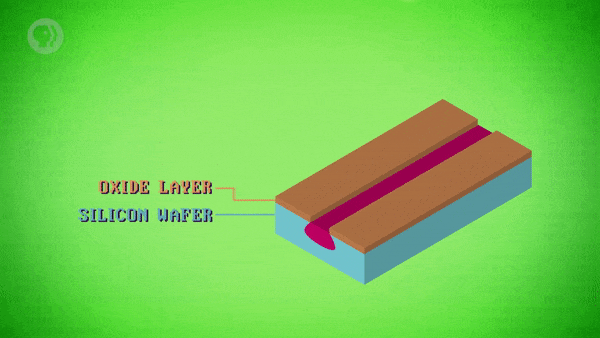

</details>

<details><summary>2. 다른 새로운 패턴의 포토마스크를 올린 후, 도핑된 영역 위에서 조명을 켠다.</summary>

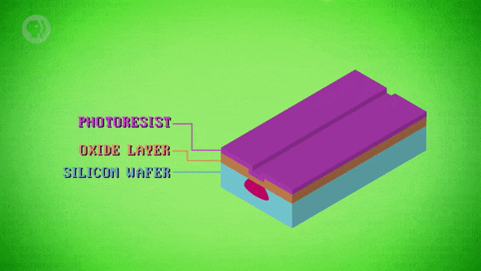

</details>

<details><summary>3. 다시 한 번, 남아있는 포토레지스트를 다시 씻어낸다.</summary>

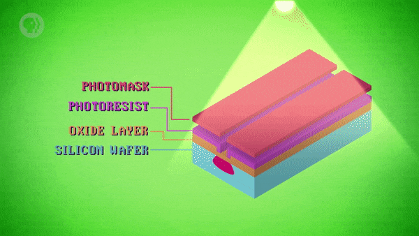

</details>

<details><summary>4. 실리콘 일부를 다른 형태로 변환하기 위해 다른 가스를 사용해 도핑한다.</summary>

- 이번에는 다른 영역 안에 중첩된 작은 영역만 도핑해야 한다.
- 포토리소그래피에서는 타이밍이 매우 중요하다.
- 도핑의 확산(diffusion) 및 식각의 깊이 등을 제어해야 하기 때문이다.
- 이제, 트랜지스터를 만드는 데 필요한 모든 부품이 준비되었다.

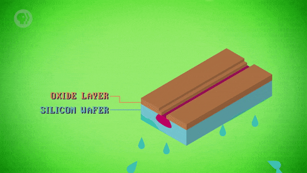

</details>

<br>

마지막 단계는 산화물 층에 통로를 만드는 것이다.

> 트랜지스터의 다른 부분에 작은 금속 전선을 연결하기 위해서다.

<details><summary>1. 다시 한 번, 포토레지스트를 덮고 새로운 포토마스크를 사용해 작은 통로를 식각한다.</summary>

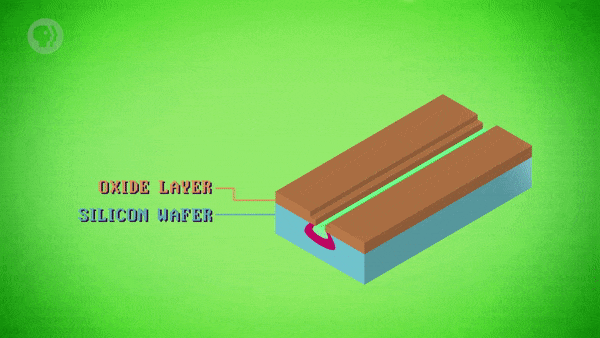

</details>

<details><summary>2. 이번에는 금속화(metalization) 라는 새로운 절차를 진행한다.</summary>

- 알루미늄, 구리 등을 이용해 얇은 금속층을 증착한다.

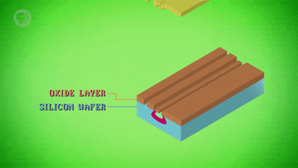

</details>

<details><summary>3. 전체를 금속으로 덮는 것이 아니라, 아주 구체적인 회로 설계를 식각해야 한다.</summary>

- 따라서, 이전과 매우 유사한 절차들을 한 번 더 반복한다.
```
포토레지스트 적용 -> 포토마스크 추가 -> 노출된 영역 용해 -> 노출된 금속 제거
```

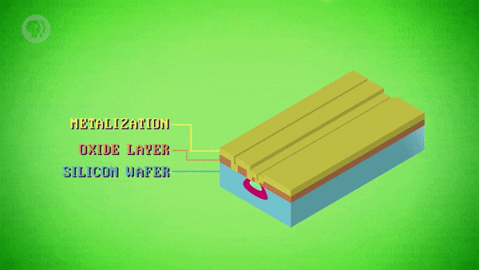

</details>

<br>

<details><summary>이렇게 완성된 것을 '접합형 트랜지스터(Bipolar Junction Transistor)' 라고 부른다.</summary>

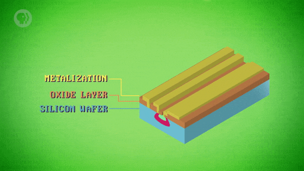

</details>

- 서로 다른 세 부분에 연결되는 작은 전선들이 포함되어 있다.
- 각 부분은 서로 다른 방식의 도핑이 적용되어 만들어졌다.
- 이 트랜지스터는 양극성 접합 트랜지스터라고 불리기도 한다.
- <details><summary>1962년에 실제로 특허를 냈고, 이 발명은 세상을 영원히 바꿔놓았다.</summary>

  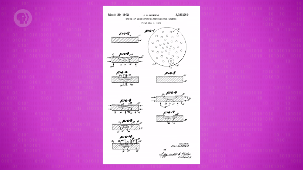

  </details>

## 5-3. 응용 및 활용

포토리소그래피를 통해 저항기, 축전기 등 다른 유용한 전자 요소들을 만들 수도 있다.

- 위의 예시와 유사한 절차들을 거치되, 조금씩 변화를 주면 된다.
- 여러 개의 전자 요소들을 단일 실리콘 조각에 만들 수도 있다.
- 게다가, 회로 연결에 필요한 모든 전선도 포함하도록 구성할 수 있다.
- 따라서, 이산 구성 요소를 이용하지 않고도 복잡한 회로를 구성할 수 있다.

<br>

<details><summary>예시에서 살펴본 포토마스크에는 하나의 트랜지스터만 표시되어 있었다.</summary>


</details>

- 실제로는 수백만 개의 작은 세부 사항들이 한 번에 표시되어 있다.
- 여러 전선이 서로 위아래로 교차하여, 모든 개별 요소들을 연결한다.

<br>

<details><summary>실제로는 원하는 크기로 빛을 투사할 수 있다는 이점을 활용하기도 한다.</summary>

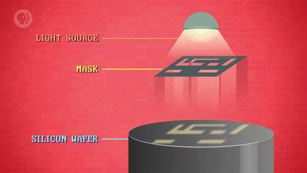

</details>

- 영화관에서 전체 화면을 채우기 위해 필름을 투사하는 것과 같은 방식이다.
- 웨이퍼 전체가 아니라 아주 작은 실리콘 조각에 빛의 초점을 맞추는 것이다.
- 포토마스크에 표시된 어떤 세부 정보라도 웨이퍼에 기록할 수 있다.

<br>

<details><summary>하나의 실리콘 웨이퍼는 일반적으로 수십 개의 집적 회로를 만드는 데 사용된다.</summary>


</details>

- 전체 웨이퍼가 가득 차면, 각 부분을 잘라내어 마이크로 칩으로 포장한다.
- 전자 제품에서 항상 볼 수 있는 작고 검은 사각형 부품이 바로 마이크로 칩이다.
- 이런 마이크로 칩의 핵심은 이렇게 만들어진 작은 실리콘 조각이다.

# 6. 무어의 법칙

포토리소그래피 기술이 발전하면서, 트랜지스터의 크기는 줄어들고, 밀도는 높아졌다.

- 1960년대 초반의 집적 회로는 5개 이상의 트랜지스터를 포함하는 경우가 거의 없었다.  
   - 당시에는, 절대로 불가능한 수준이었다.
- 1960년대 중반, 100개가 넘는 트랜지스터를 포함하는 집적 회로가 시장에 나오기 시작했다.

<br>

1965년, 'Gordon Moore' 는 기술 발전의 동향을 볼 수 있었다.

> "재료와 제조의 발전 덕분에 약 2년마다 같은 공간에 두 배의 트랜지스터를 장착할 수 있습니다."

- 이것을 **'무어의 법칙(Moore's Law)'** 이라고 한다.
- 이런 추세와 함께, 집적 회로의 가격도 내려갔다.
```
$50(1962년 평균) => $2(1968년 평균) => cent(오늘날)
```

<details><summary>참고 : 위키피디아에 기록되어 있는 내용</summary>

>
The complexity for minimum component costs has increased at a rate of roughly a factor of two per year. Certainly over the short term this rate can be expected to continue, if not to increase. Over the longer term, the rate of increase is a bit more uncertain, although there is no reason to believe it will not remain nearly constant for at least 10 years
><hr>
>
최소 구성 요소 비용의 복잡성은 연간 약 2배의 속도로 증가했다. 확실히 단기적으로 이 비율은 증가하지 않더라도 계속될 것으로 예상할 수 있다. 장기적으로 증가율은 조금 더 불확실하지만, 적어도 10년 동안 거의 일정하지 않을 것이라고 믿을 이유는 없다.

</details>

# 7. 마이크로프로세서

더 작은 트랜지스터와 더 높은 밀도는 다른 이점도 가지고 있다.

- 트랜지스터가 작을수록 더 적은 전하를 이동해야 하는 거리가 줄어든다.
- 따라서, 더 적은 전력을 소비하면서, 훨씬 더 빠르게 상태를 전환할 수 있다.
- 게다가, 크기가 줄어들수록 전기 신호 지연도 줄어들어, 클럭 속도도 빨라진다.

<br>


1968년, 노이스와 무어는 새로운 회사를 설립했다.

- '통합(Integrated)' 과 '전기(Electronics)' 를 결합했다.
- 이렇게, '인텔(Intel)' 이라는 이름의 회사가 탄생하게 되었다
- 오늘날 세계에서 가장 큰 컴퓨터 칩 제조사, 그 인텔이 맞다.

<br>

이후 인텔에서 출시한 CPU인 'Intel 4004' 는 중요한 이정표였다.

- ['7. 중앙 처리 장치 (CPU)'](/Crash-Course/7.-중앙-처리-장치-(cpu)),
  ['8. 명령어와 프로그램'](/Crash-Course/8.-명령어와-프로그램)
  에서 등장했다.
- 1971년에 출시되었으며, 집적 회로로 구성된 최초의 프로세서다.
- 크기가 매우 작아서, **'마이크로프로세서(Microprocessor)'** 라고 불렸다.
- 작은 크기에도 불구하고 약 2,300개의 트랜지스터를 포함하고 있었다.

<br>

사람들은 전체 CPU를 하나의 칩에 통합하는 기술 수준에 놀라움을 금치 못했다.

- 불과 20년 전만 해도 전체 공간을 이산 구성 요소로 가득 채웠을 것이기 때문이다.
- 이러한 집적 회로, 특히 마이크로프로세서는 3번째 컴퓨팅 세대를 이끌었다.

# 8. 집적 회로의 발전

이러한 기술의 발전 속에서 'Intel 4004' 는 단지, 시작에 불과했다.

- CPU에 포함되는 트랜지스터의 수가 폭발적으로 증가했다.
- 아래는 단일 CPU에 포함된 트랜지스터의 수를 연대별로 정리한 것이다.
```
~ 1980 :        30,000 ~
~ 1990 :     1,000,000 ~
~ 2000 :    30,000,000 ~
~ 2010 : 1,000,000,000 ~
```
- 이 밀도를 달성하기 위해 포토리소그래피의 최고 해상도는 지속해서 발전했다.
```
from : 약 1만 나노미터 (인간의 머리카락 두께의 약 1/10에 해당)
to   : 약 14나노미터 (적혈구보다 400배 이상 작은 크기에 해당)
```
- 물론, 이러한 발전은 CPU뿐만 아니라 다른 요소들에도 영향을 끼쳤다.
   - 대부분의 전자 제품들은 본질적으로 기하급수적인 발전을 이뤘다.
> RAM, 그래픽 카드, SSD, HDD, 카메라 센서 등등

<br>

<details><summary>클릭하여, 오늘날에 존재하는 실제 프로세서를 살펴보자.</summary>

- iPhone 7의 A10 CPU 칩이다.
- 약 3억 3천만 개의 트랜지스터가 1cm * 1cm 크기의 집적 회로에 장착되어 있다.  
  `(와! CPU! 우표보다 작다!)`

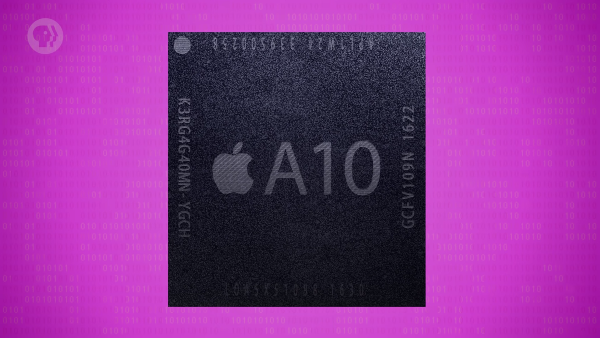

</details>

# 9. 초고밀도 집적 회로

현대 공학자들은 CPU를 설계할 때, 트랜지스터를 하나씩 배치하지 않는다.
 
> 인간이 손수 작업하기에는 불가능할 정도로 복잡해졌기 때문이다.

<br>

1970년대부터는 **'초고밀도 집적 회로(VLSI)'** 소프트웨어가 사용되었다.

> Very-Large-Scale-Integration (circuit)

- 가능한 가장 효율적인 방식으로 회로를 생성하여, 컴퓨터 프로세서 칩을 자동으로 설계한다.
- 높은 수준의 구성 요소를 배치하는 **'논리 합성(Logic Synthesis)'** 과 같은 기술을 사용한다.

<br>

많은 사람이 이런 초고밀도 집적 회로를 4세대 컴퓨터의 시작이라고 생각한다.

# 10. 소형화에 관하여,

안타깝게도 전문가들은 수십 년 동안 무어의 법칙의 종말을 예측해왔다.

> 그리고 우리는 결국, 그 종말에 점점 더 가까워 질 것이다.

<br>

소형화(Miniaturization) 의 발전을 방해하는 두 가지 중요한 문제가 있다.

1. 포토마스크와 웨이퍼에 회로의 특징을 얼마나 미세하게 만들 수 있는지에 대한 한계
   - 이는 포토리소그래피에 사용되는 빛의 파장으로 인해 발생한다.
   - 이에 대응하여, 과학자들은 더 작은 파장을 가진 광원을 개발해왔다.
2. 트랜지스터의 소형화로 발생할 수 있는 **'양자 터널링(Quantum Tunneling)'** 현상
   - 전극이 수십 개의 원자에 의해서만 분리될 정도로 아주 작아지면 발생할 수 있다.
   - 전자들이 각 전극을 구분 짓는 영역의 사이(gap) 를 뛰어넘으면 발생하는 문제다.
   - 이렇게, 전류를 누출하는 트랜지스터는 스위치 역할을 제대로 할 수 없게 된다.  
     `(명확한 상태 구분이 되지 않기 때문)`

<br>

그럼에도 불구하고, 과학자와 공학자는 이러한 문제를 해결하기 위해 노력하고 있다.

- 1나노미터 크기의 트랜지스터가 구현 가능하다는 것이 연구실에서 입증되었다.
- 이 기술이 상업적으로 실현 가능할지에 대해서는 여전히 수수께끼로 남아 있다.

<br>

하지만, 미래에는 이런 문제들을 해결할 수 있을 것이다.


# 배운 점, 느낀 점

수많은 이산 구성 요소들을 전선과 납땜으로 연결하던 초기의 전자 컴퓨터가  
작고 강력한 초고밀도 집적 회로를 사용하는 현대 컴퓨터가 되기까지의 내용을 배웠다.

포토리소그래피라는 반도체 제조 공정의 기본 절차와 원리에 대해 배웠다.

반도체 장비 정비 일을 할 때는 몰랐던 것들을 배워서 감회가 새로웠다.  
`(유독 가스 조심하고, 더미 웨이퍼 깨뜨리지 말고.. 와는 전혀 다른 세상임을 깨달았다.)`

## 1.

- 복잡한 회로를 구성하기 위해 전선과 납땜으로 연결되었던 이산 구성 요소
- 성능을 높일수록 부품, 전선 등의 구성이 복잡해지는 문제인 숫자의 횡포
- 진공관을 트랜지스터로 대체해 성능, 비용 측면을 개선한 트랜지스터 컴퓨터
- 컴퓨터를 구성하는 많은 이산 구성 요소들을 단일 구성 요소로 통합한 집적 회로
- 실제 전선 대신에 회로가 식각된 배선판으로 각 부품을 연결하는 인쇄 회로 기판

<br>

부품의 수와 함께 전선과 납땜의 수도 늘어나야 했던 당시의 문제에 대해 공감할 수 있었고,  
기술이 발전하기 이전에, 성능을 높이기 위해 기계의 크기가 커져야 했던 이유를 알게됐다.

진공관을 트랜지스터로 대체했음에도, 초기에는 여전히 전선과 납땜이 필요했다는 것을 알게됐다.

구성 요소가 늘어나면서 커지는 복잡성을 줄이기 위해 집적 회로를 사용했다는 것을 알게됐다.

전자 기계 안에 들어있던 녹색 판을 인쇄 회로 기판이라고 부른다는 것을 알게됐고,  
덕분에 전선을 이용하지 않고도 여러 부품들을 연결할 수 있게 되었다는 것을 배웠다.

## 2.

- 복잡한 회로 설계를 반도체 물질에 직접 옮기는 제조 공정인 포토리소그래피
- 하나의 반도체 물질에 3가지 전기적 특성이 공존하는 접합형 트랜지스터
- 기술의 발전에 따른 반도체 회로의 정밀도 추세를 예측한 내용인 무어의 법칙
- 전체 CPU 구성을 하나의 집적 회로에 통합한 프로세서인 마이크로프로세서

<br>

포토리소그래피가 실리콘 조각을 트랜지스터로 만드는 공정이라는 것을 배웠고,  
포토레지스트, 포토마스크 등 다양한 특수 화학 물질들의 역할에 대해 알게됐다.

실리콘 조각의 특정 부분에 도핑을 하여, 전기적 성질을 바꿀 수 있다는 것과,  
변화된 각 부분을 전선으로 연결한 것이 접합형 트랜지스터라는 것을 알게됐다.

포토리소그래피 공정으로 여러 전자 요소들을 만들 수 있다는 것과  
웨이퍼 한 장으로도 여러 개의 집적 회로를 만들 수 있다는 것을 알게됐다.

무어의 법칙이 반도체 산업에서 목표를 설정하는 데 사용된다는 것을 알게됐다.

'Intel 4004' 가 등장하기까지 있었던 기술적 문제와 발전을 보고,  
하나의 칩에 전체 CPU를 통합하는 기술이 얼마나 혁신이었는지 깨달았다.

## 3.

- 인간이 손수 작업하기 불가능할 정도의 정밀도를 지니는 초고밀도 집적 회로
- 트랜지스터의 소형화를 방해하는 양자 터널링 등의 현실적인 문제들

<br>

초고밀도 집적 회로가 사람이 직접 설계할 수 없을 정도로 정밀한 집적 회로라는 것을 알게됐다.

전자가 전극을 구분 짓는 영역을 통과하는 현상을 양자 터널링이라 부른다는 것과  
트랜지스터가 작아질수록 이런 현상이 더 쉽게 일어날 수 있다는 것을 알게됐다.

집적 회로의 소형화의 발전은 현실적인 한계에 부딪히고 있고,  
그것을 극복하기 위해 많은 노력이 진행 중이라는 것을 알게됐다.

(해당 글의 작성 과정은 
[post/crash-course/17 (#108)](https://github.com/ensia96/ensia96.github.io/pull/108)
에서 확인하실 수 있습니다.)
