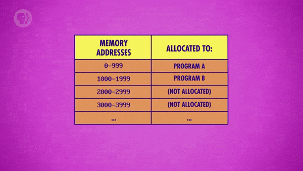
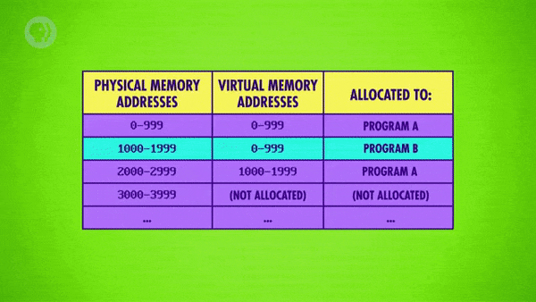
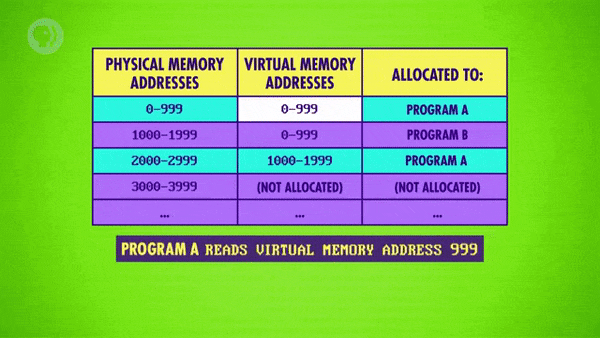

>
해당 포스트는 
Youtube 채널
<a href='https://www.youtube.com/channel/UCX6b17PVsYBQ0ip5gyeme-Q' target='-blank'>'Crash Course'</a>
에서 제공하는 
<a href='https://www.youtube.com/playlist?list=PL8dPuuaLjXtNlUrzyH5r6jN9ulIgZBpdo' target='-blank'>'Computer Science'</a>
수업을 바탕으로 작성되었습니다.  
( 사진 속 인물은
<a href='https://about.me/carrieannephilbin' target='-blank'>'Carrie Anne Philbin'</a>
선생님 입니다! )

# 0. 시작하기에 앞서,

1940년대에서 50년대 초반까지의 컴퓨터는 프로그램을 한 번에 하나씩 실행했다.

- 당시, 프로그래머는 책상에서 천공 카드 등을 이용해 프로그램을 작성했다.
- 이후, 작성된 프로그램을 컴퓨터 장치들로 가득 차있는 방으로 가져갔다.
- 그리고, 전담 컴퓨터 운영자(computer operator) 에게 프로그램을 전달했다.
- 컴퓨터가 작업을 수행할 수 있을 때, 운영자는 컴퓨터에 프로그램을 공급했다.
- 그러면, 컴퓨터는 프로그램을 실행하고 일부 출력을 낸 뒤에 정지(halt) 했다.

<br>

이러한 수동적인 절차는 컴퓨터가 느렸을 때는 문제가 없었다.

> 보통, 프로그램을 실행하는 데 몇 시간, 며칠, 심지어 몇 주가 걸렸다.

<br>

하지만, 지난 수업에서 살펴봤듯 컴퓨터의 속도는 기하급수적으로 빨라졌고,  
곧, 프로그램을 실행하는 것보다 수동으로 삽입하는 것이 더 오래 걸리게 되었다.

우리는 컴퓨터가 스스로 작동하도록 하는 방법이 필요했고,  
그렇게 **'운영 체제(Operating System)'** 가 탄생하게 되었다.

# 1. 운영 체제와 일괄 처리

운영 체제 또는 OS는 평범한 프로그램이다.

- 하지만, 하드웨어에 대한 특별한 권한을 통해 다른 프로그램을 실행/관리할 수 있다.
- 보통, 컴퓨터를 켤 때 가장 먼저 시작되며, 이후의 프로그램들은 OS에 의해 시작된다.

<br>

OS는 컴퓨터의 성능이 강력해지고 더 널리 보급되기 시작한 1950년대에 처음 등장했으며,  
최초의 운영 체제는 프로그램을 수동으로 로드하는 일상적인 작업을 보강하는 역할을 했다.

- 컴퓨터에 한 번에 하나가 아닌 여러 개의 프로그램을 제공할 수 있었다.
- 컴퓨터는 하나의 작업을 완료하는 즉시 다음 작업을 자동으로 시작했다.
- 덕분에 다음에 실행할 프로그램을 찾는 동안 발생했던 휴동 시간이 사라졌다.

<br>

이렇게, 컴퓨터 스스로 작업을 수행하는 것을 **'일괄 처리(Batch Processing)'** 라고 한다.

# 2. 주변기기와 입출력

컴퓨터의 속도가 빨라지는 동안 가격 또한 저렴해졌다.

- 덕분에, 전 세계 곳곳, 특히 대학과 관공서에서 사용되기 시작했다.
- 사용자가 늘면서, 사람들 사이에선 소프트웨어가 공유되기 시작했다.

<br>

일회성 컴퓨터가 사용되던 시대가 지나가면서, 문제가 하나 생겼다.

- 'Harvard Mark I', 'ENIAC' 등 하나의 기계에 대한 코드만 작성하면 됐다.
- 프로세서, 천공 카드 판독기, 프린터는 알려진 상태에서 잘 변하지 않았다.
- 하지만, 컴퓨터가 점점 더 널리 보급되면서 구성이 달라지는 경우가 생겼다.
> 동일한 CPU를 사용하지만, 프린터 등의 장치는 다른 것을 사용하는 등

<br>

이러한 문제는 프로그래머에게는 커다란 고통이었다.

- 프로그램뿐만 아니라, 모든 장치에 접속하는 방법까지 신경 써야 했다.
- 프린터 등, **'주변기기(Peripherals)'** 의 모든 모델을 고려해야 했다.

<br>

초기의 주변기기에 접속하는 것은 매우 낮은 수준으로 진행되었다.

- 각 장치에 대한 하드웨어 세부 정보를 자세하게 알고 있어야 할 정도였다.
- 프로그래머는 주변기기의 모든 모델에 대해 코드를 시험해볼 수도 없었다.
- 그래서 보통, 설명서만 읽은 상태에서 최대한 열심히 코드를 작성해야 했다.
- 작성한 코드를 공유한 후에 코드가 동작하길 간절히 기도할 수밖에 없었다.

<br>

운영 체제는 이러한 끔찍한 문제의 해결책이 되었다.

- 운영 체제는 프로그램(소프트웨어) 과 주변기기(하드웨어) 사이의 매개체로 구현되었다.
- 정확하게는, **'장치 드라이버(Device Drivers)'** 라는 추상화 소프트웨어를 제공했다.
- 덕분에 프로그래머가 표준화된 메커니즘으로 하드웨어와 소통할 수 있게 되었다.
- 이러한 하드웨어와의 상호작용을 **'입출력(Input & Output, I/O)'** 이라고 한다.

> #### 예를 들어,
프로그래머가 print(highscore) 와 같은 함수를 호출하면,  
운영 체제는 그 내용을 종이에 옮기기 위해 여러 작업을 수행한다.

# 3. 스케줄링과 다중작업

1950년대 말, 컴퓨터의 속도는 이전보다 훨씬 빨라졌다.

- 프린터, 천공 카드 판독기 등의 입출력 장치들을 기다려야 할 정도였다.
- 값비싼 프로세서는 입출력 중에 아무것도 하지 않고 대기 상태가 되었다.

<br>

50년대 후반, 영국의 맨체스터 대학은 슈퍼컴퓨터를 만들기 시작했다.

- 그것은 세계 최초의 슈퍼컴퓨터 중 하나인 **'아틀라스(Atlas)'** 였다.
- 그들은 프로세서가 입출력 과정에서 대기 상태가 되는 것을 알고 있었다.
- 그래서, 프로세서를 최대한 활용할 수 있는 방법에 관해 연구했다.

<br>

그들은 새로운 운영 체제를 만들어서 이를 해결하고자 했다.

- **'Atlas Supervisor'** 라고 불리는 프로그램이었고, 1962년에 완성되었다.
- 초기의 일괄 처리 체계(batch system) 처럼 프로그램을 자동으로 로드할 수 있었다.
- **'스케줄링(scheduling)'** 을 통해 단일 CPU에서 여러 프로그램을 동시에 실행했다.

<br>

<details><summary>아틀라스가 실행 중인 프로그램에서 print(highscore) 라는 함수를 호출한다고 가정해 보자.</summary>

- print(highscore) 는 'highscore' 라는 변수의 값을 종이에 인쇄하도록 지시하는 함수다.
- 프린터(기계식) 는 CPU(전자) 에 비해 느리므로, 수천 클럭 주기에 해당하는 시간이 걸린다.

```
┌------- Atlas --------┐
| ┌--- Program A ----┐ |
| | print(highscore) | |
| | status:  running | | ┌-- printer --┐
| | (wating for I/O) | |-|  highscore  |
| └------------------┘ | └-------------┘
| ┌--- Program B ----┐ |
| | status:   ready  | |
| └------------------┘ |
└----------------------┘
```

</details>

<details><summary>이 때, 아틀라스는 입출력 작업이 완료될 때까지 기다리지 않는다.</summary>

- 대신, 입출력 작업을 수행 중인 프로그램을 절전 상태로 전환한다.
- 그리고, 실행 준비 상태의 다른 대기 프로그램을 선택해 실행한다.

```
┌------- Atlas --------┐
| ┌--- Program A ----┐ |
| | print(highscore) | |
| | status:   sleep  | | ┌-- printer --┐
| | (wating for I/O) | |-|  (printing) |
| └------------------┘ | └-------------┘
| ┌--- Program B ----┐ |
| | status:  running | |
| └------------------┘ |
└----------------------┘
```

</details>

<details><summary>작업을 마친 프린터는 아틀라스에 'highscore' 값의 인쇄를 완료했다고 보고한다.</summary>

- 그러면, 아틀라스는 프로그램을 다시 실행 준비 상태로 표시한다.
- 이후의 어느 시점이 되면 CPU에서 다시 실행될 수 있도록 예약된다.
- 프로그램은 print() 문장 다음에 나오는 다음 줄의 코드로 계속된다.

```
┌------- Atlas --------┐
| ┌--- Program A ----┐ |
| |  [another code]  | |
| | status:   ready  | | ┌-- printer --┐
| |  (finished I/O)  | |-|   (done)    |
| └------------------┘ | └-------------┘
| ┌--- Program B ----┐ |
| | status:  running | |
| └------------------┘ |
└----------------------┘
```

</details>

<details><summary>이런 식으로 아틀라스는 하나의 CPU에서 여러 프로그램을 동시에 실행할 수 있다.</summary>

- 프로그램 A : CPU는 계산을 실행한다.
- 프로그램 B : 프린터로 정보를 인쇄한다.
- 프로그램 C : 천공 테이프에서 정보를 읽는다.

```
┌------- Atlas --------┐
| ┌--- Program A ----┐ |
| |   (calculate)    | |
| | status:   ready  | | ┌-- printer --┐
| | (wating for I/O) | |-|  (printing) |
| └------------------┘ | └-------------┘
| ┌--- Program B ----┐ |
| | status:   sleep  | | ┌-- reader ---┐
| | (wating for I/O) | |-| (read data) |
| └------------------┘ | └-------------┘
| ┌--- Program C ----┐ |
| | status:   sleep  | |
| | (wating for I/O) | |
| └------------------┘ |
└----------------------┘
```

</details>

<br>

아틀라스를 만든 공학자들은 이러한 스케줄링의 아이디어를 2배로 확장했다.

- 아래의 주변기기와 구성 요소를 컴퓨터에 장착했다.
> 4개의 판독기, 4개의 천공기, 최대 8개의 자기 테이프 드라이브
- 많은 프로그램을 단일 CPU에서 한 번에(동시에) 진행할 수 있게 되었다.
- 운영 체제의 이러한 능력을 **'다중작업(Multitasking)'** 이라고 한다.

# 4. 가상 메모리

하지만, 한 대의 컴퓨터에서 여러 프로그램을 동시에 실행하는 것에는 큰 문제가 있었다.

- 컴퓨터에서 실행해야 하는 프로그램마다 약간의 메모리가 필요하다.
- 다른 프로그램으로 전환할 때 해당 프로그램의 정보를 잃을 수 있다.
- 이것은 각 프로그램에 자체 메모리 블록을 할당하여 해결할 수 있었다.

<br>

<details><summary>예를 들어, 컴퓨터에 총 10,000개의 메모리 위치가 있다고 가정해 보자.</summary>

- 프로그램 A는 (0 ~ 999) 의 메모리 주소를 할당받을 수 있다.
- 프로그램 B는 (1000 ~ 1999) 의 메모리 주소를 할당받을 수 있다.

</details>

<details><summary>프로그램이 더 많은 메모리를 요청하면, 운영 체제는 어떠한 결정을 내린다.</summary>

- 운영 체제는 해당 요청을 허용할 수 있는지를 결정한다.
- 요청을 허용할 경우, 다음에 할당할 메모리 블록을 결정한다.

</details>

<details><summary>이러한 유연성(flexibility) 은 훌륭하지만, 단점이 있다.</summary>

- 프로그램 A에 비순차적(non-sequential) 메모리 블록이 할당될 수 있다.
- 예를 들어, (0 ~ 999) 의 주소와 (2000 ~ 2999) 의 주소에 할당되는 것이다.



</details>

<br>

위에서 살펴본 것은 단순한 예시에 불과하다.

- 실제 프로그램은 메모리 전체에 걸쳐, 수십 개의 블록이 할당될 수 있다.
- 예상할 수 있듯, 이것은 프로그래머가 추적하기에 정말 혼란스러울 것이다

<br>

매출에 대한 정보를 길게 나열한 목록이 있다고 가정해 보자.

- 이 목록은 하루가 끝날 때 특정 프로그램에 의해 합산된다.
- 하지만, 이 목록은 여러 메모리 블록으로 나뉘어 저장된다.

<br>

이러한 복잡성을 감추기 위해 운영 체제는 메모리 위치를 가상화한다.

- 이렇게 메모리 위치를 가상화하는 기법을 **'가상 메모리(Virtual Memory)'** 라고 한다.
- 가상 메모리를 사용하면, 프로그램은 메모리가 항상 주소 0에서 시작한다고 가정하게 된다.
- 이 때, 컴퓨터 메모리의 실제(물리적) 위치는 운영 체제에 의해 감춰지고 추상화된다.
- 따라서, 작업에 필요한 정보들을 간단하고 일관되게 유지할 수 있다.

# 5. 동적 메모리 할당

<details><summary>위에서 살펴봤던 예시의 프로그램 B를 다시 살펴보자.</summary>



</details>

- (1000 ~ 1999) 의 주소에 해당하는 메모리 블록이 할당되어 있다.
- 프로그램 B의 입장에서, 이것은 (0 ~ 999) 의 블록으로 보인다.
- 운영 체제와 CPU는 가상 메모리와 실제 메모리를 자동으로 연결한다.
- 따라서, 프로그램 B가 메모리 위치 '42' 를 요청하면 실제로는 1042번 주소를 읽는다.

<br>

<details><summary>이런 가상 메모리는 프로그램 A에도 적용할 수 있다.</summary>



</details>

- 마찬가지로, 프로그램 A도 실제 메모리 주소를 볼 수 없다.
- 2,000개의 주소를 가진 연속적인 블록이 할당된 것으로 보인다.
- 프로그램 A가 메모리 위치 '999' 를 요청하면 실제로는 999번 주소를 읽는다.
   - 이렇게, 가상 메모리 주소와 실제 메모리 주소가 우연히 일치하기도 한다.
- 하지만, 바로 다음 메모리 위치인 '1000' 을 요청하면 실제로는 2000번 주소를 읽는다.

<br>

이러한 메커니즘을 통해 프로그램은 유연한 메모리 크기를 가질 수 있다.

- 이런 기법을 **'동적 메모리 할당(Dynamic Memory Allocation)'** 이라고 한다.
- 프로그램에서는 메모리 블록들이 연속적인 형태로 단순화되어 보이게 된다.
- 운영 체제가 여러 프로그램을 동시에 실행할 때 엄청난 유연성을 제공한다.

# 6. 메모리 보호

각 프로그램에 자체 메모리를 할당하는 것에는 또 다른 장점이 있다.

- 바로, 각 프로그램이 서로 다른 프로그램으로부터 더 잘 격리된다는 것이다.
- 따라서, 버그가 있는 프로그램이 잘못되어도 자체 메모리만 폐기하면 된다.
- 이 때, 다른 프로그램의 메모리는 전혀 영향을 받지 않게 된다.
- 이러한 기능을 **'메모리 보호(Memory Protection)'** 라고 한다.

<br>

바이러스와 같은 악성 소프트웨어로부터 프로그램을 보호하는 데에도 매우 유용하다.

- 이메일에 관련된 메모리를 읽거나 수정할 수 있는 악성 코드가 있다고 가정한다.
- 이 때, 악성 코드가 사용자를 대신해서 이메일을 보내고, 개인 정보를 훔칠 수 있다.
- 보통의 경우에, 이런 상황이 발생한다면 크게 문제가 될 수도 있을 것이다.
- 하지만, 메모리 보호 기능을 활용해 이런 방식의 메모리 접근을 차단할 수 있다.

<br>

> 아틀라스는 가상 메모리와 메모리 보호 기능을 모두 지원하는 최초의 컴퓨터, 운영 체제였다.

# 7. 단말기와 시분할 시스템

1970년대에는 컴퓨터가 적당히 빠르면서 저렴했다.

- 대학과 같은 기관에서는 컴퓨터를 구매해, 학생들에게 제공하기도 했다.
- 당시의 컴퓨터는 한 번에 여러 프로그램을 실행할 수 있을 만큼 빨랐다.
- 또, 동시에 여러 사용자에게 대화식 접근(interactive access) 기능을 제공했다.

<br>

대화식 접근은 **'단말기(Terminal)'** 를 통해 이루어졌다.

- 큰 컴퓨터에 연결되는 장치이며, 키보드와 화면으로 구성되어 있다.
- 하지만, 단말기 자체에는 어떠한 처리 능력도 포함되어 있지 않다.
- 보통, 냉장고 크기의 컴퓨터에는 50개의 단말기가 연결될 수 있었다.
   - 덕분에, 최대 50명의 사용자가 사용할 수 있었다.

<br>

이렇게, 운영 체제는 여러 사용자의 작업을 처리할 필요가 있었다.

- 또, 컴퓨터의 모든 자원(프로세서, 메모리 등) 을 한 사람이 독차지하지 않도록 해야 했다.
- 따라서, **'시분할 시스템(Time-Sharing)'** 을 제공하는 운영 체제가 개발되었다.
- 시분할 시스템을 통해, 각 사용자는 컴퓨터 자원의 일부만 사용할 수 있었다.
- 당시 컴퓨터는 매우 빨랐기 때문에, 자원의 1/50로도 많은 작업을 완료할 수 있었다.

# 8. 멀틱스와 유닉스

초기 시분할 운영 체제 중 가장 영향력 있는 것은 **'멀틱스(Multics)'** 였다.

> Multiplexed Information and Computing Service

- 1969년에 출시된 멀틱스는 처음부터 안전하도록 설계된 최초의 주요 운영 체제였다.
- 개발자들은 장난스러운 사용자가 접근해선 안 되는 정보에 접근하는 것을 원하지 않았다.
   - 교수님의 계정으로 기말고사 정보에 접근하려는 학생 등을 예로 들 수 있다.

<br>

이러한 복잡한 기능을 구현한 멀틱스는 약 1메가비트(Megabit) 의 메모리를 사용했다.

- 이는 멀틱스가 당시 기준으로는 정말 복잡한 프로그램이었음을 의미했다.
- 운영 체제를 실행하는 데에만 컴퓨터 메모리의 절반을 사용하는 수준이었다.

<details><summary>멀틱스의 연구원 중 한 명인 'Dennis Ritchie' 는 말했다.</summary>

>
"One of the obvious things that went wrong with Multics as a commercial success  
was just that it was sort of over-engineered in a sense. There was just too much in it."  
\- Dennis Ritchie
><hr>
>
상업적 성공을 거둔 Multics의 잘못된 점 중 하나는  
그것이 어떤 의미에서는 과도하게 설계되었다는 것이다.  
그것의 내부에는 너무 많은 것들이 있었다.

</details>

<br>

데니스는 오버 엔지니어링으로 인한 멀틱스의 크기와 복잡성에 실망했다.

- 그래서, 그는 다른 멀틱스의 연구원인 'Ken Thompson' 과 함께 독립했다.
- 이후, **'유닉스(Unix)'** 라는 새롭고 간결한 운영 체제를 구축했다. `(?!)`

<br>

당시 데니스와 켄은 운영 체제를 두 부분으로 분리하고자 했다.

- 첫 번째는 운영 체제의 핵심 기능인 **'커널(Kernel)'** 이었다.
   - 메모리 관리, 다중작업, 입출력 처리와 같은 기능들을 포함한다.
- 두 번째는 커널에 포함되지 않고, 번들로 제공되는 다양한 도구들이었다.
   - 유용하게 사용될 수 있는 프로그램이나 라이브러리 등을 포함한다.

<br>

작고 간결한 커널을 구축하기 위해서는 일부 기능을 일부러 제외할 필요가 있었다.

<details><summary>또 다른 멀틱스의 개발자, 'Tom Van Vleck' 은 회상했다.</summary>

>
"I remarked to Dennis that easily half the code I was writing in Multics was error recovery code.  
He said, "We left all that stuff out. If there's an error, we have this routine called panic,  
and when it is called, the machine crashes, and you holler down the hall, 'Hey, reboot it.'""  
\- Tom Van Vleck
><hr>
>
나는 데니스에게 멀틱스에서 내가 작성한 코드의 절반이 오류 복구 코드라고 했다.  
그는 이렇게 대답했다.  
"우리는 그런 것들은 모두 빼버렸다. 오류가 발생하면, 패닉이라는 루틴을 이용한다.  
이 루틴이 호출되면 기계가 고장 난다. 그러면, 복도에 대고 '이봐, 재부팅 해' 라고 소리치면 된다."

</details>

- **'커널 패닉(Kernel Panic)'** 이라는 용어는 여기에서 유래되었다.
- 말 그대로, 커널이 충돌하면 복구할 수단이 없으니, 'panic' 기능을 호출하는 것이다.
- 원래는 'panic' 이라는 단어를 인쇄하고, 무한 루프에 들어가는 것이 전부였다.

<br>

이러한 단순성 덕분에, 유닉스는 더 저렴하고 다양한 하드웨어에서 실행될 수 있었다.

- 데니스와 켄이 일했던 벨 연구소(Bell Labs) 에서도 인기를 끌었다.
- 또, 더 많은 개발자가 유닉스를 이용해 새로운 프로그램을 만들기 시작했다.
   - 이후에는, 유닉스에 기여하는 도구들도 점점 늘어나기 시작했다.
- 1971년 출시 직후, 다양한 프로그래밍 언어용 컴파일러와 워드 프로세서를 확보했다.
- 덕분에, 1970년대와 80년대에 가장 인기 있는 운영 체제 중 하나가 될 수 있었다.

# 9. MS-DOS와 윈도우

1980년대 초의 기본 컴퓨터의 가격은 개인이 한 대를 살 수 있을 정도로 떨어졌다.

- 이런 컴퓨터를 개인/가정용 컴퓨터(personal or home computer) 라고 불렀다.
- 이는 대학, 기업, 정부에 있는 대형 중앙 컴퓨터(main frame) 보다 훨씬 단순했다.
- 따라서, 이런 개인용 컴퓨터의 운영 체제도 그만큼 단순해질 필요가 있었다.

<br>

단순한 운영 체제의 예시로는 **'마이크로소프트 디스크 운영 체제(MS-DOS)'** 를 들 수 있다.

> Microsoft Disk Operating System

- 용량은 160킬로바이트(KB), 이름에서 알 수 있듯 단일 디스크에 딱 저장되었다.
- 1981년에 처음 출시되었으며, 초기 가정용 컴퓨터에서 가장 인기 있는 운영 체제였다.

<br>

하지만 아쉽게도, 다중작업과 메모리 보호 등의 기능은 포함되어 있지 않았다. 

- 이는 프로그램이 시스템을 정기적으로 고장 낼 수 있다는 것을 의미했다.
- 컴퓨터를 껐다 켜는 것은 성가시긴 했지만 받아들일 만한 절충안이었다.

<br>

1985년에 처음 출시된 초기 버전의 'Windows' 도 비슷했다.

- 1990년대 내내 운영 체제 분야를 장악했음에도, 메모리 보호의 성능은 부족했다.
- 프로그램이 잘못 작동하면, '블루 스크린(Blue Screen)' 이 표시되기도 했다.
   - 블루 스크린은 프로그램이 너무 심하게 충돌해, 운영 체제 전체가 다운되었다는 신호다.
- 다행히, 최신 버전의 윈도우는 더 나은 메모리 보호 기능을 제공한다.
   - 일반적으로, 이전 버전보다는 충돌하는 경우가 많이 줄어들었다.

# 10. 운영 체제에 관하여,

오늘날의 컴퓨터에서는 최신 운영 체제를 실행한다.

> Mac OS X, Windows 10, Linux, iOS, Android 등

<br>

보통, 개인용 컴퓨터를 가장 자주 사용하는 사람은 바로 컴퓨터의 소유자다.

- 하지만, 운영 체제는 사용자가 단 한 명이더라도 여러 기능을 지원한다.
   - 다중작업, 가상 메모리, 메모리 보호 등
- 덕분에, 사용자들은 컴퓨터에서 여러 프로그램을 동시에 실행할 수 있다.
   - 웹 브라우저 사용, 유튜브 시청, 사진 편집, 음악 재생 등
- 이러한 혁신은 아래와 같은 요소들이 없었다면 불가능했을 것이다.
   - 운영 체제에 대한 수십 년간의 연구/개발
   - 여러 프로그램을 저장하기에 적합한 메모리

<br>

다음 수업에서는, 그중에서도 '여러 프로그램을 저장하기에 적합한 메모리' 에 대해 살펴볼 것이다.


<br>

**<작성 중인 글입니다.>**

**<아래 내용은 정리 중입니다.>**

# 배운 점, 느낀 점

운영 체제가 등장하기 전에는 프로그램을 하나씩 직접 입력해줘야 했다는 것을 알게됐고,  
컴퓨터가 자체적으로 프로그램을 실행할 수 있도록 하는 운영 체제의 다양한 기능을 배웠다.

서로 다른 특징을 지닌 다양한 운영 체제에 대해 알게됐다.

- 스케줄링, 다중작업, 가상 메모리, 메모리 보호를 지원했던 'Atlas Supervisor'
- 시분할 시스템을 적용했던 멀틱스와 작고 간결한 구성을 추구했던 유닉스
- 개인/가정용 컴퓨터의 등장과 함께 엄청난 인기를 끌었던 MS-DOS, 윈도우

## 1.

- 하드웨어에 대한 특별한 권한으로 다른 프로그램을 실행/관리하는 운영 체제
- 한 번에 여러 개의 프로그램을 입력받아, 자동으로 작업을 진행하는 일괄 처리
- 컴퓨터에 연결되어 입출력 등의 기능을 처리하는 부가적인 장치인 주변기기
- 소프트웨어와 하드웨어의 매개체 역할을 하는 추상화 소프트웨어인 장치 드라이버
- 표준화된 메커니즘을 통해 하드웨어와 상호작용하는 것을 뜻하는 입출력

## 2.

- 상태 관리를 통해 단일 CPU로도 여러 프로그램을 동시에 실행할 수 있게 하는 스케줄링
- 스케줄링을 통해 여러 작업을 동시에 수행하는 운영 체제의 기능을 뜻하는 다중작업
- 메모리 위치를 가상화하여 비순차적 메모리 블록의 복잡성을 추상화하는 가상 메모리
- 가상 메모리의 메커니즘으로 프로그램의 메모리 크기를 유연하게 관리하는 동적 메모리 할당
- 프로그램마다 자체 메모리를 할당하여 각 프로그램을 격리하는 기능인 메모리 보호
- 키보드와 화면을 이용해, 연결된 큰 컴퓨터와의 대화식 접근을 처리하는 단말기
- 대화식 접근 중, 컴퓨터의 전체 자원을 사용자마다 적절하게 분배하는 시분할 시스템

## 3.

- 처음부터 안전하도록 설계된 영향력 있는 초기 시분할 시스템 운영 체제 멀틱스
- 오류 복구를 패닉 기능으로 처리하는 커널과 여러 번들로 구성된 간결한 운영 체제 유닉스
- 주요 기능은 부실했지만, 개인/가정용 컴퓨터에 적합하여 인기가 많았던 운영 체제 MS-DOS
- 운영 체제 분야를 장악했지만, 메모리 보호의 성능이 여전히 부족했던 운영 체제 윈도우
