>
해당 포스트는 
Youtube 채널
<a href='https://www.youtube.com/channel/UCX6b17PVsYBQ0ip5gyeme-Q' target='-blank'>'Crash Course'</a>
에서 제공하는 
<a href='https://www.youtube.com/playlist?list=PL8dPuuaLjXtNlUrzyH5r6jN9ulIgZBpdo' target='-blank'>'Computer Science'</a>
수업을 바탕으로 작성되었습니다.  
( 사진 속 인물은
<a href='https://about.me/carrieannephilbin' target='-blank'>'Carrie Anne Philbin'</a>
선생님 입니다! )

# 0. 시작하기에 앞서,

지금까지의 수업에서는 컴퓨터 기억 장치에 관한 내용을 여러 번 다뤘다.

> <a href='/Crash-Course/6.-레지스터와-ram/' target='-blank'>'6. 레지스터와 RAM'</a>
  에서는 간단한 회로를 설계해보기도 했다.

- 일반적으로, 컴퓨터 기억 장치는 비영구적(non-permanent) 이다.
- 예를 들어, Xbox의 전원이 갑자기 꺼지면, 기억 장치에 저장된 모든 정보가 손실된다.
- 이러한 이유로 기억 장치를 '휘발성 메모리(volatile memory)' 라고 부른다.

 

반면에, **'저장 장치(storage)'** 에 대한 내용은 크게 다루지 않았다.

- 저장 장치는 기억 장치와는 약간 다른 특징을 지니고 있다.
- 기록된 정보는 덮어써 지거나 삭제되지 않는 한 그대로 유지된다.
- 하드 드라이브처럼 저장 장치는 '비휘발성 메모리(non-volatile memory)' 다.

 

이전까지, 휘발성 메모리는 빠르고, 비휘발성 저장 장치는 느린 편이었지만,  
컴퓨팅 기술이 향상되면서 이러한 차이는 줄어들었고, 용어들이 서로 섞이기 시작했다.

오늘날에는 USB 스틱처럼 기가바이트 크기를 저렴한 가격에 제공하고,  
장기간에 걸쳐 정보를 안정적으로 저장하는 기술들이 당연하게 여겨진다.

하지만, 저장 장치의 기술이 항상 이렇게 좋았던 것은 아니다.

# 1. 천공 카드

가장 초기의 컴퓨터 저장 장치는 종이로 된 **'천공 카드(Punch Card)'** 였다. 

- 천공 카드와 같은 원리의 '천공 테이프(Punch Tape)' 도 사용되곤 했다.
- 1940년대에는 주로, 80개의 열과 12개의 행으로 구성된 격자로 표준화되었다.
- 덕분에, 천공 카드는 한 장에 최대 960비트의 정보를 저장할 수 있었다.

 

천공 카드로 작성된 가장 큰 프로그램은 미군의 '반자동식 방공조직(SAGE)' 이다.

> Semi-Automatic Ground Environment (SAGE)

- <a href='/Crash-Course/2.-전자-컴퓨팅/#7-2-anfsq-7' target='-blank'>'2. 전자 컴퓨팅'</a>
  에서 간단하게 소개했었다.
- 1958년에 가동하기 시작한 방공 체계(Air Defense System) 다.
- 주요 프로그램을 저장하기 위해 총 62,500장의 천공 카드가 사용되었다.
- 이는 대략 5메가바이트에 해당하며, 오늘날의 스마트폰 사진 크기와 비슷하다.

 

천공 카드는 수십 년 동안 유용하고 인기 있는 저장 장치였다.

> 종이는 전력이 필요 없고, 저렴하며 내구성이 좋았기 때문이다.

 

하지만, 속도가 느리고, 한 번 뚫은 구멍을 다시 막을 수 없었다.

- 이렇게 바꿔쓰기나 지우기가 되지 않는 일회성(write-once) 이었다.
- 때문에, 프로그램 실행 중에 아주 잠깐 사용되고, 금방 버려지기도 했다.
   - 몇 분의 1초 동안만 값이 필요한 경우에는 활용성이 떨어졌다.

 

때문에 더 빠르고 크고 유연한 형태의 컴퓨터 메모리에 대한 필요성이 커졌다.

# 2. 지연선 기억 장치

초기의 실용적인 접근은 'J. Presper Eckert' 에 의해 개발되었다.

- 에커트는 1944년에 에니악(ENIAC) 작업을 마친 후에 개발을 시작했다.
- 에커트의 발명품은 **'지연선 기억 장치(Delay Line Memory)'** 라고 불렸다.

 

지연선 기억 장치의 동작 방식을 살펴보자.

1. 튜브를 하나 준비하고, 수은과 같은 액체로 채운다.

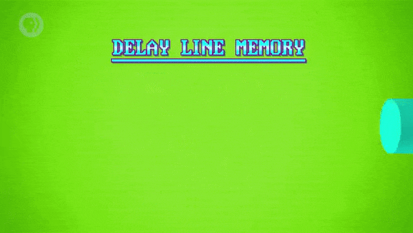

2. 한쪽 끝에는 스피커, 다른 쪽 끝에는 마이크를 놓는다.

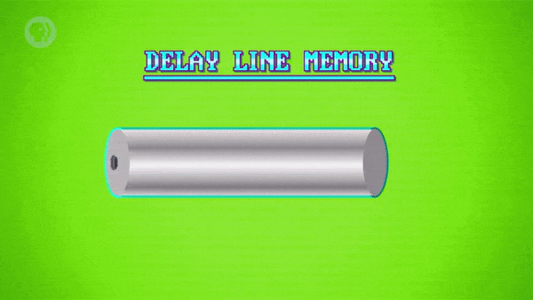

3. 스피커를 울리면, 압력파(pressure wave) 가 발생한다.

- 압력파가 다른 쪽 끝으로 전파되기까지는 시간이 걸린다.
- 마이크는 압력파를 받아서 다시 전기 신호로 변환한다.

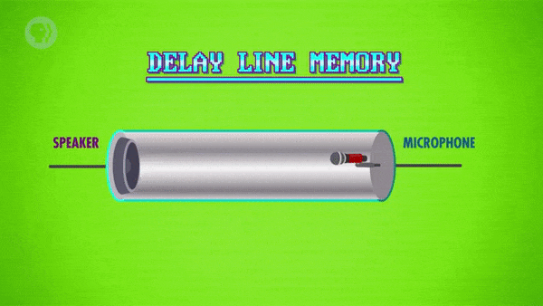

4. 이러한 전파 지연(propagation delay) 을 활용해 정보를 저장할 수 있다.

- 압력파가 있으면 1, 압력파가 없으면 0이라고 생각할 수 있다.

5. 스피커를 통해 '1010 0111' 과 같은 이진수 열을 출력할 수 있다.

- 해당 파동은 튜브를 타고 순서대로 이동한다.
- 잠시 후, 마이크에 닿으면 다시 1과 0으로 변환된다.

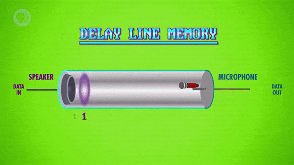

6. 여기서, 마이크를 스피커로 연결하는 회로와 증폭기(amplifier) 를 추가할 수 있다.

- 증폭기는 전기 신호가 손실되는 것을 방지하기 위해 사용된다.
- 이렇게, 정보를 저장하는 루프를 생성할 수 있다.

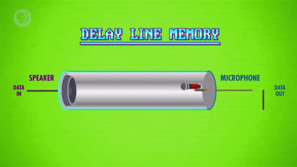

 

이 때, 전선을 따라 이동하는 신호는 거의 순간적(instantaneous) 이다.

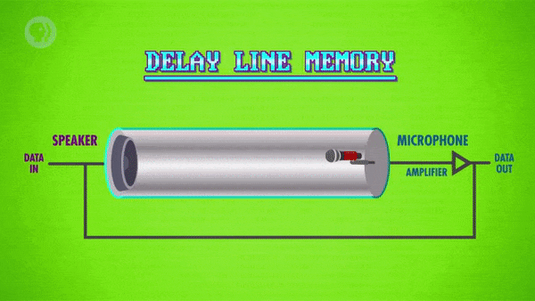

- 따라서, 한 번에 표시되는 정보는 1비트 뿐이다.
- 하지만, 튜브 내부에는 많은 비트를 저장할 수 있다.

 

에니악 작업 이후, 에커트는 그의 동료 'John Mauchly' 와 새로운 컴퓨터를 만들기 시작했다.

- 지연선 기억 장치를 통합해, 전보다 더 크고 좋은 컴퓨터 'EDVAC' 을 만들었다.
- 컴퓨터 내부에는 352비트를 저장할 수 있는 지연 선이 총 128개 사용되었다.
   - 총 45,000비트를 저장했는데, 1949년 당시치고는 그리 나쁘지 않은 규모였다.
- 에드박은 초기 '프로그램 내장식 컴퓨터(Stored-Program Computers)' 중 하나가 되었다.
   - 프로그램 내장식 컴퓨터는
     <a href='/Crash-Course/10.-초기의-프로그래밍/#4-프로그램-내장식-컴퓨터' target='-blank'>
     '10. 초기의 프로그래밍'</a>
     에서 다뤘다.

# 3. 순차 접근 기억 장치

지연선 기억 장치의 큰 단점은 한 번에 1비트의 정보만 읽을 수 있다는 것이다.

- 특정 비트에 접근하려면, 루프의 해당 위치가 돌아올 때까지 기다려야 한다.
- 이것을 **'순차 접근 기억 장치(Sequential Access Memory)'** 라고 부른다.
   - 또는 '순환 접근 기억 장치(Cyclic Access Memory)' 라고 부르기도 한다.

 

반면에, 사람들이 필요로 했던 것은 언제든지 임의의 비트에 접근할 수 있는 기억 장치였다.

> 이것을 '임의 접근 기억 장치(Random Access Memory)' 라고 부른다.

 

또한, 지연선 기억 장치는 밀도를 높이기 매우 어렵다는 것이 밝혀졌다.

> 파동의 간격을 좁히면 좁힐수록, 파동끼리 섞이기가 더 쉬워지기 때문이다.

 

이에 대응하여, '자기변형 지연선(Magnetostrictive Delay Lines)' 이 발명되었다.

- 이외에도 새로운 형태의 지연선 기억 장치들이 등장했다.

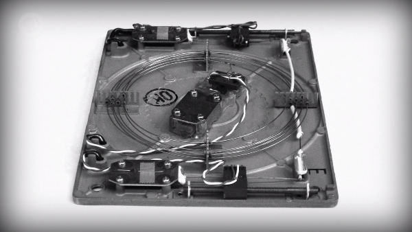

- 휘어질 수 있는 금속 전선을 통해 정보를 나타내는 조그만 비틀림 파동을 생성한다.
- 전선을 코일 모양으로 만들면, 1ft * 1ft 크기의 공간에 약 1,000비트를 저장할 수 있다.

# 4. 자심 기억 장치

그러나 지연선 기억 장치는 1950년대 중반에 거의 쓸모가 없었다.

- 대신에 성능, 신뢰성 및 비용 면에서 훨씬 더 좋은, 새로운 것이 등장했다.
- 바로, **'자심 기억 장치(Magnetic Core Memory)'** 라는 저장 장치다.

 

1. '코어(core)' 라고 부르는 작은 자기(magnetic) 도넛으로 구성되어 있다.

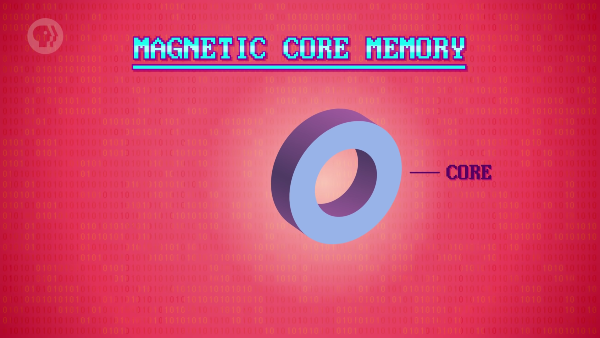

2. 코어 주위에 전선을 감고, 전선에 흐르는 전류를 조절하여 제어할 수 있다.

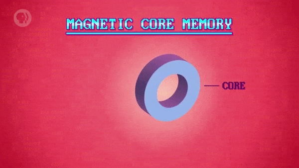

3. 전류를 흐르게 하면, 코어를 특정 방향으로 자화시킬 수 있다.

- 반대로, 전류를 차단하면 코어가 자화 상태를 유지하게 된다.

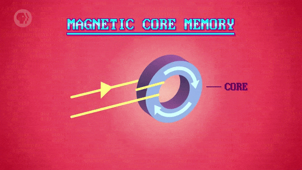

4. 전선에 반대 방향으로 전류를 흘리면, 자화 방향이 반대로 뒤집힌다.

- 이 때, 이러한 자화 방향을 '극성(polarity)' 이라고 부른다.

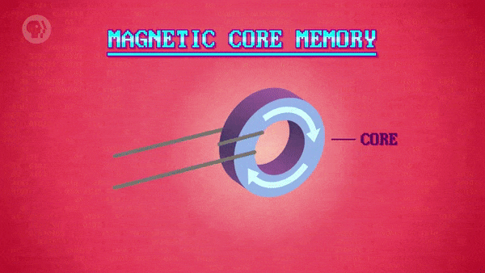

5. 자심 기억 장치는 이런 방식으로 1과 0의 값을 저장할 수 있다.

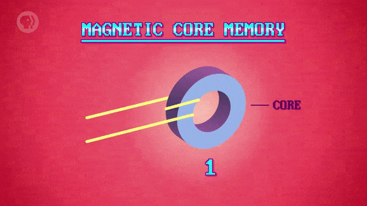

6. 1비트는 그다지 유용하지 않았고, 이러한 코어들은 격자로 정렬되었다.

- 올바른 행과 열을 선택하는 데 사용되는 전선이 있다.
- 비트 읽기/쓰기에 사용되는 모든 코어를 통과하는 전선이 있다.

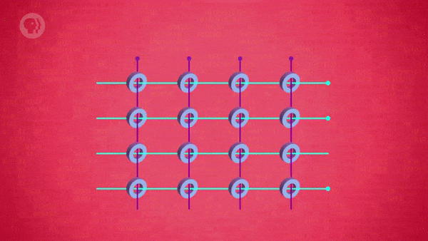

 

실재하는 자심 기억 장치의 모습을 살펴보자.

- 작은 노란색 사각형에는 각각 1비트의 정보를 담고 있는 32 * 32 개의 작은 코어가 있다.
   - 따라서, 작은 노란색 사각형은 각각 1,024비트를 저장할 수 있다.
- 총 9개 있으므로, 이 메모리 보드는 최대 9,216비트(약 9kbit) 를 저장할 수 있다.

 

자심 기억 장치는 1953년 MIT에서 만든 'Whirlwind 1' 컴퓨터에서 처음으로 사용되었다.

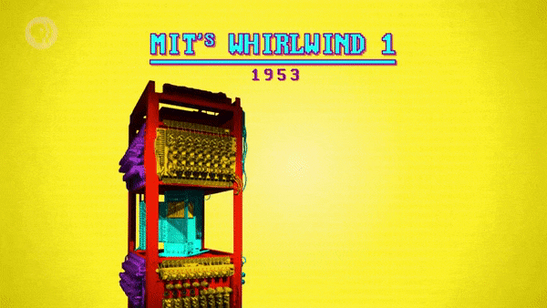

- 32 * 32 코어 배열을 사용했으며, 하나의 평면 보드에 배치했다.
- 이러한 평면을 16개 쌓아, 약 16,000비트의 저장 공간을 제공했다.

 

여기서 중요한 것은, 모든 비트에 언제든지 접근할 수 있다는 것이다.

- 지연선 기억 장치는 가질 수 없었던 엄청난 특징이다.
- 1950년대 중반부터 20년간, 임의 접근 기억 장치에 대한 주요 기술이 되었다.
- 하지만, 자심 기억 장치는 보통 손으로 직접 엮어서 만들어야 했다.

 

비트 당 가격은 약 1달러에서 시작해, 1970년대에는 약 1센트로 떨어졌다.

- 하지만 안타깝게도, 비트 당 1센트도 저렴한 가격은 아니었다.
- 앞서 언급했듯이, 평균 스마트폰 사진의 크기는 약 5MB(약 4천만 비트) 이다.
- 과연, 사진 1장을 저장하는 데 40만 달러를 낼만할지는 의문이다. (?)

# 5. 자기 테이프

비슷한 시기인 1951년, 저장 장치 기술에 대한 엄청난 연구가 진행되고 있었다.

- 에커트와 모클리는 새로운 회사를 설립하고, 새로운 컴퓨터를 설계했다.
- 그것은 초기에 상업적으로 판매된 컴퓨터 중 하나인 'UNIVAC' 이었다.

 

유니박은 새로운 형태의 컴퓨터 저장 장치인 **'자기 테이프(Magnetic Tape)'** 와 함께 등장했다.

- 자성 재료로 만들어진 길고 가늘고 유연한 조각이며, 릴(reel) 에 보관되어 있다.
- 자기 테이프는 테이프 드라이브(tape drive) 라는 장치 내부에서 앞뒤로 이동할 수 있다.

내부에는 테이프의 작은 부분을 자화시키는 쓰기 헤드(write head) 가 있다.

- 권선(wound wire) 으로 전류를 흐르게 하여 자기장을 생성하는 방식을 이용한다.
- 이 때, 전류의 방향이 극성을 설정하므로, 1과 0을 저장하기에 아주 적합하다.

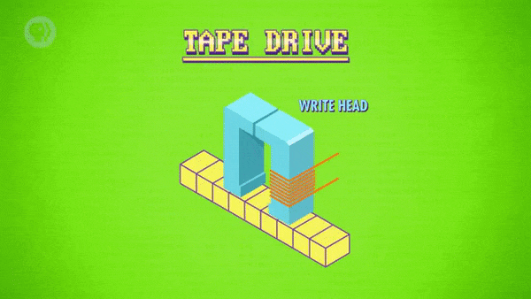

또한, 별도의 읽기 헤드(read head) 를 통해 극성을 감지할 수 있다.

- 덕분에, 극성을 파괴하지 않고도(non-destructively), 값을 읽을 수 있다.

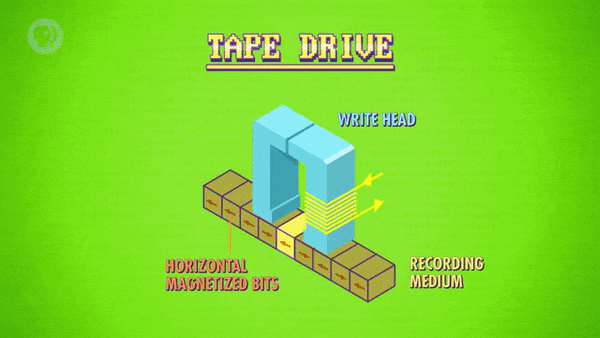

유니박은 1/2인치 너비의 테이프를 사용했다.

- 1인치당 128비트의 정보를 저장할 수 있는 데이터 트랙이 있다.
- 테이프에는 그러한 데이터 트랙 8개가 병렬로 나열되어 있다.
- 릴마다 1,200ft 길이의 테이프가 들어있으므로, 약 1,500만 비트(약 2MB) 를 저장할 수 있다.

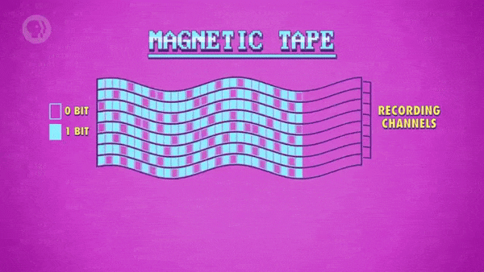

 

테이프 드라이브는 비쌌지만, 자기 테이프 자체는 저렴하고 크기가 작았다.

> 때문에, 오늘날까지도 정보를 보관하는 데에 사용되고 있다.

 

자기 테이프를 사용하는 것의 가장 큰 단점은 접근 속도다.

- 테이프는 순차적이므로, 원하는 정보를 얻으려면 되감기/빨리 감기가 필요하다.
- 단일 바이트를 찾기 위해, 엄청난 길이의 테이프를 순회해야 할 수도 있다.

# 6. 자기 드럼 기억 장치

1950년대와 60년대에, 자기 테이프와 관련된 대중적인 기술이 있었다.

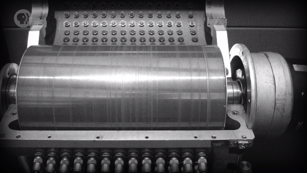

- 바로, **'자기 드럼 기억 장치(Magnetic Drum Memory)'** 였다.
- 정보를 기록하기 위해 자성 물질로 코팅된 금속 실린더(cylinder) 를 드럼이라고 불렀다.
- 드럼은 계속 회전하며, 드럼의 길이에 따라 수십 개의 읽기/쓰기 헤드가 배치되어있다.
- 읽거나 쓰고자 하는 정보가 헤드 아래에 위치할 때까지 드럼의 회전을 기다려야 한다.
- 이러한 지연을 가능한 한 짧게 유지하기 위해 드럼은 분당 수천 번을 회전해야 했다.

 

기술이 등장한 1953년, 80,000비트를 저장할 수 있는 장치를 시중에서 구할 수 있었다.

> 이는 약 10킬로바이트에 해당하는 용량이었지만, 드럼의 생산은 1970년대에 중단되었다.

# 7. 하드 디스크 드라이브

자기 드럼 기술은 새로운 저장 장치의 개발로 직접 연결되었다.

- 바로, **'하드 디스크 드라이브(Hard Disk Drive)'** 라는 저장 장치다.
- HDD는 자기 드럼과 매우 유사하지만, 기하학적 구성에서 차이가 있다. 
- HDD는 이름에 맞게, 큰 실린더 대신 단단한(hard) 디스크(disk) 를 사용한다.
- 디스크 표면은 자성을 띄어 읽기/쓰기 헤드가 1과 0을 저장하고 탐색할 수 있다.
   - 이렇게 자기 드럼과 같은 원리를 이용해 정보를 저장한다.

 

디스크의 가장 큰 장점은 디스크가 아주 얇다는 것이다. ~~`(그것이, 디스크니까..)`~~

> 덕분에, 여러 장의 디스크를 쌓아, 정보 저장에 사용되는 표면적을 많이 제공할 수 있었다.

 

IBM은 이를 활용해, 세계 최초의 HDD 탑재 컴퓨터인 'RAMAC 305' 를 개발했다.

- 'RAMAC 305' 는 24인치 지름의 디스크 50장, 약 5MB의 저장 용량을 제공했다.
- 1956년, 드디어, 스마트폰 사진 1장을 저장할 수 있는 기술에 도달하게 된 것이다.

 

정보의 특정 비트에 접근하기 위해, 읽기/쓰기 헤드는 아래와 같이 동작했다.

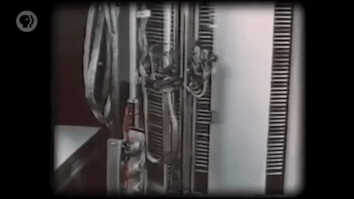

- 위아래로 움직여 올바른 디스크의 위치로 이동해, 그 사이로 헤드를 밀어 넣는다.
- 자기 드럼과 마찬가지로 디스크가 회전하면, 올바른 위치가 돌아올 때까지 대기한다.

 

'RAMAC 305' 는 평균적으로 약 6/10초 이내에 모든 정보 블록에 접근할 수 있었다.

> 이렇게, 컴퓨터가 특정 정보에 접근하는 데 필요한 시간을 '탐색 시간(Seek Time)' 이라고 한다.

- HDD는 정보 저장에는 적합했지만, 속도는 기억 장치보다 느린 편에 속했다.
- 때문에, 'RAMAC 305' 에는 자기 드럼 기억 장치와 자심 기억 장치도 탑재되었다.

 

이번에는 '메모리 계층 구조(memory hierarchy)' 에 대해 살펴보자.

- 아주 작은 부분을 차지하는 빠른 메모리는 비싸다.
- 중간에 있는 중간 속도에 가까운 메모리는 덜 비싸다.
- 넓은 면적을 차지하는 느린 메모리는 저렴하다.

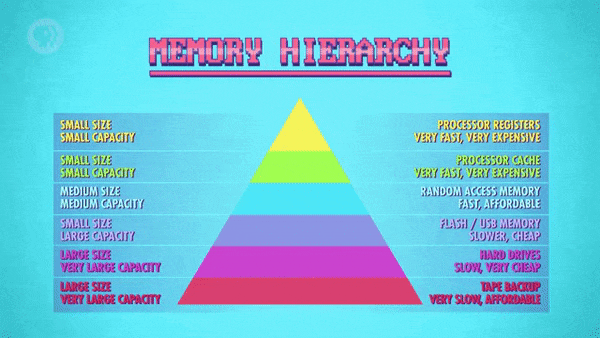

> 이렇게, 기억 장치를 혼합하여 사용하는 방식은 비용과 속도 사이의 균형을 유지한다.

 

하드 디스크 드라이브는 빠르게 개선되었고, 1970년대에 보편화되었다.

- 오늘날의 HDD는 1테라바이트의 정보를 쉽게 저장할 수 있다.
- 이는 1조 바이트에 해당하며, 200,000장의 스마트폰 사진에 해당한다.
- 이 정도 용량의 HDD는 40달러 정도면 온라인으로 구매할 수 있다.
   - 이는 1비트 당 0.0000000005센트에 해당한다.
   - 1비트 당 1센트였던 자심 기억 장치에서 엄청나게 발전했다.
- 또한, 요즘 HDD의 탐색 시간은 평균 1/100초 미만이다.

 

하드 디스크와 비슷한 **'플로피 디스크(Floppy Disk)'** 에 대해 간단히 살펴보자.

- 기본적으로는 똑같지만 단단하지 않은(floppy) 자기 매체를 사용한다.
- 저장 아이콘으로 여겨지지만, 한때는 실제로 존재하는 물건이었다.
- 휴대용 저장 장치 중에서도 가장 일반적으로 사용되는 장치였다.
- 1970년대 중반부터 90년대 중반까지 거의 어디서나 볼 수 있었다.
- 'Zip Disk' 와 같은 고밀도 플로피 디스크는 1990년대 중반에 인기를 얻었다.
   - 하지만, 10년도 되지 않아서 인기가 떨어졌다.

# 8. 광학 저장 장치

**'광학 저장 장치(Optical Storage)'** 는 1972년에 등장했다.

> 12인치 크기의 '레이저디스크(LaserDisc)' 형태로 처음 등장했다.

 

하지만, 사람들에게는 'CD' 와 'DVD' 가 더 익숙할 것이다.

> Compact Disc (콤팩트 디스크, CD), Digital Video Disc (DVD)

- CD와 DVD는 90년대에 등장한 더 작고 대중적인 저장 장치다.

 

광학 저장 장치는 기능적으로 하드 디스크/플로피 디스크와 매우 유사하다.

- 하지만, 정보를 저장할 때 자기적인 방법을 사용하지 않는다.
- 대신, 표면에 있는 약간의 물리적 흠집(pits and lands) 을 이용해 0과 1을 구분한다.
- 흠집에 의해 빛이 다르게 반사되어, 광학 센서(optical sensor) 에 의해 캡처된다.
- 캡처된 빛 신호에 따라 0과 1의 값으로 디코딩(decode) 된다.

# 9. 솔리드 스테이트 드라이브

오늘날에는, '솔리드-스테이트(Solid-State)' 기술로 대체되고 있다.

- 하드 드라이브와 USB 스틱처럼 움직이는 부품들을 사용하지 않는 기술이다.
   - 이 하드 드라이브(Hard Drive) 는 HDD와는 다른 의미를 지닌다.
   - 컴퓨터 본체 내부에 있는 저장 장치를 통틀어 하드 드라이브라고 한다.
- 내부는
  <a href='/Crash-Course/17.-집적-회로와-무어의-법칙/#3-집적-회로' target='-blank'>
  '17. 집적 회로와 무어의 법칙'</a>
  에서 다뤘던 집적 회로로 구성되었다.

 

최초의 RAM 집적 회로는 1972년에 비트 당 1센트의 가격으로 출시되었다.

> 때문에, 자심 기억 장치는 금세 사용되지 않게 되었다.

 

오늘날에는 가격이 훨씬 저렴해져, HDD가 솔리드 스테이트 드라이브(SSD) 로 대체되고 있다.

> Solid State Drive (SSD)

- SSD는 HDD와 마찬가지로 비휘발성 저장 장치다.
- 움직이는 부품이 아예 없으며, 정보를 따로 탐색할 필요도 없다.
- 때문에, 정보에 접근하는 데에 보통 1/1000초 미만의 시간이 걸린다.

 

하지만, SSD의 속도는 여전히 컴퓨터의 RAM보다 몇 배는 더 느리다.

> 이러한 이유로 오늘날의 컴퓨터에서도 여전히 메모리 계층 구조가 활용된다.

# 10. 저장 장치에 관하여,

이렇게 저장 장치에 관해 1940년대부터 쭉 살펴봤다. 

- 기억 장치와 저장 장치에 관련된 기술들은 기하급수적인 추세를 따라왔다.
- <a href='Crash-Course/17.-집적-회로와-무어의-법칙/#6-무어의-법칙' target='-blank'>
  '17. 집적 회로와 무어의 법칙'</a>
  에서 다뤘던 무어의 법칙과 유사하게 말이다.

 

초기의 자심 기억 장치는 메가바이트 당 수백만 달러의 비용이 필요했다.

- 하지만, 2000년도에는 불과 몇 센트면 충분할 정도로 꾸준히 하락했다.
- 심지어 오늘날에는 몇 분의 1센트(1/n) 로도 메가바이트 정보를 저장할 수 있다.

 

게다가, 관리해야 하는 천공 카드가 거의 사라졌다.

- 진지하게, SAGE 프로그램이 있는 방에 바람이 한 번 불었다고 생각해보자.
- 62,500장의 펀치 카드들이 휘날리는 모습은 생각하고 싶지도 않을 정도다.

 

**<작성 중인 글입니다.>**

**<아래 내용은 정리 중입니다.>**

# 배운 점, 느낀 점

- 
