>
해당 포스트는 
Youtube 채널
<a href='https://www.youtube.com/channel/UCX6b17PVsYBQ0ip5gyeme-Q' target='-blank'>'Crash Course'</a>
에서 제공하는 
<a href='https://www.youtube.com/playlist?list=PL8dPuuaLjXtNlUrzyH5r6jN9ulIgZBpdo' target='-blank'>'Computer Science'</a>
수업을 바탕으로 작성되었습니다.  
( 사진 속 인물은
<a href='https://about.me/carrieannephilbin' target='-blank'>'Carrie Anne Philbin'</a>
선생님 입니다! )

# 0. 시작하기에 앞서,

이전의 수업들에서 우리는 입력과 출력에 대한 여러 내용을 다뤘었다.

- 대부분은 컴퓨터 내부에 있는 장치들 사이의 입출력에 관한 내용이었다.
- RAM에서 정보를 출력하거나, CPU에 명령을 입력하는 등을 예로 들 수 있다.

 

반면에, 사람으로부터의 입력에 관한 내용은 크게 다루지 않았다.

- 물론, 종이에 정보를 인쇄하거나 구멍을 뚫는 것에 대해 살펴보긴 했다.
- 하지만, 컴퓨터에서 정보를 꺼내오는(얻는) 방법에 대해서는 다루지 않았다.

 

물론, 다양한 **'입출력 장치(Input & Output Device)'** 가 있다.

- 사용자는 입출력 장치를 통해 컴퓨터와 통신(communicate) 할 수 있다.
- 이러한 입출력 장치들은 인간과 컴퓨터의 연결(interface) 을 제공한다.

 

또, 오늘날에는 **'인간-컴퓨터 상호작용(HCI)'** 이라는 연구 분야가 있다.

> Human-Computer Interaction (HCI)

- 이러한 인터페이스는 사용자 경험(user experience) 에서 아주 중요하다.
- 따라서, 이후의 몇몇 수업에서는 이와 관련된 부분을 중점적으로 살펴볼 것이다.

# 1. 입출력과 상호작용

강의 초반부에서 다뤘던 초기의 기계적/전기 기계적 컴퓨팅 장치부터 살펴보자.

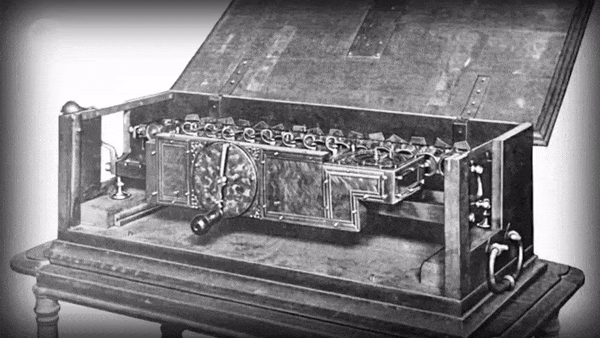

- 이러한 장치들은 기어, 노브(knob), 스위치 등을 이용해 물리적으로 입출력을 제어했다.
- 이와 같은 상호작용 방식은 인간 인터페이스(Human Interface) 의 영역에 가까웠다.

 

초기 전자 컴퓨터(Colossus, ENIAC 등) 조차 거대한 기계식 제어판과 전선으로 구성되었다.

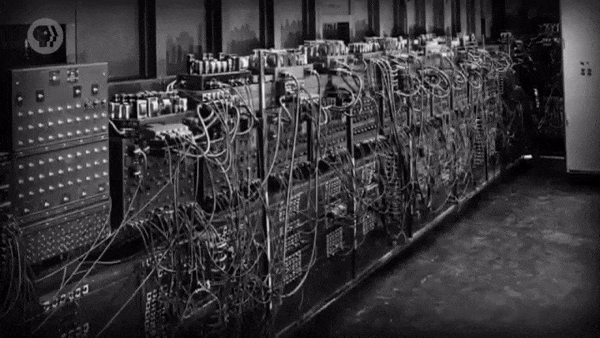

- 프로그램 하나를 입력하는 데에만(실행 제외) 몇 주의 시간이 걸릴 수도 있다.
- 또, 프로그램 실행 후에 정보를 가져올 때, 결과는 대부분 종이에 인쇄되었다.
   - 이러한 종이 프린터(paper printer) 는 매우 유용했다.
   - 1820년대, Babbage 가 차분기관에 사용할 장치를 설계했을 정도다.

 

그러나, 1950년대에는 이러한 기계적 입력 수단들을 더는 사용되지 않게 되었다.

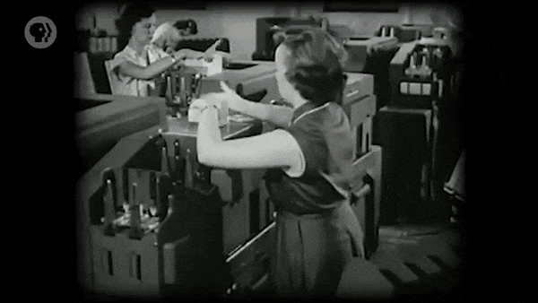

- 프로그램과 정보들이 천공 카드, 자기 테이프 등의 매체에 저장되기 시작했기 때문이다.
- 하지만, 최종 결과를 출력하는 데에는 여전히 종이 출력물(paper printout) 이 사용되었다.
- 또, 프로그램 진행 중에 실시간 피드백을 제공하는 엄청난 양의 표시등이 개발되었다.

 

이 시대의 컴퓨터 입력이 어떤 특징을 지녔는지 인식하는 것이 중요하다.

- 컴퓨터를 기준으로, 가능한 단순하고 견고하도록 설계되었다.
- 편의성과 사용자에 대한 이해는 이다음으로 고려되는 사항이었다.

 

컴퓨터가 쉽게 읽을 수 있도록 설계된 천공 테이프를 예로 들 수 있다.

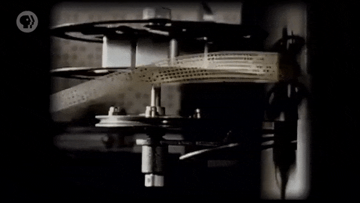

- 연속적(continuous) 이라는 테이프의 본질 덕분에, 기계적으로 처리하기 쉬웠다.
- 기계/광학적 체계는 구멍을 안정적으로 감지하여, 명령과 정보를 인코딩할 수 있었다.

 

하지만 당연하게도, 인간이 생각하는 방식은 종이에 뚫린 작은 구멍과는 거리가 멀었다.

> 결국, 이러한 부담은 모두 프로그래머에게로 돌아가게 되었다. ~~`(고통받는 공돌이..)`~~

- 아이디어와 프로그램을 당시의 컴퓨터가 이해하기 쉬운 언어와 형식으로 변환해야 했다.
- 엄청난 시간과 노력을 들여야 했고, 보통, 추가 직원(staff) 과 보조 장치의 도움을 받았다.

# 2. 키보드

1950년 이전의 초기 컴퓨터에 인간의 입력에 대한 개념이 있었다는 것도 중요하다.

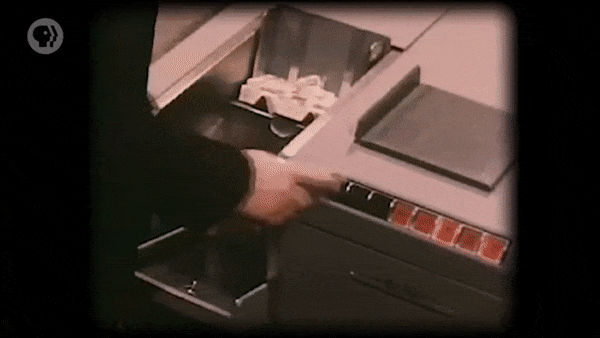

- 물론, 인간이 프로그램과 정보를 입력해도, 컴퓨터는 대부분 상호작용을 하지 않았다.
- 일단 프로그램이 시작되면, 컴퓨터는 일반적으로 작업이 완료될 때까지 실행되었다.
- 왜냐하면, 사람의 명령 작성이나 정보 입력을 기다리기에는 비용이 많이 들었기 때문이다.
- 계산(computation) 에 필요한 모든 입력은 프로그램과 동시에 입력되었다.

 

이러한 양상은 1950년대 후반을 지나면서 바뀌기 시작했다.

1. 소규모(small-scale) 컴퓨터가 저렴해지기 시작했다.
   - 덕분에, 컴퓨터의 작업에 사람이 개입(HITL) 할 수 있게 되었다.
   - 이러한 개념을 '인간 참여(Human-In-The-Loop, HITL)' 라고 한다.
2. 대형 컴퓨터는 기존보다 훨씬 더  빠르고 정교해졌다.
   - 많은 프로그램과 사용자를 동시에 지원(처리) 할 수 있게 되었다.
   - 이를 다중작업(multitasking), 시분할 시스템(time-sharing) 이라 한다.

 

그러나, 이러한 컴퓨터는 사용자로부터 입력을 받아들일 방법이 필요했기 때문에,  
당시에 어디서나 볼 수 있는 정보 입력 장치인 **'키보드(keyboard)'** 가 차용되었다.

# 3. 자판 배열

당시, 타자기(typing machine) 는 이미 몇 세기 동안 사용되어온 장치였다.

- 하지만, 현대 타자기(typewriter) 는 1868년에 'Christopher Latham Sholes' 가 발명했다.
- 설계 개선과 제조에 필요한 시간 때문에 1874년이 되어서야 도입되었지만, 상업적으로는 성공했다.

 

숄스의 타자기는 특이한 **'자판 배열(Keyboard Layout)'** 을 채택했다.

문자 키 왼쪽 위에 있는 'QWERTY' 를 따서, '쿼티(QWERTY)' 라는 이름이 붙었다.

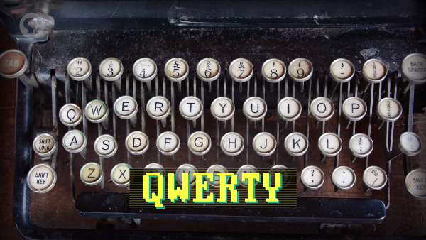

 

이러한 설계가 적용된 이유에 대한 많은 추측 중 가장 널리 알려진 가설은 아래와 같다.

>
연속적으로 입력할 때, 글쇠(typebar) 끼리 충돌하는 것을 줄이기 위해,  
영어에서 흔히 사용되는 문자 쌍(letter pairing) 을 서로 멀리 떨어뜨렸다.

 

이는 이해하기 쉬운 설명이지만, 거짓일 수도 있으며, 적어도 전체 내용은 아니다.

- 사실, 쿼티 배열에는 'TH', 'ER' 등의 흔한 문자 쌍이 함께 배치되어있다.
- 또, 이러한 상징적 배열을 만들기까지 숄스가 많은 시도를 했다는 사실이 있다.

 

얼마 지나지 않아, 경쟁 업체들은 상업적으로 성공한 숄스의 타자기의 설계를 모방했다.

- 몇 세기에 걸쳐, 다양한 이점을 주장하는 많은 자판 배열이 대안으로 제안되었다.
- 하지만, 쿼티를 배우는 데에 시간을 투자한 사람들은 새로운 것을 배우길 꺼렸다.
- 경제학자들은 이를 '전환 비용(switching barrier or cost)' 이라 부른다.
- 쿼티 배열은 이러한 기본적이고 인간적인 이유로 인해 여전히 사용되고 있다.

 

사실, 쿼티 배열은 그렇게 보편적인 자판 배열이 아니다.

> 프랑스의 'AZERTY', 중부 유럽의 'QWERTZ' 등 국제적으로 많은 변형 배열이 있다.

# 4. 타법의 발전

재미있는 사실은, 숄스는 타자가 손글씨보다 빠를 수 있다는 것을 상상도 못 했다는 것이다.

- 참고로, 손글씨로 글을 작성하는 경우에는 분당 약 20개의 단어를 작성할 수 있다.

- 타자기는 주로 속도가 아닌 문서의 가독성(legibility) 과 표준화를 위해 도입되었다.
- 하지만, 사무실에서 널리 사용되기 시작하면서 사람들은 더 빠른 타자를 원하게 되었다.

 

이후, 타자의 진정한 잠재력을 일깨워준 큰 발전이 두 번 일어났다.

1880년경, 'Elizabeth Longley' 는 **'열 손가락 타법(Ten-Tinger Typing)'** 을 장려하기 시작했다.

- 엘리자베스는 신시내티의 'Shorthand and Typewriter Institute' 의 교사였다.
- '독수리 타법(Hunt and Peck)' 보다 손가락 움직임이 훨씬 적어서 타자 속도가 더 빨랐다.

 

몇 년 후, 'Frank Edward Mcgurrin' 은 **'터치 타법(Touch Typing)'** 을 스스로 터득했다.

> 맥거린은 솔트레이크시티의 연방 법원 서기였으며, 키보드를 보지 않고도 타자를 할 수 있었다.

1888년에 맥거린이 유명 타자 속도 대회에서 우승하고, 열 손가락 터치 타법이 유행하기 시작했다.

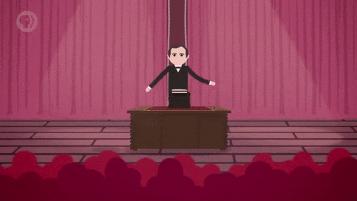

- 얼마 지나지 않아, 전문 타자원(typist) 들은 분당 100개 이상의 단어를 작성할 수 있게 되었다.

# 5. 전신타자기

이렇게, 사람들은 타자기를 더 잘 다룰 수 있게 되었다.

> 하지만, 컴퓨터는 손가락이 없어서 타자기를 직접 사용할 수 없다. 

 

때문에, 초기 컴퓨터는 '전신타자기(teletype machine)' 를 채택했다.

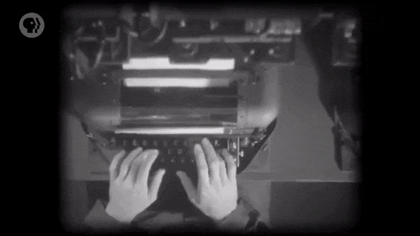

- 보통, 'Teletypewriter(TTY)' 혹은 'Teleprinter' 라고 표기된다.
- 전신타자기는 전신(telegraph) 에 사용되는 특별한 유형의 타자기다.

 

전신타자기는 전신선을 통해 문자를 주고받을 수 있는 전자 기계적으로 증강된 타자기였다.

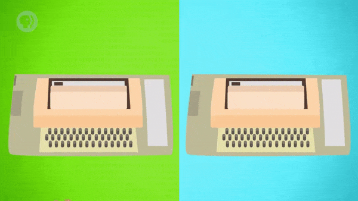

- 한쪽의 키보드에서 문자를 누르면 전기 신호가 전신선을 통해 전송된다.
- 반대편의 전신 타자기가 신호를 받으면, 해당 문자가 전기 기계적으로 입력된다.
- 덕분에, 서로 멀리 떨어져 있는 두 사람이 타자 내용을 주고받을 수 있었다.

 

> 따지고 보면, 스팀펑크(steampunk) 버전의 채팅방이라고도 볼 수 있다.

# 6. 명령 줄 인터페이스

전신타자기에는 이미 전자 인터페이스가 있어서, 컴퓨터용으로 쉽게 개조할 수 있었다.

> 이러한 'Teletype Computer Interface' 는 1960 ~ 70년대에 흔하게 사용되었다.

 

이러한 인터페이스에서의 상호작용 방식은 매우 간단했다.

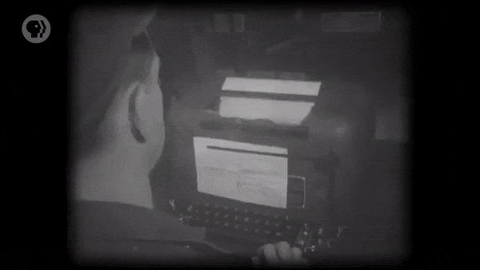

- 사용자가 명령(command) 을 입력하고 'Enter' 키를 누르면, 컴퓨터가 다시 입력한다.
- 이렇게, 사용자와 컴퓨터는 이러한 '문자 대화(text conversation)' 를 서로 주고받았다.

 

이는 **'명령 줄 인터페이스(Command Line Interface, CLI)'** 라고 불렸다.

> CLI는 1980년대까지 가장 널리 사용된 인간-컴퓨터 상호작용 형식이었다.

 

전신타자기에서의 명령 줄 상호작용 방식은 다음과 같다.

사용자는 가능한 명령을 얼마든지 입력할 수 있는데, 그중 몇 가지만 살펴보자.

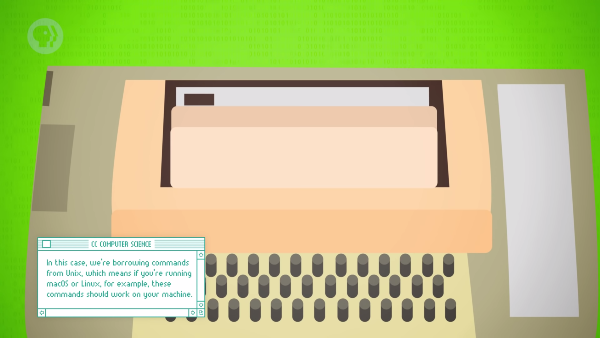

'ls' 명령을 입력하면, 컴퓨터는 현재(current) 디렉토리에 있는 파일들의 목록을 응답한다.

- 이 때, 'ls' 는 목록이라는 뜻을 지닌 'list' 의 줄임말이다.

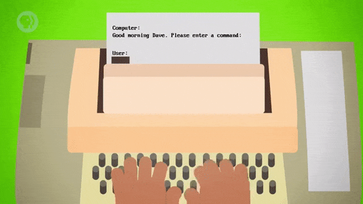

다른 명령(유닉스에서는 'cat') 을 사용하여 파일에 있는 내용을 표시하도록 할 수 있다.

- 'secretStarTrekDiscoveryCast.txt' 의 내용을 확인한다고 가정한다.
- 이 때, 'cat' 는 '연쇄시키다' 라는 뜻을 지닌 'concatenate' 의 줄임말이다.
- 표시할 파일을 지정해야 하므로, 명령 뒤에 파일의 이름을 추가해야 한다.
   - 이러한 인자(argument) 를 통해 명령의 대상을 지정할 수 있다.

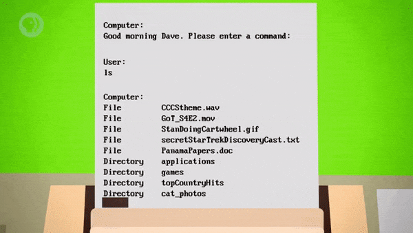

다른 사용자들과 네트워크로 연결되어 있다면, 'finger' 명령으로 더 많은 정보를 얻을 수 있다.

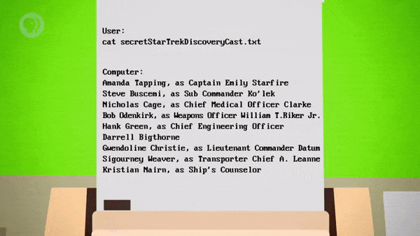

 

> 1970년대까지, 전자 기계식 전신타자기는 주요 컴퓨팅 인터페이스였다.

# 7. 단말기

컴퓨터 화면은 1950년대에 처음 등장하여 그래픽에 사용되었다.

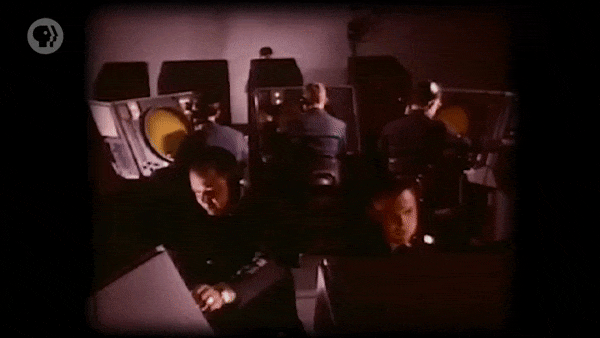

- 하지만, 일상적인 용도로 사용하기에는 너무 비싸고 해상도가 낮았다.
- 이후, 상용 텔레비전의 대량 생산과 프로세서/메모리의 전반적인 개선이 있었다.
- 덕분에, 1970년에는 화면 기반의 전신타자기가 경제적으로 실현 가능해졌다.

 

공학자들은 화면과 컴퓨터를 연결할 목적으로 새로운 표준을 만들지는 않았다.

- 대신, 기존에 있던 문자 전용의 전신타자기 프로토콜을 단순히 재활용했다.
- 이 때, 화면은 끝없이 이어지는 종이를 시뮬레이션하는 용도로 사용되었다.
- 단순한 문자 입출력 프로토콜이라는 점은 바뀌지 않아서 문제없이 연결되었다.

 

이러한 유형의 전신타자기는 '단말기(Terminal)' 로 알려지게 되었다.

- 'Virtual Teletype' 또는 'Glass Teletype' 이라고 불리기도 했다.

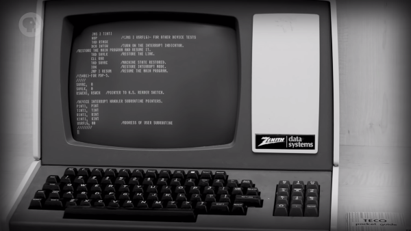

- 1971년까지 미국에서 추산한 전신타자기와 단말기의 사용 현황은 아래와 같다.
   - 전자 기계식 전신타자기 약 70,000대, 화면 기반 단말기 약 70,000대
- 물론, 실수한 부분을 지울 수 있는 등의 장점때문에, 화면이 훨씬 더 유용했다.
- 때문에, 1970년대 말에 이르러서는 화면을 사용하는 방식이 표준이 되었다.

# 8. 대화식 소설

명령 줄 인터페이스로는 흥미로운 일을 할 수 없을 것이라 생각할 수도 있다.

> 하지만, 프로그래머들은 문자 기반 상호작용만으로도 재미있는 요소들을 만들었다.

 

초기의 문자 기반 대화형 컴퓨터 게임 중에 유명한 것은, 1977년에 제작된 'Zork' 였다.

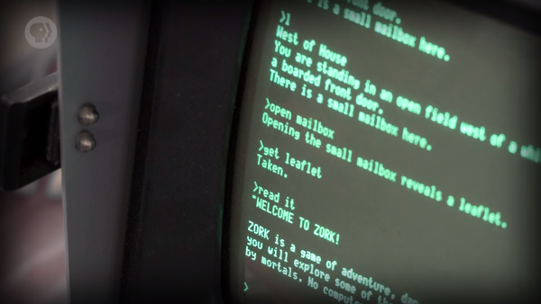

- 이런 종류의 초기 게임을 즐기는 플레이어들의 상상력은 엄청났을 것이다.
- 끔찍하게 생긴 괴물을 마주한 상황 등, 주변의 가상 세계를 시각화했을 것이다.

 

화면 기반 단말기의 명령 줄로 돌아가서 더 자세하게 살펴보자.

'cd' 명령을 사용하여 'games' 디렉토리로 이동해보자.

- 이 때, 'cd' 는 '디렉토리 변경(change directory)' 의 줄임말이다.

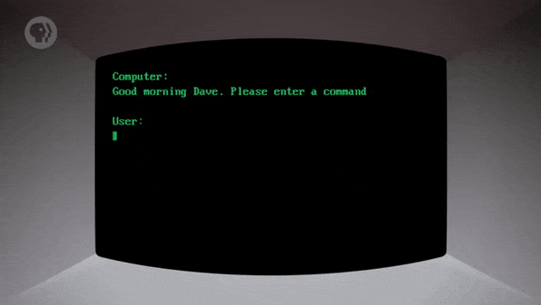

이제, 'ls' 명령을 사용하여 컴퓨터에 설치된 게임을 확인할 수 있다.

- 'Adventure' 라는 게임이 있는 것을 확인할 수 있다.

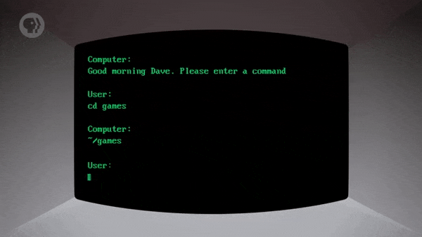

이러한 프로그램은, 이름을 입력하기만 해도 바로 실행할 수 있다.

- 응용 프로그램은 중지되거나 종료될 때까지 명령 줄을 대체한다.

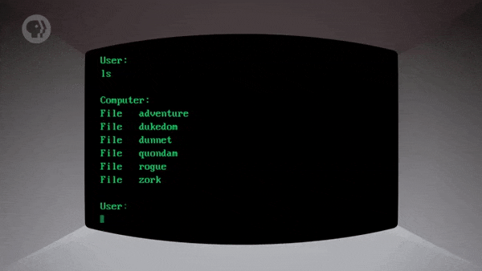

 

'거대 동굴 탐험(Colossal Cave Adventure)' 이라는 게임의 실제 상호작용을 살펴보자.

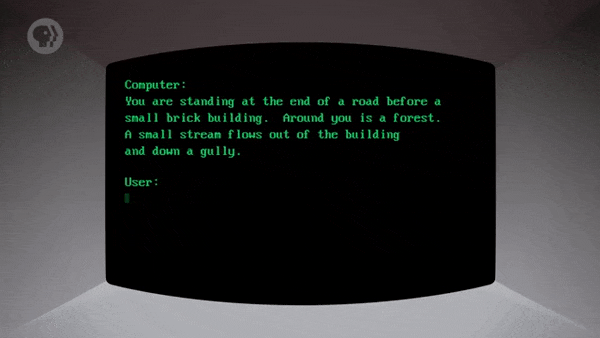

- 이는 1976년에 'Will Crowther' 가 최초로 개발한 문자 기반 게임이다.
- 플레이어는 1 ~ 2개의 단어로 구성된 명령을 입력하여 여러 행위를 할 수 있다.
   - 이동하거나, 여러 개체와 상호작용하거나, 특정 항목을 집는 등의 행위가 가능했다.
- 프로그램은 위치, 가능한 작업, 해당 작업의 결과를 설명하는 해설자 역할을 했다.
   - 일부 작업들은 게임 안에서의 죽음으로 연결되었다.
- 거대 동굴 탐험의 원작에서는 총 66개의 장소를 탐색할 수 있었다.

 

이 게임은 **'대화식 소설(Interactive Fiction)'** 의 첫 번째 사례로 여겨진다.

- 이러한 'text adventure' 게임은 나중에 여러 명의 사람이 즐길 수 있게 되었다.
   - 이와 같은 게임 종류를 'MUD(Multi-User Dungeons)' 라고 한다.
- 이들은 '대규모 다중 사용자 온라인 롤플레잉 게임(MMORPG)' 의 조상님이다.
> Massively Multiplayer Online Role-Playing Game (MMORPG)
   - 오늘날, 많은 사람이 즐기는 놀라운 그래픽의 게임들이 이에 해당한다.

# 9. 명령 줄 인터페이스에 관하여,

명령 줄 인터페이스는 단순하지만, 매우 강력하다.

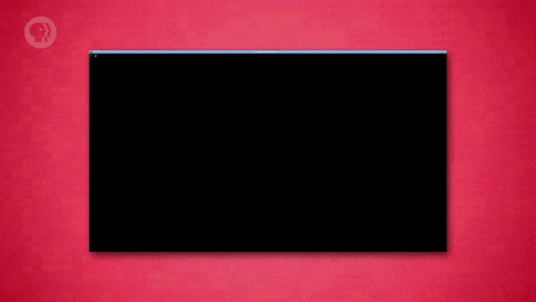

- 컴퓨터 프로그래밍은 여전히 서면 작업에 가까워서, 명령 줄은 자연스럽게 사용된다.
- 때문에, 오늘날에도 프로그래머들은 일부 작업에서 명령 줄 인터페이스를 사용한다.
- 또한, 멀리 떨어져 있는 컴퓨터에 접근할 때 사용되는 가장 흔한 방법이기도 하다.
   - 다른 나라에 있는 서버 컴퓨터 등을 예로 들 수 있다.

 

Windows, macOS, Linux 기반의 컴퓨터에는 명령 줄 인터페이스가 있다.

> 아마 사용해본 적이 아예 없는 사람도 있을 것이다.

 

'Windows' 에서는 'cmd', 'Mac' 에서는 'Terminal' 을 검색하면 찾을 수 있다.

> 게임 'Zork' 의 사본을 설치해서, 한 번 즐겨보는 것도 나쁘지 않을 것이다.

# 10. 그래픽에 관하여,

이렇게, 초기의 발전이 오늘날의 컴퓨팅에 끼친 영향에 대해 살펴봤다.

- 휴대전화에 쿼티 배열의 키보드가 지원되지 않는다고 가정해보자.
- 아마, 무언가를 입력하는 데 엄청나게 많은 시간이 필요할 것이다.

 

하지만, 이번 수업에서 아직 다루지 않은 부분이 있다.

> 바로, 다음 수업에서 살펴볼 주제인 '그래픽(Graphic)' 이다.

 

**<작성 중인 글입니다.>**

**<아래 내용은 정리 중입니다.>**

# 배운 점, 느낀 점

키보드가 사용되기 이전의 입출력 장치들과 상호작용 방식에 대해 배웠다.

- 물리적 장치들을 직접 조작하거나 기계적으로 컴퓨터를 조작했고, 종이로 결과를 출력했다.
- 이후에는, 저장 장치를 이용해 프로그램을 입력하고, 표시등을 통해 상태를 확인하게 되었다.
- 이렇게, 편의성과 사용자에 대한 고려보다는 컴퓨터를 위한 단순성과 견고함이 우선시되었다.

 

쿼티 자판 배열을 사용하게 된 이유와 효율적인 타법의 역사에 대해 배웠다.

- 현대식 타자기를 사용한 사람들은 쿼티 자판 배열에 익숙해지기 위해 시간을 투자했다.
- 때문에, 사람들은 이전에 투자한 시간이 아까워, 새로운 자판 배열을 익히는 것을 꺼렸다.
- 이렇게, 사람들은 타자기를 사용하는 데 익숙해졌고, 더 빠른 타자 속도를 원하기 시작했다.
- 그렇게, 열 손가락/터치 타법이 등장하게 되었으며, 유명 대회를 기점으로 유행이 시작되었다.

 

타자기를 이용해 컴퓨터와 정보를 주고받는 원리와 상호작용 방식에 대해 배웠다.

- 전신타자기는 전신선을 통해 한쪽의 입력을 다른 쪽에 전달하는 전자 기계식 타자기다.
- 이러한 타자기를 개조하여 컴퓨터에 연결하면, 문자에 대한 전기 신호를 주고받을 수 있다.
- 이를 통해, 사용자가 명령을 입력하면 컴퓨터가 그에 답하는 식의 상호작용이 가능했다.
- 이렇게, 인간과 컴퓨터가 문자를 주고받는 상호작용 형식을 명령 줄 인터페이스라고 한다.
