>
해당 포스트는 
Youtube 채널
<a href='https://www.youtube.com/channel/UCX6b17PVsYBQ0ip5gyeme-Q' target='-blank'>'Crash Course'</a>
에서 제공하는 
<a href='https://www.youtube.com/playlist?list=PL8dPuuaLjXtNlUrzyH5r6jN9ulIgZBpdo' target='-blank'>'Computer Science'</a>
수업을 바탕으로 작성되었습니다.  
( 사진 속 인물은
<a href='https://about.me/carrieannephilbin' target='-blank'>'Carrie Anne Philbin'</a>
선생님 입니다! )

# 0. 시작하기에 앞서,

<details><summary>1960년식 'PDP-1' 은 그래픽을 사용한 초기 컴퓨팅의 좋은 예시다.</summary>

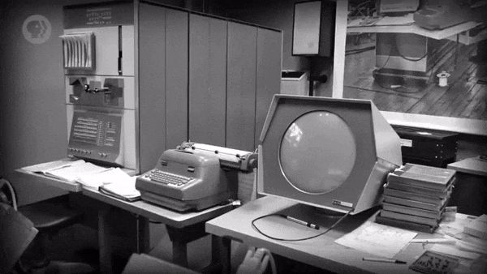

</details>

- 왼쪽에는 캐비닛 크기의 컴퓨터, 가운데에는 전신타자기, 오른쪽에는 둥근 화면이 있다.
- 당시에는 문자 기반 작업과 그래픽 작업이 구분되었기 때문에, 장치들도 독립적이었다.

<br>

사실, 이러한 초기 컴퓨터 화면에 문자를 선명하게 렌더링하는 것은 어려운 일이었다.

> 반면에, 타자 내용이 적힌 종이는 훨씬 더 뚜렷한 대비와 해상도를 제공했다.

<br>

초기 컴퓨터 화면의 가장 일반적인 용도는 프로그램의 작업을 추적하는 것이었다.

> 여러 값(values) 과 레지스터(register) 를 추적하여 화면에 표시하는 등

- 전신타자기를 이용해 이런 내용을 반복해서 인쇄한다는 것은 말도 안 되는 일이었다.
   - 속도도 느린 데다가, 엄청나게 많은 종이가 낭비될 것이었기 때문이다.
- 반면에, 화면은 동적이고 빠르게 갱신되어서, 일시적인 값을 표기하는 데에 적합했다.

<br>

프로그램 결과를 출력하는 수단으로 컴퓨터 화면은 거의 고려되지 않았다.

> 대신, 계산 결과는 일반적으로 종이와 같은 다른 영구적인 매체에 기록되었다.

<br>

하지만, 화면은 너무나 유용해서 1960년대 초부터 활발하게 사용되기 시작했다.

# 1. 음극선관

<details><summary>수십 년에 걸쳐, 다양한 디스플레이 기술들이 개발되었다.</summary>

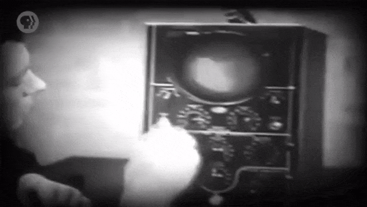

</details>

- 하지만, 초기의 가장 영향력 있는 기술은 **'음극선관(Cathode Ray Tube, CRT)'** 이었다.

<br>

<details><summary>음극선관은 방사체를 이용해, 인광체로 도포된 화면으로 전자를 발사하는 방식으로 작동한다.</summary>

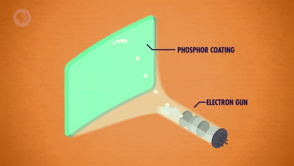

</details>

- 코팅된 부분에 전자가 닿으면, 아주 짧은 시간(몇 분의 1초 정도) 동안 빛난다.

<br>

전자는 전하를 띤 입자들이기 때문에, 전자기장을 이용해 경로를 조작할 수 있었다.

- 전자를 원하는 위치(상하좌우) 로 유도하기 위해 내부에서 금속판이나 코일을 이용한다.

# 2. 벡터와 래스터

전자기장을 이용한 조작 방식으로 음극선관에 그래픽을 그리는 방법은 두 가지가 있다.

<br>

<details><summary>첫 번째는 전자빔(beam) 이 형체(shape) 를 추적(trace) 하도록 하는 방법이다.</summary>

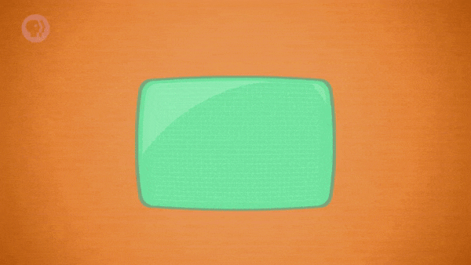

</details>

- 이러한 방식을 **'벡터 주사(Vector Scanning)'** 라고 한다.
- 빛이 잠깐 유지되므로, 경로를 따라 주사를 반복하여 이미지를 생성할 수 있다.  
- 단, 이러한 동작을 빛의 지속이 끊기지 않을 정도로 빠르게 반복해야 한다.

<br>

<details><summary>두 번째는 고정된 경로로 반복적으로 이동하면서, 한 줄씩 주사하는 방법이다.</summary>

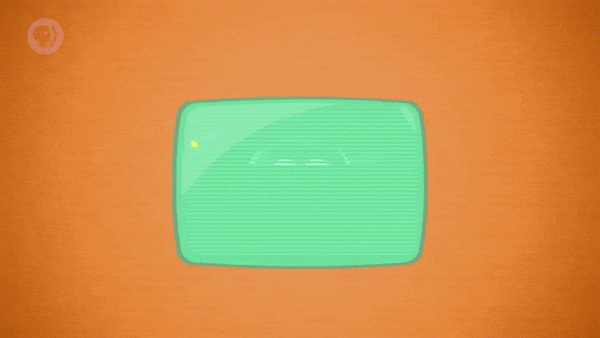

</details>

- 왼쪽 위에서부터 오른쪽 아래로 한 줄씩 이동하는 것을 반복한다.
- 그래픽을 만들기 위해, 이동 중에 특정 지점에서만 전자빔을 켠다.
- 이러한 방식을 **'래스터 주사(Raster Scanning)'** 라고 한다.

<br>

> 이런 식으로 작은 선분으로 이루어진 도형이나 문자 등의 요소들을 화면에 표시할 수 있다.

# 3. 액정표시장치

결국, 디스플레이 기술이 향상되면서 화면에 선명한 점(dot) 들을 렌더링할 수 있게 되었다.

> 이러한 점들은 '화소(pixel)' 라는 이름으로 불리기도 한다.

<br>

<details><summary>오늘날의 '액정표시장치(Liquid Crystal Display)' 에는 전혀 다른 기술이 사용된다.</summary>

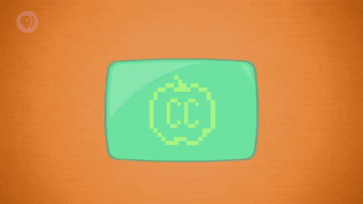

</details>

- 하지만, 이러한 액정표시장치에서도 래스터 주사 방식을 사용한다.
- 아주 작은 빨강, 초록, 파랑 화소의 밝기를 초당 여러 번 갱신하는 방식이다.

<br>

흥미롭게도, 대부분의 초기 컴퓨터는 화소를 사용하지 않았다.

> 물리적으로는 가능했지만, 메모리 사용량이 너무 많았기 때문이었다.

<br>

예를 들어, 200 * 200 픽셀 크기의 이미지에는 총 40,000개의 화소가 포함된다.

- 화소마다 1비트씩만 사용해도 이미지는 40,000비트의 메모리를 소비한다.
- 이 때, 1비트는 흑백(grayscale) 이 아니라, 말 그대로 흑(0) 과 백(1) 이다.
- 40,000비트는 'PDP-1' 이 사용하는 RAM 전체의 절반 이상에 해당하는 규모다.

<br>

따라서, 컴퓨터 과학자와 공학자들은 그래픽을 효율적으로 렌더링하는 기법을 찾아야만 했다.

# 4. 문자 발생기

<details><summary>초기 컴퓨터는 수만 개의 화소 대신, 훨씬 적은 수의 문자 격자(grid) 를 저장했다.</summary>

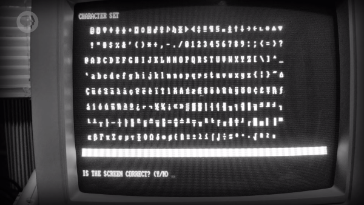

</details>

- 가장 일반적으로는 25자의 문자들을 80개, 총 2,000자의 문자로 구성된다.

<br>

아스키(ASCII) 등을 사용하여 각 문자를 8비트로 인코딩한다고 가정해보자.

- 이 때, 화면 전체를 문자로 가득 채우기 위해, 16,000비트의 메모리가 소비된다.
- 이는 40,000비트를 사용하던 것에 비교했을 때, 훨씬 더 합리적이라고 할 수 있다.

<br>

위와 같은 방식을 사용하기 위해서는, 컴퓨터에 하드웨어를 추가할 필요가 있었다.

> RAM에서 읽어온 문자를 래스터 그래픽으로 변환하여 화면에 그려내는 장치다.

- 이러한 장치를 **'문자 발생기(Character Generator)'** 라고 불렀다.
- 문자 발생기는, 근본적으로 최초의 그래픽 카드(Graphic Card) 였다.

<br>

문자 발생기 내부에는 작은 **'읽기 전용 기억 장치(Read Only Memory, ROM)'** 가 있다.

- 이 때, 읽기 전용 기억 장치에 각 문자를 나타내는 그래픽 요소를 저장한다.
   - 이러한 그래픽 요소들은 '점 행렬(Dot Matrix Pattern)' 이라 부른다.
- 그래픽 카드가 문자 'K' 에 해당하는 8비트 코드를 인식했다고 가정해보자.
   - 문자 발생기는 K의 2차원 형태를 화면의 적절한 위치에 래스터 주사한다.

<br>

이를 위해, 문자 생성기는 컴퓨터 메모리의 일부분에 대한 특별한 접근 권한을 가졌다.

- 바로, **'화면 버퍼(Screen Buffer)'** 라고 불리는, 그래픽을 위해 예약된 메모리 영역이다.
- 컴퓨터 프로그램들은 문자를 화면에 렌더링하기 위해 화면 버퍼에 저장된 값들을 조작했다.
   - 이는 컴퓨터 프로그램이 RAM에 저장된 다른 정보들을 다루는 것과 비슷한 방식이다.

# 5. 아스키 아트

이렇게 문자 생성기를 이용하는 방식은 훨씬 적은 메모리를 사용한다.

> 하지만, 컴퓨터 화면에 그려낼 수 있는 유일한 요소는 문자뿐이었다.

<br>

<details><summary>그런데도, 사람들은 '아스키 아트(ASCII Art)' 를 통해 창의력을 발휘했다.</summary>

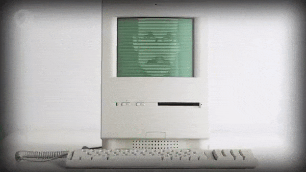

</details>

- 기본 문자 집합으로 기초적인 가상(pseudo) 그래픽 인터페이스를 만들려고 했다.
- 밑줄(\_), 더하기(+) 등의 기호를 사용해, 기타 기본 모양(상자, 선 등) 을 만들었다.

<br>

<details><summary>하지만, 아주 정교한 작업을 처리하기엔, 문자 집합이 너무 작았다.</summary>

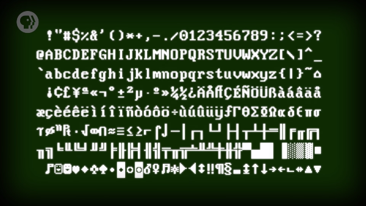

</details>

- 때문에, 반그래픽(semigraphical) 문자가 추가된 다양한 확장 집합이 만들어졌다.
- DOS 운영 체제에서 사용되었던, IBM의 'CP437' 문자 집합을 예로 들 수 있다.

<br>

<details><summary>일부 체계에서는, 추가 비트를 이용해 문자 색상과 배경색을 정의할 수 있었다.</summary>

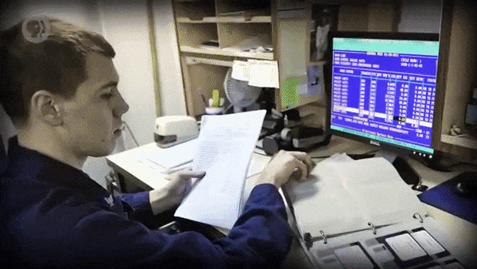

</details>

- 덕분에, DOS 운영 체제의 아름다운 인터페이스를 만들 수 있게 되었다.
- DOS 운영 체제는 실제로, 위에서 살펴본 문자 집합들로만 구성되었다.

# 6. 벡터 그래픽

문자 발생기는 메모리를 적게 사용했지만, 임의의 형태를 그릴 방법을 제공하지 않았다.

- 이는 문자를 제외한 거의 모든 내용(content) 을 화면에 그려낼 수 없다는 뜻이기도 했다. 
- 전기 회로, 건축 계획, 지도 등의 요소를 그리려면, 임의의 모양을 만들 방법이 필요하다.

<br>

이를 위해, 컴퓨터 과학자들은 음극선관에서 사용할 수 있는 벡터 주사를 활용했다.

> 메모리를 많이 사용하는 화소에 의존하지 않는 방법이 필요했기 때문이다.

- 아이디어는 매우 간단한데, 화면에 그려지는 모든 내용을 일련의 선으로 정의하면 된다.

<br>

<details><summary>너비 200, 높이 100, 데카르트 평면(cartesian plane) 이 있다고 가정해보자.</summary>

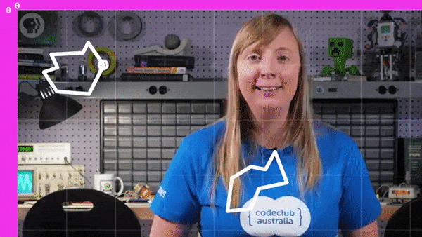

</details>

- 이 때, 원점(origin) 은 (0, 0) 이며, 위치는 왼쪽 위의 모서리라고 가정한다.
- 특정 모양을 화면에 그려낼 수 있는 벡터 명령들을 아래에서 살펴볼 것이다.
   - 이는 초기 벡터 디스플레이 체계인 'Vectrex' 에서 사용되었던 명령들이다.

<br>

<details><summary>우선, 초기 상태로 만들기 위해 재설정(reset) 부터 해야 한다.</summary>

- 화면을 비우고, 전자총(electron gun) 좌표를 원점으로, 선의 밝기를 0으로 설정한다.

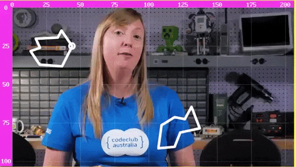

</details>

<details><summary>그런 다음, 좌표를 (50, 50) 으로 이동하고, 선의 밝기 강도를 100%로 설정한다.</summary>

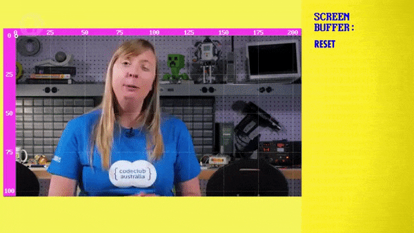

</details>

<details><summary>밝기 강도가 높아졌으니, 좌표를 (100, 50), (60, 75), (50, 50) 의 순서로 이동한다.</summary>

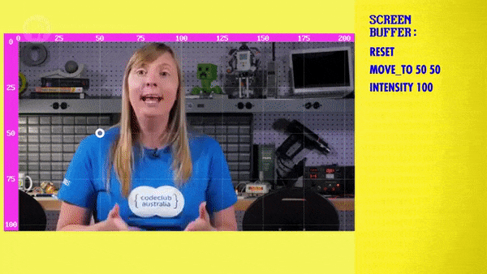

</details>

<details><summary>마지막으로, 선의 밝기 강도를 다시 0%로 설정해야 한다.</summary>

- 이렇게 삼각형을 화면에 그려내는 데에 성공했다!

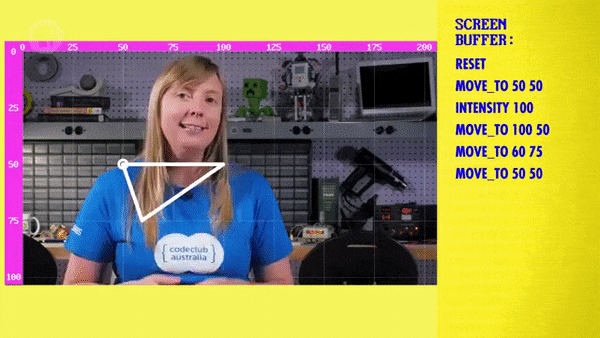

</details>

<br>

이러한 일련의 명령들은 약 160비트의 메모리를 소비한다.

> 이는 화소 값의 행렬을 사용하는 것보다 훨씬 더 효율적이다.

<br>

<details><summary>벡터 명령어들은 메모리에 저장되어, 벡터 그래픽 카드를 통해 화면에 렌더링 된다.</summary>


</details>

- 이는 문자가 메모리에 저장되고, 문자 발생기에 의해 그래픽으로 변환되는 것과 비슷하다.
- 화면 버퍼에 여러 명령을 순차적으로 포장하여, 선으로 구성된 복잡한 그래픽을 만들 수 있다.

<br>

<details><summary>모든 벡터가 메모리에 저장되기 때문에, 컴퓨터 프로그램이 값을 자유롭게 갱신할 수 있다.</summary>

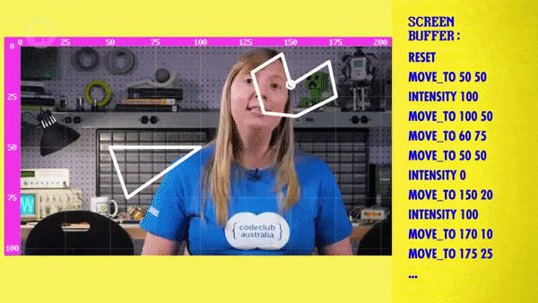

</details>

- 덕분에, 시간 경과에 따라 변화하는 그래픽인 애니메이션도 구현 가능했다.

<br>

최초의 비디오 게임 'Spacewar!' 는 1962년, 'PDP-1' 에서 벡터 그래픽으로 제작되었다.

- 'Spacewar!' 게임은 이후에 등장한 'Asteroids' 와 같은 많은 게임에 영향을 주었다.
- 최초의 상용 아케이드 비디오 게임인 'Computer Space' 도, 이 게임에서 파생되었다.

# 7. 스케치패드

또한, 1962년에는 **'스케치패드(Sketchpad)'** 의 등장이라는 중요한 사건이 일어났다.

- 스케치패드는 '대화형 그래픽 인터페이스(interactive graphical interface)' 다.
   - **'컴퓨터 지원 설계(Computer-Aided Design)'** 를 지원했다.
   - 오늘날에는 단순히 '캐드 소프트웨어(CAD Software)' 라고 부른다.
- 최초의 완전한 '그래픽 응용 프로그램(graphical application)' 으로 여겨진다.
   - 프로그램을 작성한 'Ivan Sutherland' 는 이후에 튜링상을 받았다.

<br>

<details><summary>스케치패드는 그래픽 상호작용을 위해, 라이트 펜(light pen) 이라는 입력 장치를 사용했다.</summary>

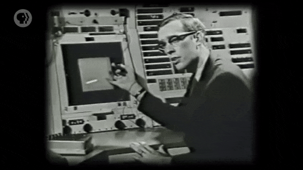

</details>

- 스케치패드와 비슷한 시기에 발명된 라이트 펜은 컴퓨터에 전선으로 연결된 스타일러스다.
- 라이트 펜은 끝 부분의 광센서를 사용하여 컴퓨터 모니터의 변화(refresh) 를 감지했다.
- 컴퓨터는 화면이 변화하는 순간을 통해, 화면 위에 있는 펜의 실제 위치를 파악할 수 있었다.

<br>

<details><summary>사용자는 라이트 펜과 컴퓨터의 다양한 버튼을 이용해, 선(단순한 모양) 을 그릴 수 있었다.</summary>

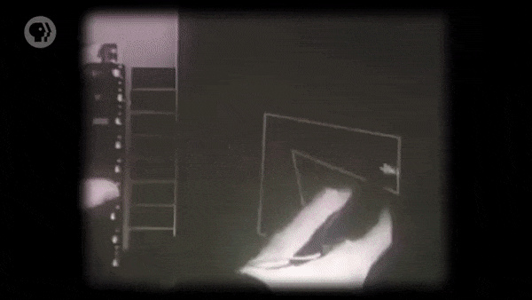

</details>

- 스케치패드가 수행할 수 있는 작업을 간단히 정리하면 아래와 같다.
   - 평행선 또는 같은 길이의 선 그리기
   - 모서리 각도를 90도로 바로잡기
   - 모양의 크기를 동적으로 조정하기
- 이렇게 종이에서는 하기 힘들었던 작업들을, 컴퓨터는 버튼 하나로 처리했다.

<br>

<details><summary>또한, 사용자는 자신이 만든 복잡한 디자인을 저장해, 다양하게 활용할 수 있었다.</summary>

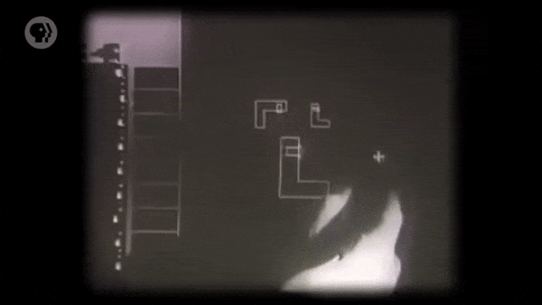

</details>

- 나중에 다른 설계에 붙여넣거나, 다른 사람과 공유할 수도 있었다.
- 다양한 형태들을 포함하는 라이브러리(library) 를 만들 수도 있다.
   - 전자 부품이나 가구 부속 등의 형태를 모아서 저장해두는 것이다.
   - 라이브러리에서 다양한 요소들을 꺼내, 원하는 대로 조작할 수 있다.

<br>

<details><summary>이러한 특징들은 오늘날의 관점에서 봤을 때, 평범하게 느껴질 수도 있다.</summary>

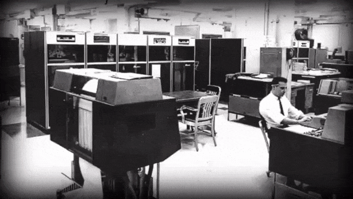

</details>

- 하지만, 1962년의 컴퓨터는 여전히 캐비닛 크기에 천공 카드를 사용하는 기계였다.
- 이러한 시기에 등장한 스케치패드와 라이트 펜은 혁신적이고, 대단한 기술이었다.

<br>

이러한 기술들은 '컴퓨터가 어떻게 사용될 수 있는가?' 에 대한 중요한 전환점이 되었다.

>
보이지 않는 곳에서 이상한 소리를 내며 계산을 수행하는 기계가 아니라,  
조수(assistant) 처럼 상호작용을 통해 다양한 작업을 보조하는 장치가 되었다.

# 8. 비트맵 디스플레이

제대로 된 화소 그래픽을 갖춘 최초의 컴퓨터와 디스플레이는 1960년대 후반에 등장했다.

- 메모리에 저장된 비트가 화면의 화소에 직접 '연결(mapping)' 되었다.
- 따라서, 이는 **'비트맵 디스플레이(bitmapped display)'** 라 불리게 되었다.
- 전체 화소를 제어하여, 완전히 임의로 그래픽을 사용할 수 있게 되었다.

<br>

화면의 그래픽을 화소 값으로 구성된 거대한 행렬로 생각할 수 있다.

- 이전과 마찬가지로, 컴퓨터는 화소 정보를 위한 특별한 메모리 영역을 예약한다.
- 이러한 메모리 영역을  **'프레임 버퍼(Frame Buffer)'** 라고 한다.

<br>

초기에는 컴퓨터 RAM이 사용되었지만, 이후에는 그래픽 카드의 자체 메모리를 사용했다.

- 이와 같은 메모리 장치를 **'비디오 RAM(Video RAM, VRAM)'** 이라 한다.
- 그래픽 카드에 자체적으로 내장되어 있어서, 엄청나게 빠른 속도로 접근할 수 있었다.

<br>

> 오늘날에 사용되는 그래픽 기술들은 위와 같은 방식으로 처리된다.

<br>

<details><summary>8비트 흑백 화면에서는 강도 0의 검은색부터 강도 255의 흰색까지 값을 설정할 수 있다.</summary>

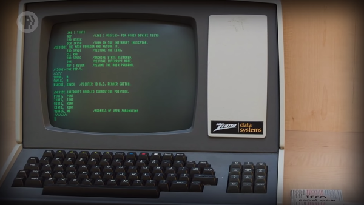

</details>

- 사실, 초기의 많은 디스플레이는 흰색을 제대로 표현하지 못했다.
- 그래서, 원래의 흰색이 녹색이나 주황색으로 표시되는 경우가 많았다.

# 9. 비트맵 그래픽

<details><summary>매우 낮은 해상도(60 * 35) 의 비트맵 화면이 있다고 가정해보자.</summary>

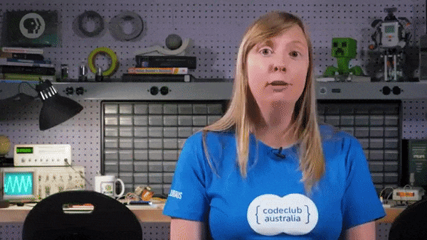

</details>

<details><summary>(10, 10) 의 화소를 흰색으로 설정하기 위해 코드를 작성할 수 있다.</summary>

```
framebuffer[10][10] = 255
```

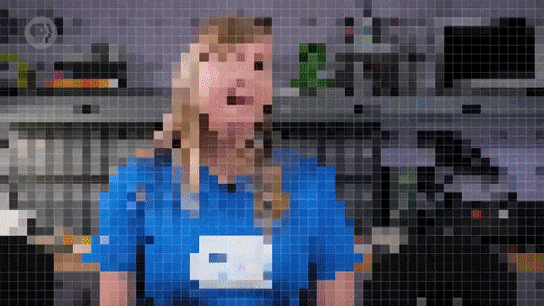

</details>

<details><summary>선을 긋기 위해((30, 0) 에서 (30, 35) 까지) 루프를 사용할 수 있다.</summary>

- 루프 코드는 화소로 구성된 줄 하나를 모두 흰색으로 바꾼다.

```
for y = 0 to 35
    framebuffer[30][y] = 255
next
```

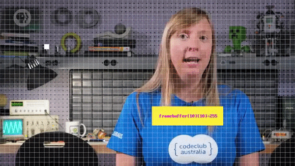

</details>

<details><summary>직사각형처럼 더 복잡한 것을 그리기 위해서는 4개의 값을 알아야 한다.</summary>

- 시작 모서리의 x 및 y 좌표, 너비 및 높이가 필요하다.

```
x = 2
y = 10
width = 4
height = 8
color = 255
```

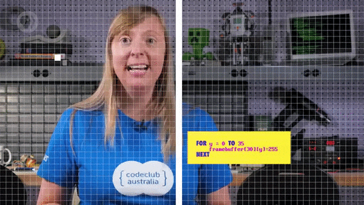

</details>

<details><summary>지금까지는 모든 것을 흰색으로 그렸으니, 이번에는 회색으로 지정할 것이다.</summary>

- 회색은 0 ~ 255 의 중간이므로, 색상 값은 127 이 된다.

```
x = 2
y = 10
width = 4
height = 8
color = 127
```

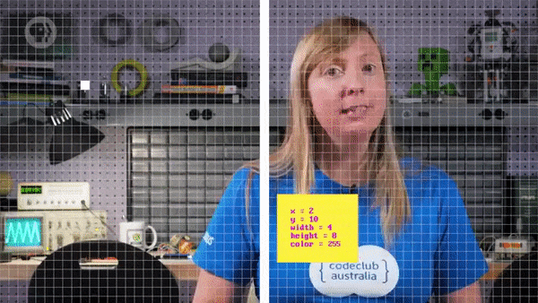

</details>

<details><summary>그런 다음, 두 개의 루프를 사용하여 직사각형을 그릴 수 있다.</summary>

- 하나의 루프가 다른 루프의 내부에 중첩되어(nested) 있다.
- 따라서, 외부 루프가 반복될 때마다 내부 루프가 실행된다. 

```
x = 2
y = 10
width = 4
height = 8
color = 127

for i = x to x + width
    for j = y to y + height
        framebuffer[i][j] = color
    next
next
```

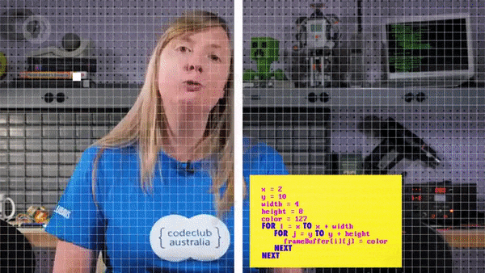

</details>

<br>

> 렌더링 과정 중에 컴퓨터가 코드를 실행하면, 컴퓨터는 지정된 모든 픽셀에 색을 칠한다.

<br>

<details><summary>위에서 사용한 코드를 'drawRectangle' 함수로 포장해보자.</summary>

```
function drawRectangle(x, y, width, height, color)
    for i = x to x + width
        for j = y to y + height
            framebuffer[i][j] = color
        next
    next
return
```

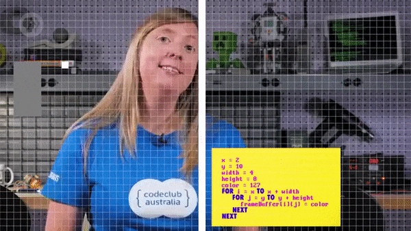

</details>

<details><summary>이번에는 반대편에 두 번째 직사각형(검은색) 을 만들어보자.</summary>

- 직사각형을 그리기 위해 'drawRectangle' 함수를 호출하면 된다.

```
drawRectangle(54, 4, 4, 8, 0)
```

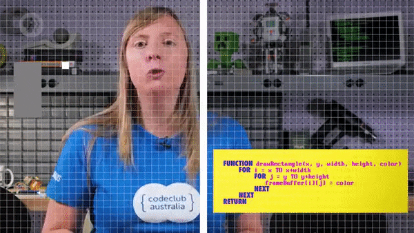

</details>

<details><summary>다른 그래픽 체계처럼, 프레임 버퍼에 저장된 화소 정보를 자유롭게 조작할 수 있다.</summary>

- 이를 이용해, 대화형 그래픽(interactive graphics) 을 만들 수 있다.

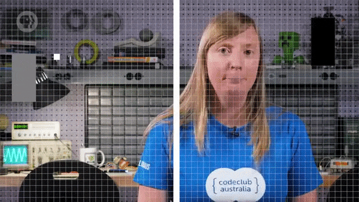

</details>

<br>

물론, 프로그래머는 함수를 처음부터 작성하는 데 시간을 낭비하지 않는다.

- 대신, 즉시 사용 가능한 함수를 포함하는 그래픽 라이브러리를 사용한다.
- 이러한 함수를 이용하면 선, 곡선, 모양, 텍스트 등을 쉽게 그릴 수 있다.
- 이를 통해, 또 다시 새로운 추상화 계층으로 넘어갈 수 있게 되었다.

# 10. 그래픽 인터페이스에 관하여,

비트맵 그래픽의 유연성은 대화형 컴퓨팅에 대한 가능성을 제시했다.

> 하지만, 수십 년 동안은 이러한 기술을 사용하는 데에 큰 비용이 들었다.

<br>

지난 수업에서 살펴봤듯, 1971년 말까지 미국에서는 수많은 컴퓨팅 장치가 사용되었다.

- 전신타자기 약 70,000대, 단말기 약 70,000대가 사용되었다고 추산되었다.
- 놀랍게도, 대화형 그래픽 화면이 있는 컴퓨터의 수는 약 1,000대에 불과했다.

<br>

하지만, 스케치패드와 'Spacewar!' 처럼 선구적인 노력이 있었다.

> 이러한 노력이 컴퓨터 디스플레이를 보편화했다.

<br>

이는, **'그래픽 사용자 인터페이스(Graphical User Interface)'** 로 이어졌다.

> 이와 관련된 내용은, 이후 몇 편의 수업에 걸쳐 다뤄볼 것이다.


<br>

**<작성 중인 글입니다.>**

**<아래 내용은 작성 중입니다.>**

# 배운 점, 느낀 점

- 
