>
해당 포스트는 
Youtube 채널
<a href='https://www.youtube.com/channel/UCX6b17PVsYBQ0ip5gyeme-Q' target='-blank'>'Crash Course'</a>
에서 제공하는 
<a href='https://www.youtube.com/playlist?list=PL8dPuuaLjXtNlUrzyH5r6jN9ulIgZBpdo' target='-blank'>'Computer Science'</a>
수업을 바탕으로 작성되었습니다.  
( 사진 속 인물은
<a href='https://about.me/carrieannephilbin' target='-blank'>'Carrie Anne Philbin'</a>
선생님 입니다! )

# 0. 시작하기에 앞서,

인터넷은 몇 번의 키 입력만으로도 다양한 일을 할 수 있는 놀라운 기술이다.

>
유튜브에서 동영상을 스트리밍 할 수 있고, 위키피디아에서 여러 자료를 읽을 수 있으며,  
아마존에서 물건을 주문하거나, 친구와 화상 채팅을 하거나, 날씨에 대해 트윗할 수 있다.

- 이렇게, 사용자들은 컴퓨터를 이용하여 다양한 정보들을 주고받을 수 있게 되었다.
- 의심할 여지 없이, 이를 가능하게 한 세계적인 통신망 덕분에, 세상은 크게 발전했다.

<br>

<details><summary>150년 정도 전에, 런던에서 캘리포니아로 편지를 보내려면, 2 ~ 3주가 걸렸을 것이다.</summary>


</details>

- 심지어, 2 ~ 3주라는 기간도, 급속 우편(express mail) 으로 보냈을 때나 가능했다.
- 오늘날, 우편 대신 사용하는 이메일을 보내는 데에는 몇 분의 1초 정도밖에 안 걸린다.
- 이처럼, 메시지 전송에 걸리는 시간, 즉, 지연 시간(latency) 이 수백만 배나 단축되었다.
- 이는 세계 경제를 활성화시켰으며, 광섬유 케이블(fiber optic cable) 의 설치로 이어졌다.
- 오늘날에는, 전 세계에 걸쳐있는 광섬유 케이블을 통해 광속 통신을 이용할 수 있게 되었다.

<br>

'컴퓨터와 네트워크는 항상 함께 사용되어왔다.' 라고 생각하는 사람이 있을 수도 있다.

> 하지만 실제로는, 1970년 이전에 사용되었던 거의 모든 컴퓨터는 단독으로만 사용되었다.

<br>

그러나, 큰 규모의 컴퓨터를 사용하는 곳이 늘고, 사무실에는 저가형 장치들이 등장하기 시작했다.

> 그렇게, 정보 및 자원(resource) 공유의 효용이 커졌고, 최초의 컴퓨터 네트워크가 탄생하게 되었다.

<br>

이번 수업부터, 앞으로 3편의 수업에 걸쳐, 아래와 같은 내용에 대해 살펴볼 것이다.

- 컴퓨터 네트워크는 어떻게 탄생하게 되었는가?
- 컴퓨터 네트워크를 구동하는 기본 원리와 기술들

# 1. 스니커넷

최초의 컴퓨터 네트워크는 1950년대와 60년대 사이에 등장했다.

- 당시의 네트워크는, 일반적으로, 기업 및 연구 기관과 같은 조직 내에서 사용되었다.
- 주목적은 '서로 다른 사람이나 컴퓨터 사이의 정보 교환을 쉽게 만들기 위해서' 였다.

<br>

<details><summary>네트워크를 활용하는 것은, 이전의 정보 교환 방식보다 더 빠르고, 안정적이었다.</summary>

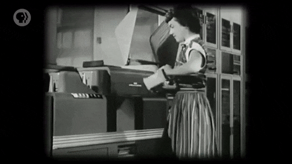

</details>

- 이전의 방식은 천공 카드 뭉치나 자기 테이프 릴을 컴퓨터로 직접 가져가는 방식이었다.
- 이러한 정보 전달 방식은, 나중에 **'스니커넷(Sneakernet)'** 이라는 별명이 붙게 되었다.

<br>

네트워크 활용의 또 다른 이점은, '물리적 자원을 공유할 수 있다' 는 점이었다.

- 예를 들어, 네트워크에 연결된 프린터를 다 같이 공유하여 사용할 수 있다.
- 덕분에, 사무실에 있는 각 컴퓨터에 자체 프린터를 설치할 필요가 없었다.
- 또, 초기 네트워크에서는, 일반적으로 대용량 공유 저장 장치를 사용했다.
- 왜냐하면, 컴퓨터마다 연결하기에는 저장 장치들이 너무 비쌌기 때문이다.

# 2. 근거리 통신망

이러한 초기의 네트워크를 **'근거리 통신망(Local Area Network, LAN)'** 이라고 한다.

- 이는 근접한(close-by) 컴퓨터들 사이의 네트워크이며, 규모는 비교적 작은 편에 속한다.
- 규모는 '컴퓨터 두 대가 있는 방' 에서 '수천 대 컴퓨터가 있는 대학 캠퍼스' 까지 다양하다.

<br>

<details><summary>시간이 흐르면서, LAN에 관련된 기술들이 엄청나게 많이 개발되었고, 또, 배포되었다.</summary>

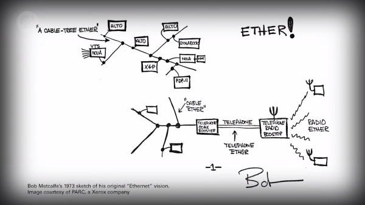

</details>

- 하지만, 그중에서도 가장 유명하고, 성공적이었던 것은 바로, **'이더넷(Ethernet)'** 이다.
- 이더넷은 1970년대 초, 'Xerox PARC' 에서 개발되어, 오늘날에도 널리 사용되고 있다.

<br>

<details><summary>LAN의 가장 간단한 형태는 '여러 컴퓨터가 하나의 이더넷 케이블에 연결되는 형태' 다.</summary>


</details>

<details><summary>다른 컴퓨터로 정보를 전송할 땐, 정보를 전기 신호로 변환하여 케이블에 써넣는다.</summary>

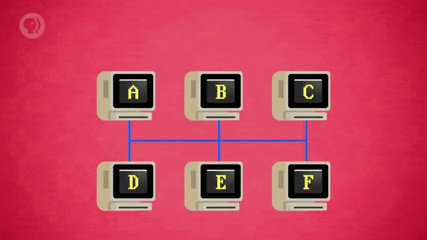

</details>

<details><summary>물론, 네트워크에 연결된 모든 컴퓨터는 전송(transmission) 을 확인할 수 있다.</summary>

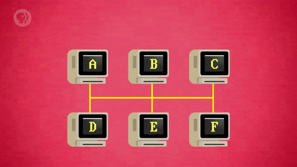

</details>

- 하지만, 전송된 정보가 그중에 어떤 컴퓨터를 위한 정보인지는 알 수 없다.

# 3. 매체 접근 제어

이더넷의 문제를 해결하려면, **'매체 접근 제어(Media Access Control, MAC)'** 가 필요하다.

> 네트워크에 연결된 모든 컴퓨터에, 고유한 MAC 주소(MAC Adress) 를 부여하는 것이다.

<br>

<details><summary>고유한 MAC 주소는, 네트워크를 통해 전송되는 모든 정보의 접두사, 즉, 헤더에 입력된다.</summary>

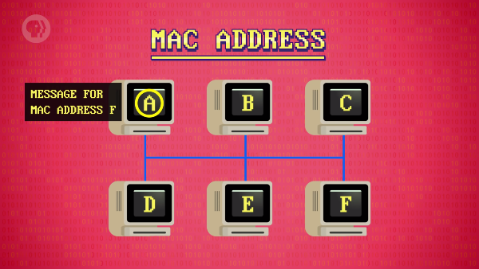

</details>

<details><summary>컴퓨터는 단순히 이더넷 케이블에서 받은 헤더의 주소가 맞을 때만 정보를 처리한다.</summary>

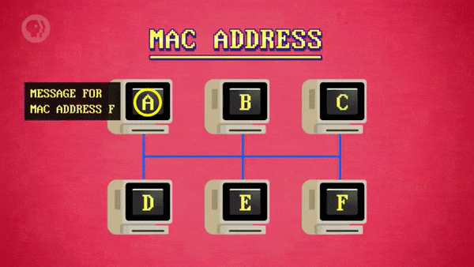

</details>

<details><summary>이러한 절차를 통해 정보를 주고받으면, 네트워크는 문제 없이 잘 작동한다.</summary>

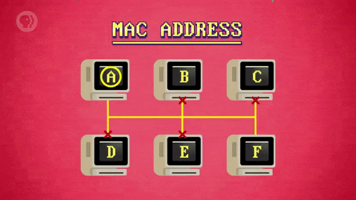

</details>

<br>

> 오늘날에 제조되는 모든 컴퓨터에는 이더넷, 와이파이에 대해 고유한 MAC 주소가 있다.

<br>

이러한 접근법을 **'반송파 감지 다중 접속(Carrier Sense Multiple Access, CSMA)'** 이라 한다.

- 여기서, 반송파(carrier) 는 '컴퓨터들이 공유하는, 정보 전달에 사용하는 전송 매체' 다.
- 이더넷의 반송파는 '구리선', 와이파이의 반송파는 '무선 전파를 전달하는 공기' 가 된다.
- '여러 장치가 동시에(multiple access) 반송파(carrier) 를 감지(sense) 한다.' 는 뜻이다.
- 이 때, 반송파의 속도 또는 정보가 전송되는 속도를 '대역폭(bandwidth)' 이라고 한다.

# 4. 지수 백오프

<details><summary>안타깝게도, 하나의 반송파를 공유해서 사용하는 방식에는, 큰 단점이 하나 있다.</summary>

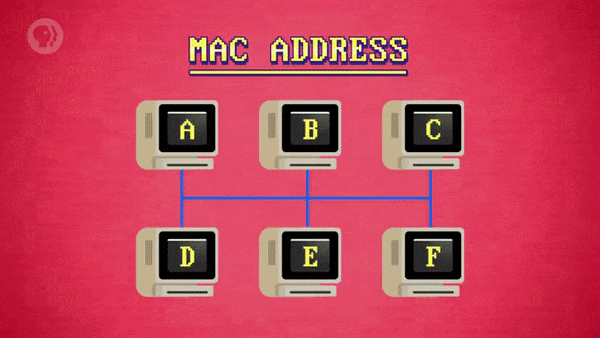

</details>

- 네트워크 트래픽이 적으면, 컴퓨터는 반송파가 잠잠해진(silence) 이후에, 정보를 전송하면 된다.
- 하지만, 네트워크 트래픽이 증가하면, 컴퓨터 두 대가 동시에 정보를 쓰려고 할 확률도 증가한다.
- 이러한 현상을 **'충돌(Collision)'** 이라고 하며, 충돌을 일으킨 정보들은 엉망진창으로 뒤섞인다.
- 충돌 현상은 '통화 중인 두 사람이 동시에 말해서, 서로의 목소리가 섞이는 상황' 에 비유할 수 있다.

<br>

다행히도, 컴퓨터는 유선으로 전달된 신호를 통해 이러한 충돌을 감지할 수 있다.

- 가장 확실한 해결책은, 전송을 멈췄다가, 반송파가 잠잠해지면 다시 시도하도록 하는 것이다.
- 문제는, 이 해결책을 시도한 또 다른 컴퓨터가, 대기 중인 컴퓨터들과 충돌하게 된다는 것이다.
- 이렇게 되면, 더 많은 충돌이 발생하게 되고, 결국, 거의 모든 컴퓨터가 대기 상태가 될 것이다.

<br>

이더넷은 놀라울 정도로 간단하면서도, 효과적인 해결책을 가지고 있었다.

- 정보를 전송 중이던 컴퓨터가 충돌을 감지하면, 재전송을 시도하기 전에 잠시 대기하게 된다.
- 이 때, 모든 컴퓨터의 대기 시간을 1초라고 가정하면, 대기 시간이 같아서, 결국, 다시 충돌한다.

<br>

따라서, '한 컴퓨터는 1.3초, 다른 컴퓨터는 1.5초' 와 같이, 모든 대기 시간을 임의로 추가한다.

- 운이 좋다면, 1.3초의 대기를 마친 컴퓨터가 반송파가 잠잠해짐을 확인하고 전송을 시작할 것이다.
- 이후, 1.5초의 대기를 마친 컴퓨터는 반송파가 사용 중임을 확인하고, 다른 컴퓨터를 기다릴 것이다.

<br>

이러한 방법이 도움은 되지만, 문제를 완전히 해결하진 않기 때문에, 추가적인 기법이 사용된다.

- 위에서 설명했듯, 컴퓨터가 전송 중에 충돌을 감지하면, '1초 + 임의의 추가 시간' 을 기다린다.
- 하지만, 네트워크 정체로 인해 다시 충돌하면, 이번에는 1초가 아닌, 2초를 기다리도록 한다.
- 만약, 다시 충돌하면, 4초, 8초, 16초, .. 처럼, 성공할 때까지, 대기 시간을 늘리면서 기다린다.

<br>

이렇게, 컴퓨터가 대기열에서 물러나면(backoff), 충돌이 발생하는 비율이 점점 줄어든다.

- 그러다가 결국, 정보들이 다시 전달되기 시작하면서, 네트워크 정체가 해소된다.
- 대기 시간을 기하급수적(exponential) 으로 늘려서, 전체 속도를 낮추는 것이다.
- 이러한 충돌 해결 방법을 **'지수 백오프(Exponential Backoff)'** 라고 한다.
- 지수 백오프 기법은 이더넷, 와이파이 외에도, 다양한 전송 프로토콜에서 사용된다.

# 5. 충돌 도메인

하지만, 일정 수 이상의 컴퓨터를 하나의 이더넷 케이블에 연결하는 것에는 무리가 있다.

> 지수 백오프가 아무리 좋은 방법이라고 해도, 결국 속도가 느려질 것이기 때문이다.

<br>

충돌을 줄이고 효율성을 높이려면, 반송파마다, '공유하는 장치의 수' 를 줄여야 한다.

> 이 때, 각각의 반송파를, **'충돌 도메인(Collision Domain)'** 이라고 한다.

<details><summary>앞에서 살펴본 '하나의 케이블에 6대의 컴퓨터가 연결된 이더넷 예시' 로 돌아가 보자.</summary>

- 이 때, 반송파가 되는 하나의 케이블을, 하나의 충돌 도메인이라고 할 수 있다.

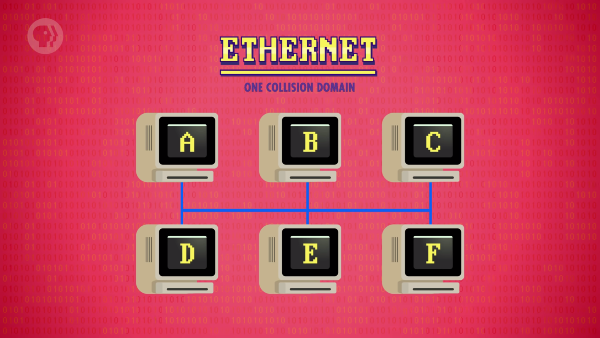

</details>

<details><summary>충돌 가능성을 줄이기 위해, 네트워크 스위치를 사용하여 네트워크를 분리할 수 있다.</summary>

- 이렇게, 스위치를 기준으로 구역이 나뉘면서, 충돌 도메인의 개수가 둘로 늘어난다.

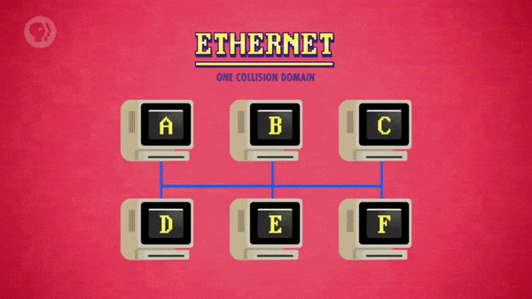

</details>

<br>

네트워크 스위치는 작은 네트워크 사이에 있으며, 필요한 경우에만 정보를 전달한다.

> 이러한 작업을 수행하려면, 각 네트워크에 있는 MAC 주소의 목록을 유지해야 한다.

<details><summary>따라서, 정보를 A에서 C로 전송할 때, 불필요한 네트워크에는 정보를 전달하지 않는다.</summary>

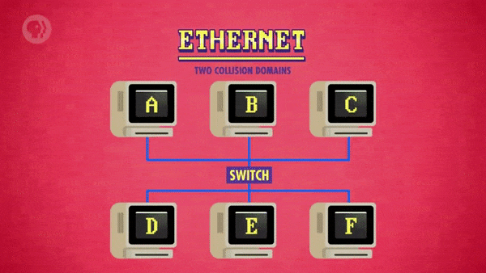

</details>

<details><summary>즉, 여기서, E가 F로 정보를 전송해도, 전송 작업을 동시에 수행할 수 있다는 뜻이다.</summary>

- 아래에서 볼 수 있듯, 현재 E와 F가 속한 네트워크는 전송 작업이 가능한 상태다.

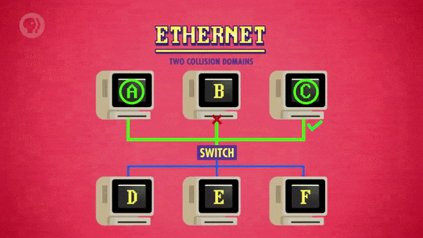

</details>

<details><summary>그러나, F에서 A로 정보를 보내면, 아주 잠깐은, 두 개의 네트워크가 동시에 사용된다.</summary>

- 이는 정보가 네트워크 스위치를 통과하여, 다른 네트워크로 전달되기 때문이다.

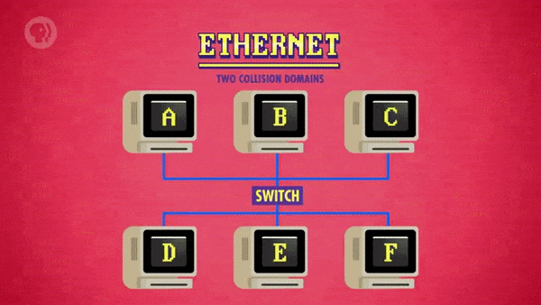

</details>

<br>

<details><summary>지금까지, 규모가 큰 컴퓨터 네트워크들을 구성하는 기본적인 원리들에 대해 살펴봤다.</summary>


</details>

- 그중에서도 규모가 가장 큰 컴퓨터 네트워크인 **'인터넷(Internet)'** 도 이러한 원리로 구성된다.
- 인터넷은 여러 작은 네트워크를 상호 연결하여, 네트워크 간(inter-network) 통신을 허용한다.

# 6. 회선 교환

<details><summary>규모가 큰 네트워크의 흥미로운 점은, 정보를 주고받는 경로가 여러 개라는 것이다.</summary>

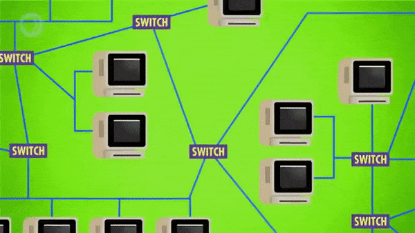

</details>

- 한 장소에서 다른 장소로 정보를 전달할 수 있는 경로가, 하나 이상 있다.
- 이는 네트워크의 기본 주제 중 하나인 **'라우팅(Routing)'** 과 관련이 있다.

<br>

<details><summary>서로 다른 두 컴퓨터를 연결하는 가장 간단한 방법은 전용 통신 회선을 할당하는 것이다.</summary>

- 네트워크 연결도 마찬가지이며, 초기의 전화 체계도 이러한 방식으로 운용되었다.


</details>

<details><summary>예를 들어, 인디애나폴리스와 미줄라 사이에 5개의 전화선이 있다고 가정해보자.</summary>

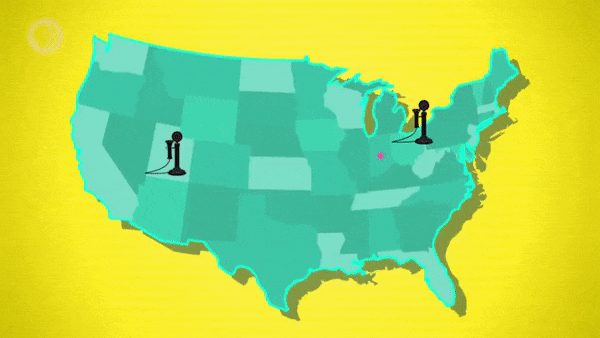

</details>

<details><summary>1910년대에, 존이라는 사람이 행크라는 사람에게 전화를 거는 상황이라고 가정한다.</summary>

- 이 때, 존은 자신이 전화하고자 하는 장소가 어디인지를 교환원에게 알려줘야 했다.
- 이후, 교환원은 존의 전화선을 미줄라로 연결되는 미사용 회선에 물리적으로 연결한다.
- 이렇게, 존과 행크의 통화가 진행되는 중에, 해당 회선은 사용 중인 상태로 처리된다.

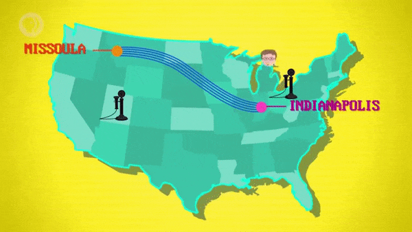

</details>

<details><summary>만약 모든 회선이 사용 중이었다면, 존은 다른 통화가 끝날 때까지 기다려야 했을 것이다.</summary>

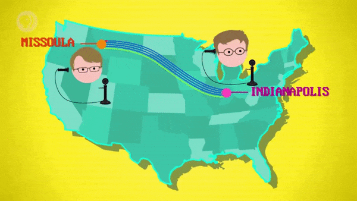

</details>

<br>

이렇게, 트래픽을 올바른 대상으로 라우팅하기 위해, 전체 회로를 전환한다.

- 때문에, 이러한 접근 방식을 **'회선 교환(Circuit Switching)'** 이라고 한다.
- 문제없이 잘 동작하는 편이지만, 비교적 유연성이 떨어지며, 비용이 많이 든다.
- 왜냐하면, 사용 가능한 회선이 사용되지 않는 경우가 자주 발생하기 때문이다.

<br>

<details><summary>좋게 생각해보면, 전용 회선이나 구성 비용만 있어도 충돌/간섭 없이 사용할 수 있다.</summary>

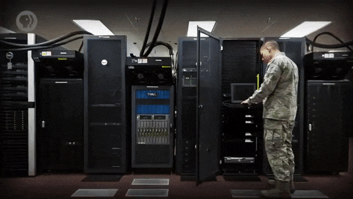

</details>

- 이러한 이유로, 중요도가 높은 기관들은 여전히 전용 회로를 구매하여 사용한다.
- 군대나 은행의 경우, 전용 데이터 센터를 구축/연결하기 위해 전용 회로를 구매한다.

# 7. 메시지 교환

회선 교환 외에도, **'메시지 교환(Message Switching)'** 이라는 접근 방식이 있다.

- 메시지 교환은 우편 체계가 운용되는 방식과 아주 비슷하게 작동한다.
- 메시지는 A와 B를 잇는 전용 경로 대신, 여러 중간 지점을 거쳐서 이동한다.

<br>

<details><summary>따라서, 존이 행크에게 편지를 쓰면, 중간에 있는 도시들을 거쳐 이동하게 된다.</summary>

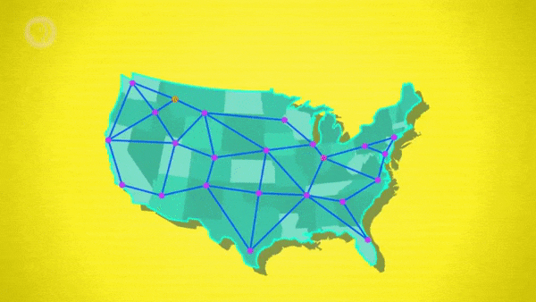

</details>

- 인디애나폴리스에서 시카고, 미니애폴리스, 빌링스를 거쳐, 결국 미줄라에 도착한다.
- 이 때, 각 중간 지점은, '편지를 전달할 수 있는 장소' 가 정리된 표를 유지하고 있다.
- 따라서, 목적지 주소가 주어지면, 각 중간 지점은 다음 장소가 어디인지를 확인한다.

<br>

메시지 교환 방식의 장점은 서로 다른 경로, 즉, 다양한 경로를 사용할 수 있다는 것이다.

> 덕분에, 통신은 훨씬 더 안정화되며, **'내결함성(Fault-Tolerant)'** 을 지니게 된다.

<br>

<details><summary>예시로 돌아가서, 미니애폴리스에 눈보라가 몰아쳐, 모든 업무가 멈췄다고 가정해보자.</summary>

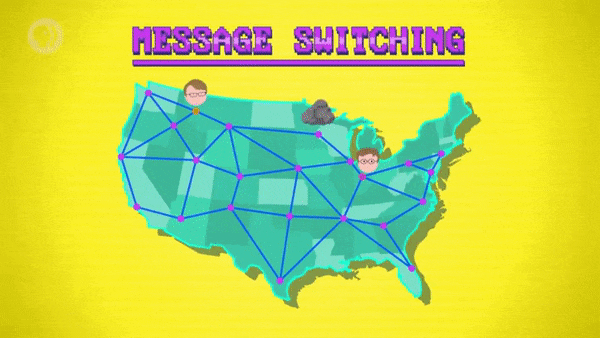

</details>

- 시카고 메일 허브는 미니애폴리스 대신, 오마하를 거쳐서 편지를 전달할 수 있다.
- 이 때, 예시에 등장한 이러한 도시들은 네트워크 라우터와 비슷한 역할을 한다.

<br>

이 때, 메시지가 건너뛰는(hop) 경로의 수를 **'홉 카운트(Hop Count)'** 라고 한다.

> 홉 카운트를 추적하는 것은 라우팅 문제를 식별하는 데 도움이 되기 때문에 아주 유용하다.

<br>

예를 들어, 미줄라를 목적지로 하는 어떤 메시지를 전달하는 상황이라고 가정해보자.

- 이 때, 시카고 라우터는 오마하를 거치는 경로를 가장 빠른 경로로 인식하고 있다.
- 반대로, 오마하 라우터는 시카고를 거치는 경로를 가장 빠른 경로로 인식하고 있다.
- 결국, 서로가 서로를 다음 목적지로 지정하여, 메시지를 계속 주고받게 될 것이다.

<br>

이는 대역폭 낭비로 이어질 것이기 때문에, 이러한 라우팅 오류는 꼭 해결되어야 한다.

- 보통, 홉 카운트의 값은 메시지와 함께 저장되며, 정보 전달 과정에서 계속해서 갱신된다.
- 따라서, 메시지의 홉 카운트가 크다면, 해당 메시지에 오류나 문제가 있다는 것을 알 수 있다.
- 이 때, 오류 판별 기준이 되는 임계 값(threshold) 을 **'홉 제한(Hop Limit)'** 라고 한다.

# 8. 인터넷 프로토콜

메시지 교환의 단점은, '크기가 큰 메시지 때문에, 네트워크가 정체될 수 있다.' 는 것이다.

- 왜냐하면, 메시지 내용 전체가 다음 지점으로 전송되어야, 통신이 계속 진행되기 때문이다.
- 예를 들어, 크기가 큰 파일이 전송되는 동안에는, 해당 연결 경로를 아예 사용할 수 없게 된다.
- 때문에, 1KB 크기의 메일을 보낼 때도, 이를 기다리거나, 덜 효율적인 경로를 선택해야 한다.

<br>

대규모 전송 작업을 **'패킷(Packet)'** 이라는 작은 조각으로 나누면, 이를 해결할 수 있다.

- 메시지 교환과 마찬가지로, 패킷마다 목적지 주소가 있어서, 라우터가 다음 장소를 확인할 수 있다.
- 이러한 형식을 정의하는 **'인터넷 프로토콜(Internet Protocol, IP)'** 은 1970년대에 만들어졌다.

<br>

인터넷 프로토콜은 네트워크에 연결된 모든 컴퓨터에 **'IP 주소(IP Address)'** 를 부여한다.

- 아마, '점을 사이에 두고 나열된, 4개의 8비트 숫자' 의 형태인 IP 주소를 본 적이 있을 것이다.
- 예를 들어, '172.217.7.238' 이라는 IP 주소는, 구글에서 사용하는 서버 중 하나에 대한 주소다.

<br>

온라인에 연결된 수백만 대의 컴퓨터가 패킷 단위로 정보를 주고받는 상황이라 가정해보자.

- 이 때, **'병목(Bottle Neck)'** 현상이 발생하거나, 제거되는 시간은 모두 밀리 초 단위다.
- 또, 라우터는 속도와 안정성을 보장하기 위해, 가능한 모든 경로에서, 트래픽 양을 조절한다.
- 네트워크의 충돌을 막는 이러한 방식을 **'혼잡 제어(Congestion Control)'** 라고 한다.

# 9. 패킷 교환

<details><summary>같은 메시지에 대한 서로 다른 패킷들이, 각자 다른 경로를 통해 전송되기도 한다.</summary>

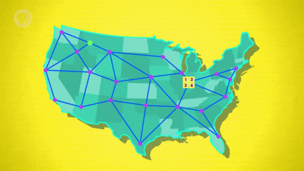

</details>

- 이 때, 패킷의 순서가 섞이게 되면, 일부 응용 프로그램에서는 문제가 될 수 있다.
- 다행히, 인터넷 프로토콜에는 이러한 문제를 처리하는 'TCP/IP' 와 같은 규약이 있다.  
  `('TCP/IP' 에 관한 내용은 다음 수업에서 좀 더 자세하게 살펴볼 것이다.)`

<br>

정보를 작은 패킷들로 나눠, 여유가 있는 경로로 유연하게 전달하는 방식에 대해 살펴봤다.

- 이는 효율적이고 내결함성이 있으며, 오늘날의 인터넷에서 사용되는 방식이다.
- 이러한 라우팅 접근 방식을 **'패킷 교환(Packet Switching)'** 이라고 한다.

<br>

또한, 패킷 교환의 특징은 '탈중앙화된(decentralized)' 분산형 네트워크를 구성한다는 것이다.

- 이는, 네트워크 핵심 권한이나 '단일 장애점(single point of failure)' 이 없음을 의미한다.
- 사실, 냉전 기간에 패킷 교환이 개발된 이유는, 핵 공격에 관련된 위협이 있었기 때문이었다.

<br>

오늘날, 전 세계에 있는 라우터들은 더 효율적인 라우팅 방식을 찾기 위해 협력하고 있다.

- 이들은 서로 정보를 교환하기 위해, 'ICMP' 나 'BGP' 와 같은 특수 프로토콜을 사용한다.

```
ICMP : 인터넷 제어 메시지 프로토콜(Internet Control Message Protocol)
BGP  : 경계 경로 프로토콜(Border Gateway Protocol)
```

# 10. 아파넷

세계 최초의 패킷 교환 네트워크이자, 현대 인터넷의 조상은 **'아파넷(ARPANET)'** 이다.

- '고등연구계획국(Advanced Research Projects Agency)' 의 이름을 따서 명명되었다.
- 고등연구계획국은 미국 국방성 소속 기관이며, 아파넷이 개발될 수 있도록 자금을 지원했다.

<br>

<details><summary>1974년 당시, 아파넷의 전체 구성이 어떤 형태였는지 살펴보자.</summary>

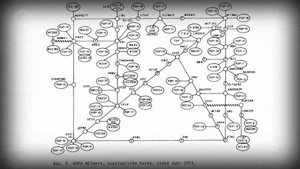

</details>

- 각각의 작은 원은, 대학이나 연구 기관처럼 라우터를 운영하는 장소를 나타낸다.
- 또한, 각각의 선은 연결을 나타내며, 라우터들은 한 대 이상의 컴퓨터를 연결했다.
- 'PDP-1', 'IBM System/360', 심지어 런던에 있는 'Atlas' 도 연결되어 있다.  
  `('Atlas' 는 유선이 아닌, 위성 경로(satellite link) 로 연결되었다.)`

<br>

<details><summary>분명한 사실은, 그 이후로 수십 년간, 인터넷이 비약적으로 성장해왔다는 것이다.</summary>

- 이전에는, 수십 대의 컴퓨터를 연결했지만, 오늘날에는, 약 100억 대의 컴퓨터가 연결된 것으로 추산된다.


</details>

<details><summary>또한, 와이파이와 연결되는 냉장고나 온도 조절기와 같은 스마트 기기들도 등장했다.</summary>

- 이러한 기기들의 네트워크를 **'사물 인터넷(Internet of Things)'** 이라고 한다.
- 여러 기기의 등장과 함께, 인터넷에 관련된 기술들은 점점 더 빠르게 성장하고 있다.


</details>

<br>

이렇게, 네트워크 시리즈의 첫 번째 주제로, 네트워크에 대한 전반적인 내용, 즉, 개요를 살펴봤다.

- 다음 수업에서는, 다른 전송 프로토콜과 함께, **'월드 와이드 웹(World Wide Web)'** 으로 넘어가 보자.


<br>

**<작성 중인 글입니다.>**

**<아래 내용은 정리 중입니다.>**

# 배운 점, 느낀 점

네트워크 등장 이전에 정보를 주고받던 방식과 네트워크 동작의 기본 원리에 대해 배웠다.

- 네트워크가 없던 시기에 정보를 교환하기 위해선, 사람이 저장 장치를 직접 옮겨야 했다.
- 최초의 컴퓨터 네트워크는 이런 비효율적인 정보 교환 방식을 개선하기 위해 개발되었다.
- 그렇게, 가까이 있는 컴퓨터들 사이의 작은 네트워크인 근거리 통신망이 등장하게 되었다.
- 정보를 전기 신호로 변환하여 케이블에 써넣으면, 다른 컴퓨터로 정보를 전송할 수 있다.
- 또, 정보 전달 대상을 지정하기 위해, 컴퓨터마다 고유한 매체 접근 제어 주소를 사용했다.
- 이 때, 매체 접근 제어 주소는 전송되는 정보의 접두사에 해당하는 헤더 부분에 저장된다.

<br>

트래픽이 증가했을 때, 네트워크 정체의 해결 방법과 효율성을 높이는 방법에 대해 배웠다.

- 같은 네트워크에 연결된 컴퓨터들이 동시에 정보를 전송하면, 충돌 현상이 발생하게 된다.
- 트래픽이 증가하면 충돌을 더 자주 일으키게 되기 때문에, 네트워크 정체 현상이 발생한다.
- 따라서, 충돌을 막기 위해, 재전송 대기 시간을 기하급수적으로 늘어나도록 지정할 수 있다.
- 이렇게, 대기 시간으로 네트워크 속도 낮춰 정체를 해결하는 방법을 지수 백오프라고 한다.
- 네트워크 스위치를 사용해 구역을 분리하면, 충돌 가능성을 줄이고 효율성을 높일 수 있다.
- 이 때, 네트워크 스위치는 통로의 역할을 하며, 분리된 구역들은 충돌 도메인이라고 한다.
- 스위치가 활성화되지 않는 이상, 충돌 도메인들은 서로 독립적으로 통신을 진행할 수 있다.
- 때문에, 충돌을 일으킬 가능성이 더 줄어들면서, 통신 효율성이 전체적으로 높아지게 된다.

<br>

큰 규모의 네트워크에서, 트래픽 전달 경로를 선택하는 절차와 각각의 특징에 대해 배웠다.

<br>

오늘날에 사용되는 인터넷의 기반이 된 통신 방식과 그것을 정의하는 규약에 대해 배웠다.

