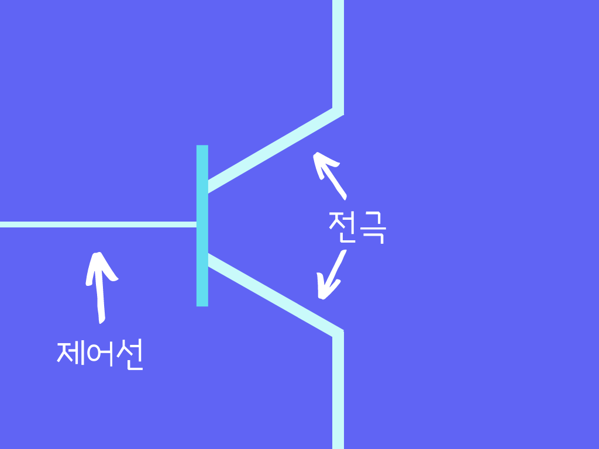
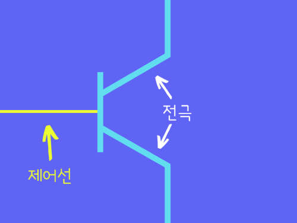
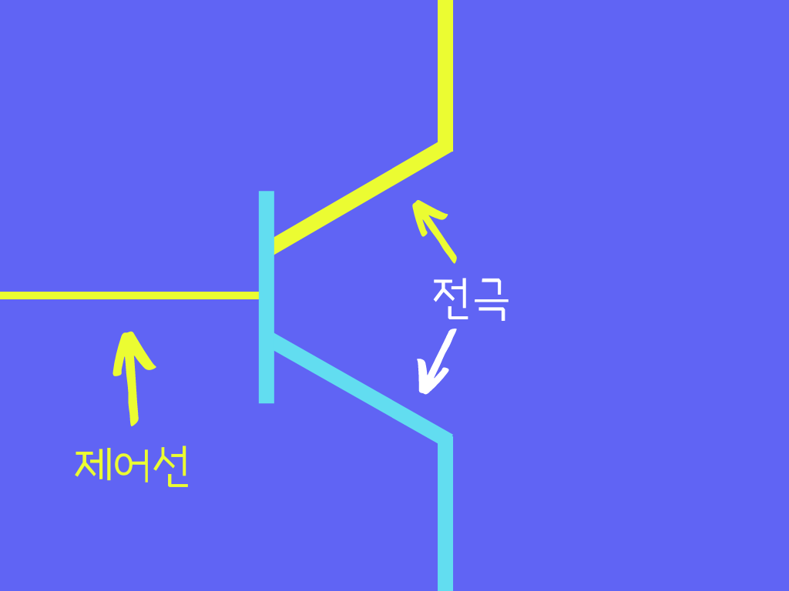
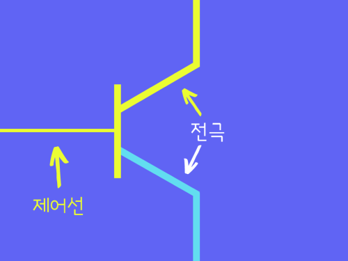
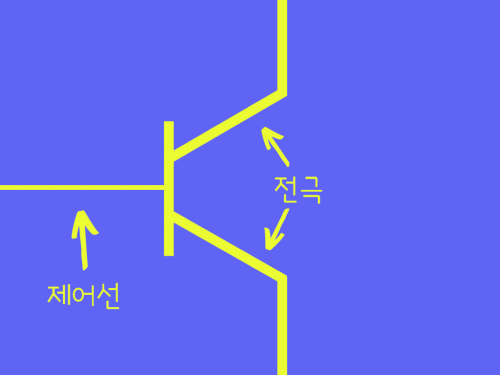
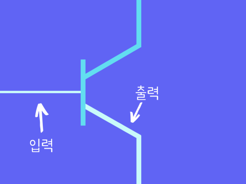

>
해당 포스트는 
Youtube 채널
<a href='https://www.youtube.com/channel/UCX6b17PVsYBQ0ip5gyeme-Q' target='-blank'>'Crash Course'</a>
에서 제공하는 
<a href='https://www.youtube.com/playlist?list=PL8dPuuaLjXtNlUrzyH5r6jN9ulIgZBpdo' target='-blank'>'Computer Science'</a>
수업을 바탕으로 작성되었습니다.  
( 사진 속 인물은
<a href='https://about.me/carrieannephilbin' target='-blank'>'Carrie Anne Philbin'</a>
선생님 입니다! )

# 0. 시작하기에 앞서,

이번 글에서 우리는 컴퓨팅과 관련된 추상화의 개념을 단계적으로 습득할 것이다.

스위치와 기어처럼 눈에 보이는 단순한 단계에서부터,  
점점 더 복잡해지는 체계들을 조합할 수 있는 단계까지 말이다.

# 1. 이진법

지난 글에서 우리는, 기어의 톱니바퀴로 10진법을 표현한 전기기계적 장치가  
트랜지스터로 전기의 흐름을 켜고 끄는 전자 컴퓨터까지 발전해온 과정을 공부했다.

다행히 우리는 이런 2가지의 전기적 상태만으로도 중요한 정보를 표현할 수 있는데,  
이런 표현 방식을 **이진(Binary)** 이라고 부른다.

## 1-1. 의미

자전거나 2족 보행 동물이 두 개의 바퀴, 다리를 갖고있는 것처럼  
말 그대로 '두 가지 상태의'(이항성의) 라는 의미를 갖는다.

사실 두 가지 상태만으로는 할 수 있는 것이 별로 없지만,  
우리에게 정말 필요한 것은 **참과 거짓을 구분지어 나타내는 것**이다.

컴퓨터에서 전기가 흐르는 'On' 상태는 참을 나타내고,  
전기가 흐르지 않는 'Off' 상태는 거짓을 나타낸다.

>
참과 거짓이라는 표현은 '0' 과 '1' 로 대체할 수 있는데,  
이것은 같은 신호의 다른 표현들일 뿐이지만 다음 수업에서 더 알아볼 것이다.

## 1-2. 계기

사실 트랜지스터는 켜고 끄는 것 뿐만 아니라, 전류의 세기를 조절할 수도 있었는데,  
초기 전자 컴퓨터들 중 일부는 3진법(ternary)이나 5진법(quinary)을 사용하기도 했다.

이런 장치들의 문제는 다음과 같다.

- 전기 신호 범위가 늘어날수록 각 상태를 구분짓는 것이 더 어려워진다.  
- 전기 신호에 혼동을 줄 수 있는 요인이 매우 많다.
   - 사용 중인 장치(스마트폰 등)의 배터리 부족
   - 전자파 이용 장치(전자레인지 등)로 인해 발생하는 전기적 잡음

(트랜지스터의 신호 전환이 초당 수백만 번인 경우 상황은 더 심각해진다.)

이런 문제들을 최소화하기 위해 신호의 구분을 뚜렷하게 할 필요가 있었고,  
신호를 가능한 멀리 배치하기 위해 'On' 과 'Off' 만을 이용하게 됐다.

# 2. 부울 대수

두 가지 전기 신호만을 이용한다는 것은,  
계산에 참과 거짓만을 사용해야한다는 것이다.

어떻게 참과 거짓만으로 수학적인 계산을 할 수 있었을까?

 

다행히도, 참과 거짓에 대해서만 다루는 수학 분야는 이미 존재했다. 

바로, 이진법 조작에 필요한 모든 규칙과 연산을 밝혀낸 'Boolean Algebra' 이다.  
(이 글에선 '부울 대수' 라고 부를 것이다.)

## 2-1. 유래

부울 대수는 1800년대 영국의 수학자인 'George Boole' 의 이름을 따서 만들어졌는데,

독학으로 수학자가 된 그는 'Aristotle' 의 철학에 기반한 논리에 대한 접근,  
'under, over, and beyond' 라는 논리적 상태 표현에 관심이 있었다.

>
수학과 논리에 대한 부울의 접근 방식은
>
1847년에 그의 첫 저서인 'The mechematical analysis of logic' 에서  
논리 방정식을 통해 체계적으로 증명되었고, 공식적으로 인정받았다.

## 2-2. 대수학과의 비교

'평범한' 대수학에서 변수의 값은 숫자, 연산은 덧셈이나 곱셈이지만,  
부울 대수에선 참과 거짓을 변수로 하고 논리적 연산을 사용한다. 

부울 대수에는 세 가지 기본 연산인 'NOT', 'AND', 'OR' 이 있고,  
이 연산들은 매우 유용하다고 밝혀졌다.

이제 각각의 연산을 하나씩 살펴보자.

# 3. 부정 연산(NOT)

부정 연산은 참 또는 거짓의 값을 취하여 부정하는 연산이다.  
(참은 거짓으로, 거짓은 참으로 뒤집는다.)

여기서 원본 값을 '입력' (input) 아래에  
연산의 처리 결과를 '출력' (output) 아래에 작성하면,

논리표를 작성할 수 있다.

| 입력 | 출력 |
|-|-|
| 참 | 거짓 |
| 거짓 | 참 |

 

이제, 부정 연산을 처리하는 트랜지스터 회로를 구성해보자. (두근두근)

## 3-1. 트랜지스터 (복습)

지난 글에서, 트랜지스터가 전기적으로 조작되고 작은 스위치라는 것을 알게됐다.

>
2개의 전극과 1개의 제어선, 총 3개의 전극으로 구성되어 있다.

 

### 3-1-1. 동작 방식

그림과 함께 간단하게 살펴보자.

1. 제어선에 전기를 공급하면

2. 한 전극에서 흐르던 전류가

3. 트랜지스터를 통해

4. 다른 전극으로 흐르게된다.

 

열면 물이 흐르고, 수도를 닫으면 물이 멈추는 수도꼭지와 비슷하다.

<a href='/Crash-Course/2.-전자-컴퓨팅/#8-트랜지스터' target='-blank'>(자세한 내용은 이전 글 참고!)</a>

---

### 3-1-2. 입력과 출력

제어선을 입력, (그림의) 아래쪽 전극을 출력으로 생각할 수 있다.  
(전기의 흐름이 위->아래 인 경우이다.)

 

이렇게 하나의 트랜지스터는 입력과 출력을 하나씩 갖는다.

입력이 'On' 상태면 전류가 흐르면서 출력도 'On' 이 되고,  
'Off' 상태면 전류가 흐르지 않게 되어 출력도 'Off' 가 되는 것이다.

---

### 3-1-3. 부울 대수 적용

이런 상태를 부울 대수의 표현으로 바꾸면 아래와 같다.

> 입력이 참일때 출력도 참이고, 입력이 거짓일때 출력도 거짓이다.

 

논리표를 통해 다시 확인해보자.

| 입력 | 출력 |
|-|-|
| 참 | 참 |
| 거짓 | 거짓 |

 

이 회로는 입력과 출력이 같기 때문에 어떤 역할도 하지 않지만,  
조금만 수정하면 부정 연산을 위한 회로로 바꿀 수 있다.

## 3-2. 회로에 적용

아래 쪽에 있던 출력선을 위 쪽으로 옮겨보자.  

.png)

 

이 상태에서 일어나는 일을 그림과 함께 살펴보자.

1. 입력을 켜면('On' 상태로 만들면)

.png)

2. 트랜지스터를 통해 전류가 흘러 '접지' 상태가 된다.

.png)

  3. 출력선에는 전류가 흐르지 않아 'Off' 상태가 된다.

 

>
위쪽과 아래쪽에 구멍이 뚫린 항아리가 있을 때  
>
항아리에 물을 아무리 많이 흘리더라도, 아래쪽 구멍으로 모두 빠져나가서  
위쪽 구멍에서는 물이 나오지 못하는 상황과 비슷하다.

 

이렇게 입력이 'On' 일때 출력은 'Off' 가 되는데,

- 반대로 입력이 'Off' 일땐 아래쪽으로 전류가 흐르지 못하게 되고,  
  

출력선으로 전기가 통하게 되기 때문에 출력은 'On' 이 된다.

  .png)
  

 

이렇게 각 연산 결과가 부정 연산 논리표와 일치하기 때문에  
위 회로를 부정 연산을 처리하는 트랜지스터 회로라고 할 수 있는데,

이런 회로를 영어로는 'NOT Gate' 라고 부른다.

>
'Gate' 는 전류의 흐름을 통제하기 때문에 이름이 붙여졌다.

# 4. 논리곱 연산(AND)

논리곱 연산은 두 개의 입력을 받아 하나의 출력을 내는데,  
모든 입력이 참일 경우에만 참을 반환한다.

## 4-1. 논리 예시

참말과 거짓말에 대해 생각해보자.  
('참말' 이라는 표현이 자주 사용되지는 않지만,)

완전히 무결한 명제는 참말이 될 수 있지만,  
아주 작은 거짓이라도 섞여있다면 거짓말이 되어버린다.

예를 들어,

> "내 이름은 '춤추는 망고' 이다. **그리고** 선글라스를 끼고있다."

라는 명제는 두 가지 사실이 모두 참이기 때문에 전체 명제가 참이 된다.

 

하지만, 명제가 아래와 같이 바뀌는 경우를 생각해보자.

> "내 이름은 '춤추는 망고' 이다. **그리고** 바지를 입고있다"

춤추는 망고는 바지를 입고있지 않기 때문에 거짓이 될 것이다.  
`ㅇ ㅡㅇ?? 저는 입고 있어요;`

 

이 때, 두 번째 명제에서 앞부분이 참이지만 뒷부분은 거짓이기 때문에,  
'참 **그리고** 거짓' 은 여전히 거짓이다.

순서를 뒤집더라도 거짓임에는 변함이 없고,  
두 내용이 모두 거짓인 경우에도 거짓이 된다.

 

이 상황을 논리표로 정리해보자.

| 입력1 | 입력2 | 출력 |
|-|-|-|
| 참 | 참 | 참 |
| 참 | 거짓 | 거짓 |
| 거짓 | 참 | 거짓 |
| 거짓 | 거짓 | 거짓 |

## 4-2. 회로에 적용

AND 게이트(논리곱 연산 회로) 를 만들기 위해서는 두 개의 트랜지스터를 연결해야 한다.

.png)

(이렇게 두 개의 입력과 하나의 출력을 갖게된다.)

1. '입력1' 을 담당하는 트랜지스터만 켜면('On' 상태로 만들면)

.png)

2. 다음 위치의 트랜지스터에서 전류가 끊겨

.png)

3. 출력은 'Off' 상태가 된다.

사진 없지롱

 

반대로, '입력2' 를 담당하는 트랜지스터만 켜도 똑같이 전류가 통하지 않는다.

.png)

모든 입력이 'On' 상태일 경우에만 출력선에 전기가 흐르게 된다.

.png)

# 5. 논리합 연산(OR)

마지막으로 알아볼 논리합 연산은 하나의 입력만 참이여도 참을 출력한다.

## 5-1. 논리 예시

예를 들어,

> '내 이름은 'Magaret Hamilton' 이다. **혹은** 선글라스를 끼고있다.'

라는 명제는 내가 'Magaret Hamilton' 이 아니더라도,  
선글라스를 끼고 있기 때문에 전체 명제가 참이 된다.

(공대여신, 마가렛 해밀턴!)

 

논리합 연산은 입력이 모두 참인 경우에도 참을 반환하고,  
입력이 모두 거짓인 경우에만 거짓을 반환한다.

| 입력1 | 입력2 | 출력 |
|-|-|-|
| 참 | 참 | 참 |
| 참 | 거짓 | 참 |
| 거짓 | 참 | 참 |
| 거짓 | 거짓 | 거짓 |

## 5-2. 회로에 적용

OR 게이트(논리합 연산 회로)를 만들기 위해서는 약간의 추가 배선이 필요하다.

두 개의 트랜지스터를 전류원에 각각 연결한 후에, 병렬로 배치하면 된다.

.png)

>
입력2 위에 있는 ⌒ 기호는 전선이 다른 전선에 연결되지 않고 교차된 상태를 의미한다.  

모든 입력이 'Off' 상태인 경우, 출력선까지 전류가 도달하지 못하게 된다.

.png)

1. '입력1' 을 담당하는 트랜지스터만 켜면('On' 상태로 만들면)

.png)

2. 출력선으로 전류가 흐르게 되어

.png)

3. 출력은 'On' 상태가 된다.

사진 없지롱

 

반대로, ‘입력2’ 를 담당하는 트랜지스터만 켜도 똑같이 전류가 통한다.

.png)

모든 입력이 'On' 상태인 경우에도 출력선에 전기가 흐르게 된다.

.png)

# 6. 추상화

부울 대수의 대표적인 연산 NOT, AND, OR 과  
각 연산을 처리하는 회로 구성에 대해 이해했으니,

**이제 '추상화' 의 단계로 넘어가보자.**

## 6-1. 기호

위에서 살펴본 연산들의 논리 게이트(회로 구성)를 표시할 때,  
필요할 때마다 매번 회로도를 직접 그리는 것은 비효율적일 것이다.

다행히, 공학자들은 이런 비효율을 개선하기 위해,  
논리 게이트를 단순하게 표시할 수 있는 표준 기호를 만들었다.

- NOT : 삼각형 + 점 
- AND : 알파벳 'D'
- OR  : 우주선(?)

 

출처 :
<a href='https://physicsabout.com/logic-gates/' target='-blank'>Physics About</a>

## 6-2. 목적

논리 게이트를 활용하여 새로운 회로를 구성할 때,

트랜지스터, 회로 연결 등 세부 요소가 많아질수록  
전체 구성에 대해 집중하기 어려울 것이다.

하지만, 여기서 기호를 활용한다면 난잡했던 회로도는 단순해질 것이다.

>
이렇게 단순화하여 생각하는 방식인 추상화를 활용하면,  
**전체적인 복잡도는 유지하면서 더 중요한 부분에 신경쓰는 것이 수월해진다.**

'Exclusive OR' 과 같은 논리 연산을 예로 들 수 있다.  
(유용하게 활용되는 논리 연산이며, 줄여서 'XOR' 이라고 한다.)

# 7. 배타적 논리합 연산(XOR)

배타적 논리합 연산은 일반적인 논리합 연산과 비슷하지만,  
'두 입력이 모두 참인 경우의 출력은 거짓이 된다' 라는 차이점이 있다.

>
두 입력 중 하나만 참인 경우에만 참을 반환한다는 뜻이다.
> 

논리표는 다음과 같다.

>
> | 입력1 | 입력2 | 출력 |
> |-|-|-|
> | 참 | 참 | 거짓 |
> | 참 | 거짓 | 참 |
> | 거짓 | 참 | 참 |
> | 거짓 | 거짓 | 거짓 |
> 

 

트랜지스터를 이용해 회로를 구성하면 약간 혼란스럽겠지만,

위에서 살펴본 3가지 기본 연산 회로들을 활용해  
배타적 논리합 연산 회로가 어떻게 구성되어 있는지 알아보자.

## 7-1. 회로에 적용

논리합 연산과 논리표가 거의 동일하니, 논리합 연산 회로로 시작해보자.

.png)

하지만 논리합 연산과 다르게 동작하기 때문에,  
몇 개의 추가적인 게이트가 필요하다.

여기서 논리곱 회로를 이렇게 추가해보자.

.png)

입력이 둘 다 참일 때 여전히 출력은 참이다.

.png)

하지만, 여기서 바로 뒤에 부정 연산 회로를 추가하게 되면,

- 논리곱 회로의 결과가 부정되어 거짓이 된다.
.png)

현재 회로의 마지막 부분에 논리곱 회로를 추가하면,  

- 부정된 논리곱의 결과와 논리합의 결과를 입력받아 연산하게 되고,  
  최종적으로 참과 거짓의 논리곱 결과인 거짓이 출력된다.
.png)

 

이렇게 두 입력이 모두 참인 경우를 확인해봤는데,

나머지 경우도 연산 결과가 표와 일치하기 때문에,  
위 회로는 배타적 논리합 연산의 회로라고 할 수 있다.

나머지 경우의 결과

- 입력1이 참이고, 입력2가 거짓일 경우
  .png)
- 입력1이 거짓이고, 입력2가 참일 경우
  .png)
- 모든 입력이 거짓일 경우
  .png)

 

> 참고로, 사진 속 논리 회로들은
<a href='https://www.circuitlab.com/' target='-blank'>'이곳'</a>
에서 직접 구성했다.

## 7-2. 추상화

>
배타적 논리합 회로가 얼마나 유용했는지,  
공학자들은 논리합 회로 기호에 웃는 모양을 더했다고 한다.  
\- Carrie Anne Philbin

이렇게 배타적 논리합의 기호까지 확인해봤는데,  
가장 중요한 것은, 앞으로 신경써야할 부분이 줄었다는 것이다.

>
논리 회로 구성, 회로에 적용되는 트랜지스터,  
그리고 그 트랜지스터를 구성하는 반도체 내부에서 일어나는 전자의 이동 등..

덕분에, 다음 계층의 추상화로 넘어갈 수 있게 되었다.

# 8. 추상화에 관하여,

이렇게, 우리가 추상화를 통해 사고의 단계를 확장시킨 것처럼,

컴퓨터 공학자가 프로세서를 설계할 때도 트랜지스터 수준의 작업보다는  
논리 회로나 논리 회로로 구성된 더 큰 요소들에 대한 작업이 많다.

> 이 부분에 대해서는 나중에 더 알아볼 것이다.

또, 아무리 전문적인 컴퓨터 프로그래머라도  
코드가 실행될 때 일어나는 물리적인 현상에 대해 신경쓰는 경우는 드물다.

# 9. 데이터에 관하여,

이번 수업에서 우리는

'켜짐' 과 '꺼짐' 이라는 전기 신호의 본질로부터  
'참'과 '거짓' 이라는 정보 표현 방식과 논리 연산에 이르기까지

**사고의 영역을 확장시켰다.**

 

배고픈 선생님의 농담과 함께 이번 수업은 마무리!

- 이번 수업에서 배운 논리 회로들 만으로도,  
  복잡한 논리 명제를 판별하는 기계를 만들 수 있다!

>
입력 :
>
이름이 'John Green' 이다. **그리고**  
오후 5시 이후이다. **혹은** 주말이다. **그리고**  
피자 가게 근처에 있다.
>
위 명제는 "'John Green' 은 피자를 원할 것이다." 와 같다.
>
> ---
>
출력 : 참

 

**<작성 중인 글입니다.>**

**<아래 내용은 정리 중입니다.>**

# 배운 점, 느낀 점

