>
해당 포스트는 
Youtube 채널
<a href='https://www.youtube.com/channel/UCX6b17PVsYBQ0ip5gyeme-Q' target='-blank'>'Crash Course'</a>
에서 제공하는 
<a href='https://www.youtube.com/playlist?list=PL8dPuuaLjXtNlUrzyH5r6jN9ulIgZBpdo' target='-blank'>'Computer Science'</a>
수업을 바탕으로 작성되었습니다.  
( 사진 속 인물은
<a href='https://about.me/carrieannephilbin' target='-blank'>'Carrie Anne Philbin'</a>
선생님 입니다! )

# 0. 시작하기에 앞서,

지난 수업에서 우리는 2진법으로 숫자를 표현하는 방법을 공부했다.

> 예를 들어, '42' 를 2진수로 표현하면 '00101010' 이다.

<br>

컴퓨팅에서 숫자를 표현하고 저장하는 것은 중요한 기능이지만,  
본질적인 목적은 계산, 혹은 '체계적이고 의도적인 방식으로 숫자를 조작하는 것' 이다.

**두 숫자를 더하는 것처럼 말이다.**

## 0-1. ALU

컴퓨터에서 숫자를 계산하거나 조작하는 등의 동작은  
산술(Arithmetic) 장치와 논리(Logic) 장치에서 처리되는데,

'Arithmetic & Logic Unit' 을 줄여서 **'ALU'** 라고 부른다.

>
'ALU' 는 컴퓨터의 모든 계산을 처리하기 때문에 모든 컴퓨터에서 사용된다.  
때문에, 'ALU'의 설계와 기능을 이해하면 컴퓨터의 핵심적인 부분들을 알 수 있다.

## 0-2. 74181

1970년에 출시된 **'74181'** 은 아마 가장 유명한 ALU 일 텐데,  
**'최초의 단일 칩(single chip) 구성 ALU'** 라는 엄청난 공학적 업적을 남겼다.

> <details><summary>엄청 귀엽게생겼다 ㅎ</summary>
>
> `(미친놈 아닙니다.)`
> 
>
> \- 출처 :
> <a href='https://en.wikipedia.org/wiki/74181' target='-blank'>위키피디아</a>
> </details>

<br>

이번 수업에선 지난 수업에서 배웠던 논리 회로들을 이용해  
74181과 비슷하게 동작하는 간단한 ALU 회로를 구성해볼 것이다.

>
이후의 몇몇 수업에 걸쳐, 이 회로를 이용해 컴퓨터를 구성해볼 것이다.  
(조금은 복잡해지겠지만, 충분히 가능하다.)

# 1. 산술 장치

ALU를 구성하는 2가지 장치 중, 산술 장치부터 살펴보자.

산술 장치(Arithmetic Unit) 는 덧셈, 뺄셈 등의 모든 수치 연산을 담당하고,  
값을 하나씩 증가시키는 증분 연산 등, 다양한 단순 작업들까지 처리한다.

> '증분 연산(increment operation)' 은 나중에 다른 수업에서 다뤄볼 것이다.

우선, 모든 컴퓨터 동작의 기초가 되는 **'2개의 숫자 더하기'** 연산부터 살펴보자.

# 2. 반가산기

가장 기초적인 '2개의 2진수 더하기' 연산을 수행하는 회로를 구성할 것이다.

이 때, 트랜지스터 단위의 작업은 많이 복잡하기 때문에,  
'AND', 'OR', 'NOT', 'XOR' 등의 논리 회로를 사용할 것이다.  

>
<a href='/Crash-Course/3.-부울-연산과-논리-게이트/' target='-blank'>'3. 부울 연산과 논리 게이트'</a>
참고


## 2-1. 조건 정리

- A와 B라는 2개의 입력을 받고, 하나의 출력을 반환한다.
- A와 B, 출력은 모두 단일 비트(0 혹은 1) 이다.
- 이 때, 가능한 입력의 조합은 4가지 뿐이다.

  <details><summary>클릭하여 입출력 조합표를 확인해보자.</summary>
  
  | 입력A | 입력B | 출력 |
  |-|-|-|
  | 0 | 0 | 0 |
  | 0 | 1 | 1 |
  | 1 | 0 | 1 |
  | 1 | 1 | 10 (2) |
  (2진수에서 '2' 를 표현할 땐 0을 값으로 쓰고, 1을 받아올림하여 '10' 으로 표기한다.)
  </details>

## 2-2. 회로 구성

<details><summary>위에서 본 표를 2진법에 맞춰 다시 살펴보자.</summary>

| 입력A | 입력B | 출력(올림) | 출력(합) |
|-|-|-|-|
| 0 | 0 | 0 | 0 |
| 0 | 1 | 0 | 1 |
| 1 | 0 | 0 | 1 |
| 1 | 1 | 1 | 0 |
</details>

<details><summary>이 때, 올림수을 제외하면 XOR 의 논리표와 정확히 일치한다.</summary>

| 입력A | 입력B | 출력(합) |
|-|-|-|
| 0 | 0 | 0 |
| 0 | 1 | 1 |
| 1 | 0 | 1 |
| 1 | 1 | 0 |
</details>

<details><summary>따라서, XOR 회로를 이용하면, 합에 대한 출력만 만족할 수 있다.</summary>

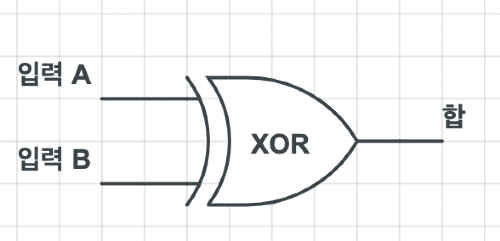
</details>

<br>

여기서, 올림수을 표현하려면 새로운 출력선을 추가하면 되는데,  
<details><summary>이번엔 올림 부분만 표시된 입출력 조합표를 확인해보자.</summary>

| 입력A | 입력B | 출력(올림) |
|-|-|-|
| 0 | 0 | 0 |
| 0 | 1 | 0 |
| 1 | 0 | 0 |
| 1 | 1 | 1 |
</details>

<br>

표에서 볼 수 있듯, 두 입력이 모두 '1' 인 경우에만 '1' 을 반환하기 때문에,  
<details><summary>이와 같은 연산을 처리하는 AND 회로를 추가하면 된다.</summary>

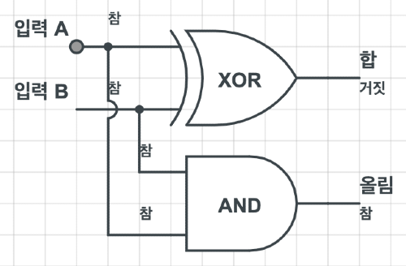
</details>

<br>

이렇게, 한 자리수의 2진수 2개를 연산하여 올림과 합을 출력하는 회로를  
**'half adder'(반가산기)** 라고 한다.

## 2-3. 추상화

반가산기의 구조는 단순한 편이지만 추상화할 필요가 있다.

>
<a href='/Crash-Course/3.-부울-연산과-논리-게이트/#6-2-목적' target='-blank'>'추상화의 목적'</a>
참고

**특징을 요약하면 아래와 같다.**

- A와 B, 2개의 비트를 입력받는다.
- 합(sum) 을 반환하고, 올림수(carry) 를 내보낸다.

<br>

**반가산기를 하나의 구성 요소(기호)로써 표현하면 아래와 같다.**


\- 출처 :
<a href='https://www.elprocus.com/half-adder-and-full-alu/' target='-blank'>elprocus</a>

<br>

이렇게, 새로 구성한 요소를 단순하게 표현해봤으니,  
더 높은 수준의 추상화 계층으로 넘어가보자.

# 3. 전가산기

이렇게, 1비트 단위를 계산하는 반가산기에 대해 살펴봤는데,    
이보다 더 큰 단위를 계산하는 방법은 무엇이 있을까?

'101 + 101' 을 계산하면서 생각해보자.

<details><summary>1. 가장 작은 자릿수부터 계산한다.</summary>

```
  1
 101 (5)
+101 (5)
----
   0 (0)
```
</details>

<details><summary>2. 다음 자릿수와 받아올림한 수를 계산한다.</summary>

```
 01
 101 (5)
+101 (5)
----
  10 (2)
```
</details>

<details><summary>3. '2' 의 계산을 반복한다.</summary>

```
101
 101 (5)
+101 (5)
----
 010 (2)
```
```
101
 101 (5)
+101 (5)
----
1010 (2 + 8 = 10)
```
</details>

<br>

이 계산에서 반가산기는 '1' 의 과정밖에 처리하지 못한다.

이후의 과정은 기존의 입력에 '올림수까지' 계산해야 하기 때문인데,  
만약 기존의 입력과 올림수까지 총 3개의 비트를 계산할 수 있다면 어떨까?

위의 계산을 수행할 수 있도록 새로운 회로를 구성해보자.

## 3-1. 조건 정리

- 반가산기처럼 2개의 값 'A' 와 'B' 를 입력받는다.
- 이전 계산에서 넘어오는 올림수 'C' 를 입력받는다.
- 반가산기처럼 합(sum)과 올림수(carry)을 반환한다.
- 3개의 비트를 입력받기 때문에, 최대 입력은 '1 + 1 + 1' 이다.
- 이 때, 가능한 입력의 조합은 다음과 같다.

  <details><summary>클릭하여 입출력 조합표를 확인해보자.</summary>

  | 입력A | 입력B | 입력C | 출력(올림) | 출력(합) |
  |-|-|-|-|-|
  | 0 | 0 | 0 | 0 | 0 |
  | 0 | 0 | 1 | 0 | 1 |
  | 0 | 1 | 0 | 0 | 1 |
  | 1 | 0 | 0 | 0 | 1 |
  | 0 | 1 | 1 | 1 | 0 |
  | 1 | 1 | 0 | 1 | 0 |
  | 1 | 1 | 1 | 1 | 1 |
  </details>

## 3-2. 회로 구성


3개의 비트를 계산하는 과정은 2가지 단계로 나눌 수 있다.

> A + B + C = (A + B) + C

이렇게 자리수 연산(A + B) 의 결과(sum)에 올림수(+ C) 을 더해도 결과는 같다.

<br>

<details><summary>1. 기본 연산 'A + B' 를 처리하기 위해 반가산기를 추가한다.</summary>


- 여기서 'CO' 는 'Carry Out'(출력된 올림수), 'S' 는 'Sum'(합) 이다.
</details>

<details><summary>2. '1' 의 결과(sum) 와 3번째 입력 'C' 를 계산하도록 반가산기를 추가한다.</summary>

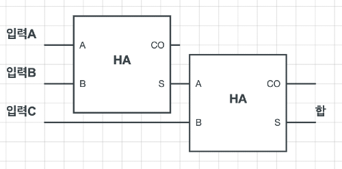
</details>

<details><summary>3. 각 계산 과정의 올림수을 처리하도록 OR 회로를 추가한다.</summary>

최대 입력이 '1 + 1 + 1' 이기 때문에, 2개의 계산 중 하나에서만 올림수가 출력된다.  
따라서, 2가지 경우 중 하나라도 참인 경우에 참을 반환하는 논리합 연산을 적용한다.
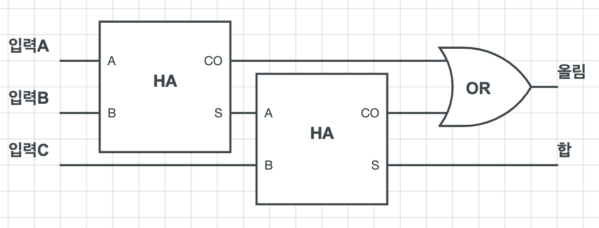
</details>

<br>

이렇게, 온전하게 한 자리수의 2진수를 연산할 수 있는 회로를  
**'full adder'(전가산기)** 라고 한다.

## 3-3. 추상화

반가산기와 마찬가지로, 전가산기에서도 추상화를 진행해보자.

**특징을 요약하면 아래와 같다.**

- A, B, C, 3개의 비트를 입력받는다.
- 최종적인 합(sum) 을 반환하고, 올림수(carry) 을 내보낸다.

<br>

**전가산기를 하나의 구성 요소(기호)로써 표현하면 아래와 같다.**


\- 출처 :
<a href='https://www.elprocus.com/half-adder-and-full-alu/' target='-blank'>elprocus</a>

<br>

이렇게, 여러 자리의 2진수를 더하는데 필요한 요소들을 구성하고 추상화해봤으니,  
비트의 다음 단위인 바이트(8비트)를 계산하는 회로를 구성해보자.

# 4. 리플 자리올림수 가산기

바이트 단위의 계산은 여러 자리수를 가지는 2진수의 계산처럼,  
여러 번의 비트 단위 계산을 통해 수행할 수 있다.

이전 단계에서 진행한 추상화 기호를 이용해, 바이트 단위 가산기를 만들어보자.

## 4-1. 규칙

**여러 비트의 계산에 대한 규칙은 아래와 같다.**

- 임의의 수 A의 각 자리수는 'A0, A1, A2, A3, ... , A7' 이다.
   - 첫 번째 자리수는 A0, 다음 자리수는 A1, 그 다음은 A2 의 순으로 표현한다.
- A와 더하기 연산을 처리할 다른 임의의 수는 B라 한다.
   - B의 자리수 표기는 A와 같고, 'B0, B1, B2, B3, ... , B7' 로 표현한다.
- 계산은 각 자리수 별로 처리하므로, A + B = (A0 + B0), (A1 + B1), ... 이다.
- 각 계산에서 출력되는 합과 올림도 자리수 표기와 같은 방식으로 표현한다.
   - '합0, 합1, 합2, 합3, ... , 합7', '올림0, 올림1, 올림2, 올림3, ... , 올림7'

## 4-2. 회로 구성

계산 순서에 맞춰, 가장 작은 자리수를 처리하는 회로부터 구성해보자.

<details><summary>1. 가장 작은 자리수에는 올림수가 없기 때문에, 반가산기를 추가한다.</summary>

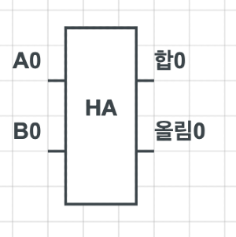
</details>

<details><summary>2. 다음 자리수는 올림수까지 계산해야 하므로 전가산기를 추가한다.</summary>


</details>

<details><summary>3. 모든 자리수(0, 1, 2, 3, ... , 7) 를 만족할 때까지, '2' 를 반복한다.</summary>

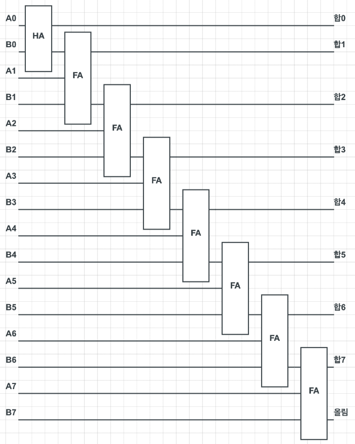
</details>

<br>

이 때, 올림수가 다음 가산기로 전달되는 형태가 물결(ripple) 과 비슷하다고 해서  
이런 구성의 가산기를 **'ripple carry adder'(리플 자리올림수 가산기)** 라고 한다.

또, 위 과정을 통해 구성한 가산기는 8비트(바이트) 를 처리하기 때문에,  
8비트 리플 자리올림수 가산기(8-bit ripple carry adder) 라고 할 수 있다.

## 4-3. 오버플로

<details><summary>위에서 구성한 회로의 마지막 가산기를 다시 한 번 살펴보자.</summary>


</details>

<br>

만약, 여기서 올림수가 존재한다면 '출력이 8비트로 표현 가능한 수보다 크다' 는 뜻인데,  
이렇게 사용하는 메모리 단위를 넘어서는 값이 생기는 현상을 **'overflow'(오버플로)** 라고 한다.

**보통 에러가 나거나 예상치 못한 동작이 발생한다.**

>
유명한 원조 아케이드 게임 '팩맨'(Pac-Man) 을 예로 들 수 있다.
>
이 게임은 플레이어가 진행 중인 단계를 8비트로 표현하는데,  
만약 8비트의 최대 값 '255' 를 넘어서면, ALU에 오버플로 현상이 발생한다.
>
이 때,수 많은 오류와 결함이 생겨 절대 깰 수 없는 단계가 생겨났고,  
수 많은 팩맨 플레이어들에겐 하나의 관문이 되어버렸다.

# 5. 자리올림수 예측 가산기

오버플로 현상을 방지하는 방법은 무엇이 있을까?

단순하게 생각해보면, 전가산기를 추가하여 회로를 확장하는 방법이 있을 것이다.  
`(8비트를 처리하는 가산기를 16비트나 32비트 단위까지 확장하는 식으로 말이다.)`

하지만, 이 방법을 사용하면 오버플로가 발생할 수 있는 가능성을 줄일 수 있어도,  
더 많은 게이트를 사용해야하고, 각각의 올림수가 전달되는 시간을 늦춘다는 단점이 있다.

물론, 전자는 엄청나게 빠르게 이동하기 때문에 아주 짧은 시간의 차이가 나지만,  
이 작은 차이는 현대의 컴퓨터에 영향을 끼치기에 충분할 정도다.

이런 이유로 현대의 컴퓨터에는 **'carry-look-ahead adder'(자리올림수 예측 가산기)** 가 사용된다.

>
올림수에 대한 연산만 별도로 처리하는 방식인데, 속도는 훨씬 빠르다고 한다.  
\- 자세한 내용은 <a href='https://namu.wiki/w/%EA%B0%80%EC%82%B0%EA%B8%B0#s-2.2.2' target='-blank'>
'나무위키'
</a>,
<a href='https://ko.wikipedia.org/wiki/%EC%9E%90%EB%A6%AC%EC%98%AC%EB%A6%BC%EC%88%98_%EC%98%88%EC%B8%A1_%EA%B0%80%EC%82%B0%EA%B8%B0' target='-blank'>
'위키피디아'
</a>
참고

# 6. 다양한 ALU

ALU의 산술 장치에는 가산기 외에 다른 수학적 연산을 처리하는 회로들이 포함되어 있다.

<details><summary>클릭하여 ALU의 기본 산술 연산을 확인해보자.</summary>

- Add : A and B are summed.
- Add with carry : A and B and a Carry-In bit are all summed.
- Subtract : B is subtracted from A(or vice-versa).
- Subtract with borrow : B is subtracted from A(or vice-versa) with borrrow(carry-in).
- Negate : A is subtracted from zero, flilpping its sign(from - to +, or + to -).
- Increment : Add 1 to A.
- Decrement : Subtract 1 from A.
- Pass through : All bits of A are passed through unmodified.

\- 출처 :
<a href='https://en.wikipedia.org/wiki/Arithmetic_logic_unit#Arithmetic_operations' target='-blank'>'ALU 에서 처리되는 8가지 기본 산술 연산 - 위키피디아'</a>
</details>

<br>

여기서 흥미로운 점은 '곱셈과 나눗셈' 연산이 포함되어 있지 않다는 것인데,  
일부 단순한 구조의 ALU에는 복잡한 연산을 처리하는 회로가 별도로 없기 때문이다.

## 6-1. 단순한 구조의 ALU

단순한 구조의 ALU는 일련의 작업을 통해 곱셈, 나눗셈 연산을 처리한다.  

'12 * 5' 를 예로 들 수 있는데, 곱셈 연산 한 번에 5번의 덧셈이 필요하다.

> 곱셈은 '여러 번의 덧셈' 이기 때문에, '12 * 5' 는 '12를 5번 더하기' 이다.

게이트 통과 회수가 늘어나는 만큼 시간이 오래 걸리기 때문에,  
하나의 계산에 소요되는 시간이 엄청나게 길어지게 된다.


사실, 많은 종류의 단순한 프로세서들이 이런 방식으로 동작한다.

>
난방 온도 조절기나 TV 리모컨, 전자레인지 등을 예로 들 수 있다.  
`(느리지만 일은 잘한다.)`

## 6-2. 곱셈 전용 회로를 포함하는 ALU

스마트폰이나 노트북 등의 장치에 사용되는 ALU는 다르다.

비싼 장치에 사용되기 때문에 고급 프로세서가 적용되어 있는데,  
여기엔 무려 '곱셈 전용 회로' 가 포함되어 있다.  
`('곱셈 전용 회로' 라니.. 유튜브 프리미엄같은 건가;)`

당연하게도, 이 '곱셈 전용 회로' 는 가산기보다 훨씬 더 복잡하게 구성되어 있다.

또, 엄청나게 많은 수의 논리 회로가 사용되는 만큼 가격도 비싸기 때문에,  
저렴한 값의 프로세서에는 적용되지 않는 것이 당연하다.. 

# 7. 논리 장치

산술 장치에 대해 알아봤으니, 이번엔 논리 장치를 살펴보자.

논리 장치는 이전 수업에서 살펴봤던 AND, OR, NOT 과 같은 논리 연산을 처리하고,  
수의 부호를 판별하는 등의 간단한 수치 연산까지 처리한다.

ALU 에서 처리된 연산의 결과가 '0' 인지 판별하는 회로를 예시로 살펴보자.  
`(간단한 구성이지만, 뒷 부분에서 더 다뤄볼 내용이다.)`

<details><summary>1. 모든 비트 중 하나라도 1인 경우를 확인하기 위해 OR 회로를 추가한다.</summary>

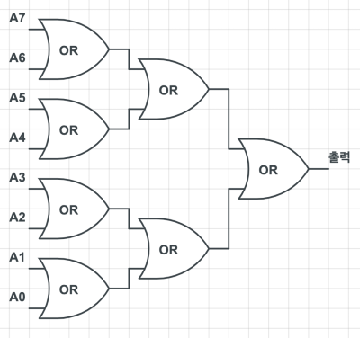
</details>

<details><summary>2. 모두 '0' 인 경우에 '참'(1) 을 반환해야 하므로, 출력선에 NOT 회로를 추가한다.</summary>

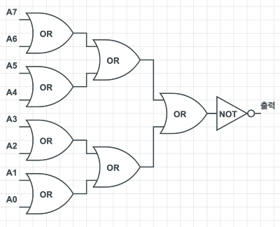
</details>

<br>

논리 장치는 이렇게 2진수 값에 대한 연산의 결과를 진리값으로 출력한다.  
`(같은 비트지만, 다르게 취급된다는 점에 유의하자.)`

# 8. ALU의 추상화

이렇게, ALU의 구성을 고수준의 추상화 계층에서 살펴봤고  
리플 자리올림수 가산기와 같은 몇몇 주요 회로도 구성해봤는데,

지금까지 다룬 내용은 아래와 같이 간단하게 정리해 볼 수 있다.

> ALU는 현명하게 연결된 수 많은 논리 회로가 조합된 하나의 회로이다.

## 8-1. 74181에 관하여

이번 수업의 초반부에서 등장한 74181 의 특징을 살펴보자.

- 처리할 수 있는 최대 입력은 4비트다.
- 총 75개의 논리 회로로 구성되어 있다.
- 곱셈, 나눗셈 등의 연산은 지원하지 않는다.

<br>

이런 74181의 등장은 프로세서의 소형화에 있어 큰 발전이었고,  
덕분에 더 저렴하고 성능좋은 컴퓨터들이 등장할 수 있었다.

또, 이번 수업에서 우리는 ALU 의 모든 부분을 구성하진 않았지만  
74181 보다 2배 큰 입력 단위인 8비트를 처리하는 회로를 구성해봤고,

덕분에 ALU 라는 장치에 대해 이해할 수 있었다.

## 8-2. ALU의 기호

74181과 같은 4비트 ALU 의 회로 구성도 충분히 복잡하지만,  
그 이상의 단위를 처리하는 8비트 ALU 의 경우는 훨씬 더 복잡하다.

온전하게 구성하려면 수백개의 논리 회로가 필요했기 때문에,  
공학자들은 ALU 를 표기하는 기호를 만들어 추상화했다.

<details><summary>큰 V자 모양의 기호를 사용한다.</summary>


\- 출처 :
<a href='https://en.wikipedia.org/wiki/Arithmetic_logic_unit' target='-blank'>'위키피디아'</a>
</details>

<br>

이 기호와 함께 더 높은 수준의 추상화 계층으로 넘어가보자.

# 9. ALU의 동작 방식

추상화 기호와 함께, 8비트 단위 ALU 의 구성과 동작 순서를 살펴보자.

<details><summary>1. 연산을 수행할 2개의 8비트 정보(A, B)를 입력받는다.</summary>

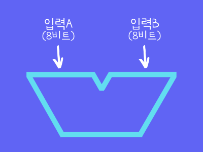
</details>

<details><summary>2. 수행할 작업을 지정하는 4비트 명령 코드를 입력받는다.</summary>

덧셈은 '1000', 뺄셈은 '1100' 등 다양한 4비트 값이 입력된다.  
`(나중에 다른 수업에서 더 다뤄볼 예정이다.)`
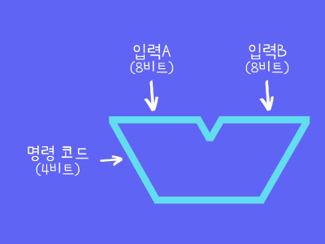
</details>

<details><summary>3. 지정된 연산을 수행한 후 8비트 정보를 출력한다.</summary>

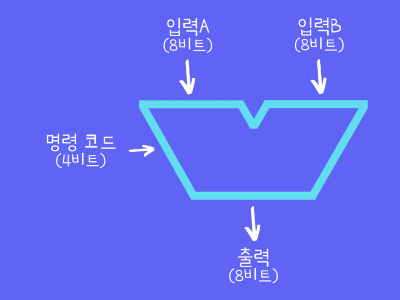
</details>

<details><summary>4. 출력의 상태를 표현하는 1비트 정보를 출력한다.</summary>

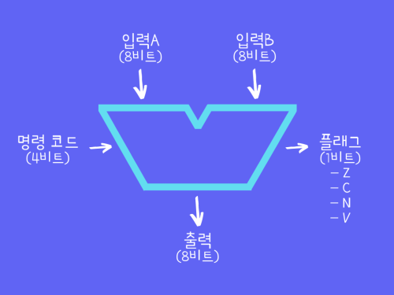
</details>

## 9-1. 플래그

이 때, '4' 에서 출력되는 1비트 정보는 **플래그(flags)** 라고 하는데,  
연산 결과가 특정 상태인지, 혹은 특정 상황이 발생했는지 표시하는 역할을 한다.

<details><summary>기본적으로 4가지 종류로 구성되어 있다. (클릭하여 내용을 확인해보자.)</summary>

| 플래그 | 내용 |
|-|-|
| Z (Zero) | 연산 결과가 0인지 여부를 표현한다. |
| C (Carry) | 연산의 올림수 존재 여부를 표현한다. |
| N (Negative) | 연산의 결과가 음수인지 여부를 표현한다. |
| V (Overflow) | 연산 과정에서의 오버플로 발생 여부를 표현한다. |
>
더 자세한 내용은
<a href='https://medium.com/@karlrombauts/building-an-8-bit-computer-in-logisim-part-4-status-flags-c41d8ca44542' target='-blank'>
'이 곳'
</a>
을 참고
</details>

## 9-2. 활용

이렇게 다양한 플래그를 활용하여 입력받은 값을 서로 비교할 수 있다.

임의의 두 수에 대해 빼기 연산을 수행했을 경우를 생각해보자.

이 때, 만약 연산의 결과가 0이라면, 'Z'(값이 0) 플래그가 1을 출력할 것이다.  
`('7. 논리 장치' 에서 구성한 회로가 사용된다.)`

위와 같은 방법으로, 입력받은 두 수의 값이 같은지를 판별하거나,  
A에서 B를 뺀 뒤 'N'(음수 여부) 플래그를 확인해 A가 B보다 작은지를 판별할 수도 있다.

또, 'V'(오버플로) 플래그를 가산기의 올림 출력에 연결하면,  
연산 과정에서의 오버플로 발생 여부를 확인할 수도 있다.

- 이런 플래그 중에서도 'Z', 'N', 'V' 는 보편적으로 사용되고, 이외에도 다양한 플래그 회로가 존재한다.
- 물론, 고급 프로세서에는 더 다양한 플래그 회로가 있다. `(자본주의의 향기..)`
- 다양한 플래그 회로에 대해서는 나중에 다른 수업에서 더 다뤄볼 예정이다.

# 10. 컴퓨터의 구성에 관하여,

이번 수업에서는, 컴퓨터가 기본 수학 연산을 수행하는 방법에 대해 알아봤다.

> 기어나 레버 없이, '디지털 방식' 으로 말이다.

이후의 두 수업에서 이번에 배운 ALU를 이용해 CPU를 구성해볼텐데,  
하지만, 그 전에 우리는 컴퓨터의 저장 장치에 대해 공부해둘 필요가 있다.

다음 수업에서는, 컴퓨터의 메모리에 대해 알아볼 것이다.


# 배운 점, 느낀 점

여러 개의 논리 회로들을 조합해 수의 계산을 처리하는 방식이 신기했고,  
가장 낮은 수준의 추상화 단계부터 공부한 덕분에 연산에 대한 개념이 조금 더 뚜렷해졌다.

컴퓨터가 전기 신호를 이용해 연산하는 과정이 궁금했는데, 궁금증이 해결됐다.

## 1.

- 컴퓨터의 모든 연산을 처리하는 ALU와 최초의 단일 칩 구성 ALU인 74181
- 다양한 수학적 연산을 처리하는 ALU의 산술 장치
- 한 자리수의 비트에 대해 더하기 연산을 수행하는 반가산기
- 올림수까지 계산하여 온전한 더하기 연산을 처리하는 전가산기

<br>

컴퓨터의 연산을 처리하는 것은 CPU라고만 알고 있었는데,  
그 CPU를 구성하는 ALU 회로가 실제로 연산을 처리한다는 것을 배웠다.

이전의 수업에서 트랜지스터 덕분에 전기 회로의 크기가 줄었다는 것을 배웠는데,  
74181처럼 작은 칩 하나에 들어갈 정도로 작아졌다는 것이 신기했다.

각각의 전기 신호를 2진수로 보고, 여러 논리 회로를 조합해 더하기 연산을 수행하는 방법을 배웠다.

올림수에 대한 계산을 처리하기 위해 하나의 덧셈을 2단계로 구분지은 방식을 보고,  
컴퓨터와 관련된 지식을 공부할 때 수학적 사고력이 왜 중요한지 다시 한번 깨달았다. 

## 2.

- 여러 자리의 비트에 대한 더하기 연산을 처리하는 리플 자리올림수 가산기
- 사용하는 메모리의 단위를 넘는 값이 생기는 현상인 오버플로
- 오버플로 현상을 방지하기 위해 올림수 연산을 별도로 처리하는 자리올림수 예측 가산기
- ALU가 지원하는 다양한 산술 연산과 다양한 구성의 ALU

<br>

추상화를 통해 전기 신호를 2진수로 보던 시각을 넓혀,  
여러 전기 신호를 하나의 수로 바라보는 법을 배웠다.

수학적인 계산 과정을 단계별로 분석하여 회로를 구성하는 것이 신기했다.

오버플로라는 표현을 보고 '스택오버플로' 가 떠올랐는데,  
표현에 대한 느낌이 전에 검색했을 때보다 훨씬 더 와닿았다.

자리올림수 예측 가산기에 대해 검색해봤는데, 구현 아이디어를 보고 놀랐다.  
`(올림수 전기 신호의 전달이 느리니까, 올림 수만 처리하는 회로를 만들자 ㅋ)`

곱셈만 별도로 처리하는 회로의 구성이 궁금해졌다.

## 3.

- 연산에 대한 진리값을 출력하는 등 다양한 논리 연산을 처리하는 논리 장치
- 4비트 연산이 가능한 74181과 더 복잡한 ALU들의 추상화와 ALU의 회로 기호
- ALU의 동작 방식과 명령 코드, 출력의 상태를 표현하는 플래그
- 두 수를 비교하는 등의 플래그를 활용한 다양한 논리적 연산

<br>

단순한 논리 회로를 조합하여 복잡한 논리 회로를 구성하는 과정이 신기했다.

4비트 이상의 값을 처리하지 못하는 74181보다 큰 규모의 회로를 구성했다는 것이 뿌듯했다. ㅎ  
`(온전한 ALU를 구성한건 아니지만, 괜히 기분이 좋아졌다 ㅋㅋ)`

<a href='https://www.circuitlab.com/' target='-blank'>'Circuit Lab'</a>
에 ALU 회로 기호가 없어서 조금 당황했다.  
`(전기 전자 분야의 회로 위주로 다루기 때문인 것 같다.)`

연산 결과의 상태나 연산 과정 중 특정 상황이 발생했는지 표시하는 플래그를 보고,  
AWS같은 클라우드 컴퓨팅 플랫폼에서 제공하는 모니터링 기능이 떠올랐다.

단순한 논리 회로들을 조합해, 산술 처리와 논리 처리를 하고,  
그런 연산을 담당하는 회로들을 조합해서 더 고수준의 연산을 처리하는 것이 놀라웠다.

(해당 글의 작성 과정은 
<a href='https://github.com/ensia96/ensia96.github.io/pull/90' target='-blank'>post/crash-course/5 (#90)</a>
에서 확인하실 수 있습니다.)

- 20210306 - 작성 과정 하이퍼링크 오타 수정(#86 → #90)
- 20210306 - 작성일 변경(생성일-> 완료일)
- 20210329 - 줄 바꿈 추가('배운 점, 느낀 점' 2번)
