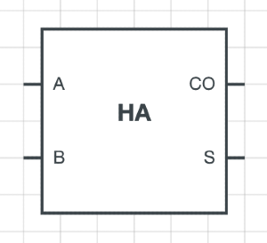
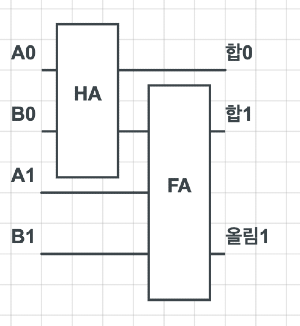
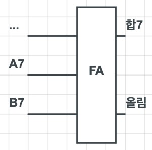

>
해당 포스트는 
Youtube 채널
<a href='https://www.youtube.com/channel/UCX6b17PVsYBQ0ip5gyeme-Q' target='-blank'>'Crash Course'</a>
에서 제공하는 
<a href='https://www.youtube.com/playlist?list=PL8dPuuaLjXtNlUrzyH5r6jN9ulIgZBpdo' target='-blank'>'Computer Science'</a>
수업을 바탕으로 작성되었습니다.  
( 사진 속 인물은
<a href='https://about.me/carrieannephilbin' target='-blank'>'Carrie Anne Philbin'</a>
선생님 입니다! )

# 0. 시작하기에 앞서,

지난 수업에서 우리는 2진법으로 숫자를 표현하는 방법을 공부했다.

> 예를 들어, '42' 를 2진수로 표현하면 '00101010' 이다.

<br>

컴퓨팅에서 숫자를 표현하고 저장하는 것은 중요한 기능이지만,  
본질적인 목적은 계산, 혹은 체계적이고 의도적인 방식으로 숫자를 조작하는 것이다.

**두 숫자를 더하는 것처럼 말이다.**

## 0-1. ALU

컴퓨터에서 숫자를 계산하거나 조작하는 등의 동작은  
산술(Arithmetic) 장치와 논리(Logic) 장치에서 처리되는데,

'Arithmetic & Logic Unit' 을 줄여서 **'ALU'** 라고 부른다.

>
'ALU' 는 컴퓨터의 모든 계산을 처리하기 때문에 현대의 모든 컴퓨터에서 사용되는데,  
덕분에, 'ALU'의 설계와 기능을 이해하면 현대 컴퓨터의 핵심적인 부분들을 이해할 수 있다.

## 0-2. 74181

1970년에 출시된 **'74181'** 은 아마 가장 유명한 ALU 일 텐데,  
**'최초의 단일 칩(single chip) 구성 ALU'** 라는 엄청난 공학적 업적을 남겼다.

> <details><summary>엄청 귀엽게생겼다 ㅎ</summary>
>
> `미친놈 아닙니다.`
> 
>
> \- 출처 :
> <a href='https://en.wikipedia.org/wiki/74181' target='-blank'>위키피디아</a>
> </details>

<br>

이번 수업에선 지난 수업에서 배웠던 논리 회로들을 이용해  
74181과 비슷하게 동작하는 간단한 ALU 회로를 구성해볼 것이다.

>
이후의 몇몇 수업에 걸쳐, 이 회로를 이용해 컴퓨터를 구성해볼 것이다.  
(조금은 복잡해지겠지만, 충분히 가능하다.)

# 1. 산술 장치

ALU를 구성하는 2가지 장치 중, 산술 장치부터 살펴보자.

산술 장치(Arithmetic Unit) 는 덧셈, 뺄셈 등의 모든 수치 연산을 담당하고,  
값을 하나씩 증가시키는 증분 연산 등, 다양한 단순 작업들까지 처리한다.

> '증분 연산(increment operation)' 은 나중에 다른 수업에서 다뤄볼 것이다.

우선, 모든 컴퓨터 동작의 기초가 되는 **'2개의 숫자 더하기'** 연산부터 살펴보자.

# 2. 반가산기

가장 기초적인 연산인 '2개의 2진수 더하기' 연산을 수행하는 회로를 구성할 것이다.

이 때, 트랜지스터 단위의 작업은 많이 복잡하기 때문에,  
'AND', 'OR', 'NOT', 'XOR' 등의 논리 회로를 사용할 것이다.  

>
<a href='/Crash-Course/3.-부울-연산과-논리-게이트/' target='-blank'>'3. 부울 연산과 논리 게이트'</a>
참고


## 2-1. 조건 정리

- A와 B라는 2개의 입력을 받고, 하나의 출력을 반환한다.
- A와 B, 출력은 모두 단일 비트(0 혹은 1) 이다.
- 이 때, 가능한 입력의 조합은 4가지 뿐이다.

  <details><summary>클릭하여 입출력 조합표를 확인해보자.</summary>
  
  | 입력A | 입력B | 출력 |
  |-|-|-|
  | 0 | 0 | 0 |
  | 0 | 1 | 1 |
  | 1 | 0 | 1 |
  | 1 | 1 | 10 (2) |
  (2진수에서 '2' 를 표현할 땐 0을 값으로 쓰고, 1을 받아올림하여 '10' 으로 표기한다.)
  </details>

## 2-2. 회로 구성

<details><summary>위에서 본 표를 2진법에 맞춰 다시 살펴보자.</summary>

| 입력A | 입력B | 출력(올림) | 출력(합) |
|-|-|-|-|
| 0 | 0 | 0 | 0 |
| 0 | 1 | 0 | 1 |
| 1 | 0 | 0 | 1 |
| 1 | 1 | 1 | 0 |
</details>

<details><summary>이 때, 올림 값을 제외하면 XOR 의 논리표와 정확히 일치한다.</summary>

| 입력A | 입력B | 출력(합) |
|-|-|-|
| 0 | 0 | 0 |
| 0 | 1 | 1 |
| 1 | 0 | 1 |
| 1 | 1 | 0 |
</details>

<details><summary>따라서, XOR 회로를 이용하면, 합에 대한 출력만 만족할 수 있다.</summary>


</details>

<br>

여기서, 올림 값을 표현하려면 새로운 출력선을 추가하면 되는데,  
<details><summary>이번엔 올림 부분만 표시된 입출력 조합표를 확인해보자.</summary>

| 입력A | 입력B | 출력(올림) |
|-|-|-|
| 0 | 0 | 0 |
| 0 | 1 | 0 |
| 1 | 0 | 0 |
| 1 | 1 | 1 |
</details>

<br>

표에서 볼 수 있듯, 두 입력이 모두 '1' 인 경우에만 '1' 을 반환하기 때문에,  
<details><summary>이와 같은 연산을 처리하는 AND 회로를 추가하면 된다.</summary>


</details>

<br>

이렇게, 한 자리수의 2진수를 연산하여 올림과 합을 출력하는 회로를  
**'half adder'(반가산기)** 라고 한다.

## 2-3. 추상화

반가산기의 구조는 단순한 편이지만 추상화할 필요가 있다.
(<a href='/Crash-Course/3.-부울-연산과-논리-게이트/#6-2-목적' target='-blank'>'추상화의 목적'</a>
참고)

**특징을 요약하면 아래와 같다.**

- A와 B, 2개의 비트를 입력받는다.
- 합(sum) 을 반환하고, 올림 값(carry) 를 내보낸다.

<br>

**반가산기를 하나의 구성 요소(기호)로써 표현하면 아래와 같다.**


\- 출처 :
<a href='https://www.elprocus.com/half-adder-and-full-adder/' target='-blank'>elprocus</a>

<br>

이렇게, 새로 구성한 반가산기를 단순하게 표현해봤으니,  
더 높은 수준의 추상화 계층으로 넘어가보자.

# 3. 전가산기

이렇게, 1비트 단위를 계산하는 반가산기에 대해 살펴봤는데,    
이보다 더 큰 단위를 계산하는 방법은 무엇이 있을까?

'101 + 101' 을 계산하면서 생각해보자.

<details><summary>1. 가장 작은 자릿수부터 계산한다.</summary>

```
  1
 101 (5)
+101 (5)
----
   0 (0)
```
</details>

<details><summary>2. 다음 자릿수와 받아올림한 수를 계산한다.</summary>

```
 01
 101 (5)
+101 (5)
----
  10 (2)
```
</details>

<details><summary>3. '2' 의 계산을 반복한다.</summary>

```
101
 101 (5)
+101 (5)
----
 010 (2)
```
```
101
 101 (5)
+101 (5)
----
1010 (2 + 8 = 10)
```
</details>

<br>

이 계산에서 반가산기는 '1' 의 과정밖에 처리하지 못한다.

이후의 과정은 기존의 입력에 '올림 값까지' 계산해야 하기 때문인데,  
만약 기존의 입력과 올림 값까지 총 3개의 비트를 계산할 수 있다면 어떨까?

위의 계산을 수행할 수 있도록 새로운 회로를 구성해보자.

## 3-1. 조건 정리

- 반가산기처럼 2개의 값 'A' 와 'B' 를 입력받는다.
- 이전 계산에서 넘어온 올림 값 'C' 를 입력받는다.
- 반가산기처럼 합(sum)과 올림 값(carry)을 반환한다.
- 3개의 비트를 입력받기 때문에, 최대 입력은 '1 + 1 + 1' 이다.
- 이 때, 가능한 입력의 조합은 다음과 같다.

  <details><summary>클릭하여 입출력 조합표를 확인해보자.</summary>

  | 입력A | 입력B | 입력C | 출력(올림) | 출력(합) |
  |-|-|-|-|-|
  | 0 | 0 | 0 | 0 | 0 |
  | 0 | 0 | 1 | 0 | 1 |
  | 0 | 1 | 0 | 0 | 1 |
  | 1 | 0 | 0 | 0 | 1 |
  | 0 | 1 | 1 | 1 | 0 |
  | 1 | 1 | 0 | 1 | 0 |
  | 1 | 1 | 1 | 1 | 1 |
  </details>

## 3-2. 회로 구성


3개의 비트를 계산하는 과정은 2가지 단계로 나눌 수 있다.

> A + B + C = (A + B) + C

이렇게 자리수 연산(A + B) 의 결과(sum)에 올림 값(+ C) 을 더해도 결과는 같다.

<br>

<details><summary>1. 기본 연산 'A + B' 를 처리하기 위해 반가산기를 추가한다.</summary>


- 여기서 'CO' 는 'Carry Out'(출력된 올림 값), 'S' 는 'Sum'(합) 이다.
</details>

<details><summary>2. '1' 의 결과(sum) 와 3번째 입력 'C' 를 계산하도록 반가산기를 추가한다.</summary>


</details>

<details><summary>3. 각 계산 과정의 올림 값을 처리하도록 OR 회로를 추가한다.</summary>

최대 입력이 '1 + 1 + 1' 이기 때문에, 2개의 계산 중 하나에서만 올림 값이 출력된다.  
따라서, 2가지 경우 중 하나라도 참인 경우에 참을 반환하는 논리합 연산을 적용한다.

</details>

<br>

이렇게, 온전하게 한 자리수의 2진수를 연산할 수 있는 회로를  
**'full adder'(전가산기)** 라고 한다.

## 3-3. 추상화

반가산기와 마찬가지로, 전가산기에서도 추상화를 진행해보자.

**특징을 요약하면 아래와 같다.**

- A, B, C, 3개의 비트를 입력받는다.
- 최종적인 합(sum) 을 반환하고, 올림 값(carry) 을 내보낸다.

<br>

**전가산기를 하나의 구성 요소(기호)로써 표현하면 아래와 같다.**


\- 출처 :
<a href='https://www.elprocus.com/half-adder-and-full-adder/' target='-blank'>elprocus</a>

<br>

이렇게, 여러 자리의 2진수를 더하는데 필요한 요소들을 구성하고 추상화해봤으니,  
비트의 다음 단위인 바이트(8비트)를 계산하는 회로를 구성해보자.

# 4. 리플 자리올림수 가산기

바이트 단위의 계산은 여러 자리수의 2진의 계산처럼,  
여러번의 비트 단위 계산을 통해 수행할 수 있다.

이전 단계에서 진행한 추상화 기호를 이용해, 바이트 단위 가산기를 만들어보자.

## 4-1. 규칙

**여러 비트의 계산에 대한 규칙은 아래와 같다.**

- 임의의 수 A의 첫 번째 자리수는 A0 이라 한다.
- 다음 단위의 자리수는 A1, 그 다음은 A2 의 순으로 표현한다.
- 최종적으로, 각 자리수는 A0, A1, A2, A3, ... , A7 이다.
- 임의의 수 A와 더하기 연산을 처리할 다른 임의의 수는 B라 한다.
- B의 각 자리수 표기는 A와 같다.
- B0, B1, B2, B3, ... , B7 이된다.
- 계산은 각 자리수에 대해 진행하므로, A + B = (A0 + B0), (A1 + B1), ... 이다.
- 각 계산에서 출력되는 합과 올림도 자리수 표기와 같은 방식으로 표현한다.
   - 합0, 합1, 합2, 합3, ... , 합7
   - 올림0, 올림1, 올림2, 올림3, ... , 올림7

## 4-2. 회로 구성

가장 작은 자리수부터 시작해보자.

<details><summary>1. 가장 작은 자리수에는 올림 값이 없기 때문에, 반가산기를 추가한다.</summary>


</details>

<details><summary>2. 다음 자리수는 올림 값까지 계산해야 하므로 전가산기를 추가한다.</summary>


</details>

<details><summary>3. 모든 자리수(0, 1, 2, 3, ... , 7) 를 만족할 때까지, '2' 를 반복한다.</summary>


</details>

<br>

이 때, 올림 값이 다음 가산기로 전달될 때의 모양이 물결(ripple) 과 비슷하다고 해서  
이런 형태의 가산기를 **'ripple carry adder'(리플 자리올림수 가산기)** 라고 한다.

또, 위 과정을 통해 구성한 가산기는 8비트(바이트) 를 처리하기 때문에,  
8비트 리플 자리올림수 가산기(8-bit ripple carry adder) 라고 할 수 있다.

## 4-3. 오버플로

<details><summary>위에서 구성한 회로의 마지막 가산기를 다시 한 번 살펴보자.</summary>


</details>

<br>

만약, 여기서 올림 값이 존재한다면 '8비트로 표현 가능한 수보다 크다' 는 뜻인데,  
이렇게 사용하는 메모리 단위를 넘어서는 값이 생기는 현상을 **'overflow'(오버플로)** 라고 한다.

계산 결과가 너무 커서 발생하는 현상이고, 보통 에러가 나거나 예상치 못한 동작이 발생한다.

>
유명한 원조 아케이드 게임 '팩맨'(Pac-Man) 을 예로 들 수 있다.
>
이 게임은 사용자가 진행 중인 단계를 8비트로 표현하는데,  
만약 8비트의 최대 값 '255' 를 넘어서면, ALU에 오버플로 현상이 발생한다.
>
이 때,수 많은 오류와 결함이 생겨 절대 깰 수 없는 단계가 생겨났고,  
수 많은 팩맨 사용자들은 이 버그를 마주칠 수 밖에 없었다.

# 5. 자리올림수 예측 가산기

오버플로 현상을 방지하는 방법은 무엇이 있을까?

단순하게 생각해보면, 전가산기를 추가하여 회로를 확장하는 방법이 있을 것이다.  
`(8비트를 처리하는 가산기를 16비트나 32비트 단위까지 확장하는 식으로 말이다.)`

이 방법을 사용하면 오버플로가 발생할 수 있는 가능성을 줄일 수 있지만,  
더 많은 게이트를 사용해야하고, 각각의 올림 값이 전달되는 시간을 늦춘다는 단점이 있다.

물론, 전자는 엄청나게 빠르게 이동하기 때문에 아주 짧은 시간의 차이가 나지만,  
이 작은 차이는 현대의 컴퓨터에 영향을 끼치기에 충분할 정도다.

이런 이유로 현대의 컴퓨터에는 **'carry-look-ahead adder'(자리올림수 예측 가산기)** 가 사용된다.

>
올림 수에 대한 연산만 별도로 처리하는 방식을 이용하며, 처리속도는 훨씬 빠르다.  
\- 자세한 내용은 <a href='https://namu.wiki/w/%EA%B0%80%EC%82%B0%EA%B8%B0#s-2.2.2' target='-blank'>
'나무위키'
</a>,
<a href='https://ko.wikipedia.org/wiki/%EC%9E%90%EB%A6%AC%EC%98%AC%EB%A6%BC%EC%88%98_%EC%98%88%EC%B8%A1_%EA%B0%80%EC%82%B0%EA%B8%B0' target='-blank'>
'위키피디아'
</a>
참고

# 6. 다양한 ALU

ALU의 산술 장치에는 가산기 외에 다른 수학적 연산을 처리하는 회로들이 포함되어 있다.

<details><summary>클릭하여 ALU의 기본 산술 연산을 확인해보자.</summary>

- Add : A and B are summed.
- Add with carry : A and B and a Carry-In bit are all summed.
- Subtract : B is subtracted from A(or vice-versa).
- Subtract with borrow : B is subtracted from A(or vice-versa) with borrrow(carry-in).
- Negate : A is subtracted from zero, flilpping its sign(from - to +, or + to -).
- Increment : Add 1 to A.
- Decrement : Subtract 1 from A.
- Pass through : All bits of A are passed through unmodified.

\- 출처 :
<a href='https://en.wikipedia.org/wiki/Arithmetic_logic_unit#Arithmetic_operations' target='-blank'>'ALU 에서 처리되는 8가지 기본 산술 연산 - 위키피디아'</a>
</details>

<br>

여기서 흥미로운 점은 '곱셈과 나눗셈' 연산이 포함되어 있지 않다는 것인데,  
일부 단순한 구조의 ALU에는 복잡한 연산을 처리하는 회로가 별도로 없기 때문이다.

## 6-1. 단순한 구조의 ALU

이런 ALU들은 일련의 작업을 통해 곱셈, 나눗셈 연산을 처리한다.  

'12' 에 '5' 를 곱하는 경우를 예로 들 수 있는데,  
단순하게 생각해보면, '12 * 5' 는 12를 5번 더하는 계산이다.

하나의 곱셈을 위해 5번의 덧셈을 수행하는 것이고,  
이 말은 곧, 전기 신호가 ALU를 5번 지나간다는 뜻이다.

사실, 많은 종류의 단순한 프로세서들이 이런 방식으로 동작한다.

>
난방 온도 조절기나 TV 리모컨, 전자레인지 등을 예로 들 수 있다.  
`(느리지만 일은 잘한다.)`

## 6-2. 곱셈 전용 회로를 포함하는 ALU

하지만, 스마트폰이나 노트북 등의 장치에 사용되는 ALU는 다르다.

비싼 장치에 사용되기 때문에 고급 프로세서가 적용되어 있는데,  
여기엔 무려 '곱셈 전용 회로' 가 포함되어 있다.

> '곱셈 전용 회로' 라니..

마법같은 일이 일어나길 기도해 볼 수도 있겠지만,  
당연하게도, 이 '곱셈 전용 회로' 는 가산기보다 훨씬 더 복잡하게 구성되어 있다.

또, 사용되는 논리 회로의 수가 엄청나게 많은 만큼 가격도 비싸기 때문에,  
저렴한 값의 프로세서에는 적용되지 않는 것이 당연하다.. 

<br>

**<작성 중인 글입니다.>**

**<아래 내용은 정리 중입니다.>**

# 논리 유닛

좋다. ALU의 다른 절반으로 이동해보자.

'logic unit'(논리 유닛)

산술 연산 대신, 논리 유닛은.. 전에 얘기했던 AND, OR, NOT 과 같은 논리 연산을 한다.

또 어떤 숫자가 음수인지 확인하는 것과 같은 간단한 숫자 테스트를 하기도 한다.

<br>

예를 들어, 여기 ALU의 출력이 0인지 확인하는 회로를 보자.

이 회로는 많은 OR 게이트를 사용해서 비트 중 하나가 1인지 확인한다.

1인 비트가 하나일 때조차, 그 숫자는 0이 될 수 없고,  
최종으로 NOT 게이트를 사용해 이 입력을 뒤집어 입력이 0일때만 1이 출력된다는 것을 확인할 수 있다.

<br>

이건 ALU를 구성하는 요소에 대한 높은 수준의 개요다.

우리는 리플 가산기처럼 처음부터 여러가지 구성 요소를 구축했다.

우리가 살펴봤듯, 그것은 똑똑하게 연결된 많은 논리 게이트일 뿐이다.

# 74181

강의를 시작할 때, 우리가 매우 감탄했던 ALU로 돌아가보자.

인텔 74118

오늘 배운 8비트 ALU와는 다르게 74181은 4비트의 입력만 처리할 수 있다.

그건 우리가 완전 유명하고 대단한 것보다 두 배나 더 좋은 ALU를 우리의 마음 속에 만들었다는 것이다.

음 약간말이다.

전체를 다 짓진 않았지만 우리는 아이디어를 건졌다.

<br>

74181은 약 79개의 논리 게이트를 사용했고 그건 곱셈과 나눗셈은 할 수 없다.

하지만 소형화하는 데에 큰 발걸음이 됐고, 더 싸고 유능한 컴퓨터로의 문을 열어주었다.

이 4비트 ALU 회로는 이미 많이 도입되었지만 8비트 ALU는 완전히 구축하려면 수백개의 논리게이트가 필요했다.

그리고 기술자들은 ALU를 사용할 때 이 모든 복잡성을 다 보고싶지 않았고,  
큰 V처럼 보이는 특수 기호로 그걸 마무리했다.

이건 추상화의 또 다른 수준이다.

# 8비트 ALU

8비트 ALU는 A와 B 두 개의 각 8비트 짜리 입력이 있다.

더하기 또는 빼기와 같이 ALU가 수행해야하는 연산을 저장하는 방법도 필요하다.

이를 위해 4비트 연산 코드를 사용한다.

>
다음 강의에서 더 이야기하겠지만 간단히 말하면, 1000은 덧셈 명령, 1100은 뺄셈 명령이라 할 수 있다.

기본적으로, 연산 코드는 ALU에게 무슨 연산을 해야할 지 알려준다.

그리고 A와 B를 입력한 연산의 결과는 8비트로 출력된다.

ALU는 또한 특정 상태나 상황들에 대해서 1비트로 일련의 신호를 출력하기도 한다.

예를 들어, 만약 우리가 두 개의 수를 뺐는데 결과가 0이라면  
이미 만들어져 있는 0테스트 회로가 0깃발을 1로 놓는다.

이것은 두개의 숫자가 같은지 판단할 때 유용하다.

A가 B보다 작은지를 테스트하고 싶다면,  
ALU를 사용해서 A에서 B를 빼고 음의 신호가 참인지를 살펴보면 된다.

만약 참이라면, A가 B보다 작다는 것을 알 수 있다.

그리고 마침내, 우리가 만든 가산기를 수행하기 위해 부여된 선도 있다.

오버플로가 있다면, 우리는 이걸 오버플로 신호라고 부른다는 것을 알 것이다.

고급 ALU는 더 많은 신호들을 갖고 있을 것이지만, 이 세가지 신호들은 보편적이고 자주 사용된다.

사실은, 그 신호들을 다음 강의에서 곧 사용할 것이다.

# 마무리

이제 우리는 컴퓨터가 기본적인 수학 연산을 디지털로 수행하는 방법에 대해 알게됐다.

기어나 레버 없이 말이다.

우리는 이 ALU를 CPU를 구성하기 위해 이후 두 개의 강의에서 사용할 것이다.

그렇지만 그 전에 컴퓨터는 메모리가 필요하다.

이건 다음 주에 얘기해보자!
